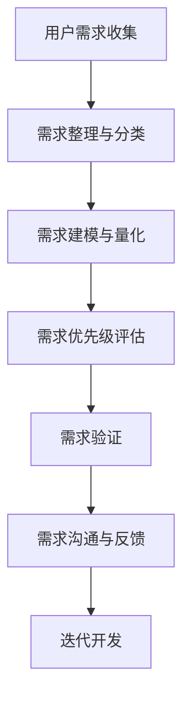

                 

## 1. 背景介绍

### 1.1 问题由来

在软件开发项目中，用户需求分析是一项关键且复杂的工作。良好的需求分析能够确保开发团队明确产品目标，减少项目风险，提升用户满意度。然而，实际工作中，很多项目因为需求不明确、需求变更频繁、需求理解不足等问题，导致开发过程困难重重，甚至项目失败。

需求分析的困难在于：
- 用户对产品的理解通常模糊、泛泛，难以准确表达需求。
- 用户需求复杂多样，需求之间的优先级不明确。
- 需求难以量化，难以进行衡量和测试。
- 开发团队对用户需求的理解存在偏差，导致开发方向和用户期望不一致。

面对这些挑战，需要采用一套系统的、科学的方法，对用户需求进行全面、准确的分析。本文将详细探讨如何进行有效的用户需求分析，提出一套基于数据驱动和模型化的方法，帮助开发者更好地理解和满足用户需求。

### 1.2 问题核心关键点

进行有效的用户需求分析，需要关注以下几个核心关键点：
- 用户需求的收集与整理。从哪些渠道收集用户需求？如何整理和分类需求？
- 用户需求的建模与量化。如何将用户需求转化为可以量化的指标？
- 用户需求的优先级评估。如何评估需求的重要性和优先级？
- 用户需求的验证与测试。如何验证需求的准确性和完整性？
- 用户需求的沟通与反馈。如何确保开发团队与用户保持持续沟通，收集反馈？

本文将围绕这些关键点展开，结合实际案例，系统阐述用户需求分析的方法论和实践技巧。

## 2. 核心概念与联系

### 2.1 核心概念概述

在用户需求分析中，有几个核心概念至关重要：

- **用户需求(User Requirement)**：指用户在使用产品或服务时，对功能、性能、体验等方面的期望和要求。
- **功能需求(Functional Requirement)**：指产品或服务必须具备的功能性特性，如登录、支付、搜索等。
- **非功能需求(Non-Functional Requirement)**：指产品或服务的非功能性特性，如性能、安全、可用性等。
- **用户故事(User Story)**：一种通过用户场景描述需求的格式，以用户视角展现需求，易于理解。
- **用户画像(User Persona)**：通过构建典型的用户画像，帮助团队更好地理解目标用户，制定更加贴合用户需求的产品策略。
- **优先级矩阵(Priority Matrix)**：一种基于价值和风险的评估工具，用于确定需求的重要性和优先级。
- **需求验证(Verification)**：通过设计测试用例，验证需求是否满足用户期望。
- **迭代开发(Iterative Development)**：通过反复迭代验证和调整需求，确保产品最终满足用户期望。

这些概念之间存在密切的联系，共同构成了一个完整的用户需求分析框架。本节将通过以下Mermaid流程图，展示用户需求分析的主要步骤和过程：



## 3. 核心算法原理 & 具体操作步骤

### 3.1 算法原理概述

用户需求分析的本质是构建一个能够准确、全面反映用户期望的模型。该模型能够将用户需求转化为可以被开发团队理解和实现的规格，从而指导开发工作。用户需求分析的基本流程如下：

1. **用户需求收集**：通过调查、访谈、问卷等方法，从用户处收集需求信息。
2. **需求整理与分类**：将收集到的需求进行整理和分类，形成有组织的需求文档。
3. **需求建模与量化**：将需求转化为可量化的指标，如功能点、性能指标等。
4. **需求优先级评估**：根据需求的紧迫性和价值，评估需求的优先级。
5. **需求验证与测试**：设计测试用例，验证需求的准确性和完整性。
6. **需求沟通与反馈**：与用户保持持续沟通，收集反馈，不断调整和优化需求。

### 3.2 算法步骤详解

以下是详细的用户需求分析步骤：

**Step 1: 用户需求收集**
- **渠道选择**：选择合适的需求收集渠道，如用户访谈、问卷调查、用户体验测试、竞品分析等。
- **数据收集**：通过上述渠道，收集用户反馈和需求信息。

**Step 2: 需求整理与分类**
- **整理工具**：使用需求管理工具，如JIRA、Confluence等，整理和分类收集到的需求。
- **分类标准**：根据需求类型和业务领域，对需求进行分类。

**Step 3: 需求建模与量化**
- **模型选择**：选择合适的需求建模方法，如功能树、需求矩阵、用户故事图等。
- **量化指标**：将需求转化为可量化的指标，如功能点、性能指标、用户体验指标等。

**Step 4: 需求优先级评估**
- **优先级模型**：选择优先级评估模型，如MoSCoW法、Kano模型等。
- **评估标准**：根据需求的紧迫性和价值，评估需求的优先级。

**Step 5: 需求验证与测试**
- **测试设计**：设计测试用例，验证需求的准确性和完整性。
- **测试执行**：执行测试用例，收集测试结果。

**Step 6: 需求沟通与反馈**
- **沟通机制**：建立与用户的持续沟通机制，如定期会议、用户反馈渠道等。
- **反馈循环**：收集用户反馈，不断调整和优化需求。

**Step 7: 迭代开发**
- **迭代计划**：根据需求优先级，制定迭代开发计划。
- **迭代验证**：在每个迭代结束时，验证需求是否满足用户期望。

### 3.3 算法优缺点

用户需求分析的优点在于：
- 能够帮助团队明确产品目标，减少项目风险。
- 通过量化的方式，使需求更加具体和可执行。
- 通过持续沟通和反馈，确保需求与用户期望一致。

缺点在于：
- 需求收集和整理过程耗时较长，可能需要投入大量人力。
- 需求优先级评估和验证可能存在主观性和不确定性。
- 需求迭代过程中，可能需要频繁调整，增加开发复杂度。

### 3.4 算法应用领域

用户需求分析广泛应用于软件开发、产品设计、项目管理等领域。具体应用场景包括：

- **软件开发**：通过需求分析，明确产品功能和特性，指导软件开发工作。
- **产品设计**：通过用户画像和优先级评估，设计符合用户期望的产品界面和流程。
- **项目管理**：通过需求优先级评估和迭代开发，控制项目进度和质量。
- **用户体验改进**：通过用户反馈和需求验证，不断优化用户体验。
- **需求变更管理**：通过需求优先级评估和迭代开发，有效管理需求变更。

## 4. 数学模型和公式 & 详细讲解 & 举例说明

### 4.1 数学模型构建

用户需求分析的数学模型主要围绕以下几个方面构建：

1. **用户需求优先级评估**：
   - 优先级矩阵(Priority Matrix)：假设需求集合为 $D$，需求的价值为 $V_i$，风险为 $R_i$，则优先级 $P_i$ 可通过公式计算：
   $$
   P_i = \frac{V_i}{1+R_i}
   $$

2. **需求验证与测试**：
   - 测试覆盖率(Testing Coverage)：假设需求集合为 $D$，已测试需求集合为 $T$，则测试覆盖率 $C$ 可通过公式计算：
   $$
   C = \frac{|T|}{|D|}
   $$

### 4.2 公式推导过程

**优先级矩阵推导**：
- **需求价值(Vi)**：用户对需求的满意度。
- **需求风险(Ri)**：需求实现的难度和成本。
- **优先级(Pi)**：综合考虑需求价值和风险，确定优先级。

**测试覆盖率推导**：
- **已测试需求数量(T)**：已完成的测试用例数量。
- **需求总数(D)**：所有需求的数量。
- **测试覆盖率(C)**：已完成的测试用例占总需求的百分比。

### 4.3 案例分析与讲解

**案例背景**：
某电子商务平台需求复杂多样，需进行全面的需求分析，确保新功能的实现满足用户期望。

**需求收集**：
- **渠道选择**：通过用户访谈、问卷调查、用户体验测试等方式，收集用户需求。
- **数据收集**：收集到以下需求：
  - 功能需求：支付、订单管理、商品搜索。
  - 非功能需求：系统性能、安全性、用户界面。

**需求整理与分类**：
- **整理工具**：使用Confluence整理需求。
- **分类标准**：按功能、非功能需求进行分类。

**需求建模与量化**：
- **模型选择**：使用功能树模型。
- **量化指标**：将需求转化为功能点（FP），如支付功能需求为10 FP。

**需求优先级评估**：
- **优先级模型**：使用MoSCoW法。
- **评估标准**：支付功能需求为Must，系统性能为Should，用户界面为Nice，安全性为Could。

**需求验证与测试**：
- **测试设计**：设计支付功能测试用例。
- **测试执行**：执行测试用例，发现支付功能正常，系统性能达到要求。

**需求沟通与反馈**：
- **沟通机制**：建立定期会议机制，收集用户反馈。
- **反馈循环**：收集用户反馈，优化用户体验。

**迭代开发**：
- **迭代计划**：根据优先级，制定迭代开发计划。
- **迭代验证**：每个迭代结束后，验证需求是否满足用户期望。

## 5. 项目实践：代码实例和详细解释说明

### 5.1 开发环境搭建

进行用户需求分析，需要搭建合适的开发环境。以下是搭建环境的详细流程：

1. **选择工具**：选择合适的需求管理工具，如JIRA、Confluence等。
2. **安装配置**：安装工具，并进行基本配置。
3. **数据导入**：将收集到的需求数据导入工具。
4. **团队协作**：建立团队协作机制，如定期会议、任务分配等。

### 5.2 源代码详细实现

以下是使用Confluence进行需求整理的示例代码：

```python
from confluence import Confluence
import json

# 登录Confluence
confluence = Confluence(url='https://example.com', username='admin', password='admin')

# 获取需求列表
demand_list = confluence.get_content(space_key='SPC-需求分析', issue_type_key='需求')

# 存储需求数据
demand_data = []
for demand in demand_list:
    demand_data.append({
        'id': demand.id,
        'title': demand.title,
        'description': demand.description,
        'priority': demand.fields.priority.name
    })

# 输出需求数据
print(json.dumps(demand_data, indent=4))
```

### 5.3 代码解读与分析

**Confluence API**：
- `Confluence`：Confluence官方Python SDK。
- `get_content`：获取指定空间下的需求列表。

**需求数据格式**：
- `id`：需求ID。
- `title`：需求标题。
- `description`：需求描述。
- `priority`：需求优先级。

**需求数据存储**：
- 将需求数据存储为JSON格式，便于后续分析处理。

### 5.4 运行结果展示

执行上述代码，得到以下JSON格式的需求数据：

```json
[
    {
        "id": 1,
        "title": "支付功能",
        "description": "用户需要能够在线支付",
        "priority": "Must"
    },
    {
        "id": 2,
        "title": "订单管理",
        "description": "用户需要能够查看和管理订单",
        "priority": "Must"
    },
    {
        "id": 3,
        "title": "商品搜索",
        "description": "用户需要能够搜索商品",
        "priority": "Must"
    },
    {
        "id": 4,
        "title": "系统性能",
        "description": "系统需要具备良好的性能",
        "priority": "Should"
    },
    {
        "id": 5,
        "title": "安全性",
        "description": "系统需要具备高安全性",
        "priority": "Could"
    },
    {
        "id": 6,
        "title": "用户界面",
        "description": "用户界面需要简洁易用",
        "priority": "Nice"
    }
]
```

## 6. 实际应用场景

### 6.1 电子商务平台

在电子商务平台的需求分析中，可以通过以下步骤进行：

1. **需求收集**：
   - **渠道选择**：通过用户访谈、问卷调查等方式，收集用户需求。
   - **数据收集**：收集到以下需求：支付、订单管理、商品搜索、系统性能、安全性、用户界面。

2. **需求整理与分类**：
   - **整理工具**：使用Confluence整理需求。
   - **分类标准**：按功能、非功能需求进行分类。

3. **需求建模与量化**：
   - **模型选择**：使用功能树模型。
   - **量化指标**：将需求转化为功能点（FP），如支付功能需求为10 FP。

4. **需求优先级评估**：
   - **优先级模型**：使用MoSCoW法。
   - **评估标准**：支付功能为Must，系统性能为Should，用户界面为Nice，安全性为Could。

5. **需求验证与测试**：
   - **测试设计**：设计支付功能测试用例。
   - **测试执行**：执行测试用例，发现支付功能正常，系统性能达到要求。

6. **需求沟通与反馈**：
   - **沟通机制**：建立定期会议机制，收集用户反馈。
   - **反馈循环**：收集用户反馈，优化用户体验。

7. **迭代开发**：
   - **迭代计划**：根据优先级，制定迭代开发计划。
   - **迭代验证**：每个迭代结束后，验证需求是否满足用户期望。

通过上述步骤，可以有效确保电子商务平台的功能和性能满足用户期望。

### 6.2 医疗健康系统

在医疗健康系统需求分析中，可以通过以下步骤进行：

1. **需求收集**：
   - **渠道选择**：通过医生访谈、患者问卷调查等方式，收集用户需求。
   - **数据收集**：收集到以下需求：挂号预约、药品管理、病历管理、医生建议、系统性能、安全性、用户界面。

2. **需求整理与分类**：
   - **整理工具**：使用JIRA整理需求。
   - **分类标准**：按功能、非功能需求进行分类。

3. **需求建模与量化**：
   - **模型选择**：使用需求矩阵模型。
   - **量化指标**：将需求转化为功能点（FP），如挂号预约功能需求为20 FP。

4. **需求优先级评估**：
   - **优先级模型**：使用Kano模型。
   - **评估标准**：挂号预约为性能需求，医生建议为情感需求，系统性能为可靠性需求，用户界面为可操作性需求。

5. **需求验证与测试**：
   - **测试设计**：设计挂号预约功能测试用例。
   - **测试执行**：执行测试用例，发现挂号预约功能正常，系统性能达到要求。

6. **需求沟通与反馈**：
   - **沟通机制**：建立定期会议机制，收集医生和患者反馈。
   - **反馈循环**：收集反馈，优化用户体验。

7. **迭代开发**：
   - **迭代计划**：根据优先级，制定迭代开发计划。
   - **迭代验证**：每个迭代结束后，验证需求是否满足用户期望。

通过上述步骤，可以有效确保医疗健康系统的功能和安全性能满足医生和患者的期望。

## 7. 工具和资源推荐

### 7.1 学习资源推荐

为了帮助开发者系统掌握用户需求分析的理论基础和实践技巧，这里推荐一些优质的学习资源：

1. **《需求分析方法与实践》**：详细介绍需求分析的原理和具体方法，涵盖功能需求、非功能需求、优先级评估等方面。
2. **《用户需求分析实战》**：基于真实项目案例，讲解用户需求分析的详细步骤和方法。
3. **《软件需求分析基础》**：讲解需求分析的基本原理和常见工具，适合初学者入门。
4. **《软件需求工程》**：全面介绍需求工程的方法论和实践技巧，涵盖需求获取、建模、验证等方面。
5. **《需求分析与测试》**：结合案例，讲解需求分析的具体步骤和工具使用。

通过这些资源的学习实践，相信你一定能够快速掌握用户需求分析的精髓，并用于解决实际的开发问题。

### 7.2 开发工具推荐

高效的开发离不开优秀的工具支持。以下是几款用于用户需求分析开发的常用工具：

1. **JIRA**：功能强大的需求管理工具，支持需求跟踪、优先级评估、测试管理等功能。
2. **Confluence**：协作文档工具，支持需求整理、分类、文档管理等功能。
3. **Trello**：轻量级需求管理工具，支持看板、任务列表等功能。
4. **Asana**：项目管理工具，支持需求分配、进度跟踪等功能。
5. **Slack**：即时通讯工具，支持团队协作和沟通。

合理利用这些工具，可以显著提升用户需求分析的开发效率，加快创新迭代的步伐。

### 7.3 相关论文推荐

用户需求分析的研究已经积累了丰富的成果，以下是几篇具有代表性的论文，推荐阅读：

1. **《软件需求工程方法与实践》**：介绍需求工程的基本方法，包括需求获取、需求建模、需求验证等方面。
2. **《用户需求分析与实践》**：详细讲解用户需求分析的原理和具体方法，涵盖需求分类、优先级评估、需求验证等方面。
3. **《面向用户需求的软件开发》**：探讨如何从用户角度出发，进行软件开发的全生命周期管理。
4. **《软件需求工程趋势与挑战》**：分析需求工程面临的挑战和未来发展方向，探讨解决途径。

这些论文代表了大用户需求分析的发展脉络，阅读这些文献可以帮助你深入理解需求分析的原理和实践技巧。

## 8. 总结：未来发展趋势与挑战

### 8.1 总结

本文对如何进行有效的用户需求分析进行了详细探讨，提出了一套基于数据驱动和模型化的方法，帮助开发者更好地理解和满足用户需求。通过系统介绍用户需求分析的关键概念、核心算法和具体操作步骤，详细讲解了需求收集、整理、建模、评估、验证和反馈等环节，结合实际案例，提供了全面的需求分析方法和实践技巧。

用户需求分析的核心在于构建一个能够准确、全面反映用户期望的模型。该模型能够将用户需求转化为可以被开发团队理解和实现的规格，从而指导开发工作。通过系统性的需求分析，可以有效减少项目风险，提升用户满意度，确保产品最终满足用户期望。

### 8.2 未来发展趋势

展望未来，用户需求分析将呈现以下几个发展趋势：

1. **自动化需求分析**：借助人工智能和机器学习技术，自动进行需求收集、整理和优先级评估，提升需求分析效率。
2. **数据驱动的需求分析**：利用大数据分析技术，从用户行为数据中提取需求信息，提升需求分析的科学性和准确性。
3. **交互式需求分析**：通过智能对话系统，与用户进行交互，实时获取和验证用户需求，提升需求分析的互动性和实时性。
4. **多模态需求分析**：结合用户反馈、问卷调查、用户体验测试等多种数据源，进行综合分析，提升需求分析的全面性和准确性。
5. **需求分析的可视化**：通过数据可视化工具，将需求分析过程和结果呈现给用户和开发团队，提升需求的透明度和可理解性。

### 8.3 面临的挑战

尽管用户需求分析已取得显著进展，但在迈向智能化、自动化的过程中，仍面临诸多挑战：

1. **需求数据质量问题**：用户反馈和需求数据的质量往往参差不齐，需要有效的数据清洗和预处理。
2. **需求理解的偏差**：开发团队可能对用户需求的理解存在偏差，导致需求分析结果不准确。
3. **需求优先级的确定**：如何科学、合理地评估需求的优先级，需要更先进的需求优先级模型。
4. **需求验证的难度**：需求验证过程中，需要设计复杂的测试用例，并持续跟踪测试结果。
5. **需求变更管理**：需求分析过程中，需求可能频繁变更，如何有效管理需求变更，需要更灵活的需求跟踪和变更管理机制。

### 8.4 研究展望

面对用户需求分析的挑战，未来的研究需要在以下几个方面寻求新的突破：

1. **需求数据的自动化采集和处理**：通过自然语言处理和数据挖掘技术，自动化获取用户反馈和需求数据，进行有效的数据清洗和预处理。
2. **需求理解的智能辅助**：利用人工智能和机器学习技术，辅助开发团队进行需求理解，提升需求分析的准确性。
3. **需求优先级的科学评估**：研究更先进的需求优先级模型，科学、合理地评估需求的优先级。
4. **需求验证的自动化**：开发更智能的测试工具，自动化生成测试用例，提升需求验证的效率和准确性。
5. **需求变更的智能管理**：利用人工智能技术，智能分析和预测需求变更，实现更加灵活的需求跟踪和变更管理。

这些研究方向的探索发展，必将引领用户需求分析技术的进步，为软件开发项目提供更加科学、高效、可靠的需求分析方法。面向未来，用户需求分析技术还需要与其他人工智能技术进行更深入的融合，如自然语言处理、数据挖掘、机器学习等，多路径协同发力，共同推动需求分析技术的进步。

## 9. 附录：常见问题与解答

**Q1: 用户需求分析的目的是什么？**

A: 用户需求分析的目的是确保开发团队明确产品目标，减少项目风险，提升用户满意度。通过全面的需求分析，能够准确理解用户期望，制定符合用户需求的产品策略。

**Q2: 如何选择合适的需求收集渠道？**

A: 选择合适的需求收集渠道需要考虑用户特征、产品特性、产品类型等因素。常见的需求收集渠道包括用户访谈、问卷调查、用户体验测试、竞品分析等。

**Q3: 如何进行需求优先级评估？**

A: 需求优先级评估通常使用MoSCoW法、Kano模型等工具。MoSCoW法将需求分为Must、Should、Could、Won't，Kano模型将需求分为性能需求、情感需求等，评估需求的紧迫性和价值。

**Q4: 如何验证需求是否满足用户期望？**

A: 需求验证通常通过设计测试用例、执行测试用例、收集测试结果的方式进行。确保每个需求都经过充分验证，才能进入下一步开发。

**Q5: 如何确保开发团队与用户保持持续沟通？**

A: 建立定期的需求反馈机制，如定期会议、用户访谈、用户调研等。同时，使用协作工具如JIRA、Confluence等，便于团队协作和沟通。

通过这些问题的解答，相信你对用户需求分析有了更深入的理解，能够更好地应用于实际项目中。

