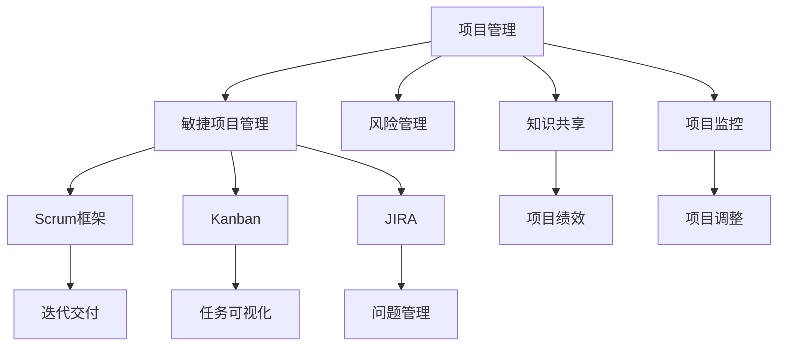

                 

## 1. 背景介绍

### 1.1 问题由来
在当今快速变化的技术环境中，项目管理和团队协作变得更加复杂和多样。无论是初创公司还是大型企业，都在不断寻求新的方法和工具来提高项目的成功率和团队的效率。项目管理是一个涉及多个学科和技能领域的综合性过程，需要平衡时间、成本、资源和质量等关键因素。与此同时，团队协作也面临诸如多样性、远程工作、知识共享等挑战。因此，如何有效地管理和优化项目，并构建高效的团队，成为了一个紧迫且复杂的问题。

### 1.2 问题核心关键点
本文将围绕以下核心关键点进行深入探讨：

- **项目管理原则**：阐述项目管理的基本原则和最佳实践。
- **团队协作方法**：介绍团队协作的不同方式，包括远程工作、多样性管理等。
- **工具和技术**：推荐和解释常用的项目管理工具和技术。
- **风险管理和监控**：分析项目管理中的常见风险和监控机制。
- **案例分析**：通过具体案例展示如何应对实际项目中的挑战。
- **未来趋势**：探讨项目管理领域的新兴趋势和技术。

## 2. 核心概念与联系

### 2.1 核心概念概述

- **项目管理（Project Management）**：指通过计划、执行、监控和控制项目过程，以实现项目目标的系统方法。
- **敏捷项目管理（Agile Project Management）**：一种迭代和增量的项目交付方法，强调快速响应变化和客户反馈。
- **Scrum框架**：敏捷项目管理中最流行的框架之一，通过短周期的迭代（Sprint）来实现快速交付和反馈循环。
- **Kanban**：一种流程管理方法，用于提高团队协作和任务可视化。
- **JIRA**：一款流行的项目管理工具，提供敏捷开发、故障追踪和问题管理等功能。
- **风险管理（Risk Management）**：识别、分析和缓解项目中的潜在风险，以确保项目顺利完成。
- **项目监控（Project Monitoring）**：通过定期评估项目进展，调整计划和资源，确保项目按计划进行。
- **知识共享（Knowledge Sharing）**：促进团队成员之间的信息交流和知识传递，提升团队整体能力。

这些核心概念之间存在紧密联系，形成了一个有机整体，共同支撑项目管理的有效实施和团队协作的顺畅进行。

### 2.2 核心概念原理和架构的 Mermaid 流程图



## 3. 核心算法原理 & 具体操作步骤

### 3.1 算法原理概述

项目管理算法的核心在于利用系统化的方法论和工具，确保项目能够按时、按预算、按质量要求完成。这些算法涉及多个阶段，包括项目规划、执行、监控和收尾。其基本原理可以概括为以下几个方面：

- **项目规划（Project Planning）**：通过定义项目目标、范围、时间表和资源计划，为项目的后续执行奠定基础。
- **资源分配（Resource Allocation）**：合理分配人力资源和物资资源，确保项目所需的资源得到有效利用。
- **风险评估（Risk Assessment）**：识别项目中的潜在风险，并制定相应的应对措施。
- **项目监控（Project Monitoring）**：通过定期评估项目进展，确保项目按照既定计划进行。
- **质量控制（Quality Control）**：确保项目交付的产品或服务符合质量标准。
- **项目收尾（Project Closure）**：对项目进行最终评估，确认项目成功，并释放相关资源。

### 3.2 算法步骤详解

**Step 1: 项目启动**
- 定义项目目标和范围，确保所有相关方对项目有共同的理解。
- 建立项目团队，明确各成员的角色和责任。
- 制定初步的项目计划，包括时间表、预算和资源需求。

**Step 2: 项目规划**
- 详细制定项目计划，包括任务分解、时间表和资源分配。
- 使用项目管理软件（如JIRA）进行任务跟踪和进度管理。
- 制定风险管理计划，识别潜在的风险和应对策略。

**Step 3: 项目执行**
- 按照项目计划执行任务，确保每个任务按时完成。
- 通过定期会议和报告，监控项目进展，及时调整计划。
- 促进团队协作，确保信息共享和知识传递。

**Step 4: 项目监控**
- 定期评估项目进展，确保项目按照计划进行。
- 使用项目管理工具（如JIRA）进行进度跟踪和问题管理。
- 根据评估结果，调整项目计划和资源分配。

**Step 5: 项目收尾**
- 对项目进行最终评估，确认项目成功，并记录项目经验教训。
- 释放项目资源，关闭项目相关文档和工具。

### 3.3 算法优缺点

敏捷项目管理：
- **优点**：灵活响应变化，快速交付功能，支持迭代开发，易于团队协作。
- **缺点**：对项目管理和沟通要求高，可能需要更多的项目成员和资源。

Scrum框架：
- **优点**：高度透明，快速反馈，促进团队协作，提高生产效率。
- **缺点**：需要高度自律的团队和频繁的会议，可能不适用于所有项目。

Kanban：
- **优点**：可视化工作流程，易于任务管理和跟踪，适合复杂和动态的项目。
- **缺点**：对团队协作和沟通要求高，可能需要更多的项目管理工具。

JIRA：
- **优点**：强大的任务管理和问题跟踪功能，支持敏捷开发和传统项目管理。
- **缺点**：复杂的学习曲线，可能不适合小型项目。

### 3.4 算法应用领域

敏捷项目管理适用于需要快速响应变化和客户反馈的项目，如软件开发、产品开发等。Scrum框架特别适用于复杂的软件开发项目，确保快速迭代和交付。Kanban适用于需要高度可视化和管理的工作流程，如产品管理和市场营销等。JIRA适用于大型项目管理，支持敏捷开发、故障追踪和问题管理等功能。

## 4. 数学模型和公式 & 详细讲解 & 举例说明

### 4.1 数学模型构建

在项目管理中，可以使用数学模型来量化和优化项目的关键指标，如时间、成本和资源。以下是一个简单的数学模型，用于计算项目的整体进展：

- **时间：** $T = T_0 + \sum_{i=1}^n t_i$
- **成本：** $C = C_0 + \sum_{i=1}^n c_i$
- **资源分配：** $R = \sum_{i=1}^n r_i$

其中，$T$ 和 $C$ 分别代表项目总时间和总成本，$t_i$ 和 $c_i$ 分别代表第 $i$ 个任务的时间和成本，$T_0$ 和 $C_0$ 分别代表项目启动时的初始时间和成本，$r_i$ 代表第 $i$ 个任务所需的资源。

### 4.2 公式推导过程

- **时间公式推导**：
$$
T = T_0 + \sum_{i=1}^n t_i
$$
- **成本公式推导**：
$$
C = C_0 + \sum_{i=1}^n c_i
$$
- **资源分配公式推导**：
$$
R = \sum_{i=1}^n r_i
$$

### 4.3 案例分析与讲解

**案例：软件开发项目**

假设一个软件开发项目分为五个阶段，每个阶段的时间、成本和资源分配如下：

| 阶段 | 时间（周） | 成本（万元） | 资源（人） |
| --- | --- | --- | --- |
| 需求分析 | 2 | 5 | 3 |
| 设计 | 4 | 10 | 4 |
| 开发 | 6 | 20 | 6 |
| 测试 | 3 | 15 | 4 |
| 部署 | 2 | 8 | 3 |

使用上述数学模型，可以计算出项目的总时间和总成本，并确定每个阶段所需的资源。

## 5. 项目实践：代码实例和详细解释说明

### 5.1 开发环境搭建

项目管理工具的选择和使用是项目成功的关键。以下是使用JIRA进行项目管理的开发环境搭建流程：

1. 安装JIRA服务器软件。
2. 配置数据库和JIRA环境变量。
3. 创建项目和问题类型。
4. 配置团队角色和权限。
5. 启动JIRA服务器。

### 5.2 源代码详细实现

**JIRA任务管理模块的Python代码实现**：

```python
from jira import JIRA

class JIRAModule:
    def __init__(self, jira_url, jira_username, jira_password):
        self.jira = JIRA(jira_url, auth=(jira_username, jira_password))

    def create_issue(self, project_key, summary, description):
        issue = self.jira.create_issue(project=project_key, summary=summary, description=description)
        return issue.key

    def get_issues(self, project_key, issue_key):
        issues = self.jira.search_issues(jql=f"Issue in project {project_key} and key in ({issue_key})")
        return issues

    def update_issue(self, issue_key, field_name, new_value):
        self.jira.update_issue(issue_key, fields={field_name: new_value})

    def delete_issue(self, issue_key):
        self.jira.delete_issue(issue_key)
```

### 5.3 代码解读与分析

**JIRAModule类**：
- **__init__方法**：初始化JIRA客户端，需要提供JIRA服务器URL、用户名和密码。
- **create_issue方法**：创建新任务，需要指定项目键、任务摘要和任务描述。
- **get_issues方法**：根据项目键和任务键获取任务列表。
- **update_issue方法**：更新任务字段，需要指定任务键和新值。
- **delete_issue方法**：删除任务，需要指定任务键。

**实际应用场景**：
- 管理员使用JIRA模块创建和管理任务，记录项目的进展和问题。
- 团队成员通过JIRA查看和更新任务，确保项目按照计划进行。

### 5.4 运行结果展示

使用JIRA进行项目管理的实际效果展示：

1. **任务创建**：管理员创建新任务，分配给相应团队成员。
2. **任务更新**：团队成员在JIRA上更新任务状态和进度，管理员定期检查。
3. **任务删除**：项目完成后，管理员删除相关任务，释放资源。

## 6. 实际应用场景

### 6.1 智能客服系统

智能客服系统通过敏捷项目管理，确保快速响应客户需求，并提供持续的反馈和改进。Scrum框架被广泛应用于智能客服项目中，通过短周期的迭代（Sprint），快速交付功能，不断优化客户体验。Kanban方法用于可视化客服任务的工作流程，确保每个任务都有明确的负责人和时间节点。JIRA工具支持敏捷开发和传统项目管理，帮助客服团队高效协作和问题管理。

### 6.2 金融科技项目

金融科技项目通常涉及复杂的业务流程和高度保密的需求。敏捷项目管理帮助金融科技团队快速响应市场变化和客户反馈。Scrum框架确保快速迭代和交付，Kanban方法用于任务可视化和管理。JIRA工具支持问题跟踪和故障管理，确保项目按计划进行。

### 6.3 在线教育平台

在线教育平台需要快速迭代和持续优化课程内容。敏捷项目管理帮助教育团队快速交付新功能，支持学生和教师的反馈。Scrum框架用于敏捷开发，Kanban方法用于任务管理。JIRA工具支持问题追踪和故障管理，确保平台稳定运行。

## 7. 工具和资源推荐

### 7.1 学习资源推荐

为了帮助开发者系统掌握项目管理和团队协作的理论基础和实践技巧，以下是一些优质的学习资源：

1. **《敏捷项目管理：Scrum实战指南》**：由敏捷管理专家David Sutherland撰写，详细介绍了Scrum框架和敏捷项目管理的最佳实践。
2. **《JIRA指南》**：官方文档和用户手册，提供了全面的JIRA功能介绍和使用示例。
3. **Coursera敏捷项目管理课程**：由知名大学和公司联合开设，提供系统化的敏捷项目管理知识和技能培训。
4. **Udemy敏捷开发课程**：提供实用的Scrum框架和敏捷项目管理实践课程，适合初学者和进阶开发者。

### 7.2 开发工具推荐

项目管理工具的选择和使用是项目成功的关键。以下是几款常用的项目管理工具：

1. **JIRA**：强大的项目管理工具，支持敏捷开发和传统项目管理，适用于各类规模的项目。
2. **Trello**：简单易用的项目管理工具，适合小型项目和团队协作。
3. **Asana**：灵活的项目管理工具，支持任务分配、时间线和进度跟踪。
4. **Monday.com**：全面的项目管理工具，支持敏捷开发、任务管理、资源分配等功能。
5. **Basecamp**：简单易用的项目管理工具，适合小型团队和项目管理。

合理利用这些工具，可以显著提升项目管理的效率和效果，确保项目按时、按预算、按质量要求完成。

### 7.3 相关论文推荐

项目管理领域的研究始于上世纪八十年代，经过多年的发展和创新，已经形成了一系列的理论和实践成果。以下是几篇奠基性的相关论文，推荐阅读：

1. **《敏捷软件开发：原则、模式和实践》**：定义了敏捷软件开发的原则和实践，是敏捷项目管理的重要参考资料。
2. **《Scrum指南：敏捷框架的实践》**：由Scrum联盟发布，详细介绍了Scrum框架的实践和最佳实践。
3. **《Kanban方法：执行顺利的敏捷项目管理实践》**：介绍了Kanban方法的理论基础和实践应用。
4. **《项目管理和敏捷开发的数学模型》**：从数学角度分析了项目管理中的关键指标和时间成本，提供了优化项目的数学模型。

这些论文代表了大项目管理的研究方向，通过学习这些前沿成果，可以帮助研究者把握学科前进方向，激发更多的创新灵感。

## 8. 总结：未来发展趋势与挑战

### 8.1 总结

本文对项目管理的基本概念、算法原理、操作步骤、应用场景等进行了系统介绍。通过本文的系统梳理，可以看到，项目管理是一个涉及多个学科和技能领域的综合性过程，需要平衡时间、成本、资源和质量等关键因素。通过合理的项目管理工具和技术，可以有效提升项目管理的效率和效果，确保项目按时、按预算、按质量要求完成。

### 8.2 未来发展趋势

展望未来，项目管理技术将呈现以下几个发展趋势：

1. **自动化和智能化**：项目管理工具将更加自动化和智能化，通过数据分析和机器学习，提升项目管理效率和决策质量。
2. **可视化和大数据**：项目管理将更加依赖可视化工具和大数据分析，帮助管理者及时发现和解决问题。
3. **人工智能和机器学习**：AI和ML技术将进一步应用于项目管理，提高项目的灵活性和适应性。
4. **分布式和云化**：项目管理将越来越多地依赖分布式和云化技术，提升项目的可扩展性和弹性。
5. **实时监控和反馈**：实时监控和反馈机制将帮助项目管理团队及时调整计划和资源，确保项目顺利进行。

这些趋势凸显了项目管理技术的广阔前景，为项目管理的现代化和智能化提供了新的思路和方法。

### 8.3 面临的挑战

尽管项目管理技术已经取得了显著进步，但在迈向更加智能化、普适化应用的过程中，它仍面临着诸多挑战：

1. **复杂性增加**：随着项目规模和复杂性的增加，项目管理的复杂性和难度也在增加，需要更多先进的管理工具和技术。
2. **人才短缺**：敏捷和敏捷项目管理需要高素质的管理人才，但当前具备相关技能的从业人员相对较少。
3. **技术更新快**：项目管理工具和技术更新速度快，需要团队持续学习和适应新的技术和工具。
4. **跨文化管理**：项目管理往往涉及跨文化团队和项目，需要高效的沟通和协作机制。
5. **成本控制**：项目管理需要平衡时间、成本和质量，确保项目在预算内完成。

### 8.4 研究展望

面对项目管理面临的挑战，未来的研究需要在以下几个方面寻求新的突破：

1. **智能化项目管理**：引入AI和ML技术，提升项目管理工具的智能化水平，提高决策质量和项目管理效率。
2. **自动化项目管理**：开发自动化项目管理工具，减少人工干预和错误，提升项目管理效率。
3. **跨文化项目管理**：研究和探索跨文化管理机制，提升团队协作和沟通效率。
4. **项目风险管理**：深入研究项目风险管理和监控机制，提高项目应对风险的能力。
5. **项目绩效评估**：研究和开发更全面、精准的项目绩效评估方法，确保项目按时、按预算、按质量要求完成。

这些研究方向将推动项目管理技术向更高层次发展，为构建更加高效、智能的项目管理系统提供新的思路和方法。

## 9. 附录：常见问题与解答

**Q1：项目管理的主要步骤有哪些？**

A: 项目管理的主要步骤包括项目启动、规划、执行、监控和收尾。项目启动阶段，明确项目目标和范围；项目规划阶段，制定详细的时间表和资源计划；项目执行阶段，按照计划执行任务；项目监控阶段，定期评估项目进展并调整计划；项目收尾阶段，对项目进行最终评估并释放资源。

**Q2：如何选择合适的项目管理工具？**

A: 选择合适的项目管理工具需要考虑以下几个方面：
1. 项目规模和复杂度。
2. 团队协作需求。
3. 预算和资源限制。
4. 功能和易用性。
5. 可扩展性和维护性。

常见的项目管理工具包括JIRA、Trello、Asana、Monday.com等，根据项目的具体需求选择合适的工具。

**Q3：如何在项目管理中避免过高的成本？**

A: 避免过高的项目管理成本需要从以下几个方面入手：
1. 合理规划项目范围和目标，避免过度设计和冗余功能。
2. 采用敏捷和迭代开发方法，快速交付功能并接受客户反馈。
3. 优化资源分配，避免资源浪费。
4. 使用自动化工具和技术，提高工作效率。
5. 定期评估项目进展，及时调整计划和资源。

通过这些措施，可以有效地控制项目管理成本，确保项目按时、按预算、按质量要求完成。

**Q4：如何在敏捷项目管理中保持团队高效率？**

A: 保持敏捷项目管理团队高效率需要从以下几个方面入手：
1. 明确的团队目标和角色分配。
2. 高效的任务分解和分配机制。
3. 持续的沟通和协作机制。
4. 定期的回顾和改进机制。
5. 灵活的项目管理工具和技术支持。

通过这些措施，可以有效地提升敏捷管理团队的高效率，确保项目快速交付和持续改进。

**Q5：如何在项目管理中引入知识共享机制？**

A: 引入知识共享机制可以提高团队整体能力，提升项目管理的效率和质量。具体方法包括：
1. 创建知识库和文档管理工具，记录和共享项目经验和知识。
2. 定期组织团队会议和知识分享会，促进信息交流和经验传递。
3. 鼓励团队成员主动分享和学习新知识。
4. 利用协作平台和项目管理工具，实现知识共享和协作。

通过这些措施，可以有效提升团队的知识共享和协作水平，确保项目按计划顺利进行。

---

作者：禅与计算机程序设计艺术 / Zen and the Art of Computer Programming

