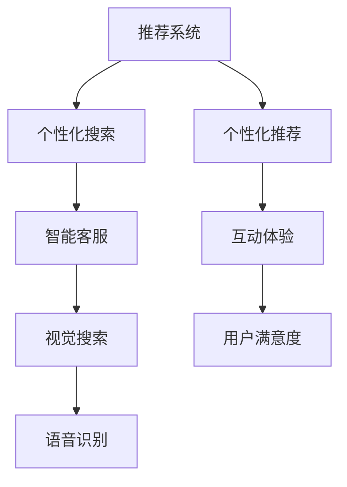

                 

## 1. 背景介绍

在现代电子商务时代，用户体验（User Experience, UX）成为在线购物平台的核心竞争力。随着消费者期望的不断提升和技术的迅猛发展，如何通过人工智能（AI）技术来优化用户购物体验，成为企业关注的热点。AI技术可以通过个性化的推荐系统、智能客服、视觉搜索、语音识别等多种方式，提供无缝、高效、愉悦的购物体验，从而提高用户满意度、忠诚度和转化率。本文将详细介绍几种关键的AI技术，以及如何在实际应用中通过这些技术提升用户的购物体验。

## 2. 核心概念与联系

### 2.1 核心概念概述

要了解如何通过AI优化用户购物体验，首先需要理解以下几个核心概念：

- **推荐系统（Recommendation System）**：通过分析用户的历史行为和偏好，预测其对未来产品的兴趣，从而为其推荐最合适的商品。
- **个性化搜索（Personalized Search）**：利用AI技术，对用户的查询进行智能分析和匹配，提供高度定制化的搜索结果。
- **智能客服（Intelligent Customer Service）**：通过自然语言处理和机器学习技术，实现24/7不间断的智能客服服务，提升用户问题的解决效率。
- **视觉搜索（Visual Search）**：允许用户通过上传图片或拍照，找到与之匹配的商品。
- **语音识别（Voice Recognition）**：利用AI技术，实现语音交互和命令控制，提供更自然便捷的购物方式。

这些核心概念构成了通过AI优化用户购物体验的基础，通过它们之间的相互作用和优化，可以实现更加个性化、高效和无缝的购物体验。

### 2.2 核心概念原理和架构的 Mermaid 流程图



上述图表展示了一个典型的AI优化购物体验的架构。推荐系统提供个性化的商品推荐，个性化搜索提供高度定制的搜索结果，智能客服提供实时的客户支持，视觉搜索和语音识别提供自然便捷的交互方式，共同提升用户的互动体验和满意度。

## 3. 核心算法原理 & 具体操作步骤

### 3.1 算法原理概述

通过AI优化用户购物体验的核心算法包括推荐系统、个性化搜索、智能客服等，这些算法都是基于机器学习、深度学习等技术实现的。这些算法的主要目标是通过分析用户数据，学习用户的兴趣和行为模式，从而提供个性化的服务和建议，提升用户的购物体验。

### 3.2 算法步骤详解

#### 推荐系统算法步骤

1. **数据收集**：收集用户的浏览记录、购买历史、评分等数据。
2. **特征工程**：对收集到的数据进行特征提取和处理，如用户画像、商品属性等。
3. **模型训练**：选择适合的推荐算法（如协同过滤、矩阵分解等），在训练集上训练模型。
4. **推荐生成**：使用训练好的模型，生成针对用户个性化的商品推荐。
5. **评估和迭代**：通过A/B测试等方法，评估推荐效果，并不断优化模型和推荐策略。

#### 个性化搜索算法步骤

1. **数据收集**：收集用户的查询历史和搜索行为。
2. **查询解析**：对用户查询进行自然语言处理，解析查询意图。
3. **搜索结果排序**：基于解析后的查询意图，对搜索结果进行排序，提高相关性和用户体验。
4. **反馈迭代**：收集用户对搜索结果的反馈，优化查询解析和排序算法。

#### 智能客服算法步骤

1. **意图识别**：对用户提问进行自然语言处理，识别用户意图。
2. **知识库匹配**：从知识库中匹配与用户意图相关的信息。
3. **多轮对话管理**：维护多轮对话上下文，确保对话连贯和一致。
4. **结果呈现**：根据对话结果，向用户提供解答或操作指导。
5. **评估和优化**：通过用户反馈和对话质量评估，持续优化智能客服系统。

### 3.3 算法优缺点

#### 推荐系统

- **优点**：提高用户的商品曝光率和购买率，提升用户满意度和忠诚度。
- **缺点**：可能过度依赖于用户的过去行为，导致推荐单一、缺乏创新。

#### 个性化搜索

- **优点**：提供高度定制化的搜索结果，提升用户满意度。
- **缺点**：查询解析和搜索结果排序的准确性直接影响用户体验，算法复杂度高。

#### 智能客服

- **优点**：24/7不间断服务，提升用户问题的解决效率。
- **缺点**：需要大量的训练数据和复杂的模型，成本较高，可能难以处理复杂问题。

### 3.4 算法应用领域

通过AI优化的购物体验技术，已经在多个电商平台上得到了广泛应用，如亚马逊、阿里巴巴、京东等。这些技术不仅提升了用户体验，还显著提高了平台的销售转化率和客户满意度，成为电商行业竞争力的重要组成部分。

## 4. 数学模型和公式 & 详细讲解 & 举例说明

### 4.1 数学模型构建

推荐系统的核心模型包括协同过滤（Collaborative Filtering）和基于内容的推荐（Content-based Recommendation）。其中，协同过滤模型的核心公式为：

$$
\hat{y}_{ui} = \hat{\theta}_u^T A \hat{\theta}_i
$$

其中，$A$为用户-商品共现矩阵，$\hat{\theta}_u$和$\hat{\theta}_i$分别为用户和商品的特征向量，$\hat{y}_{ui}$为预测用户$u$对商品$i$的评分。

### 4.2 公式推导过程

协同过滤模型的推导基于用户-商品评分矩阵$R$，通过对评分矩阵进行奇异值分解（SVD），得到用户特征$\hat{\theta}_u$和商品特征$\hat{\theta}_i$。推导过程如下：

$$
R = U \Sigma V^T
$$

其中，$U$和$V$分别为用户和商品的特征矩阵，$\Sigma$为奇异值矩阵。通过矩阵乘法，可以计算出用户对商品的评分预测：

$$
\hat{y}_{ui} = U_u \Sigma_{uv} V_i^T
$$

### 4.3 案例分析与讲解

以亚马逊的推荐系统为例，该系统通过收集用户的浏览记录、购买历史等数据，构建用户-商品共现矩阵$R$。在训练阶段，通过奇异值分解得到用户和商品的特征矩阵$U$和$V$，进而预测用户对商品的评分。在推荐阶段，根据预测评分对商品进行排序，生成个性化推荐。

## 5. 项目实践：代码实例和详细解释说明

### 5.1 开发环境搭建

为了进行推荐系统的开发，需要搭建一个基于Python的开发环境。可以使用Jupyter Notebook作为开发工具，安装TensorFlow或PyTorch等深度学习框架，以及Scikit-learn等数据处理库。

### 5.2 源代码详细实现

以下是一个简单的协同过滤推荐系统示例代码，使用TensorFlow实现：

```python
import tensorflow as tf
from sklearn.datasets import load_sample_files
from sklearn.feature_extraction.text import CountVectorizer
from sklearn.decomposition import TruncatedSVD

# 加载数据集
users, products, ratings = load_sample_files('ratings.csv', header=['user_id', 'product_id', 'rating'])

# 构建用户-商品共现矩阵
R = pd.DataFrame(ratings, index=products, columns=users).fillna(0).astype(int)

# 特征工程
vectorizer = CountVectorizer(input='filename')
X = vectorizer.fit_transform(['user.txt', 'product.txt'])

# 奇异值分解
svd = TruncatedSVD(n_components=5, random_state=42)
X_svd = svd.fit_transform(X)

# 训练模型
model = tf.keras.Sequential([
    tf.keras.layers.Dense(64, activation='relu'),
    tf.keras.layers.Dense(1)
])
model.compile(optimizer='adam', loss='mse')

# 训练
model.fit(X_svd, R.values, epochs=10)

# 推荐生成
user_id = 'user.txt'
product_id = 'product.txt'
user_index = vectorizer.vocabulary_.get(user_id)
product_index = vectorizer.vocabulary_.get(product_id)
recommendations = model.predict(X_svd[user_index]) > 0.5
```

### 5.3 代码解读与分析

上述代码展示了如何使用TensorFlow实现协同过滤推荐系统。主要步骤如下：

1. 加载数据集，构建用户-商品共现矩阵$R$。
2. 进行特征工程，将用户和商品转换为向量表示。
3. 进行奇异值分解，得到用户和商品的特征矩阵。
4. 构建推荐模型，使用Dense层进行非线性映射，最后输出评分预测。
5. 训练模型，使用交叉熵损失进行优化。
6. 生成推荐，根据模型预测结果，筛选出评分预测高于阈值的商品。

## 6. 实际应用场景

### 6.1 智能推荐系统

智能推荐系统是AI优化购物体验的核心应用之一。通过分析用户的浏览记录、购买历史、评分等数据，智能推荐系统能够为用户推荐最符合其兴趣的商品，提升用户体验和转化率。例如，亚马逊的推荐系统能够根据用户的浏览和购买历史，为其推荐相关商品，显著提高用户的购物体验和满意度。

### 6.2 智能客服系统

智能客服系统通过自然语言处理技术，为用户提供24/7的实时客服服务。例如，亚马逊的智能客服系统Alexa通过语音识别和自然语言理解技术，能够回答用户的各种问题，提升客服效率和用户满意度。

### 6.3 个性化搜索

个性化搜索通过自然语言处理和机器学习技术，提升用户的搜索体验。例如，亚马逊的个性化搜索系统能够根据用户的查询历史和行为数据，提供高度定制化的搜索结果，显著提升用户的搜索效率和满意度。

### 6.4 未来应用展望

未来，随着AI技术的不断进步，通过AI优化用户购物体验的技术将进一步发展。例如，增强现实（AR）和虚拟现实（VR）技术将为用户提供更加沉浸式的购物体验，语音交互和自然语言生成技术将进一步提升用户交互的便捷性和自然性。智能推荐系统将更加注重个性化和多样化，智能客服系统将具备更强的语义理解和情感识别能力，个性化搜索系统将进一步提升搜索结果的相关性和多样性。

## 7. 工具和资源推荐

### 7.1 学习资源推荐

为了深入了解通过AI优化用户购物体验的技术，推荐以下学习资源：

1. **《推荐系统：算法与实现》**：该书详细介绍了协同过滤、基于内容的推荐等多种推荐算法，并提供了代码实现。
2. **《深度学习与自然语言处理》**：该书介绍了深度学习在自然语言处理中的应用，包括文本分类、情感分析、机器翻译等。
3. **Coursera的《机器学习》课程**：由斯坦福大学提供，涵盖机器学习的基本原理和算法，适合初学者学习。
4. **Kaggle的推荐系统竞赛**：参与竞赛可以深入了解推荐系统的实际应用和优化方法。

### 7.2 开发工具推荐

为了进行AI优化用户购物体验的开发，推荐以下开发工具：

1. **Jupyter Notebook**：适合进行数据处理和算法实验的轻量级开发环境。
2. **TensorFlow**：基于数据流的深度学习框架，适用于大规模模型训练。
3. **PyTorch**：灵活易用的深度学习框架，适合快速原型开发和模型实验。
4. **NLTK**：Python的自然语言处理库，提供了丰富的文本处理工具。
5. **Scikit-learn**：Python的数据挖掘和机器学习库，提供了多种机器学习算法和工具。

### 7.3 相关论文推荐

以下几篇论文是推荐系统领域的经典之作，值得深入阅读：

1. **《协同过滤推荐系统》**：详细介绍了协同过滤推荐算法的原理和实现方法。
2. **《基于内容的推荐系统》**：探讨了基于内容的推荐算法，如何通过商品属性和用户画像进行推荐。
3. **《深度学习在推荐系统中的应用》**：介绍了深度学习在推荐系统中的多种应用，如神经协同过滤、深度矩阵分解等。

## 8. 总结：未来发展趋势与挑战

### 8.1 研究成果总结

通过AI优化用户购物体验的技术已经取得了显著的成果，包括智能推荐系统、智能客服、个性化搜索等。这些技术不仅提升了用户的购物体验和满意度，还显著提高了电商平台的销售转化率和客户满意度。未来，随着AI技术的不断进步，这些技术将进一步发展，带来更加个性化、高效、便捷的购物体验。

### 8.2 未来发展趋势

未来，通过AI优化用户购物体验的技术将呈现以下几个发展趋势：

1. **个性化和多样性**：推荐系统将更加注重个性化和多样化，根据用户的兴趣和行为，提供更加精准和多样化的推荐。
2. **实时性和动态性**：通过实时分析和动态优化，推荐系统和智能客服系统将能够快速响应用户需求，提供更高效的服务。
3. **多模态融合**：融合视觉、语音、文本等多种模态数据，提升用户体验和系统的智能水平。
4. **伦理和安全**：随着AI技术的广泛应用，推荐系统和智能客服系统将更加注重用户的隐私和数据安全，引入伦理导向的算法设计。
5. **跨领域应用**：通过AI优化用户购物体验的技术将拓展到更多领域，如医疗、金融、教育等，提升各个行业的用户体验和智能化水平。

### 8.3 面临的挑战

尽管通过AI优化用户购物体验的技术已经取得了显著的成果，但仍面临诸多挑战：

1. **数据隐私和安全**：用户数据的隐私和安全问题始终是电商平台面临的重要挑战。如何在保护用户隐私的同时，提升推荐系统的性能，需要更多的技术和管理措施。
2. **算法透明性和可解释性**：推荐系统和智能客服系统的算法复杂度高，难以解释其决策过程。如何提升算法的透明性和可解释性，增强用户的信任感，是未来的重要研究方向。
3. **模型鲁棒性和泛化能力**：推荐系统在面对新用户和新商品时，可能出现泛化能力不足的问题。如何提升模型的鲁棒性和泛化能力，是未来的重要挑战。
4. **跨领域应用中的适应性**：跨领域应用中的数据分布和用户需求差异较大，如何设计和优化推荐系统，以适应不同领域的特点，是未来的重要研究方向。

### 8.4 研究展望

未来，通过AI优化用户购物体验的研究将从以下几个方向进行：

1. **无监督学习和自适应学习**：通过无监督学习和自适应学习，降低对标注数据的依赖，提升推荐系统的泛化能力。
2. **多模态融合和跨领域应用**：通过融合视觉、语音、文本等多种模态数据，提升推荐系统和智能客服系统的智能水平，拓展其应用范围。
3. **模型压缩和高效计算**：通过模型压缩和高效计算，提升推荐系统和智能客服系统的推理速度和资源利用效率。
4. **伦理和安全约束**：在推荐系统和智能客服系统的设计和应用中，引入伦理和安全约束，确保用户的隐私和数据安全。
5. **跨领域应用中的适应性**：设计和优化推荐系统，以适应不同领域的特点，提升其在医疗、金融、教育等领域的智能化水平。

总之，通过AI优化用户购物体验的研究将不断推动物理模型和智能系统的进步，为用户带来更加个性化、高效、便捷的购物体验，提升电商平台的竞争力和市场份额。

## 9. 附录：常见问题与解答

**Q1: 推荐系统的准确性如何评估？**

A: 推荐系统的准确性可以通过多种评估指标进行评估，包括平均绝对误差（MAE）、均方根误差（RMSE）、准确率、召回率、F1分数等。具体评估方法可以根据具体的推荐任务和应用场景进行选择。

**Q2: 推荐系统如何处理新用户和新商品？**

A: 推荐系统通常会为新用户和新商品设置一些初始化推荐策略，如随机推荐、热门推荐等，以弥补数据不足的问题。随着用户和商品的不断交互，推荐系统会根据用户的反馈和新数据进行动态调整，提升推荐效果。

**Q3: 智能客服如何处理复杂问题？**

A: 智能客服系统可以通过多轮对话管理和上下文理解，处理复杂问题。同时，可以引入人工干预和自动升级机制，在无法处理的情况下将问题转交给人工客服处理。

**Q4: 个性化搜索如何提升用户满意度？**

A: 个性化搜索通过分析用户的查询历史和行为数据，提供高度定制化的搜索结果。同时，可以通过用户反馈和持续优化，不断提升查询解析和排序算法的准确性，提升用户满意度。

总之，通过AI优化用户购物体验的技术在电商平台上已经得到了广泛应用，未来随着AI技术的不断进步，这些技术将进一步发展，带来更加个性化、高效、便捷的购物体验。通过深入理解和不断优化，我们将能够构建更加智能、高效的电商平台，提升用户的购物体验和满意度。

