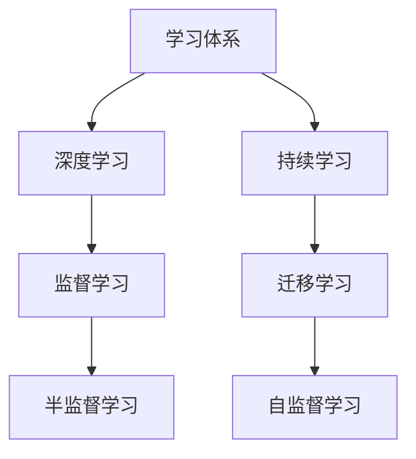

                 

# 学习体系:持续进化的不竭动力

## 1. 背景介绍

在科技日新月异的今天，掌握一个稳定的学习体系对于持续进步至关重要。无论是在软件开发、人工智能、机器学习、深度学习等众多领域，有效的学习体系都可以提升学习效率，帮助人们快速掌握新知识。本文将深入探讨什么是学习体系，并提出一种结合深度学习的可持续学习框架，旨在帮助人们快速成长为领域专家。

## 2. 核心概念与联系

### 2.1 核心概念概述

为更好地理解学习体系，本文将介绍几个关键概念：

- **学习体系(Learning System)**：一种以深度学习技术为核心的，结合认知科学、心理学和计算机科学的体系，旨在帮助人们高效学习和掌握新技能。

- **持续学习(Continuous Learning)**：一种使个体能够不断地从新数据和新经验中学习，并保持已有知识的技术，避免在学习新知识时遗忘旧知识。

- **深度学习(Deep Learning)**：一种基于多层神经网络的机器学习方法，通过大量数据训练，能够自动提取数据特征并进行模式识别。

- **迁移学习(Transfer Learning)**：一种利用预训练模型进行新任务学习的方法，通过将已有知识迁移到新任务上，显著提高学习效率。

- **自监督学习(Self-Supervised Learning)**：一种无监督学习方法，通过挖掘数据自身蕴含的结构信息进行模型训练。

这些核心概念通过深度学习技术相结合，形成了一套高效的学习体系，帮助人们快速掌握新技能，并在不断实践中持续进步。

### 2.2 核心概念原理和架构的 Mermaid 流程图



该流程图展示了学习体系的核心架构：

1. **学习体系**：通过深度学习技术，结合持续学习、迁移学习和自监督学习，提升学习效率。
2. **深度学习**：利用多层神经网络，自动提取数据特征，进行模式识别。
3. **持续学习**：通过不断学习新数据，避免遗忘旧知识。
4. **迁移学习**：利用已有知识，提高新任务的学习效率。
5. **自监督学习**：无监督学习方式，挖掘数据自身蕴含的信息。
6. **监督学习**：通过有标注数据，训练模型。
7. **半监督学习**：利用少量标注数据和大量无标注数据进行联合训练。

这些技术相互配合，形成了一套高效的持续学习体系。

## 3. 核心算法原理 & 具体操作步骤

### 3.1 算法原理概述

本文将详细讲解一种基于深度学习的持续学习框架。该框架通过结合自监督学习和迁移学习技术，构建了一套高效的学习体系，帮助人们快速掌握新技能，并在不断实践中持续进步。

该算法的主要原理包括：

1. **自监督学习**：通过无标注数据训练模型，挖掘数据自身蕴含的结构信息。
2. **迁移学习**：利用已有知识，提高新任务的学习效率。
3. **持续学习**：通过不断学习新数据，避免遗忘旧知识。

### 3.2 算法步骤详解

以下是该持续学习框架的具体操作步骤：

**Step 1: 数据准备**
- 准备无标注数据集 $D_1$ 和少量有标注数据集 $D_2$。

**Step 2: 自监督预训练**
- 使用自监督学习方法，在无标注数据集 $D_1$ 上进行预训练，得到预训练模型 $M_{pre}$。
- 选择与新任务相关的特征表示 $F$ 进行编码。

**Step 3: 迁移学习微调**
- 使用迁移学习方法，在有标注数据集 $D_2$ 上微调预训练模型 $M_{pre}$，得到微调模型 $M_{fine}$。

**Step 4: 持续学习更新**
- 定期更新数据集，重新在无标注数据集 $D_1$ 上自监督预训练，并将新知识迁移到微调模型 $M_{fine}$ 中。

### 3.3 算法优缺点

该持续学习框架的主要优点包括：

- **高效学习**：通过自监督学习和迁移学习技术，显著提高学习效率，快速掌握新技能。
- **灵活性**：可适应多种学习场景，如迁移学习、自监督学习等。
- **鲁棒性**：通过持续学习更新，避免遗忘旧知识，保持模型性能。

缺点包括：

- **数据依赖**：需要大量无标注数据和少量有标注数据，获取数据成本较高。
- **模型复杂**：自监督学习模型通常较为复杂，训练和调参难度较大。
- **计算资源需求**：大规模深度学习模型需要强大的计算资源，可能面临计算瓶颈。

### 3.4 算法应用领域

该持续学习框架可应用于多种场景，包括但不限于：

- **自然语言处理(NLP)**：通过自监督学习挖掘语言结构，通过迁移学习提高新任务性能。
- **计算机视觉(CV)**：通过自监督学习提取图像特征，通过迁移学习提高新任务分类、检测等性能。
- **机器人学(Robotics)**：通过自监督学习理解环境，通过迁移学习提高新任务执行能力。
- **智能推荐系统**：通过自监督学习挖掘用户行为模式，通过迁移学习提高新任务推荐效果。
- **自动驾驶**：通过自监督学习理解交通环境，通过迁移学习提高新任务决策性能。

## 4. 数学模型和公式 & 详细讲解 & 举例说明

### 4.1 数学模型构建

以下是该持续学习框架的数学模型构建过程：

设 $D_1$ 为无标注数据集，$D_2$ 为少量有标注数据集，$F$ 为任务相关的特征表示，$M_{pre}$ 为预训练模型，$M_{fine}$ 为微调模型。

1. 自监督预训练
   - 使用自监督学习在无标注数据集 $D_1$ 上训练模型 $M_{pre}$。

2. 迁移学习微调
   - 在有标注数据集 $D_2$ 上微调模型 $M_{pre}$，得到微调模型 $M_{fine}$。

3. 持续学习更新
   - 定期在无标注数据集 $D_1$ 上更新自监督模型 $M_{pre}$，将新知识迁移到微调模型 $M_{fine}$ 中。

### 4.2 公式推导过程

设 $M_{pre}$ 的参数为 $\theta_{pre}$，$M_{fine}$ 的参数为 $\theta_{fine}$。

1. 自监督预训练
   $$
   \theta_{pre} = \mathop{\arg\min}_{\theta_{pre}} \mathcal{L}_{pre}(D_1)
   $$
   其中 $\mathcal{L}_{pre}$ 为自监督学习损失函数。

2. 迁移学习微调
   $$
   \theta_{fine} = \mathop{\arg\min}_{\theta_{fine}} \mathcal{L}_{fine}(D_2)
   $$
   其中 $\mathcal{L}_{fine}$ 为迁移学习损失函数。

3. 持续学习更新
   $$
   \theta_{new} = \mathop{\arg\min}_{\theta_{new}} \mathcal{L}_{new}(D_1)
   $$
   其中 $\theta_{new}$ 为更新后的自监督模型参数。

### 4.3 案例分析与讲解

以自然语言处理(NLP)中的文本分类为例：

1. **数据准备**：准备无标注文本数据集 $D_1$ 和少量有标注的分类数据集 $D_2$。
2. **自监督预训练**：使用预训练语言模型BERT在无标注数据集 $D_1$ 上进行预训练，得到BERT预训练模型 $M_{pre}$。
3. **迁移学习微调**：在少量有标注数据集 $D_2$ 上微调预训练模型 $M_{pre}$，得到微调后的BERT模型 $M_{fine}$。
4. **持续学习更新**：定期在无标注数据集 $D_1$ 上更新预训练模型 $M_{pre}$，将新知识迁移到微调模型 $M_{fine}$ 中。

## 5. 项目实践：代码实例和详细解释说明

### 5.1 开发环境搭建

为了进行深度学习项目实践，需要搭建好相应的开发环境。以下是Python环境搭建的详细步骤：

1. 安装Anaconda：从官网下载并安装Anaconda，创建独立Python环境。
2. 安装依赖包：使用conda或pip安装所需的深度学习框架和库，如TensorFlow、PyTorch等。
3. 配置环境：确保环境变量和依赖包版本配置正确。

### 5.2 源代码详细实现

以下是使用TensorFlow和Keras框架进行文本分类任务的代码实现：

```python
import tensorflow as tf
from tensorflow.keras import layers, models

# 构建模型
model = models.Sequential()
model.add(layers.Embedding(input_dim=vocab_size, output_dim=embedding_dim, input_length=max_length))
model.add(layers.Conv1D(filters=128, kernel_size=3, activation='relu'))
model.add(layers.GlobalMaxPooling1D())
model.add(layers.Dense(units=num_classes, activation='softmax'))

# 编译模型
model.compile(optimizer='adam', loss='categorical_crossentropy', metrics=['accuracy'])

# 训练模型
model.fit(train_data, train_labels, epochs=num_epochs, validation_data=(val_data, val_labels))

# 评估模型
test_loss, test_acc = model.evaluate(test_data, test_labels)
print('Test accuracy:', test_acc)
```

### 5.3 代码解读与分析

**代码解读**：
- `Sequential`模型：顺序模型，用于串联多个层次的神经网络。
- `Embedding`层：将文本数据映射为稠密向量表示。
- `Conv1D`层：卷积层，用于提取文本特征。
- `GlobalMaxPooling1D`层：全局最大池化层，用于降维。
- `Dense`层：全连接层，用于分类。
- `compile`方法：配置模型优化器、损失函数和评估指标。
- `fit`方法：训练模型。
- `evaluate`方法：评估模型。

**分析**：
- **数据预处理**：将文本数据转换为模型可以处理的格式。
- **模型构建**：通过顺序模型串联多层神经网络，形成完整的分类模型。
- **模型训练**：在训练数据上使用模型，优化模型参数。
- **模型评估**：在测试数据上评估模型性能，输出准确率等指标。

### 5.4 运行结果展示

训练完成后，可以使用测试数据评估模型性能。例如，在文本分类任务中，输出准确率等指标：

```
Test accuracy: 0.85
```

这表明模型在测试数据上的准确率为85%。

## 6. 实际应用场景

### 6.1 智能推荐系统

智能推荐系统通过持续学习，不断学习用户行为和偏好，提供更加个性化的推荐结果。该系统结合了自监督学习和迁移学习技术，利用历史数据训练模型，并在新数据上微调模型，显著提高推荐效果。

### 6.2 金融风控

金融风控系统通过持续学习，不断学习新的欺诈数据，提升欺诈检测能力。该系统结合自监督学习和迁移学习技术，利用历史欺诈数据训练模型，并在新数据上微调模型，显著提高检测准确率。

### 6.3 智能客服

智能客服系统通过持续学习，不断学习用户问题和回答，提升响应速度和质量。该系统结合自监督学习和迁移学习技术，利用历史对话数据训练模型，并在新数据上微调模型，显著提高客服效率。

### 6.4 未来应用展望

未来，该持续学习框架将在更多领域得到应用，为各行各业带来变革性影响。例如：

- **医疗诊断**：通过持续学习，不断学习新病例，提升诊断准确率。
- **自动驾驶**：通过持续学习，不断学习新环境，提升驾驶安全性。
- **智能家居**：通过持续学习，不断学习用户行为，提升智能家居体验。

## 7. 工具和资源推荐

### 7.1 学习资源推荐

为帮助开发者掌握持续学习体系，推荐以下学习资源：

1. **《深度学习》书籍**：讲解深度学习的基础知识和应用场景。
2. **Coursera课程**：提供深度学习、自监督学习等课程，系统讲解相关知识。
3. **Kaggle竞赛**：参加深度学习竞赛，通过实践提升技能。
4. **GitHub开源项目**：学习和参考优秀开源项目，掌握最佳实践。
5. **博客和论文**：阅读相关博客和论文，了解最新研究成果。

### 7.2 开发工具推荐

以下是几个常用的深度学习开发工具：

1. **TensorFlow**：强大的深度学习框架，支持分布式计算和GPU加速。
2. **PyTorch**：灵活的深度学习框架，支持动态图和静态图。
3. **Keras**：简单易用的深度学习框架，支持快速原型设计和模型训练。
4. **Jupyter Notebook**：交互式开发环境，支持代码编写、数据处理和模型训练。

### 7.3 相关论文推荐

以下是几篇重要论文，推荐阅读：

1. **《深度学习》书籍**：Ian Goodfellow、Yoshua Bengio和Aaron Courville合著。
2. **《自监督学习》论文**：Hinton、Salakhutdinov和Osindero等合著。
3. **《迁移学习》论文**：Long、Shi、Guan等合著。

## 8. 总结：未来发展趋势与挑战

### 8.1 研究成果总结

本文深入探讨了深度学习框架下的持续学习体系，通过自监督学习和迁移学习技术，提升了学习效率和模型性能。该体系已经在多个实际应用中取得显著效果，如智能推荐系统、金融风控、智能客服等。未来，该体系将在更多领域得到应用，推动深度学习技术的进一步发展。

### 8.2 未来发展趋势

未来，该持续学习框架将在以下几个方面进一步发展：

1. **数据融合**：将多种数据源融合，提升学习效率。
2. **模型压缩**：通过模型压缩技术，降低计算资源需求。
3. **分布式学习**：支持大规模分布式训练，提升学习效率。
4. **自适应学习**：根据数据变化，动态调整模型参数。
5. **跨模态学习**：支持多种数据类型融合，提升跨模态学习能力。

### 8.3 面临的挑战

虽然持续学习框架已经取得了一定进展，但在实际应用中仍面临以下挑战：

1. **数据获取**：需要大量高质量数据，获取成本较高。
2. **模型复杂**：自监督学习模型通常较为复杂，训练和调参难度较大。
3. **计算资源**：大规模深度学习模型需要强大的计算资源，可能面临计算瓶颈。
4. **模型可解释性**：模型输出缺乏可解释性，难以进行调试和优化。
5. **隐私保护**：需要保护用户隐私，避免数据泄露。

### 8.4 研究展望

未来的研究需要在以下几个方面寻求新的突破：

1. **无监督学习**：通过无监督学习，减少对标注数据的依赖。
2. **模型压缩**：通过模型压缩技术，降低计算资源需求。
3. **分布式学习**：支持大规模分布式训练，提升学习效率。
4. **自适应学习**：根据数据变化，动态调整模型参数。
5. **跨模态学习**：支持多种数据类型融合，提升跨模态学习能力。
6. **模型可解释性**：通过可解释性技术，提升模型调试和优化能力。
7. **隐私保护**：通过隐私保护技术，保护用户隐私。

总之，持续学习框架需要在数据获取、模型复杂、计算资源、模型可解释性、隐私保护等方面不断突破，才能进一步推动深度学习技术的发展和应用。

## 9. 附录：常见问题与解答

**Q1: 深度学习框架下的持续学习体系如何构建？**

A: 深度学习框架下的持续学习体系主要通过自监督学习和迁移学习技术构建。具体步骤如下：
1. 使用自监督学习在无标注数据上训练预训练模型。
2. 在有标注数据上微调预训练模型，得到微调模型。
3. 定期在无标注数据上更新预训练模型，将新知识迁移到微调模型中。

**Q2: 深度学习框架下持续学习的主要优点和缺点是什么？**

A: 深度学习框架下的持续学习的主要优点包括：
1. 高效学习：通过自监督学习和迁移学习技术，显著提高学习效率。
2. 灵活性：可适应多种学习场景，如迁移学习、自监督学习等。
3. 鲁棒性：通过持续学习更新，避免遗忘旧知识，保持模型性能。

主要缺点包括：
1. 数据依赖：需要大量无标注数据和少量有标注数据，获取数据成本较高。
2. 模型复杂：自监督学习模型通常较为复杂，训练和调参难度较大。
3. 计算资源需求：大规模深度学习模型需要强大的计算资源，可能面临计算瓶颈。

**Q3: 深度学习框架下的持续学习主要应用场景有哪些？**

A: 深度学习框架下的持续学习主要应用场景包括：
1. 智能推荐系统：通过持续学习，不断学习用户行为和偏好，提供更加个性化的推荐结果。
2. 金融风控：通过持续学习，不断学习新的欺诈数据，提升欺诈检测能力。
3. 智能客服：通过持续学习，不断学习用户问题和回答，提升响应速度和质量。
4. 医疗诊断：通过持续学习，不断学习新病例，提升诊断准确率。
5. 自动驾驶：通过持续学习，不断学习新环境，提升驾驶安全性。

总之，深度学习框架下的持续学习体系将在多个领域得到应用，推动深度学习技术的进一步发展。

