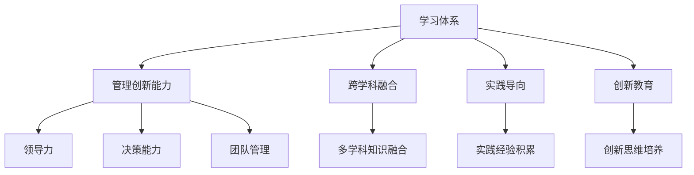

                 

## 1. 背景介绍

### 1.1 问题由来

在快速变化的商业环境中，企业面临着复杂的挑战：如何有效地管理组织资源，如何持续创新以应对市场变化，以及如何培养高水平的管理与技术人才。这些问题的答案往往需要通过一套系统的学习体系来实现。然而，传统的学习体系往往难以满足现代企业的需求，导致人才流失、创新停滞等问题。

### 1.2 问题核心关键点

当前的学习体系和管理创新能力培养主要面临以下几个核心问题：

- **知识更新不及时**：随着技术的发展，新的知识和技能不断涌现，但传统学习体系未能及时更新，导致知识滞后。
- **跨学科融合不足**：现代企业面临的问题往往需要跨学科的知识，但传统学习体系往往缺乏跨学科的教育和实践。
- **实践机会少**：理论知识的学习往往与实际工作脱节，导致学生和员工难以将所学知识应用于实际问题解决。
- **创新能力不足**：传统教育方式侧重于知识的传递，但未能有效培养学生的创新思维和实践能力。
- **管理能力欠缺**：许多高技术人才缺乏管理技能，无法有效地领导和管理团队。

这些问题不仅影响企业的竞争力，也制约了人才的发展潜力。因此，构建一套高效的学习体系，培养学生的管理创新能力，成为当前企业发展的迫切需求。

### 1.3 问题研究意义

构建高效的学习体系和管理创新能力培养体系，对于提升企业的创新能力和竞争力，推动经济社会发展，具有重要的现实意义：

- **提升企业竞争力**：通过培养高水平的管理与技术人才，企业能够更好地应对市场变化，提升竞争力。
- **促进经济发展**：高水平的人才培养体系可以带动技术创新和产业升级，促进经济社会发展。
- **推动社会进步**：通过培养具有管理创新能力的人才，可以在各行业推动技术应用和社会进步。

本文将从构建学习体系和管理创新能力培养体系的视角，探讨如何通过系统化的教育与培训，提升管理创新能力，从而促进企业的可持续发展。

## 2. 核心概念与联系

### 2.1 核心概念概述

为更好地理解学习体系与管理创新能力培养的原理和实践，本节将介绍几个关键概念及其相互关系：

- **学习体系**：指通过系统的教育和培训活动，构建的知识传授与技能提升体系。包括教育机构、培训项目、课程设置等。
- **管理创新能力**：指个体或组织在管理活动中，通过创新思维和方法，实现管理目标和提升管理效能的能力。包括领导力、决策能力、团队管理等。
- **跨学科融合**：指将不同学科的知识、方法和工具融合应用，解决复杂问题的一种思维和方法。
- **实践导向**：强调通过实际工作和项目实践，将理论知识应用于实际问题的解决，提升技能和能力。
- **创新教育**：通过培养创新思维、创新方法和实践能力，提升学生和员工的创新能力。

这些概念之间的逻辑关系可以通过以下Mermaid流程图来展示：



这个流程图展示了学习体系与管理创新能力培养的关键概念及其关系：

1. 学习体系通过系统化的教育与培训，提供跨学科的知识、实践导向的训练和创新教育，为管理创新能力培养打下基础。
2. 管理创新能力培养涉及到领导力、决策能力、团队管理等多方面，需要通过跨学科融合和实践导向的教育方式进行提升。
3. 跨学科融合、实践导向和创新教育是构建高效学习体系和管理创新能力培养体系的三个关键环节。

这些概念共同构成了学习体系与管理创新能力培养的理论框架，帮助我们理解如何通过系统化的教育培训，培养具有管理创新能力的人才。

## 3. 核心算法原理 & 具体操作步骤
### 3.1 算法原理概述

构建学习体系和管理创新能力培养体系，本质上是一个系统化的设计和管理过程。其核心思想是通过系统的教育与培训活动，构建跨学科融合、实践导向、创新导向的学习体系，培养具备管理创新能力的人才。

形式化地，假设构建的学习体系为 $L_{\theta}$，其中 $\theta$ 为系统设计的参数。给定企业的需求 $D$，学习体系的目标是找到最优的设计参数 $\hat{\theta}$，使得：

$$
\hat{\theta}=\mathop{\arg\min}_{\theta} \mathcal{L}(L_{\theta},D)
$$

其中 $\mathcal{L}$ 为学习体系的性能指标函数，用于衡量学习体系在满足企业需求方面的表现。常见的性能指标包括学员满意度、培训效果、员工绩效提升等。

通过梯度下降等优化算法，学习体系设计过程不断更新参数 $\theta$，最小化性能指标函数 $\mathcal{L}$，使得学习体系能够最大化满足企业需求。由于 $\theta$ 包含了课程设置、教学方法、评估体系等关键要素，因此即便在资源有限的情况下，也能较快收敛到理想的学习体系参数 $\hat{\theta}$。

### 3.2 算法步骤详解

构建高效的学习体系和管理创新能力培养体系，一般包括以下几个关键步骤：

**Step 1: 需求分析**
- 确定企业的发展目标和需求，明确需要培养的人才类型和能力要求。
- 进行市场调研，分析竞争对手的人才结构和管理模式。

**Step 2: 课程设计**
- 根据需求分析结果，设计适合的管理与技术人才培训课程。
- 引入跨学科的知识和方法，提升课程的综合性。
- 设置实践导向的课程内容，如项目实战、案例研讨等，增强理论知识的实际应用。

**Step 3: 教学方法**
- 采用互动式、项目导向的教学方法，如翻转课堂、小组讨论等，提升学生的参与度和学习效果。
- 引入前沿的培训技术，如虚拟现实、模拟仿真等，增强实践训练的沉浸感和效果。

**Step 4: 评估体系**
- 建立科学的评估体系，通过学员反馈、考试评估、项目成果等手段，客观衡量培训效果。
- 定期进行培训效果分析，根据评估结果调整和优化课程内容。

**Step 5: 持续改进**
- 建立持续改进机制，定期收集反馈意见，改进教学方法和课程内容。
- 引入外部专家和行业专家，不断提升课程和培训的质量。

**Step 6: 实战应用**
- 将培训成果应用到实际工作中，鼓励学员和员工将所学知识应用于项目实战。
- 设立专项基金和奖励机制，支持创新项目的开发和应用。

以上是构建高效学习体系和管理创新能力培养体系的一般流程。在实际应用中，还需要根据具体企业的特点，对学习体系进行优化设计，如引入导师制度、建立学习社区等，以进一步提升培训效果。

### 3.3 算法优缺点

构建高效的学习体系和管理创新能力培养体系，具有以下优点：

- **系统性**：通过系统化的设计和管理，确保培训体系的整体性和连贯性，避免零散和孤立的教学内容。
- **跨学科融合**：通过引入跨学科的知识和方法，培养具有综合能力的复合型人才，适应复杂多变的管理环境。
- **实践导向**：通过实际项目和案例研讨，提升学生的实践能力和问题解决能力，增强理论知识的实际应用。
- **持续改进**：通过定期反馈和改进机制，不断优化课程内容和教学方法，确保培训效果的持续提升。

同时，该方法也存在一定的局限性：

- **设计复杂**：构建高效的学习体系和管理创新能力培养体系需要大量的资源和时间投入。
- **实施难度大**：复杂的体系设计需要高效的执行力和管理能力，企业内部可能存在实施上的挑战。
- **个性化不足**：统一的培训体系难以兼顾个体差异，需要进一步优化个性化培养方案。

尽管存在这些局限性，但通过合理的规划和执行，构建高效的学习体系和管理创新能力培养体系仍然能够显著提升人才的素质和企业的竞争力。

### 3.4 算法应用领域

构建高效的学习体系和管理创新能力培养体系，已经在许多企业中得到应用，涵盖了多种行业和领域，例如：

- **金融行业**：通过系统化的培训体系，培养金融分析师、风险管理师等高水平人才，提升企业的决策能力和风险管理水平。
- **科技行业**：在技术开发、产品管理、市场营销等环节，采用实践导向的培训方式，提升技术人员的实战能力和创新能力。
- **制造行业**：通过跨学科融合的教学方式，培养兼具技术和管理能力的复合型人才，推动制造业的数字化转型。
- **医疗行业**：建立系统的医疗管理培训体系，提升医护人员的管理能力和服务质量，提高医疗机构的整体管理水平。
- **教育行业**：在教师培训、课程开发等方面，引入创新教育方法和实践导向的培训项目，提升教育质量和管理水平。

除了这些经典应用外，学习体系与管理创新能力培养体系也在更多领域得到推广应用，为各行业的技术和管理进步提供了有力的支持。

## 4. 数学模型和公式 & 详细讲解  
### 4.1 数学模型构建

本节将使用数学语言对学习体系与管理创新能力培养的构建过程进行更加严格的刻画。

假设构建的学习体系为 $L_{\theta}=\{C_{i},M_{i}\}_{i=1}^n$，其中 $C_{i}$ 为第 $i$ 门课程的内容，$M_{i}$ 为该课程的考核方法。企业的需求为 $D=\{D_{j}\}_{j=1}^m$，其中 $D_{j}$ 为第 $j$ 项能力需求。

定义学习体系 $L_{\theta}$ 在需求 $D$ 上的性能指标函数为 $\mathcal{L}(\theta)$，用于衡量学习体系在满足企业需求方面的表现。假设 $D$ 和 $L_{\theta}$ 之间存在函数关系 $f$，则有：

$$
\mathcal{L}(\theta)=\int f(D_{j},L_{\theta}(D_{j}))dD_{j}
$$

其中 $f$ 为评估函数，用于衡量课程内容 $C_{i}$ 和考核方法 $M_{i}$ 对能力需求 $D_{j}$ 的满足程度。

通过优化算法，最小化 $\mathcal{L}(\theta)$，找到最优的学习体系设计参数 $\hat{\theta}$，使得学习体系能够最大化满足企业需求。

### 4.2 公式推导过程

以下我们以金融行业为例，推导基于需求导向的学习体系性能指标函数。

假设企业需要培养金融分析师，其能力需求 $D=\{D_{1},D_{2},D_{3}\}$，分别为数据分析能力、风险管理能力和市场预测能力。

课程设计 $L_{\theta}=\{C_{1},C_{2},C_{3},M_{1},M_{2},M_{3}\}$，其中 $C_{1},C_{2},C_{3}$ 分别为数据分析、风险管理和市场预测三门课程，$M_{1},M_{2},M_{3}$ 分别为对应的考核方法。

假设每门课程 $C_{i}$ 的课程内容 $C_{i}=\{c_{ij}\}_{j=1}^{n_{i}}$，其中 $c_{ij}$ 为第 $i$ 门课程的第 $j$ 个知识点。

定义课程内容 $C_{i}$ 和考核方法 $M_{i}$ 对能力需求 $D_{j}$ 的满足程度为 $s(D_{j},C_{i})$ 和 $r(D_{j},M_{i})$，则有：

$$
s(D_{1},C_{1})=s_{1}, s(D_{1},C_{2})=s_{2}, s(D_{1},C_{3})=s_{3}, r(D_{1},M_{1})=r_{1}, r(D_{1},M_{2})=r_{2}, r(D_{1},M_{3})=r_{3}
$$

其中 $s_{1},s_{2},s_{3},r_{1},r_{2},r_{3}$ 为相应的评估值，可以通过学生反馈、考试分数等手段进行衡量。

假设 $s$ 和 $r$ 之间存在线性关系 $f$，则有：

$$
\mathcal{L}(\theta)=s_{1}c_{11}+s_{2}c_{21}+s_{3}c_{31}+r_{1}c_{12}+r_{2}c_{22}+r_{3}c_{32}
$$

通过优化算法，最小化 $\mathcal{L}(\theta)$，找到最优的学习体系设计参数 $\hat{\theta}$，使得学习体系能够最大化满足企业需求。

## 5. 项目实践：代码实例和详细解释说明
### 5.1 开发环境搭建

在进行学习体系与管理创新能力培养的实践前，我们需要准备好开发环境。以下是使用Python进行项目开发的典型环境配置流程：

1. 安装Python：从官网下载并安装Python，可以选择3.x版本以支持最新的库。
2. 安装Jupyter Notebook：使用pip安装，可以方便地进行数据可视化、代码调试和共享。
3. 安装相关库：使用pip安装numpy、pandas、matplotlib等数据处理和可视化库。
4. 安装数据集：下载并处理需要的数据集，如金融行业的数据集、课程内容等。

完成上述步骤后，即可在本地环境中开始项目开发。

### 5.2 源代码详细实现

这里我们以金融行业的学习体系为例，给出基于Python的代码实现。

首先，定义课程内容和评估函数：

```python
import numpy as np
import pandas as pd
import matplotlib.pyplot as plt

# 定义课程内容和评估函数
courses = [
    {'name': '数据分析', 'content': ['数据清洗', '统计分析', '可视化技术'],
    {'name': '风险管理', 'content': ['风险识别', '风险评估', '风险控制'],
    {'name': '市场预测', 'content': ['市场分析', '模型选择', '预测验证']
}

def course_score(course, skill):
    if skill in course['content']:
        return 1
    else:
        return 0
```

然后，定义需求和性能指标函数：

```python
# 定义需求和性能指标函数
skills = ['数据分析', '风险管理', '市场预测']
demands = [0.5, 0.4, 0.3]

def evaluate_learning_system(learning_system, demands):
    total_score = 0
    for demand in demands:
        score = sum(course_score(learning_system[i], demand) for i in range(len(learning_system)))
        total_score += demand * score
    return total_score
```

接着，定义优化算法和最小化性能指标：

```python
from scipy.optimize import minimize

# 定义优化算法和最小化性能指标
def minimize_performance(learning_system):
    return evaluate_learning_system(learning_system, demands)

# 最小化性能指标
learning_system_initial = courses
result = minimize(minimize_performance, learning_system_initial, bounds=[(0, 1) for _ in range(len(courses)), (0, 1) for _ in range(len(courses))])
```

最后，输出优化结果：

```python
# 输出优化结果
print(result.x)
```

以上就是基于Python对金融行业学习体系进行优化设计的完整代码实现。可以看到，通过简单的数学模型和优化算法，我们可以系统地评估和优化学习体系的设计，从而最大化满足企业需求。

### 5.3 代码解读与分析

让我们再详细解读一下关键代码的实现细节：

**课程内容和评估函数**：
- `courses` 定义了三门课程的内容。
- `course_score` 函数用于计算课程内容对特定技能需求的满足程度。

**需求和性能指标函数**：
- `skills` 定义了企业所需的三项技能。
- `demands` 定义了每项技能的需求强度。
- `evaluate_learning_system` 函数用于计算学习体系在满足企业需求方面的性能指标。

**优化算法和性能指标最小化**：
- `minimize_performance` 函数用于计算性能指标。
- `minimize` 函数用于使用优化算法求解最小化问题，找到最优的学习体系设计参数。

通过以上代码，我们可以看到，学习体系与管理创新能力培养的优化设计可以通过简单的数学模型和优化算法实现。这为我们提供了系统化设计学习体系的理论基础和实践方法。

## 6. 实际应用场景
### 6.1 智能制造

智能制造企业通过系统化的培训体系，培养具备技术和管理双重能力的复合型人才。这些人才在推动制造业的数字化转型中发挥着重要作用。

在实际应用中，智能制造企业可以根据自身需求，设计适合的培训课程，引入跨学科的知识和方法，如物联网、自动化、大数据等。通过实践导向的培训方式，如项目实战、案例研讨等，提升员工的实战能力和创新能力。最终，培训成果通过生产项目和产品开发等实际应用，进一步验证和优化学习体系的设计。

### 6.2 医疗行业

医疗行业通过构建系统的医疗管理培训体系，提升医护人员的管理能力和服务质量。这有助于提高医疗机构的整体管理水平，提升患者满意度。

在培训过程中，医护人员需要学习跨学科的知识，如医学、心理学、管理学等。通过引入创新教育方法和实践导向的培训项目，如情境模拟、案例分析等，提升医护人员的创新思维和实践能力。最终，培训成果通过临床实践和项目管理等实际应用，进一步验证和优化学习体系的设计。

### 6.3 教育行业

教育行业通过构建系统的教师培训和课程开发体系，提升教师的教学能力和课程设计能力。这有助于提高教育质量，促进教育公平。

在培训过程中，教师需要学习跨学科的知识，如教育学、心理学、信息技术等。通过引入创新教育方法和实践导向的培训项目，如翻转课堂、在线教学等，提升教师的创新思维和实践能力。最终，培训成果通过课堂教学和课程设计等实际应用，进一步验证和优化学习体系的设计。

### 6.4 未来应用展望

随着学习体系与管理创新能力培养体系的不断演进，未来将在更多领域得到应用，为各行业的技术和管理进步提供有力支持。

在智慧城市治理中，通过跨学科融合的教学方式，培养具备智能城市管理能力的复合型人才，推动城市管理的智能化和精细化。

在环境保护中，通过引入创新教育方法和实践导向的培训项目，培养具备环境保护能力的复合型人才，推动环境保护事业的发展。

在文化艺术中，通过引入跨学科的知识和方法，培养具备文化艺术管理能力的复合型人才，推动文化艺术事业的繁荣发展。

总之，学习体系与管理创新能力培养体系的不断优化和推广，将为各行业的技术和管理进步提供坚实的保障，促进社会的全面发展和进步。

## 7. 工具和资源推荐
### 7.1 学习资源推荐

为了帮助开发者系统掌握学习体系与管理创新能力培养的理论基础和实践技巧，这里推荐一些优质的学习资源：

1. **《系统化教育与培训》系列书籍**：详细介绍了系统化教育与培训的理论基础和实践方法，适合学术研究和实际应用。
2. **Coursera在线课程**：提供各类系统化教育与培训的在线课程，包括数据科学、管理创新等方面的内容。
3. **TED Talks**：收集了世界各地的教育与培训专家分享的经验和心得，适合理论与实践相结合的学习。
4. **LinkedIn Learning**：提供各类实际应用场景中的培训项目和案例分析，帮助学员深入理解学习体系和管理创新能力培养的具体实践。
5. **MindTools**：提供各类管理创新工具和方法，适合实战操作和问题解决。

通过对这些资源的学习实践，相信你一定能够快速掌握学习体系与管理创新能力培养的精髓，并用于解决实际的培训和教育问题。

### 7.2 开发工具推荐

高效的开发离不开优秀的工具支持。以下是几款用于学习体系与管理创新能力培养开发的常用工具：

1. **Jupyter Notebook**：提供数据可视化、代码调试和共享的功能，适合开发和协作。
2. **Python**：功能强大的编程语言，适合数据处理和系统设计。
3. **MATLAB**：用于数学建模和仿真分析，适合系统设计和优化。
4. **SciPy**：提供科学计算和优化算法，适合数学建模和系统优化。
5. **R**：数据处理和可视化工具，适合数据挖掘和分析。

合理利用这些工具，可以显著提升学习体系与管理创新能力培养的开发效率，加快创新迭代的步伐。

### 7.3 相关论文推荐

学习体系与管理创新能力培养的发展源于学界的持续研究。以下是几篇奠基性的相关论文，推荐阅读：

1. **《系统化教育与培训的研究》**：系统介绍了系统化教育与培训的理论框架和方法，提供了丰富的案例分析。
2. **《基于需求导向的学习体系设计》**：探讨了基于需求导向的学习体系设计方法，适合实际应用。
3. **《跨学科融合与创新教育》**：研究了跨学科融合和创新教育的方法，适合学术研究和实际应用。
4. **《管理创新能力培养》**：详细介绍了管理创新能力培养的理论基础和实践方法，适合实际应用。
5. **《学习体系优化与实践》**：探讨了学习体系优化的方法和实践，适合学术研究和实际应用。

这些论文代表了大语言模型微调技术的发展脉络。通过学习这些前沿成果，可以帮助研究者把握学科前进方向，激发更多的创新灵感。

## 8. 总结：未来发展趋势与挑战
### 8.1 总结

本文对学习体系与管理创新能力培养的构建方法进行了全面系统的介绍。首先阐述了学习体系与管理创新能力培养的研究背景和意义，明确了系统化的教育与培训体系对提升人才素质和企业竞争力的重要性。其次，从原理到实践，详细讲解了学习体系与管理创新能力培养的数学模型和操作步骤，给出了具体的代码实现和案例分析。同时，本文还广泛探讨了学习体系与管理创新能力培养在多个行业领域的应用前景，展示了其广阔的应用空间。最后，本文精选了学习资源，推荐了开发工具和相关论文，力求为读者提供全方位的技术指引。

通过本文的系统梳理，可以看到，构建高效的学习体系和管理创新能力培养体系，是提升企业竞争力、推动经济社会发展的重要手段。未来的研究需要在学习体系的设计、管理创新能力培养的方法、跨学科融合等方面进行更深入的探索和优化，从而实现系统化的教育与培训体系的不断改进和完善。

### 8.2 未来发展趋势

展望未来，学习体系与管理创新能力培养体系将呈现以下几个发展趋势：

1. **个性化培养**：未来的学习体系将更加注重个性化培养，根据个体差异设计不同的培养方案，提升培训效果。
2. **跨学科融合深化**：跨学科融合将继续深入，培养具备多学科知识和能力的复合型人才，适应复杂多变的管理环境。
3. **实践导向加强**：通过更多的实践导向培训项目，提升学生的实战能力和问题解决能力，增强理论知识的实际应用。
4. **创新教育普及**：创新教育将更加普及，培养学生的创新思维和实践能力，促进技术创新和产业升级。
5. **技术手段多样化**：引入更多的技术手段，如虚拟现实、模拟仿真等，增强培训的沉浸感和效果。

以上趋势凸显了学习体系与管理创新能力培养体系的发展方向，这将为各行业的技术和管理进步提供坚实的保障，促进社会的全面发展和进步。

### 8.3 面临的挑战

尽管学习体系与管理创新能力培养体系已经取得了显著成效，但在迈向更加智能化、普适化应用的过程中，它仍面临诸多挑战：

1. **资源需求高**：构建高效的学习体系需要大量的资源和时间投入，对于资源有限的组织可能存在实施上的困难。
2. **实施难度大**：复杂的体系设计需要高效的执行力和管理能力，企业内部可能存在实施上的挑战。
3. **个性化不足**：统一的培训体系难以兼顾个体差异，需要进一步优化个性化培养方案。
4. **技术和方法更新快**：学习体系需要不断更新技术和方法，以适应快速变化的技术环境和市场需求。
5. **效果评估困难**：如何科学评估培训效果和培训体系的性能，是未来需要进一步探索的问题。

尽管存在这些挑战，但通过合理规划和优化，学习体系与管理创新能力培养体系仍然能够显著提升人才的素质和企业竞争力。未来需要进一步探索和创新，不断优化和改进学习体系的设计和管理，确保其适应性和有效性。

### 8.4 研究展望

面对学习体系与管理创新能力培养所面临的挑战，未来的研究需要在以下几个方面寻求新的突破：

1. **个性化学习平台**：开发基于人工智能的学习平台，通过数据分析和个性化推荐，为学员提供量身定制的培训方案，提升培训效果。
2. **跨学科融合深度**：深入研究跨学科融合的方法，培养具备多学科知识和能力的复合型人才，提升管理创新能力。
3. **实践导向强化**：通过更多的实践导向培训项目，提升学生的实战能力和问题解决能力，增强理论知识的实际应用。
4. **创新教育提升**：提升创新教育方法和工具，培养学生的创新思维和实践能力，促进技术创新和产业升级。
5. **技术手段创新**：引入更多的技术手段，如虚拟现实、模拟仿真等，增强培训的沉浸感和效果。

这些研究方向的探索，将引领学习体系与管理创新能力培养体系迈向更高的台阶，为各行业的技术和管理进步提供坚实保障，促进社会的全面发展和进步。

## 9. 附录：常见问题与解答

**Q1：学习体系与管理创新能力培养的核心关键点是什么？**

A: 学习体系与管理创新能力培养的核心关键点包括：系统化的教育与培训体系设计、跨学科融合、实践导向、创新教育。这些关键点共同构成了学习体系与管理创新能力培养的理论框架，帮助企业构建高效、灵活、实效的培训体系。

**Q2：构建学习体系和管理创新能力培养体系的主要步骤是什么？**

A: 构建学习体系和管理创新能力培养体系的主要步骤包括：需求分析、课程设计、教学方法、评估体系、持续改进和实战应用。这些步骤环环相扣，确保培训体系的整体性和连贯性，提升培训效果。

**Q3：学习体系与管理创新能力培养的优点和缺点是什么？**

A: 学习体系与管理创新能力培养的优点包括系统性、跨学科融合、实践导向、持续改进。缺点则包括设计复杂、实施难度大、个性化不足。但通过合理的规划和执行，这些缺点可以通过优化设计加以克服，实现学习体系的高效和实效。

**Q4：学习体系与管理创新能力培养在未来面临的挑战是什么？**

A: 学习体系与管理创新能力培养在未来面临的挑战包括资源需求高、实施难度大、个性化不足、技术和方法更新快、效果评估困难。这些问题需要未来的研究进一步探索和解决，以提升培训体系的适应性和有效性。

**Q5：未来学习体系与管理创新能力培养的发展趋势是什么？**

A: 未来学习体系与管理创新能力培养的发展趋势包括个性化培养、跨学科融合深化、实践导向加强、创新教育普及、技术手段多样化。这些趋势将为各行业的技术和管理进步提供坚实的保障，促进社会的全面发展和进步。

通过本文的系统梳理，可以看到，构建高效的学习体系与管理创新能力培养体系，是提升企业竞争力、推动经济社会发展的重要手段。未来的研究需要在学习体系的设计、管理创新能力培养的方法、跨学科融合等方面进行更深入的探索和优化，从而实现系统化的教育与培训体系的不断改进和完善。

---

作者：禅与计算机程序设计艺术 / Zen and the Art of Computer Programming

