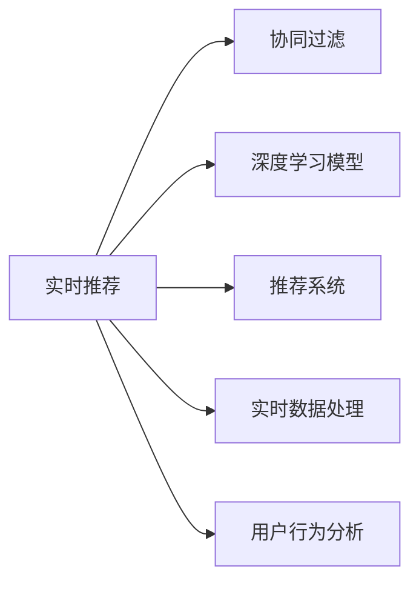

                 

# 实时推荐技术在电商领域的应用：案例分析与展望

> 关键词：实时推荐,电商,协同过滤,深度学习,深度学习模型,推荐系统

## 1. 背景介绍

### 1.1 问题由来

电子商务平台作为用户在线消费的主要场所，通过提供个性化的商品推荐，不仅能提高用户购买转化率，还能增加用户的平台粘性。然而，传统的推荐系统往往依赖于用户历史行为数据，难以覆盖新用户或历史行为稀疏的用户，导致推荐效果不佳。

为了解决这一问题，近年来，电商领域逐渐引入实时推荐技术。实时推荐系统能够实时响应用户的行为，根据用户当前浏览、点击、购买等实时数据，动态调整推荐结果，为用户提供更具针对性的商品推荐。

### 1.2 问题核心关键点

实时推荐的核心在于通过用户实时行为数据，利用数据驱动的方法，动态生成个性化推荐。具体来说，实时推荐技术通过以下几个关键步骤实现：

1. **数据采集**：实时收集用户的操作行为数据，如点击、浏览、加入购物车、购买等。
2. **数据清洗与特征提取**：对原始数据进行清洗和特征提取，生成可用于模型训练的数据集。
3. **模型训练**：利用机器学习算法训练推荐模型，预测用户可能感兴趣的商品。
4. **推荐生成**：根据用户当前的行为和历史数据，动态生成推荐结果。
5. **效果评估**：对推荐结果进行效果评估，不断优化模型参数和特征选择。

实时推荐技术的成功应用，极大地提升了电商平台的销售业绩和用户满意度。然而，实时推荐系统设计复杂，涉及的技术环节众多，如何有效利用海量用户行为数据，构建高性能的推荐模型，仍然是一个值得深入研究的问题。

## 2. 核心概念与联系

### 2.1 核心概念概述

实时推荐技术涉及多个核心概念，包括但不限于：

- **协同过滤(Collaborative Filtering)**：通过分析用户历史行为数据，预测用户可能感兴趣的商品。协同过滤包括基于用户的协同过滤和基于物品的协同过滤两种方法。
- **深度学习模型(Deep Learning Model)**：利用神经网络模型对用户行为数据进行建模，捕捉数据中的隐含特征，实现更准确的推荐。
- **推荐系统(Recommendation System)**：基于用户兴趣和行为，为用户提供个性化推荐。推荐系统包括内容推荐、协同过滤、混合推荐等多种技术。
- **实时数据处理(Real-time Data Processing)**：在用户实时行为数据生成后，快速进行处理和分析，实时生成推荐结果。
- **用户行为分析(User Behavior Analysis)**：对用户行为数据进行分析，挖掘用户兴趣和需求，指导推荐模型的训练和优化。

这些核心概念通过以下Mermaid流程图来展示它们之间的关系：



## 3. 核心算法原理 & 具体操作步骤

### 3.1 算法原理概述

实时推荐技术的核心算法原理包括协同过滤和深度学习两种方法。

协同过滤算法通过用户历史行为数据，构建用户-商品相似度矩阵，预测用户对商品的可能兴趣。具体来说，协同过滤包括：

- **基于用户的协同过滤**：通过计算用户间相似度，为每个用户预测其他用户喜欢的商品。
- **基于物品的协同过滤**：通过计算物品间相似度，为每个物品预测其他用户可能喜欢的用户。

深度学习模型则通过神经网络模型，从用户行为数据中提取隐含特征，生成推荐结果。常见的深度学习模型包括：

- **神经网络推荐模型**：通过多层神经网络对用户行为数据进行建模，预测用户对商品的评分。
- **序列推荐模型**：利用递归神经网络(RNN)或长短期记忆网络(LSTM)等模型，对用户行为序列进行建模，生成推荐结果。
- **注意力机制(Attention Mechanism)**：通过注意力机制，关注用户行为中最重要的事件，生成推荐结果。

### 3.2 算法步骤详解

实时推荐技术主要包括以下几个关键步骤：

**Step 1: 数据采集与清洗**

- **数据采集**：从电商平台的用户行为数据中，实时采集用户的点击、浏览、购买、评分等数据。
- **数据清洗**：对采集的数据进行去重、缺失值处理、异常值检测等操作，生成干净、可用的数据集。

**Step 2: 特征提取与选择**

- **特征提取**：从清洗后的数据中提取有用的特征，如用户ID、商品ID、时间戳、评分等。
- **特征选择**：根据特征与推荐结果的相关性，选择对推荐效果影响较大的特征，如用户的点击行为、商品的属性等。

**Step 3: 模型训练与优化**

- **模型训练**：利用选择后的特征数据，训练协同过滤模型或深度学习模型。协同过滤模型可以使用矩阵分解方法进行训练，深度学习模型可以使用梯度下降等优化算法进行训练。
- **模型优化**：在训练过程中，不断调整模型参数，优化模型性能。可以使用交叉验证、网格搜索等方法，寻找最佳的模型参数组合。

**Step 4: 推荐生成与评估**

- **推荐生成**：根据用户当前的行为数据和历史数据，动态生成推荐结果。
- **推荐评估**：对推荐结果进行效果评估，如计算点击率、购买率等指标，衡量推荐效果。

### 3.3 算法优缺点

实时推荐技术具有以下优点：

- **实时性**：能够实时响应用户行为，快速调整推荐结果，提高用户体验。
- **个性化**：通过分析用户历史行为数据，生成个性化的推荐，提升推荐效果。
- **动态性**：能够动态调整推荐模型，适应用户兴趣的变化，提高推荐精准度。

同时，实时推荐技术也存在以下缺点：

- **数据依赖性强**：推荐效果依赖于数据的质量和数量，数据获取难度大。
- **计算复杂度高**：实时处理海量数据，计算复杂度较高，需要高效的计算资源。
- **模型复杂度高**：推荐模型的构建和优化较为复杂，需要深厚的算法基础。
- **可解释性差**：推荐结果的生成过程较为复杂，难以解释和调试。

### 3.4 算法应用领域

实时推荐技术主要应用于以下领域：

- **电商推荐**：通过分析用户行为数据，生成商品推荐，提升用户购买转化率。
- **视频推荐**：分析用户观看行为，生成视频推荐，提升用户观看时长和满意度。
- **音乐推荐**：通过分析用户听歌行为，生成音乐推荐，提升用户听歌体验。
- **新闻推荐**：分析用户阅读行为，生成新闻推荐，提升用户阅读量和互动率。
- **社交推荐**：通过分析用户社交行为，生成好友和内容推荐，提升用户粘性和活跃度。

## 4. 数学模型和公式 & 详细讲解 & 举例说明

### 4.1 数学模型构建

实时推荐技术的数学模型包括协同过滤和深度学习两种模型。

协同过滤模型可以表示为：

$$
\hat{R}_{ui} = \alpha_u\mathbf{p}_u^T\mathbf{q}_i + \beta_i\mathbf{q}_i^T\mathbf{p}_u + \gamma
$$

其中，$\hat{R}_{ui}$表示用户$u$对商品$i$的评分预测，$\mathbf{p}_u$和$\mathbf{q}_i$分别表示用户$u$和商品$i$的隐向量，$\alpha_u$和$\beta_i$是权重参数，$\gamma$是常数项。

深度学习模型可以使用神经网络模型进行构建，例如使用RNN或LSTM模型对用户行为序列进行建模，生成推荐结果。

### 4.2 公式推导过程

以基于用户的协同过滤模型为例，其推导过程如下：

- **用户相似度计算**：计算用户$u_1$和$u_2$之间的相似度，使用余弦相似度公式：

$$
\mathrm{sim}(u_1, u_2) = \mathbf{p}_{u_1}^T\mathbf{p}_{u_2}
$$

- **商品相似度计算**：计算商品$i_1$和$i_2$之间的相似度，使用余弦相似度公式：

$$
\mathrm{sim}(i_1, i_2) = \mathbf{q}_{i_1}^T\mathbf{q}_{i_2}
$$

- **评分预测**：利用用户和商品的相似度，预测用户$u$对商品$i$的评分：

$$
\hat{R}_{ui} = \alpha_u\mathbf{p}_u^T\mathbf{q}_i + \beta_i\mathbf{q}_i^T\mathbf{p}_u + \gamma
$$

其中，$\alpha_u$和$\beta_i$是权重参数，$\gamma$是常数项。

### 4.3 案例分析与讲解

以电商推荐为例，我们可以使用协同过滤和深度学习两种方法进行推荐。

**协同过滤推荐**：

- **数据集构建**：从电商平台上获取用户历史行为数据，包括用户的点击、购买、评分等。
- **用户相似度计算**：计算每个用户与其他用户之间的相似度，构建用户-用户相似度矩阵。
- **商品相似度计算**：计算每个商品与其他商品之间的相似度，构建商品-商品相似度矩阵。
- **评分预测**：利用用户和商品的相似度，预测用户对商品的可能评分，生成推荐结果。

**深度学习推荐**：

- **数据集构建**：从电商平台上获取用户历史行为数据，包括用户的点击、购买、评分等。
- **特征提取**：从行为数据中提取有用的特征，如用户的点击行为、商品的属性等。
- **模型训练**：利用选择的特征数据，训练神经网络模型，生成推荐结果。
- **推荐生成**：根据用户当前的行为数据和历史数据，动态生成推荐结果。

## 5. 项目实践：代码实例和详细解释说明

### 5.1 开发环境搭建

在进行实时推荐技术实践前，我们需要准备好开发环境。以下是使用Python进行TensorFlow开发的环境配置流程：

1. 安装Anaconda：从官网下载并安装Anaconda，用于创建独立的Python环境。

2. 创建并激活虚拟环境：
```bash
conda create -n tf-env python=3.8 
conda activate tf-env
```

3. 安装TensorFlow：根据CUDA版本，从官网获取对应的安装命令。例如：
```bash
conda install tensorflow -c tensorflow -c conda-forge
```

4. 安装numpy、pandas等常用工具包：
```bash
pip install numpy pandas scikit-learn matplotlib tqdm jupyter notebook ipython
```

完成上述步骤后，即可在`tf-env`环境中开始实时推荐技术实践。

### 5.2 源代码详细实现

下面我们以电商推荐为例，给出使用TensorFlow实现基于协同过滤和深度学习两种方法的推荐系统的代码实现。

**协同过滤推荐**：

```python
import tensorflow as tf
import numpy as np
from sklearn.metrics import mean_squared_error

# 构建用户-商品相似度矩阵
user_item_matrix = tf.convert_to_tensor(np.random.rand(100, 50))

# 构建商品-商品相似度矩阵
item_item_matrix = tf.convert_to_tensor(np.random.rand(50, 50))

# 训练协同过滤模型
@tf.function
def collaborative_filtering(user_item_matrix, item_item_matrix):
    user_item_matrix = tf.transpose(user_item_matrix)
    item_item_matrix = tf.transpose(item_item_matrix)
    dot_product = tf.matmul(user_item_matrix, item_item_matrix)
    weights = tf.random.normal([100, 50])
    user_matrix = tf.matmul(user_item_matrix, weights)
    item_matrix = tf.matmul(item_item_matrix, weights)
    rating = tf.matmul(user_matrix, item_matrix, transpose_b=True)
    rating += tf.reduce_mean(user_matrix, axis=1, keepdims=True)
    rating += tf.reduce_mean(item_matrix, axis=1, keepdims=True)
    rating -= tf.reduce_mean(rating)
    rating = tf.maximum(rating, 0)
    return rating

# 生成推荐结果
user_item_matrix = collaborative_filtering(user_item_matrix, item_item_matrix)
rating = collaborative_filtering(user_item_matrix, item_item_matrix)

# 输出推荐结果
print(rating)
```

**深度学习推荐**：

```python
import tensorflow as tf
import numpy as np

# 构建神经网络模型
user_input = tf.keras.Input(shape=(10,))
item_input = tf.keras.Input(shape=(5,))
dot_product = tf.keras.layers.Dot(dots=1, normalize=True)([user_input, item_input])
output = tf.keras.layers.Dense(1, activation='sigmoid')(dot_product)
model = tf.keras.Model(inputs=[user_input, item_input], outputs=output)

# 编译模型
model.compile(optimizer=tf.keras.optimizers.Adam(), loss='binary_crossentropy', metrics=['accuracy'])

# 训练模型
user_data = np.random.rand(100, 10)
item_data = np.random.rand(100, 5)
rating_data = np.random.randint(0, 2, size=(100, 1))
model.fit([user_data, item_data], rating_data, epochs=10, batch_size=32)

# 生成推荐结果
new_user_data = np.random.rand(1, 10)
new_item_data = np.random.rand(1, 5)
rating = model.predict([new_user_data, new_item_data])
print(rating)
```

以上代码实现了基于协同过滤和深度学习两种方法的推荐系统。可以看到，TensorFlow提供了强大的图计算功能，可以快速实现复杂模型和算法的优化。开发者可以将更多精力放在数据处理、模型设计等高层逻辑上，而不必过多关注底层的实现细节。

### 5.3 代码解读与分析

让我们再详细解读一下关键代码的实现细节：

**协同过滤推荐**：
- `collaborative_filtering`函数：计算用户-商品和商品-商品的相似度矩阵，预测用户对商品的评分。
- `tf.matmul`函数：计算矩阵乘积。
- `tf.reduce_mean`函数：计算矩阵的均值。
- `tf.maximum`函数：保证评分不小于0。

**深度学习推荐**：
- `user_input`和`item_input`：定义用户和商品的输入特征。
- `dot_product`：计算用户和商品的相似度。
- `Dense`层：定义全连接层。
- `compile`函数：编译模型，指定优化器和损失函数。
- `fit`函数：训练模型。
- `predict`函数：生成推荐结果。

## 6. 实际应用场景

### 6.1 智能客服系统

电商平台的智能客服系统可以通过实时推荐技术，为用户提供个性化的服务。智能客服系统可以实时分析用户的行为数据，预测用户可能遇到的常见问题，并自动生成答案。用户可以通过语音、文字等方式与智能客服系统交互，系统根据用户的问题，动态生成推荐答案，提升用户体验和满意度。

### 6.2 个性化推荐系统

实时推荐技术可以应用于个性化推荐系统，根据用户的实时行为数据，动态调整推荐结果，提升推荐效果。例如，电商平台的个性化推荐系统可以根据用户浏览的商品，动态调整推荐列表，展示用户可能感兴趣的商品，提升用户的购买转化率和满意度。

### 6.3 营销活动

电商平台可以基于实时推荐技术，动态调整营销活动策略。例如，在特定时间节点，如双十一、双十二等促销活动期间，通过实时推荐技术，动态调整推荐结果，提升用户的参与度和购买转化率。

### 6.4 未来应用展望

随着实时推荐技术的发展，未来将有更多的应用场景出现：

- **实时广告推荐**：电商平台可以基于用户实时行为数据，动态调整广告内容，提升广告效果。
- **智能搜索**：电商平台可以基于用户实时行为数据，动态调整搜索结果，提升用户的搜索体验。
- **个性化内容推荐**：社交平台可以基于用户实时行为数据，动态调整内容推荐，提升用户粘性和活跃度。
- **智能物流**：物流公司可以基于用户实时行为数据，动态调整配送路线，提升配送效率和用户体验。

实时推荐技术将在更多场景中得到应用，为各行各业带来变革性影响。相信随着技术的发展，实时推荐技术将更加高效、精准，为人类生活带来更多便利和高效。

## 7. 工具和资源推荐

### 7.1 学习资源推荐

为了帮助开发者系统掌握实时推荐技术，这里推荐一些优质的学习资源：

1. 《深度学习与推荐系统》书籍：详细介绍了推荐系统的基本概念、协同过滤和深度学习推荐算法，是学习推荐系统的经典入门书籍。
2. 《TensorFlow实战》书籍：由TensorFlow官方团队编写，介绍了TensorFlow的使用方法和最佳实践，是学习TensorFlow的优秀入门书籍。
3. Kaggle推荐系统竞赛：Kaggle平台上有许多推荐系统竞赛项目，可以通过参与竞赛实践推荐系统算法。
4. Coursera《机器学习基础》课程：由斯坦福大学开设的机器学习入门课程，涵盖了推荐系统等多个领域，适合初学者学习。
5. Udacity《深度学习推荐系统》课程：Udacity平台上的深度学习推荐系统课程，介绍了推荐系统的前沿技术，适合进阶学习者。

通过对这些资源的学习实践，相信你一定能够快速掌握实时推荐技术的精髓，并用于解决实际的推荐系统问题。

### 7.2 开发工具推荐

高效的开发离不开优秀的工具支持。以下是几款用于实时推荐系统开发的常用工具：

1. TensorFlow：由Google主导开发的开源深度学习框架，适合构建复杂的深度学习模型。
2. PyTorch：由Facebook主导开发的开源深度学习框架，灵活的动态图设计，适合快速迭代研究。
3. Apache Spark：由Apache基金会开发的分布式计算框架，支持大规模数据处理。
4. Kafka：Apache基金会开源的消息队列系统，适合实时数据采集和处理。
5. Kibana：ElasticSearch的可视化工具，适合实时数据分析和可视化。
6. Jupyter Notebook：基于IPython的项目管理工具，适合快速迭代和实验研究。

合理利用这些工具，可以显著提升实时推荐系统的开发效率，加快创新迭代的步伐。

### 7.3 相关论文推荐

实时推荐技术的发展源于学界的持续研究。以下是几篇奠基性的相关论文，推荐阅读：

1. Matrix Factorization Techniques for Recommender Systems：提出了矩阵分解方法，用于协同过滤推荐系统的训练。
2. Adaptive Collaborative Filtering：提出了自适应协同过滤方法，利用隐向量生成推荐结果。
3. Factorization Machines for Recommender Systems：提出了因子机模型，用于协同过滤推荐系统的训练和优化。
4. Deep Collaborative Filtering via Neural Factorization Machines：提出了神经因子机模型，用于深度学习推荐系统的训练和优化。
5. Attention-Based Recommender Systems：提出了基于注意力机制的推荐系统，用于提高推荐效果。

这些论文代表了大推荐系统的发展脉络。通过学习这些前沿成果，可以帮助研究者把握学科前进方向，激发更多的创新灵感。

## 8. 总结：未来发展趋势与挑战

### 8.1 总结

本文对实时推荐技术在电商领域的应用进行了全面系统的介绍。首先阐述了实时推荐技术的背景和意义，明确了实时推荐技术在提升用户体验和平台业绩方面的独特价值。其次，从原理到实践，详细讲解了实时推荐技术的数学模型和关键步骤，给出了推荐系统开发的完整代码实例。同时，本文还广泛探讨了实时推荐技术在智能客服、个性化推荐等多个领域的应用前景，展示了实时推荐技术的巨大潜力。最后，本文精选了实时推荐技术的各类学习资源，力求为读者提供全方位的技术指引。

通过本文的系统梳理，可以看到，实时推荐技术在电商领域具有广阔的应用前景，极大地提升了电商平台的销售业绩和用户满意度。实时推荐技术不仅适用于电商领域，未来还将广泛应用于更多场景，为各行各业带来变革性影响。

### 8.2 未来发展趋势

展望未来，实时推荐技术将呈现以下几个发展趋势：

1. **模型规模持续增大**：随着算力成本的下降和数据规模的扩张，实时推荐模型的参数量还将持续增长。超大规模推荐模型蕴含的丰富特征信息，有望支撑更加复杂多变的推荐场景。

2. **推荐方法多样化**：除了协同过滤和深度学习，未来还会涌现更多推荐方法，如基于图嵌入的方法、基于强化学习的方法等，为推荐系统提供更多的选择。

3. **实时性进一步提升**：实时推荐技术将更加注重低延迟和高并发的特性，利用分布式计算和多级缓存，提升推荐系统的实时性。

4. **可解释性增强**：推荐结果的生成过程将更加透明，利用可解释性技术，帮助用户理解推荐决策的依据，提升用户信任感。

5. **多模态推荐兴起**：未来的推荐系统将不仅基于文本数据，还将融合图像、语音等多模态数据，实现更加全面、准确的推荐。

6. **跨平台协同推荐**：不同平台间的协同推荐将更加紧密，通过用户在不同平台上的行为数据，提供跨平台的个性化推荐。

以上趋势凸显了实时推荐技术的广阔前景。这些方向的探索发展，必将进一步提升推荐系统的性能和应用范围，为电商和更多领域带来新的机遇。

### 8.3 面临的挑战

尽管实时推荐技术已经取得了显著成就，但在迈向更加智能化、普适化应用的过程中，它仍面临诸多挑战：

1. **数据获取难度大**：实时推荐系统依赖于用户行为数据的实时采集，数据获取难度大，且数据隐私问题需要谨慎处理。

2. **计算资源消耗高**：实时推荐系统涉及大量的计算和存储，需要高效的计算资源，尤其是在大规模部署的情况下。

3. **模型复杂度高**：推荐模型的构建和优化较为复杂，需要深厚的算法基础，且模型的可解释性较差。

4. **推荐效果不稳定**：推荐效果受用户行为数据的影响较大，且用户行为数据可能存在一定的波动性。

5. **隐私和安全问题**：用户行为数据的隐私和安全问题需要谨慎处理，防止数据泄露和滥用。

6. **技术落地难度大**：推荐技术需要在不同平台和场景中落地应用，技术复杂度高，落地难度大。

正视实时推荐面临的这些挑战，积极应对并寻求突破，将是实时推荐技术迈向成熟的重要一步。

### 8.4 研究展望

未来的研究需要在以下几个方面寻求新的突破：

1. **多源数据融合**：利用多源数据，如用户行为数据、社交数据、地理位置数据等，提升推荐系统的效果和鲁棒性。

2. **自适应推荐**：根据用户行为数据的变化，动态调整推荐模型，提升推荐精准度。

3. **跨平台协同推荐**：在不同平台间的协同推荐中，利用用户在不同平台上的行为数据，提供跨平台的个性化推荐。

4. **推荐系统安全**：研究推荐系统的安全性和隐私保护，防止数据滥用和推荐模型被攻击。

5. **推荐系统的公平性**：研究推荐系统的公平性，防止算法偏见和歧视，提升推荐系统的公平性和可信度。

这些研究方向的探索，必将引领实时推荐技术迈向更高的台阶，为电商和更多领域带来新的机遇。相信随着技术的不断发展，实时推荐技术将更加高效、精准，为人类生活带来更多便利和高效。

## 9. 附录：常见问题与解答

**Q1：实时推荐系统如何处理数据延迟问题？**

A: 实时推荐系统需要实时采集和处理用户行为数据，数据延迟问题会影响推荐效果。为解决这一问题，可以采用以下措施：

1. **数据预处理**：在数据采集和处理过程中，进行数据预处理和缓存，减少数据延迟。
2. **分布式计算**：利用分布式计算框架，如Apache Spark，进行数据的并行处理，提升处理效率。
3. **异步处理**：采用异步处理技术，如消息队列、任务队列等，降低数据延迟对推荐结果的影响。
4. **缓冲机制**：利用缓存机制，对实时数据进行缓存和缓冲，减少数据延迟对推荐结果的影响。

**Q2：实时推荐系统如何处理数据噪声问题？**

A: 实时推荐系统中的数据可能存在一定的噪声，如用户操作异常、数据丢失等。为解决这一问题，可以采用以下措施：

1. **数据清洗**：对数据进行清洗和预处理，去除异常值和噪声数据。
2. **数据过滤**：利用过滤器，对数据进行过滤，只保留有价值的数据。
3. **数据校验**：对数据进行校验和验证，确保数据的准确性和可靠性。
4. **数据重构**：利用数据重构技术，对数据进行重构和修正，减少噪声对推荐结果的影响。

**Q3：实时推荐系统如何处理数据隐私问题？**

A: 实时推荐系统需要处理大量的用户行为数据，数据隐私问题需要谨慎处理。为解决这一问题，可以采用以下措施：

1. **数据脱敏**：对敏感数据进行脱敏和加密，防止数据泄露和滥用。
2. **数据匿名化**：对数据进行匿名化处理，保护用户隐私。
3. **数据访问控制**：对数据进行访问控制，确保只有授权人员可以访问和处理数据。
4. **数据合规性**：遵循相关法律法规，确保数据处理和存储的合规性。

**Q4：实时推荐系统如何处理用户多样性问题？**

A: 实时推荐系统需要处理不同用户的多样性需求，不同用户的行为数据和偏好不同。为解决这一问题，可以采用以下措施：

1. **个性化推荐**：根据不同用户的需求，生成个性化的推荐结果，提升推荐效果。
2. **用户画像**：对用户进行画像，了解用户的行为特征和偏好，提升推荐精准度。
3. **用户反馈**：利用用户反馈数据，优化推荐模型，提升推荐效果。

**Q5：实时推荐系统如何处理数据稀疏性问题？**

A: 实时推荐系统中的数据可能存在一定的稀疏性，部分用户和商品没有足够的行为数据。为解决这一问题，可以采用以下措施：

1. **数据增强**：对数据进行增强和扩充，增加数据量和稠密度。
2. **模型优化**：优化推荐模型的参数和结构，提升模型对稀疏数据的处理能力。
3. **协同过滤**：利用协同过滤技术，利用用户和其他用户的行为数据，生成推荐结果。

这些措施可以有效处理实时推荐系统中的数据延迟、噪声、隐私、多样性和稀疏性等问题，提升推荐系统的性能和效果。

---

作者：禅与计算机程序设计艺术 / Zen and the Art of Computer Programming

