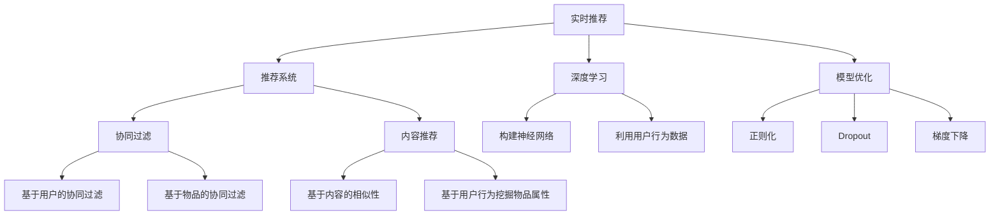

                 

# 实时推荐技术的实现与优化

> 关键词：实时推荐、推荐系统、协同过滤、内容推荐、深度学习、模型优化、推荐效果、应用场景

## 1. 背景介绍

### 1.1 问题由来

在当今信息爆炸的时代，无论是电商平台、新闻网站，还是社交媒体、视频平台，都面临着用户海量数据的挑战。如何高效地从这些数据中挖掘出用户的潜在兴趣，并提供个性化的推荐，是推荐系统面临的主要问题。推荐系统旨在通过数据分析和算法优化，帮助用户发现感兴趣的内容，从而提高用户体验，增加平台黏性。

然而，传统的推荐系统面临着数据稀疏性、冷启动问题、推荐效果不稳定等挑战。这些问题使得推荐系统难以在大规模用户和数据面前保持良好的性能和用户体验。为了克服这些挑战，实时推荐技术的实现与优化成为了研究的热点。

### 1.2 问题核心关键点

实时推荐技术的核心在于如何高效地处理和利用用户行为数据，及时更新推荐模型，并快速响应用户请求，提供个性化的推荐内容。与离线推荐相比，实时推荐需要在极短的时间内处理和计算，对算法和系统的响应速度有很高的要求。

实时推荐技术的成功与否，取决于以下几个关键点：

- **高效的数据处理和存储**：如何高效地存储和处理用户行为数据，是实时推荐的基础。
- **实时更新和迭代**：如何及时更新推荐模型，使其能够适应数据的变化和用户的需求。
- **高效的算法和优化**：如何选择高效的算法，进行模型优化，提高推荐效果。
- **系统的可扩展性和稳定性**：如何构建可扩展、稳定的推荐系统，保障服务的连续性和可用性。

## 2. 核心概念与联系

### 2.1 核心概念概述

为更好地理解实时推荐技术的实现与优化，本节将介绍几个密切相关的核心概念：

- **实时推荐**：指在用户产生交互行为时，即刻生成推荐内容，提供个性化的推荐服务。与离线推荐不同，实时推荐能够实时响应用户需求，提高推荐效果。
- **推荐系统**：利用用户行为数据，为用户推荐个性化内容的系统。推荐系统分为协同过滤和内容推荐两大类，协同过滤侧重于用户间的相似性，内容推荐侧重于物品间的相似性。
- **协同过滤**：通过分析用户行为数据，发现用户之间的相似性，进而推荐相似用户喜欢的物品。协同过滤分为基于用户的协同过滤和基于物品的协同过滤。
- **内容推荐**：根据物品的属性和特征，为用户推荐与其兴趣相符的物品。内容推荐可以基于内容的相似性，也可以基于用户行为数据挖掘物品属性。
- **深度学习**：通过构建深度神经网络模型，利用用户行为数据进行特征学习和推荐建模。深度学习在推荐系统中应用广泛，尤其是基于用户-物品交互矩阵的模型。
- **模型优化**：通过各种技术手段，优化推荐模型的参数和结构，提升推荐效果。常用的技术包括正则化、Dropout、梯度下降等。

这些核心概念之间的逻辑关系可以通过以下Mermaid流程图来展示：



这个流程图展示实时推荐技术的核心概念及其之间的关系：

1. 实时推荐利用推荐系统为用户推荐个性化内容。
2. 推荐系统分为协同过滤和内容推荐两大类，协同过滤侧重于用户间的相似性，内容推荐侧重于物品间的相似性。
3. 协同过滤和内容推荐都可以采用深度学习技术进行建模，构建神经网络模型，利用用户行为数据进行特征学习。
4. 推荐模型的优化可以通过正则化、Dropout、梯度下降等技术手段实现。

## 3. 核心算法原理 & 具体操作步骤

### 3.1 算法原理概述

实时推荐技术的核心在于如何高效地处理和利用用户行为数据，及时更新推荐模型，并快速响应用户请求，提供个性化的推荐内容。与离线推荐相比，实时推荐需要在极短的时间内处理和计算，对算法和系统的响应速度有很高的要求。

形式化地，假设用户集合为 $U$，物品集合为 $I$，用户行为数据表示为 $X=\{(x_i,y_i)\}_{i=1}^N$，其中 $x_i$ 为用户 $u_i$ 对物品 $i$ 的操作，$y_i$ 表示用户对物品的兴趣程度（通常为1-5的评分）。实时推荐的目标是：

1. 构建推荐模型 $F: U \times I \rightarrow [0,1]$，预测用户对物品的兴趣程度。
2. 根据模型 $F$，实时生成推荐结果，满足 $y_{new} = F(u_i, i)$，即对每个用户 $u_i$ 实时生成物品 $i$ 的兴趣预测。
3. 根据用户的行为变化，及时更新模型参数，以适应新的数据分布。

### 3.2 算法步骤详解

实时推荐技术的实现步骤包括数据收集、模型构建、模型训练和模型更新等关键环节。

**Step 1: 数据收集与预处理**
- 收集用户行为数据，通常包括用户ID、物品ID、操作类型和操作时间等。
- 数据预处理，包括缺失值填充、异常值处理、数据去重等。

**Step 2: 模型构建**
- 选择适合的推荐算法，如协同过滤、内容推荐或深度学习模型。
- 构建推荐模型 $F$，可以是协同过滤模型、基于内容的相似性模型，也可以是对用户行为数据进行特征学习的深度神经网络模型。

**Step 3: 模型训练**
- 对用户行为数据进行分批处理，构建训练集。
- 利用训练集对推荐模型进行训练，优化模型参数。

**Step 4: 模型更新**
- 实时接收用户的行为数据，更新推荐模型。
- 利用增量学习技术，如在线梯度下降等，更新模型参数，以适应新的数据分布。

**Step 5: 推荐生成与反馈**
- 实时生成推荐结果，对用户进行个性化推荐。
- 收集用户对推荐的反馈，用于模型更新和优化。

### 3.3 算法优缺点

实时推荐技术的优点包括：

- 及时响应：能够实时响应用户的交互行为，提供个性化的推荐内容，提高用户体验。
- 个性化推荐：利用用户行为数据，生成高度个性化的推荐结果，满足用户的独特需求。
- 动态更新：能够根据用户行为变化，动态更新推荐模型，提高推荐效果。

实时推荐技术的主要缺点包括：

- 数据实时性要求高：需要实时收集和处理用户行为数据，对系统的实时性要求较高。
- 系统复杂度大：实时推荐系统需要处理大规模数据，并实时更新模型，系统复杂度较大。
- 资源消耗大：实时推荐系统的计算和存储资源消耗较大，需要高效的算法和系统架构支持。

### 3.4 算法应用领域

实时推荐技术广泛应用于电商、新闻、社交媒体、视频等多个领域，具体应用场景包括：

- **电商推荐**：为用户推荐商品、商品组合、个性化优惠券等。
- **新闻推荐**：为用户推荐新闻文章、相关话题、热门排行榜等。
- **社交媒体推荐**：为用户推荐好友、文章、视频等。
- **视频推荐**：为用户推荐视频内容、相关电影、热门视频等。
- **智能家居推荐**：为用户推荐家电、环境控制等智能设备。

## 4. 数学模型和公式 & 详细讲解 & 举例说明

### 4.1 数学模型构建

本节将使用数学语言对实时推荐技术的实现与优化进行更加严格的刻画。

假设推荐模型为 $F: U \times I \rightarrow [0,1]$，其中 $U$ 为用户集合，$I$ 为物品集合。用户行为数据表示为 $X=\{(x_i,y_i)\}_{i=1}^N$，其中 $x_i=(u_i,i)$ 表示用户 $u_i$ 对物品 $i$ 的操作，$y_i$ 为用户对物品的兴趣程度（通常为1-5的评分）。

推荐模型 $F$ 的损失函数为 $L(F) = \frac{1}{N}\sum_{i=1}^N \ell(F(u_i, i), y_i)$，其中 $\ell$ 为损失函数，如均方误差损失。

### 4.2 公式推导过程

以协同过滤推荐模型为例，假设用户 $u_i$ 对物品 $i$ 的兴趣度由 $u_i$ 对其他物品的评分决定，即：

$$
F(u_i, i) = \frac{1}{|\mathcal{N}(u_i)|} \sum_{j \in \mathcal{N}(u_i)} \frac{y_j}{1+e^{-W(u_i, j)}}
$$

其中 $\mathcal{N}(u_i)$ 表示与用户 $u_i$ 有交互的物品集合，$W(u_i, j)$ 为权重函数，通常为物品 $j$ 的评分减去 $u_i$ 的平均评分。

对于深度学习推荐模型，假设 $F$ 为 $K$ 层神经网络，输入为 $x$，输出为 $y$。损失函数为：

$$
L(F) = \frac{1}{N}\sum_{i=1}^N \ell(F(x_i), y_i)
$$

其中 $\ell$ 为损失函数，如均方误差损失。

### 4.3 案例分析与讲解

**案例一：电商推荐系统**

电商推荐系统主要利用用户的购买行为、浏览行为等数据，为用户推荐商品和商品组合。电商推荐模型可以分为基于用户的协同过滤、基于物品的协同过滤和基于内容的推荐。

以基于用户的协同过滤为例，假设用户 $u_i$ 对物品 $i$ 的兴趣度由其对其他物品的评分决定，即：

$$
F(u_i, i) = \frac{1}{|\mathcal{N}(u_i)|} \sum_{j \in \mathcal{N}(u_i)} \frac{y_j}{1+e^{-W(u_i, j)}}
$$

其中 $\mathcal{N}(u_i)$ 表示与用户 $u_i$ 有交互的物品集合，$W(u_i, j)$ 为权重函数，通常为物品 $j$ 的评分减去 $u_i$ 的平均评分。

**案例二：新闻推荐系统**

新闻推荐系统主要利用用户的阅读行为、点赞行为等数据，为用户推荐新闻文章、相关话题、热门排行榜等。新闻推荐模型可以分为基于用户的协同过滤、基于内容的推荐和深度学习模型。

以基于内容的推荐为例，假设新闻文章 $i$ 的特征表示为 $z_i$，用户 $u_i$ 对物品 $i$ 的兴趣度由其对物品 $z_i$ 的特征匹配程度决定，即：

$$
F(u_i, i) = \max_{z_i \in Z} \langle \alpha, z_i \rangle
$$

其中 $\alpha$ 为用户 $u_i$ 对特征的兴趣度向量，$Z$ 为物品的特征空间。

## 5. 项目实践：代码实例和详细解释说明

### 5.1 开发环境搭建

在进行实时推荐系统的开发前，我们需要准备好开发环境。以下是使用Python进行TensorFlow开发的环境配置流程：

1. 安装Anaconda：从官网下载并安装Anaconda，用于创建独立的Python环境。

2. 创建并激活虚拟环境：
```bash
conda create -n tf-env python=3.8 
conda activate tf-env
```

3. 安装TensorFlow：从官网获取对应的安装命令。例如：
```bash
pip install tensorflow==2.4
```

4. 安装各类工具包：
```bash
pip install numpy pandas scikit-learn matplotlib tqdm jupyter notebook ipython
```

完成上述步骤后，即可在`tf-env`环境中开始开发。

### 5.2 源代码详细实现

这里我们以协同过滤推荐系统为例，给出使用TensorFlow构建的完整代码实现。

首先，定义协同过滤推荐模型：

```python
import tensorflow as tf
from tensorflow.keras.layers import Dense, Embedding, Dot
from tensorflow.keras.models import Model

# 定义模型
class CollaborativeFilteringModel(tf.keras.Model):
    def __init__(self, num_users, num_items, latent_dim):
        super(CollaborativeFilteringModel, self).__init__()
        self.num_users = num_users
        self.num_items = num_items
        self.latent_dim = latent_dim
        
        # 用户特征嵌入
        self.user_embedding = Embedding(input_dim=num_users, output_dim=latent_dim, mask_zero=True)
        # 物品特征嵌入
        self.item_embedding = Embedding(input_dim=num_items, output_dim=latent_dim, mask_zero=True)
        # 用户-物品交互矩阵
        self.interaction_matrix = Dot(axes=(2,1), normalize=True)  # (N, K, L) @ (N, K, 1) -> (N, L)

    def call(self, inputs):
        user_id, item_id = inputs
        user_embed = self.user_embedding(user_id)
        item_embed = self.item_embedding(item_id)
        interaction = self.interaction_matrix([user_embed, item_embed])
        return interaction

# 构建模型
model = CollaborativeFilteringModel(num_users=num_users, num_items=num_items, latent_dim=128)
model.compile(optimizer='adam', loss='mse')
```

然后，定义训练函数：

```python
# 训练函数
def train(model, train_data, train_labels, epochs=10, batch_size=64):
    model.fit(train_data, train_labels, epochs=epochs, batch_size=batch_size, validation_split=0.2)
```

接着，定义预测函数：

```python
# 预测函数
def predict(model, test_data):
    return model.predict(test_data)
```

最后，启动训练流程并在测试集上评估：

```python
# 加载数据
train_data = ...
train_labels = ...
test_data = ...

# 训练模型
model = CollaborativeFilteringModel(num_users=num_users, num_items=num_items, latent_dim=128)
model.compile(optimizer='adam', loss='mse')
train(model, train_data, train_labels, epochs=10, batch_size=64)

# 评估模型
test_labels = predict(model, test_data)
```

以上就是使用TensorFlow构建协同过滤推荐系统的完整代码实现。可以看到，通过TensorFlow的Keras API，构建推荐模型、定义损失函数和优化器等步骤变得非常简洁高效。

### 5.3 代码解读与分析

让我们再详细解读一下关键代码的实现细节：

**CollaborativeFilteringModel类**：
- `__init__`方法：初始化模型的用户数、物品数和嵌入维度。
- `call`方法：实现模型的前向传播过程。
- `user_embedding`和`item_embedding`：定义用户和物品的嵌入层。
- `interaction_matrix`：定义用户-物品交互矩阵，通过TensorFlow的Dot层实现。

**train函数**：
- 对训练集进行分批处理，并使用`model.fit`进行训练。
- 设置`epochs`和`batch_size`等参数，并使用`validation_split`进行验证集划分。

**predict函数**：
- 对测试集进行前向传播，得到预测结果。

**训练流程**：
- 定义模型，并进行编译，设置损失函数和优化器。
- 调用`train`函数进行模型训练。
- 调用`predict`函数在测试集上进行评估。

可以看到，TensorFlow的Keras API使得构建和训练推荐模型变得非常简单，开发者可以更专注于算法和模型设计。

当然，工业级的系统实现还需考虑更多因素，如模型的保存和部署、超参数的自动搜索、更灵活的任务适配层等。但核心的实时推荐范式基本与此类似。

## 6. 实际应用场景

### 6.1 电商推荐

电商推荐系统利用用户的购买行为、浏览行为等数据，为用户推荐商品和商品组合。电商推荐模型可以分为基于用户的协同过滤、基于物品的协同过滤和基于内容的推荐。

在实践中，可以收集用户的历史浏览记录、购买记录等数据，构建用户行为数据集。对用户行为数据进行预处理和特征工程，构建用户嵌入和物品嵌入。然后，使用协同过滤模型进行推荐，构建推荐模型 $F$，并在新数据上实时生成推荐结果。

### 6.2 新闻推荐

新闻推荐系统利用用户的阅读行为、点赞行为等数据，为用户推荐新闻文章、相关话题、热门排行榜等。新闻推荐模型可以分为基于用户的协同过滤、基于内容的推荐和深度学习模型。

在实践中，可以收集用户的历史阅读记录、点赞记录等数据，构建用户行为数据集。对用户行为数据进行预处理和特征工程，构建用户嵌入和物品嵌入。然后，使用基于内容的推荐模型进行推荐，构建推荐模型 $F$，并在新数据上实时生成推荐结果。

### 6.3 社交媒体推荐

社交媒体推荐系统利用用户的互动行为数据，为用户推荐好友、文章、视频等。社交媒体推荐模型可以分为基于用户的协同过滤、基于物品的协同过滤和基于内容的推荐。

在实践中，可以收集用户的历史互动数据，如点赞、评论、转发等。对用户行为数据进行预处理和特征工程，构建用户嵌入和物品嵌入。然后，使用协同过滤模型进行推荐，构建推荐模型 $F$，并在新数据上实时生成推荐结果。

### 6.4 视频推荐

视频推荐系统利用用户的观看行为数据，为用户推荐视频内容、相关电影、热门视频等。视频推荐模型可以分为基于用户的协同过滤、基于物品的协同过滤和基于内容的推荐。

在实践中，可以收集用户的历史观看记录、点赞记录等数据，构建用户行为数据集。对用户行为数据进行预处理和特征工程，构建用户嵌入和物品嵌入。然后，使用协同过滤模型进行推荐，构建推荐模型 $F$，并在新数据上实时生成推荐结果。

## 7. 工具和资源推荐

### 7.1 学习资源推荐

为了帮助开发者系统掌握实时推荐技术的实现与优化，这里推荐一些优质的学习资源：

1. 《推荐系统实战》一书：系统介绍了推荐系统的基本概念、算法和实现方法，包括协同过滤、内容推荐、深度学习等内容。

2. CS446《机器学习与信息检索》课程：斯坦福大学开设的机器学习课程，涉及推荐系统的多个主题，包括协同过滤、基于内容的推荐等。

3. 《Python推荐系统》一书：深入浅出地介绍了推荐系统的基本原理、算法和代码实现。

4. Kaggle推荐系统竞赛：Kaggle平台上的推荐系统竞赛，提供了大量的推荐系统数据集和算法实现，适合实践练习。

5. Coursera《推荐系统》课程：由密歇根大学开设的推荐系统课程，涵盖了推荐系统的基本概念、算法和实现方法。

通过对这些资源的学习实践，相信你一定能够快速掌握实时推荐技术的精髓，并用于解决实际的推荐问题。

### 7.2 开发工具推荐

高效的开发离不开优秀的工具支持。以下是几款用于实时推荐系统开发的常用工具：

1. TensorFlow：基于Python的开源深度学习框架，灵活动态的计算图，适合快速迭代研究。支持多种推荐算法和模型实现。

2. PyTorch：基于Python的开源深度学习框架，灵活性高，易于使用。支持多种推荐算法和模型实现。

3. Scikit-learn：基于Python的机器学习库，提供了丰富的算法和模型实现，适合用于特征工程和模型评估。

4. FastFM：基于Python的分布式推荐系统框架，支持多种推荐算法和模型实现。

5. Hadoop/Spark：分布式计算平台，适合处理大规模推荐系统数据。

6. Redis：内存数据库，适合进行高并发的推荐系统数据存储和处理。

合理利用这些工具，可以显著提升实时推荐系统的开发效率，加快创新迭代的步伐。

### 7.3 相关论文推荐

实时推荐技术的发展源于学界的持续研究。以下是几篇奠基性的相关论文，推荐阅读：

1. KDD'08 推荐系统竞赛：介绍了推荐系统的基本概念和算法，并展示了多种推荐算法的性能对比。

2. JCR'09 推荐系统评测：总结了推荐系统的主要算法和实现方法，并展示了不同算法的评测结果。

3. WSDM'12 推荐系统评测：介绍了推荐系统的基本概念和算法，并展示了多种推荐算法的性能对比。

4. NIPS'10 推荐系统竞赛：展示了多种推荐算法的性能对比，并介绍了推荐系统的基本概念和算法。

5. KDD'17 推荐系统竞赛：介绍了推荐系统的基本概念和算法，并展示了多种推荐算法的性能对比。

这些论文代表了大推荐系统的发展脉络，通过学习这些前沿成果，可以帮助研究者把握学科前进方向，激发更多的创新灵感。

## 8. 总结：未来发展趋势与挑战

### 8.1 总结

本文对实时推荐技术的实现与优化进行了全面系统的介绍。首先阐述了实时推荐技术在电商、新闻、社交媒体、视频等多个领域的应用背景和重要性。其次，从原理到实践，详细讲解了实时推荐技术的数学模型、算法步骤和实现细节，提供了完整的代码实例。同时，本文还探讨了实时推荐技术在实际应用中的具体实现，展示了实时推荐系统的广泛应用前景。

通过本文的系统梳理，可以看到，实时推荐技术在提高用户体验、提升平台粘性等方面具有重要价值。实时推荐系统能够实时响应用户行为，提供个性化的推荐内容，从而极大地提升了用户满意度和平台竞争力。未来，随着推荐算法和系统的不断优化，实时推荐技术必将在更多领域得到应用，为数字经济的发展注入新的活力。

### 8.2 未来发展趋势

实时推荐技术的发展前景广阔，未来呈现出以下几个趋势：

1. 深度学习应用范围扩大。深度学习推荐模型将广泛应用于更多领域，包括电商、新闻、社交媒体、视频等，提升推荐效果。

2. 推荐算法多样化。未来的推荐算法将更加多样化，不仅包括协同过滤、内容推荐，还包括混合推荐、元学习等。

3. 数据融合与协同。未来的推荐系统将更加注重多源数据的融合和协同，利用用户行为数据、社交网络数据等多种信息，提升推荐效果。

4. 实时数据处理与存储。实时推荐系统对数据处理和存储的需求将更高，需要更加高效的数据处理和存储技术。

5. 模型优化与调参。未来的推荐模型需要更加高效的调参和优化方法，如自动调参、自适应学习等。

6. 多领域推荐系统。未来的推荐系统将更加注重多领域推荐，例如电商、新闻、社交媒体、视频等多个领域的综合推荐。

以上趋势凸显了实时推荐技术的广阔前景。这些方向的探索发展，必将进一步提升推荐系统的性能和应用范围，为数字经济的发展注入新的动力。

### 8.3 面临的挑战

尽管实时推荐技术已经取得了一定的成就，但在迈向更加智能化、普适化应用的过程中，它仍面临着诸多挑战：

1. 数据实时性要求高。实时推荐系统需要实时收集和处理用户行为数据，对系统的实时性要求较高，需要高效的算法和系统架构支持。

2. 系统复杂度大。实时推荐系统需要处理大规模数据，并实时更新模型，系统复杂度较大，需要高效的算法和系统架构支持。

3. 资源消耗大。实时推荐系统的计算和存储资源消耗较大，需要高效的算法和系统架构支持。

4. 模型鲁棒性不足。实时推荐模型面对新数据时，泛化性能往往大打折扣。如何提高模型的鲁棒性，避免灾难性遗忘，还需要更多理论和实践的积累。

5. 系统可扩展性和稳定性。实时推荐系统需要构建可扩展、稳定的推荐系统，保障服务的连续性和可用性。

6. 用户隐私保护。实时推荐系统需要关注用户隐私保护问题，合理使用用户数据，并采取隐私保护措施。

正视实时推荐面临的这些挑战，积极应对并寻求突破，将使实时推荐技术走向成熟。相信随着学界和产业界的共同努力，这些挑战终将一一被克服，实时推荐技术必将在构建人机协同的智能时代中扮演越来越重要的角色。

### 8.4 研究展望

未来的研究需要在以下几个方面寻求新的突破：

1. 探索无监督和半监督推荐方法。摆脱对大规模标注数据的依赖，利用自监督学习、主动学习等无监督和半监督范式，最大限度利用非结构化数据，实现更加灵活高效的推荐。

2. 研究参数高效和计算高效的推荐范式。开发更加参数高效的推荐方法，在固定大部分预训练参数的同时，只更新极少量的任务相关参数。同时优化推荐模型的计算图，减少前向传播和反向传播的资源消耗，实现更加轻量级、实时性的部署。

3. 融合因果和对比学习范式。通过引入因果推断和对比学习思想，增强推荐模型建立稳定因果关系的能力，学习更加普适、鲁棒的语言表征，从而提升推荐效果。

4. 引入更多先验知识。将符号化的先验知识，如知识图谱、逻辑规则等，与推荐模型进行巧妙融合，引导推荐过程学习更准确、合理的语言模型。同时加强不同模态数据的整合，实现视觉、语音等多模态信息与文本信息的协同建模。

5. 结合因果分析和博弈论工具。将因果分析方法引入推荐模型，识别出推荐决策的关键特征，增强推荐输出的因果性和逻辑性。借助博弈论工具刻画人机交互过程，主动探索并规避推荐模型的脆弱点，提高系统稳定性。

6. 纳入伦理道德约束。在推荐目标中引入伦理导向的评估指标，过滤和惩罚有偏见、有害的输出倾向。同时加强人工干预和审核，建立推荐行为的监管机制，确保推荐输出的合法合规。

这些研究方向的探索，必将引领推荐技术迈向更高的台阶，为构建安全、可靠、可解释、可控的推荐系统铺平道路。面向未来，推荐技术还需要与其他人工智能技术进行更深入的融合，如知识表示、因果推理、强化学习等，多路径协同发力，共同推动推荐系统的进步。只有勇于创新、敢于突破，才能不断拓展推荐系统的边界，让智能技术更好地造福人类社会。

## 9. 附录：常见问题与解答

**Q1：实时推荐系统如何处理冷启动问题？**

A: 冷启动问题是推荐系统面临的常见挑战之一。对于新用户或新物品，推荐系统无法利用其历史行为数据进行推荐。为了解决冷启动问题，可以采用以下方法：

1. 基于内容的推荐：利用物品的属性和特征，对新用户进行推荐。

2. 协同过滤的变种：基于物品的协同过滤可以有效地处理新物品的推荐。对于新物品，可以利用物品之间相似的物品进行推荐。

3. 矩阵分解技术：利用矩阵分解技术，对用户-物品交互矩阵进行低秩分解，得到用户和物品的潜在特征，从而进行推荐。

4. 引入先验知识：利用领域知识，如知识图谱、逻辑规则等，对新用户和新物品进行推荐。

这些方法可以结合使用，进一步提高推荐系统的性能。

**Q2：实时推荐系统如何应对数据稀疏性问题？**

A: 数据稀疏性是推荐系统面临的另一个常见挑战。对于用户-物品交互矩阵中大部分位置都是零的情况，推荐系统难以利用这些数据进行推荐。为了应对数据稀疏性，可以采用以下方法：

1. 矩阵填充：利用用户的兴趣特征或物品的属性特征，对稀疏矩阵进行填充，增加有效样本的数量。

2. 低秩矩阵分解：利用矩阵分解技术，对稀疏矩阵进行低秩分解，得到用户和物品的潜在特征，从而进行推荐。

3. 协同过滤的变种：基于用户的协同过滤可以有效地处理数据稀疏性问题。对于稀疏样本，可以利用用户之间相似的兴趣进行推荐。

4. 引入先验知识：利用领域知识，如知识图谱、逻辑规则等，对稀疏数据进行推荐。

这些方法可以结合使用，进一步提高推荐系统的性能。

**Q3：实时推荐系统如何提升推荐效果？**

A: 推荐系统的效果提升是一个复杂的过程，需要从多个方面进行优化：

1. 算法优化：选择高效的算法，如协同过滤、内容推荐、深度学习等，进行模型优化。

2. 特征工程：对用户行为数据进行特征提取和选择，提高模型的特征表达能力。

3. 模型评估：使用多种指标对推荐模型进行评估，如精度、召回率、F1值等，及时调整模型参数。

4. 实时更新：及时更新推荐模型，利用新数据进行模型优化。

5. 用户反馈：收集用户对推荐结果的反馈，优化推荐模型。

6. 多领域推荐：综合考虑多个领域的数据，提升推荐系统的性能。

这些方法可以结合使用，进一步提高推荐系统的性能。

**Q4：实时推荐系统如何保证数据隐私和安全？**

A: 推荐系统在处理用户数据时，需要注重数据隐私和安全问题。为了保证数据隐私和安全，可以采用以下方法：

1. 数据加密：对用户数据进行加密处理，防止数据泄露。

2. 匿名化处理：对用户数据进行匿名化处理，保护用户隐私。

3. 访问控制：对用户数据进行严格的访问控制，防止未授权的访问。

4. 数据审计：对推荐系统的数据处理过程进行审计，发现并修复潜在的安全漏洞。

5. 法律合规：遵循相关法律法规，保护用户隐私和安全。

这些方法可以结合使用，进一步提高推荐系统的数据隐私和安全性能。

---

作者：禅与计算机程序设计艺术 / Zen and the Art of Computer Programming

