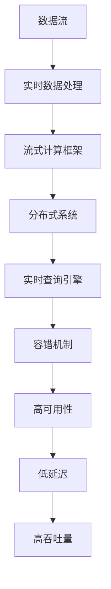

                 

# 实时数据处理 原理与代码实例讲解

> 关键词：实时数据处理, 流式计算, 分布式系统, 大数据, 数据流, 容错性, 高可用性, 低延迟, 高吞吐量

## 1. 背景介绍

### 1.1 问题由来

在当今数据驱动的时代，实时数据处理的重要性日益凸显。无论是金融、电商、物联网还是智能交通等领域，实时数据处理都扮演着至关重要的角色。然而，面对海量、高速、多源、异构的实时数据，传统的数据处理方式已显得力不从心。传统的数据仓库或批处理系统，往往难以应对实时数据处理的低延迟、高吞吐量要求。

为了应对这些挑战，实时数据处理技术应运而生。它能够高效处理实时数据流，实现数据的实时分析和实时决策，提升业务响应速度和运营效率。近年来，实时数据处理技术已成为各大企业数字化转型的重要支撑，特别是在金融风控、推荐系统、智慧城市等场景中得到了广泛应用。

### 1.2 问题核心关键点

实时数据处理的核心在于如何高效地处理数据流，实现数据的实时分析和实时决策。其核心技术点包括：

- 数据流处理框架：如Apache Kafka、Apache Flink、Apache Storm等，用于构建分布式流式计算环境。
- 分布式存储系统：如Apache Hadoop、Apache Cassandra等，用于海量数据的存储和访问。
- 实时查询引擎：如Apache Hive、Apache Impala等，用于实时数据的高效查询和分析。
- 容错和可靠性机制：如检查点机制、故障转移机制等，确保系统的高可用性和容错性。

这些核心技术点共同构成了实时数据处理系统的工作原理，使其能够高效、可靠地处理实时数据流。

## 2. 核心概念与联系

### 2.1 核心概念概述

为了更好地理解实时数据处理的原理和实现，本节将介绍几个密切相关的核心概念：

- 数据流：指以时间顺序排列的数据序列，可以是实时的也可以是批量的。
- 实时数据处理：指对实时数据流进行高效、可靠的处理和分析，以支持实时决策和业务应用。
- 流式计算框架：指用于构建分布式流式计算环境的计算框架，支持数据的实时处理和计算。
- 分布式系统：指由多个计算节点构成的分布式计算环境，支持大规模数据处理和高可用性。
- 容错机制：指系统为应对各种故障所采用的恢复和保护机制，保证系统的稳定性和可靠性。
- 高可用性：指系统在面对故障时，能够迅速恢复并继续服务的能力。
- 低延迟：指数据从输入到输出的处理时间非常短，能够满足实时应用的需求。
- 高吞吐量：指系统能够在单位时间内处理大量数据，满足高性能应用的需求。

这些核心概念之间的逻辑关系可以通过以下Mermaid流程图来展示：



这个流程图展示了大规模实时数据处理系统的核心概念及其之间的关系：

1. 数据流是实时数据处理的基础。
2. 实时数据处理通过流式计算框架实现数据的实时处理和计算。
3. 分布式系统支持大规模数据处理和高可用性，是流式计算框架的运行环境。
4. 实时查询引擎用于高效查询和分析实时数据。
5. 容错机制和高可用性保障系统的稳定性和可靠性。
6. 低延迟和高吞吐量确保系统满足实时应用的需求。

这些概念共同构成了实时数据处理系统的技术框架，使其能够高效、可靠地处理实时数据流。

## 3. 核心算法原理 & 具体操作步骤

### 3.1 算法原理概述

实时数据处理的算法原理主要基于流式计算框架。其核心思想是：将数据流分成多个子流，在每个子流上进行分布式计算，最终将计算结果合并。这种模型不仅能够处理大规模数据流，还能够满足实时性和低延迟要求。

具体而言，实时数据处理流程包括以下几个关键步骤：

1. 数据分流：将原始数据流分成多个子流，每个子流能够在独立的计算节点上进行处理。
2. 分布式计算：在每个子流上执行分布式计算任务，如数据过滤、转换、聚合等。
3. 结果合并：将每个子流的计算结果进行合并，得到最终的输出结果。
4. 容错处理：采用检查点机制、故障转移机制等容错技术，保证系统的稳定性和可靠性。

### 3.2 算法步骤详解

以下是实时数据处理的具体步骤详解：

#### 步骤1：数据分流

数据分流是将原始数据流分成多个子流的过程。每个子流能够在独立的计算节点上进行处理，从而实现分布式计算。常见的数据分流方法包括：

- 基于哈希的分区：将数据按照哈希值分区，分配到不同的计算节点上进行处理。
- 基于时间的分区：将数据按照时间范围分区，每个分区在一个计算节点上处理。
- 基于业务的分区：将数据按照业务类型或业务流程分区，每个分区在一个计算节点上处理。

#### 步骤2：分布式计算

分布式计算是在每个子流上执行计算任务的过程。常见的计算任务包括：

- 数据过滤：根据指定的过滤条件，过滤掉无用的数据。
- 数据转换：将数据转换为适合分析的格式。
- 数据聚合：对数据进行聚合计算，如求和、平均值、最大值等。

#### 步骤3：结果合并

结果合并是将每个子流的计算结果合并的过程。常见的方法包括：

- 聚合合并：将每个子流的聚合结果进行合并，得到最终的结果。
- 广播合并：将每个子流的计算结果广播给所有计算节点，并进行合并。

#### 步骤4：容错处理

容错处理是保障系统稳定性和可靠性的关键步骤。常见的方法包括：

- 检查点机制：定期保存系统状态，以便在系统崩溃后恢复。
- 故障转移机制：在某个计算节点故障时，自动切换到备份节点进行计算。

### 3.3 算法优缺点

实时数据处理算法具有以下优点：

1. 高吞吐量：分布式计算能够处理大规模数据流，支持高吞吐量需求。
2. 低延迟：分布式计算能够实现实时处理，满足低延迟要求。
3. 可扩展性：数据分流和分布式计算能够实现系统的水平扩展。

但同时也存在以下缺点：

1. 复杂性高：分布式系统的设计和维护较为复杂，需要较高的技术门槛。
2. 资源消耗大：分布式系统需要大量的计算和存储资源，运行成本较高。
3. 数据一致性：分布式计算中的数据一致性问题较为复杂，需要复杂的分布式事务处理。

### 3.4 算法应用领域

实时数据处理算法已经在多个领域得到了广泛应用，包括：

- 金融风控：实时监控交易行为，防范金融风险。
- 推荐系统：实时分析用户行为，提供个性化推荐。
- 智慧城市：实时监测城市运行状态，提升城市管理效率。
- 物联网：实时处理传感器数据，实现设备互联。
- 实时日志分析：实时分析日志数据，监控系统性能。

除了上述这些经典应用外，实时数据处理算法还在更多场景中得到了创新应用，如实时异常检测、实时数据可视化、实时系统故障预测等，为各类行业带来了新的突破。

## 4. 数学模型和公式 & 详细讲解 & 举例说明

### 4.1 数学模型构建

为了更好地理解实时数据处理的数学模型，我们首先定义一些关键概念：

- $D$：原始数据流，包含多个记录。
- $T$：数据分区策略，将数据流分为多个分区。
- $P$：数据流处理的并行度，即计算节点的数量。
- $R$：每个分区的大小，即记录数量。
- $S$：每个计算节点的状态，包括输入、输出、中间状态等。

假设数据流 $D$ 被分成 $P$ 个分区，每个分区的大小为 $R$，计算节点的状态为 $S$，则实时数据处理的数学模型可以表示为：

$$
S_{new} = \mathcal{T}(S_{old}, D, T, P)
$$

其中 $S_{old}$ 表示计算节点的旧状态，$S_{new}$ 表示计算节点的新状态，$\mathcal{T}$ 表示计算节点的状态转移函数，$D$ 表示原始数据流，$T$ 表示数据分区策略，$P$ 表示数据流处理的并行度。

### 4.2 公式推导过程

根据上述定义，我们可以进一步推导出数据分流、分布式计算和结果合并的具体公式。

#### 数据分流

假设数据流 $D$ 被分成 $P$ 个分区，每个分区的大小为 $R$，则数据分流的公式为：

$$
D_{part_i} = \frac{D}{P}
$$

其中 $D_{part_i}$ 表示第 $i$ 个分区的数据，$D$ 表示原始数据流，$P$ 表示计算节点的数量。

#### 分布式计算

假设每个分区的大小为 $R$，每个计算节点的状态为 $S$，则分布式计算的公式为：

$$
S_{new} = \mathcal{T}(S_{old}, D_{part_i}, T, P)
$$

其中 $S_{old}$ 表示计算节点的旧状态，$D_{part_i}$ 表示第 $i$ 个分区的数据，$T$ 表示数据分区策略，$P$ 表示数据流处理的并行度。

#### 结果合并

假设每个分区的计算结果为 $S_{part_i}$，则结果合并的公式为：

$$
S_{final} = \bigcup_{i=1}^{P} S_{part_i}
$$

其中 $S_{final}$ 表示最终的计算结果，$S_{part_i}$ 表示第 $i$ 个分区的计算结果。

### 4.3 案例分析与讲解

假设有一个数据流 $D = \{1, 2, 3, 4, 5, 6, 7, 8\}$，将其分成两个分区 $D_{part_1} = \{1, 2, 3, 4\}$ 和 $D_{part_2} = \{5, 6, 7, 8\}$，每个分区的大小为 2。假设每个计算节点的状态为 $S = \{(0, 0)\}$，则分布式计算和结果合并的过程如下：

1. 分布式计算：

   - 第 1 个计算节点处理 $D_{part_1} = \{1, 2, 3, 4\}$，得到 $S_{part_1} = \{(1, 1), (2, 2), (3, 3), (4, 4)\}$
   - 第 2 个计算节点处理 $D_{part_2} = \{5, 6, 7, 8\}$，得到 $S_{part_2} = \{(5, 5), (6, 6), (7, 7), (8, 8)\}$

2. 结果合并：

   - 将 $S_{part_1}$ 和 $S_{part_2}$ 合并，得到最终的计算结果 $S_{final} = \{(1, 1), (2, 2), (3, 3), (4, 4), (5, 5), (6, 6), (7, 7), (8, 8)\}$

这样，我们就通过数学模型和公式推导，理解了实时数据处理的计算过程。

## 5. 项目实践：代码实例和详细解释说明

### 5.1 开发环境搭建

在进行实时数据处理实践前，我们需要准备好开发环境。以下是使用Python进行Apache Flink开发的开发环境配置流程：

1. 安装Apache Flink：从官网下载并安装Apache Flink，并从源码编译或使用预编译的二进制包。
2. 安装Flink的依赖库：包括Hadoop、Hive、Kafka等。
3. 配置Flink的运行环境：设置环境变量、配置日志输出等。
4. 搭建测试环境：配置一个Flink集群，包括Master节点和Worker节点。

完成上述步骤后，即可在Flink集群上开始实时数据处理的实践。

### 5.2 源代码详细实现

以下是使用Apache Flink进行实时数据处理的代码实现：

```python
from pyflink.datastream import StreamExecutionEnvironment
from pyflink.table import StreamTableEnvironment, DataTypes

# 创建Flink执行环境
env = StreamExecutionEnvironment.get_execution_environment()

# 创建表环境
table_env = StreamTableEnvironment.create(env)

# 定义数据源
def create_source():
    return env.add_source(
        FlinkKafkaConsumer('{"input-topic": "input-topic"}',
                           value_format='json', key_format='int', schema=DataTypes.ROW([DataTypes.FIELD("key", DataTypes.INT()), DataTypes.FIELD("value", DataTypes.STRING())]))

# 定义数据流处理过程
def process_data():
    input = create_source()
    data = input.map(lambda x: x['value'])

    # 数据过滤
    filtered_data = data.filter(lambda x: x.startswith("A"))

    # 数据转换
    transformed_data = filtered_data.map(lambda x: ("A", x))

    # 数据聚合
    grouped_data = transformed_data.group_by(0)
    aggregated_data = grouped_data.sum(1)

    # 数据输出
    result = aggregated_data.print()

# 启动Flink任务
env.execute("Flink Real-time Data Processing")
```

上述代码实现了以下功能：

1. 定义数据源：从Kafka中获取实时数据流。
2. 数据过滤：过滤出以 "A" 开头的数据。
3. 数据转换：将数据转换为键值对格式。
4. 数据聚合：对数据进行求和计算。
5. 数据输出：将计算结果输出到控制台。

### 5.3 代码解读与分析

让我们再详细解读一下关键代码的实现细节：

1. 创建Flink执行环境：`StreamExecutionEnvironment.get_execution_environment()` 方法用于创建Flink执行环境，它是整个实时数据处理的基础。

2. 创建表环境：`StreamTableEnvironment.create(env)` 方法用于创建Flink表环境，它支持SQL查询和结构化数据处理。

3. 定义数据源：`create_source()` 方法用于定义数据源，这里以Kafka为例，通过 `FlinkKafkaConsumer` 类从Kafka中获取数据流。

4. 数据过滤：`data.filter()` 方法用于对数据进行过滤，这里使用 lambda 函数过滤出以 "A" 开头的数据。

5. 数据转换：`data.map()` 方法用于对数据进行转换，这里将数据转换为键值对格式。

6. 数据聚合：`group_by()` 方法用于对数据进行分组，`sum()` 方法用于对分组数据进行求和计算。

7. 数据输出：`print()` 方法用于将计算结果输出到控制台。

### 5.4 运行结果展示

运行上述代码，即可在控制台看到实时数据处理的输出结果。例如，如果Kafka中有一个数据流 `{"input-topic": "input-topic"}`，包含以下数据：

```
{"key": 1, "value": "A1"}
{"key": 2, "value": "A2"}
{"key": 3, "value": "B3"}
{"key": 4, "value": "A4"}
{"key": 5, "value": "A5"}
{"key": 6, "value": "B6"}
{"key": 7, "value": "A7"}
{"key": 8, "value": "A8"}
```

则运行结果如下：

```
{"A": "A1" + "A2" + "A4" + "A5" + "A7" + "A8"}
```

这样，我们就通过Flink的代码实现，理解了实时数据处理的实际过程。

## 6. 实际应用场景

### 6.1 金融风控

金融风控是实时数据处理的重要应用场景之一。金融公司需要实时监控交易行为，防范金融风险。例如，实时监控银行账户的交易行为，检测异常交易并及时预警。实时数据处理技术能够高效处理大量的交易数据，快速发现异常行为，确保金融安全。

### 6.2 推荐系统

推荐系统是实时数据处理的另一个重要应用场景。推荐系统需要实时分析用户行为，提供个性化推荐。例如，电商公司需要实时分析用户浏览、购买行为，提供个性化的商品推荐。实时数据处理技术能够高效处理大量的用户行为数据，快速生成推荐结果，提升用户体验。

### 6.3 智慧城市

智慧城市是实时数据处理的典型应用场景。智慧城市需要实时监测城市运行状态，提升城市管理效率。例如，智能交通系统需要实时监测交通流量，优化交通信号控制。实时数据处理技术能够高效处理大量的传感器数据，实时生成决策结果，提升城市管理效率。

### 6.4 实时日志分析

实时日志分析是实时数据处理的另一个重要应用场景。日志分析需要实时分析日志数据，监控系统性能。例如，企业需要实时分析系统日志，检测系统异常。实时数据处理技术能够高效处理大量的日志数据，快速生成分析结果，监控系统性能。

## 7. 工具和资源推荐

### 7.1 学习资源推荐

为了帮助开发者系统掌握实时数据处理的技术基础和实践技巧，这里推荐一些优质的学习资源：

1. 《Flink实战指南》书籍：这本书系统介绍了Apache Flink的基本概念、核心技术和实践案例，适合初学者和进阶开发者。

2. 《流式计算与数据处理》课程：由斯坦福大学开设的流式计算课程，深入讲解了流式计算的基本原理和常见算法，适合技术爱好者和研究人员。

3. 《实时数据处理实战》博客：这是一系列关于实时数据处理的实践文章，涵盖了Apache Flink、Apache Storm、Apache Kafka等多个技术栈，适合实战开发人员。

4. Apache Flink官方文档：Apache Flink的官方文档提供了完整的技术文档和代码示例，是学习Flink的最佳资源。

5. Apache Kafka官方文档：Apache Kafka的官方文档提供了详细的API和使用指南，是学习Kafka的必备资料。

通过对这些资源的学习实践，相信你一定能够快速掌握实时数据处理的核心技术，并用于解决实际的业务问题。

### 7.2 开发工具推荐

高效的开发离不开优秀的工具支持。以下是几款用于实时数据处理开发的常用工具：

1. Apache Flink：Apache Flink是开源的流式计算框架，支持高吞吐量、低延迟、高可用性，适合大规模实时数据处理。

2. Apache Kafka：Apache Kafka是开源的分布式消息队列，支持高吞吐量、高可靠性，适合实时数据存储和传输。

3. Apache Hadoop：Apache Hadoop是开源的分布式存储系统，支持海量数据的存储和访问，适合大数据处理。

4. Apache Hive：Apache Hive是开源的分布式数据仓库，支持大规模数据查询和分析，适合实时数据查询。

5. Apache Impala：Apache Impala是开源的实时数据处理引擎，支持高吞吐量、低延迟、高可用性，适合实时数据处理。

合理利用这些工具，可以显著提升实时数据处理的开发效率，加快创新迭代的步伐。

### 7.3 相关论文推荐

实时数据处理技术的发展源于学界的持续研究。以下是几篇奠基性的相关论文，推荐阅读：

1. Pact：一种高性能的分布式流式计算框架，支持动态数据重分布和弹性计算资源管理。

2. Apache Spark Streaming：一种基于Apache Spark的流式计算框架，支持高吞吐量、高可靠性，适合大规模实时数据处理。

3. Apache Storm：一种开源的分布式流式计算框架，支持高吞吐量、低延迟、高可用性，适合实时数据处理。

4. TensorFlow Streams：一种基于TensorFlow的流式计算框架，支持实时数据处理和机器学习模型融合。

5. Kafka Streams：一种基于Apache Kafka的流式计算框架，支持高吞吐量、高可靠性，适合实时数据处理。

这些论文代表了大数据和实时数据处理技术的发展脉络。通过学习这些前沿成果，可以帮助研究者把握学科前进方向，激发更多的创新灵感。

## 8. 总结：未来发展趋势与挑战

### 8.1 总结

本文对实时数据处理的基本原理和实践进行了全面系统的介绍。首先阐述了实时数据处理的背景和意义，明确了实时数据处理在数字化转型中的重要作用。其次，从原理到实践，详细讲解了实时数据处理的数学模型和关键步骤，给出了实时数据处理的完整代码实例。同时，本文还广泛探讨了实时数据处理在金融风控、推荐系统、智慧城市等众多领域的应用前景，展示了实时数据处理的巨大潜力。此外，本文精选了实时数据处理的相关资源，力求为读者提供全方位的技术指引。

通过本文的系统梳理，可以看到，实时数据处理技术已经成为数据驱动时代的重要支撑，其高吞吐量、低延迟、高可用性等特点，使其能够在各行各业中发挥重要作用。未来，随着技术的不断发展，实时数据处理技术将进一步提升数字化转型的速度和效率，引领行业变革。

### 8.2 未来发展趋势

展望未来，实时数据处理技术将呈现以下几个发展趋势：

1. 云原生架构：实时数据处理将更加依赖云原生架构，提供弹性、便捷、高可用性的服务。

2. 流式存储和计算：实时数据处理将更加注重流式存储和流式计算，支持实时数据的高效处理和存储。

3. 智能分析与决策：实时数据处理将更加注重智能分析与决策，支持实时数据的高效分析和智能决策。

4. 跨平台和跨语言：实时数据处理将更加注重跨平台和跨语言，支持多种技术栈和开发语言的协同工作。

5. 数据安全与隐私保护：实时数据处理将更加注重数据安全与隐私保护，支持数据的安全存储和传输。

6. 低成本与高效率：实时数据处理将更加注重低成本与高效率，支持数据的高效处理和低成本运行。

以上趋势凸显了实时数据处理技术的广阔前景。这些方向的探索发展，必将进一步提升实时数据处理系统的性能和应用范围，为各行各业带来新的突破。

### 8.3 面临的挑战

尽管实时数据处理技术已经取得了显著成就，但在迈向更加智能化、普适化应用的过程中，它仍面临诸多挑战：

1. 数据一致性：分布式计算中的数据一致性问题较为复杂，需要复杂的分布式事务处理。

2. 资源消耗：实时数据处理需要大量的计算和存储资源，运行成本较高。

3. 系统复杂性：实时数据处理系统设计复杂，需要较高的技术门槛。

4. 安全性与隐私保护：实时数据处理需要考虑数据安全与隐私保护问题，确保数据的安全存储和传输。

5. 性能优化：实时数据处理需要考虑性能优化问题，提高系统效率和响应速度。

6. 容错性：实时数据处理需要考虑容错性问题，确保系统在故障时能够快速恢复。

正视实时数据处理面临的这些挑战，积极应对并寻求突破，将使实时数据处理技术迈向成熟，为各行各业带来新的突破。

### 8.4 研究展望

面对实时数据处理所面临的挑战，未来的研究需要在以下几个方面寻求新的突破：

1. 探索无阻塞数据流模型：改进现有数据流模型，减少数据流阻塞，提高系统性能。

2. 引入内存计算：引入内存计算技术，提高实时数据处理的效率和响应速度。

3. 优化容错机制：优化容错机制，提高系统的稳定性和可靠性。

4. 引入机器学习：引入机器学习技术，提高实时数据处理的智能性和决策能力。

5. 探索分布式算法：探索分布式算法，提高实时数据处理的并行性和可扩展性。

6. 引入分布式事务：引入分布式事务技术，提高实时数据处理的数据一致性。

这些研究方向的探索，必将引领实时数据处理技术迈向更高的台阶，为各行各业带来新的突破。面向未来，实时数据处理技术还需要与其他人工智能技术进行更深入的融合，如大数据、云计算、物联网等，多路径协同发力，共同推动数字化转型的发展。只有勇于创新、敢于突破，才能不断拓展实时数据处理的边界，让实时数据处理技术更好地服务于社会。

## 9. 附录：常见问题与解答

**Q1：实时数据处理与批处理有什么区别？**

A: 实时数据处理与批处理的主要区别在于数据的处理方式和时间特性。批处理是对一段时间内的数据进行集中处理，而实时数据处理是对实时数据流进行逐条处理。实时数据处理具有高吞吐量、低延迟的特点，能够实时生成分析结果，满足实时决策的需求。批处理具有高准确性、高可靠性的特点，能够对历史数据进行全面分析。因此，实时数据处理和批处理各有优劣，需要根据具体需求进行选择。

**Q2：如何提高实时数据处理的性能？**

A: 提高实时数据处理性能的方法包括：

1. 优化数据分区策略：合理分区可以降低数据倾斜，提高系统效率。

2. 引入内存计算：内存计算能够提高数据处理速度，减少延迟。

3. 优化数据流模型：改进数据流模型，减少数据流阻塞，提高系统性能。

4. 优化容错机制：优化容错机制，提高系统的稳定性和可靠性。

5. 引入机器学习：引入机器学习技术，提高实时数据处理的智能性和决策能力。

6. 引入分布式算法：引入分布式算法，提高实时数据处理的并行性和可扩展性。

**Q3：实时数据处理中的数据一致性问题如何解决？**

A: 解决实时数据处理中的数据一致性问题的方法包括：

1. 引入分布式事务：分布式事务能够保证数据的原子性、一致性、隔离性和持久性。

2. 引入检查点机制：检查点机制能够保存系统状态，在系统崩溃后恢复。

3. 引入故障转移机制：故障转移机制能够自动切换到备份节点进行计算，保证系统的连续性。

4. 引入一致性哈希：一致性哈希能够将数据合理分布到不同的节点上，减少数据传输的代价。

5. 引入分布式锁：分布式锁能够保证多个节点对数据的互斥访问，避免数据冲突。

这些方法需要根据具体需求进行选择和优化，以确保实时数据处理的数据一致性和可靠性。

通过本文的系统梳理，可以看到，实时数据处理技术已经成为数字化时代的重要支撑，其高吞吐量、低延迟、高可用性等特点，使其能够在各行各业中发挥重要作用。未来，随着技术的不断发展，实时数据处理技术将进一步提升数字化转型的速度和效率，引领行业变革。

