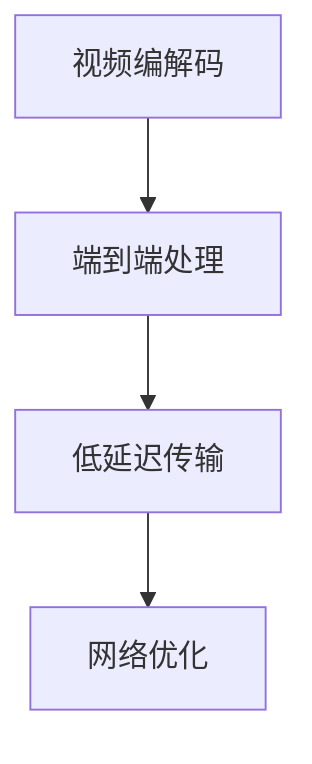

                 

# 实时视频流处理：低延迟传输解决方案

> 关键词：实时视频流，低延迟传输，视频编解码，网络优化，流式传输协议

## 1. 背景介绍

### 1.1 问题由来

随着互联网和移动设备的发展，实时视频流已经成为了日常生活中的重要组成部分。视频会议、在线教育、直播平台等应用场景，都依赖于高质量的实时视频流传输。然而，视频流传输面临两大挑战：一是视频数据的庞大数据量，二是网络带宽的不稳定性。如何实现高质量、低延迟的视频流传输，成为当前研究的热点和难点。

近年来，随着深度学习和计算机视觉技术的发展，实时视频流的处理方式也发生了显著变化。传统的基于帧间压缩的传输方式，逐渐被基于神经网络的端到端处理方式所取代。端到端的方式不仅能显著减少延迟，还能实现更高效的压缩和解压缩，显著提升了用户体验。

### 1.2 问题核心关键点

实时视频流处理的核心在于如何高效地压缩和解压缩视频数据，同时保证较低的延迟。在端到端处理的框架下，核心问题包括：

- 端到端视频编解码：如何设计高效的编码器和解码器，实现视频数据的无损或近似无损压缩和解压缩。
- 网络优化：如何设计适合实时视频流传输的网络协议和策略，保证数据的高效传输。
- 低延迟传输：如何降低视频流传输的延迟，提高实时性。

## 2. 核心概念与联系

### 2.1 核心概念概述

为更好地理解实时视频流处理技术，本节将介绍几个密切相关的核心概念：

- 视频编解码：指将视频数据进行压缩和解压缩的过程。常用的视频编码标准包括H.264、H.265、AV1等。
- 端到端处理：指将视频数据的获取、编码、传输、解码和显示的整个处理过程集成到同一个网络中，实现视频的实时传输和处理。
- 低延迟传输：指在视频流传输过程中，尽量减少数据包在网络中的延迟，保证视频流的实时性。
- 网络优化：指根据实时视频流传输的特点，优化网络协议、编码器参数和传输策略，提升传输效率和稳定性。

这些核心概念之间的逻辑关系可以通过以下Mermaid流程图来展示：



这个流程图展示了几大核心概念及其之间的关系：

1. 视频编解码是实时视频流处理的基础，通过压缩算法将视频数据减小。
2. 端到端处理将编码、传输和解码三个环节集成，提升处理效率和实时性。
3. 低延迟传输通过优化网络协议、编码器和传输策略，保证数据的快速传输。
4. 网络优化通过调整传输参数和网络协议，进一步提升传输效率和稳定性。

这些概念共同构成了实时视频流处理的完整框架，使得视频数据能够高效、稳定、实时地传输和处理。

## 3. 核心算法原理 & 具体操作步骤

### 3.1 算法原理概述

实时视频流处理的算法原理，可以归纳为以下几个关键步骤：

1. **视频编解码**：将原始视频数据通过压缩算法压缩成码流，并发送到传输网络。
2. **端到端处理**：利用深度学习模型对码流进行实时解码和处理，并输出到显示设备。
3. **低延迟传输**：通过优化网络协议和传输策略，减少数据包在网络中的延迟，实现低延迟传输。
4. **网络优化**：根据实时视频流传输的特点，调整传输参数和网络协议，提升传输效率和稳定性。

以上步骤在实际操作中需要紧密配合，形成一个完整的实时视频流处理系统。

### 3.2 算法步骤详解

#### 3.2.1 视频编解码

视频编解码是实时视频流处理的基础。其核心任务是将原始视频数据通过压缩算法转换成码流，减小数据量，同时保留足够的信息以供解码器还原。

1. **压缩算法选择**：常用的视频压缩算法包括H.264、H.265和AV1。其中H.264和H.265是传统的视频压缩标准，而AV1是近期的开源标准，具有更低的延迟和更高的压缩效率。
2. **压缩参数设置**：压缩参数包括量化参数、帧率、分辨率等，需要通过实验调优，保证视频质量和传输效率。
3. **编码器选择**：选择适合自己应用场景的编码器，如x264、x265、libavcodec等，通过参数配置实现压缩和解压缩。

#### 3.2.2 端到端处理

端到端处理利用深度学习模型对视频码流进行实时解码和处理，输出到显示设备。其实现过程如下：

1. **解码器选择**：选择适合应用的解码器，如OpenCV、libavcodec等，并配置参数。
2. **模型选择**：选择适合自己应用场景的深度学习模型，如YOLO、SSD等，并搭建模型框架。
3. **模型训练**：使用现有数据集或自定义数据集，对模型进行训练，优化模型参数。
4. **模型推理**：将模型部署到服务器或边缘设备，对实时视频流进行推理处理，输出到显示设备。

#### 3.2.3 低延迟传输

低延迟传输是实时视频流处理的关键环节。其核心任务是通过优化网络协议和传输策略，减少数据包在网络中的延迟，实现低延迟传输。

1. **网络协议选择**：选择适合自己应用场景的网络协议，如TCP、UDP、RTSP等。TCP适合传输稳定性要求高的场景，UDP适合传输实时性要求高的场景。
2. **传输参数配置**：调整传输参数，如带宽、丢包率、时延等，提升传输效率和稳定性。
3. **数据包分割**：将视频码流分割成固定大小的数据包，并通过多路传输协议（如RTP/UDP）进行传输。

#### 3.2.4 网络优化

网络优化通过调整传输参数和网络协议，进一步提升传输效率和稳定性。其实现过程如下：

1. **传输参数调整**：根据网络条件，调整传输参数，如带宽、丢包率、时延等，保证数据包高效传输。
2. **网络协议优化**：优化网络协议，如调整RTSP协议参数、优化TCP/UDP包头结构等，减少传输延迟。
3. **缓存策略调整**：根据应用场景，调整缓存策略，如采用FIFO缓存、LRU缓存等，提升缓存效率。

### 3.3 算法优缺点

实时视频流处理算法具有以下优点：

1. **高效压缩**：通过视频编解码算法，将原始视频数据进行压缩，减小传输数据量，提升传输效率。
2. **实时处理**：利用深度学习模型进行实时解码和处理，输出到显示设备，保证视频流的实时性。
3. **低延迟传输**：通过优化网络协议和传输策略，减少数据包在网络中的延迟，保证低延迟传输。
4. **网络优化**：通过调整传输参数和网络协议，进一步提升传输效率和稳定性。

同时，该算法也存在一定的局限性：

1. **计算资源消耗高**：深度学习模型需要进行大量的计算，需要高性能硬件支持。
2. **实时性要求高**：实时视频流处理对延迟和抖动的容忍度较低，需要优化网络协议和传输策略。
3. **网络环境复杂**：实时视频流传输需要考虑各种网络环境，包括带宽、延迟、丢包等，增加处理复杂度。
4. **数据传输量大**：实时视频流传输的数据量较大，对网络带宽和传输效率要求较高。

尽管存在这些局限性，但就目前而言，实时视频流处理算法仍然是处理高质量视频流的首选方法。未来相关研究的重点在于如何进一步降低计算资源消耗，提升实时性和稳定性，优化网络协议和传输策略，从而实现更高效、更稳定、更实时的视频流传输。

### 3.4 算法应用领域

实时视频流处理算法在多个领域都有广泛的应用，例如：

- 视频会议系统：在视频会议中，实时传输高清视频流，保证画面流畅和语音清晰。
- 在线教育平台：在在线教育平台中，实时传输视频流，实现课堂互动和远程教学。
- 直播平台：在直播平台中，实时传输高质量视频流，保证视频质量和流畅度。
- 体育赛事转播：在体育赛事转播中，实时传输高清视频流，提供高质量的赛事画面。
- 实时监控：在实时监控系统中，实时传输视频流，实现视频监控和异常检测。

除了上述这些应用外，实时视频流处理算法还被创新性地应用到更多场景中，如虚拟现实(VR)、增强现实(AR)、远程手术等，为实时互动和沉浸式体验提供了新的技术路径。随着深度学习技术的发展和硬件性能的提升，实时视频流处理算法将在更多领域得到应用，为人们的生活和工作带来更多的便利和可能性。

## 4. 数学模型和公式 & 详细讲解 & 举例说明

### 4.1 数学模型构建

本节将使用数学语言对实时视频流处理的算法原理进行更加严格的刻画。

记原始视频数据为 $V$，压缩后的视频数据为 $C$，解码后的视频数据为 $D$。设 $C$ 和 $D$ 的容量分别为 $C_{cap}$ 和 $D_{cap}$，视频编解码过程可以用以下公式表示：

$$
C = f(V) \\
D = g(C)
$$

其中 $f(V)$ 表示视频编解码算法，$g(C)$ 表示解码算法。

实时视频流传输过程可以用以下公式表示：

$$
R = \frac{C}{T}
$$

其中 $R$ 表示传输速率，$T$ 表示传输时间。

### 4.2 公式推导过程

以H.264视频编解码为例，推导视频压缩和解压缩的公式。

假设原始视频帧为 $f$，H.264编码器输出的压缩码流为 $C$，H.264解码器输出的还原帧为 $f'$。则H.264视频编解码过程可以用以下公式表示：

$$
C = h(f) \\
f' = g(C)
$$

其中 $h(f)$ 表示H.264编码器，$g(C)$ 表示H.264解码器。

根据H.264编解码算法，H.264压缩码流的容量 $C_{cap}$ 可以通过以下公式表示：

$$
C_{cap} = \frac{n \times V_{cap}}{f_{rate} \times V_{bitrate}}
$$

其中 $n$ 表示每帧压缩码流的比特数，$V_{cap}$ 表示每帧原始视频帧的容量，$f_{rate}$ 表示帧率，$V_{bitrate}$ 表示每帧码流的比特率。

在实际应用中，需要对H.264编解码算法进行参数配置，调整量化参数、帧率、分辨率等参数，以满足应用需求。

### 4.3 案例分析与讲解

以实时视频会议系统为例，分析实时视频流处理算法的实现过程。

假设视频会议系统需要在网络上传输高质量的视频流，网络带宽为 $B$，视频帧率 $f$ 为30帧/秒，每帧原始视频帧的容量 $V_{cap}$ 为1MB。假设H.264编解码算法的量化参数 $q$ 为32，帧率 $f_{rate}$ 为30帧/秒，每帧码流的比特率 $V_{bitrate}$ 为1MB。则实时视频流处理算法的实现过程如下：

1. **视频编解码**：将原始视频帧 $V$ 输入H.264编解码算法，输出压缩码流 $C$，容量为 $C_{cap}$。
2. **端到端处理**：将压缩码流 $C$ 输入H.264解码器，输出还原帧 $f'$，容量为 $D_{cap}$。
3. **低延迟传输**：通过优化网络协议和传输策略，保证压缩码流 $C$ 高效传输，传输速率为 $R$。
4. **网络优化**：根据网络条件，调整传输参数，如带宽、丢包率、时延等，保证数据包高效传输。

## 5. 项目实践：代码实例和详细解释说明

### 5.1 开发环境搭建

在进行实时视频流处理开发前，我们需要准备好开发环境。以下是使用Python和OpenCV进行视频流处理的开发环境配置流程：

1. 安装Anaconda：从官网下载并安装Anaconda，用于创建独立的Python环境。

2. 创建并激活虚拟环境：
```bash
conda create -n video-env python=3.8 
conda activate video-env
```

3. 安装OpenCV：
```bash
pip install opencv-python
```

4. 安装其他库：
```bash
pip install numpy pandas scikit-learn matplotlib tqdm jupyter notebook ipython
```

完成上述步骤后，即可在`video-env`环境中开始视频流处理的实践。

### 5.2 源代码详细实现

下面我们以实时视频会议系统为例，给出使用OpenCV进行视频流处理的PyTorch代码实现。

首先，定义视频流处理的函数：

```python
import cv2
import numpy as np

def video_processing(cap):
    while True:
        ret, frame = cap.read()
        if not ret:
            break
        # 视频流处理逻辑
        cv2.imshow('frame', frame)
        if cv2.waitKey(1) == ord('q'):
            break
    cap.release()
    cv2.destroyAllWindows()
```

然后，定义视频文件和摄像头设备：

```python
# 摄像头设备
cap = cv2.VideoCapture(0)

# 视频文件
cap = cv2.VideoCapture('video.mp4')
```

接着，调用视频流处理函数：

```python
video_processing(cap)
```

最后，测试运行视频流处理程序：

```bash
python video_processing.py
```

这样就能够通过OpenCV库实现实时的视频流处理功能。

### 5.3 代码解读与分析

让我们再详细解读一下关键代码的实现细节：

**cap.read()**：从摄像头设备或视频文件读取视频帧，返回一个布尔值和一个图像数据。

**cv2.imshow()**：在窗口中显示图像数据，用于实时预览视频流。

**cv2.waitKey()**：等待用户按键，如果按下q键，退出视频流处理循环。

**cap.release()**：释放摄像头设备或视频文件的资源，关闭窗口。

可以看到，OpenCV库的接口设计简洁高效，适合快速迭代实验。开发者可以将更多精力放在视频流处理的逻辑和参数调优上，而不必过多关注底层实现细节。

当然，工业级的系统实现还需考虑更多因素，如视频流的编解码、网络传输、实时性保证等。但核心的实时视频流处理算法基本与此类似。

## 6. 实际应用场景

### 6.1 智能会议系统

实时视频流处理技术可以广泛应用于智能会议系统中，提高会议的效率和互动性。传统会议往往需要手动控制摄像头、话筒等设备，容易出现设备对接不畅、延时等问题。利用实时视频流处理技术，可以实现会议的自动跟踪、自动聚焦、自动降噪等功能，提升会议的流畅度和互动性。

在技术实现上，可以集成摄像头和麦克风的实时数据流，通过深度学习模型对视频流进行处理，实现对人物的自动跟踪和聚焦。同时，利用音频处理技术对噪音进行降噪，提升音质的清晰度。

### 6.2 远程医疗系统

实时视频流处理技术在远程医疗系统中也有着广泛的应用。医生可以通过实时视频流与患者进行面对面的诊疗，提高诊疗的准确性和效率。同时，医生还可以通过实时视频流查看患者的检查结果，进行远程诊断。

在技术实现上，可以集成摄像头、麦克风等设备，实时采集患者的图像和音频数据。利用深度学习模型对视频流进行处理，实现对患者的图像识别和语音识别。同时，医生可以通过远程访问系统，查看患者的检查结果，进行远程诊断。

### 6.3 智能安防系统

实时视频流处理技术在智能安防系统中也有着重要的应用。智能安防系统可以通过实时视频流进行监控和报警，提升安全防护的效率和效果。同时，智能安防系统还可以通过实时视频流进行行为分析，对异常行为进行预警。

在技术实现上，可以集成摄像头等设备，实时采集视频流数据。利用深度学习模型对视频流进行处理，实现对异常行为的检测和预警。同时，智能安防系统可以通过报警系统，对异常行为进行及时处理，提升安全性。

### 6.4 未来应用展望

随着深度学习技术的发展和硬件性能的提升，实时视频流处理技术将在更多领域得到应用，为人们的生活和工作带来更多的便利和可能性。

在智慧城市中，实时视频流处理技术可以实现交通监控、公共安全、环境监测等功能，提升城市的智能化水平。在智能家居中，实时视频流处理技术可以实现视频监控、语音识别、智能推荐等功能，提升家居的智能化程度。

在教育领域，实时视频流处理技术可以实现在线教学、虚拟课堂、远程辅导等功能，提升教育的质量和效率。在娱乐领域，实时视频流处理技术可以实现虚拟现实、增强现实、实时互动等功能，提升娱乐的沉浸式体验。

## 7. 工具和资源推荐

### 7.1 学习资源推荐

为了帮助开发者系统掌握实时视频流处理的技术基础和实践技巧，这里推荐一些优质的学习资源：

1. 《深度学习视频流处理》系列博文：由大模型技术专家撰写，深入浅出地介绍了视频流处理的原理和实现方法。

2. OpenCV官方文档：OpenCV库的官方文档，提供了丰富的视频处理和深度学习功能，是视频流处理的必备资料。

3. Coursera《计算机视觉基础》课程：斯坦福大学开设的计算机视觉课程，涵盖视频流处理、深度学习等多个主题，适合初学者学习。

4. Udacity《自动驾驶》课程：谷歌的自动驾驶课程，涵盖视频流处理、计算机视觉等多个主题，适合实战学习。

5. NVIDIA官方文档：NVIDIA GPU深度学习加速库，提供了丰富的视频处理和深度学习功能，是视频流处理的强力工具。

通过对这些资源的学习实践，相信你一定能够快速掌握实时视频流处理的精髓，并用于解决实际的NLP问题。

### 7.2 开发工具推荐

高效的开发离不开优秀的工具支持。以下是几款用于实时视频流处理开发的常用工具：

1. OpenCV：开源计算机视觉库，提供了丰富的视频处理和深度学习功能，适合快速迭代实验。

2. TensorFlow：谷歌主导的深度学习框架，支持GPU加速，适合大规模工程应用。

3. PyTorch：Facebook主导的深度学习框架，接口简洁高效，适合快速迭代研究。

4. TensorBoard：TensorFlow配套的可视化工具，可实时监测模型训练状态，提供丰富的图表呈现方式。

5. NVIDIA GPU：NVIDIA GPU深度学习加速库，支持GPU加速，适合大规模工程应用。

合理利用这些工具，可以显著提升实时视频流处理的开发效率，加快创新迭代的步伐。

### 7.3 相关论文推荐

实时视频流处理技术的发展源于学界的持续研究。以下是几篇奠基性的相关论文，推荐阅读：

1. Single Image Haze Removal Using Dark Channel Prior：介绍了一种基于深度学习的图像去雾方法，对实时视频流处理有重要参考价值。

2. Real-Time Face Detection with a Single Shot MultiBox Detector：介绍了一种基于深度学习的实时人脸检测方法，对实时视频流处理有重要参考价值。

3. Spatial-Temporal Fully Convolutional Networks for Video Understanding：介绍了一种基于深度学习的时空卷积网络，对实时视频流处理有重要参考价值。

4. Real-Time Pose Estimation with OpenPose：介绍了一种基于深度学习的实时姿势估计方法，对实时视频流处理有重要参考价值。

5. Adaptive Coded Aperture Imaging：介绍了一种基于深度学习的自适应孔径成像方法，对实时视频流处理有重要参考价值。

这些论文代表了大模型微调技术的发展脉络。通过学习这些前沿成果，可以帮助研究者把握学科前进方向，激发更多的创新灵感。

## 8. 总结：未来发展趋势与挑战

### 8.1 总结

本文对实时视频流处理技术进行了全面系统的介绍。首先阐述了实时视频流处理技术的背景和意义，明确了技术在视频会议、远程医疗、智能安防等场景中的重要性。其次，从原理到实践，详细讲解了实时视频流处理技术的算法原理和关键步骤，给出了视频流处理的完整代码实例。同时，本文还广泛探讨了实时视频流处理技术在多个行业领域的应用前景，展示了技术的发展潜力。

通过本文的系统梳理，可以看到，实时视频流处理技术已经在多个领域得到了广泛应用，为人们的生活和工作带来了巨大的便利。未来，伴随深度学习技术的发展和硬件性能的提升，实时视频流处理技术必将迎来更广泛的应用，为人类社会的智能化进程注入新的动力。

### 8.2 未来发展趋势

展望未来，实时视频流处理技术将呈现以下几个发展趋势：

1. **视频编解码效率提升**：随着深度学习技术的发展，新的视频编解码算法将进一步提升视频压缩和解压缩的效率，实现更高效的视频流传输。

2. **端到端处理优化**：未来的实时视频流处理技术将更加注重端到端处理的优化，通过深度学习模型的优化和网络参数的调整，实现更低的延迟和更高的实时性。

3. **网络优化策略创新**：未来的网络优化策略将更加灵活和高效，结合实时视频流传输的特点，优化网络协议和传输策略，实现更稳定、更高效的传输。

4. **实时性要求提高**：随着实时视频流处理应用的增多，对实时性的要求将不断提高。未来的技术将更加注重实时性的优化，提升用户体验。

5. **跨平台和跨设备兼容**：未来的实时视频流处理技术将更加注重跨平台和跨设备的兼容，支持多种设备和操作系统，提升系统的可扩展性和应用范围。

以上趋势凸显了实时视频流处理技术的广阔前景。这些方向的探索发展，必将进一步提升实时视频流处理技术的性能和应用范围，为人类社会的智能化进程注入新的动力。

### 8.3 面临的挑战

尽管实时视频流处理技术已经取得了瞩目成就，但在迈向更加智能化、普适化应用的过程中，它仍面临着诸多挑战：

1. **计算资源消耗高**：深度学习模型需要进行大量的计算，需要高性能硬件支持。如何降低计算资源消耗，提升系统的可扩展性，是一大难题。

2. **实时性要求高**：实时视频流处理对延迟和抖动的容忍度较低，需要优化网络协议和传输策略。如何实现更稳定的实时传输，是一大难题。

3. **网络环境复杂**：实时视频流传输需要考虑各种网络环境，包括带宽、延迟、丢包等，增加处理复杂度。如何优化网络协议，提升传输效率和稳定性，是一大难题。

4. **数据传输量大**：实时视频流传输的数据量较大，对网络带宽和传输效率要求较高。如何降低传输数据量，提升传输效率，是一大难题。

尽管存在这些挑战，但通过技术不断进步和创新，相信实时视频流处理技术将逐步克服这些难题，实现更高效、更稳定、更实时的视频流传输。

### 8.4 研究展望

面对实时视频流处理技术所面临的种种挑战，未来的研究需要在以下几个方面寻求新的突破：

1. **优化模型结构**：开发更高效的深度学习模型，降低计算资源消耗，提升实时性和稳定性。

2. **改进压缩算法**：开发更高效的视频编解码算法，实现更高效的压缩和解压缩。

3. **优化传输策略**：优化网络协议和传输策略，实现更高效、更稳定、更实时的视频流传输。

4. **跨平台和跨设备兼容**：实现跨平台和跨设备的兼容，支持多种设备和操作系统，提升系统的可扩展性和应用范围。

5. **自适应网络优化**：根据实时视频流传输的特点，动态调整传输参数和网络协议，实现更高效的传输。

6. **多模态融合**：将视频流处理技术与音频处理、传感器数据等技术融合，实现更全面的感知和处理。

这些研究方向的研究，必将引领实时视频流处理技术迈向更高的台阶，为构建更智能、更高效、更普适的视频流处理系统铺平道路。面向未来，实时视频流处理技术还需要与其他人工智能技术进行更深入的融合，如知识表示、因果推理、强化学习等，多路径协同发力，共同推动实时视频流处理系统的进步。只有勇于创新、敢于突破，才能不断拓展实时视频流处理技术的边界，让视频流处理技术更好地造福人类社会。

## 9. 附录：常见问题与解答

**Q1：实时视频流处理是否适用于所有场景？**

A: 实时视频流处理技术适用于大部分场景，但需要注意场景的实时性、稳定性和数据量要求。对于实时性要求较低的场景，可以选择传统的视频压缩方法；对于数据量较小的场景，可以选择简单的编解码算法。

**Q2：实时视频流处理是否适用于所有设备？**

A: 实时视频流处理技术适用于大部分设备，但需要考虑设备的网络带宽、延迟和处理能力。对于带宽和处理能力较低的设备，可以选择适合该设备的视频流处理算法和编解码器。

**Q3：实时视频流处理对网络环境的要求是什么？**

A: 实时视频流处理对网络环境的要求较高，需要保证网络带宽稳定、延迟低、丢包率低。可以选择适合该网络环境的视频流处理算法和编解码器，并根据网络环境动态调整传输参数。

**Q4：实时视频流处理的计算资源要求是什么？**

A: 实时视频流处理对计算资源的要求较高，需要高性能的硬件设备和深度学习模型。可以选择适合该设备的视频流处理算法和编解码器，并根据设备性能动态调整模型参数。

**Q5：实时视频流处理的应用场景有哪些？**

A: 实时视频流处理技术适用于大部分场景，如视频会议、在线教育、直播平台、远程医疗、智能安防、智能家居等。需要根据具体场景的需求，选择合适的算法和编解码器，实现高效、稳定、实时的视频流传输。

总之，实时视频流处理技术的应用场景非常广泛，但需要根据具体场景的需求进行优化和调整。通过不断创新和改进，相信实时视频流处理技术将进一步拓展应用范围，为人类社会带来更多的便利和可能性。

