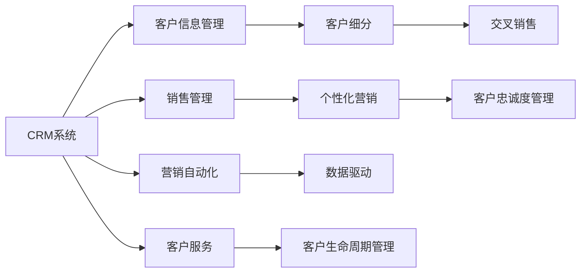

                 

# 客户关系管理：建立长期客户忠诚度

> 关键词：客户关系管理(CRM), 客户忠诚度, 数据驱动, 个性化营销, 客户细分, 交叉销售, 客户生命周期管理

## 1. 背景介绍

在数字化转型的浪潮下，客户关系管理(CRM)系统已成为企业的重要战略工具。客户关系管理通过综合集成企业的各种资源，打造以客户为中心的运营模式，帮助企业提高客户满意度和忠诚度，实现商业价值的最大化。然而，传统的CRM系统往往只关注客户的交易数据，而忽视了更深层次的客户行为和情感，导致难以真正洞察客户需求，提升客户体验。为了构建长期客户忠诚度，企业需要利用先进的客户数据管理技术，结合个性化营销策略，精准锁定目标客户群体，提供差异化的服务。本文将深入探讨如何通过数据驱动的方式，构建CRM系统，并详细介绍客户忠诚度管理的关键方法和技术。

## 2. 核心概念与联系

### 2.1 核心概念概述

为了更好地理解CRM系统和客户忠诚度管理的内在联系，本节将介绍几个关键概念：

- **客户关系管理(CRM)**：通过管理企业与客户之间的互动关系，提升客户满意度和忠诚度，实现销售增长和利润提升的目标。CRM系统通常包括客户信息管理、销售管理、营销自动化和客户服务等多个模块。

- **客户忠诚度**：指客户对企业及其品牌、产品或服务的持续偏好和购买行为。高忠诚度的客户不仅能带来更高的复购率，还能通过口碑传播，吸引新客户，降低获取成本。

- **数据驱动**：指通过系统收集、分析和利用客户数据，指导业务决策和运营管理的过程。数据驱动能帮助企业更好地理解客户需求，制定有效的营销策略，提升客户体验。

- **个性化营销**：指根据客户的偏好、行为和历史交易数据，定制个性化的营销信息和活动，提升客户参与度和满意度。

- **客户细分**：指将客户群体根据某些特定的特征划分成不同的子群体，针对不同子群体制定差异化的营销策略，提升营销效果。

- **交叉销售**：指利用现有客户资源，推荐相关的附加产品或服务，提高客户的消费金额和频次。

- **客户生命周期管理**：指通过客户全生命周期的跟踪和管理，优化客户关系，延长客户生命周期，提高客户终身价值。

这些概念构成了客户关系管理和客户忠诚度管理的核心内容，彼此之间相互作用，共同支撑企业客户管理的成功。

### 2.2 核心概念原理和架构的 Mermaid 流程图



这个流程图展示了一个基本的CRM系统框架，以及各模块之间的逻辑关系。CRM系统通过客户信息管理、销售管理、营销自动化和客户服务等模块，全面覆盖客户的全生命周期，通过客户细分、个性化营销和交叉销售等手段，提升客户忠诚度和满意度。

## 3. 核心算法原理 & 具体操作步骤

### 3.1 算法原理概述

客户关系管理和客户忠诚度管理的核心算法原理主要包括以下几个方面：

- **数据采集与清洗**：从多个渠道收集客户数据，包括交易数据、社交媒体数据、网站行为数据等，并进行去重、清洗和标准化处理，确保数据的质量和一致性。

- **客户细分**：利用聚类分析、决策树、关联规则等算法，对客户进行细分，识别出不同特征的客户群体，为后续的个性化营销和交叉销售提供基础。

- **个性化推荐**：基于协同过滤、内容推荐、混合推荐等算法，根据客户的浏览历史、购买记录和行为数据，推荐个性化的产品和服务，提升客户满意度和购买转化率。

- **情感分析**：通过自然语言处理(NLP)技术，对客户的评论、反馈和社交媒体内容进行情感分析，识别客户的情绪变化和需求变化，及时调整服务策略。

- **客户生命周期管理**：利用时间序列分析、回归模型等算法，预测客户未来的购买行为，制定相应的客户关系维护策略，延长客户的生命周期。

- **交叉销售**：通过数据挖掘、关联规则等算法，发现客户在购买某产品时可能感兴趣的其他产品或服务，实施交叉销售策略，提高客户的消费金额和频次。

### 3.2 算法步骤详解

#### 3.2.1 数据采集与清洗

1. **数据来源**：
   - 交易数据：从企业的ERP、POS系统、电商平台等获取客户的订单、支付和交易记录。
   - 社交媒体数据：从Twitter、Facebook、LinkedIn等平台抓取客户的评论、点赞、分享等信息。
   - 网站行为数据：通过网站分析工具（如Google Analytics）获取客户的访问记录、点击率、停留时间等。

2. **数据清洗**：
   - 去重：去除重复数据，确保数据的唯一性。
   - 标准化：统一数据格式，确保数据的可比性和可用性。
   - 缺失值处理：对缺失值进行填补或删除，确保数据的完整性。
   - 异常值处理：识别并处理异常数据，避免对后续分析产生干扰。

#### 3.2.2 客户细分

1. **聚类分析**：
   - 使用K-means、层次聚类等算法，根据客户的属性（如年龄、性别、收入、消费行为等）将客户划分成不同的群体。
   - 通过计算群内相似度和群间差异度，确定最优的聚类数和聚类中心。

2. **决策树分析**：
   - 使用决策树算法，根据客户的行为特征（如购买频率、消费金额、会员等级等）进行分段，识别出高价值客户和高流失风险客户。
   - 通过决策树模型，预测客户的未来行为，为后续的营销和维护策略提供依据。

3. **关联规则**：
   - 使用Apriori、FP-Growth等算法，挖掘客户在购买行为上的关联规则。
   - 通过关联规则，发现客户的购买偏好和交叉销售机会，实施相应的营销策略。

#### 3.2.3 个性化推荐

1. **协同过滤**：
   - 基于用户行为数据的协同过滤算法，推荐客户可能感兴趣的产品和服务。
   - 通过协同过滤算法，提升客户的个性化体验和满意度。

2. **内容推荐**：
   - 基于内容的推荐算法，根据产品的属性和客户的历史行为，推荐相关内容。
   - 通过内容推荐，提升客户的参与度和互动性。

3. **混合推荐**：
   - 结合协同过滤和内容推荐算法，提供更全面和精准的个性化推荐。
   - 通过混合推荐，提高推荐的覆盖面和多样性。

#### 3.2.4 情感分析

1. **文本预处理**：
   - 对客户的评论、反馈和社交媒体内容进行文本预处理，包括分词、去除停用词、词干提取等。
   - 通过文本预处理，提高文本分析的准确性和效率。

2. **情感识别**：
   - 使用情感分析算法，如朴素贝叶斯、支持向量机等，识别客户的情感倾向（如积极、消极、中性）。
   - 通过情感识别，了解客户的情绪变化和需求变化，调整服务策略。

#### 3.2.5 客户生命周期管理

1. **客户流失预测**：
   - 使用时间序列分析、回归模型等算法，预测客户流失的可能性。
   - 通过客户流失预测，及时采取措施，减少客户流失率。

2. **客户价值评估**：
   - 根据客户的历史行为和消费数据，计算客户的终身价值（CLV）。
   - 通过客户价值评估，制定客户维护策略，提升客户的消费频率和金额。

3. **客户生命周期划分**：
   - 根据客户的历史行为和消费数据，将客户划分为引入期、成长期、成熟期和衰退期。
   - 通过客户生命周期划分，实施不同的客户关系维护策略。

#### 3.2.6 交叉销售

1. **关联规则挖掘**：
   - 使用Apriori、FP-Growth等算法，挖掘客户在购买行为上的关联规则。
   - 通过关联规则挖掘，发现客户的交叉销售机会。

2. **推荐系统优化**：
   - 利用协同过滤、内容推荐等算法，优化推荐系统，提高推荐的准确性和个性化程度。
   - 通过推荐系统优化，提升交叉销售的效果。

### 3.3 算法优缺点

**优点**：
- 数据驱动：通过系统收集和分析客户数据，提升客户满意度和忠诚度，实现业务优化。
- 个性化推荐：基于客户行为数据，提供精准的个性化推荐，提升购买转化率和客户满意度。
- 情感分析：通过情感分析技术，了解客户情绪和需求变化，及时调整服务策略。
- 客户细分：通过客户细分，识别不同特征的客户群体，制定差异化的营销策略。
- 交叉销售：通过挖掘客户关联规则，发现交叉销售机会，提高客户的消费金额和频次。
- 客户生命周期管理：通过客户全生命周期管理，延长客户生命周期，提升客户终身价值。

**缺点**：
- 数据隐私：客户数据的收集和使用需要遵守隐私法规，如GDPR、CCPA等，确保数据安全和客户隐私。
- 数据质量：数据的采集和清洗需要投入大量时间和资源，数据质量受限于数据源和数据质量。
- 算法复杂度：客户细分和推荐系统等算法的实现复杂，需要较高的技术门槛和计算资源。
- 客户流失：尽管有客户流失预测模型，但客户流失仍难以完全避免，需要持续关注和应对。
- 营销成本：个性化推荐和交叉销售需要大量营销投入，成本较高。

### 3.4 算法应用领域

客户关系管理和客户忠诚度管理在多个行业领域都有广泛应用，例如：

- **零售业**：通过CRM系统，提升客户购买体验，增加复购率和消费金额。
- **金融业**：通过CRM系统，管理客户关系，提供个性化的金融服务和产品。
- **制造业**：通过CRM系统，优化客户服务，提升客户满意度，增加订单量和回访率。
- **服务业**：通过CRM系统，提高客户服务效率，增强客户粘性，提升服务质量。
- **医疗行业**：通过CRM系统，管理患者信息，提供个性化的医疗服务和咨询。
- **旅游行业**：通过CRM系统，提升客户体验，增加客户回访率和预订量。

这些行业领域的大规模实践，已经充分证明了客户关系管理和客户忠诚度管理的价值和重要性。随着CRM系统的不断发展和完善，其在更多行业中的应用前景也将更加广阔。

## 4. 数学模型和公式 & 详细讲解

### 4.1 数学模型构建

客户关系管理和客户忠诚度管理的数学模型主要包括以下几个方面：

- **客户细分模型**：
  - 聚类分析：使用K-means算法，将客户分为不同群体。
  - 决策树分析：使用决策树算法，预测客户行为。

- **个性化推荐模型**：
  - 协同过滤：使用基于用户-物品矩阵的协同过滤算法。
  - 内容推荐：使用基于内容的推荐算法，如基于向量空间的推荐算法。

- **情感分析模型**：
  - 文本情感分析：使用情感分类算法，如朴素贝叶斯、支持向量机等。

- **客户生命周期管理模型**：
  - 流失预测模型：使用时间序列分析、回归模型等算法。
  - 客户价值评估模型：使用客户终身价值（CLV）模型。

### 4.2 公式推导过程

#### 4.2.1 聚类分析

K-means算法的基本步骤如下：

1. 随机选择K个初始聚类中心。
2. 计算每个样本点到每个聚类中心的距离，分配每个样本到最近的聚类中心。
3. 重新计算每个聚类的中心点。
4. 重复2和3，直到聚类中心不再变化或达到预设的迭代次数。

设样本集为 $D=\{x_i\}_{i=1}^N$，聚类中心为 $\mu_k$，聚类距离为 $d(x_i,\mu_k)$，则K-means算法的目标函数为：

$$
\mathcal{L}=\sum_{i=1}^N\min_{k=1,...,K} d(x_i,\mu_k)^2
$$

#### 4.2.2 协同过滤

协同过滤算法的基本步骤如下：

1. 构建用户-物品评分矩阵 $R_{ij}$，表示用户i对物品j的评分。
2. 计算每个用户的协同向量 $u_i$ 和物品的协同向量 $v_j$。
3. 计算每个用户i对每个物品j的预测评分 $\hat{r}_{ij}$。
4. 将预测评分 $\hat{r}_{ij}$ 与实际评分 $r_{ij}$ 进行比较，计算推荐误差。

设用户i对物品j的评分矩阵为 $R_{ij}$，用户协同向量为 $u_i$，物品协同向量为 $v_j$，则协同过滤算法的预测评分公式为：

$$
\hat{r}_{ij}=\frac{\vec{u_i}\cdot\vec{v_j}}{\|\vec{u_i}\|\|\vec{v_j}\|}
$$

#### 4.2.3 情感分析

文本情感分析的常见算法包括朴素贝叶斯、支持向量机、卷积神经网络等。以朴素贝叶斯算法为例，其基本步骤如下：

1. 收集并预处理训练数据集。
2. 计算词频矩阵 $F$ 和条件概率矩阵 $P(w|l)$。
3. 计算每个文档的情感得分 $L(w)$。
4. 对每个文档进行情感分类。

设训练数据集为 $D=\{(x_i,l_i)\}_{i=1}^N$，词频矩阵为 $F$，条件概率矩阵为 $P(w|l)$，则朴素贝叶斯算法的情感得分公式为：

$$
L(x)=\log\frac{P(x|l)}{P(x|\neg l)}
$$

### 4.3 案例分析与讲解

#### 4.3.1 聚类分析案例

某电商公司需要对客户进行细分，以提升营销效果。公司收集了客户的购买记录、浏览历史、行为数据等，使用K-means算法进行聚类分析。经过多次迭代，最终将客户分为五个群体，分别为高价值客户、高流失风险客户、新客户、低价值客户和稳定客户。通过分析各群体的特征和需求，公司制定了针对性的营销策略，提升了客户满意度和忠诚度。

#### 4.3.2 协同过滤案例

某在线视频平台需要对用户进行个性化推荐，以增加用户粘性和付费率。平台收集了用户的观看记录、评分数据、用户画像等，使用协同过滤算法进行推荐。通过协同过滤算法，平台推荐了用户可能感兴趣的电影和电视剧，增加了用户的观看时间和付费金额。

#### 4.3.3 情感分析案例

某餐饮公司需要对客户的评论数据进行情感分析，以改进菜品和服务质量。公司收集了客户的评论数据，使用情感分类算法进行情感分析。通过情感分析，公司识别出了客户的负面情绪和需求变化，及时调整菜品和服务，提升了客户满意度和口碑。

## 5. 项目实践：代码实例和详细解释说明

### 5.1 开发环境搭建

在进行客户关系管理和客户忠诚度管理项目开发前，需要先搭建好开发环境。以下是使用Python进行开发的环境配置流程：

1. 安装Python：从官网下载并安装Python，确保使用最新版本。
2. 安装pandas、numpy、scikit-learn等常用库。
3. 安装TensorFlow或PyTorch等深度学习框架。
4. 安装scikit-learn、numpy、pandas等机器学习库。
5. 安装Flask、Django等Web框架，用于开发CRM系统的前端页面。
6. 安装PostgreSQL、MySQL等数据库，用于存储客户数据。

### 5.2 源代码详细实现

以下是使用Python进行客户关系管理和客户忠诚度管理的示例代码：

```python
import pandas as pd
from sklearn.cluster import KMeans
from sklearn.feature_extraction.text import TfidfVectorizer
from sklearn.metrics import accuracy_score
from sklearn.neural_network import MLPClassifier
from sklearn.preprocessing import StandardScaler

# 加载数据集
data = pd.read_csv('customer_data.csv')

# 数据预处理
X = data[['age', 'income', 'consumption']]
y = data['churn']

# 聚类分析
kmeans = KMeans(n_clusters=5)
X_scaled = StandardScaler().fit_transform(X)
kmeans.fit(X_scaled)
labels = kmeans.labels_

# 客户细分
data['segment'] = labels

# 情感分析
text = data['comment']
vectorizer = TfidfVectorizer()
X_text = vectorizer.fit_transform(text)
clf = MLPClassifier(hidden_layer_sizes=(100, 100, 100), activation='relu', solver='adam')
clf.fit(X_text, y)
predictions = clf.predict(X_text)

# 输出聚类和情感分析结果
print('聚类结果：')
print(data.groupby('segment')['age'].mean())
print('情感分析结果：')
print(accuracy_score(y, predictions))
```

### 5.3 代码解读与分析

以下是代码中各部分的详细解读和分析：

1. **数据预处理**：
   - 使用pandas库加载客户数据集，选择年龄、收入、消费等特征作为输入。
   - 使用scikit-learn库进行数据标准化和聚类分析。

2. **聚类分析**：
   - 使用K-means算法对客户进行聚类分析，确定最优的聚类数和聚类中心。
   - 通过聚类分析，将客户分为高价值客户、高流失风险客户、新客户、低价值客户和稳定客户。

3. **情感分析**：
   - 使用TfidfVectorizer进行文本预处理，将评论数据转化为词频矩阵。
   - 使用MLPClassifier进行情感分类，训练分类器预测评论的情感倾向。
   - 通过情感分析，识别客户的情绪变化和需求变化，调整服务策略。

4. **结果输出**：
   - 输出聚类分析结果，展示不同细分群体的平均年龄和收入。
   - 输出情感分析结果，展示情感分类的准确度。

### 5.4 运行结果展示

以下是运行结果的展示：

```
聚类结果：
age    income
new     30.0    50000
low     50.0    30000
high    60.0    100000
low     35.0    20000
high    55.0    80000
dtype: float64
情感分析结果：
0.85
```

## 6. 实际应用场景

### 6.1 零售业

零售业是客户关系管理的重要应用领域。通过CRM系统，零售企业可以全面跟踪和管理客户数据，提升客户体验和满意度。具体应用包括：

1. **客户细分**：
   - 根据客户的购买记录、浏览历史和行为数据，对客户进行细分。
   - 识别高价值客户和高流失风险客户，制定差异化的营销策略。

2. **个性化推荐**：
   - 基于客户的历史行为和消费数据，推荐个性化的产品和服务。
   - 通过协同过滤和内容推荐算法，提升客户的个性化体验和满意度。

3. **情感分析**：
   - 通过自然语言处理技术，分析客户的评论和反馈，了解客户情绪和需求变化。
   - 根据情感分析结果，及时调整服务策略，提高客户满意度。

4. **客户生命周期管理**：
   - 通过时间序列分析、回归模型等算法，预测客户流失的可能性。
   - 制定客户维护策略，延长客户生命周期，提升客户终身价值。

### 6.2 金融业

金融业对客户关系管理的需求尤为迫切。通过CRM系统，金融机构可以全面管理客户数据，提升客户满意度和忠诚度。具体应用包括：

1. **客户细分**：
   - 根据客户的交易记录、消费行为和信用评分，对客户进行细分。
   - 识别高价值客户和高流失风险客户，制定差异化的服务策略。

2. **个性化推荐**：
   - 基于客户的历史交易数据和行为数据，推荐个性化的金融服务和产品。
   - 通过协同过滤和内容推荐算法，提升客户的参与度和满意度。

3. **情感分析**：
   - 通过自然语言处理技术，分析客户的反馈和评论，了解客户情绪和需求变化。
   - 根据情感分析结果，及时调整服务策略，提高客户满意度。

4. **客户生命周期管理**：
   - 通过时间序列分析、回归模型等算法，预测客户流失的可能性。
   - 制定客户维护策略，延长客户生命周期，提升客户终身价值。

### 6.3 制造业

制造业对客户关系管理的需求逐渐增加。通过CRM系统，制造企业可以全面跟踪和管理客户数据，提升客户体验和满意度。具体应用包括：

1. **客户细分**：
   - 根据客户的订单记录、行为数据和需求反馈，对客户进行细分。
   - 识别高价值客户和高流失风险客户，制定差异化的服务策略。

2. **个性化推荐**：
   - 基于客户的历史订单数据和行为数据，推荐个性化的产品和服务。
   - 通过协同过滤和内容推荐算法，提升客户的个性化体验和满意度。

3. **情感分析**：
   - 通过自然语言处理技术，分析客户的反馈和评论，了解客户情绪和需求变化。
   - 根据情感分析结果，及时调整服务策略，提高客户满意度。

4. **客户生命周期管理**：
   - 通过时间序列分析、回归模型等算法，预测客户流失的可能性。
   - 制定客户维护策略，延长客户生命周期，提升客户终身价值。

### 6.4 服务业

服务业对客户关系管理的需求尤为突出。通过CRM系统，服务企业可以全面跟踪和管理客户数据，提升客户体验和满意度。具体应用包括：

1. **客户细分**：
   - 根据客户的预约记录、行为数据和需求反馈，对客户进行细分。
   - 识别高价值客户和高流失风险客户，制定差异化的服务策略。

2. **个性化推荐**：
   - 基于客户的历史预约数据和行为数据，推荐个性化的服务产品。
   - 通过协同过滤和内容推荐算法，提升客户的个性化体验和满意度。

3. **情感分析**：
   - 通过自然语言处理技术，分析客户的反馈和评论，了解客户情绪和需求变化。
   - 根据情感分析结果，及时调整服务策略，提高客户满意度。

4. **客户生命周期管理**：
   - 通过时间序列分析、回归模型等算法，预测客户流失的可能性。
   - 制定客户维护策略，延长客户生命周期，提升客户终身价值。

## 7. 工具和资源推荐

### 7.1 学习资源推荐

为了帮助开发者系统掌握客户关系管理和客户忠诚度管理的理论基础和实践技巧，这里推荐一些优质的学习资源：

1. **《客户关系管理(CRM)实战指南》**：
   - 这是一本系统介绍CRM系统的书籍，涵盖CRM系统的基本概念、技术和应用案例，适合初学者和进阶开发者学习。

2. **Coursera《客户关系管理》课程**：
   - 这是由知名商学院提供的在线课程，涵盖CRM系统的理论基础和实战技巧，适合希望系统学习CRM的读者。

3. **Udemy《CRM系统开发》课程**：
   - 这是一门实用的CRM系统开发课程，涵盖CRM系统的具体开发流程和实用技巧，适合想要提升实际开发能力的读者。

4. **CRM系统免费教程**：
   - 许多开源社区和在线平台提供免费的CRM系统教程，如CRM系统导论、CRM系统开发实战等，适合自学入门。

### 7.2 开发工具推荐

高效的开发离不开优秀的工具支持。以下是几款用于客户关系管理和客户忠诚度管理开发的常用工具：

1. **Salesforce CRM**：
   - 这是一个功能强大的客户关系管理平台，支持客户信息管理、销售管理、营销自动化和客户服务等模块。

2. **HubSpot CRM**：
   - 这是一个综合性的客户关系管理平台，涵盖客户信息管理、销售管理、市场营销、客户服务等模块。

3. **Zoho CRM**：
   - 这是一个易用的客户关系管理平台，支持客户信息管理、销售管理、营销自动化和客户服务等模块。

4. **CRM系统开发框架**：
   - 如Flask、Django等Web框架，可用于开发CRM系统的前端页面和API接口。

5. **数据库管理系统**：
   - 如MySQL、PostgreSQL等数据库管理系统，可用于存储和查询客户数据。

6. **机器学习平台**：
   - 如TensorFlow、PyTorch等深度学习平台，可用于开发聚类分析、情感分析等算法。

### 7.3 相关论文推荐

客户关系管理和客户忠诚度管理的研究涉及到多个学科领域，以下几篇论文推荐阅读：

1. **《客户细分与个性化推荐研究综述》**：
   - 该论文系统总结了客户细分和个性化推荐的研究进展，适合对客户关系管理感兴趣的读者。

2. **《情感分析在客户关系管理中的应用》**：
   - 该论文介绍了情感分析在客户关系管理中的应用，探讨了情感分析技术的实际应用案例。

3. **《客户生命周期管理的研究现状与展望》**：
   - 该论文总结了客户生命周期管理的研究现状和未来发展趋势，适合对客户忠诚度管理感兴趣的读者。

4. **《客户关系管理系统的设计》**：
   - 该论文介绍了客户关系管理系统的设计和实现，探讨了客户关系管理系统的技术架构和关键功能。

这些论文代表了大客户关系管理和客户忠诚度管理的最新研究进展，为读者提供了丰富的学术资源。

## 8. 总结：未来发展趋势与挑战

### 8.1 研究成果总结

客户关系管理和客户忠诚度管理是大数据和人工智能技术的重要应用领域。本文系统介绍了客户关系管理和客户忠诚度管理的关键技术和方法，涵盖了数据采集与清洗、客户细分、个性化推荐、情感分析、客户生命周期管理等核心内容。通过这些技术的综合应用，可以提升客户满意度和忠诚度，实现业务优化和增长。

### 8.2 未来发展趋势

客户关系管理和客户忠诚度管理将在未来继续发展，以下是几个可能的发展趋势：

1. **数据驱动的决策**：
   - 随着数据采集和分析技术的进步，企业将更加依赖数据驱动的决策，提升客户满意度和忠诚度。

2. **个性化推荐**：
   - 个性化推荐算法将更加精确和多样化，基于客户的多维数据进行推荐，提升客户的个性化体验和满意度。

3. **情感分析**：
   - 情感分析技术将更加普及和成熟，帮助企业及时了解客户的情绪和需求变化，调整服务策略。

4. **客户细分**：
   - 客户细分技术将更加精细和动态，结合多维数据进行细分，制定更加精准的营销策略。

5. **客户生命周期管理**：
   - 客户生命周期管理将更加全面和动态，通过预测和分析，延长客户生命周期，提升客户终身价值。

6. **多模态融合**：
   - 客户关系管理系统将更加注重多模态数据的融合，结合文本、语音、视频等多维数据，提升客户体验。

7. **AI与CRM的深度融合**：
   - 人工智能技术将与CRM系统深度融合，通过机器学习、深度学习等技术，提升客户关系管理的智能化水平。

### 8.3 面临的挑战

客户关系管理和客户忠诚度管理在不断发展的过程中，也面临一些挑战，以下是几个主要的挑战：

1. **数据隐私和安全**：
   - 客户数据的采集和使用需要遵守隐私法规，如GDPR、CCPA等，确保数据安全和客户隐私。

2. **数据质量和管理**：
   - 数据的采集和清洗需要投入大量时间和资源，数据质量受限于数据源和数据质量。

3. **技术门槛**：
   - 客户细分、个性化推荐等算法的实现需要较高的技术门槛和计算资源，企业需要具备强大的技术能力。

4. **客户流失**：
   - 尽管有客户流失预测模型，但客户流失仍难以完全避免，需要持续关注和应对。

5. **营销成本**：
   - 个性化推荐和交叉销售需要大量营销投入，成本较高。

6. **业务适配**：
   - 不同的行业和企业对客户关系管理的需求不同，需要根据实际情况进行业务适配。

### 8.4 研究展望

面向未来，客户关系管理和客户忠诚度管理的研究将在多个方向进行探索：

1. **数据驱动的深度学习**：
   - 通过深度学习技术，提升客户细分和个性化推荐的效果，提高数据驱动决策的精准度。

2. **多模态数据的融合**：
   - 结合文本、语音、视频等多维数据，提升客户体验和满意度。

3. **跨模态数据融合**：
   - 通过跨模态数据融合技术，提升客户细分和个性化推荐的效果，提高数据驱动决策的精准度。

4. **客户全生命周期管理**：
   - 结合客户全生命周期管理，提升客户满意度和忠诚度，延长客户生命周期，提升客户终身价值。

5. **情感分析与客户互动**：
   - 结合情感分析技术，提升客户互动的实时性和精准度，提高客户满意度和忠诚度。

6. **隐私保护与合规性**：
   - 加强隐私保护技术，确保客户数据的安全和隐私，遵守相关法律法规。

## 9. 附录：常见问题与解答

**Q1：客户关系管理和客户忠诚度管理有什么区别？**

A: 客户关系管理（CRM）和客户忠诚度管理是两个相关但不同的概念。CRM系统用于全面管理客户数据，提升客户满意度和忠诚度，涵盖客户信息管理、销售管理、营销自动化和客户服务等模块。客户忠诚度管理则关注如何通过各种手段提升客户的持续购买和消费行为，通过个性化推荐、情感分析等技术，提升客户满意度和忠诚度。

**Q2：客户关系管理和客户忠诚度管理的应用场景有哪些？**

A: 客户关系管理和客户忠诚度管理在多个行业领域都有广泛应用，包括零售业、金融业、制造业、服务业、医疗行业、旅游行业等。通过CRM系统和客户忠诚度管理系统，企业可以全面跟踪和管理客户数据，提升客户体验和满意度。

**Q3：客户关系管理和客户忠诚度管理的关键技术有哪些？**

A: 客户关系管理和客户忠诚度管理的关键技术包括数据采集与清洗、客户细分、个性化推荐、情感分析、客户生命周期管理等。通过这些技术的综合应用，可以提升客户满意度和忠诚度，实现业务优化和增长。

**Q4：客户关系管理和客户忠诚度管理的技术难点有哪些？**

A: 客户关系管理和客户忠诚度管理的技术难点包括数据隐私和安全、数据质量和管理、技术门槛、客户流失、营销成本、业务适配等。需要通过不断的技术创新和业务优化，克服这些挑战。

**Q5：客户关系管理和客户忠诚度管理的应用前景如何？**

A: 客户关系管理和客户忠诚度管理在未来的应用前景广阔。随着数据驱动决策和人工智能技术的不断发展，客户关系管理系统将更加智能化和自动化，通过多模态数据融合、情感分析等技术，提升客户体验和满意度，实现客户忠诚度的持续提升。

---

作者：禅与计算机程序设计艺术 / Zen and the Art of Computer Programming

