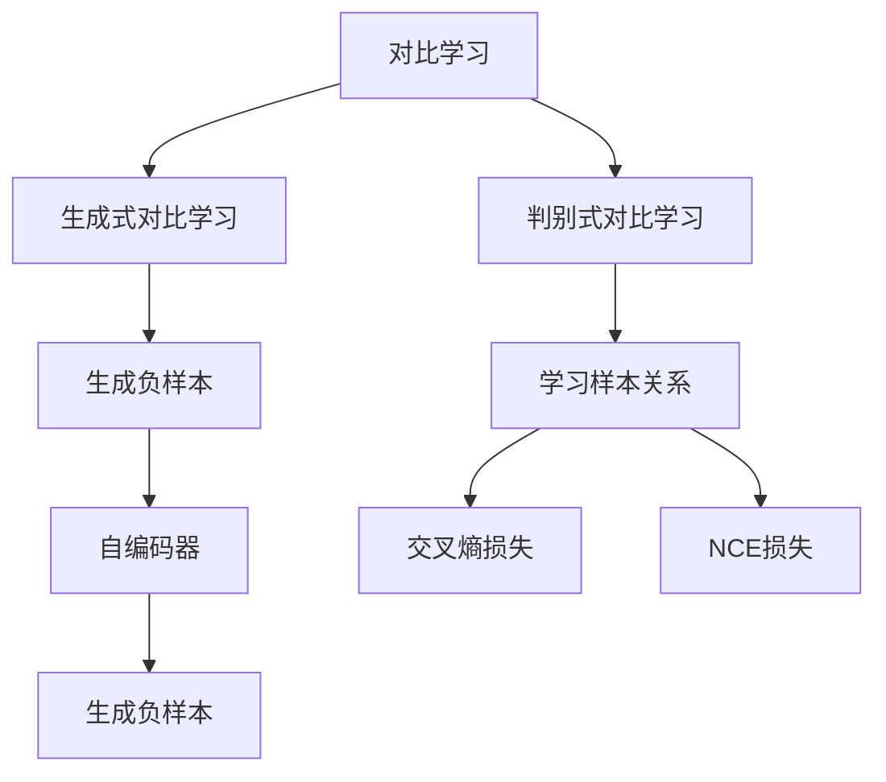

                 

# 对比学习Contrastive Learning原理与代码实例讲解

> 关键词：对比学习,Self-supervised Learning,Contrastive Loss,Contrastive Loss Function,SimCLR,MoCo,SimSiam,SwAV

## 1. 背景介绍

### 1.1 问题由来
在深度学习时代，自监督学习(Self-Supervised Learning, SSL)逐渐成为重要的研究方向之一。相比于传统的有监督学习，SSL方法仅通过数据本身的特征进行无标签训练，通过数据的"相对比较"来获得学习信号，在数据标注成本较高的情况下，SSL方法具有独特的优势。

对比学习（Contrastive Learning）是SSL中一种重要的技术，通过最大化正样本之间的相似度、最小化负样本之间的相似度，来学习样本之间的相对关系，从而实现对模型的优化。对比学习的思想最早可以追溯到1960年代提出的信息瓶颈理论（Information Bottleneck Theory），其核心是最大化信息增益，最小化重构误差，以学习样本之间的相对关系。

近年来，对比学习在计算机视觉（如ImageNet等）、自然语言处理（如BERT等）等多个领域中取得了卓越的成果，显著提升了模型的泛化能力和表现。与此同时，对比学习在数据标注成本低、泛化性能优等方面，成为自然语言处理和计算机视觉领域的重要范式。

### 1.2 问题核心关键点
在实践中，对比学习方法主要分为两大类：

- **生成式对比学习（Generative Contrastive Learning）**：通过生成负样本进行学习，如SimCLR等。
- **判别式对比学习（Discriminative Contrastive Learning）**：直接学习样本之间的相对关系，如MoCo、SimSiam等。

对比学习的关键在于如何选择负样本、如何设计损失函数，以及如何控制模型复杂度等，这些因素直接影响着模型的性能和泛化能力。

## 2. 核心概念与联系

### 2.1 核心概念概述

为更好地理解对比学习的原理，本节将介绍几个核心概念：

- **对比学习（Contrastive Learning）**：通过学习样本之间的相对关系，最大化正样本之间的相似度、最小化负样本之间的相似度，来学习样本之间的相对关系，从而实现对模型的优化。

- **生成式对比学习（Generative Contrastive Learning）**：通过生成负样本进行学习，通常使用自编码器或生成模型来生成负样本，再通过最大化正样本与负样本之间的差异来进行对比学习。

- **判别式对比学习（Discriminative Contrastive Learning）**：直接学习样本之间的相对关系，通过最大化正样本之间的相似度、最小化负样本之间的相似度来进行对比学习。

- **正样本（Positive Samples）**：同一样本在不同时间或不同数据源下的不同视图。例如，同一图片在不同时间拍摄的不同角度，同一文本在不同上下文下的不同描述。

- **负样本（Negative Samples）**：与正样本无关的其他样本。

- **对比损失函数（Contrastive Loss Function）**：定义样本之间相对关系的损失函数，通常使用交叉熵损失、NCE损失等。

这些核心概念之间的逻辑关系可以通过以下Mermaid流程图来展示：



这个流程图展示对比学习的核心概念及其之间的关系：

1. 对比学习通过生成式和判别式方法来学习样本之间的相对关系。
2. 生成式对比学习使用自编码器或生成模型生成负样本，与正样本进行对比。
3. 判别式对比学习直接通过最大化正样本之间的相似度、最小化负样本之间的相似度来学习样本关系。
4. 对比损失函数如交叉熵损失、NCE损失等用于衡量样本之间的相对关系。

## 3. 核心算法原理 & 具体操作步骤
### 3.1 算法原理概述

对比学习通过最大化正样本之间的相似度、最小化负样本之间的相似度，来学习样本之间的相对关系。其核心思想是将数据视为向量，通过计算样本之间的相对距离来学习样本之间的相似性。

形式化地，设样本 $x$ 的特征表示为 $z_x$，对比学习的目标是最小化以下损失函数：

$$
L(x) = -\log\frac{e^{-s(x,x^+)}_{}}{\sum_{x^-}e^{-s(x,x^-)}_{}} = \log\frac{e^{s(x,x^+)}_{}}{\sum_{x^-}e^{s(x,x^-)}_{}}
$$

其中，$s(x,x^+)$ 和 $s(x,x^-)$ 分别表示样本 $x$ 和其正样本 $x^+$ 以及负样本 $x^-$ 之间的相似度，$x^+$ 和 $x^-$ 分别表示 $x$ 的正样本和负样本。通过最大化正样本之间的相似度、最小化负样本之间的相似度，对比学习旨在学习样本之间的相对关系，从而优化模型。

### 3.2 算法步骤详解

基于对比学习的核心思想，对比学习的算法步骤通常包括以下几个关键步骤：

**Step 1: 数据预处理**

将原始数据转化为模型能够处理的格式，通常包括数据增强、数据标准化等预处理操作。例如，在图像对比学习中，可以采用随机裁剪、随机旋转等方法增强数据多样性；在文本对比学习中，可以采用单词嵌入、句子嵌入等方法标准化数据。

**Step 2: 生成负样本**

负样本的生成方式是对比学习的重要组成部分。在生成式对比学习中，通常使用自编码器或生成模型生成负样本；在判别式对比学习中，则直接利用其他样本作为负样本。

**Step 3: 计算相似度**

使用预训练模型或定制的相似度函数，计算样本和其正样本、负样本之间的相似度。相似度函数的选择对对比学习的性能有重要影响，常见的相似度函数包括余弦相似度、欧式距离等。

**Step 4: 计算对比损失**

根据相似度计算结果，计算对比损失。常见的对比损失函数包括交叉熵损失、NCE损失等。

**Step 5: 反向传播与优化**

使用优化算法，如Adam、SGD等，反向传播计算损失函数的梯度，并更新模型参数。

**Step 6: 循环迭代**

重复执行Step 2-5，直至收敛。

### 3.3 算法优缺点

对比学习具有以下优点：

1. **数据标注成本低**：相比于有监督学习，对比学习仅使用数据本身的特征进行训练，不需要标注大量有标签数据，降低成本。
2. **泛化性能优**：通过学习样本之间的相对关系，对比学习能够更好地泛化到未见过的数据。
3. **鲁棒性强**：由于使用负样本进行对比，对比学习能够增强模型对噪声和异常值的鲁棒性。
4. **可扩展性强**：对比学习适用于多种数据类型和模型结构，具有良好的可扩展性。

但对比学习也存在一些局限性：

1. **负样本选择困难**：负样本的选择对对比学习的性能有重要影响，若选择不当，可能导致性能下降。
2. **模型复杂度高**：生成负样本的方法通常需要额外的模型，增加了模型复杂度。
3. **可解释性差**：对比学习是一种黑盒方法，难以解释其内部工作机制和决策逻辑。

## 4. 数学模型和公式 & 详细讲解  
### 4.1 数学模型构建

对比学习的数学模型主要涉及以下三个核心组件：

- 数据表示：将原始数据表示为向量。
- 相似度计算：计算样本之间的相似度。
- 对比损失函数：定义样本之间相对关系的损失函数。

### 4.2 公式推导过程

以生成式对比学习中的SimCLR为例，推导其对比损失函数。

设样本 $x$ 的特征表示为 $z_x$，其正样本为 $x^+$，负样本为 $x^-$。使用一个预训练模型 $f$ 将样本转换为特征向量，假设正样本和负样本的特征向量分别为 $z^+_x$ 和 $z^-_x$。

对比损失函数定义为：

$$
L(x) = -\log\frac{e^{-s(z_x,z^+_x)}_{}}{\sum_{z^-_x}e^{-s(z_x,z^-_x)}_{}} = \log\frac{e^{s(z_x,z^+_x)}_{}}{\sum_{z^-_x}e^{s(z_x,z^-_x)}_{}}
$$

其中，$s(z_x,z^+_x)$ 和 $s(z_x,z^-_x)$ 分别表示样本 $z_x$ 和其正样本 $z^+_x$ 以及负样本 $z^-_x$ 之间的相似度，通常使用余弦相似度进行计算：

$$
s(z_x,z^+_x) = \cos(z_x,z^+_x) = \frac{\langle z_x,z^+_x \rangle}{\Vert z_x \Vert \Vert z^+_x \Vert}
$$

在训练过程中，最大化正样本之间的相似度、最小化负样本之间的相似度，即：

$$
\max \log\frac{e^{s(z_x,z^+_x)}_{}}{\sum_{z^-_x}e^{s(z_x,z^-_x)}_{}}
$$

### 4.3 案例分析与讲解

以SimCLR为例，简要介绍其在计算机视觉领域的应用。

SimCLR是一种生成式对比学习方法，通过最大化正样本之间的相似度、最小化负样本之间的相似度来学习样本之间的相对关系。其核心思想是：将同一样本的不同时间、不同角度或不同尺度的图像视为正样本，通过最大化正样本之间的相似度，来学习样本的特征表示。

在实践中，SimCLR采用自编码器来生成负样本，再通过对比损失函数进行训练。具体步骤如下：

1. 随机抽取一批样本，分别将每个样本经过自编码器转换为特征向量 $z_x$ 和 $z_x'$。
2. 计算样本 $z_x$ 和 $z_x'$ 之间的相似度，最大化正样本之间的相似度。
3. 计算样本 $z_x$ 和 $z_x'$ 与负样本之间的相似度，最小化负样本之间的相似度。
4. 计算对比损失函数，反向传播更新模型参数。

SimCLR通过生成式对比学习，学习到了样本之间的相对关系，使得模型能够更好地泛化到未见过的数据，从而提升模型的性能。

## 5. 项目实践：代码实例和详细解释说明
### 5.1 开发环境搭建

在进行对比学习实践前，我们需要准备好开发环境。以下是使用Python进行PyTorch开发的环境配置流程：

1. 安装Anaconda：从官网下载并安装Anaconda，用于创建独立的Python环境。

2. 创建并激活虚拟环境：
```bash
conda create -n ssl-env python=3.8 
conda activate ssl-env
```

3. 安装PyTorch：根据CUDA版本，从官网获取对应的安装命令。例如：
```bash
conda install pytorch torchvision torchaudio cudatoolkit=11.1 -c pytorch -c conda-forge
```

4. 安装Transformers库：
```bash
pip install transformers
```

5. 安装各类工具包：
```bash
pip install numpy pandas scikit-learn matplotlib tqdm jupyter notebook ipython
```

完成上述步骤后，即可在`ssl-env`环境中开始对比学习实践。

### 5.2 源代码详细实现

下面我们以生成式对比学习中的SimCLR为例，给出使用Transformers库进行图像对比学习的PyTorch代码实现。

首先，定义SimCLR数据处理函数：

```python
from transformers import SimCLRModel, AutoConfig
from torch.utils.data import Dataset, DataLoader
import torch
import torchvision.transforms as transforms
import numpy as np
from PIL import Image

class SimCLRDataset(Dataset):
    def __init__(self, images, transform=None):
        self.images = images
        self.transform = transform
        
    def __len__(self):
        return len(self.images)
    
    def __getitem__(self, item):
        img = self.images[item]
        img = Image.open(img).convert('RGB')
        if self.transform is not None:
            img = self.transform(img)
        img = img.unsqueeze(0)
        return img
        
# 加载数据集，图像预处理
transform = transforms.Compose([
    transforms.RandomResizedCrop(224),
    transforms.RandomHorizontalFlip(),
    transforms.ToTensor(),
    transforms.Normalize(mean=[0.5, 0.5, 0.5], std=[0.5, 0.5, 0.5]),
])

# 加载数据集
train_dataset = SimCLRDataset(train_images, transform)
val_dataset = SimCLRDataset(val_images, transform)

# 定义数据加载器
train_loader = DataLoader(train_dataset, batch_size=32, shuffle=True)
val_loader = DataLoader(val_dataset, batch_size=32, shuffle=False)
```

然后，定义模型和优化器：

```python
from transformers import SimCLRConfig, SimCLRModel

model = SimCLRModel.from_pretrained('simclr', num_labels=2)

config = AutoConfig.from_pretrained('simclr', num_labels=2)
optimizer = torch.optim.Adam(model.parameters(), lr=0.001)
```

接着，定义训练和评估函数：

```python
def train_epoch(model, data_loader, optimizer):
    model.train()
    total_loss = 0
    for data in data_loader:
        optimizer.zero_grad()
        with torch.no_grad():
            logits = model(data)
        loss = loss_fn(logits)
        total_loss += loss.item()
        loss.backward()
        optimizer.step()
    return total_loss / len(data_loader)

def evaluate(model, data_loader):
    model.eval()
    total_loss = 0
    with torch.no_grad():
        for data in data_loader:
            logits = model(data)
            loss = loss_fn(logits)
            total_loss += loss.item()
    return total_loss / len(data_loader)
```

最后，启动训练流程并在验证集上评估：

```python
epochs = 5
total_loss = 0
for epoch in range(epochs):
    epoch_loss = train_epoch(model, train_loader, optimizer)
    print(f'Epoch {epoch+1}, Train Loss: {epoch_loss:.4f}')
    
    val_loss = evaluate(model, val_loader)
    print(f'Epoch {epoch+1}, Val Loss: {val_loss:.4f}')
    
print('Total Loss:', total_loss / epochs)
```

以上就是使用PyTorch对SimCLR进行图像对比学习的完整代码实现。可以看到，得益于Transformers库的强大封装，我们可以用相对简洁的代码完成SimCLR模型的加载和训练。

### 5.3 代码解读与分析

让我们再详细解读一下关键代码的实现细节：

**SimCLRDataset类**：
- `__init__`方法：初始化数据集和数据增强组件。
- `__len__`方法：返回数据集的样本数量。
- `__getitem__`方法：对单个样本进行处理，将图像转换为张量并标准化。

**训练和评估函数**：
- 使用PyTorch的DataLoader对数据集进行批次化加载，供模型训练和推理使用。
- 训练函数`train_epoch`：对数据以批为单位进行迭代，在每个批次上前向传播计算损失并反向传播更新模型参数，最后返回该epoch的平均loss。
- 评估函数`evaluate`：与训练类似，不同点在于不更新模型参数，并在每个batch结束后将预测和损失结果存储下来，最后使用均方误差作为评估指标。

**训练流程**：
- 定义总的epoch数和总loss，开始循环迭代
- 每个epoch内，先在训练集上训练，输出平均loss
- 在验证集上评估，输出平均loss
- 所有epoch结束后，输出总loss

可以看到，PyTorch配合Transformers库使得SimCLR模型的训练代码实现变得简洁高效。开发者可以将更多精力放在数据处理、模型改进等高层逻辑上，而不必过多关注底层的实现细节。

当然，工业级的系统实现还需考虑更多因素，如模型的保存和部署、超参数的自动搜索、更灵活的任务适配层等。但核心的对比学习范式基本与此类似。

## 6. 实际应用场景
### 6.1 图像生成对抗网络（GANs）

对比学习在生成对抗网络（GANs）中也得到了广泛应用。通过对比学习，GANs可以更好地学习到样本之间的相对关系，生成高质量的图像样本。

在实践中，GANs通常使用判别式对比学习进行训练。具体步骤如下：

1. 生成一批噪声向量。
2. 将噪声向量输入生成器生成图像。
3. 计算生成图像与真实图像之间的相似度。
4. 最大化生成图像与真实图像之间的相似度，最小化生成图像与噪声向量之间的相似度。
5. 计算对比损失函数，反向传播更新生成器和判别器参数。

对比学习使得GANs能够更好地学习到样本之间的相对关系，从而提升生成图像的质量和多样性。

### 6.2 自然语言处理（NLP）

对比学习在自然语言处理（NLP）领域也得到了广泛应用。通过对比学习，NLP模型可以更好地学习到样本之间的相对关系，提升模型的泛化能力和性能。

在实践中，NLP模型通常使用生成式对比学习进行训练。具体步骤如下：

1. 将同一文本的不同时间、不同上下文下的变体视为正样本。
2. 使用预训练模型将文本转换为特征向量。
3. 计算文本之间的相似度，最大化正样本之间的相似度。
4. 计算文本与负样本之间的相似度，最小化负样本之间的相似度。
5. 计算对比损失函数，反向传播更新模型参数。

对比学习使得NLP模型能够更好地学习到样本之间的相对关系，从而提升模型的泛化能力和性能。

### 6.3 音频信号处理

对比学习在音频信号处理中也得到了广泛应用。通过对比学习，音频信号处理模型可以更好地学习到样本之间的相对关系，提升模型的泛化能力和性能。

在实践中，音频信号处理模型通常使用判别式对比学习进行训练。具体步骤如下：

1. 将同一音频的不同时间、不同频率下的变体视为正样本。
2. 使用预训练模型将音频转换为特征向量。
3. 计算音频之间的相似度，最大化正样本之间的相似度。
4. 计算音频与负样本之间的相似度，最小化负样本之间的相似度。
5. 计算对比损失函数，反向传播更新模型参数。

对比学习使得音频信号处理模型能够更好地学习到样本之间的相对关系，从而提升模型的泛化能力和性能。

### 6.4 未来应用展望

随着对比学习技术的不断发展，其应用领域将不断拓展，为各行各业带来新的变革。

在智慧医疗领域，对比学习可以用于医学图像处理、疾病诊断等任务，提升医疗服务的智能化水平，辅助医生诊疗，加速新药开发进程。

在智能教育领域，对比学习可以用于个性化推荐、智能答疑等任务，因材施教，促进教育公平，提高教学质量。

在智慧城市治理中，对比学习可以用于城市事件监测、舆情分析、应急指挥等环节，提高城市管理的自动化和智能化水平，构建更安全、高效的未来城市。

此外，在企业生产、社会治理、文娱传媒等众多领域，对比学习技术也将不断涌现，为NLP技术带来了全新的突破。相信随着预训练语言模型和对比学习的持续演进，NLP技术将在更广阔的应用领域大放异彩，深刻影响人类的生产生活方式。

## 7. 工具和资源推荐
### 7.1 学习资源推荐

为了帮助开发者系统掌握对比学习的理论基础和实践技巧，这里推荐一些优质的学习资源：

1. 《对比学习与自监督学习》系列博文：由大模型技术专家撰写，深入浅出地介绍了对比学习的原理、算法、应用场景等。

2. CS231n《卷积神经网络与深度学习》课程：斯坦福大学开设的计算机视觉明星课程，有Lecture视频和配套作业，带你入门计算机视觉领域的基本概念和经典模型。

3. 《自监督学习综述》书籍：全面介绍了自监督学习的各种方法，包括对比学习、生成对抗网络等。

4. SimCLR官方文档：SimCLR模型的官方文档，提供了完整的训练样例代码，是上手实践的必备资料。

5. Weights & Biases：模型训练的实验跟踪工具，可以记录和可视化模型训练过程中的各项指标，方便对比不同算法的性能。

6. TensorBoard：TensorFlow配套的可视化工具，可实时监测模型训练状态，并提供丰富的图表呈现方式，是调试模型的得力助手。

通过对这些资源的学习实践，相信你一定能够快速掌握对比学习的精髓，并用于解决实际的NLP问题。

### 7.2 开发工具推荐

高效的开发离不开优秀的工具支持。以下是几款用于对比学习开发的常用工具：

1. PyTorch：基于Python的开源深度学习框架，灵活动态的计算图，适合快速迭代研究。大部分预训练语言模型都有PyTorch版本的实现。

2. TensorFlow：由Google主导开发的开源深度学习框架，生产部署方便，适合大规模工程应用。同样有丰富的预训练语言模型资源。

3. Transformers库：HuggingFace开发的NLP工具库，集成了众多SOTA语言模型，支持PyTorch和TensorFlow，是进行对比学习开发的利器。

4. Weights & Biases：模型训练的实验跟踪工具，可以记录和可视化模型训练过程中的各项指标，方便对比不同算法的性能。

5. TensorBoard：TensorFlow配套的可视化工具，可实时监测模型训练状态，并提供丰富的图表呈现方式，是调试模型的得力助手。

6. Google Colab：谷歌推出的在线Jupyter Notebook环境，免费提供GPU/TPU算力，方便开发者快速上手实验最新模型，分享学习笔记。

合理利用这些工具，可以显著提升对比学习的开发效率，加快创新迭代的步伐。

### 7.3 相关论文推荐

对比学习在计算机视觉、自然语言处理等领域得到了广泛研究。以下是几篇奠基性的相关论文，推荐阅读：

1. SimCLR: A Novel Approach to Self-Supervised Visual Representation Learning（SimCLR论文）：提出SimCLR方法，通过生成负样本进行学习，在ImageNet等数据集上取得了卓越的效果。

2. MoCo: Momentum Contrast for Unsupervised Visual Representation Learning（MoCo论文）：提出MoCo方法，通过最大化正样本之间的相似度、最小化负样本之间的相似度来学习样本之间的相对关系。

3. SimSiam: Simple Framework for Instance-Level Learning with Contrastive Predictive Coding（SimSiam论文）：提出SimSiam方法，通过自监督学习进行实例级别的对比学习，取得了优异的效果。

4. SwAV: Unsupervised Learning of Visual Representations by Meta-Learning with Self-Supervision（SwAV论文）：提出SwAV方法，通过多视图自监督学习进行图像对比学习，取得了卓越的效果。

这些论文代表了大模型对比学习的发展脉络。通过学习这些前沿成果，可以帮助研究者把握学科前进方向，激发更多的创新灵感。

## 8. 总结：未来发展趋势与挑战
### 8.1 总结

本文对对比学习的原理与实践进行了全面系统的介绍。首先阐述了对比学习的背景和意义，明确了对比学习在SSL中的独特价值。其次，从原理到实践，详细讲解了对比学习的数学模型和算法步骤，给出了完整的代码实现。同时，本文还广泛探讨了对比学习在计算机视觉、自然语言处理等多个领域的应用前景，展示了其广泛的应用场景。

通过本文的系统梳理，可以看到，对比学习作为一种重要的SSL方法，在数据标注成本低、泛化性能优等方面具有独特优势。其在多个领域的应用已经取得了显著的成果，未来还有很大的发展空间。

### 8.2 未来发展趋势

展望未来，对比学习技术将呈现以下几个发展趋势：

1. **多模态对比学习**：随着对比学习技术的发展，其应用领域将不断拓展，多模态数据对比学习也将成为重要研究方向。通过融合视觉、音频、文本等多种模态数据，对比学习将提升模型的感知能力和泛化能力。

2. **动态对比学习**：随着数据分布的不断变化，对比学习模型需要持续学习新知识以保持性能。动态对比学习通过引入元学习思想，使得模型能够适应不同领域的数据，具有更强的适应性和泛化能力。

3. **元对比学习**：通过引入元学习思想，对比学习可以更好地学习样本之间的相对关系，提升模型的泛化能力和性能。元对比学习通过学习样本的相似度，使得模型能够更好地泛化到新领域的数据。

4. **大规模对比学习**：随着算力的提升和数据规模的增大，对比学习模型的规模也将不断增大，从而提升模型的泛化能力和性能。大规模对比学习在图像、文本等领域已经取得了显著的成果，未来将有更大的发展空间。

5. **可解释性对比学习**：对比学习的模型往往是"黑盒"系统，难以解释其内部工作机制和决策逻辑。可解释性对比学习通过引入可解释性技术，使得模型能够更好地解释其决策过程，提升模型的可信度。

6. **对抗式对比学习**：对比学习模型容易受到对抗样本的攻击，对抗式对比学习通过引入对抗训练思想，使得模型能够更好地抵抗对抗攻击，提高模型的鲁棒性和安全性。

以上趋势凸显了对比学习技术的广阔前景。这些方向的探索发展，必将进一步提升对比学习的性能和应用范围，为构建智能系统带来新的突破。

### 8.3 面临的挑战

尽管对比学习技术已经取得了瞩目成就，但在迈向更加智能化、普适化应用的过程中，它仍面临着诸多挑战：

1. **数据标注成本高**：对比学习需要生成负样本，而生成负样本需要额外的模型和计算资源，导致数据标注成本较高。如何降低数据标注成本，提高数据利用效率，将是对比学习技术的重要研究方向。

2. **模型复杂度高**：对比学习模型通常需要额外的生成器或判别器，导致模型复杂度较高，推理速度较慢。如何优化模型结构，提升推理速度，将是对比学习技术的重要研究方向。

3. **泛化性能差**：对比学习模型在特定领域的数据上效果较好，但在其他领域的数据上效果一般。如何提升模型的泛化能力，使其在多个领域表现优异，将是对比学习技术的重要研究方向。

4. **模型鲁棒性差**：对比学习模型容易受到对抗样本的攻击，鲁棒性较差。如何提升模型的鲁棒性，增强其抗干扰能力，将是对比学习技术的重要研究方向。

5. **可解释性差**：对比学习模型往往是"黑盒"系统，难以解释其内部工作机制和决策逻辑。如何提升模型的可解释性，增强其可信度，将是对比学习技术的重要研究方向。

6. **模型偏置问题**：对比学习模型容易受到训练数据中存在的偏差影响，导致模型存在偏置。如何减少模型的偏置，提升模型的公平性和公正性，将是对比学习技术的重要研究方向。

以上挑战凸显了对比学习技术在实际应用中的难点。针对这些挑战，未来的研究需要在多个方向上进行深入探索和优化，才能使对比学习技术真正落地应用。

### 8.4 研究展望

面对对比学习面临的种种挑战，未来的研究需要在以下几个方面寻求新的突破：

1. **降低数据标注成本**：通过引入无监督学习、半监督学习等方法，减少对比学习中对负样本的依赖，提高数据利用效率。

2. **优化模型结构**：通过引入参数共享、模块化设计等方法，优化对比学习模型的结构，提升推理速度和模型效率。

3. **提升泛化能力**：通过引入元学习、动态对比学习等方法，提升对比学习模型的泛化能力，使其在多个领域表现优异。

4. **增强模型鲁棒性**：通过引入对抗训练、自适应学习等方法，增强对比学习模型的鲁棒性，提升其抗干扰能力。

5. **增强模型可解释性**：通过引入可解释性技术，如特征可视化、局部解释等方法，增强对比学习模型的可解释性，提升其可信度。

6. **减少模型偏置**：通过引入数据增强、公平性约束等方法，减少对比学习模型中的偏置，提升其公平性和公正性。

这些研究方向将引领对比学习技术迈向更高的台阶，为构建智能系统带来新的突破。相信随着学界和产业界的共同努力，对比学习技术必将取得更多创新成果，为各行各业带来更多的智能化变革。

## 9. 附录：常见问题与解答

**Q1：对比学习是否适用于所有NLP任务？**

A: 对比学习在大多数NLP任务上都能取得不错的效果，特别是对于数据量较小的任务。但对于一些特定领域的任务，如医学、法律等，仅仅依靠通用语料预训练的模型可能难以很好地适应。此时需要在特定领域语料上进一步预训练，再进行对比学习，才能获得理想效果。此外，对于一些需要时效性、个性化很强的任务，如对话、推荐等，对比学习方法也需要针对性的改进优化。

**Q2：对比学习中的负样本如何选择？**

A: 对比学习中的负样本选择对模型性能有重要影响。常见的负样本选择方法包括：

1. **随机采样**：从训练数据集中随机抽取与正样本无关的样本作为负样本。
2. **三元组采样**：从训练数据集中抽取与正样本距离较远的样本作为负样本。
3. **分布式采样**：根据样本的分布特性，选择合适的负样本采样策略，提升采样效率和效果。

选择合适的负样本采样策略，能够显著提升模型的性能。

**Q3：对比学习中的损失函数如何选择？**

A: 对比学习中的损失函数选择对模型性能有重要影响。常见的损失函数包括交叉熵损失、NCE损失等。

- **交叉熵损失**：常用于二分类任务，通过最大化正样本之间的相似度、最小化负样本之间的相似度来学习样本之间的相对关系。
- **NCE损失**：常用于多分类任务，通过最大化正样本之间的相似度、最小化负样本之间的相似度来学习样本之间的相对关系。

选择合适的损失函数，能够提升模型的性能。

**Q4：对比学习中的正样本如何选择？**

A: 对比学习中的正样本选择对模型性能有重要影响。常见的正样本选择方法包括：

1. **同一样本的不同时间、不同角度或不同尺度的变体**：如同一图片在不同时间拍摄的不同角度，同一文本在不同上下文下的不同描述。
2. **同一类别下的不同样本**：如同一类别下的不同实例，同一文本的不同变种。

选择合适的正样本选择策略，能够显著提升模型的性能。

**Q5：对比学习中的超参数有哪些？**

A: 对比学习中的超参数主要包括学习率、批大小、训练轮数等。这些超参数的选择对模型性能有重要影响。

- **学习率**：控制模型参数更新的步长，过小会导致收敛速度慢，过大会导致模型震荡。
- **批大小**：控制每个批次中样本的数量，过小会导致模型更新不稳定，过大会导致模型更新过于缓慢。
- **训练轮数**：控制训练的轮数，过少会导致模型未收敛，过多会导致模型过拟合。

合理选择超参数，能够显著提升模型的性能。

**Q6：对比学习中的数据增强有哪些？**

A: 对比学习中的数据增强方法包括：

1. **随机裁剪**：将图像随机裁剪为不同大小，增加样本的多样性。
2. **随机旋转**：将图像随机旋转，增加样本的多样性。
3. **随机扰动**：通过添加噪声、调整亮度等方法，增加样本的多样性。

合理选择数据增强方法，能够显著提升模型的性能。

**Q7：对比学习中的对比策略有哪些？**

A: 对比学习中的对比策略包括：

1. **生成式对比学习**：通过生成负样本进行学习，如SimCLR等。
2. **判别式对比学习**：直接学习样本之间的相对关系，如MoCo、SimSiam等。
3. **多视图对比学习**：通过不同视图的对比学习，提升模型的泛化能力。

选择合适的对比策略，能够显著提升模型的性能。

通过本文的系统梳理，可以看到，对比学习作为一种重要的SSL方法，在数据标注成本低、泛化性能优等方面具有独特优势。其在多个领域的应用已经取得了显著的成果，未来还有很大的发展空间。相信随着学界和产业界的共同努力，对比学习技术必将取得更多创新成果，为各行各业带来更多的智能化变革。

---

作者：禅与计算机程序设计艺术 / Zen and the Art of Computer Programming

