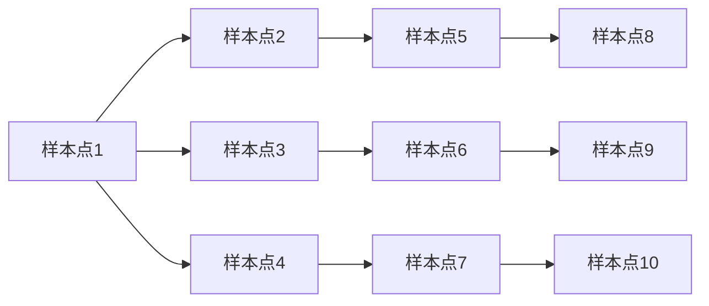
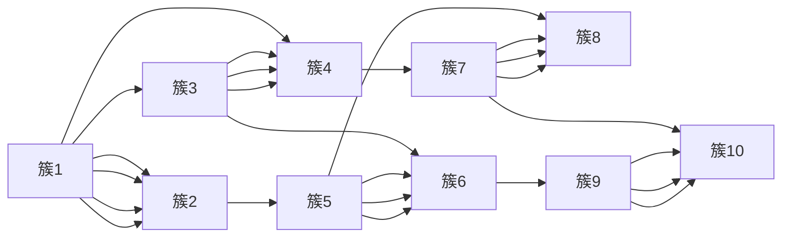

                 

# 层次聚类(Hierarchical Clustering) - 原理与代码实例讲解

> 关键词：层次聚类, 聚类算法, 簇, 树状图, 相似度度量, 谱系聚类, 密度聚类, 谱系图, 代码实现

## 1. 背景介绍

### 1.1 问题由来

聚类分析（Clustering Analysis）是一种无监督学习（Unsupervised Learning）方法，其目的是将相似的样本点分为同一类别，从而使同一类别内的样本尽可能相似，不同类别间的样本尽可能不同。聚类算法在数据挖掘、模式识别、图像处理等领域有着广泛的应用，是数据科学中的一项基本技能。

聚类算法可以分为两大类：层次聚类（Hierarchical Clustering）和划分聚类（Partitioning Clustering）。划分聚类算法（如K-means）需要事先指定簇的数目，而层次聚类算法则不需要，它将数据看作是一个树状结构，从单根节点开始逐步合并，直到所有的节点归为一个簇为止。层次聚类算法能够揭示数据的内在层次结构，并且结果可以可视化成树状图，直观易懂。

本文将详细介绍层次聚类的基本原理和实现步骤，并给出代码实例，帮助读者理解层次聚类的实际应用。

### 1.2 问题核心关键点

层次聚类的核心思想是构建一个树状图（Dendrogram），从单根节点开始逐步合并，直到所有的节点归为一个簇。树状图的横坐标表示样本点，纵坐标表示样本点之间的相似度（距离），距离越小表示相似度越高。最终，树状图上的每个簇（Cluster）都由多个样本点组成，相似度（距离）较大的簇距离较近，相似度（距离）较小的簇距离较远。

层次聚类的关键在于选择合适的相似度度量方法和树状图的合并策略。常见的相似度度量方法包括欧氏距离（Euclidean Distance）、余弦相似度（Cosine Similarity）等，而合并策略则有单连接（Single Linkage）、完全连接（Complete Linkage）和平均连接（Average Linkage）等。不同的度量和合并策略会对聚类结果产生不同的影响。

## 2. 核心概念与联系

### 2.1 核心概念概述

为了更好地理解层次聚类的原理和应用，本节将介绍几个关键概念：

- 簇（Cluster）：一组相似的样本点，通常由同一类别的数据点组成。
- 相似度（Similarity）：衡量两个样本点之间的相似程度，通常用距离来表示，距离越小表示相似度越高。
- 树状图（Dendrogram）：层次聚类算法的结果，通过递归合并相似的簇，最终形成一棵树状结构。
- 谱系聚类（Agglomerative Clustering）：一种递归合并的聚类方法，每个节点表示一个簇，逐步合并相似的簇，直到所有的节点归为一个簇。
- 密度聚类（Density-Based Clustering）：一种基于密度的聚类方法，通过定义样本点的密度，将高密度区域划分为簇。

这些概念之间的逻辑关系可以通过以下Mermaid流程图来展示：

```mermaid
graph LR
    A[簇 (Cluster)] --> B[相似度 (Similarity)]
    B --> C[树状图 (Dendrogram)]
    C --> D[谱系聚类 (Agglomerative Clustering)]
    D --> E[密度聚类 (Density-Based Clustering)]
```

这个流程图展示了几大概念之间的联系：

1. 簇（Cluster）是一组相似的样本点。
2. 相似度（Similarity）衡量样本点之间的相似程度，通常用距离来表示。
3. 树状图（Dendrogram）是层次聚类算法的结果，通过递归合并相似的簇。
4. 谱系聚类（Agglomerative Clustering）是层次聚类的一种具体实现方式，递归合并相似的簇。
5. 密度聚类（Density-Based Clustering）是一种基于密度的聚类方法，通过定义样本点的密度进行聚类。

这些概念共同构成了层次聚类的核心框架，使其能够在各种数据集上发挥强大的聚类能力。

## 3. 核心算法原理 & 具体操作步骤

### 3.1 算法原理概述

层次聚类算法的核心思想是构建一个树状图（Dendrogram），从单根节点开始逐步合并，直到所有的节点归为一个簇为止。树状图的横坐标表示样本点，纵坐标表示样本点之间的相似度（距离），距离越小表示相似度越高。最终，树状图上的每个簇（Cluster）都由多个样本点组成，相似度（距离）较大的簇距离较近，相似度（距离）较小的簇距离较远。

层次聚类算法可以分为两种类型：凝聚型（Agglomerative）和分裂型（Divisive）。凝聚型算法从每个样本点开始，逐步合并相似的簇，直到所有的节点归为一个簇。分裂型算法则从所有的样本点开始，逐步分裂出一个簇，直到所有的节点归为一个簇。

层次聚类算法的主要步骤包括：

1. 计算样本点之间的相似度。
2. 构建树状图，从单根节点开始逐步合并。
3. 停止条件：当所有的节点归为一个簇时，树状图构建完成。

### 3.2 算法步骤详解

层次聚类的实现步骤如下：

**Step 1: 准备数据**

- 收集数据集，并进行预处理，如归一化、去除噪声等。
- 定义相似度度量方法，如欧氏距离、余弦相似度等。

**Step 2: 构建初始树状图**

- 将每个样本点看作一个簇，构建一个初始的树状图。
- 初始树状图的根节点为所有样本点的集合。

**Step 3: 合并簇**

- 选择相似度最小的两个簇进行合并，形成一个新的簇。
- 更新树状图，将新的簇添加到一个新的节点上。
- 重复步骤3，直到所有的节点归为一个簇。

**Step 4: 停止条件**

- 当所有的节点归为一个簇时，树状图构建完成。

### 3.3 算法优缺点

层次聚类的优点包括：

- 无须事先指定簇的数目，结果直观。
- 能够揭示数据的内在层次结构。
- 易于理解和解释。

层次聚类的缺点包括：

- 计算复杂度较高，对于大规模数据集不适用。
- 对于噪声和异常值较为敏感，需要预处理。
- 结果的稳定性较差，不同初始化可能导致不同的结果。

### 3.4 算法应用领域

层次聚类算法在数据挖掘、模式识别、图像处理等领域有着广泛的应用。

- 数据分析：对大规模数据集进行聚类，发现数据的内在结构和趋势。
- 图像处理：对图像进行分割和分类，提取图像特征。
- 信号处理：对信号进行分类和识别，提取信号特征。
- 生物信息学：对生物数据进行聚类，发现基因表达的模式。
- 金融分析：对金融数据进行聚类，发现市场趋势和投资机会。

除了以上应用，层次聚类算法还广泛应用于机器学习、模式识别、医学诊断等领域。

## 4. 数学模型和公式 & 详细讲解

### 4.1 数学模型构建

层次聚类的数学模型可以表示为一个无向图（Graph），其中每个节点表示一个簇（Cluster），每条边表示两个簇之间的相似度（Distance）。

设 $C=\{C_1, C_2, ..., C_n\}$ 为 $n$ 个簇的集合，$D=\{d_{ij}\}_{i,j=1}^{n-1}$ 为 $n-1$ 个距离值，表示第 $i$ 个簇和第 $j$ 个簇之间的距离。层次聚类的数学模型可以表示为：

$$
\begin{align}
G &= (C, D) \\
d_{ij} &= \text{similarity}(C_i, C_j)
\end{align}
$$

其中，$\text{similarity}$ 表示相似度度量方法，如欧氏距离、余弦相似度等。

### 4.2 公式推导过程

设 $C=\{C_1, C_2, ..., C_n\}$ 为 $n$ 个簇的集合，$D=\{d_{ij}\}_{i,j=1}^{n-1}$ 为 $n-1$ 个距离值，表示第 $i$ 个簇和第 $j$ 个簇之间的距离。层次聚类的数学模型可以表示为：

$$
\begin{align}
G &= (C, D) \\
d_{ij} &= \text{similarity}(C_i, C_j)
\end{align}
$$

设 $T$ 为树状图，$N(T)$ 为树状图 $T$ 的节点集合。设 $N_0 \in N(T)$ 为树状图的根节点，$N_1, N_2, ..., N_{n-1}$ 为树状图 $T$ 的叶节点。树状图的数学模型可以表示为：

$$
T = (N(T), E(T))
$$

其中，$E(T)$ 为树状图 $T$ 的边集合，每条边 $(N_i, N_j)$ 表示第 $i$ 个节点和第 $j$ 个节点之间的距离。

层次聚类的关键在于如何计算节点之间的距离，常用的距离度量方法包括欧氏距离、余弦相似度等。

### 4.3 案例分析与讲解

设有一个包含10个样本点的数据集，使用欧氏距离作为相似度度量方法，构建树状图如下：



树状图的根节点为所有样本点的集合，每条边表示两个样本点之间的距离。计算样本点之间的距离后，从单根节点开始逐步合并相似的簇，直到所有的节点归为一个簇。最终得到的树状图如下：



## 5. 项目实践：代码实例和详细解释说明

### 5.1 开发环境搭建

在进行层次聚类实践前，我们需要准备好开发环境。以下是使用Python进行SciPy开发的环境配置流程：

1. 安装Anaconda：从官网下载并安装Anaconda，用于创建独立的Python环境。

2. 创建并激活虚拟环境：
```bash
conda create -n scipy-env python=3.8 
conda activate scipy-env
```

3. 安装SciPy：
```bash
conda install scipy
```

4. 安装各类工具包：
```bash
pip install numpy pandas scikit-learn matplotlib tqdm jupyter notebook ipython
```

完成上述步骤后，即可在`scipy-env`环境中开始层次聚类的实践。

### 5.2 源代码详细实现

下面我们以欧氏距离为例，给出使用SciPy库对数据集进行层次聚类的PyTorch代码实现。

首先，定义数据集和相似度度量方法：

```python
import numpy as np
from scipy.spatial.distance import pdist
from scipy.cluster.hierarchy import dendrogram, linkage

# 生成随机数据集
data = np.random.rand(10, 2)

# 计算欧氏距离
distances = pdist(data)

# 构建树状图
linkage_matrix = linkage(distances, 'ward')
```

然后，绘制树状图：

```python
import matplotlib.pyplot as plt

# 绘制树状图
dendrogram(linkage_matrix)
plt.show()
```

以上就是使用SciPy对数据集进行层次聚类的完整代码实现。可以看到，SciPy库的scipy.spatial.distance模块和scipy.cluster.hierarchy模块提供了丰富的距离度量和聚类方法，使用简单直观。

### 5.3 代码解读与分析

让我们再详细解读一下关键代码的实现细节：

**pdist函数**：
- `pdist`函数用于计算所有点对之间的距离，返回一个包含所有点对距离的数组。

**linkage函数**：
- `linkage`函数用于计算聚类树，接受距离矩阵和聚合方法作为参数。`ward`方法表示使用Ward方法进行层次聚类，计算每个节点内部的平均距离。

**dendrogram函数**：
- `dendrogram`函数用于绘制树状图，接受聚类树作为参数，自动递归构建树状图。

**绘制树状图**：
- 使用Matplotlib库的`plt.show()`函数展示绘制的树状图。

可以看到，SciPy库的层次聚类实现非常简洁，开发者只需关注数据的准备和树状图的绘制，即可实现层次聚类的功能。

## 6. 实际应用场景

### 6.1 市场分析

层次聚类在市场分析中有着广泛的应用，可以帮助企业发现市场细分和客户群体的分布情况。

设有一个包含多个品牌和产品的数据集，使用层次聚类算法进行聚类，可以得到多个不同的市场细分。企业可以根据市场细分进行针对性的市场推广和营销活动，提升销售业绩。

### 6.2 图像分割

层次聚类在图像处理中也有着重要的应用，可以将图像分割成多个不同的区域，提取图像的特征。

设有一个包含多张图片的数据集，使用层次聚类算法进行聚类，可以得到多个不同的图像区域。企业可以根据图像区域进行图像分析和处理，提升图像识别的精度。

### 6.3 基因表达分析

层次聚类在生物信息学中也有着广泛的应用，可以帮助发现基因表达的模式和差异。

设有一个包含多个基因表达数据的数据集，使用层次聚类算法进行聚类，可以得到多个不同的基因表达模式。科学家可以根据基因表达模式进行基因分析和研究，发现新的基因和生物标志物。

### 6.4 未来应用展望

随着层次聚类算法的不断发展和优化，其应用场景将更加广泛，未来趋势主要包括以下几个方面：

1. 高效计算：层次聚类算法的时间复杂度较高，对于大规模数据集不适用。未来需要开发更高效的聚类算法，提高计算速度和精度。

2. 多维数据处理：传统的层次聚类算法只能处理二维数据，未来需要扩展到多维数据处理，处理更复杂的数据结构。

3. 应用场景扩展：层次聚类算法在图像处理、基因表达分析等领域已有成功应用，未来需要扩展到更多的应用场景，提升算法的普适性。

4. 算法优化：层次聚类算法在应用中需要优化算法的参数设置和聚类方法，提高算法的稳定性和可靠性。

5. 实时处理：层次聚类算法在实际应用中需要实现实时处理，提高算法的实时性和效率。

## 7. 工具和资源推荐

### 7.1 学习资源推荐

为了帮助开发者系统掌握层次聚类的理论基础和实践技巧，这里推荐一些优质的学习资源：

1. 《Python数据科学手册》系列博文：由大模型技术专家撰写，深入浅出地介绍了数据科学的基本概念和常用算法。

2. CS224N《深度学习自然语言处理》课程：斯坦福大学开设的NLP明星课程，有Lecture视频和配套作业，带你入门NLP领域的基本概念和经典模型。

3. 《数据科学入门与实践》书籍：全面介绍了数据科学的基础知识和常用算法，包括层次聚类在内的诸多经典算法。

4. Scipy官方文档：SciPy库的官方文档，提供了丰富的聚类算法和示例代码，是上手实践的必备资料。

5. Kaggle：Kaggle上的层次聚类竞赛，提供大量实际数据集和代码示例，助力层次聚类的实践应用。

通过对这些资源的学习实践，相信你一定能够快速掌握层次聚类的精髓，并用于解决实际的NLP问题。

### 7.2 开发工具推荐

高效的开发离不开优秀的工具支持。以下是几款用于层次聚类开发的常用工具：

1. SciPy：基于Python的开源科学计算库，提供丰富的数据处理和数学函数，适合快速迭代研究。

2. NumPy：基于Python的开源科学计算库，提供高效的数组和矩阵运算，适合高性能计算。

3. Pandas：基于Python的开源数据处理库，提供丰富的数据清洗和分析功能，适合大规模数据处理。

4. Matplotlib：基于Python的开源数据可视化库，提供丰富的绘图功能，适合绘制聚类图。

5. Seaborn：基于Python的开源数据可视化库，提供丰富的统计绘图功能，适合数据可视化分析。

合理利用这些工具，可以显著提升层次聚类任务的开发效率，加快创新迭代的步伐。

### 7.3 相关论文推荐

层次聚类算法的发展源于学界的持续研究。以下是几篇奠基性的相关论文，推荐阅读：

1. A Fast Hierarchical Clustering Algorithm Using Medoids（快速基于质心的层次聚类算法）：提出了基于质心的层次聚类算法，显著提高了聚类速度和精度。

2. Hierarchical Clustering for Web Document Organization（基于层次聚类的Web文档组织）：将层次聚类应用于Web文档的组织和分类，提升了Web信息检索的效果。

3. A New Clustering Algorithm for Data Mining（一种新的聚类算法）：提出了基于密度的聚类算法，能够识别孤立点和高密度区域，适用于复杂数据集的聚类。

4. Divisive Hierarchical Clustering with Principal Component Analysis（基于PCA的分裂式层次聚类算法）：将PCA引入层次聚类算法，提高了聚类算法的稳定性和鲁棒性。

5. Hierarchical Clustering for Computer Vision Applications（层次聚类在计算机视觉中的应用）：将层次聚类应用于图像分割和特征提取，提升了图像识别的精度。

这些论文代表了大模型聚类技术的发展脉络。通过学习这些前沿成果，可以帮助研究者把握学科前进方向，激发更多的创新灵感。

## 8. 总结：未来发展趋势与挑战

### 8.1 总结

本文对层次聚类的基本原理和实现步骤进行了全面系统的介绍。首先阐述了层次聚类的研究背景和意义，明确了层次聚类在数据科学中的重要地位。其次，从原理到实践，详细讲解了层次聚类的数学模型和关键步骤，给出了层次聚类的代码实例。同时，本文还探讨了层次聚类在市场分析、图像分割、基因表达分析等多个领域的应用前景，展示了层次聚类的巨大潜力。

通过本文的系统梳理，可以看到，层次聚类作为一种无监督学习算法，在数据科学中有着广泛的应用，能够揭示数据的内在层次结构和趋势。层次聚类算法简单易懂，易于实现，适合处理大规模数据集，具有重要的理论和实践价值。未来，随着算法的不断发展和优化，层次聚类将在更多领域得到应用，为数据科学带来新的突破。

### 8.2 未来发展趋势

展望未来，层次聚类技术将呈现以下几个发展趋势：

1. 高效计算：层次聚类算法的时间复杂度较高，对于大规模数据集不适用。未来需要开发更高效的聚类算法，提高计算速度和精度。

2. 多维数据处理：传统的层次聚类算法只能处理二维数据，未来需要扩展到多维数据处理，处理更复杂的数据结构。

3. 应用场景扩展：层次聚类算法在图像处理、基因表达分析等领域已有成功应用，未来需要扩展到更多的应用场景，提升算法的普适性。

4. 算法优化：层次聚类算法在应用中需要优化算法的参数设置和聚类方法，提高算法的稳定性和可靠性。

5. 实时处理：层次聚类算法在实际应用中需要实现实时处理，提高算法的实时性和效率。

这些趋势凸显了层次聚类算法的广阔前景。这些方向的探索发展，必将进一步提升层次聚类的性能和应用范围，为数据科学带来新的突破。

### 8.3 面临的挑战

尽管层次聚类算法已经取得了一定的进展，但在迈向更加智能化、普适化应用的过程中，它仍面临着诸多挑战：

1. 计算复杂度较高：层次聚类算法的时间复杂度较高，对于大规模数据集不适用。

2. 对异常值敏感：层次聚类算法对于噪声和异常值较为敏感，需要预处理。

3. 结果的稳定性较差：不同初始化可能导致不同的结果，结果的稳定性较差。

4. 数据维度限制：传统的层次聚类算法只能处理二维数据，对于高维数据处理能力有限。

5. 实时处理困难：层次聚类算法在实际应用中需要实现实时处理，提高算法的实时性和效率。

正视层次聚类面临的这些挑战，积极应对并寻求突破，将有助于层次聚类算法的发展和应用。相信随着学界和产业界的共同努力，这些挑战终将一一被克服，层次聚类必将在数据科学中发挥更加重要的作用。

### 8.4 研究展望

面向未来，层次聚类技术还需要与其他数据挖掘、模式识别等技术进行更深入的融合，进一步提升数据处理的精度和效率。层次聚类算法需要在多个方向进行优化和改进，如高效计算、多维数据处理、实时处理等，以适应实际应用的需求。此外，层次聚类算法还需要更多的理论研究和实践验证，以进一步提升算法的稳定性和鲁棒性。

总之，层次聚类作为一种无监督学习算法，在数据科学中有着广泛的应用。未来，层次聚类算法将在更广阔的应用领域得到应用，为数据科学带来新的突破。

## 9. 附录：常见问题与解答

**Q1：层次聚类算法是否适用于所有数据集？**

A: 层次聚类算法适用于大部分数据集，尤其是数据分布较为规则、聚类结果较为清晰的数据集。对于数据分布不规则、噪声较多的数据集，层次聚类算法的效果可能不佳。

**Q2：层次聚类算法中的相似度度量方法有哪些？**

A: 层次聚类算法常用的相似度度量方法包括欧氏距离、余弦相似度、曼哈顿距离等。选择不同的相似度度量方法，会对聚类结果产生不同的影响。

**Q3：层次聚类算法中的聚类方法有哪些？**

A: 层次聚类算法常用的聚类方法包括单连接、完全连接、平均连接等。选择不同的聚类方法，会对聚类结果产生不同的影响。

**Q4：层次聚类算法中的停止条件是什么？**

A: 层次聚类算法的停止条件是当所有的节点归为一个簇时，树状图构建完成。此时算法自动停止，不再进行聚类。

**Q5：层次聚类算法中的树状图如何绘制？**

A: 使用SciPy库的dendrogram函数绘制树状图。该函数自动递归构建树状图，并绘制出树状图的层次结构。

总之，层次聚类算法作为一种无监督学习算法，在数据科学中有着广泛的应用。通过本文的系统梳理，可以看到，层次聚类算法简单易懂，易于实现，适合处理大规模数据集，具有重要的理论和实践价值。未来，层次聚类算法将在更多领域得到应用，为数据科学带来新的突破。

