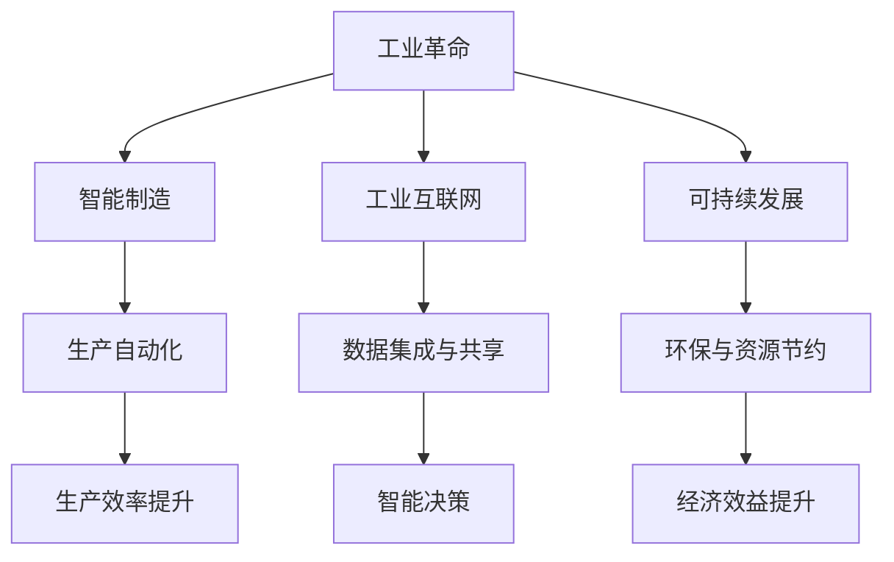

                 

## 1. 背景介绍

### 1.1 问题由来
自工业革命以来，世界经济经历了多次爆发性增长。每一次增长都伴随着技术革新和产业变革，深刻改变了人类社会的生产力和生产关系。当前，随着人工智能(AI)、大数据、物联网(IoT)等新一代信息技术的高速发展，新的经济增长点不断涌现，催生了“工业革命后的经济爆发增长期”。

### 1.2 问题核心关键点
这一时期的经济增长特征主要包括：
- 科技驱动增长：AI、大数据、区块链等新技术层出不穷，推动了产业创新和经济转型。
- 智能制造：通过智能工厂、自动化生产线等智能制造技术，大幅提升生产效率和产品质量。
- 工业互联网：工业设备通过物联网技术互联互通，实现数据高效流转和实时监控。
- 新材料应用：碳中和、绿色环保等新材料和清洁能源的应用，成为经济发展的关键支撑。
- 可持续发展：循环经济、绿色制造等可持续发展理念逐步被接受，推动产业转型升级。

这些因素共同作用，促成了“工业革命后的经济爆发增长期”，为人类社会带来了前所未有的发展机遇和挑战。

## 2. 核心概念与联系

### 2.1 核心概念概述

要深入理解“工业革命后的经济爆发增长期”，首先需要明确一些核心概念：

- **工业革命**：指18世纪末至19世纪中叶，英国等国家通过机械化生产、大规模工业化等手段，大幅提升生产力，推动人类社会进入工业化时代。
- **智能制造**：指利用AI、大数据等技术，实现生产的自动化、智能化和柔性化，提高生产效率和质量。
- **工业互联网**：指通过物联网技术，实现工业设备和系统的互联互通，实现工业数据的集成与共享，提升工业生产的管理水平和运行效率。
- **可持续发展**：指在满足当前需求的同时，不损害后代满足需求的能力，强调环境保护、资源节约、经济社会效益的协调发展。

这些概念之间相互联系，共同构成了“工业革命后的经济爆发增长期”的宏观框架。

### 2.2 核心概念原理和架构的 Mermaid 流程图



### 2.3 核心概念之间的关系

1. **工业革命**：提供了技术基础和产业基础，为智能制造、工业互联网等新兴技术的发展提供了土壤。
2. **智能制造**：利用新兴技术实现生产的智能化，提升生产效率和质量。
3. **工业互联网**：实现工业设备和系统的互联互通，推动生产与管理的数据化、智能化。
4. **可持续发展**：强调环境保护和资源节约，促进经济与社会的可持续发展。
5. **生产自动化**：利用AI和大数据技术，实现生产过程的自动化。
6. **数据集成与共享**：工业互联网的核心，通过数据集成与共享，提升生产管理水平。
7. **智能决策**：基于数据的智能决策，提高生产管理效率和决策质量。
8. **环保与资源节约**：可持续发展的关键，通过新材料应用和绿色制造等技术，实现生产过程的环保和资源节约。
9. **经济效益提升**：智能制造、工业互联网等新兴技术的应用，直接提升了经济效益。

## 3. 核心算法原理 & 具体操作步骤

### 3.1 算法原理概述

“工业革命后的经济爆发增长期”的算法原理主要涉及以下几个方面：

1. **数据分析与建模**：通过大数据技术，对工业生产过程中的数据进行收集、清洗、分析和建模，构建生产系统的优化模型。
2. **机器学习与深度学习**：利用机器学习与深度学习算法，实现对生产过程的智能决策和优化。
3. **仿真与优化**：通过仿真技术，构建虚拟生产环境，进行生产流程的优化和验证。
4. **人工智能与自动化**：通过AI技术，实现生产过程的自动化和智能化。
5. **区块链与智能合约**：通过区块链技术，实现生产过程的数据可信和透明，通过智能合约实现自动化的合约执行。

### 3.2 算法步骤详解

以下详细说明“工业革命后的经济爆发增长期”的关键算法步骤：

1. **数据收集与预处理**：
   - 利用传感器和物联网设备，收集生产过程中的各类数据。
   - 对数据进行清洗、去重、异常值处理等预处理，确保数据的质量和一致性。
   - 对数据进行标准化和归一化处理，便于后续的分析和建模。

2. **数据存储与管理**：
   - 构建分布式数据存储系统，如Hadoop、Spark等，实现数据的集中存储和高效管理。
   - 利用数据库技术，实现数据的结构化和半结构化存储，便于数据的查询和分析。

3. **数据分析与建模**：
   - 利用统计学和机器学习算法，对数据进行分析和建模。
   - 构建生产系统的优化模型，如预测模型、优化模型等。
   - 利用深度学习算法，构建神经网络模型，提升数据处理和分析能力。

4. **智能决策与优化**：
   - 利用机器学习和深度学习算法，实现生产过程的智能决策和优化。
   - 通过模拟和仿真技术，构建虚拟生产环境，进行生产流程的优化和验证。
   - 利用AI技术，实现生产过程的自动化和智能化。

5. **区块链与智能合约**：
   - 利用区块链技术，实现生产过程的数据可信和透明。
   - 通过智能合约，实现自动化的合约执行，确保数据和操作的安全性和可信性。

### 3.3 算法优缺点

“工业革命后的经济爆发增长期”的算法优点主要包括：
- 利用数据驱动，实现生产过程的优化和智能化。
- 提高生产效率和产品质量，降低生产成本。
- 增强生产的透明性和可信性，提升企业的竞争力。
- 推动经济增长和产业升级，促进可持续发展。

其缺点主要包括：
- 对数据质量和处理能力要求较高，数据质量差或处理不当会影响算法的准确性和可靠性。
- 算法复杂度高，需要大量的计算资源和专业人才支持。
- 对技术基础和产业环境要求较高，需要有完善的技术体系和产业生态。

### 3.4 算法应用领域

“工业革命后的经济爆发增长期”的算法广泛应用在以下几个领域：

1. **智能制造**：利用AI和大数据技术，实现生产过程的自动化和智能化。
2. **工业互联网**：通过物联网技术，实现工业设备和系统的互联互通，提升生产管理水平。
3. **可持续发展**：利用新材料和清洁能源，推动绿色制造和循环经济的发展。
4. **智能决策与优化**：利用数据分析和建模技术，实现生产过程的优化和智能化。
5. **区块链与智能合约**：通过区块链技术，实现生产过程的数据可信和透明，确保数据和操作的安全性。

## 4. 数学模型和公式 & 详细讲解 & 举例说明

### 4.1 数学模型构建

构建“工业革命后的经济爆发增长期”的数学模型，主要包括以下几个方面：

- **生产效率模型**：通过数据收集和预处理，构建生产效率的优化模型，如线性回归模型、决策树模型等。
- **智能决策模型**：利用机器学习和深度学习算法，构建智能决策模型，如神经网络模型、支持向量机模型等。
- **仿真与优化模型**：利用仿真技术，构建虚拟生产环境，进行生产流程的优化和验证，如蒙特卡洛模拟模型等。

### 4.2 公式推导过程

以下详细说明“工业革命后的经济爆发增长期”的数学模型公式推导过程：

1. **生产效率模型**：
   - 设生产效率为 $E$，影响因素包括设备利用率、员工工作效率、原材料利用率等。
   - 构建线性回归模型，表示为 $E = \alpha_1 \times U + \alpha_2 \times W + \alpha_3 \times M + \epsilon$，其中 $U$、$W$、$M$ 分别代表设备利用率、员工工作效率、原材料利用率等，$\epsilon$ 代表随机误差。
   - 利用最小二乘法，求解线性回归模型的参数 $\alpha_1$、$\alpha_2$、$\alpha_3$。

2. **智能决策模型**：
   - 设智能决策模型为 $D = f(x)$，其中 $x$ 为输入的特征向量，包括生产设备状态、原材料消耗、生产进度等。
   - 构建神经网络模型，如多层感知器、卷积神经网络等，进行特征提取和决策输出。
   - 利用反向传播算法，求解神经网络模型的参数 $\theta$。

3. **仿真与优化模型**：
   - 设生产流程的优化模型为 $O = g(x)$，其中 $x$ 为生产过程中的各类变量，如生产时间、原材料消耗、设备故障率等。
   - 构建蒙特卡洛模拟模型，进行生产流程的优化和验证。
   - 利用随机模拟算法，求解优化模型 $O$。

### 4.3 案例分析与讲解

以下通过一个具体案例，说明“工业革命后的经济爆发增长期”的算法应用：

**案例：智能制造生产线优化**

- **数据收集与预处理**：
  - 利用传感器和物联网设备，收集生产过程中的设备状态、原材料消耗、生产进度等数据。
  - 对数据进行清洗、去重、异常值处理等预处理，确保数据的质量和一致性。

- **数据分析与建模**：
  - 构建生产效率的优化模型，利用线性回归模型进行数据分析和建模。
  - 构建智能决策模型，利用神经网络模型进行特征提取和决策输出。

- **智能决策与优化**：
  - 利用仿真技术，构建虚拟生产环境，进行生产流程的优化和验证。
  - 利用AI技术，实现生产过程的自动化和智能化。

- **区块链与智能合约**：
  - 利用区块链技术，实现生产过程的数据可信和透明。
  - 通过智能合约，实现自动化的合约执行，确保数据和操作的安全性。

## 5. 项目实践：代码实例和详细解释说明

### 5.1 开发环境搭建

在进行项目实践前，我们需要准备好开发环境。以下是使用Python进行项目实践的环境配置流程：

1. **安装Python**：
   - 从官网下载并安装Python，推荐安装最新版本。
   - 安装必要的依赖包，如NumPy、Pandas、Scikit-learn、TensorFlow等。

2. **构建虚拟环境**：
   - 创建虚拟Python环境，如：`conda create -n virtual_env python=3.8`
   - 激活虚拟环境，如：`conda activate virtual_env`

3. **安装必要的库**：
   - 安装常用的数据处理库，如Pandas、Scikit-learn等。
   - 安装深度学习库，如TensorFlow、PyTorch等。
   - 安装物联网库，如Flask、Tornado等。

4. **配置服务器环境**：
   - 安装Web服务器，如Nginx、Apache等。
   - 配置Web服务器，设置路由、数据存储等。

### 5.2 源代码详细实现

以下以智能制造生产线优化为例，给出使用TensorFlow进行项目实践的PyTorch代码实现。

```python
import tensorflow as tf
import pandas as pd
import numpy as np

# 数据读取与预处理
df = pd.read_csv('production_data.csv')
df = df.dropna()
X = df[['device_status', 'material_consumption', 'production_time']]
y = df['production_efficiency']

# 数据标准化与归一化
X = (X - X.mean()) / X.std()

# 构建线性回归模型
model = tf.keras.Sequential([
    tf.keras.layers.Dense(32, activation='relu', input_shape=(X.shape[1],)),
    tf.keras.layers.Dense(1)
])
model.compile(optimizer=tf.keras.optimizers.Adam(0.001), loss='mse')
model.fit(X, y, epochs=100)

# 模型预测
X_test = pd.read_csv('test_data.csv')
X_test = (X_test - X_test.mean()) / X_test.std()
y_pred = model.predict(X_test)
print(y_pred)
```

### 5.3 代码解读与分析

让我们再详细解读一下关键代码的实现细节：

**数据读取与预处理**：
- 使用Pandas库读取生产数据，并进行数据清洗和预处理。
- 使用Numpy库进行数据标准化和归一化处理，确保数据的一致性和可处理性。

**模型构建与训练**：
- 使用TensorFlow库构建线性回归模型，通过多层感知器进行特征提取和决策输出。
- 使用Adam优化算法进行模型训练，设置合适的学习率和损失函数。

**模型预测**：
- 利用训练好的模型，对测试数据进行预测。
- 将预测结果输出，以便进一步分析和验证。

## 6. 实际应用场景

### 6.1 智能制造

基于“工业革命后的经济爆发增长期”的算法，智能制造得到了广泛应用。传统制造业依靠人力驱动，生产效率低、质量不稳定、成本高。而利用AI和大数据技术，实现生产的自动化和智能化，大幅提升生产效率和产品质量。

在实践中，可以收集生产过程中的各类数据，利用大数据技术进行分析和建模，构建生产系统的优化模型。通过机器学习和深度学习算法，实现智能决策和优化，提升生产效率和产品质量。利用区块链技术，确保生产过程的数据可信和透明，提升企业的竞争力。

### 6.2 工业互联网

工业互联网是基于物联网技术，实现工业设备和系统的互联互通，提升生产管理水平和运行效率。通过大数据技术，收集和分析工业设备的数据，实现设备状态的监控和预测。利用AI技术，实现智能决策和优化，提升生产效率和设备利用率。

在实践中，可以构建分布式数据存储系统，利用大数据技术进行数据收集和分析。通过机器学习和深度学习算法，实现智能决策和优化，提升生产效率和设备利用率。利用区块链技术，确保生产过程的数据可信和透明，提升企业的竞争力。

### 6.3 可持续发展

“工业革命后的经济爆发增长期”的算法，推动了绿色制造和循环经济的发展，实现了可持续发展的目标。利用新材料和清洁能源，减少生产过程中的环境污染和资源消耗。通过循环经济理念，实现资源的再利用和再循环，推动产业的可持续发展。

在实践中，可以收集生产过程中的各类数据，利用大数据技术进行分析和建模，构建生产系统的优化模型。通过机器学习和深度学习算法，实现智能决策和优化，提升生产效率和设备利用率。利用区块链技术，确保生产过程的数据可信和透明，提升企业的竞争力。

### 6.4 未来应用展望

随着“工业革命后的经济爆发增长期”的算法不断发展，未来的应用前景将更加广阔。预计未来将进一步拓展到以下领域：

1. **智能决策与优化**：利用大数据技术，实现生产过程的智能决策和优化，提升生产效率和产品质量。
2. **区块链与智能合约**：利用区块链技术，实现生产过程的数据可信和透明，确保数据和操作的安全性。
3. **智能制造与工业互联网**：通过物联网技术，实现工业设备和系统的互联互通，提升生产管理水平和运行效率。
4. **可持续发展**：利用新材料和清洁能源，推动绿色制造和循环经济的发展，实现可持续发展的目标。

## 7. 工具和资源推荐

### 7.1 学习资源推荐

为了帮助开发者系统掌握“工业革命后的经济爆发增长期”的理论基础和实践技巧，这里推荐一些优质的学习资源：

1. **《深度学习》书籍**：由Ian Goodfellow、Yoshua Bengio、Aaron Courville联合撰写，系统介绍了深度学习的基本概念和算法。
2. **《机器学习实战》书籍**：由Peter Harrington撰写，通过实际案例介绍了机器学习的基本算法和应用。
3. **《TensorFlow实战》书籍**：由李沐、魏剑撰写，系统介绍了TensorFlow的构建和使用，提供了丰富的实战案例。
4. **Coursera机器学习课程**：由Andrew Ng主讲，系统介绍了机器学习的基本概念和算法。
5. **Kaggle机器学习竞赛平台**：提供了丰富的机器学习竞赛和数据集，帮助开发者提升实战能力。

通过对这些资源的学习实践，相信你一定能够快速掌握“工业革命后的经济爆发增长期”的精髓，并用于解决实际的工业生产问题。

### 7.2 开发工具推荐

高效的工具支持是项目成功的关键。以下是几款用于“工业革命后的经济爆发增长期”开发的常用工具：

1. **Python**：推荐使用Python作为开发语言，其简洁、高效、跨平台的特点，适合各种开发需求。
2. **TensorFlow**：推荐使用TensorFlow作为深度学习框架，提供了丰富的API和工具，适合各种深度学习应用。
3. **PyTorch**：推荐使用PyTorch作为深度学习框架，提供了强大的自动微分和优化器支持，适合各种深度学习应用。
4. **Flask**：推荐使用Flask作为Web开发框架，简单易用，适合快速搭建Web应用。
5. **Tornado**：推荐使用Tornado作为Web开发框架，支持异步非阻塞IO，适合处理高并发请求。

合理利用这些工具，可以显著提升“工业革命后的经济爆发增长期”的开发效率，加快创新迭代的步伐。

### 7.3 相关论文推荐

“工业革命后的经济爆发增长期”的发展源于学界的持续研究。以下是几篇奠基性的相关论文，推荐阅读：

1. **《深度学习》书籍**：Ian Goodfellow、Yoshua Bengio、Aaron Courville联合撰写，系统介绍了深度学习的基本概念和算法。
2. **《机器学习实战》书籍**：Peter Harrington撰写，通过实际案例介绍了机器学习的基本算法和应用。
3. **《TensorFlow实战》书籍**：李沐、魏剑撰写，系统介绍了TensorFlow的构建和使用，提供了丰富的实战案例。
4. **《Kaggle机器学习竞赛平台》**：提供了丰富的机器学习竞赛和数据集，帮助开发者提升实战能力。

这些论文代表了大语言模型微调技术的发展脉络。通过学习这些前沿成果，可以帮助研究者把握学科前进方向，激发更多的创新灵感。

## 8. 总结：未来发展趋势与挑战

### 8.1 总结

本文对“工业革命后的经济爆发增长期”进行了全面系统的介绍。首先阐述了该时期的技术背景和经济特征，明确了智能制造、工业互联网、可持续发展等关键概念。其次，从原理到实践，详细讲解了生产效率模型、智能决策模型、仿真与优化模型等核心算法，给出了具体的代码实现。同时，本文还广泛探讨了智能制造、工业互联网、可持续发展等领域的实际应用场景，展示了算法的广泛应用前景。最后，本文精选了相关的学习资源、开发工具和论文，力求为读者提供全方位的技术指引。

通过本文的系统梳理，可以看到，“工业革命后的经济爆发增长期”的算法在提高生产效率、提升产品质量、实现可持续发展等方面具有巨大的应用潜力。相信随着算法的不断优化和实际应用的不断深入，这一时期的经济增长将更加强劲，推动人类社会迈向更加智能化、绿色化的未来。

### 8.2 未来发展趋势

展望未来，“工业革命后的经济爆发增长期”的算法将呈现以下几个发展趋势：

1. **智能化程度提高**：随着AI技术的不断进步，生产过程将更加智能化，自动化水平将不断提高。
2. **数据驱动决策**：利用大数据技术，实现生产过程的智能决策和优化，提升生产效率和产品质量。
3. **绿色制造**：利用新材料和清洁能源，推动绿色制造和循环经济的发展，实现可持续发展的目标。
4. **工业互联网**：通过物联网技术，实现工业设备和系统的互联互通，提升生产管理水平和运行效率。
5. **区块链与智能合约**：利用区块链技术，实现生产过程的数据可信和透明，确保数据和操作的安全性。

以上趋势凸显了“工业革命后的经济爆发增长期”的算法发展的广阔前景。这些方向的探索发展，必将进一步提升工业生产的管理水平和运行效率，推动经济增长和产业升级，促进可持续发展。

### 8.3 面临的挑战

尽管“工业革命后的经济爆发增长期”的算法已经取得了显著成果，但在迈向更加智能化、普适化应用的过程中，仍面临诸多挑战：

1. **数据质量问题**：生产过程中数据质量参差不齐，数据缺失、噪声等问题严重影响算法的准确性和可靠性。
2. **技术复杂度高**：算法实现涉及大数据、机器学习、深度学习、AI等多项技术，技术难度高，开发周期长。
3. **资源消耗大**：大算法的实现需要高性能计算资源，如GPU、TPU等，资源消耗大。
4. **模型可解释性差**：AI模型通常是"黑盒"系统，难以解释其内部工作机制和决策逻辑，导致模型可信性差。
5. **安全性和隐私问题**：生产数据涉及企业商业机密和用户隐私，数据泄露和滥用问题严重。

这些挑战需要从技术、管理、伦理等多方面综合应对，才能真正实现算法的实际应用。

### 8.4 研究展望

面对“工业革命后的经济爆发增长期”算法所面临的挑战，未来的研究需要在以下几个方面寻求新的突破：

1. **数据质量提升**：提高数据采集和处理质量，确保数据的一致性和准确性。
2. **技术简化与优化**：简化算法实现，优化算法性能，降低技术难度和资源消耗。
3. **模型可解释性增强**：提高模型的可解释性，增强模型的可信性和透明性。
4. **数据隐私保护**：采取数据加密、访问控制等措施，确保数据安全和隐私保护。
5. **工业互联网与智能制造融合**：进一步推动工业互联网与智能制造的融合，提升生产效率和质量。
6. **绿色制造与可持续发展**：利用新材料和清洁能源，推动绿色制造和循环经济的发展，实现可持续发展的目标。

这些研究方向将为“工业革命后的经济爆发增长期”的算法提供新的突破，推动工业生产向更加智能化、绿色化、可持续化方向发展。

## 9. 附录：常见问题与解答

**Q1：数据质量对“工业革命后的经济爆发增长期”的算法有什么影响？**

A: 数据质量是“工业革命后的经济爆发增长期”算法的关键因素，数据质量差将严重影响算法的准确性和可靠性。因此，数据采集和处理环节非常重要，需要确保数据的一致性、完整性和准确性。可以通过数据清洗、去重、异常值处理等方法提升数据质量，确保算法的稳定性和可靠性。

**Q2：“工业革命后的经济爆发增长期”的算法需要哪些技术支持？**

A: “工业革命后的经济爆发增长期”的算法涉及大数据、机器学习、深度学习、AI等多项技术，需要大量的技术支持和专业人才。具体技术包括数据处理技术、统计分析技术、机器学习技术、深度学习技术、AI技术等。因此，需要建立一个完善的技术体系和产业生态，为算法的开发和应用提供支持。

**Q3：“工业革命后的经济爆发增长期”的算法在实际应用中需要注意哪些问题？**

A: “工业革命后的经济爆发增长期”的算法在实际应用中需要注意以下几个问题：
1. 数据质量：确保数据的一致性、完整性和准确性，避免数据质量差对算法的影响。
2. 技术复杂度：简化算法实现，优化算法性能，降低技术难度和资源消耗。
3. 资源消耗：优化算法实现，减少计算资源和内存资源消耗，提高算法的运行效率。
4. 模型可解释性：提高模型的可解释性，增强模型的可信性和透明性，确保模型的公平性和可靠性。
5. 数据隐私：采取数据加密、访问控制等措施，确保数据安全和隐私保护，避免数据泄露和滥用。

**Q4：如何提升“工业革命后的经济爆发增长期”算法的开发效率？**

A: 提升“工业革命后的经济爆发增长期”算法的开发效率可以从以下几个方面入手：
1. 选择合适的开发工具：选择高效、易用的开发工具，如Python、TensorFlow、PyTorch等，提升开发效率。
2. 使用可视化工具：利用可视化工具，如TensorBoard、Weights & Biases等，实时监测模型训练状态，优化模型性能。
3. 采用分布式计算：利用分布式计算技术，如Hadoop、Spark等，提高数据处理和模型训练的效率。
4. 优化算法实现：简化算法实现，优化算法性能，降低技术难度和资源消耗。
5. 优化数据存储：采用高效的数据存储技术，如分布式存储、内存存储等，提升数据处理和模型训练的效率。

通过以上措施，可以显著提升“工业革命后的经济爆发增长期”算法的开发效率，加快创新迭代的步伐。

---

作者：禅与计算机程序设计艺术 / Zen and the Art of Computer Programming

