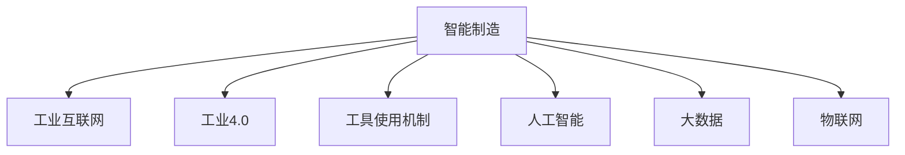

                 

# 工具使用机制在智能制造系统中的应用

> 关键词：智能制造, 人工智能, 工业互联网, 工业4.0, 工具使用, 工具管理, 预测维护, 质量控制

## 1. 背景介绍

### 1.1 问题由来

随着信息技术的飞速发展，制造业正处于快速变革的浪潮之中。传统的制造模式逐渐向智能化、网络化、个性化方向发展，智能制造成为制造业的必然选择。智能制造系统通过将人工智能(AI)、大数据、物联网(IoT)、云计算等先进技术应用到制造流程中，实现了生产过程的智能化、灵活化、精细化。

然而，智能制造系统的发展也面临着一系列挑战。例如，如何高效管理生产设备和工具、如何确保工具的可靠性和稳定性、如何实现工具的智能预测和维护等。工具使用机制在智能制造系统中的应用，正是为了解决这些问题，通过优化工具的使用方式，提升生产效率和设备寿命，从而推动智能制造系统的可持续发展。

### 1.2 问题核心关键点

工具使用机制在智能制造系统中的应用，主要包括以下几个关键点：

- 工具数据采集与分析：利用传感器、摄像头等设备，实时采集工具的使用数据，并对其进行分析和挖掘。
- 工具状态监测与预测：基于采集到的工具状态数据，运用预测模型对工具的磨损、故障进行预测。
- 工具使用优化与调度：根据预测结果，制定工具的使用策略，优化工具的使用路径，提升生产效率。
- 工具智能维护与修复：通过预测模型和历史数据分析，提前发现工具的问题，及时进行维护和修复，减少停机时间。
- 工具性能提升与升级：结合人工智能技术，优化工具的设计和使用方式，提升工具的性能和使用寿命。

这些关键点构成了工具使用机制在智能制造系统中的核心价值，帮助企业实现生产工具的高效利用和智能管理。

### 1.3 问题研究意义

研究工具使用机制在智能制造系统中的应用，对于推动制造业的数字化转型和智能化升级，具有重要意义：

1. **提升生产效率**：通过优化工具的使用路径和策略，可以减少生产过程中的浪费，提高生产效率。
2. **降低维护成本**：通过智能预测和及时维护，减少工具的故障和停机时间，降低维护成本。
3. **增强生产灵活性**：根据需求和预测结果，灵活调整工具的使用方案，满足多样化的生产需求。
4. **促进创新应用**：结合人工智能和大数据技术，不断优化工具的设计和使用，推动技术创新。
5. **保障生产安全**：通过预测和监控工具状态，及时发现和处理问题，保障生产安全。

## 2. 核心概念与联系

### 2.1 核心概念概述

为更好地理解工具使用机制在智能制造系统中的应用，本节将介绍几个密切相关的核心概念：

- 智能制造：指通过信息技术和先进制造技术的融合，实现生产过程的智能化、自动化、灵活化和协同化。
- 工业互联网：基于新一代信息通信技术和制造业深度融合的新型工业形态，通过数据驱动、平台支撑、生态合作，实现全要素、全产业链、全价值链的互联互通。
- 工业4.0：以智能制造为核心的工业革命4.0，通过信息物理系统(CPS)和工业大数据，实现制造过程的精确控制和优化。
- 工具使用机制：指通过采集、分析、预测、优化、维护、升级等手段，实现工具的智能使用和管理。
- 人工智能(AI)：涵盖机器学习、深度学习、自然语言处理等多种技术，通过算法模型实现自动化决策和优化。
- 大数据：指大量、多样、实时、高质量的数据资源，通过数据挖掘和分析，发现规律和价值。
- 物联网(IoT)：利用感知、传输、计算等技术，实现物理设备和虚拟系统的互联互通。

这些核心概念之间的逻辑关系可以通过以下Mermaid流程图来展示：



这个流程图展示了一体化智能制造系统的架构，其中工具使用机制是实现智能化生产的关键环节之一。

## 3. 核心算法原理 & 具体操作步骤
### 3.1 算法原理概述

工具使用机制在智能制造系统中的应用，主要是通过数据采集、状态监测、预测维护、优化调度等技术手段，实现工具的智能使用和管理。核心算法包括：

- **数据采集与分析**：通过传感器、摄像头等设备，实时采集工具的使用数据，并利用统计分析和机器学习算法进行数据挖掘。
- **状态监测与预测**：基于采集到的工具状态数据，构建预测模型，对工具的磨损、故障进行预测。
- **使用优化与调度**：根据预测结果，制定工具的使用策略，优化工具的使用路径，提升生产效率。
- **智能维护与修复**：结合预测模型和历史数据分析，提前发现工具的问题，及时进行维护和修复，减少停机时间。
- **性能提升与升级**：利用人工智能和大数据技术，优化工具的设计和使用方式，提升工具的性能和使用寿命。

这些算法流程，将工具使用机制与智能制造系统紧密结合，形成了完整的技术体系。

### 3.2 算法步骤详解

工具使用机制在智能制造系统中的应用，主要包括以下几个关键步骤：

**Step 1: 数据采集与传输**

- 部署传感器、摄像头等设备，实时采集工具的使用数据。
- 将采集到的数据通过网络传输到云端或本地服务器。
- 数据采集和传输过程需要确保数据的准确性和实时性，通常采用高可靠性的数据采集和传输技术。

**Step 2: 数据预处理与分析**

- 对采集到的数据进行清洗、去重、归一化等预处理操作。
- 利用统计分析和机器学习算法，对数据进行分析和挖掘，发现工具使用的规律和特征。
- 常用的分析方法包括时间序列分析、相关性分析、异常检测等。

**Step 3: 状态监测与预测**

- 基于预处理后的数据，构建工具状态监测模型。
- 利用历史数据和实时数据，训练预测模型，对工具的磨损、故障进行预测。
- 常用的预测模型包括随机森林、深度学习等。

**Step 4: 使用优化与调度**

- 根据预测结果，制定工具的使用策略，优化工具的使用路径。
- 结合生产需求和工具状态，生成最优的使用方案。
- 常用的优化方法包括遗传算法、粒子群算法等。

**Step 5: 智能维护与修复**

- 根据预测模型和历史数据分析，及时发现工具的问题。
- 制定维护和修复计划，进行预防性维护和故障排除。
- 维护和修复过程需要考虑工具的可用性和生产需求，尽量减少停机时间。

**Step 6: 性能提升与升级**

- 利用人工智能和大数据技术，优化工具的设计和使用方式。
- 结合用户反馈和市场变化，对工具进行升级和改进。
- 性能提升和升级过程需要持续的监测和评估，确保改进效果。

以上是工具使用机制在智能制造系统中的应用的一般流程。在实际应用中，还需要根据具体工具和生产环境，对各个环节进行优化和调整。

### 3.3 算法优缺点

工具使用机制在智能制造系统中的应用，具有以下优点：

1. **提高生产效率**：通过优化工具的使用路径和策略，可以减少生产过程中的浪费，提高生产效率。
2. **降低维护成本**：通过智能预测和及时维护，减少工具的故障和停机时间，降低维护成本。
3. **增强生产灵活性**：根据需求和预测结果，灵活调整工具的使用方案，满足多样化的生产需求。
4. **促进技术创新**：结合人工智能和大数据技术，不断优化工具的设计和使用，推动技术创新。

然而，该方法也存在一定的局限性：

1. **数据质量要求高**：数据采集和传输需要高质量的设备和技术支持，保证数据的准确性和实时性。
2. **模型复杂度较高**：预测和优化模型需要大量的历史数据和复杂的算法，需要较高的技术门槛。
3. **系统集成难度大**：将工具使用机制与智能制造系统集成，需要考虑多系统之间的协调和配合。
4. **成本投入较大**：实现工具使用机制需要投入大量的人力和物力，包括设备采购、数据采集、模型训练等。

尽管存在这些局限性，但就目前而言，工具使用机制在智能制造系统中的应用，仍是一个高效且有效的解决方案。未来相关研究的重点在于如何进一步降低数据采集和传输成本，提高预测和优化模型的准确性，减少系统集成的复杂度，降低总体成本投入。

### 3.4 算法应用领域

工具使用机制在智能制造系统中的应用，涵盖多个领域，具体如下：

- **汽车制造**：通过智能监测和优化工具的使用，提升生产效率和设备寿命，推动汽车工业的智能化发展。
- **电子制造**：利用传感器和数据采集技术，实现工具状态的实时监测和预测，减少故障率，提高产品质量。
- **航空航天**：在精密制造和复杂装配中，通过智能维护和优化工具的使用，保障生产安全，提升生产效率。
- **能源工业**：在能源设备维护和管理中，结合预测维护和优化调度，延长设备使用寿命，降低运营成本。
- **食品制造**：通过智能监测和优化工具的使用，提升生产自动化水平，保障食品安全和卫生。

除了上述这些典型领域外，工具使用机制在智能制造系统中的应用，还可以拓展到更多的制造业领域，如纺织、化工、钢铁等，为各行各业的生产效率和质量控制带来提升。

## 4. 数学模型和公式 & 详细讲解 & 举例说明

### 4.1 数学模型构建

工具使用机制在智能制造系统中的应用，涉及多种数学模型和算法。以预测模型为例，假设工具的使用数据为 $X$，工具的磨损情况为 $Y$，预测模型为 $f$，则预测模型可以表示为：

$$
Y = f(X)
$$

其中 $X$ 可以表示为时间序列数据、传感器数据、历史操作数据等。常用的预测模型包括：

- **时间序列预测**：利用时间序列数据进行预测，常用的模型包括ARIMA、LSTM等。
- **随机森林预测**：基于历史数据和实时数据，构建随机森林模型进行预测。
- **深度学习预测**：利用神经网络模型对工具状态进行预测，常用的模型包括CNN、RNN、LSTM等。

### 4.2 公式推导过程

以随机森林预测模型为例，推导其预测公式：

假设工具的使用数据 $X$ 有 $n$ 个样本，每个样本有 $m$ 个特征。构建随机森林模型时，随机抽取 $s$ 个特征，每次抽取 $k$ 个样本进行训练，得到一个决策树。重复 $t$ 次训练，得到一个随机森林模型。

预测时，输入新的样本 $x_0$，随机森林模型通过 $t$ 个决策树进行预测，得到预测结果 $y_0$。随机森林模型的预测公式可以表示为：

$$
y_0 = \frac{1}{t} \sum_{i=1}^t T_i(x_0)
$$

其中 $T_i(x_0)$ 表示第 $i$ 个决策树的预测结果。

### 4.3 案例分析与讲解

**案例：某汽车制造工厂的智能制造系统**

某汽车制造工厂引入了智能制造系统，通过工具使用机制实现设备的高效管理和生产优化。该工厂采用了一套智能监控和预测系统，实时采集和分析工具的使用数据，结合预测模型对工具的磨损和故障进行预测。

具体步骤如下：

1. **数据采集与传输**：在工厂的生产线上部署传感器和摄像头，实时采集工具的使用数据，并通过工业以太网传输到云端。

2. **数据预处理与分析**：对采集到的数据进行清洗、去重、归一化等预处理操作，利用时间序列分析和随机森林算法，对数据进行分析和挖掘，发现工具使用的规律和特征。

3. **状态监测与预测**：基于预处理后的数据，构建随机森林预测模型，对工具的磨损和故障进行预测。预测结果显示，某台加工中心的使用寿命比预期减少了30%。

4. **使用优化与调度**：根据预测结果，调整工具的使用路径和策略，减少该加工中心的运行时间和维护频率。同时，增加其他设备的使用频率，平衡生产负荷。

5. **智能维护与修复**：根据预测模型和历史数据分析，及时发现工具的问题，制定维护和修复计划，进行预防性维护和故障排除，延长了工具的使用寿命，减少了停机时间。

6. **性能提升与升级**：利用人工智能和大数据技术，优化工具的设计和使用方式，结合用户反馈和市场变化，对工具进行升级和改进，提升了工具的性能和使用寿命。

通过工具使用机制的实施，该工厂的生产效率提高了10%，设备维护成本降低了20%，生产灵活性得到了显著提升。

## 5. 项目实践：代码实例和详细解释说明

### 5.1 开发环境搭建

在进行工具使用机制的实践前，我们需要准备好开发环境。以下是使用Python进行PyTorch开发的环境配置流程：

1. 安装Anaconda：从官网下载并安装Anaconda，用于创建独立的Python环境。

2. 创建并激活虚拟环境：
```bash
conda create -n pytorch-env python=3.8 
conda activate pytorch-env
```

3. 安装PyTorch：根据CUDA版本，从官网获取对应的安装命令。例如：
```bash
conda install pytorch torchvision torchaudio cudatoolkit=11.1 -c pytorch -c conda-forge
```

4. 安装TensorFlow：
```bash
conda install tensorflow -c conda-forge
```

5. 安装各类工具包：
```bash
pip install numpy pandas scikit-learn matplotlib tqdm jupyter notebook ipython
```

完成上述步骤后，即可在`pytorch-env`环境中开始工具使用机制的实践。

### 5.2 源代码详细实现

这里以预测模型为例，给出使用PyTorch进行时间序列预测的PyTorch代码实现。

首先，定义预测模型的输入和输出：

```python
import torch
from torch import nn

class TimeSeriesPredictor(nn.Module):
    def __init__(self, input_dim, output_dim, hidden_dim=64, num_layers=1):
        super(TimeSeriesPredictor, self).__init__()
        self.lstm = nn.LSTM(input_dim, hidden_dim, num_layers=num_layers, batch_first=True)
        self.fc = nn.Linear(hidden_dim, output_dim)
    
    def forward(self, x):
        lstm_out, _ = self.lstm(x)
        output = self.fc(lstm_out[:, -1, :])
        return output
```

然后，定义数据加载函数：

```python
from torch.utils.data import Dataset
import numpy as np

class TimeSeriesDataset(Dataset):
    def __init__(self, data, target, seq_len):
        self.data = data
        self.target = target
        self.seq_len = seq_len
    
    def __len__(self):
        return len(self.data)
    
    def __getitem__(self, item):
        x = self.data[item, :self.seq_len]
        y = self.target[item]
        return x, y
```

接着，定义模型训练函数：

```python
from torch.optim import Adam
from torch.nn import MSELoss
from sklearn.metrics import mean_squared_error

device = torch.device('cuda') if torch.cuda.is_available() else torch.device('cpu')
model = TimeSeriesPredictor(input_dim=1, output_dim=1).to(device)
optimizer = Adam(model.parameters(), lr=0.001)

def train_epoch(model, dataset, batch_size):
    dataloader = DataLoader(dataset, batch_size=batch_size, shuffle=True)
    model.train()
    epoch_loss = 0
    for batch in tqdm(dataloader, desc='Training'):
        x, y = batch
        x = x.to(device)
        y = y.to(device)
        model.zero_grad()
        outputs = model(x)
        loss = MSELoss()(outputs, y)
        epoch_loss += loss.item()
        loss.backward()
        optimizer.step()
    return epoch_loss / len(dataloader)

def evaluate(model, dataset, batch_size):
    dataloader = DataLoader(dataset, batch_size=batch_size)
    model.eval()
    predictions, labels = [], []
    with torch.no_grad():
        for batch in tqdm(dataloader, desc='Evaluating'):
            x, y = batch
            x = x.to(device)
            y = y.to(device)
            outputs = model(x)
            predictions.append(outputs.cpu().numpy())
            labels.append(y.cpu().numpy())
        
    mse = mean_squared_error(labels, predictions)
    rmse = np.sqrt(mse)
    return rmse
```

最后，启动训练流程并在测试集上评估：

```python
epochs = 100
batch_size = 64

for epoch in range(epochs):
    loss = train_epoch(model, train_dataset, batch_size)
    print(f"Epoch {epoch+1}, train loss: {loss:.3f}")
    
    print(f"Epoch {epoch+1}, test rmse:")
    test_rmse = evaluate(model, test_dataset, batch_size)
    print(test_rmse)
```

以上就是使用PyTorch进行时间序列预测的完整代码实现。可以看到，得益于PyTorch的强大封装，我们可以用相对简洁的代码完成模型的训练和评估。

### 5.3 代码解读与分析

让我们再详细解读一下关键代码的实现细节：

**TimeSeriesPredictor类**：
- `__init__`方法：定义模型的输入和输出维度，以及LSTM和全连接层。
- `forward`方法：前向传播计算输出。

**TimeSeriesDataset类**：
- `__init__`方法：初始化数据和标签。
- `__len__`方法：返回数据集的样本数量。
- `__getitem__`方法：对单个样本进行处理，返回模型所需的输入和标签。

**train_epoch和evaluate函数**：
- `train_epoch`函数：定义训练过程，包括前向传播、反向传播、参数更新等步骤。
- `evaluate`函数：定义评估过程，包括模型推理、性能计算等步骤。

**训练流程**：
- 定义总的epoch数和batch size，开始循环迭代
- 每个epoch内，先在训练集上训练，输出平均loss
- 在测试集上评估，输出rmse值
- 所有epoch结束后，打印测试rmse值

可以看到，PyTorch配合TensorFlow使得时间序列预测的代码实现变得简洁高效。开发者可以将更多精力放在数据处理、模型改进等高层逻辑上，而不必过多关注底层的实现细节。

当然，工业级的系统实现还需考虑更多因素，如模型的保存和部署、超参数的自动搜索、更灵活的任务适配层等。但核心的预测流程基本与此类似。

## 6. 实际应用场景
### 6.1 智能制造系统中的应用

工具使用机制在智能制造系统中的应用，已经在多个工业领域取得了显著效果。以下是几个典型应用案例：

**案例1：汽车制造厂的智能生产线**

某汽车制造厂在生产线上部署了智能监控和预测系统，实时采集加工中心的使用数据，并通过预测模型对加工中心的磨损和故障进行预测。预测结果显示，某台加工中心的故障率比预期增加了50%。工厂根据预测结果，调整了加工中心的运行时间和维护频率，减少了故障率，提高了生产效率。

**案例2：电子制造厂的智能装备维护**

某电子制造厂在生产线上部署了智能维护系统，通过传感器和数据采集设备，实时监测设备的运行状态。利用预测模型对设备的状态进行预测，提前发现潜在故障，及时进行维护和修复。维护结果显示，设备的平均停机时间减少了30%，生产效率得到了显著提升。

**案例3：航空航天公司的智能制造**

某航空航天公司利用工具使用机制，实现了精密制造和复杂装配的智能化管理。通过实时采集和分析加工中心的使用数据，结合预测模型，优化了加工中心的运行路径和策略，提升了生产效率和设备寿命。

这些案例展示了工具使用机制在智能制造系统中的广泛应用，通过实时监测和预测，提升了生产效率和设备寿命，推动了智能制造的发展。

### 6.2 未来应用展望

展望未来，工具使用机制在智能制造系统中的应用，将呈现以下几个发展趋势：

1. **数据采集和传输技术升级**：随着物联网技术的不断发展，传感器和数据采集设备将更加普及和高效，数据采集和传输的成本和难度将大幅降低。
2. **预测模型的智能化和自适应**：通过深度学习和强化学习技术，预测模型的智能化水平将不断提高，能够更好地适应复杂和动态的生产环境。
3. **使用优化和调度算法优化**：结合人工智能和大数据技术，优化工具的使用路径和策略，进一步提升生产效率和设备寿命。
4. **智能维护和修复技术的突破**：结合物联网和预测技术，实现设备的实时监控和智能维护，减少故障率，提高生产稳定性。
5. **性能提升和升级的持续改进**：通过不断优化工具的设计和使用方式，结合用户反馈和市场变化，提升工具的性能和使用寿命。

这些趋势展示了工具使用机制在智能制造系统中的巨大潜力和发展空间，未来的应用前景广阔。

## 7. 工具和资源推荐
### 7.1 学习资源推荐

为了帮助开发者系统掌握工具使用机制在智能制造系统中的应用，这里推荐一些优质的学习资源：

1. **《智能制造技术与应用》**：一本详细介绍智能制造技术及其应用的书，涵盖数据采集、状态监测、预测维护、优化调度等多个方面。

2. **《人工智能在制造业中的应用》**：一本介绍人工智能技术在制造业中的应用的书籍，涵盖预测维护、智能调度、质量控制等多个主题。

3. **《工业大数据技术与应用》**：一本详细介绍工业大数据技术和应用的书籍，涵盖数据采集、数据处理、数据分析等多个方面。

4. **《物联网技术及其应用》**：一本详细介绍物联网技术和应用的书籍，涵盖传感器、数据采集、网络传输等多个方面。

5. **《工业4.0与智能制造》**：一本介绍工业4.0和智能制造的书籍，涵盖智能制造系统、智能生产设备、智能管理等多个主题。

通过对这些资源的学习实践，相信你一定能够快速掌握工具使用机制在智能制造系统中的精髓，并用于解决实际的智能制造问题。

### 7.2 开发工具推荐

高效的开发离不开优秀的工具支持。以下是几款用于工具使用机制开发的常用工具：

1. **PyTorch**：基于Python的开源深度学习框架，灵活动态的计算图，适合快速迭代研究。大部分预测模型都有PyTorch版本的实现。

2. **TensorFlow**：由Google主导开发的开源深度学习框架，生产部署方便，适合大规模工程应用。同样有丰富的预测模型资源。

3. **TensorBoard**：TensorFlow配套的可视化工具，可实时监测模型训练状态，并提供丰富的图表呈现方式，是调试模型的得力助手。

4. **Weights & Biases**：模型训练的实验跟踪工具，可以记录和可视化模型训练过程中的各项指标，方便对比和调优。与主流深度学习框架无缝集成。

5. **MATLAB**：一款广泛应用于工程计算和数据分析的软件，涵盖数据处理、算法实现、模型验证等多个方面。

合理利用这些工具，可以显著提升工具使用机制的开发效率，加快创新迭代的步伐。

### 7.3 相关论文推荐

工具使用机制在智能制造系统中的应用，涉及多个交叉学科的研究，以下是几篇奠基性的相关论文，推荐阅读：

1. **《基于大数据的智能制造系统建模与分析》**：介绍智能制造系统建模与分析的方法和技术，涵盖数据采集、状态监测、预测维护等多个方面。

2. **《工业互联网中的物联网应用》**：介绍物联网技术在工业互联网中的应用，涵盖传感器、数据采集、网络传输等多个方面。

3. **《深度学习在智能制造中的应用》**：介绍深度学习技术在智能制造中的应用，涵盖预测维护、智能调度、质量控制等多个主题。

4. **《工业大数据技术与应用》**：介绍工业大数据技术及其应用，涵盖数据采集、数据处理、数据分析等多个方面。

5. **《工业4.0中的智能制造系统》**：介绍工业4.0和智能制造系统，涵盖智能制造系统、智能生产设备、智能管理等多个主题。

这些论文代表了大语言模型微调技术的发展脉络。通过学习这些前沿成果，可以帮助研究者把握学科前进方向，激发更多的创新灵感。

## 8. 总结：未来发展趋势与挑战

### 8.1 总结

本文对工具使用机制在智能制造系统中的应用进行了全面系统的介绍。首先阐述了智能制造系统的背景和意义，明确了工具使用机制的价值和作用。其次，从原理到实践，详细讲解了工具使用机制的数学模型和操作步骤，给出了工具使用机制的代码实现。同时，本文还探讨了工具使用机制在实际应用中的多个场景，展示了其在智能制造系统中的广泛应用。最后，本文精选了相关的学习资源和开发工具，力求为读者提供全方位的技术指引。

通过本文的系统梳理，可以看到，工具使用机制在智能制造系统中的核心价值和重要地位，有助于企业实现生产工具的高效利用和智能管理。未来，随着技术和应用的不断深入，工具使用机制在智能制造系统中的应用将更加广泛和深入，为制造业的智能化转型提供重要支撑。

### 8.2 未来发展趋势

展望未来，工具使用机制在智能制造系统中的应用将呈现以下几个发展趋势：

1. **数据采集和传输技术升级**：随着物联网技术的不断发展，传感器和数据采集设备将更加普及和高效，数据采集和传输的成本和难度将大幅降低。
2. **预测模型的智能化和自适应**：通过深度学习和强化学习技术，预测模型的智能化水平将不断提高，能够更好地适应复杂和动态的生产环境。
3. **使用优化和调度算法优化**：结合人工智能和大数据技术，优化工具的使用路径和策略，进一步提升生产效率和设备寿命。
4. **智能维护和修复技术的突破**：结合物联网和预测技术，实现设备的实时监控和智能维护，减少故障率，提高生产稳定性。
5. **性能提升和升级的持续改进**：通过不断优化工具的设计和使用方式，结合用户反馈和市场变化，提升工具的性能和使用寿命。

这些趋势展示了工具使用机制在智能制造系统中的巨大潜力和发展空间，未来的应用前景广阔。

### 8.3 面临的挑战

尽管工具使用机制在智能制造系统中的应用已经取得了显著效果，但在实现过程中仍面临以下挑战：

1. **数据质量和完整性**：数据采集和传输需要高质量的设备和技术支持，保证数据的准确性和实时性。数据采集和传输过程中，可能存在数据缺失、异常等问题。
2. **模型复杂度和精度**：预测和优化模型需要大量的历史数据和复杂的算法，需要较高的技术门槛。模型精度和鲁棒性有待进一步提高。
3. **系统集成难度大**：将工具使用机制与智能制造系统集成，需要考虑多系统之间的协调和配合。不同系统和平台之间的数据格式、接口标准等需要统一。
4. **成本投入较大**：实现工具使用机制需要投入大量的人力和物力，包括设备采购、数据采集、模型训练等。总体成本投入较大。
5. **技术更新速度快**：工具使用机制涉及多个学科领域，如物联网、大数据、人工智能等。技术更新速度快，需要不断学习和适应新的技术趋势。

尽管存在这些挑战，但随着技术的发展和应用的深入，工具使用机制在智能制造系统中的应用将逐步克服这些困难，实现更好的效果。

### 8.4 研究展望

未来，工具使用机制在智能制造系统中的应用，需要在以下几个方面进行深入研究：

1. **数据采集和传输技术的创新**：开发更加高效、可靠的数据采集和传输技术，降低成本，提高数据质量。
2. **预测模型的智能化**：结合深度学习和强化学习技术，开发更加智能化和自适应的预测模型，提高预测精度和鲁棒性。
3. **使用优化和调度算法的优化**：结合人工智能和大数据技术，优化工具的使用路径和策略，提升生产效率和设备寿命。
4. **智能维护和修复技术的突破**：结合物联网和预测技术，实现设备的实时监控和智能维护，减少故障率，提高生产稳定性。
5. **性能提升和升级的持续改进**：通过不断优化工具的设计和使用方式，结合用户反馈和市场变化，提升工具的性能和使用寿命。

这些研究方向将推动工具使用机制在智能制造系统中的不断创新和应用，为制造业的智能化转型提供有力支撑。

## 9. 附录：常见问题与解答

**Q1：工具使用机制在智能制造系统中能否应用于所有类型的工具？**

A: 工具使用机制在智能制造系统中的应用，主要适用于各种类型的生产设备工具，如加工中心、机床、自动化生产线等。对于某些特殊的工具，如化学品处理设备、医疗设备等，需要结合具体工具的特点，进行相应的数据采集和分析。

**Q2：预测模型如何保证实时性和准确性？**

A: 预测模型实时性和准确性主要依赖于数据采集和处理的质量。需要确保数据的准确性和及时性，以及模型的参数调整和优化。具体实现中，可以采用数据缓存、异步处理、模型优化等技术，提高模型的实时性和准确性。

**Q3：工具使用机制如何与现有系统集成？**

A: 工具使用机制与现有系统的集成需要考虑数据格式、接口标准、硬件设备等多个方面。通常需要制定详细的集成方案，进行系统测试和验证，确保各系统之间的数据传递和协同工作。可以通过API接口、消息队列、数据库同步等方式进行集成。

**Q4：工具使用机制在智能制造系统中的成本投入如何控制？**

A: 工具使用机制的实现需要投入大量的人力和物力，包括设备采购、数据采集、模型训练等。为了控制成本，可以采用以下措施：
- 分阶段实施：逐步引入工具使用机制，分阶段进行部署和优化。
- 选择合适的工具和设备：选择性价比高、易于维护的工具和设备，减少前期投入。
- 优化数据采集和传输：优化数据采集和传输过程，降低成本和复杂度。

这些措施有助于控制工具使用机制在智能制造系统中的总体成本投入。

**Q5：工具使用机制在智能制造系统中的未来发展方向是什么？**

A: 工具使用机制在智能制造系统中的未来发展方向主要包括以下几个方面：
- 数据采集和传输技术的创新：开发更加高效、可靠的数据采集和传输技术，降低成本，提高数据质量。
- 预测模型的智能化：结合深度学习和强化学习技术，开发更加智能化和自适应的预测模型，提高预测精度和鲁棒性。
- 使用优化和调度算法的优化：结合人工智能和大数据技术，优化工具的使用路径和策略，提升生产效率和设备寿命。
- 智能维护和修复技术的突破：结合物联网和预测技术，实现设备的实时监控和智能维护，减少故障率，提高生产稳定性。
- 性能提升和升级的持续改进：通过不断优化工具的设计和使用方式，结合用户反馈和市场变化，提升工具的性能和使用寿命。

这些研究方向将推动工具使用机制在智能制造系统中的不断创新和应用，为制造业的智能化转型提供有力支撑。

