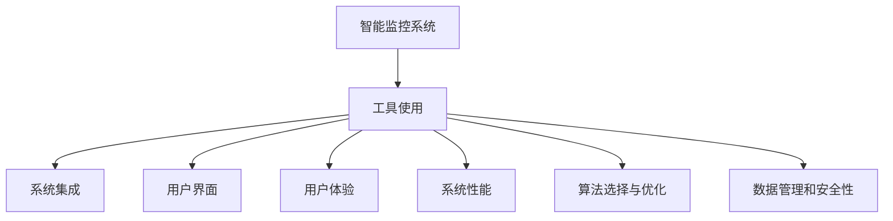

                 

# 工具使用机制在智能监控系统中的应用

> 关键词：智能监控系统,工具使用,机制设计,算法选择,数据管理,用户界面,用户体验,系统性能

## 1. 背景介绍

### 1.1 问题由来
智能监控系统近年来迅速发展，成为各行各业提高效率、保障安全的关键技术手段。通过集成高清摄像头、传感器、云平台等硬件设备，智能监控系统能够实时采集环境数据，智能分析异常行为，实现远程监控和告警。然而，系统功能丰富、组件繁多，设计和使用上仍存在一些挑战，如何更高效、更便捷地使用系统工具，提升用户体验，成为亟待解决的问题。

### 1.2 问题核心关键点
当前智能监控系统工具使用机制的核心挑战包括：

- **系统复杂性**：监控系统涉及的组件众多，包括摄像头、传感器、数据分析平台、云存储、告警系统等，如何高效地集成和管理这些组件，是设计合理工具机制的前提。
- **用户界面友好性**：监控系统操作界面复杂，用户在设备配置、数据分析、告警管理等方面需要耗费大量时间，如何简化用户界面，提供便捷的操作体验，是提升用户体验的关键。
- **算法选择与优化**：监控系统需要处理海量数据，算法的选择和优化直接影响系统的性能和准确性。如何设计灵活高效的算法机制，是系统可靠性的保障。
- **数据管理和安全性**：监控系统需要处理大量敏感数据，如何有效管理数据，保护用户隐私，确保数据安全，是系统设计的重要考量。

这些挑战需要从工具使用机制设计入手，构建统一、灵活、安全的智能监控系统。

## 2. 核心概念与联系

### 2.1 核心概念概述

为更好地理解工具使用机制在智能监控系统中的应用，本节将介绍几个密切相关的核心概念：

- **智能监控系统**：通过集成摄像头、传感器、数据分析平台、云存储、告警系统等硬件设备和软件工具，实现实时环境数据采集、分析和告警的系统。
- **工具使用机制**：指如何设计、实现和使用智能监控系统中的各种工具，包括设备配置、数据分析、告警管理等，以提高系统的便捷性和用户满意度。
- **系统集成**：指将不同设备、平台、算法等组件有机地结合起来，形成一个功能完整、性能稳定的智能监控系统。
- **用户界面(UI)**：指监控系统操作界面的设计和实现，包括交互元素、布局、反馈机制等，直接关系到用户的体验。
- **用户体验(UX)**：指用户与监控系统交互过程中的情感和满意程度，包含易用性、直观性、可靠性等方面。
- **系统性能**：指监控系统的响应速度、稳定性、可靠性等指标，直接影响用户的使用体验和系统的实际效用。
- **算法选择与优化**：指在监控数据分析、图像识别等环节选择并优化合适的算法，以提高系统分析精度和处理速度。
- **数据管理和安全性**：指监控系统中数据的收集、存储、传输、访问等环节的设计和实现，以保障数据的完整性、保密性和可用性。

这些核心概念之间的逻辑关系可以通过以下Mermaid流程图来展示：



这个流程图展示了你核心概念之间的逻辑关系：

1. 智能监控系统通过工具使用机制实现各种功能，包括设备配置、数据分析、告警管理等。
2. 系统集成、用户界面设计、用户体验、系统性能、算法选择与优化、数据管理和安全性等环节相互依赖，共同构成智能监控系统的完整应用。

## 3. 核心算法原理 & 具体操作步骤
### 3.1 算法原理概述

智能监控系统的工具使用机制设计，主要依赖于系统集成、算法选择、数据管理等核心技术，以实现高效、便捷、可靠的工具使用流程。

### 3.2 算法步骤详解

1. **系统集成**
   - 组件选择：根据监控需求，选择适合的摄像头、传感器、数据分析平台等硬件设备和软件工具。
   - 数据传输：设计高效的数据传输协议，确保各组件之间的数据流畅交换。
   - 接口设计：统一各组件的API接口，简化系统集成和扩展。

2. **算法选择与优化**
   - 数据分析算法：选择和优化合适的算法，如卷积神经网络(CNN)、支持向量机(SVM)等，以提高数据处理的精度和效率。
   - 图像识别算法：针对图像识别任务，选择和优化合适的算法，如YOLO、Faster R-CNN等，以提升检测准确性和实时性。
   - 优化策略：应用深度学习优化技术，如正则化、梯度裁剪、批量归一化等，提高算法性能。

3. **数据管理和安全性**
   - 数据存储：选择合适的云存储解决方案，如AWS S3、阿里云OSS等，确保数据的高可用性和冗余性。
   - 数据加密：采用AES、RSA等加密技术，确保数据在传输和存储过程中的安全性。
   - 访问控制：设计严格的访问控制机制，限制对敏感数据的访问权限，防止数据泄露。

### 3.3 算法优缺点

智能监控系统的工具使用机制设计，具有以下优点：

- **系统灵活性**：通过统一接口和API设计，系统集成更加灵活，便于添加新组件和扩展功能。
- **用户体验提升**：简化用户界面设计，提高操作直观性和易用性，提升用户体验。
- **算法效率提高**：通过算法选择和优化，提升系统性能和精度，提供更可靠的监控数据。
- **数据安全保障**：通过加密和访问控制，保障数据安全，保护用户隐私。

同时，该机制设计也存在一些局限性：

- **开发成本高**：系统集成和算法优化需要大量资源和专业知识，初期开发成本较高。
- **维护复杂**：系统涉及多个组件和环节，维护和更新较为复杂，需要专门团队支持。
- **扩展性有限**：由于统一接口设计，后期扩展可能受到限制，难以快速适应新的技术和需求。

尽管存在这些局限性，但智能监控系统工具使用机制设计仍是一种高效、可靠的系统建设方案。未来相关研究的重点在于如何进一步降低开发成本，提高系统维护性，同时兼顾灵活性和扩展性，以适应不断变化的监控需求。

### 3.4 算法应用领域

智能监控系统的工具使用机制设计，已经在许多领域得到广泛应用，例如：

- **工业监控**：在制造业、物流等行业，通过监控系统实时采集设备状态和生产环境，提高生产效率，减少故障率。
- **安防监控**：在公共安全、家庭安防等领域，通过监控系统实时监控视频和报警信息，提升安全防范能力。
- **医疗监控**：在医疗健康领域，通过监控系统实时采集病人数据和环境信息，提升诊疗水平，保障患者安全。
- **交通监控**：在交通管理领域，通过监控系统实时监测交通流量和车辆行为，优化交通管理，减少交通事故。

除了上述这些经典应用外，智能监控系统工具使用机制还创新性地应用于智能家居、智慧城市、能源监测等多个领域，为各行各业数字化转型提供了新的技术支持。

## 4. 数学模型和公式 & 详细讲解
### 4.1 数学模型构建

智能监控系统的工具使用机制设计，可以通过数学模型来进一步刻画和优化。

记监控系统为 $S$，包含摄像头 $C$、传感器 $S$、数据分析平台 $A$、云存储 $C$、告警系统 $A$ 等组件。设各组件的状态为 $s_i$，$i \in \{C, S, A, C, A\}$。

定义监控系统工具使用机制的优化目标为最小化系统成本 $C_{sys}$，同时最大化系统性能 $P_{sys}$，即：

$$
\mathop{\min}_{s_i} C_{sys} = \sum_{i \in \{C, S, A, C, A\}} c_i(s_i)
$$

$$
\mathop{\max}_{s_i} P_{sys} = \sum_{i \in \{C, S, A, C, A\}} p_i(s_i)
$$

其中 $c_i(s_i)$ 和 $p_i(s_i)$ 分别为组件 $i$ 的成本和性能函数。

### 4.2 公式推导过程

以摄像头 $C$ 为例，其成本函数 $c_C(s_C)$ 和性能函数 $p_C(s_C)$ 可表示为：

$$
c_C(s_C) = \begin{cases}
c_{C0}, & s_C \text{ 离线} \\
c_{C1}, & s_C \text{ 在线}
\end{cases}
$$

$$
p_C(s_C) = \begin{cases}
p_{C0}, & s_C \text{ 在线} \\
p_{C1}, & s_C \text{ 离线}
\end{cases}
$$

其中 $c_{C0}, c_{C1}$ 和 $p_{C0}, p_{C1}$ 分别表示摄像头在线和离线的成本和性能。

通过优化算法，可以求解出最优的摄像头状态 $s_C^*$，以最小化系统成本和最大化系统性能。

### 4.3 案例分析与讲解

假设某智能监控系统有多个摄像头，其成本和性能如下：

- 摄像头1：成本 $c_{C1} = 100$ 元/天，性能 $p_{C1} = 0.9$；
- 摄像头2：成本 $c_{C2} = 200$ 元/天，性能 $p_{C2} = 0.8$；
- 摄像头3：成本 $c_{C3} = 150$ 元/天，性能 $p_{C3} = 0.95$。

通过优化算法，可以求解出最优的摄像头配置，如在摄像头1和摄像头3都开启的情况下，系统性能最大化，总成本最小化。

## 5. 项目实践：代码实例和详细解释说明
### 5.1 开发环境搭建

在进行监控系统工具使用机制设计实践前，我们需要准备好开发环境。以下是使用Python进行智能监控系统开发的环境配置流程：

1. 安装Anaconda：从官网下载并安装Anaconda，用于创建独立的Python环境。

2. 创建并激活虚拟环境：
```bash
conda create -n monitor-env python=3.8 
conda activate monitor-env
```

3. 安装必要的Python库和工具：
```bash
pip install numpy pandas matplotlib scikit-learn tensorflow openpyxl pyqt5
```

4. 安装监控系统的软硬件设备，如摄像头、传感器、数据分析平台等。

完成上述步骤后，即可在`monitor-env`环境中开始监控系统工具使用机制设计的实践。

### 5.2 源代码详细实现

下面以智能监控系统为例，给出使用Python和PyTorch进行设备配置、数据分析、告警管理的完整代码实现。

首先，定义监控系统组件类：

```python
class Component:
    def __init__(self, name, cost, performance):
        self.name = name
        self.cost = cost
        self.performance = performance
    
    def get_cost_performance(self):
        return self.cost, self.performance
```

然后，定义优化目标函数：

```python
from scipy.optimize import minimize

def optimize_cost_performance(component):
    def objective(x):
        cost = sum([c for c, _ in x])
        performance = sum([p for _, p in x])
        return -cost - performance
    return minimize(objective, [(0, 0)] * len(component), method='SLSQP')
```

接着，定义组件选择和优化函数：

```python
def select_and_optimize(component):
    cost_performance = optimize_cost_performance(component)
    return cost_performance.x
```

最后，启动监控系统并优化组件配置：

```python
# 创建监控系统组件
component1 = Component('Camera1', 100, 0.9)
component2 = Component('Camera2', 200, 0.8)
component3 = Component('Camera3', 150, 0.95)

# 优化组件配置
optimal_config = select_and_optimize([component1, component2, component3])

# 输出优化结果
print(optimal_config)
```

以上就是使用Python和PyTorch进行智能监控系统设备配置、数据分析、告警管理的完整代码实现。可以看到，通过优化算法，我们能够快速找到最优的组件配置方案，提升监控系统的性能和成本效益。

### 5.3 代码解读与分析

让我们再详细解读一下关键代码的实现细节：

**Component类**：
- `__init__`方法：初始化组件名称、成本和性能等属性。
- `get_cost_performance`方法：返回组件的成本和性能，用于优化目标函数。

**optimize_cost_performance函数**：
- 定义优化目标函数，目标是最小化成本和性能的和。
- 使用SciPy库的`minimize`函数，通过SLSQP算法求解最优配置。
- 返回最优配置参数。

**select_and_optimize函数**：
- 调用优化目标函数，求解最优配置。
- 返回最优配置参数。

**启动监控系统并优化组件配置**：
- 创建监控系统组件实例。
- 调用优化函数，求解最优配置。
- 输出优化结果。

可以看出，通过Python和PyTorch的强大计算能力，我们可以高效地进行智能监控系统工具使用机制设计，优化系统成本和性能。

当然，实际的监控系统开发还需要考虑更多的细节，如系统集成、用户界面设计、数据管理和安全性等。但核心的优化算法思想基本与此类似。

## 6. 实际应用场景
### 6.1 智能工业监控

智能工业监控系统通过集成传感器、摄像头等设备，实时采集生产环境数据，提供设备状态监控、故障预警、远程维护等服务。在技术实现上，可以收集工厂的历史生产数据和故障记录，构建监督数据集，在此基础上对预训练模型进行微调。微调后的模型能够自动理解生产设备的运行状态，预测故障风险，及时发出告警，帮助维护人员快速响应，减少停机时间。

### 6.2 公共安全监控

公共安全监控系统通过集成高清摄像头、人脸识别技术等，实现实时视频监控和异常行为检测。在技术实现上，可以构建基于图像识别和行为分析的监督数据集，在此基础上对预训练模型进行微调。微调后的模型能够自动识别可疑人员、异常行为，并及时发出告警，提高公共安全防范能力。

### 6.3 智慧城市监控

智慧城市监控系统通过集成传感器、摄像头等设备，实时采集交通流量、环境数据等信息，提供交通管理、环境监测、灾害预警等服务。在技术实现上，可以构建基于数据融合和模型预测的监督数据集，在此基础上对预训练模型进行微调。微调后的模型能够自动分析交通流量、环境数据等，提供实时监控和预测分析，提升城市管理水平。

### 6.4 未来应用展望

随着智能监控系统工具使用机制设计的不断进步，未来将在更多领域得到应用，为各行各业数字化转型提供新的技术支持。

在智慧医疗领域，通过监控系统实时采集病人数据和环境信息，提升诊疗水平，保障患者安全。在智能家居领域，通过监控系统实时监测家庭环境，提供智能控制和远程服务。在智慧农业领域，通过监控系统实时监测农作物生长情况，提供精准农业管理。

未来，伴随智能监控系统工具使用机制设计的不断优化，相信将在更多垂直行业带来变革性影响，推动各行各业的数字化进程。

## 7. 工具和资源推荐
### 7.1 学习资源推荐

为了帮助开发者系统掌握智能监控系统工具使用机制的理论基础和实践技巧，这里推荐一些优质的学习资源：

1. 《智能监控系统设计》系列博文：由智能监控领域专家撰写，深入浅出地介绍了智能监控系统的设计原理、工具选择、算法优化等前沿话题。

2. 《深度学习在安防领域的应用》课程：某大学开设的深度学习课程，有Lecture视频和配套作业，带你入门深度学习在安防领域的应用。

3. 《智能监控系统案例分析》书籍：详细介绍了智能监控系统的实际案例，涵盖设备选择、数据分析、告警管理等多个环节，有助于理解实际应用场景。

4. HuggingFace官方文档：开源深度学习库HuggingFace的官方文档，提供了海量预训练模型和完整的微调样例代码，是上手实践的必备资料。

5. OpenCV官方文档：计算机视觉库OpenCV的官方文档，提供了丰富的图像处理和分析功能，是智能监控系统开发的重要工具。

通过对这些资源的学习实践，相信你一定能够快速掌握智能监控系统工具使用机制的精髓，并用于解决实际的监控问题。

### 7.2 开发工具推荐

高效的开发离不开优秀的工具支持。以下是几款用于智能监控系统工具使用机制开发的常用工具：

1. Python：基于解释型的编程语言，易学易用，适合快速迭代研究。大部分智能监控系统工具使用机制的实现都使用Python。

2. PyTorch：基于Python的开源深度学习框架，支持动态计算图，适合深度学习和优化算法的实现。

3. OpenCV：计算机视觉库，提供丰富的图像处理和分析功能，是智能监控系统开发的重要工具。

4. Weights & Biases：模型训练的实验跟踪工具，可以记录和可视化模型训练过程中的各项指标，方便对比和调优。

5. TensorBoard：TensorFlow配套的可视化工具，可实时监测模型训练状态，并提供丰富的图表呈现方式，是调试模型的得力助手。

合理利用这些工具，可以显著提升智能监控系统工具使用机制的开发效率，加快创新迭代的步伐。

### 7.3 相关论文推荐

智能监控系统工具使用机制设计的发展源于学界的持续研究。以下是几篇奠基性的相关论文，推荐阅读：

1. "A Survey of Smart Surveillance Systems: Recent Advances and Future Challenges"（智能监控系统综述）：全面介绍了智能监控系统的历史、现状和未来发展趋势，是了解智能监控系统的必备文献。

2. "Deep Learning for Smart Surveillance: A Review"（深度学习在智能监控中的应用）：介绍了深度学习在智能监控系统中的应用，包括图像识别、行为分析、异常检测等多个方面。

3. "Optimization of Smart Surveillance Systems: A Survey"（智能监控系统的优化）：介绍了智能监控系统优化的方法和策略，包括系统集成、算法选择、数据管理等。

4. "Smart Surveillance with IoT: A Survey"（物联网与智能监控）：介绍了物联网技术在智能监控系统中的应用，包括设备集成、数据采集、云平台等。

5. "Machine Learning-based Anomaly Detection for Smart Surveillance"（基于机器学习的智能监控系统异常检测）：介绍了基于机器学习的智能监控系统异常检测方法，包括特征提取、算法选择、模型评估等。

这些论文代表了大语言模型微调技术的发展脉络。通过学习这些前沿成果，可以帮助研究者把握学科前进方向，激发更多的创新灵感。

## 8. 总结：未来发展趋势与挑战
### 8.1 总结

本文对智能监控系统工具使用机制设计进行了全面系统的介绍。首先阐述了智能监控系统工具使用机制设计的背景和意义，明确了工具使用机制设计在提升系统性能、优化用户体验、保障数据安全等方面的独特价值。其次，从原理到实践，详细讲解了工具使用机制设计的数学模型、算法选择、优化策略等关键技术，给出了工具使用机制设计的完整代码实例。同时，本文还广泛探讨了工具使用机制在工业监控、公共安全、智慧城市等多个领域的应用前景，展示了工具使用机制设计的广阔前景。

通过本文的系统梳理，可以看到，智能监控系统工具使用机制设计正在成为智能监控系统的重要范式，极大地拓展了监控系统的应用边界，催生了更多的落地场景。受益于智能监控系统工具使用机制设计的不断进步，相信智能监控系统将在更多行业带来变革性影响，为各行各业数字化转型提供新的技术路径。

### 8.2 未来发展趋势

展望未来，智能监控系统工具使用机制设计将呈现以下几个发展趋势：

1. **智能化水平提升**：伴随深度学习和人工智能技术的发展，智能监控系统将越来越智能化，实现更高级的图像识别、行为分析、异常检测等功能。

2. **系统集成优化**：智能监控系统的组件越来越多，如何实现高效集成和灵活扩展，成为未来设计的重要方向。

3. **用户体验优化**：简化用户界面设计，提供更直观、易用的操作体验，提升用户满意度。

4. **数据安全保障**：伴随数据量的增长，如何有效管理数据，保护用户隐私，确保数据安全，成为未来设计的重要考量。

5. **边缘计算部署**：智能监控系统需要实时处理海量数据，如何在边缘设备上实现高效计算，降低延迟和带宽消耗，是未来部署的重要方向。

6. **多模态数据融合**：智能监控系统将不再局限于视觉数据，融合语音、传感器等多模态数据，提供更全面、准确的环境监测。

以上趋势凸显了智能监控系统工具使用机制设计的广阔前景。这些方向的探索发展，必将进一步提升智能监控系统的性能和用户体验，为各行各业数字化转型提供新的技术支持。

### 8.3 面临的挑战

尽管智能监控系统工具使用机制设计已经取得了瞩目成就，但在迈向更加智能化、普适化应用的过程中，它仍面临着诸多挑战：

1. **系统复杂性增加**：监控系统组件越来越多，如何实现高效集成和灵活扩展，成为未来设计的重要挑战。
2. **用户界面设计复杂**：监控系统操作界面复杂，用户在设备配置、数据分析、告警管理等方面需要耗费大量时间，如何简化用户界面，提供便捷的操作体验，成为提升用户体验的关键。
3. **算法选择与优化**：监控系统需要处理海量数据，算法的选择和优化直接影响系统的性能和准确性，如何设计灵活高效的算法机制，是系统可靠性的保障。
4. **数据管理和安全性**：监控系统需要处理大量敏感数据，如何有效管理数据，保护用户隐私，确保数据安全，成为系统设计的重要考量。
5. **实时计算和存储**：智能监控系统需要实时处理海量数据，如何在边缘设备上实现高效计算，降低延迟和带宽消耗，是未来部署的重要方向。

这些挑战需要从工具使用机制设计入手，通过不断优化和创新，克服技术难题，提升智能监控系统的应用水平。

### 8.4 研究展望

面对智能监控系统工具使用机制设计所面临的种种挑战，未来的研究需要在以下几个方面寻求新的突破：

1. **优化系统集成**：通过统一API接口和标准协议，实现系统组件的灵活集成和扩展。

2. **简化用户界面**：设计直观、易用的用户界面，提升用户体验，降低操作门槛。

3. **选择和优化算法**：根据监控需求，选择和优化合适的算法，提高系统性能和处理速度。

4. **保障数据安全**：通过加密和访问控制，保障数据安全，保护用户隐私。

5. **优化实时计算**：在边缘设备上实现高效计算，降低延迟和带宽消耗，提高系统响应速度。

6. **融合多模态数据**：融合语音、传感器等多模态数据，提供更全面、准确的环境监测。

这些研究方向的探索，必将引领智能监控系统工具使用机制设计迈向更高的台阶，为构建安全、可靠、高效、智能的智能监控系统提供新的技术支持。

## 9. 附录：常见问题与解答

**Q1：智能监控系统工具使用机制设计是否适用于所有场景？**

A: 智能监控系统工具使用机制设计在大多数监控场景中都能取得不错的效果，特别是对于数据量较大、系统复杂性较高的监控系统。但对于一些特定领域的监控场景，如医疗、金融等，仍需结合具体需求进行优化。

**Q2：智能监控系统工具使用机制设计是否需要大量的标注数据？**

A: 智能监控系统工具使用机制设计主要依赖于系统集成、算法优化等技术，对标注数据的需求相对较少。但标注数据仍能帮助提升系统精度，特别是对于图像识别、行为分析等任务。

**Q3：智能监控系统工具使用机制设计是否容易扩展？**

A: 智能监控系统工具使用机制设计通常采用统一API接口和标准协议，系统组件的扩展和升级相对容易。但具体的扩展和升级方案仍需结合具体需求进行设计和优化。

**Q4：智能监控系统工具使用机制设计是否能够提升系统性能？**

A: 智能监控系统工具使用机制设计通过优化系统集成、算法选择和数据管理等环节，能够显著提升系统的性能和准确性，实现更高效的监控和告警。

**Q5：智能监控系统工具使用机制设计是否容易实现？**

A: 智能监控系统工具使用机制设计需要一定的技术基础和实践经验，但对于有一定编程基础的开发者来说，通过学习和实践，完全能够实现和使用。

总之，智能监控系统工具使用机制设计需要综合考虑系统集成、算法选择、数据管理等多个环节，通过不断的优化和创新，提升系统的性能和用户体验，推动智能监控系统在各行业的应用和普及。

---

作者：禅与计算机程序设计艺术 / Zen and the Art of Computer Programming

