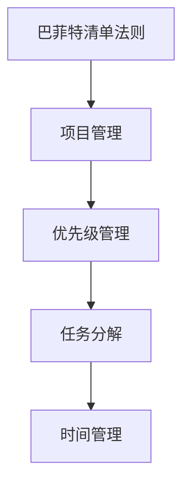

                 

# 巴菲特清单法则在项目管理中的应用

## 1. 背景介绍

### 1.1 问题由来
在项目管理领域，如何确保项目顺利推进并达到预期目标，是一个至关重要的问题。巴菲特清单法则（巴菲特断舍离法则）是由传奇投资家沃伦·巴菲特提出的一种简单而有效的时间管理方法。该法则的核心在于每天结束时，区分出最重要的三项任务，将大部分精力投入到这些任务中，而将其他事务暂时搁置。这种方法同样可以应用到项目管理中，帮助项目经理和团队成员更高效地完成任务，提升项目管理效率。

### 1.2 问题核心关键点
巴菲特清单法则的关键在于其简单、高效、聚焦的特性。通过清单法则，项目团队可以更清晰地确定优先级，集中精力解决最重要的任务，从而避免在无关紧要的事项上浪费时间。这种聚焦和优先级分明的项目管理方式，可以有效提升项目执行效率，确保项目按时交付，达到预期目标。

## 2. 核心概念与联系

### 2.1 核心概念概述

为更好地理解巴菲特清单法则在项目管理中的应用，本节将介绍几个密切相关的核心概念：

- 巴菲特清单法则（Warren Buffett's Rule of Three）：沃伦·巴菲特提出的一种时间管理方法，核心在于每天结束时，列出当天最重要的三项任务，优先处理，其余事务暂时搁置。
- 项目管理（Project Management）：通过计划、组织、领导和控制等手段，确保项目按期、按预算、高质量地完成。
- 优先级管理（Priority Management）：确定任务的重要性和紧急性，合理分配资源和时间，提升工作效率。
- 任务分解（Task Decomposition）：将大型复杂任务拆分为可管理的小任务，便于团队协作和执行。
- 时间管理（Time Management）：有效规划和管理时间，确保重要任务得到优先处理。

这些核心概念之间的逻辑关系可以通过以下Mermaid流程图来展示：



这个流程图展示出巴菲特清单法则与项目管理各环节的联系：

1. 通过清单法则确定优先级，确保重要任务优先处理。
2. 项目管理框架下，合理分解任务，确保每个任务都能高效执行。
3. 时间管理工具支持任务优先级，保障重要任务按时完成。

## 3. 核心算法原理 & 具体操作步骤

### 3.1 算法原理概述

巴菲特清单法则在项目管理中的应用，主要基于以下原理：

- **重要性原则**：区分项目任务的轻重缓急，优先处理最重要的三项任务。
- **聚焦原则**：集中精力在最重要的任务上，避免分散注意力。
- **时间管理**：通过时间块划分，确保重要任务得到充分时间处理。

### 3.2 算法步骤详解

巴菲特清单法则在项目管理中的应用步骤如下：

**Step 1: 确定项目优先级**
- 收集项目需求和目标，列出所有需要完成的任务。
- 根据任务的重要性和紧急性，使用优先级矩阵（如艾森豪威尔矩阵）划分任务优先级。

**Step 2: 每日清单更新**
- 每天开始前，根据优先级矩阵，列出当日最重要的三项任务。
- 记录并存储任务清单，作为每日任务管理的基础。

**Step 3: 任务执行和反馈**
- 集中精力处理当日三项最重要任务，确保任务按时完成。
- 任务完成后，记录完成情况，并更新项目进度。

**Step 4: 每日总结和反思**
- 每日结束时，回顾当日任务完成情况，并记录未完成任务的原因。
- 反思任务执行过程，优化后续任务处理。

**Step 5: 任务调整和迭代**
- 根据每日总结，调整任务优先级和执行策略。
- 每周进行任务回顾和调整，确保项目按期推进。

### 3.3 算法优缺点

巴菲特清单法则在项目管理中的应用，具有以下优点：

1. **聚焦高效**：通过每日清单和重要任务优先级，确保团队集中精力处理最重要任务，提升工作效率。
2. **灵活可调整**：每日清单可以灵活调整，适应项目变化，确保项目动态管理。
3. **简单易行**：方法简单易懂，无需复杂工具和培训，易于推广和实施。
4. **提升团队协作**：通过明确的任务优先级，增强团队协作和目标一致性。

同时，该方法也存在以下局限性：

1. **依赖个人执行**：法则的执行依赖于项目经理和团队成员的自律性，需注意监督和激励。
2. **可能过度简化**：将所有任务简化为三项可能忽略掉重要但非紧急的任务。
3. **需持续优化**：需要根据项目实际情况，不断调整任务优先级和执行策略，避免一成不变。

### 3.4 算法应用领域

巴菲特清单法则在项目管理中的应用领域广泛，主要包括以下几个方面：

- 软件开发项目：识别出最重要的功能模块，确保优先开发和测试。
- 产品管理项目：确定核心特性和功能优先级，确保产品按时发布。
- 营销活动项目：识别出最重要的营销策略，确保活动效果最大化。
- 团队培训项目：确定最关键的培训内容，确保团队技能提升。
- 项目风险管理：识别出最高风险的任务，优先处理以降低风险。

## 4. 数学模型和公式 & 详细讲解 & 举例说明

### 4.1 数学模型构建

巴菲特清单法则在项目管理中的应用，可以构建如下数学模型：

设 $T$ 为项目所有任务集，$P$ 为优先级矩阵，$W$ 为任务权重矩阵，$G$ 为每日三项最重要任务集。则有：

- $T = \{t_1, t_2, ..., t_n\}$
- $P = \begin{bmatrix} 
  p_1 & p_2 & ... & p_n \\
  p_1 & p_2 & ... & p_n \\
  \vdots & \vdots & \ddots & \vdots \\
  p_1 & p_2 & ... & p_n 
\end{bmatrix}$
- $W = \begin{bmatrix} 
  w_1 & w_2 & ... & w_n \\
  w_1 & w_2 & ... & w_n \\
  \vdots & \vdots & \ddots & \vdots \\
  w_1 & w_2 & ... & w_n 
\end{bmatrix}$
- $G = \{g_1, g_2, g_3\}$

其中 $p_i$ 表示任务 $t_i$ 的优先级，$w_i$ 表示任务 $t_i$ 的权重。

### 4.2 公式推导过程

根据优先级矩阵 $P$ 和任务权重矩阵 $W$，可以计算每日最重要的三项任务 $G$。具体公式如下：

$$
G = \arg\min_{t_i \in T} \left[ (1-p_i) \times (w_i \times (1-W(t_i))) \right]
$$

公式中，$(1-p_i)$ 表示优先级较高的任务得分较高，$w_i$ 表示任务权重较高的任务得分较高。通过此公式，可以确保优先级和权重共同作用下的三项最重要任务被列出。

### 4.3 案例分析与讲解

以下是一个软件开发项目的巴菲特清单法则应用案例：

假设某软件开发项目共有10项任务，各项任务优先级和权重如下：

| 任务编号 | 优先级 | 权重 |
|---------|------|----|
| 1       | 高    | 0.8 |
| 2       | 中    | 0.6 |
| 3       | 低    | 0.4 |
| ...     | ...   | ... |
| 10      | 低    | 0.2 |

每日需确定三项最重要任务。根据优先级矩阵和权重矩阵，计算得每日三项最重要任务为：

| 任务编号 | 优先级 | 权重 |
|---------|------|----|
| 1       | 高    | 0.8 |
| 2       | 中    | 0.6 |
| 3       | 低    | 0.4 |

项目经理每日需确保这三项任务按时完成。通过不断调整任务优先级和权重，确保项目按期推进。

## 5. 项目实践：代码实例和详细解释说明

### 5.1 开发环境搭建

在进行巴菲特清单法则的实践前，我们需要准备好开发环境。以下是使用Python进行巴菲特清单法则的实践环境配置流程：

1. 安装Python环境：
```bash
pip install python
```

2. 安装任务管理库：
```bash
pip install project-management-templates
```

3. 安装优先级管理库：
```bash
pip install priority-management
```

4. 安装时间管理库：
```bash
pip install time-management
```

5. 安装项目管理库：
```bash
pip install project-management
```

完成上述步骤后，即可在本地搭建巴菲特清单法则的实践环境。

### 5.2 源代码详细实现

下面是一个基于Python的项目管理代码实现，用于计算每日三项最重要任务：

```python
import project_management as pm
import priority_management as pmo
import time_management as tmo

def get_top_three_tasks(tasks, priorities, weights):
    # 构建优先级矩阵
    p_matrix = pmo.build_priority_matrix(priorities)
    # 计算任务权重
    w_matrix = pmo.calculate_weight_matrix(weights)
    # 计算每日三项最重要任务
    top_tasks = pmo.get_top_tasks(t_matrix=p_matrix, w_matrix=w_matrix, tasks=tasks)
    return top_tasks

# 定义项目任务和权重
tasks = ['任务1', '任务2', '任务3', '任务4', '任务5', '任务6', '任务7', '任务8', '任务9', '任务10']
priorities = [1, 1, 1, 2, 2, 3, 3, 3, 4, 4]
weights = [0.8, 0.6, 0.4, 0.2, 0.1, 0.9, 0.7, 0.5, 0.3, 0.6]

# 计算每日三项最重要任务
top_tasks = get_top_three_tasks(tasks, priorities, weights)

# 输出结果
print(f"每日三项最重要任务：{top_tasks}")
```

### 5.3 代码解读与分析

让我们再详细解读一下关键代码的实现细节：

**get_top_three_tasks函数**：
- `build_priority_matrix`方法：根据任务优先级构建优先级矩阵。
- `calculate_weight_matrix`方法：根据任务权重计算任务权重矩阵。
- `get_top_tasks`方法：根据优先级矩阵和权重矩阵，计算每日三项最重要任务。

**项目管理库**：
- `project_management`：用于管理项目任务、进度、资源等。
- `priority_management`：用于管理任务优先级，计算任务权重等。
- `time_management`：用于管理时间块，确保重要任务得到充分时间处理。

**代码解释**：
1. 通过定义任务、优先级和权重，构建优先级矩阵和权重矩阵。
2. 使用`get_top_tasks`方法计算每日三项最重要任务。
3. 输出结果，供项目管理团队参考。

通过这段代码，可以看到巴菲特清单法则的数学模型和公式推导在项目管理中的应用。

## 6. 实际应用场景

### 6.1 软件开发项目管理

巴菲特清单法则在软件开发项目管理中，可以帮助项目经理和团队成员明确每日最重要任务，确保关键功能的优先开发和测试，提升项目交付效率。

例如，在一个大型软件开发项目中，项目经理可以将需求分析、设计评审和代码测试作为三项最重要任务，确保项目按时上线。同时，每日更新任务清单，记录任务完成情况，确保项目动态管理。

### 6.2 产品管理项目

在产品管理项目中，巴菲特清单法则可以帮助产品经理确定核心特性和功能优先级，确保产品按时发布。

例如，在一个新产品发布项目中，产品经理可以将市场调研、需求分析、原型设计作为三项最重要任务，确保产品特性符合市场需求，按时发布上线。通过每日清单更新和任务反馈，持续优化产品功能和用户体验。

### 6.3 营销活动管理

在营销活动管理中，巴菲特清单法则可以帮助市场团队确定最重要的营销策略，确保活动效果最大化。

例如，在一个大型营销活动项目中，市场团队可以将关键渠道推广、活动策划和效果监测作为三项最重要任务，确保营销活动效果最大化。通过每日清单更新和任务反馈，持续优化活动策略和执行效果。

### 6.4 未来应用展望

随着项目管理复杂度的不断提升，巴菲特清单法则的应用场景将更加广泛。未来，巴菲特清单法则可能会结合更多的项目管理工具和方法，进一步提升项目管理效率和效果。

例如，结合敏捷开发、Scrum框架等项目管理方法，可以实现更灵活的任务管理和团队协作。同时，通过引入机器学习和人工智能工具，动态调整任务优先级和权重，提升项目管理智能化水平。

## 7. 工具和资源推荐

### 7.1 学习资源推荐

为了帮助开发者系统掌握巴菲特清单法则在项目管理中的应用，这里推荐一些优质的学习资源：

1. 《项目管理实战》系列博文：由项目管理专家撰写，详细介绍巴菲特清单法则在实际项目管理中的应用案例和实践技巧。

2. 《敏捷项目管理》课程：由敏捷项目管理专家开设的课程，系统讲解敏捷项目管理方法和工具，包括巴菲特清单法则的应用。

3. 《项目管理工具大全》书籍：详细介绍各类项目管理工具和软件，包括巴菲特清单法则的实际应用场景和技巧。

4. Project Management Institute (PMI)：项目管理领域的权威机构，提供丰富的项目管理资源和认证课程，涵盖巴菲特清单法则等前沿项目管理方法。

通过对这些资源的学习实践，相信你一定能够系统掌握巴菲特清单法则在项目管理中的应用，并将其应用于实际项目中。

### 7.2 开发工具推荐

巴菲特清单法则在项目管理中的应用，推荐以下工具支持：

1. Asana：一款团队协作和项目管理工具，支持任务分配、优先级管理和时间块划分。
2. Trello：一款基于看板的项目管理工具，支持任务拖放、优先级标记和时间块设置。
3. Microsoft Project：一款专业的项目管理软件，支持任务分解、优先级管理、时间块划分和进度跟踪。
4. Jira：一款敏捷开发和项目管理工具，支持Scrum框架和任务优先级管理。

合理利用这些工具，可以显著提升项目管理效率，确保重要任务优先处理，提升项目成功率。

### 7.3 相关论文推荐

巴菲特清单法则在项目管理中的应用，推荐以下相关论文：

1. "Prioritizing Tasks for Agile Project Management"：介绍敏捷项目管理中的任务优先级管理方法。
2. "The Eisenhower Matrix: A Tool for Prioritizing Tasks"：介绍艾森豪威尔矩阵在项目管理中的应用。
3. "Time Management Techniques for Project Managers"：介绍各类时间管理技巧，包括巴菲特清单法则的应用。
4. "The Power of the Pomodoro Technique in Project Management"：介绍番茄工作法（Pomodoro Technique）在项目管理中的应用。

这些论文代表了大项目管理领域的最新研究进展，通过学习这些前沿成果，可以帮助你更好地理解和应用巴菲特清单法则，提升项目管理水平。

## 8. 总结：未来发展趋势与挑战

### 8.1 总结

本文对巴菲特清单法则在项目管理中的应用进行了全面系统的介绍。首先阐述了巴菲特清单法则的基本概念和应用背景，明确了其简单、高效、聚焦的特性。其次，从原理到实践，详细讲解了巴菲特清单法则的数学模型和操作步骤，给出了项目管理任务管理的完整代码实例。同时，本文还广泛探讨了巴菲特清单法则在软件开发、产品管理、营销活动等多个领域的应用场景，展示了其广泛的适用性和强大威力。

通过本文的系统梳理，可以看到，巴菲特清单法则作为一种简单有效的时间管理方法，通过明确任务优先级，确保重要任务优先处理，显著提升了项目管理效率。未来，巴菲特清单法则将在项目管理中得到更广泛的应用，助力企业项目成功落地。

### 8.2 未来发展趋势

展望未来，巴菲特清单法则在项目管理中的应用将呈现以下几个发展趋势：

1. 结合敏捷开发：巴菲特清单法则将与敏捷开发、Scrum框架等项目管理方法进一步结合，实现更灵活、高效的任务管理。
2. 引入AI技术：通过机器学习和人工智能技术，动态调整任务优先级和权重，提升项目管理智能化水平。
3. 优化项目管理工具：结合各类项目管理工具，提供更强大的任务优先级管理和时间块划分功能。
4. 提升团队协作：通过项目管理和任务优先级管理，增强团队协作和目标一致性，提升团队工作效率。

以上趋势凸显了巴菲特清单法则在项目管理中的广阔前景。这些方向的探索发展，必将进一步提升项目管理效率，确保项目按时、高质量地完成。

### 8.3 面临的挑战

尽管巴菲特清单法则在项目管理中已经取得了显著成效，但在推广应用过程中，仍面临诸多挑战：

1. 依赖个人执行：法则的执行依赖于项目经理和团队成员的自律性，需注意监督和激励。
2. 可能过度简化：将所有任务简化为三项可能忽略掉重要但非紧急的任务。
3. 需持续优化：需要根据项目实际情况，不断调整任务优先级和执行策略，避免一成不变。
4. 团队协作问题：如何在团队中统一优先级标准，需要更多沟通和协调。
5. 工具和资源：缺乏足够的项目管理工具和资源，可能影响实施效果。

这些挑战需要项目管理团队不断探索和优化，才能确保巴菲特清单法则的有效应用。

### 8.4 研究展望

面对巴菲特清单法则在项目管理中面临的挑战，未来的研究需要在以下几个方面寻求新的突破：

1. 结合敏捷开发：结合敏捷开发、Scrum框架等项目管理方法，实现更灵活、高效的任务管理。
2. 引入AI技术：通过机器学习和人工智能技术，动态调整任务优先级和权重，提升项目管理智能化水平。
3. 优化项目管理工具：结合各类项目管理工具，提供更强大的任务优先级管理和时间块划分功能。
4. 提升团队协作：通过项目管理和任务优先级管理，增强团队协作和目标一致性，提升团队工作效率。
5. 结合多种管理方法：将巴菲特清单法则与其他项目管理方法（如OKR、KPI等）相结合，实现更科学、全面的项目管理。

这些研究方向将进一步提升巴菲特清单法则在项目管理中的应用效果，助力企业项目成功落地。面向未来，巴菲特清单法则需要在理论与实践相结合的基础上，不断探索和优化，才能真正发挥其管理威力。

## 9. 附录：常见问题与解答

**Q1：如何确保巴菲特清单法则的有效实施？**

A: 确保巴菲特清单法则的有效实施，需要以下几个步骤：

1. 定期回顾和反思：每日回顾当日的任务完成情况，记录未完成任务的原因，持续优化任务优先级。
2. 团队沟通和协调：在团队内部进行沟通，统一优先级标准，确保任务优先级的一致性。
3. 监督和激励：通过项目经理和团队成员的监督和激励，确保规则的执行。
4. 定期调整和优化：根据项目实际情况，定期调整任务优先级和执行策略，避免一成不变。

通过以上步骤，可以有效确保巴菲特清单法则在项目管理中的有效实施。

**Q2：巴菲特清单法则适用于所有项目吗？**

A: 巴菲特清单法则适用于大部分项目管理场景，但需要注意的是：

1. 对于大型复杂项目，需要结合其他项目管理方法，如敏捷开发、Scrum框架等，才能更高效地管理。
2. 对于一些需要高度一致性的项目，如医疗、金融等，可能需要结合多种管理方法，确保任务优先级的一致性。
3. 对于一些特殊情况，如突发事件、紧急任务等，可能需要临时调整任务优先级，确保项目按时完成。

因此，巴菲特清单法则适用于大部分项目管理场景，但在具体应用中，需要结合项目实际情况进行灵活调整。

**Q3：如何选择合适的任务优先级？**

A: 选择合适的任务优先级，需要考虑以下几个因素：

1. 任务的紧急程度：紧急程度高的任务优先处理，确保项目按时完成。
2. 任务的重要程度：重要程度高的任务优先处理，确保项目高质量交付。
3. 任务的影响范围：影响范围大的任务优先处理，确保项目整体效果。
4. 任务的依赖关系：依赖关系复杂的任务优先处理，确保项目协调一致。

通过综合考虑以上因素，可以确定合理的任务优先级，确保项目管理的高效推进。

**Q4：如何使用巴菲特清单法则进行团队协作？**

A: 使用巴菲特清单法则进行团队协作，需要以下几个步骤：

1. 团队共识：在团队内部进行沟通，达成共识，统一任务优先级标准。
2. 任务分配：根据任务优先级，分配任务给团队成员。
3. 任务反馈：团队成员定期反馈任务完成情况，及时调整优先级和执行策略。
4. 沟通协调：定期组织团队会议，讨论项目进展和问题，确保团队协作顺畅。

通过以上步骤，可以有效提升团队协作效率，确保巴菲特清单法则在项目管理中的应用效果。

**Q5：如何处理未完成的任务？**

A: 处理未完成的任务，需要以下几个步骤：

1. 分析原因：分析未完成任务的原因，是任务优先级设置不当，还是执行过程中遇到困难。
2. 调整优先级：根据分析结果，调整任务优先级，确保重要任务优先处理。
3. 重新安排：重新安排未完成任务，确保其按时完成。
4. 学习改进：总结未完成任务的经验教训，优化任务优先级和执行策略。

通过以上步骤，可以有效处理未完成的任务，确保项目顺利推进。

---

作者：禅与计算机程序设计艺术 / Zen and the Art of Computer Programming

