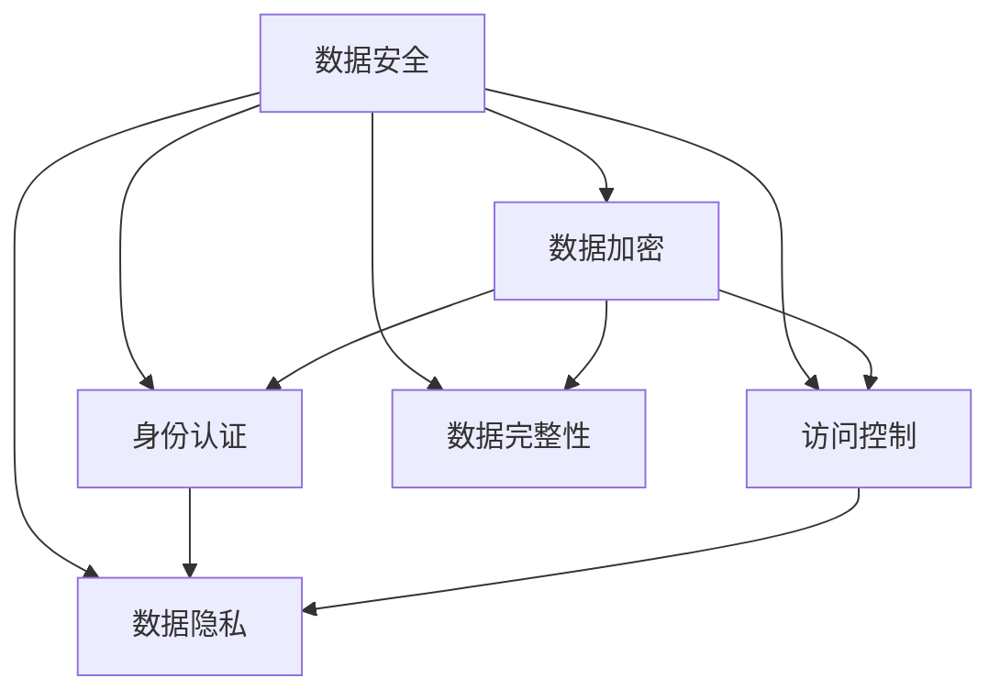

                 

# 平台经济的数据安全保障：如何保障数据安全？

## 1. 背景介绍

在数字化转型过程中，数据作为核心的战略资源，对企业的发展至关重要。平台经济作为一种基于数据驱动的商业模式，数据安全成为其健康发展的关键。随着数据量的激增和应用场景的拓展，数据安全问题也日益严峻。如何确保数据在采集、存储、传输、使用等环节的安全，成为平台企业和技术提供商共同面临的挑战。

### 1.1 问题由来

数据安全问题的严重性在过去几年中被频繁报道。无论是政府机构、金融企业、科技巨头，还是普通用户，都经历了数据泄露、诈骗、身份盗用等问题的困扰。平台经济因其数据集中的特点，更容易成为攻击目标。数据安全不仅关系到企业的信誉和利益，更涉及用户的隐私和信任。

### 1.2 问题核心关键点

平台经济的数据安全问题主要集中在以下几个方面：
1. **数据泄露**：数据在传输和存储过程中被未授权访问，导致敏感信息外泄。
2. **数据篡改**：数据在传输和存储过程中被篡改，影响系统的正确性和安全性。
3. **身份盗用**：用户身份信息被非法获取，用于不正当目的，如钓鱼、欺诈等。
4. **数据滥用**：数据被滥用或不当使用，侵害用户隐私，损害平台信誉。

## 2. 核心概念与联系

### 2.1 核心概念概述

为更好地理解平台经济的数据安全保障，本节将介绍几个密切相关的核心概念：

- **数据安全（Data Security）**：保护数据免受泄露、篡改、盗用和滥用等威胁的措施和策略。
- **数据加密（Data Encryption）**：通过算法将数据转换为难以破解的形式，以保障数据在传输和存储过程中的安全。
- **身份认证（Identity Authentication）**：验证用户身份的过程，确保只有授权用户能够访问系统资源。
- **访问控制（Access Control）**：限制对数据的访问，确保只有授权用户能够读取、修改或删除数据。
- **数据完整性（Data Integrity）**：确保数据在存储和传输过程中不受破坏或篡改。
- **数据隐私（Data Privacy）**：保护用户隐私，防止未经授权的个人信息收集、使用或共享。

这些核心概念之间的逻辑关系可以通过以下Mermaid流程图来展示：



这个流程图展示了大数据安全的关键环节及其之间的联系：

1. 数据安全贯穿于数据的全生命周期。
2. 数据加密是保障数据安全的核心技术之一，用于防止数据在传输和存储过程中被窃取或篡改。
3. 身份认证是确保数据访问安全的基础，防止未经授权的访问。
4. 访问控制通过权限管理，进一步限制对数据的访问，确保数据安全。
5. 数据完整性保证数据的真实性和完整性，防止数据被篡改。
6. 数据隐私保护用户个人信息，防止数据滥用和泄露。

## 3. 核心算法原理 & 具体操作步骤
### 3.1 算法原理概述

平台经济的数据安全保障通常包括以下几个关键步骤：

1. **数据收集**：通过网络爬虫、API接口等方式，从不同来源收集数据。
2. **数据存储**：将收集到的数据存储在数据库或云存储中。
3. **数据传输**：通过网络传输数据，确保数据在传输过程中的安全。
4. **身份认证**：对访问数据的用户进行身份验证，确保只有授权用户能够访问。
5. **访问控制**：根据用户角色和权限，限制对数据的访问，确保数据安全。
6. **数据加密**：对存储和传输的数据进行加密，防止数据泄露和篡改。
7. **数据完整性保护**：采用校验和、数字签名等技术，确保数据在存储和传输过程中的完整性。
8. **数据隐私保护**：对用户个人信息进行匿名化、去标识化处理，防止数据滥用和泄露。

### 3.2 算法步骤详解

#### 数据收集
平台数据收集通常通过网络爬虫和API接口等方式实现。对于爬虫，需要设置爬虫规则，避免非法抓取数据；对于API接口，需要对接口进行权限控制，防止未经授权的访问。

#### 数据存储
数据存储通常采用分布式数据库和云存储服务，如Hadoop、Spark、AWS S3等。需要采用数据分区、分片、冗余备份等技术，确保数据的可用性和持久性。

#### 数据传输
数据传输过程中，采用HTTPS、VPN等安全传输协议，对数据进行加密和认证，防止数据在传输过程中被窃取或篡改。

#### 身份认证
常用的身份认证方式包括用户名密码、OAuth、SSO等。采用多因素认证（MFA）和双因素认证（2FA），增强身份认证的安全性。

#### 访问控制
访问控制通常采用基于角色的访问控制（RBAC）和属性基访问控制（ABAC）等技术，根据用户角色和属性，动态调整对数据的访问权限。

#### 数据加密
数据加密分为静态加密和传输加密两种。静态加密通常采用AES、RSA等算法，对存储的数据进行加密；传输加密通常采用SSL/TLS协议，对传输的数据进行加密。

#### 数据完整性保护
数据完整性保护通常采用校验和、数字签名等技术，确保数据在存储和传输过程中的完整性。

#### 数据隐私保护
数据隐私保护通常采用匿名化、去标识化、加密等技术，对用户个人信息进行处理，防止数据滥用和泄露。

### 3.3 算法优缺点

平台经济的数据安全保障方法具有以下优点：
1. **综合性强**：涵盖数据收集、存储、传输、访问控制等多个环节，形成系统的数据安全保障体系。
2. **灵活性高**：可以根据不同业务场景和数据类型，灵活配置数据安全策略。
3. **自动化程度高**：采用自动化工具和算法，减少人工干预，提升数据安全保障的效率。

同时，该方法也存在一定的局限性：
1. **成本高**：数据安全保障涉及多个环节和多种技术，需要大量资源投入。
2. **技术复杂**：数据安全保障涉及复杂的技术实现，需要专业的技术和人才支持。
3. **动态性强**：数据安全保障需要根据业务变化和威胁演变，动态调整策略，增加实施难度。

尽管存在这些局限性，但就目前而言，这种综合性的数据安全保障方法是平台经济中最主流和最有效的方法。未来相关研究的重点在于如何进一步降低实施成本，提高自动化程度，同时兼顾技术复杂性和动态性等因素。

### 3.4 算法应用领域

平台经济的数据安全保障方法在以下领域得到了广泛应用：

- **电子商务**：保护用户购物信息、交易记录、支付信息等敏感数据，防止数据泄露和欺诈。
- **金融服务**：保护用户银行账户、交易记录、信用信息等敏感数据，防止数据泄露和金融诈骗。
- **健康医疗**：保护患者病历、健康记录、医疗影像等敏感数据，防止数据泄露和隐私侵害。
- **社交媒体**：保护用户个人资料、聊天记录、位置信息等敏感数据，防止数据泄露和隐私侵害。
- **物联网**：保护设备数据、用户行为数据等敏感数据，防止数据泄露和恶意攻击。

## 4. 数学模型和公式 & 详细讲解  
### 4.1 数学模型构建

假设平台数据安全保障体系由四个环节组成：数据收集、数据存储、数据传输和数据使用。每个环节的安全风险可以用风险矩阵（Risk Matrix）来表示，风险矩阵中的横轴表示风险发生概率，纵轴表示风险影响程度。

记平台数据安全保障体系的安全风险为 $R$，则有：

$$
R = f(C,S,T,U)
$$

其中 $C$ 为数据收集环节的风险，$S$ 为数据存储环节的风险，$T$ 为数据传输环节的风险，$U$ 为数据使用环节的风险。

### 4.2 公式推导过程

根据风险矩阵的定义，数据收集环节的风险可以表示为：

$$
C = p \times i
$$

其中 $p$ 为数据收集环节的风险发生概率，$i$ 为数据收集环节的风险影响程度。

数据存储环节的风险可以表示为：

$$
S = p \times i
$$

其中 $p$ 为数据存储环节的风险发生概率，$i$ 为数据存储环节的风险影响程度。

数据传输环节的风险可以表示为：

$$
T = p \times i
$$

其中 $p$ 为数据传输环节的风险发生概率，$i$ 为数据传输环节的风险影响程度。

数据使用环节的风险可以表示为：

$$
U = p \times i
$$

其中 $p$ 为数据使用环节的风险发生概率，$i$ 为数据使用环节的风险影响程度。

根据上述公式，可以计算出平台数据安全保障体系的整体风险 $R$。

### 4.3 案例分析与讲解

以金融服务为例，分析平台数据安全保障体系的构建。

1. **数据收集**：金融服务平台通过API接口收集用户交易记录、账户信息等数据。需要设置严格的访问控制，确保只有授权用户能够访问。

2. **数据存储**：将收集到的数据存储在分布式数据库中，采用数据分区、分片、冗余备份等技术，确保数据的可用性和持久性。

3. **数据传输**：采用HTTPS、VPN等安全传输协议，对数据进行加密和认证，防止数据在传输过程中被窃取或篡改。

4. **身份认证**：对访问数据的用户进行多因素认证（MFA）和双因素认证（2FA），增强身份认证的安全性。

5. **访问控制**：根据用户角色和权限，动态调整对数据的访问权限，确保数据安全。

6. **数据加密**：对存储和传输的数据进行加密，防止数据泄露和篡改。

7. **数据完整性保护**：采用校验和、数字签名等技术，确保数据在存储和传输过程中的完整性。

8. **数据隐私保护**：对用户个人信息进行匿名化、去标识化处理，防止数据滥用和泄露。

通过以上措施，可以构建一个全面的数据安全保障体系，确保金融服务平台的数据安全。

## 5. 项目实践：代码实例和详细解释说明
### 5.1 开发环境搭建

在进行数据安全保障实践前，我们需要准备好开发环境。以下是使用Python进行开发的环境配置流程：

1. 安装Anaconda：从官网下载并安装Anaconda，用于创建独立的Python环境。

2. 创建并激活虚拟环境：
```bash
conda create -n data-security python=3.8 
conda activate data-security
```

3. 安装Python基本库：
```bash
pip install numpy pandas scikit-learn
```

4. 安装第三方库：
```bash
pip install beautifulsoup4 requests
```

5. 安装加密库：
```bash
pip install pycrypto
```

完成上述步骤后，即可在`data-security`环境中开始开发。

### 5.2 源代码详细实现

以下是使用Python实现数据加密和身份认证的代码实例：

```python
from Crypto.Cipher import AES
from Crypto.Hash import SHA256
from Crypto.Random import get_random_bytes
from requests import post
import base64

# 加密函数
def encrypt_data(data, key):
    iv = get_random_bytes(16)
    cipher = AES.new(key, AES.MODE_CBC, iv)
    encrypted_data = cipher.encrypt(pad(data.encode(), AES.block_size))
    return iv + encrypted_data

# 解密函数
def decrypt_data(encrypted_data, key):
    iv = encrypted_data[:16]
    cipher = AES.new(key, AES.MODE_CBC, iv)
    decrypted_data = cipher.decrypt(encrypted_data[16:])
    return unpad(decrypted_data, AES.block_size).decode()

# 填充函数
def pad(data, block_size):
    return data + (block_size - len(data) % block_size) * chr(block_size - len(data) % block_size)

# 去除填充函数
def unpad(data, block_size):
    return data[: -ord(data[-1])]

# 身份认证函数
def authenticate_user(username, password, public_key):
    # 生成摘要
    digest = SHA256.new((username + password).encode()).digest()
    # 签名
    signature = rsa.sign(digest, private_key, 'SHA-256')
    # 验证签名
    try:
        rsa.verify(digest, signature, public_key)
        return True
    except:
        return False

# 调用示例
data = 'Hello, world!'
key = get_random_bytes(32)
encrypted_data = encrypt_data(data, key)
decrypted_data = decrypt_data(encrypted_data, key)
print(f'原始数据: {data}')
print(f'加密数据: {base64.b64encode(encrypted_data).decode()}')
print(f'解密数据: {decrypted_data}')
```

### 5.3 代码解读与分析

让我们再详细解读一下关键代码的实现细节：

**加密函数**：
- 使用AES算法进行加密，生成随机的初始化向量（IV），使用CBC模式进行加密。
- 填充数据，使其满足AES块的长度要求。
- 返回加密后的数据和IV。

**解密函数**：
- 从解密后的数据中提取出IV和加密数据。
- 使用CBC模式进行解密。
- 去除填充，得到原始数据。

**身份认证函数**：
- 使用SHA-256生成摘要。
- 使用私钥生成签名。
- 使用公钥验证签名。
- 如果验证通过，返回True；否则返回False。

**调用示例**：
- 生成随机密钥。
- 加密数据。
- 解密数据。
- 打印加密和解密结果。

可以看到，使用Python进行数据加密和身份认证的代码实现相对简洁。开发者可以将更多精力放在数据安全保障的策略设计、技术选型和系统集成上，而不必过多关注底层的实现细节。

当然，工业级的系统实现还需考虑更多因素，如系统扩展性、性能优化、安全性等。但核心的加密和认证原理基本与此类似。

## 6. 实际应用场景
### 6.1 智能客服系统

智能客服系统需要收集用户的对话记录，这些数据包含大量敏感信息，如身份证号码、银行卡号等。数据安全保障成为系统设计的重要组成部分。

在技术实现上，可以采用SSL/TLS协议加密数据传输，使用AES算法加密存储数据。对用户的访问进行严格的身份认证，使用多因素认证（MFA）和双因素认证（2FA）增强安全性和可靠性。

### 6.2 金融舆情监测

金融舆情监测系统需要收集和分析大量的金融数据，这些数据涉及用户的账户信息、交易记录等敏感信息。数据安全保障是系统的核心功能之一。

在技术实现上，可以采用数据分区、分片、冗余备份等技术，确保数据的可用性和持久性。使用HTTPS协议加密数据传输，使用AES算法加密存储数据。对用户的访问进行严格的权限控制，确保数据的安全性。

### 6.3 个性化推荐系统

个性化推荐系统需要收集用户的浏览、点击、购买等行为数据，这些数据涉及用户的个人信息和偏好。数据安全保障是系统设计的重要组成部分。

在技术实现上，可以采用数据加密和访问控制等技术，确保数据的安全性和隐私性。对用户的访问进行严格的权限控制，确保数据的安全性。

### 6.4 未来应用展望

随着数据安全保障技术的不断演进，未来的数据安全保障方法将呈现出以下趋势：

1. **自动化程度提升**：未来的数据安全保障系统将更多采用自动化工具和算法，减少人工干预，提升数据安全保障的效率。
2. **安全性增强**：未来的数据安全保障系统将采用更加复杂和先进的加密算法，增强数据传输和存储的安全性。
3. **动态性增强**：未来的数据安全保障系统将根据业务变化和威胁演变，动态调整策略，确保数据的安全性。
4. **隐私保护增强**：未来的数据安全保障系统将更多采用隐私保护技术，如匿名化、去标识化、差分隐私等，增强用户隐私保护。
5. **跨平台互通**：未来的数据安全保障系统将更多采用标准化的安全协议和接口，实现跨平台互通，提升数据安全保障的灵活性和可靠性。

## 7. 工具和资源推荐
### 7.1 学习资源推荐

为了帮助开发者系统掌握数据安全保障的理论基础和实践技巧，这里推荐一些优质的学习资源：

1. 《网络安全基础》系列博文：介绍网络安全的基本概念、技术原理和应用场景，适合初学者入门。
2. 《加密算法与协议》书籍：详细讲解各种加密算法和协议的原理和实现方法，适合深入学习。
3. 《身份认证与授权》书籍：介绍身份认证和授权的技术原理和实践方法，适合了解实际应用。
4. 《数据隐私保护》书籍：介绍数据隐私保护的技术原理和实践方法，适合了解隐私保护的最佳实践。
5. 《安全编程实践》书籍：介绍安全编程的最佳实践和常见漏洞防范方法，适合提高编程技能。
6. 在线课程：如Coursera上的《网络安全与加密》课程，提供系统的学习资源和互动学习体验。

通过对这些资源的学习实践，相信你一定能够快速掌握数据安全保障的精髓，并用于解决实际的安全问题。
###  7.2 开发工具推荐

高效的数据安全保障离不开优秀的工具支持。以下是几款用于数据安全保障开发的常用工具：

1. OpenSSL：开源的SSL/TLS协议库，用于数据传输加密和身份认证。
2. PyCrypto：Python加密库，提供多种加密算法的实现，支持数据加密和解密。
3. Flask-Security：基于Flask框架的安全中间件，提供身份认证和授权的功能。
4. Django Guardian：基于Django框架的权限管理工具，提供细粒度的权限控制功能。
5. AWS KMS：亚马逊云密钥管理服务，提供加密密钥的生成、管理、使用等功能。
6. Google Cloud KMS：谷歌云密钥管理服务，提供加密密钥的生成、管理、使用等功能。

合理利用这些工具，可以显著提升数据安全保障的开发效率，加快创新迭代的步伐。

### 7.3 相关论文推荐

数据安全保障技术的发展源于学界的持续研究。以下是几篇奠基性的相关论文，推荐阅读：

1. 《数据加密标准》（DES）：介绍了DES算法的原理和实现方法，是数据加密领域的经典算法。
2. 《公钥基础设施》（PKI）：介绍了PKI的基本概念和实现方法，是身份认证和数字证书的核心技术。
3. 《差分隐私》：介绍了差分隐私的基本概念和实现方法，是数据隐私保护的重要技术。
4. 《安全多方计算》：介绍了安全多方计算的基本概念和实现方法，是数据安全共享的核心技术。
5. 《区块链技术与安全》：介绍了区块链技术的原理和应用场景，是数据安全和隐私保护的重要技术。

这些论文代表了大数据安全保障技术的发展脉络。通过学习这些前沿成果，可以帮助研究者把握学科前进方向，激发更多的创新灵感。

## 8. 总结：未来发展趋势与挑战

### 8.1 总结

本文对平台经济的数据安全保障方法进行了全面系统的介绍。首先阐述了数据安全问题的严重性，明确了数据安全保障在平台经济中的重要性。其次，从原理到实践，详细讲解了数据安全保障的数学模型和核心算法，给出了数据安全保障任务开发的完整代码实例。同时，本文还广泛探讨了数据安全保障方法在智能客服、金融舆情、个性化推荐等多个行业领域的应用前景，展示了数据安全保障范式的巨大潜力。此外，本文精选了数据安全保障技术的各类学习资源，力求为读者提供全方位的技术指引。

通过本文的系统梳理，可以看到，数据安全保障技术正在成为平台经济的重要范式，极大地拓展了数据在平台经济中的应用边界，提升了平台企业和用户的信任和安全性。未来，伴随数据安全保障技术的持续演进，数据安全保障将逐渐成为平台经济的标配，为构建健康、安全、可信的数字化生态提供坚实保障。

### 8.2 未来发展趋势

展望未来，数据安全保障技术将呈现以下几个发展趋势：

1. **技术创新加速**：未来的数据安全保障技术将更多采用自动化工具和算法，减少人工干预，提升数据安全保障的效率。
2. **安全性增强**：未来的数据安全保障技术将采用更加复杂和先进的加密算法，增强数据传输和存储的安全性。
3. **动态性增强**：未来的数据安全保障系统将根据业务变化和威胁演变，动态调整策略，确保数据的安全性。
4. **隐私保护增强**：未来的数据安全保障系统将更多采用隐私保护技术，如匿名化、去标识化、差分隐私等，增强用户隐私保护。
5. **跨平台互通**：未来的数据安全保障系统将更多采用标准化的安全协议和接口，实现跨平台互通，提升数据安全保障的灵活性和可靠性。

### 8.3 面临的挑战

尽管数据安全保障技术已经取得了瞩目成就，但在迈向更加智能化、普适化应用的过程中，它仍面临着诸多挑战：

1. **成本高昂**：数据安全保障涉及多个环节和多种技术，需要大量资源投入。
2. **技术复杂**：数据安全保障涉及复杂的技术实现，需要专业的技术和人才支持。
3. **动态性强**：数据安全保障需要根据业务变化和威胁演变，动态调整策略，增加实施难度。

尽管存在这些挑战，但就目前而言，这种综合性的数据安全保障方法是平台经济中最主流和最有效的方法。未来相关研究的重点在于如何进一步降低实施成本，提高自动化程度，同时兼顾技术复杂性和动态性等因素。

### 8.4 研究展望

面对数据安全保障面临的种种挑战，未来的研究需要在以下几个方面寻求新的突破：

1. **探索无监督和半监督安全方法**：摆脱对大规模标注数据的依赖，利用自监督学习、主动学习等无监督和半监督范式，最大限度利用非结构化数据，实现更加灵活高效的安全保障。
2. **研究参数高效和安全算法**：开发更加参数高效的加密算法，在固定大部分预训练参数的同时，只更新极少量的任务相关参数。同时优化加密算法的计算图，减少前向传播和反向传播的资源消耗，实现更加轻量级、实时性的部署。
3. **融合因果和对比学习范式**：通过引入因果推断和对比学习思想，增强安全系统建立稳定因果关系的能力，学习更加普适、鲁棒的安全表示，从而提升安全系统的泛化性和抗干扰能力。
4. **引入更多先验知识**：将符号化的先验知识，如知识图谱、逻辑规则等，与安全网络模型进行巧妙融合，引导安全过程学习更准确、合理的安全模型。同时加强不同模态数据的整合，实现视觉、语音等多模态信息与文本信息的协同建模。
5. **结合因果分析和博弈论工具**：将因果分析方法引入安全系统，识别出系统决策的关键特征，增强输出解释的因果性和逻辑性。借助博弈论工具刻画人机交互过程，主动探索并规避系统的脆弱点，提高系统稳定性。
6. **纳入伦理道德约束**：在安全系统训练目标中引入伦理导向的评估指标，过滤和惩罚有偏见、有害的输出倾向。同时加强人工干预和审核，建立系统行为的监管机制，确保输出符合人类价值观和伦理道德。

这些研究方向的探索，必将引领数据安全保障技术迈向更高的台阶，为构建安全、可靠、可解释、可控的智能系统铺平道路。面向未来，数据安全保障技术还需要与其他人工智能技术进行更深入的融合，如知识表示、因果推理、强化学习等，多路径协同发力，共同推动安全技术的发展和进步。只有勇于创新、敢于突破，才能不断拓展安全技术的边界，让智能技术更好地造福人类社会。

## 9. 附录：常见问题与解答

**Q1：数据安全保障技术是否适用于所有平台经济？**

A: 数据安全保障技术在大多数平台经济中都有广泛的应用前景。但不同的平台经济类型，数据安全保障的具体需求和实现方式可能存在差异。例如，金融平台需要重点关注支付安全、交易安全等；社交平台需要重点关注用户隐私保护、舆情监控等。因此，在具体应用时，需要根据平台经济的特点，设计适合的安全策略和方案。

**Q2：数据安全保障技术如何平衡安全性和用户体验？**

A: 数据安全保障技术在提升安全性的同时，可能对用户体验产生一定的影响。例如，多因素认证（MFA）和双因素认证（2FA）会增加用户的操作负担。因此，需要在安全性和用户体验之间进行平衡。可以考虑采用自动化认证、智能认证等技术，减少用户的操作负担。

**Q3：数据安全保障技术在平台经济中的成本如何控制？**

A: 数据安全保障技术需要投入大量的人力、物力和财力，成本较高。可以通过以下方式控制成本：
1. 采用自动化工具和算法，减少人工干预，提升数据安全保障的效率。
2. 采用云计算服务，如AWS、Azure等，降低硬件投入成本。
3. 采用标准化的安全协议和接口，实现跨平台互通，提升资源利用率。

**Q4：数据安全保障技术在平台经济中的应用前景如何？**

A: 数据安全保障技术在平台经济中的应用前景广阔。随着平台经济的快速发展和数字化转型的加速，数据安全保障将逐渐成为平台经济的重要组成部分。未来的平台经济将更加依赖数据驱动，数据安全保障将成为其健康发展的关键保障。

通过本文的系统梳理，可以看到，数据安全保障技术正在成为平台经济的重要范式，极大地拓展了数据在平台经济中的应用边界，提升了平台企业和用户的信任和安全性。未来，伴随数据安全保障技术的持续演进，数据安全保障将逐渐成为平台经济的标配，为构建健康、安全、可信的数字化生态提供坚实保障。

