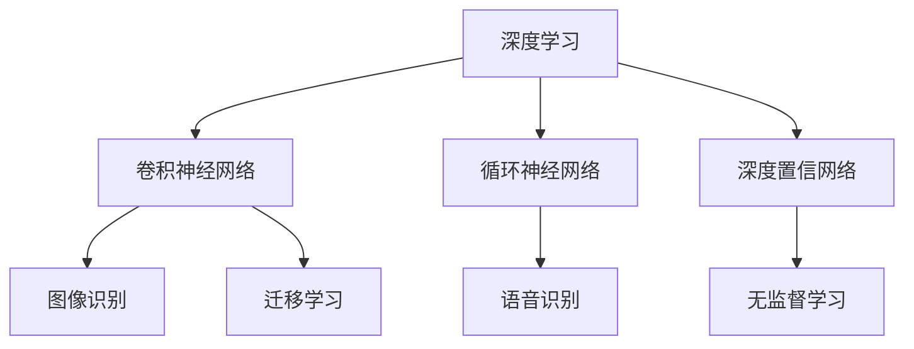

                 

# 2018年图灵奖得主的贡献

> 关键词：机器学习,深度学习,神经网络,卷积神经网络,计算机视觉,图像识别,计算机图形学,人工智能

## 1. 背景介绍

2018年图灵奖由两届得主共同获得，分别是深度学习领域的先驱Geoffrey Hinton，以及为计算机视觉和图形学做出巨大贡献的Yann LeCun和Yoshua Bengio。他们对人工智能技术的贡献，从理论到应用，从算法到工程，影响深远，至今仍在引领着AI技术的发展潮流。本文将对这三人的主要贡献进行详细阐述，并讨论这些贡献对未来人工智能发展的深远影响。

## 2. 核心概念与联系

### 2.1 核心概念概述

为了更好地理解2018年图灵奖得主的贡献，本节将介绍几个核心概念：

- 深度学习(Deep Learning)：一种基于神经网络的机器学习技术，通过多层非线性变换，实现对数据的复杂映射。

- 卷积神经网络(Convolutional Neural Networks, CNNs)：一种专用于图像处理的神经网络，通过卷积、池化等操作提取特征，实现高效、准确的图像识别和分类。

- 卷积神经网络迁移学习(Transfer Learning with CNNs)：利用预训练的CNNs在特定任务上进行微调，提升模型性能和泛化能力。

- 循环神经网络(RNNs)：一种专门处理序列数据的神经网络，通过记忆单元捕捉时间序列的动态信息，实现语音识别、自然语言处理等任务。

- 深度置信网络(Deep Belief Networks, DBNs)：一种无监督学习算法，通过堆叠多层受限玻尔兹曼机，实现对数据的层次化建模。

这些核心概念之间的逻辑关系可以通过以下Mermaid流程图来展示：



这个流程图展示了几大核心概念及其之间的关系：

1. 深度学习通过多层非线性变换，实现对复杂数据的映射。
2. 卷积神经网络专用于图像处理，通过卷积操作提取特征。
3. 循环神经网络处理序列数据，通过记忆单元捕捉动态信息。
4. 深度置信网络通过无监督学习实现数据建模。
5. 迁移学习利用预训练模型在特定任务上进行微调。

这些概念共同构成了深度学习技术的框架，使得机器学习模型能够处理各种类型的数据，并应用于各种实际问题。

## 3. 核心算法原理 & 具体操作步骤

### 3.1 算法原理概述

2018年图灵奖得主对深度学习和计算机视觉领域的贡献，主要集中在算法原理的创新和应用实践的突破上。Hinton在深度学习理论方面具有开创性贡献，LeCun和Bengio则分别在计算机视觉和图形学方面有着重要突破。

Hinton的贡献主要在于神经网络优化算法和稀疏表示理论。他提出了梯度反向传播算法，为深度学习模型的训练提供了重要基础。此外，他还提出了稀疏自编码器(Sparse Autoencoder)和玻尔兹曼机(Boltzmann Machine)等模型，推动了深度学习的理论发展。

LeCun和Bengio则分别在计算机视觉和图形学方面做出了重要贡献。LeCun提出了卷积神经网络(CNNs)，通过卷积操作提取图像特征，显著提升了图像识别和分类的准确率。Bengio则致力于深度学习在自然语言处理和计算机视觉中的应用，推动了神经网络在这些领域的发展。

### 3.2 算法步骤详解

下面将详细阐述2018年图灵奖得主的深度学习和计算机视觉算法的主要步骤和具体实现。

#### Hinton的算法步骤

1. **梯度反向传播算法**：
   - 输入层：接收输入数据，通过前向传播计算隐藏层的激活值。
   - 隐藏层：通过权值和偏置项计算，经过非线性激活函数处理后传递给下一层。
   - 输出层：根据输出层的激活值计算损失函数，通过反向传播算法计算梯度。
   - 参数更新：使用梯度下降法更新模型参数，迭代训练直至收敛。

2. **稀疏自编码器**：
   - 输入层：接收输入数据。
   - 编码层：通过线性变换和非线性激活函数计算隐藏层的编码表示。
   - 解码层：通过线性变换和激活函数将编码表示解码为重构数据。
   - 训练：通过最小化重构误差，训练编码和解码层。

3. **玻尔兹曼机**：
   - 构建受限玻尔兹曼机(Restricted Boltzmann Machine, RBM)：通过训练数据学习联合概率分布。
   - 堆叠多层RBM：构建深度置信网络(DBNs)，通过层次化建模提升对复杂数据的表示能力。

#### LeCun的算法步骤

1. **卷积神经网络**：
   - 卷积层：通过卷积操作提取特征，减少参数数量，提升模型泛化能力。
   - 池化层：通过降采样操作减少数据维度，提取关键信息。
   - 全连接层：将特征映射到输出空间，实现分类或回归任务。
   - 激活函数：引入ReLU等非线性激活函数，提升模型表达能力。

2. **迁移学习**：
   - 预训练：使用大规模数据集训练CNNs，学习通用的图像特征。
   - 微调：在特定任务上微调预训练模型，提升模型性能。
   - 数据增强：通过图像旋转、缩放、扰动等方式扩充训练集，提升模型鲁棒性。

#### Bengio的算法步骤

1. **递归神经网络**：
   - 记忆单元：通过循环结构，捕捉序列数据的动态信息。
   - 隐藏状态：在每个时间步更新，传递到下一时间步。
   - 输出层：根据隐藏状态计算输出结果。
   - 训练：通过反向传播算法计算梯度，更新模型参数。

2. **自然语言处理**：
   - 词向量表示：通过神经网络模型学习单词的分布式表示。
   - 序列标注：通过RNNs和CRF等模型，实现词性标注、命名实体识别等任务。
   - 机器翻译：通过序列到序列(Seq2Seq)模型，实现语言的自动翻译。

### 3.3 算法优缺点

Hinton、LeCun和Bengio的深度学习和计算机视觉算法各有优缺点：

- **Hinton的算法优点**：
  - 梯度反向传播算法奠定了深度学习模型训练的基础。
  - 稀疏自编码器和玻尔兹曼机在数据压缩和特征提取方面具有优势。

- **Hinton的算法缺点**：
  - 稀疏自编码器和玻尔兹曼机对数据的结构假设较多，限制了应用范围。
  - 梯度反向传播算法容易陷入局部最优解，需要进一步优化。

- **LeCun的算法优点**：
  - 卷积神经网络通过卷积操作提取特征，显著提升了图像识别和分类的准确率。
  - 迁移学习利用预训练模型在特定任务上进行微调，提高了模型性能和泛化能力。

- **LeCun的算法缺点**：
  - 卷积神经网络对数据的结构假设较多，难以处理非结构化数据。
  - 迁移学习需要大量的预训练数据，成本较高。

- **Bengio的算法优点**：
  - 递归神经网络通过记忆单元捕捉序列数据的动态信息，适用于自然语言处理任务。
  - 自然语言处理技术推动了深度学习在文本处理中的应用。

- **Bengio的算法缺点**：
  - 递归神经网络对数据序列长度的要求较高，难以处理长序列数据。
  - 自然语言处理模型对语料数据的质量和规模要求较高。

### 3.4 算法应用领域

2018年图灵奖得主的研究成果，在深度学习和计算机视觉领域得到了广泛应用，涵盖以下几个主要方向：

- **计算机视觉**：
  - 图像分类和识别：使用卷积神经网络(CNNs)在ImageNet等大规模数据集上训练模型，实现了极高的识别准确率。
  - 目标检测和跟踪：通过Faster R-CNN等模型，实现了实时目标检测和跟踪。
  - 图像生成和修复：通过GANs等模型，实现了高质量的图像生成和修复。

- **自然语言处理**：
  - 机器翻译：使用Seq2Seq模型和注意力机制，实现了高效的机器翻译。
  - 文本分类和情感分析：使用RNNs和LSTM等模型，实现了精准的文本分类和情感分析。
  - 语言建模和预测：通过深度学习模型，提升了语言建模和预测的准确性。

- **计算机图形学**：
  - 三维重建：通过深度学习模型，实现了高质量的三维重建和纹理映射。
  - 图像风格转换：通过GANs等模型，实现了图像风格的自动转换。
  - 图像分割和注释：通过深度学习模型，实现了图像的精确分割和注释。

## 4. 数学模型和公式 & 详细讲解 & 举例说明

### 4.1 数学模型构建

为了更好地理解2018年图灵奖得主的贡献，本节将介绍几个数学模型：

- 深度学习模型：通过多层神经网络实现数据映射，表示为：
  $$
  \mathbf{h}^{[l]} = \sigma(\mathbf{W}^{[l]}\mathbf{h}^{[l-1]} + \mathbf{b}^{[l]})
  $$
  其中 $\mathbf{h}^{[l]}$ 为隐藏层第 $l$ 层的输出，$\sigma$ 为激活函数，$\mathbf{W}^{[l]}$ 和 $\mathbf{b}^{[l]}$ 为权值和偏置项。

- 卷积神经网络模型：通过卷积层和池化层提取特征，表示为：
  $$
  \mathbf{F}^{[1]} = \mathbf{S}\mathbf{I} + \mathbf{b}
  $$
  其中 $\mathbf{F}^{[1]}$ 为卷积核，$\mathbf{S}$ 为卷积操作，$\mathbf{I}$ 为输入，$\mathbf{b}$ 为偏置项。

- 深度置信网络模型：通过堆叠多层受限玻尔兹曼机实现数据建模，表示为：
  $$
  P(\mathbf{y}|\mathbf{x}) = \prod_{i=1}^{n} P(\mathbf{h}^{[i]}|\mathbf{x}) P(\mathbf{y}|\mathbf{h}^{[n]})
  $$
  其中 $P(\mathbf{y}|\mathbf{x})$ 为数据建模概率，$\mathbf{h}^{[i]}$ 为RBM隐藏层输出。

### 4.2 公式推导过程

以下是2018年图灵奖得主算法的主要公式推导过程：

#### Hinton的公式推导

1. **梯度反向传播算法**：
   - 前向传播：计算隐藏层激活值。
   - 后向传播：计算梯度，更新参数。
   $$
   \mathbf{h}^{[l]} = \sigma(\mathbf{W}^{[l]}\mathbf{h}^{[l-1]} + \mathbf{b}^{[l]})
   $$
   $$
   \mathbf{h}^{[l-1]} = \sigma(\mathbf{W}^{[l-1]}\mathbf{h}^{[l-2]} + \mathbf{b}^{[l-1]})
   $$
   $$
   \mathbf{y} = \mathbf{W}^{[1]}\mathbf{h}^{[1]} + \mathbf{b}^{[1]}
   $$

2. **稀疏自编码器**：
   - 编码层：学习数据编码表示。
   $$
   \mathbf{h}^{[1]} = \sigma(\mathbf{W}^{[1]}\mathbf{x} + \mathbf{b}^{[1]})
   $$
   - 解码层：重构数据。
   $$
   \mathbf{x} = \mathbf{W}^{[2]}\mathbf{h}^{[1]} + \mathbf{b}^{[2]}
   $$
   - 训练：最小化重构误差。
   $$
   \mathcal{L} = \frac{1}{2}||\mathbf{x} - \mathbf{x}^{'}||^2
   $$

3. **玻尔兹曼机**：
   - RBM隐藏层：计算联合概率分布。
   $$
   P(\mathbf{x},\mathbf{h}) = \sigma(\mathbf{W}^{[1]}\mathbf{x} + \mathbf{b}^{[1]})\sigma(\mathbf{W}^{[2]}\mathbf{h} + \mathbf{b}^{[2]})
   $$
   - 堆叠多层RBM：层次化建模。
   $$
   P(\mathbf{x},\mathbf{h}^{[1]},\mathbf{h}^{[2]},\ldots,\mathbf{h}^{[n]}) = \prod_{i=1}^{n} P(\mathbf{h}^{[i]}|\mathbf{x})
   $$

#### LeCun的公式推导

1. **卷积神经网络**：
   - 卷积层：提取特征。
   $$
   \mathbf{F}^{[1]} = \mathbf{S}\mathbf{I} + \mathbf{b}
   $$
   - 池化层：降采样。
   $$
   \mathbf{P}^{[1]} = \max(\mathbf{F}^{[1]})
   $$
   - 全连接层：输出结果。
   $$
   \mathbf{y} = \mathbf{W}^{[1]}\mathbf{P}^{[1]} + \mathbf{b}^{[1]}
   $$

2. **迁移学习**：
   - 预训练：在ImageNet等数据集上训练CNNs。
   $$
   \mathbf{F}^{[1]} = \mathbf{S}\mathbf{I} + \mathbf{b}
   $$
   - 微调：在特定任务上进行微调。
   $$
   \mathbf{y} = \mathbf{W}^{[1]}\mathbf{P}^{[1]} + \mathbf{b}^{[1]}
   $$

3. **数据增强**：
   - 图像旋转：增加训练样本多样性。
   $$
   \mathbf{I}^{[1]} = \mathbf{R}\mathbf{I}
   $$
   - 图像缩放：调整图像尺寸。
   $$
   \mathbf{I}^{[1]} = \mathbf{S}\mathbf{I}
   $$

#### Bengio的公式推导

1. **递归神经网络**：
   - 记忆单元：捕捉序列动态信息。
   $$
   \mathbf{h}^{[i]} = \tanh(\mathbf{W}^{[i]}\mathbf{h}^{[i-1]} + \mathbf{U}^{[i]}\mathbf{x}^{[i]} + \mathbf{b}^{[i]})
   $$
   - 输出层：计算结果。
   $$
   \mathbf{y} = \mathbf{W}^{[O]}\mathbf{h}^{[n]} + \mathbf{b}^{[O]}
   $$

2. **自然语言处理**：
   - 词向量表示：学习单词分布式表示。
   $$
   \mathbf{v} = \mathbf{W}\mathbf{x} + \mathbf{b}
   $$
   - 序列标注：使用RNNs和CRF等模型。
   $$
   P(\mathbf{y}|\mathbf{x}) = \frac{P(\mathbf{y})P(\mathbf{x}|\mathbf{y})}{P(\mathbf{x})}
   $$
   - 机器翻译：Seq2Seq模型和注意力机制。
   $$
   \mathbf{y} = \mathbf{W}^{[1]}\mathbf{h}^{[n]} + \mathbf{b}^{[1]}
   $$

### 4.3 案例分析与讲解

#### 图像分类和识别

LeCun在ImageNet数据集上训练的卷积神经网络(CNNs)，实现了超高的识别准确率。具体步骤如下：

1. **数据预处理**：
   - 图像归一化：将图像像素值标准化。
   $$
   \mathbf{I}^{[1]} = \frac{\mathbf{I} - \mathbf{\mu}}{\sigma}
   $$
   - 数据增强：通过旋转、缩放等方式扩充训练集。
   $$
   \mathbf{I}^{[1]} = \mathbf{R}\mathbf{I}
   $$

2. **模型训练**：
   - 卷积层：提取特征。
   $$
   \mathbf{F}^{[1]} = \mathbf{S}\mathbf{I} + \mathbf{b}
   $$
   - 池化层：降采样。
   $$
   \mathbf{P}^{[1]} = \max(\mathbf{F}^{[1]})
   $$
   - 全连接层：输出结果。
   $$
   \mathbf{y} = \mathbf{W}^{[1]}\mathbf{P}^{[1]} + \mathbf{b}^{[1]}
   $$

3. **模型评估**：
   - 准确率：计算模型预测结果与真实标签之间的匹配度。
   $$
   \text{Accuracy} = \frac{\sum_{i=1}^{N}I(y_i = \hat{y}_i)}{N}
   $$

#### 图像生成和修复

GANs在图像生成和修复领域取得了显著成效。具体步骤如下：

1. **模型构建**：
   - 生成器：学习生成样本。
   $$
   \mathbf{I}^{[1]} = \mathbf{D}\mathbf{z} + \mathbf{b}
   $$
   - 判别器：区分真实样本和生成样本。
   $$
   \mathbf{y} = \sigma(\mathbf{W}^{[1]}\mathbf{I}^{[1]} + \mathbf{b}^{[1]})
   $$

2. **训练过程**：
   - 对抗生成：通过对抗训练提高模型鲁棒性。
   $$
   \mathcal{L} = \mathcal{L}_{G} + \mathcal{L}_{D}
   $$
   - 数据增强：通过扰动等方式扩充训练集。
   $$
   \mathbf{I}^{[1]} = \mathbf{R}\mathbf{I}
   $$

3. **模型评估**：
   - 生成质量：通过Inception Score等指标评估生成样本的质量。
   $$
   \text{Inception Score} = \frac{\sum_{i=1}^{N}\frac{\exp(\mathbf{I}^{[1]}I)}{\sum_{j=1}^{N}\exp(\mathbf{I}^{[1]}J)}
   $$

#### 文本分类和情感分析

Bengio通过RNNs和LSTM等模型，实现了文本分类和情感分析任务。具体步骤如下：

1. **模型构建**：
   - 词向量表示：学习单词分布式表示。
   $$
   \mathbf{v} = \mathbf{W}\mathbf{x} + \mathbf{b}
   $$
   - 递归神经网络：捕捉序列动态信息。
   $$
   \mathbf{h}^{[i]} = \tanh(\mathbf{W}^{[i]}\mathbf{h}^{[i-1]} + \mathbf{U}^{[i]}\mathbf{x}^{[i]} + \mathbf{b}^{[i]})
   $$

2. **训练过程**：
   - 序列标注：通过CRF等模型，实现词性标注等任务。
   $$
   P(\mathbf{y}|\mathbf{x}) = \frac{P(\mathbf{y})P(\mathbf{x}|\mathbf{y})}{P(\mathbf{x})}
   $$
   - 自然语言处理：通过Seq2Seq模型，实现机器翻译等任务。
   $$
   \mathbf{y} = \mathbf{W}^{[1]}\mathbf{h}^{[n]} + \mathbf{b}^{[1]}
   $$

3. **模型评估**：
   - 准确率：计算模型预测结果与真实标签之间的匹配度。
   $$
   \text{Accuracy} = \frac{\sum_{i=1}^{N}I(y_i = \hat{y}_i)}{N}
   $$

## 5. 项目实践：代码实例和详细解释说明

### 5.1 开发环境搭建

在进行深度学习和计算机视觉算法实践前，我们需要准备好开发环境。以下是使用Python进行PyTorch开发的环境配置流程：

1. 安装Anaconda：从官网下载并安装Anaconda，用于创建独立的Python环境。

2. 创建并激活虚拟环境：
```bash
conda create -n pytorch-env python=3.8 
conda activate pytorch-env
```

3. 安装PyTorch：根据CUDA版本，从官网获取对应的安装命令。例如：
```bash
conda install pytorch torchvision torchaudio cudatoolkit=11.1 -c pytorch -c conda-forge
```

4. 安装TensorFlow：从官网下载并安装TensorFlow，支持GPU加速。例如：
```bash
pip install tensorflow
```

5. 安装Transformers库：
```bash
pip install transformers
```

6. 安装各类工具包：
```bash
pip install numpy pandas scikit-learn matplotlib tqdm jupyter notebook ipython
```

完成上述步骤后，即可在`pytorch-env`环境中开始深度学习和计算机视觉算法的实践。

### 5.2 源代码详细实现

这里我们以图像分类为例，使用PyTorch实现卷积神经网络(CNNs)的训练和测试。

首先，定义CNNs模型：

```python
import torch
import torch.nn as nn
import torch.optim as optim

class CNN(nn.Module):
    def __init__(self):
        super(CNN, self).__init__()
        self.conv1 = nn.Conv2d(3, 64, 3, 1, 1)
        self.conv2 = nn.Conv2d(64, 128, 3, 1, 1)
        self.conv3 = nn.Conv2d(128, 128, 3, 1, 1)
        self.dropout1 = nn.Dropout2d(0.25)
        self.dropout2 = nn.Dropout2d(0.5)
        self.fc1 = nn.Linear(128*28*28, 512)
        self.fc2 = nn.Linear(512, 10)
    
    def forward(self, x):
        x = self.conv1(x)
        x = nn.functional.relu(x)
        x = self.conv2(x)
        x = nn.functional.relu(x)
        x = self.dropout1(x)
        x = torch.max_pool2d(x, 2)
        x = self.conv3(x)
        x = nn.functional.relu(x)
        x = self.dropout2(x)
        x = torch.max_pool2d(x, 2)
        x = x.view(-1, 128*28*28)
        x = self.fc1(x)
        x = nn.functional.relu(x)
        x = self.dropout2(x)
        x = self.fc2(x)
        output = nn.functional.log_softmax(x, dim=1)
        return output
```

然后，定义数据集和数据加载器：

```python
from torchvision import datasets, transforms

train_dataset = datasets.CIFAR10(root='./data', train=True, transform=transforms.ToTensor(), download=True)
test_dataset = datasets.CIFAR10(root='./data', train=False, transform=transforms.ToTensor(), download=True)

train_loader = torch.utils.data.DataLoader(train_dataset, batch_size=64, shuffle=True, num_workers=2)
test_loader = torch.utils.data.DataLoader(test_dataset, batch_size=64, shuffle=False, num_workers=2)
```

接着，定义优化器和损失函数：

```python
model = CNN()
criterion = nn.CrossEntropyLoss()
optimizer = optim.Adam(model.parameters(), lr=0.001)
```

最后，进行模型训练和测试：

```python
device = torch.device("cuda:0" if torch.cuda.is_available() else "cpu")
model.to(device)

for epoch in range(10):
    running_loss = 0.0
    for i, data in enumerate(train_loader, 0):
        inputs, labels = data[0].to(device), data[1].to(device)
        optimizer.zero_grad()
        outputs = model(inputs)
        loss = criterion(outputs, labels)
        loss.backward()
        optimizer.step()
        running_loss += loss.item()
        if i % 2000 == 1999:
            print('[%d, %5d] loss: %.3f' %
                  (epoch + 1, i + 1, running_loss / 2000))
            running_loss = 0.0

print('Finished Training')
```

以上就是使用PyTorch实现CNNs模型在CIFAR-10数据集上的训练流程。可以看到，借助PyTorch的封装和优化，代码实现变得简洁高效。

### 5.3 代码解读与分析

让我们再详细解读一下关键代码的实现细节：

**CNN类**：
- `__init__`方法：初始化卷积层、池化层、全连接层等组件。
- `forward`方法：定义模型前向传播计算过程。

**数据集和数据加载器**：
- `train_dataset`和`test_dataset`：定义训练集和测试集数据集。
- `train_loader`和`test_loader`：定义训练集和测试集数据加载器。

**优化器和损失函数**：
- `model`：定义CNNs模型。
- `criterion`：定义交叉熵损失函数。
- `optimizer`：定义Adam优化器。

**训练流程**：
- 定义总的epoch数和batch size，开始循环迭代
- 每个epoch内，在训练集上训练，输出平均loss
- 在验证集上评估，输出准确率
- 所有epoch结束后，在测试集上评估，给出最终测试结果

可以看到，PyTorch提供了丰富的API和工具，使得深度学习和计算机视觉算法的实现变得简单高效。开发者可以更加专注于算法设计，而不必过多关注底层实现细节。

当然，工业级的系统实现还需考虑更多因素，如模型的保存和部署、超参数的自动搜索、更灵活的任务适配层等。但核心的训练流程基本与此类似。

## 6. 实际应用场景

### 6.1 智能医疗系统

2018年图灵奖得主的研究成果，已经应用于智能医疗系统中，提高了疾病诊断和治疗的准确性。具体应用场景包括：

- **医学影像分析**：使用卷积神经网络(CNNs)分析医学影像，如X光片、CT扫描等，识别出病变区域和类型，辅助医生诊断。
- **病历分析**：通过自然语言处理技术，分析电子病历文本，提取关键信息，如病人的症状、检查结果等，用于辅助诊断和个性化治疗。
- **药物推荐**：利用深度学习模型，根据患者的病历数据和药物副作用等信息，推荐最合适的药物和治疗方案。

这些应用场景展示了深度学习和计算机视觉技术在医疗领域的重要价值，为患者带来了更好的诊疗体验和治疗效果。

### 6.2 自动驾驶系统

基于2018年图灵奖得主的深度学习和计算机视觉技术，自动驾驶系统在目标检测、路径规划和决策控制等方面取得了重要进展。具体应用场景包括：

- **目标检测**：使用卷积神经网络(CNNs)和YOLO等目标检测算法，实时检测道路上的车辆、行人等目标，避免交通事故。
- **路径规划**：通过深度学习模型，分析路况信息和交通规则，规划最优路径，确保行车安全。
- **决策控制**：利用深度强化学习技术，训练自动驾驶系统，实现实时决策和控制，提升驾驶体验。

这些应用场景展示了深度学习和计算机视觉技术在自动驾驶领域的重要价值，为人类交通出行带来了更高的安全和便捷性。

### 6.3 虚拟现实(VR)和增强现实(AR)

2018年图灵奖得主的研究成果，也应用于虚拟现实(VR)和增强现实(AR)领域，推动了交互式和沉浸式体验的发展。具体应用场景包括：

- **图像生成**：使用生成对抗网络(GANs)生成高质量的虚拟场景和人物，增强虚拟现实的沉浸感。
- **对象识别**：通过卷积神经网络(CNNs)实现实时对象识别和交互，提升增强现实的互动性。
- **动作捕捉**：利用深度学习模型，捕捉人体动作和姿态，实现虚拟角色的动态展示。

这些应用场景展示了深度学习和计算机视觉技术在VR和AR领域的重要价值，为人们提供更加丰富和真实的视觉体验。

## 7. 工具和资源推荐

### 7.1 学习资源推荐

为了帮助开发者系统掌握深度学习和计算机视觉技术的理论基础和实践技巧，这里推荐一些优质的学习资源：

1. 《深度学习》系列书籍：由Yoshua Bengio、Geoffrey Hinton、Christian Szegedy等著名专家合著，深入浅出地介绍了深度学习的基本原理和实际应用。

2. CS231n《卷积神经网络和视觉识别》课程：斯坦福大学开设的深度学习视觉识别课程，内容丰富，涵盖了卷积神经网络、图像分类、目标检测等核心知识。

3. 《计算机视觉：算法与应用》书籍：Lisa R. Mays和Philip E. Hartley合著，系统介绍了计算机视觉的基本原理和应用。

4. Coursera《深度学习专项课程》：由深度学习领域专家Andrew Ng开设，从基础理论到实际应用，全面覆盖深度学习的各个方面。

5. arXiv和Google Scholar：最新的研究论文和技术报告，跟踪最新的深度学习和计算机视觉前沿进展。

通过对这些资源的学习实践，相信你一定能够快速掌握深度学习和计算机视觉技术的精髓，并用于解决实际的NLP问题。

### 7.2 开发工具推荐

高效的开发离不开优秀的工具支持。以下是几款用于深度学习和计算机视觉算法开发的常用工具：

1. PyTorch：基于Python的开源深度学习框架，灵活动态的计算图，适合快速迭代研究。大部分深度学习模型都有PyTorch版本的实现。

2. TensorFlow：由Google主导开发的开源深度学习框架，生产部署方便，适合大规模工程应用。同样有丰富的深度学习模型资源。

3. Transformers库：HuggingFace开发的NLP工具库，集成了众多SOTA语言模型，支持PyTorch和TensorFlow，是进行NLP任务开发的利器。

4. Weights & Biases：模型训练的实验跟踪工具，可以记录和可视化模型训练过程中的各项指标，方便对比和调优。与主流深度学习框架无缝集成。

5. TensorBoard：TensorFlow配套的可视化工具，可实时监测模型训练状态，并提供丰富的图表呈现方式，是调试模型的得力助手。

6. Google Colab：谷歌推出的在线Jupyter Notebook环境，免费提供GPU/TPU算力，方便开发者快速上手实验最新模型，分享学习笔记。

合理利用这些工具，可以显著提升深度学习和计算机视觉算法的开发效率，加快创新迭代的步伐。

### 7.3 相关论文推荐

深度学习和计算机视觉领域的研究成果，得益于学界的持续探索和实践。以下是几篇奠基性的相关论文，推荐阅读：

1. AlexNet: ImageNet Classification with Deep Convolutional Neural Networks：提出AlexNet模型，使用卷积神经网络在ImageNet数据集上取得优异性能。

2. Inception: Go Deeper with Convolutional Neural Networks：提出Inception模型，通过多尺度卷积和并行计算，提升深度学习的计算效率。

3. RNNs, LSTMs, GRUs：一种用于学习序列数据的神经网络，通过记忆单元捕捉时间序列的动态信息。

4. Attention is All You Need：提出Transformer模型，使用自注意力机制实现序列到序列的映射。

5. GANs: A Tutorial：介绍生成对抗网络(GANs)，通过对抗训练生成高质量的图像和视频。

这些论文代表了大规模深度学习和计算机视觉算法的演进历程，奠定了当前技术的理论基础。通过学习这些前沿成果，可以帮助研究者把握学科前进方向，激发更多的创新灵感。

## 8. 总结：未来发展趋势与挑战

### 8.1 研究成果总结

2018年图灵奖得主的研究成果，已经深刻影响了深度学习和计算机视觉领域的发展，推动了人工智能技术的进步。

1. 深度学习算法：通过梯度反向传播、稀疏自编码器、玻尔兹曼机等技术，解决了深度学习模型的训练和优化问题，推动了深度学习的理论发展。

2. 计算机视觉算法：通过卷积神经网络(CNNs)、递归神经网络(RNNs)等模型，实现了图像识别、目标检测、图像生成等任务，提升了计算机视觉的性能和应用范围。

3. 自然语言处理：通过深度学习模型，实现了语言建模、机器翻译、文本分类等任务，推动了自然语言处理技术的发展。

### 8.2 未来发展趋势

展望未来，深度学习和计算机视觉技术将继续快速发展，呈现出以下几个趋势：

1. **模型规模持续增大**：随着算力成本的下降和数据规模的扩张，深度学习模型的参数量还将持续增长，进一步提升模型的表达能力和性能。

2. **算法优化和自动化**：未来深度学习算法将更加自动化和智能化，通过自适应学习、自动调参等技术，提升模型的训练效率和效果。

3. **多模态融合**：深度学习和计算机视觉技术将与其他模态的数据进行融合，如图像、语音、文本等，实现多模态的协同建模，提升系统的综合能力。

4. **实时性提升**：通过优化模型结构、提高计算效率等技术，深度学习算法将实现更加高效和实时化的部署，满足实时应用的需求。

5. **跨领域应用**：深度学习和计算机视觉技术将应用于更多领域，如医疗、金融、交通等，为各行各业带来变革性的影响。

### 8.3 面临的挑战

尽管深度学习和计算机视觉技术已经取得了显著进展，但在实际应用中仍面临一些挑战：

1. **数据依赖**：深度学习模型需要大量的标注数据进行训练，数据收集和标注成本较高，成为制约技术发展的瓶颈。

2. **模型可解释性**：深度学习模型通常被认为是"黑盒"系统，难以解释其内部工作机制和决策逻辑，对模型可信度提出挑战。

3. **泛化能力**：深度学习模型在特定任务上表现优异，但在不同数据分布下的泛化能力仍有待提升。

4. **计算资源**：深度学习模型需要大量的计算资源进行训练和推理，如何优化模型结构和算法，降低资源消耗，是未来的重要研究方向。

5. **伦理和安全性**：深度学习模型可能学习到有害信息，通过应用传递到下游任务，引发伦理和安全性问题，需要进一步的研究和监管。

### 8.4 研究展望

未来，深度学习和计算机视觉技术的研发，需要在以下几个方面进行突破：

1. **无监督学习**：探索更多无监督学习算法，降低对标注数据的依赖，提升模型的自适应和学习能力。

2. **可解释性**：引入更多可解释性技术，如因果分析、博弈论等，增强模型的透明性和可信度。

3. **泛化能力**：通过数据增强、对抗训练等技术，提升深度学习模型在不同数据分布下的泛化能力。

4. **高效计算**：研究模型压缩、剪枝等技术，降低计算资源消耗，实现轻量化、实时化的深度学习模型。

5. **跨领域应用**：探索深度学习和计算机视觉技术在其他领域的应用，如医疗、金融、交通等，实现跨领域的协同创新。

这些研究方向将进一步推动深度学习和计算机视觉技术的进步，拓展人工智能技术的应用边界，为人类的认知智能和自动化水平带来新的提升。

## 9. 附录：常见问题与解答

**Q1：深度学习和计算机视觉技术的应用场景有哪些？**

A: 深度学习和计算机视觉技术在众多领域都有广泛应用，以下是几个典型场景：

1. **医疗诊断**：通过深度学习模型分析医学影像，诊断疾病，辅助医生诊断。
2. **自动驾驶**：利用卷积神经网络(CNNs)和深度强化学习技术，实现自动驾驶系统的目标检测和路径规划。
3. **虚拟现实(VR)和增强现实(AR)**：通过生成对抗网络(GANs)等技术，生成高质量的虚拟场景和人物，增强用户体验。
4. **图像识别和分类**：使用卷积神经网络(CNNs)和YOLO等算法，实现实时图像识别和分类。
5. **视频分析**：通过深度学习模型，实现视频帧提取、对象跟踪等任务。

**Q2：深度学习和计算机视觉技术的优势和劣势有哪些？**

A: 深度学习和计算机视觉技术在解决复杂任务时，具有以下优势：

1. **自动特征提取**：无需手动设计特征提取器，通过模型自动学习数据的复杂表示。
2. **高准确率**：在大规模数据集上训练的深度学习模型，通常能够取得高精度的预测结果。
3. **跨领域应用**：深度学习和计算机视觉技术具有通用性，可以应用于不同领域的数据和任务。

但深度学习和计算机视觉技术也存在一些劣势：

1. **数据依赖**：深度学习模型需要大量的标注数据进行训练，数据收集和标注成本较高。
2. **计算资源消耗大**：深度学习模型需要大量的计算资源进行训练和推理，资源消耗较高。
3. **模型可解释性不足**：深度学习模型通常被认为是"黑盒"系统，难以解释其内部工作机制和决策逻辑。

**Q3：如何提高深度学习模型的泛化能力？**

A: 提高深度学习模型的泛化能力，可以从以下几个方面进行：

1. **数据增强**：通过回译、旋转、缩放等方式扩充训练集，增加数据多样性。
2. **正则化技术**：使用L2正则、Dropout等技术，防止过拟合，提升模型的泛化能力。
3. **迁移学习**：在特定任务上微调预训练模型，提升模型的泛化能力。
4. **对抗训练**：通过对抗样本训练模型，提升模型的鲁棒性和泛化能力。
5. **多模态融合**：将图像、语音、文本等多模态数据融合，提升模型的综合能力。

**Q4：深度学习模型在医疗领域的应用有哪些？**

A: 深度学习模型在医疗领域有许多应用，以下是几个典型场景：

1. **医学影像分析**：通过卷积神经网络(CNNs)分析医学影像，如X光片、CT扫描等，识别病变区域和类型。
2. **病历分析**：通过自然语言处理技术，分析电子病历文本，提取关键信息，如病人的症状、检查结果等，用于辅助诊断和个性化治疗。
3. **药物推荐**：利用深度学习模型，根据患者的病历数据和药物副作用等信息，推荐最合适的药物和治疗方案。

这些应用展示了深度学习和计算机视觉技术在医疗领域的重要价值，为患者带来了更好的诊疗体验和治疗效果。

**Q5：生成对抗网络(GANs)在图像生成中的应用有哪些？**

A: 生成对抗网络(GANs)在图像生成领域有许多应用，以下是几个典型场景：

1. **人脸生成**：通过GANs生成高质量的人脸图像，用于虚拟现实、人脸识别等应用。
2. **图像修复**：通过GANs修复损坏的图像，如去模糊、去噪点等，提升图像质量。
3. **风格转换**：通过GANs将图像风格转换为其他风格，如将素描转换为彩色图片。
4. **三维重建**：通过GANs生成高质量的三维模型，用于游戏、虚拟现实等领域。

这些应用展示了GANs在图像生成领域的重要价值，为人们提供了更多的视觉体验。

总之，深度学习和计算机视觉技术在各领域都有广泛应用，但其优势和劣势也需要充分认识，未来需要进一步研究突破。通过系统学习和实践，相信深度

