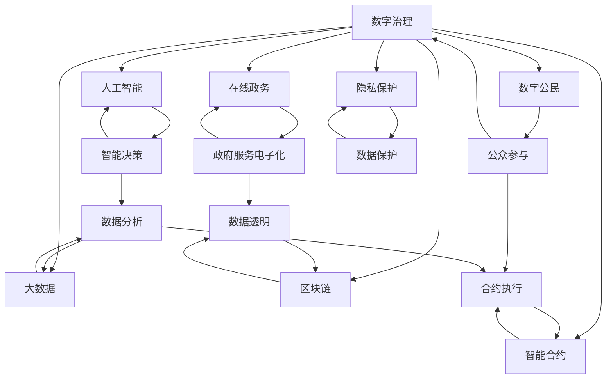

                 

# 2050年的数字治理：从在线政务到数字公民参与的协同治理

> 关键词：数字治理,在线政务,数字公民,协同治理,人工智能,大数据,区块链,智能合约,隐私保护

## 1. 背景介绍

### 1.1 问题由来

随着信息技术的飞速发展，数字治理（Digital Governance）已成为当前全球治理的重要方向。在2050年，我们可以预见数字治理将全面渗透到社会治理的各个方面，包括政府在线服务、城市智能管理、公共卫生应急响应、环境保护等，为构建透明、高效、可控的治理体系提供强大的支撑。然而，现有技术基础和技术范式正面临诸多挑战，如信息孤岛、数据隐私、系统安全等问题，亟需新的技术手段加以解决。

### 1.2 问题核心关键点

数字治理的关键在于：

- **数据共享与协同**：打破信息孤岛，实现跨部门、跨层级的数据共享与协同治理。
- **智能化决策支持**：利用人工智能、大数据等技术，提升政府决策的科学性和精准性。
- **隐私保护与安全**：确保公民数据的隐私和安全，防止数据滥用和泄露。
- **公众参与与透明度**：增强公众在治理过程中的参与感，提升治理透明度和公信力。
- **技术伦理与社会责任**：在技术应用中平衡技术效率与伦理道德，确保技术应用造福社会。

本文将聚焦于基于人工智能和区块链技术的协同治理模型，探讨其在2050年的应用前景和实现路径。

## 2. 核心概念与联系

### 2.1 核心概念概述

- **数字治理（Digital Governance）**：指利用信息通信技术（ICT）提升政府管理和服务效率，实现智能化的治理模式。
- **在线政务（E-Government）**：通过互联网技术，实现政府服务的电子化、网络化。
- **数字公民（Digital Citizen）**：指能够充分利用数字化技术，积极参与社会治理的公民。
- **协同治理（Collaborative Governance）**：指多方主体协同工作，共同治理的治理模式。
- **人工智能（AI）**：通过机器学习、深度学习等技术，实现智能决策和自动化处理。
- **大数据（Big Data）**：指大规模、多样化的数据集，通过数据分析挖掘出有价值的信息。
- **区块链（Blockchain）**：基于去中心化账本技术，实现数据透明、不可篡改。
- **智能合约（Smart Contract）**：自动执行、自我验证、无需信任的合约，通过区块链技术实现。
- **隐私保护（Privacy Protection）**：确保个人信息不被未授权访问和使用的保护措施。

这些核心概念之间存在紧密的联系，共同构成了数字治理的完整框架。人工智能和大数据为智能化决策提供了技术支撑，区块链和智能合约为数据透明、协同治理提供了技术手段，隐私保护则保障了公民数据的权利和安全。

### 2.2 核心概念原理和架构的 Mermaid 流程图



## 3. 核心算法原理 & 具体操作步骤

### 3.1 算法原理概述

基于人工智能和区块链技术的协同治理模型，旨在通过智能合约和区块链实现数据透明、高效协同的治理机制。其核心原理是通过AI和大数据技术，分析历史治理数据和实时数据，生成智能决策和优化方案，并通过区块链和智能合约执行和管理这些决策，实现治理过程的透明、可追溯和不可篡改。

### 3.2 算法步骤详解

1. **数据收集与预处理**：
   - 利用大数据技术，从政府、企业、公众等多个渠道收集治理相关的数据。
   - 对数据进行清洗、标准化和标注，准备输入到AI模型。

2. **智能决策与优化**：
   - 通过AI模型，分析历史数据和实时数据，生成治理方案和决策建议。
   - 利用深度学习、强化学习等技术，优化决策模型，提高决策的准确性和效率。

3. **智能合约执行**：
   - 将治理方案和决策建议转化为智能合约，并部署到区块链上。
   - 智能合约自动执行，根据预设的规则和条件，完成决策任务的执行和管理。

4. **协同治理与反馈机制**：
   - 利用区块链技术，确保治理过程的透明和可追溯。
   - 引入公众参与机制，收集公众反馈，优化治理方案。

5. **隐私保护与安全**：
   - 采用隐私保护技术，确保公民数据的安全和隐私。
   - 利用加密技术，防止数据泄露和篡改。

### 3.3 算法优缺点

**优点**：
- **高效协同**：通过智能合约和区块链，实现多方协同工作，提高治理效率。
- **透明可追溯**：治理过程透明公开，数据可追溯，增强公信力。
- **智能决策**：利用AI和大数据，提升决策的科学性和精准性。
- **隐私保护**：确保公民数据的安全和隐私，防止数据滥用。

**缺点**：
- **技术复杂性**：需要高度复杂的技术架构和开发难度。
- **数据质量依赖**：治理效果依赖于高质量的数据输入。
- **系统风险**：智能合约和区块链技术尚不成熟，存在安全隐患。

### 3.4 算法应用领域

基于人工智能和区块链技术的协同治理模型，可广泛应用于以下领域：

- **智慧城市管理**：通过智能合约和区块链，实现交通、能源、环保等公共服务的智能管理。
- **公共卫生应急响应**：利用AI和大数据分析，快速响应公共卫生事件，实现资源优化配置。
- **环境保护监测**：通过智能合约和区块链，实现环境数据的透明监测和协同治理。
- **社会治理创新**：利用AI和大数据，提升社会治理的智能化水平，实现高效、透明的治理模式。
- **政府透明度提升**：通过区块链技术，实现政府决策和执行过程的透明公开。

## 4. 数学模型和公式 & 详细讲解 & 举例说明

### 4.1 数学模型构建

假设数字治理模型为 $G$，其输入为 $x$（包括历史数据和实时数据），输出为 $y$（包括治理方案和决策建议）。模型的目标是通过AI和大数据技术，优化决策模型 $M$，使其输出 $y$ 与真实结果 $y^*$ 的误差最小。

数学表达式为：

$$
\min_{M} \mathbb{E}_{(x,y)}\left[ \left( y - M(x) \right)^2 \right]
$$

其中 $\mathbb{E}$ 表示期望值，$M(x)$ 表示模型对输入 $x$ 的预测输出。

### 4.2 公式推导过程

假设数据集 $D=\{(x_i, y_i)\}_{i=1}^N$，模型 $M$ 的损失函数为均方误差（Mean Squared Error, MSE）：

$$
\mathcal{L}(M) = \frac{1}{N} \sum_{i=1}^N (y_i - M(x_i))^2
$$

通过梯度下降等优化算法，最小化损失函数，得到模型参数 $\theta$ 的更新公式：

$$
\theta \leftarrow \theta - \eta \nabla_{\theta}\mathcal{L}(M)
$$

其中 $\eta$ 为学习率，$\nabla_{\theta}\mathcal{L}(M)$ 为损失函数对模型参数的梯度，可通过反向传播算法计算。

### 4.3 案例分析与讲解

以智慧城市交通管理为例，通过智能合约和区块链，实现交通信号灯的智能控制和优化。具体步骤如下：

1. 收集交通流量数据、气象数据、交通违法行为数据等，作为模型输入。
2. 利用AI和大数据技术，生成交通信号灯控制方案。
3. 将控制方案转化为智能合约，部署到区块链上。
4. 智能合约自动执行，根据实时数据调整信号灯亮度和时间。
5. 通过区块链，确保控制过程透明公开，公众可实时查询。

## 5. 项目实践：代码实例和详细解释说明

### 5.1 开发环境搭建

为了实践协同治理模型，需要准备以下开发环境：

1. **Python**：选择Python作为开发语言，利用其丰富的库和框架。
2. **AI框架**：选择TensorFlow、PyTorch等AI框架，用于模型训练和优化。
3. **区块链框架**：选择Ethereum、Hyperledger等区块链框架，用于智能合约的部署和管理。
4. **数据处理库**：选择Pandas、NumPy等库，用于数据收集和预处理。
5. **界面开发库**：选择Flask、Django等Web框架，用于前端页面开发。

### 5.2 源代码详细实现

以下是一个简单的智能合约和区块链实现示例：

```python
from web3 import Web3

# 连接以太坊网络
web3 = Web3(Web3.HTTPProvider('https://mainnet.infura.io/v3/YOUR_INFURA_PROJECT_ID'))

# 部署智能合约
contract_abi = [
    {"inputs": [{"name": "value", "type": "uint256"}], "name": "set_value", "outputs": []},
    {"inputs": [], "name": "get_value", "outputs": [{"name": "value", "type": "uint256"}]}
]

contract_bytecode = "..."
contract_address = web3.eth.contract(abi=contract_abi, bytecode=contract_bytecode).deploy()

# 调用智能合约
contract_instance = web3.eth.contract(address=contract_address, abi=contract_abi)
tx_hash = contract_instance.functions.set_value(value=1000).transact({"from": "0x123456789012345678901234567890"})
tx_receipt = web3.eth.waitForTransactionReceipt(tx_hash)
value = contract_instance.functions.get_value().call()

print("智能合约部署地址：", contract_address)
print("智能合约余额：", value)
```

### 5.3 代码解读与分析

**智能合约部署示例**：
1. 首先连接以太坊网络，指定Infura项目ID。
2. 定义智能合约的ABI和字节码，使用`web3.eth.contract`部署智能合约，并获取合约地址。
3. 通过`contract_instance.functions.set_value`设置合约余额，通过`web3.eth.waitForTransactionReceipt`等待交易确认，最后通过`contract_instance.functions.get_value`获取合约余额。

## 6. 实际应用场景

### 6.1 智慧城市管理

智慧城市管理是协同治理模型的典型应用场景。通过智能合约和区块链，实现交通、能源、环保等公共服务的智能管理，提升城市治理效率和公众满意度。

例如，通过智能合约和区块链，实现交通信号灯的智能控制和优化，提升交通流量管理水平。通过区块链，确保交通数据透明公开，公众可实时查询和反馈。

### 6.2 公共卫生应急响应

在公共卫生应急响应中，协同治理模型可利用AI和大数据技术，快速分析疫情数据，生成应急响应方案，并通过智能合约和区块链实现资源优化配置和协同治理。

例如，通过智能合约和区块链，实现医疗物资的智能分配和供应链管理。通过AI分析疫情数据，生成物资需求预测，智能合约自动分配物资，区块链确保物资流向透明公开。

### 6.3 环境保护监测

环境保护监测是协同治理模型的另一个重要应用场景。通过智能合约和区块链，实现环境数据的透明监测和协同治理，提升环境保护的智能化水平。

例如，通过智能合约和区块链，实现空气质量的智能监测和预警。通过AI分析环境数据，生成空气质量预警信息，智能合约自动触发预警措施，区块链确保预警信息透明公开。

### 6.4 未来应用展望

未来，基于人工智能和区块链技术的协同治理模型将广泛应用于更多领域，为构建透明、高效、可控的治理体系提供强大的支撑。

在2050年，数字治理将成为社会治理的主流模式，全面渗透到各个领域。智能合约和区块链技术将发挥重要作用，提升治理效率和公信力。同时，AI和大数据技术将进一步提升决策的科学性和精准性，实现智能化、自动化的治理过程。

## 7. 工具和资源推荐

### 7.1 学习资源推荐

- **《智能合约编程：以太坊与Solidity》**：该书系统介绍了智能合约的编程语言Solidity，适合初学者和开发者学习。
- **《区块链技术与应用》**：该书详细介绍了区块链的基本原理和应用场景，适合深入了解区块链技术。
- **《人工智能基础》**：该书系统介绍了人工智能的基本概念和算法，适合入门和进阶学习。
- **Coursera《Blockchain Fundamentals》课程**：由IBM提供，系统介绍了区块链技术的基本原理和应用场景。
- **edX《AI for Everyone》课程**：由微软提供，适合对人工智能感兴趣的非专业人士学习。

### 7.2 开发工具推荐

- **Ethereum**：全球领先的区块链平台，适合开发智能合约。
- **Hyperledger**：IBM主导的区块链平台，适合开发企业级智能合约。
- **TensorFlow**：Google提供的深度学习框架，适合开发AI模型。
- **PyTorch**：Facebook提供的深度学习框架，适合开发AI模型。
- **Flask**：Python提供的Web框架，适合开发前端界面。
- **Django**：Python提供的Web框架，适合开发后端逻辑。

### 7.3 相关论文推荐

- **《Blockchain for Smart Contracts and Decentralized Applications》**：该文详细介绍了智能合约和区块链的基本原理和应用场景。
- **《Blockchain Technology and Cryptocurrency: An Overview》**：该文系统介绍了区块链的基本原理和应用场景。
- **《Deep Learning with Python》**：该文详细介绍了深度学习的原理和应用，适合深度学习初学者和开发者学习。

## 8. 总结：未来发展趋势与挑战

### 8.1 研究成果总结

本文介绍了基于人工智能和区块链技术的协同治理模型，探讨了其在2050年的应用前景和实现路径。通过智能合约和区块链技术，实现数据透明、高效协同的治理机制，利用AI和大数据技术，提升决策的科学性和精准性，确保公民数据的安全和隐私。

### 8.2 未来发展趋势

未来，数字治理将继续在各个领域深入应用，智能合约和区块链技术将发挥重要作用，提升治理效率和公信力。AI和大数据技术将进一步提升决策的科学性和精准性，实现智能化、自动化的治理过程。

### 8.3 面临的挑战

尽管数字治理技术在不断进步，但仍面临诸多挑战：

- **技术成熟度**：智能合约和区块链技术尚不成熟，存在安全隐患。
- **数据质量**：治理效果依赖于高质量的数据输入，数据收集和预处理仍需优化。
- **伦理道德**：技术应用中需平衡技术效率与伦理道德，确保技术应用造福社会。

### 8.4 研究展望

未来，数字治理技术将在各个领域深入应用，成为社会治理的主流模式。研究和应用需从技术、伦理、社会等多个维度协同发力，构建透明、高效、可控的治理体系，实现智慧、公平、可持续的社会治理。

## 9. 附录：常见问题与解答

**Q1：智能合约和区块链技术有哪些优势？**

A: 智能合约和区块链技术的优势包括：
- **透明公开**：所有交易和数据均记录在区块链上，透明公开，不可篡改。
- **自动化执行**：智能合约根据预设规则自动执行，无需人工干预。
- **去中心化**：区块链采用去中心化结构，减少中心化的风险和成本。
- **安全可靠**：采用加密技术，确保数据安全和隐私保护。

**Q2：如何确保智能合约的安全性？**

A: 确保智能合约的安全性，需要注意以下几点：
- **代码审计**：在部署智能合约前，进行代码审计，检查潜在的安全漏洞。
- **测试验证**：在实际部署前，进行充分的测试验证，确保合约功能正确。
- **权限控制**：合理设置智能合约的访问权限，防止未授权访问和操作。
- **应急预案**：制定应急预案，在合约出现故障时，及时修复和恢复。

**Q3：如何优化数据质量？**

A: 优化数据质量，需要注意以下几点：
- **数据清洗**：对数据进行清洗和预处理，去除噪声和冗余数据。
- **数据标准化**：对数据进行标准化，确保数据的格式一致。
- **数据标注**：对数据进行标注，为模型提供高质量的输入。
- **数据增强**：利用数据增强技术，扩充训练集，提高模型泛化能力。

**Q4：如何提升决策的科学性？**

A: 提升决策的科学性，需要注意以下几点：
- **数据驱动**：利用大数据技术，分析历史和实时数据，生成决策建议。
- **模型优化**：通过AI模型优化决策模型，提高决策的准确性和效率。
- **多模型融合**：融合多个模型，综合考虑多种因素，提升决策的全面性和鲁棒性。
- **专家参与**：引入专家参与决策，提升决策的科学性和合理性。

**Q5：如何保障公民数据的隐私和安全？**

A: 保障公民数据的隐私和安全，需要注意以下几点：
- **数据加密**：采用数据加密技术，防止数据泄露。
- **匿名化处理**：对数据进行匿名化处理，保护个人隐私。
- **访问控制**：合理设置数据的访问权限，防止未授权访问。
- **审计和监控**：定期进行数据审计和监控，及时发现和处理数据泄露问题。

---

作者：禅与计算机程序设计艺术 / Zen and the Art of Computer Programming

