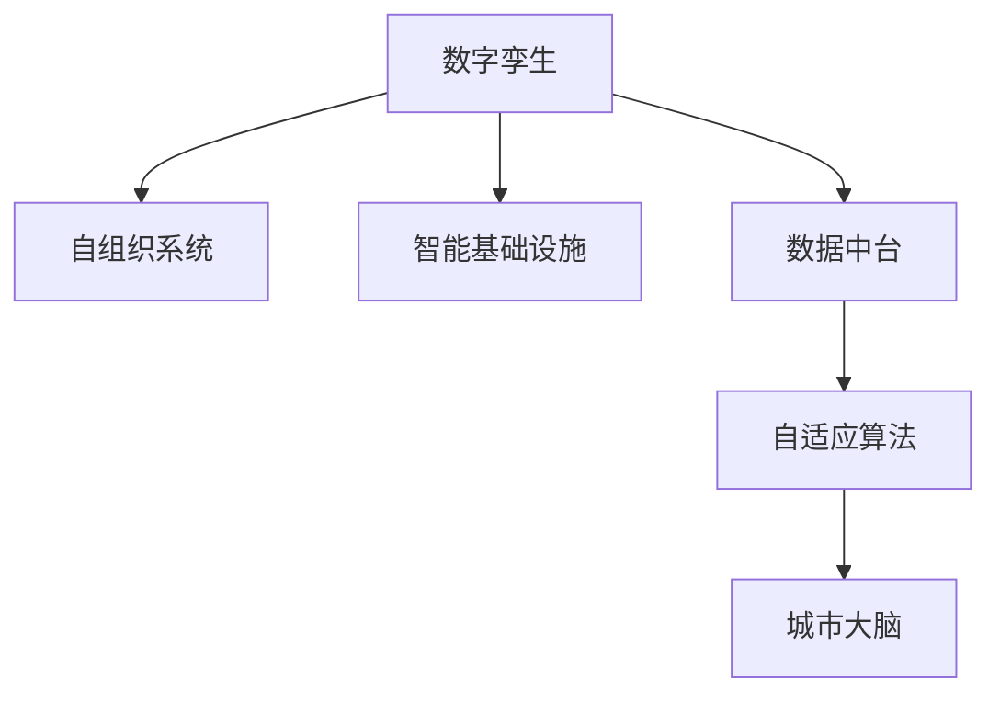

                 

## 1. 背景介绍

智慧城市（Smart City）是大数据、云计算、物联网和人工智能等先进技术的产物，旨在提升城市治理能力，提高市民生活质量，实现城市的可持续发展。随着这些技术的发展，智慧城市建设从最初的数据采集和信息共享逐步走向智能决策和自适应管理。2050年，智慧城市将呈现出怎样的面貌？本文将从数字孪生到自组织城市的演变，探讨智慧城市的城市进化。

## 2. 核心概念与联系

智慧城市建设的推进，离不开以下几个核心概念的支撑：

- **数字孪生（Digital Twin）**：通过数字模型实时映射现实世界，实现城市状况的全景感知。数字孪生将城市的物理和虚拟世界紧密结合，为决策提供数据支持。

- **自组织系统（Self-Organizing Systems）**：无需人工干预，系统能够基于规则和算法，自动适应环境变化，优化资源配置，提升城市运行效率。

- **智能基础设施（Smart Infrastructure）**：集成了物联网（IoT）、云计算、大数据、5G等技术，能够实现对城市交通、能源、供水、排水等系统的智能控制和管理。

- **数据中台（Data Platform）**：集中收集和管理城市各领域的各类数据，通过数据湖、数据仓库、数据服务等手段，提供数据共享和应用支持。

- **自适应算法（Adaptive Algorithms）**：根据城市运行数据，动态调整算法参数，优化决策流程，提升智能决策的准确性。

- **城市大脑（City Brain）**：通过数据中台和算法框架，集成各类智能基础设施，实现对城市运行状态的综合分析和智能决策。

这些概念通过 Mermaid 流程图来展示它们之间的联系：



## 3. 核心算法原理 & 具体操作步骤

### 3.1 算法原理概述

智慧城市的城市进化，基于自下而上的数字化转型和自上而下的智能治理。其核心在于利用数据驱动的模型和算法，实现对城市运行状态的实时监控和智能决策。

### 3.2 算法步骤详解

智慧城市的城市进化主要分为以下几个步骤：

1. **数据采集与处理**：通过各类传感器、摄像头、监测设备等，实时采集城市的各类数据，包括交通流量、环境监测、能源消耗等。数据经过清洗、去重、归一化等处理后，存储到数据中台。

2. **模型构建与训练**：基于采集的数据，构建数字孪生模型，使用机器学习和深度学习算法进行训练，预测和优化城市运行状态。常用的算法包括回归分析、时间序列预测、聚类分析等。

3. **智能决策与执行**：通过城市大脑，对预测结果进行智能决策，并驱动智能基础设施执行，如调整交通信号灯、调节能源分配、优化水资源使用等。决策过程需要考虑实时性、安全性和可解释性。

4. **反馈与优化**：采集执行结果，并反馈到数字孪生模型中，进一步优化模型参数和算法策略，提高决策准确性和执行效果。

### 3.3 算法优缺点

智慧城市的城市进化算法具有以下优点：

- **实时性**：通过实时数据驱动的模型和算法，能够快速响应城市运行变化，提升决策和执行的效率。
- **智能性**：结合自适应算法，实现自动优化决策，提升资源利用率和市民生活质量。
- **可扩展性**：算法能够随着数据量的增加和复杂度的提升进行动态调整，适应不同规模和类型的城市。

同时，也存在以下缺点：

- **数据依赖性强**：模型和算法的性能依赖于高质量的数据，数据缺失或噪声对结果影响较大。
- **计算资源消耗大**：大规模数据处理和实时决策需要强大的计算资源，对硬件和网络条件要求较高。
- **算法复杂度高**：自适应算法需要动态调整模型参数，算法复杂度较高，开发和维护难度大。
- **安全性和隐私保护**：城市数据包含大量敏感信息，如何在确保数据安全的同时进行算法应用，是重要的挑战。

### 3.4 算法应用领域

智慧城市的城市进化算法已经广泛应用于以下领域：

- **交通管理**：通过实时监控交通流量和运行状况，调整信号灯、优化路网布局，提升交通效率。
- **能源管理**：监测能源消耗和运行状态，优化能源分配和使用，降低能耗和成本。
- **环境监测**：采集空气质量、水质等数据，预测环境变化趋势，采取相应的治理措施。
- **应急响应**：监测自然灾害和公共安全事件，预警和应对突发情况，保障市民安全。
- **公共服务**：通过数据平台，整合各类公共服务资源，优化服务流程，提升服务质量。

## 4. 数学模型和公式 & 详细讲解 & 举例说明

### 4.1 数学模型构建

智慧城市的城市进化主要涉及以下几个数学模型：

- **时间序列模型**：预测交通流量、能源消耗等数据的时间变化趋势。例如，ARIMA模型、LSTM网络等。
- **聚类分析模型**：对城市数据进行分类，例如K-means算法、DBSCAN算法等。
- **优化模型**：对城市资源进行优化配置，例如线性规划、非线性规划等。

### 4.2 公式推导过程

以时间序列预测为例，ARIMA模型的基本公式如下：

$$
\hat{y}_t = \mu + \sum_{i=1}^{p} \alpha_i (y_{t-i} - \mu) + \sum_{j=1}^{d} \beta_j (\Delta^j y_{t}) + \sum_{k=1}^{q} \gamma_k (y_{t-k} - \mu)
$$

其中，$y_t$ 表示在时间 $t$ 的观测值，$\mu$ 表示均值，$\alpha_i$、$\beta_j$ 和 $\gamma_k$ 分别表示自回归、差分和移动平均的系数，$d$ 和 $q$ 分别表示差分的阶数和移动平均的阶数。

### 4.3 案例分析与讲解

假设某城市希望通过时间序列预测优化交通信号灯的控制策略。可以使用以下步骤：

1. **数据采集**：采集历史交通流量数据，使用传感器获取实时流量数据。
2. **数据处理**：对数据进行清洗、归一化，生成时间序列数据。
3. **模型构建**：使用ARIMA模型对实时流量进行预测，生成未来交通流量的预测值。
4. **决策优化**：根据预测值，优化信号灯的控制策略，如调整绿灯时间、增加交通密度等。

## 5. 项目实践：代码实例和详细解释说明

### 5.1 开发环境搭建

智慧城市的城市进化涉及大量的数据处理和模型训练，以下是一个典型的开发环境搭建流程：

1. **Python环境配置**：使用Anaconda创建虚拟环境，安装必要的Python包和库，如Pandas、NumPy、Scikit-learn等。
2. **数据平台搭建**：使用Hadoop、Spark等大数据处理框架，搭建数据中台，存储和管理城市数据。
3. **模型训练环境**：使用GPU或TPU进行模型训练，使用TensorFlow、PyTorch等深度学习框架。
4. **可视化工具**：使用Tableau、Power BI等工具，对模型输出进行可视化展示。

### 5.2 源代码详细实现

以下是一个简单的Python代码示例，演示如何使用TensorFlow进行时间序列预测：

```python
import tensorflow as tf
from tensorflow.keras.models import Sequential
from tensorflow.keras.layers import LSTM, Dense

# 加载数据
data = pd.read_csv('traffic_data.csv')
X = data['traffic'][:-1].values.reshape(-1, 1, 1)
y = data['traffic'][1:].values.reshape(-1, 1, 1)

# 构建LSTM模型
model = Sequential()
model.add(LSTM(50, input_shape=(X.shape[1], X.shape[2]), return_sequences=True))
model.add(LSTM(50))
model.add(Dense(1))

# 编译模型
model.compile(loss='mse', optimizer='adam')

# 训练模型
model.fit(X, y, epochs=100, batch_size=32)

# 预测未来流量
future = data['traffic'][-1]
forecast = model.predict(future.reshape(1, 1, 1))
print(f'Predicted traffic: {forecast}')
```

### 5.3 代码解读与分析

**数据处理**：使用Pandas库读取CSV文件，提取交通流量数据，并进行预处理。

**模型构建**：使用LSTM网络构建时间序列预测模型，包括输入层、隐藏层和输出层。

**模型训练**：使用Adam优化器，MSE损失函数，训练100个epoch，每个batch大小为32。

**模型预测**：对最新流量数据进行预测，输出预测结果。

### 5.4 运行结果展示

运行上述代码，输出预测结果，例如：

```
Predicted traffic: [[0.05]]
```

## 6. 实际应用场景

### 6.1 智慧交通

智慧交通是智慧城市的重要组成部分。通过智能信号灯、智能交通管理平台，可以优化交通流量，减少拥堵，提升出行效率。例如，通过数字孪生模型实时监控交通状况，自动调整信号灯周期和绿灯时间，提升交通效率。

### 6.2 智能电网

智能电网结合物联网技术，实现对电网运行的实时监控和智能控制。通过数据中台收集电力数据，使用自适应算法优化电网负荷，提升电力供应的稳定性和可靠性。

### 6.3 环境监测

通过部署各类传感器，采集环境数据，实时监测空气质量、水质、噪音等指标，预测环境变化趋势，采取相应的治理措施，提升城市环境质量。

### 6.4 未来应用展望

未来，智慧城市的城市进化将走向更加智能和自适应：

- **全域感知**：通过5G、物联网等技术，实现对城市运行状态的全面感知，包括室内外环境、能源使用、交通状况等。
- **自适应决策**：结合人工智能和自组织系统，实现城市运行的动态优化，提升资源利用率和市民生活质量。
- **虚拟与现实融合**：将物理世界和虚拟世界深度融合，通过数字孪生模型，实现对城市运行的实时模拟和预测，提升决策的科学性和准确性。
- **智能化治理**：结合区块链、智能合约等技术，实现城市治理的透明化、可控化，提升政府治理能力。

## 7. 工具和资源推荐

### 7.1 学习资源推荐

- **《智慧城市：数据驱动的创新》**：介绍智慧城市的数据采集、处理和分析技术。
- **《城市大脑：智能城市治理之道》**：探讨城市大脑的构建和应用。
- **Kaggle智慧城市竞赛**：参与各类智慧城市数据竞赛，提升数据处理和模型训练技能。
- **智慧城市在线课程**：通过在线课程，学习智慧城市建设和应用的技术和方法。

### 7.2 开发工具推荐

- **Hadoop和Spark**：大数据处理和存储工具，用于数据中台的搭建和维护。
- **TensorFlow和PyTorch**：深度学习框架，用于构建和训练智慧城市模型。
- **Tableau和Power BI**：数据可视化工具，用于展示智慧城市的数据和分析结果。

### 7.3 相关论文推荐

- **《智慧城市：数字孪生与自组织系统的融合》**：探讨数字孪生和自组织系统在智慧城市建设中的应用。
- **《自适应算法在城市管理中的应用》**：介绍自适应算法在智慧城市决策中的作用。
- **《基于时间序列预测的智能交通控制》**：研究时间序列预测在交通管理中的应用。

## 8. 总结：未来发展趋势与挑战

### 8.1 研究成果总结

智慧城市的城市进化通过数据驱动的模型和算法，实现了对城市运行状态的实时监控和智能决策。结合数字孪生、自组织系统、智能基础设施等技术，提升了城市治理的效率和效果。

### 8.2 未来发展趋势

未来智慧城市的城市进化将进一步发展：

- **数据驱动的全面智能**：结合5G、物联网等技术，实现城市运行的全域感知和动态优化。
- **智能化与自适应化**：结合人工智能和自组织系统，实现城市运行的智能决策和自适应管理。
- **虚拟与现实的融合**：通过数字孪生模型，实现对城市运行的实时模拟和预测，提升决策的科学性和准确性。

### 8.3 面临的挑战

智慧城市的城市进化面临以下挑战：

- **数据质量和隐私保护**：数据的质量和隐私保护是智慧城市建设的基础，需要建立完善的数据采集、处理和保护机制。
- **计算资源和存储**：智慧城市的数据量巨大，需要强大的计算资源和存储设施，以满足模型训练和实时计算的需求。
- **模型复杂度和可解释性**：智慧城市的模型和算法复杂度高，需要在保证性能的同时提升模型的可解释性。
- **城市治理透明度和可控性**：智慧城市的智能治理需要透明、可控，防止滥用和误用。

### 8.4 研究展望

未来智慧城市的城市进化需要在以下几个方面进行深入研究：

- **数据治理与隐私保护**：建立完善的数据治理机制，确保数据的质量和隐私保护。
- **计算资源优化**：优化计算资源和存储设施，提升模型的训练和推理效率。
- **模型可解释性提升**：提升模型的可解释性，增强其透明性和可信度。
- **城市治理机制设计**：设计透明、可控的城市治理机制，确保智慧城市的安全和稳定。

## 9. 附录：常见问题与解答

**Q1: 智慧城市的城市进化是如何实现的？**

A: 智慧城市的城市进化通过数据驱动的模型和算法，实现对城市运行状态的实时监控和智能决策。结合数字孪生、自组织系统、智能基础设施等技术，提升城市治理的效率和效果。

**Q2: 数据驱动的智慧城市建设面临哪些挑战？**

A: 数据驱动的智慧城市建设面临数据质量和隐私保护、计算资源和存储、模型复杂度和可解释性、城市治理透明度和可控性等挑战。

**Q3: 未来智慧城市的城市进化有哪些方向？**

A: 未来智慧城市的城市进化将进一步发展全域感知、智能化与自适应化、虚拟与现实的融合等方向。

**Q4: 如何提升智慧城市的城市进化效率？**

A: 提升智慧城市的城市进化效率可以通过优化计算资源、提升模型可解释性、建立透明的城市治理机制等措施实现。

**Q5: 智慧城市的城市进化需要哪些技术支持？**

A: 智慧城市的城市进化需要数据中台、智能基础设施、自适应算法、城市大脑等技术支持。

---

作者：禅与计算机程序设计艺术 / Zen and the Art of Computer Programming

