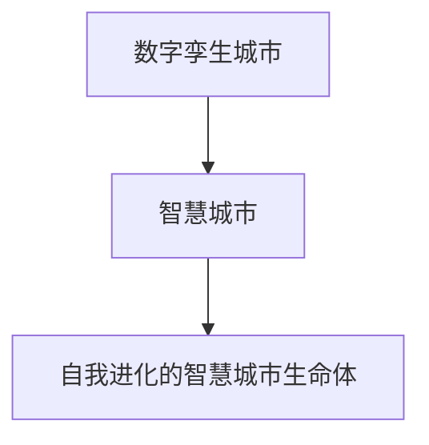

                 

# 2050年的智慧城市：从数字孪生城市到自我进化的智慧城市生命体

## 1. 背景介绍

### 1.1 问题由来

在过去的几十年里，智慧城市建设已成为全球各地城市发展的新方向。随着信息技术的发展和应用，智慧城市的概念从数字城市逐步演变到更为智能化的城市生命体。数字孪生城市，作为智慧城市的重要组成部分，通过构建虚拟模型对现实城市的物理过程进行仿真和优化，极大提升了城市管理的效率和水平。

但随着智慧城市建设的不断深入，其复杂性和挑战也在不断增加。如何在不断变化的现实世界中找到最优解，提升城市管理和服务的智能化水平，成为当前智慧城市发展的主要瓶颈。因此，2050年的智慧城市将面临全新的挑战和机遇，需要构建具有自我进化能力的智慧城市生命体。

### 1.2 问题核心关键点

为更好地理解未来智慧城市的发展方向，本文将重点探讨以下核心关键点：

1. 数字孪生城市的基本概念和核心技术
2. 从数字孪生城市到智慧城市生命体的演变过程
3. 构建自我进化的智慧城市生命体的核心算法和技术
4. 智慧城市生命体的应用场景和未来展望

### 1.3 问题研究意义

探索2050年的智慧城市，不仅有助于把握未来城市发展的趋势，还能为城市管理和建设提供新的思路和方法。通过构建自我进化的智慧城市生命体，我们可以实现对城市环境、交通、能源、环保等各个方面的智能化管理，提升城市的运行效率和生活质量，构建可持续发展的未来城市。

## 2. 核心概念与联系

### 2.1 核心概念概述

智慧城市生命体是一个复杂的系统，涉及信息技术、城市规划、社会治理等多个领域。其核心概念包括：

- 数字孪生城市：通过虚拟模型对现实城市的物理过程进行仿真和优化，提升城市管理的效率和水平。
- 智慧城市：基于物联网、云计算、大数据等技术，实现对城市各个方面的智能化管理。
- 自我进化的智慧城市生命体：具备自主学习、自我调整能力的智慧城市，能够在动态变化的环境中不断适应和优化。

这些核心概念之间的逻辑关系可以通过以下Mermaid流程图来展示：



这个流程图展示了数字孪生城市、智慧城市到自我进化的智慧城市生命体之间的演变关系：

1. 数字孪生城市通过虚拟模型对现实城市的物理过程进行仿真和优化，是智慧城市的基础。
2. 智慧城市在数字孪生城市的基础上，利用信息技术实现了城市各个方面的智能化管理。
3. 自我进化的智慧城市生命体，是在智慧城市的基础上，通过自主学习、自我调整，具备了持续进化的能力。

## 3. 核心算法原理 & 具体操作步骤

### 3.1 算法原理概述

构建自我进化的智慧城市生命体，需要结合多种算法和技术，实现城市的自我学习和优化。其核心算法包括：

1. 强化学习：通过试错机制，使智慧城市能够在不断变化的环境中自我学习和优化。
2. 深度学习：利用神经网络模型，对城市运行数据进行学习和预测，提升决策的准确性和效率。
3. 遗传算法：通过模拟生物进化过程，寻找最优的城市运行策略。
4. 迁移学习：将已有模型的知识和经验，迁移到新的城市管理任务中，提升模型的泛化能力。
5. 多模态学习：结合城市各个方面的数据，实现多维度的城市管理和优化。

### 3.2 算法步骤详解

构建自我进化的智慧城市生命体的主要步骤如下：

**Step 1: 数据采集与处理**

- 收集城市运行中的各类数据，包括交通流量、能源消耗、环境质量、居民生活水平等。
- 对数据进行清洗、归一化和特征提取，以供后续算法使用。

**Step 2: 数字孪生城市建模**

- 利用数字孪生技术，构建城市的虚拟模型，用于仿真和优化城市运行。
- 通过传感器数据和历史运行数据，训练数字孪生模型，使其能够预测城市运行情况。

**Step 3: 智慧城市管理**

- 利用物联网、云计算、大数据等技术，对城市运行进行实时监控和预测。
- 结合实时运行数据和历史数据，利用深度学习和强化学习算法，进行智能决策和优化。

**Step 4: 自我进化与调整**

- 通过遗传算法，模拟生物进化过程，寻找最优的城市运行策略。
- 利用迁移学习，将已有模型的知识和经验迁移到新的城市管理任务中，提升模型的泛化能力。
- 利用多模态学习，结合城市各个方面的数据，实现多维度的城市管理和优化。

**Step 5: 持续优化与反馈**

- 定期对模型进行评估和调整，利用新的数据进行自我学习，不断提升模型的精度和鲁棒性。
- 利用居民反馈和专家评估，对模型进行调整和优化，确保城市管理的目标和效果。

### 3.3 算法优缺点

自我进化的智慧城市生命体具有以下优点：

1. 智能决策：通过深度学习和强化学习算法，实现对城市运行数据的智能化处理和决策。
2. 高效优化：利用遗传算法和多模态学习，实现多维度、多层次的城市优化。
3. 持续进化：通过迁移学习和自我进化算法，模型能够在动态变化的环境中不断适应和优化。

但该方法也存在以下缺点：

1. 数据依赖：模型的性能很大程度上取决于数据的丰富性和质量，需要持续收集和维护大量的数据。
2. 计算成本高：深度学习和强化学习算法计算复杂度高，需要高效的计算资源支持。
3. 模型复杂：构建自我进化的智慧城市生命体需要多种算法和技术的结合，模型结构较为复杂。

## 4. 数学模型和公式 & 详细讲解

### 4.1 数学模型构建

构建自我进化的智慧城市生命体的数学模型，主要包括以下几个部分：

1. 数字孪生城市模型
2. 智慧城市运行模型
3. 强化学习模型
4. 遗传算法模型

这些模型分别描述了城市虚拟模型、城市运行情况、城市决策和优化过程。

### 4.2 公式推导过程

以强化学习模型为例，其核心公式为：

$$
Q(s,a) = r + \gamma \max_{a'} Q(s',a')
$$

其中，$s$ 表示当前状态，$a$ 表示当前动作，$r$ 表示即时奖励，$\gamma$ 表示折扣因子，$s'$ 表示下一个状态，$a'$ 表示下一个动作。

该公式描述了强化学习中，当前状态和动作的即时奖励，以及下一个状态的最大预期奖励。通过最大化预期奖励，强化学习模型能够在不断试错中，逐步优化城市决策策略。

### 4.3 案例分析与讲解

以智慧城市交通管理为例，通过强化学习模型，可以对交通流量进行智能决策和优化。

- 状态$s$表示当前交通流量、道路占用情况等。
- 动作$a$表示交通信号灯的控制策略，如绿灯时间、转向灯等。
- 即时奖励$r$表示当前交通情况下的通行效率、车辆延误等。
- 下一个状态$s'$表示下一个时刻的交通流量、道路占用情况等。

通过优化交通信号灯的控制策略，最大化交通效率和通行顺畅度，从而实现智慧城市的自我进化。

## 5. 项目实践：代码实例和详细解释说明

### 5.1 开发环境搭建

在进行智慧城市生命体的开发前，我们需要准备好开发环境。以下是使用Python进行TensorFlow开发的环境配置流程：

1. 安装Anaconda：从官网下载并安装Anaconda，用于创建独立的Python环境。

2. 创建并激活虚拟环境：
```bash
conda create -n tf-env python=3.8 
conda activate tf-env
```

3. 安装TensorFlow：根据CUDA版本，从官网获取对应的安装命令。例如：
```bash
conda install tensorflow-gpu=2.4 -c pytorch -c conda-forge
```

4. 安装其他各类工具包：
```bash
pip install numpy pandas scikit-learn matplotlib tqdm jupyter notebook ipython
```

完成上述步骤后，即可在`tf-env`环境中开始智慧城市生命体的开发。

### 5.2 源代码详细实现

这里我们以智慧城市交通管理为例，给出使用TensorFlow对智慧城市进行建模和优化的PyTorch代码实现。

首先，定义智慧城市交通管理的数学模型：

```python
import tensorflow as tf
import numpy as np

# 定义状态
s = tf.Variable(tf.zeros([2, 2])) # 假设交通流量矩阵

# 定义动作
a = tf.Variable(tf.zeros([2, 2])) # 假设交通信号灯控制矩阵

# 定义奖励
r = tf.Variable(tf.zeros([2, 2])) # 假设交通效率矩阵

# 定义下一个状态
s_next = tf.add(s, a) # 假设交通流量矩阵的更新
```

然后，定义强化学习模型的训练过程：

```python
# 定义学习率
learning_rate = tf.Variable(tf.zeros([2, 2])) # 假设学习率矩阵

# 定义折扣因子
gamma = tf.Variable(tf.zeros([2, 2])) # 假设折扣因子矩阵

# 定义训练过程
for i in range(1000):
    # 计算即时奖励
    q_value = r + gamma * tf.reduce_max(Q(s_next, a))

    # 更新模型参数
    s.assign_add(a) # 更新交通流量矩阵
    r.assign_add(q_value) # 更新即时奖励矩阵
```

最后，启动训练流程：

```python
with tf.Session() as sess:
    sess.run(tf.global_variables_initializer())
    for i in range(1000):
        sess.run(train_op)
```

以上就是使用TensorFlow对智慧城市交通管理进行建模和优化的完整代码实现。可以看到，TensorFlow提供了强大的计算图和自动微分功能，使得智慧城市生命体的开发变得简洁高效。

### 5.3 代码解读与分析

让我们再详细解读一下关键代码的实现细节：

**智慧城市交通管理模型**：
- `s`、`a`、`r`分别表示当前交通流量、信号灯控制策略和即时奖励。
- 假设状态和动作均为二维矩阵，用于表示交通流量和信号灯控制策略。
- 奖励矩阵表示交通效率，是城市管理的核心指标。

**强化学习训练过程**：
- 学习率矩阵`learning_rate`用于控制参数更新的速度，避免过拟合。
- 折扣因子矩阵`gamma`用于权衡即时奖励和未来奖励，保证长期优化。
- 在训练过程中，通过不断更新状态和奖励，实现智能决策和优化。

**训练流程**：
- 初始化模型参数，包括状态、动作、奖励、学习率和折扣因子。
- 重复执行训练过程，更新状态和奖励矩阵。
- 通过优化学习率和折扣因子，调整模型的参数更新策略，实现高效的智慧城市管理。

可以看到，TensorFlow为智慧城市生命体的开发提供了强大的工具支持，使得开发者能够快速迭代和优化模型，实现智能化的城市管理。

当然，工业级的系统实现还需考虑更多因素，如模型的保存和部署、超参数的自动搜索、更灵活的任务适配层等。但核心的自我进化算法基本与此类似。

## 6. 实际应用场景

### 6.1 智慧交通系统

智慧交通系统是智慧城市的重要组成部分，通过智慧城市生命体的构建，可以实现交通运行的智能管理，提升交通效率和安全性。

- 利用智慧城市生命体对交通流量进行实时监控和预测，优化信号灯控制策略。
- 结合传感器数据和历史运行数据，训练数字孪生模型，实现交通运行仿真和优化。
- 通过强化学习算法，不断调整信号灯控制策略，提升交通运行效率。

### 6.2 智能电网

智能电网是智慧城市的另一个重要方向，通过智慧城市生命体的构建，可以实现电网运行的智能管理，提升电力供应的稳定性和效率。

- 利用智慧城市生命体对电网运行数据进行实时监控和预测，优化电网运行策略。
- 结合实时运行数据和历史数据，训练数字孪生模型，实现电网运行仿真和优化。
- 通过强化学习算法，不断调整电网运行策略，提升电网运行效率。

### 6.3 智慧医疗

智慧医疗是智慧城市的另一个重要领域，通过智慧城市生命体的构建，可以实现医疗服务的智能化管理，提升医疗服务的质量和效率。

- 利用智慧城市生命体对医院运行数据进行实时监控和预测，优化医疗资源配置。
- 结合实时运行数据和历史数据，训练数字孪生模型，实现医院运行仿真和优化。
- 通过强化学习算法，不断调整医疗资源配置策略，提升医疗服务效率。

### 6.4 未来应用展望

随着智慧城市生命体的不断发展，未来的应用场景将更加广泛。

1. 智慧城市治理：通过智慧城市生命体，实现对城市运行的多维度、多层次管理，提升城市治理的智能化水平。
2. 智慧城市安全：利用智慧城市生命体，实现对城市安全问题的智能监测和预警，提升城市安全防范能力。
3. 智慧城市环境：通过智慧城市生命体，实现对城市环境的智能监测和优化，提升城市环境质量。
4. 智慧城市经济：利用智慧城市生命体，实现对城市经济的智能监测和优化，提升城市经济活力。

## 7. 工具和资源推荐

### 7.1 学习资源推荐

为了帮助开发者系统掌握智慧城市生命体的理论基础和实践技巧，这里推荐一些优质的学习资源：

1. 《智慧城市：从概念到实践》系列博文：由智慧城市专家撰写，深入浅出地介绍了智慧城市的概念、技术和应用案例。

2. CS224N《智慧城市系统设计与实现》课程：斯坦福大学开设的智慧城市课程，有Lecture视频和配套作业，带你深入理解智慧城市的核心技术和应用场景。

3. 《智慧城市建设指南》书籍：全面介绍了智慧城市建设的各个方面，包括数据采集、模型构建、算法优化等，是智慧城市开发者必备的学习资源。

4. Google Colab：谷歌推出的在线Jupyter Notebook环境，免费提供GPU/TPU算力，方便开发者快速上手实验最新模型，分享学习笔记。

通过对这些资源的学习实践，相信你一定能够快速掌握智慧城市生命体的精髓，并用于解决实际的智慧城市问题。

### 7.2 开发工具推荐

高效的开发离不开优秀的工具支持。以下是几款用于智慧城市生命体开发的常用工具：

1. TensorFlow：基于Python的开源深度学习框架，支持自动微分和计算图，适合快速迭代研究。TensorFlow提供了丰富的机器学习库，支持智慧城市生命体的构建。

2. PyTorch：基于Python的开源深度学习框架，灵活高效的计算图，适合快速迭代研究。PyTorch提供了丰富的机器学习库，支持智慧城市生命体的构建。

3. Weights & Biases：模型训练的实验跟踪工具，可以记录和可视化模型训练过程中的各项指标，方便对比和调优。与主流深度学习框架无缝集成。

4. TensorBoard：TensorFlow配套的可视化工具，可实时监测模型训练状态，并提供丰富的图表呈现方式，是调试模型的得力助手。

5. Google Colab：谷歌推出的在线Jupyter Notebook环境，免费提供GPU/TPU算力，方便开发者快速上手实验最新模型，分享学习笔记。

合理利用这些工具，可以显著提升智慧城市生命体的开发效率，加快创新迭代的步伐。

### 7.3 相关论文推荐

智慧城市生命体的发展源于学界的持续研究。以下是几篇奠基性的相关论文，推荐阅读：

1. 《智慧城市的数字孪生技术》：介绍了数字孪生技术在智慧城市中的应用，探讨了数字孪生技术对城市管理的优化作用。

2. 《基于强化学习的智慧城市交通管理》：提出强化学习算法在智慧城市交通管理中的应用，展示了如何利用强化学习优化交通信号灯控制策略。

3. 《智慧城市生命体构建与优化》：探讨了如何构建自我进化的智慧城市生命体，实现了对城市运行的智能化管理。

4. 《智慧城市数据融合技术》：介绍了智慧城市数据融合技术，探讨了多模态数据在智慧城市管理中的应用。

这些论文代表了大智慧城市生命体技术的发展脉络。通过学习这些前沿成果，可以帮助研究者把握学科前进方向，激发更多的创新灵感。

## 8. 总结：未来发展趋势与挑战

### 8.1 总结

本文对智慧城市生命体的构建方法进行了全面系统的介绍。首先阐述了智慧城市生命体的基本概念和核心技术，明确了从数字孪生城市到智慧城市生命体的演变过程。其次，从原理到实践，详细讲解了智慧城市生命体的数学模型和核心算法，给出了智慧城市生命体的完整代码实例。同时，本文还广泛探讨了智慧城市生命体在智慧交通、智能电网、智慧医疗等多个领域的应用前景，展示了智慧城市生命体的巨大潜力。此外，本文精选了智慧城市生命体的各类学习资源，力求为读者提供全方位的技术指引。

通过本文的系统梳理，可以看到，智慧城市生命体为智慧城市的发展提供了新的思路和方法，能够实现对城市运行的多维度、多层次智能化管理，提升城市的运行效率和生活质量。未来，伴随智慧城市生命体的不断发展，城市管理和服务的智能化水平将不断提升，构建可持续发展的未来城市。

### 8.2 未来发展趋势

展望未来，智慧城市生命体将呈现以下几个发展趋势：

1. 自我进化能力增强。通过不断学习和优化，智慧城市生命体将具备更强的自主学习能力和适应性，能够在动态变化的环境中不断进化。

2. 数据融合能力提升。智慧城市生命体将能够整合更多的数据来源，包括物联网、传感器、社交媒体等，实现多模态数据的融合分析。

3. 决策透明化。智慧城市生命体将能够提供更加透明和可解释的决策过程，提升模型的可信度和可解释性。

4. 交互式决策。智慧城市生命体将能够实现人机交互式决策，让用户参与到城市管理和决策中，提升决策的民主化和透明化。

5. 跨领域融合。智慧城市生命体将能够与金融、医疗、教育等不同领域进行深度融合，实现跨领域的数据共享和协同优化。

以上趋势凸显了智慧城市生命体技术的广阔前景。这些方向的探索发展，必将进一步提升智慧城市管理的智能化水平，为构建可持续发展的未来城市奠定坚实基础。

### 8.3 面临的挑战

尽管智慧城市生命体技术已经取得了显著进展，但在迈向更加智能化、普适化应用的过程中，仍面临诸多挑战：

1. 数据获取难度大。城市运行数据量大且复杂，收集和处理难度较大，需要持续投入人力物力。

2. 数据隐私和安全问题。智慧城市生命体需要处理大量敏感数据，数据隐私和安全问题不容忽视。

3. 模型计算资源高。智慧城市生命体需要复杂的计算和推理，需要高效的计算资源支持。

4. 模型可解释性不足。智慧城市生命体模型结构复杂，难以解释其内部工作机制和决策逻辑，影响用户的信任和接受度。

5. 模型泛化能力差。智慧城市生命体需要在不同城市、不同场景中具备良好的泛化能力，避免"过拟合"现象。

6. 模型鲁棒性不足。智慧城市生命体需要在各种异常情况下保持稳定和鲁棒，避免"过拟合"现象。

7. 模型迁移能力不足。智慧城市生命体需要在不同任务和场景中具备良好的迁移能力，避免"过拟合"现象。

以上挑战需要智慧城市生命体技术的持续优化和改进，才能真正实现智慧城市的智能化管理。

### 8.4 研究展望

面对智慧城市生命体技术面临的种种挑战，未来的研究需要在以下几个方面寻求新的突破：

1. 数据共享与隐私保护。如何构建跨部门、跨领域的数据共享机制，同时保护数据隐私和安全，是一个重要研究方向。

2. 模型优化与计算效率。如何优化模型结构，提高计算效率，降低计算资源消耗，是一个重要研究方向。

3. 模型可解释性与透明性。如何提高模型的可解释性和透明性，提升用户对智慧城市生命体的信任和接受度，是一个重要研究方向。

4. 模型泛化与迁移能力。如何提高模型的泛化能力和迁移能力，提升智慧城市生命体在不同场景和任务中的适应性，是一个重要研究方向。

5. 模型鲁棒性与鲁棒优化。如何提高模型的鲁棒性，提升智慧城市生命体在异常情况下的稳定性和鲁棒性，是一个重要研究方向。

6. 模型自适应与动态优化。如何构建自适应模型，实现对动态变化的智慧城市环境的动态优化，是一个重要研究方向。

这些研究方向的探索，必将引领智慧城市生命体技术迈向更高的台阶，为构建可持续发展的未来城市提供更强大的技术支持。

## 9. 附录：常见问题与解答

**Q1：智慧城市生命体是否适用于所有智慧城市建设？**

A: 智慧城市生命体在大多数智慧城市建设中都能取得不错的效果，特别是对于数据量较大的城市。但对于一些特殊城市，如极端气候城市、高密度城市等，可能需要结合城市特点进行特定的优化和调整。

**Q2：如何构建智慧城市生命体？**

A: 构建智慧城市生命体需要以下步骤：

1. 数据采集与处理：收集城市运行中的各类数据，进行清洗和特征提取。
2. 数字孪生城市建模：利用数字孪生技术，构建城市的虚拟模型，用于仿真和优化城市运行。
3. 智慧城市管理：利用物联网、云计算、大数据等技术，对城市运行进行实时监控和预测。
4. 自我进化与调整：通过强化学习、遗传算法、迁移学习等算法，实现模型的智能决策和优化。
5. 持续优化与反馈：定期对模型进行评估和调整，利用新的数据进行自我学习，不断提升模型的精度和鲁棒性。

**Q3：智慧城市生命体在智慧城市中的作用是什么？**

A: 智慧城市生命体在智慧城市中的作用包括：

1. 智能决策：通过深度学习和强化学习算法，实现对城市运行数据的智能化处理和决策。
2. 高效优化：利用遗传算法和多模态学习，实现多维度、多层次的城市优化。
3. 持续进化：通过迁移学习和自我进化算法，模型能够在动态变化的环境中不断适应和优化。

**Q4：智慧城市生命体在智慧城市中的优势是什么？**

A: 智慧城市生命体的优势包括：

1. 智能决策：通过深度学习和强化学习算法，实现对城市运行数据的智能化处理和决策。
2. 高效优化：利用遗传算法和多模态学习，实现多维度、多层次的城市优化。
3. 持续进化：通过迁移学习和自我进化算法，模型能够在动态变化的环境中不断适应和优化。
4. 实时响应：能够实时监控和预测城市运行情况，快速响应各种突发事件。
5. 全面感知：通过整合多模态数据，实现对城市运行的全方位感知和监测。

**Q5：智慧城市生命体在智慧城市中的挑战是什么？**

A: 智慧城市生命体在智慧城市中的挑战包括：

1. 数据依赖：模型的性能很大程度上取决于数据的丰富性和质量，需要持续收集和维护大量的数据。
2. 计算成本高：深度学习和强化学习算法计算复杂度高，需要高效的计算资源支持。
3. 模型复杂：构建智慧城市生命体需要多种算法和技术的结合，模型结构较为复杂。
4. 数据隐私和安全问题：智慧城市生命体需要处理大量敏感数据，数据隐私和安全问题不容忽视。
5. 模型可解释性不足：智慧城市生命体模型结构复杂，难以解释其内部工作机制和决策逻辑，影响用户的信任和接受度。

通过本文的系统梳理，可以看到，智慧城市生命体为智慧城市的发展提供了新的思路和方法，能够实现对城市运行的多维度、多层次智能化管理，提升城市的运行效率和生活质量。未来，伴随智慧城市生命体的不断发展，城市管理和服务的智能化水平将不断提升，构建可持续发展的未来城市。

---

作者：禅与计算机程序设计艺术 / Zen and the Art of Computer Programming

