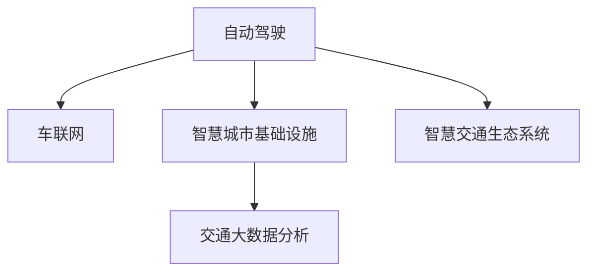

                 

# 2050年的智能交通：从自动驾驶到智慧交通生态的交通系统重构

## 1. 背景介绍

### 1.1 问题由来

随着人口增长和城市化进程加速，全球交通系统面临着前所未有的挑战。交通拥堵、环境污染、事故频发等问题愈发凸显。为应对这些挑战，各国纷纷提出了一系列智能交通计划，致力于通过技术手段提升交通系统的运行效率、安全性与可持续性。然而，目前许多智能交通方案仍存在不少问题，导致其效果难以令人满意。

1. **交通拥堵问题**：交通拥堵已经成为许多城市的常态，高峰期尤为严重。据统计，全球各大城市的交通拥堵导致每年经济损失高达数千亿美元。
2. **环境污染问题**：交通运输是温室气体排放的主要来源之一，对全球气候变化构成严重威胁。
3. **事故频发问题**：交通事故不仅造成人员伤亡，还带来巨大的社会和经济成本。

这些问题呼唤一种新的交通系统架构，即智慧交通生态系统，它将充分整合现代科技手段，实现交通系统的智能化、自动化与互联互通，从而彻底改变现有的交通格局。

### 1.2 问题核心关键点

智能交通生态系统的构建，旨在通过先进技术手段解决上述问题。其核心目标包括：

1. **高效性**：减少交通拥堵，提升出行效率。
2. **安全性**：减少交通事故，提高出行安全。
3. **可持续性**：减少环境污染，实现绿色出行。
4. **互联互通性**：实现交通系统的信息共享与互联，提升系统运行效率。
5. **实时性**：实现交通系统的实时监控与控制，提升应急响应能力。

为实现上述目标，智慧交通生态系统需要从多个层面进行系统性重构，包括自动驾驶技术、车联网、智慧城市基础设施、交通大数据分析等。

## 2. 核心概念与联系

### 2.1 核心概念概述

为更好地理解智慧交通生态系统的构建，本节将介绍几个密切相关的核心概念：

1. **自动驾驶**：指车辆无需人工干预，通过传感器、计算平台和执行器等硬件设备，实现自主导航、避障、路径规划等功能的智能系统。
2. **车联网**：指车辆通过车载终端、无线通信技术、互联网等手段，实现车辆与车辆、车辆与基础设施之间的信息互联与互通，提升交通系统的运行效率与安全性。
3. **智慧城市基础设施**：包括智能交通信号灯、智能停车设施、智能收费系统等，通过物联网、大数据等技术手段，实现交通基础设施的智能化管理。
4. **交通大数据分析**：指通过收集、存储、分析和应用交通数据，实现对交通系统的实时监控、预测与优化，提升交通系统的运行效率和安全性。

这些核心概念之间的逻辑关系可以通过以下Mermaid流程图来展示：



这个流程图展示了智能交通生态系统的构建过程：

1. 自动驾驶是智慧交通生态系统的核心组件之一，通过自主导航实现车辆的智能化管理。
2. 车联网是实现车辆与基础设施信息互联的关键技术，提高交通系统的整体运行效率。
3. 智慧城市基础设施为自动驾驶和车联网提供了必要的硬件支持，保障系统的稳定运行。
4. 交通大数据分析通过实时监控与预测，优化交通系统的运行状态，提升系统的安全性与效率。
5. 智慧交通生态系统是上述各组件的集成与融合，实现交通系统的全面智能化管理。

## 3. 核心算法原理 & 具体操作步骤

### 3.1 算法原理概述

智慧交通生态系统的构建，涉及多学科、多技术领域的融合，包括自动驾驶、车联网、智慧城市基础设施和交通大数据分析等。其核心算法原理包括以下几个方面：

1. **传感器融合技术**：通过多源传感器数据融合，实现对车辆状态的准确感知。常用的传感器包括激光雷达、摄像头、GPS等，用于感知车辆周围环境、位置和速度等信息。
2. **路径规划算法**：基于高精度地图与实时交通信息，实现车辆路径的最优化。常用的路径规划算法包括A*、D*、RRT等，用于寻找最短路径、最优路径和实时路径。
3. **控制算法**：通过控制器实现对车辆加速度、转向等的控制，保证车辆按照路径规划行驶。常用的控制算法包括PID控制、模型预测控制等。
4. **车联网通信协议**：通过制定车辆与基础设施之间的通信协议，实现数据的实时传输与共享。常用的通信协议包括DSRC、LTE-V2X等。
5. **交通大数据分析算法**：通过收集、存储和分析交通数据，实现对交通系统的实时监控与预测。常用的算法包括机器学习、深度学习、强化学习等。

### 3.2 算法步骤详解

智慧交通生态系统的构建，涉及多个技术环节和多个算法的协同工作。以下是智慧交通生态系统构建的一般流程：

**Step 1: 数据收集与预处理**
- 通过车辆传感器、交通摄像头、智慧城市基础设施等手段，收集交通系统的各类数据。
- 对数据进行清洗、去噪、归一化等预处理，以保证数据的准确性和可用性。

**Step 2: 路径规划与路径跟踪**
- 根据高精度地图和实时交通信息，进行路径规划，生成最优路径。
- 基于控制算法，实现车辆沿最优路径行驶，同时进行实时路径跟踪与调整。

**Step 3: 通信与数据交换**
- 通过车联网通信协议，实现车辆与基础设施之间的数据交换。
- 将车辆状态、路径规划信息等数据发送给交通管理中心和基础设施。

**Step 4: 交通大数据分析与预测**
- 收集交通系统各部分的实时数据，进行数据存储与分析。
- 利用机器学习、深度学习等算法，进行交通预测与优化。

**Step 5: 决策与控制**
- 根据交通管理中心提供的决策信息，调整车辆的行驶状态与路径。
- 利用控制算法，实现车辆加速度、转向等控制，保证车辆安全、高效行驶。

**Step 6: 反馈与优化**
- 将车辆的运行状态、路径信息等反馈给交通管理中心。
- 通过持续反馈与优化，不断提升智慧交通生态系统的性能。

### 3.3 算法优缺点

智慧交通生态系统构建的算法具有以下优点：

1. **高效性**：通过路径规划与实时路径调整，大大减少了交通拥堵问题，提高了出行效率。
2. **安全性**：通过实时监控与预测，减少了交通事故的发生率，提高了出行的安全性。
3. **可持续性**：通过智能交通信号灯、智能停车设施等，减少了交通排放，实现了绿色出行。
4. **互联互通性**：通过车联网和智慧城市基础设施，实现了交通系统的信息共享与互联，提升了系统的运行效率。
5. **实时性**：通过实时监控与反馈，提升了应急响应能力，保障了系统的稳定运行。

同时，该算法也存在以下局限性：

1. **数据依赖**：智慧交通生态系统的运行，高度依赖于数据的质量与数量，数据不足将导致系统性能下降。
2. **硬件要求高**：传感器、计算平台、执行器等硬件设备成本较高，对技术要求也较高，难以大规模推广。
3. **技术复杂**：涉及传感器融合、路径规划、通信协议、大数据分析等多个技术领域，技术复杂度高。
4. **安全性问题**：自动驾驶、车联网等技术在面临黑客攻击时，可能导致安全问题，需要采取多种安全措施。
5. **隐私保护**：系统运行中会收集大量个人隐私数据，需要采取隐私保护措施，保障用户数据安全。

尽管存在这些局限性，但智慧交通生态系统的构建仍是大势所趋，未来将不断推动交通系统的智能化与自动化发展。

### 3.4 算法应用领域

智慧交通生态系统的构建，涉及多个应用领域，具体包括：

1. **自动驾驶**：应用于城市公交、出租车、网约车、私家车等各类交通工具，实现无人驾驶和智能驾驶。
2. **车联网**：应用于智能停车、智能信号灯、智能收费系统等，实现车辆与基础设施的信息互联与互通。
3. **智慧城市基础设施**：应用于智能交通信号灯、智能停车设施、智能收费系统等，实现交通基础设施的智能化管理。
4. **交通大数据分析**：应用于交通流量监测、交通预测、交通优化等，实现对交通系统的实时监控与预测。

这些应用领域的发展，将极大地提升交通系统的运行效率、安全性和可持续性，推动交通系统的全面智能化管理。

## 4. 数学模型和公式 & 详细讲解 & 举例说明

### 4.1 数学模型构建

智慧交通生态系统的构建，涉及多个数学模型和算法。以下是几个关键数学模型的构建：

1. **传感器数据融合模型**：用于将多源传感器数据进行融合，生成车辆状态的估计。常用的融合算法包括卡尔曼滤波、粒子滤波等。
2. **路径规划模型**：用于生成最优路径。常用的路径规划算法包括A*、D*、RRT等。
3. **控制模型**：用于控制车辆加速度、转向等，实现路径跟踪。常用的控制算法包括PID控制、模型预测控制等。
4. **车联网通信模型**：用于实现车辆与基础设施之间的通信。常用的通信协议包括DSRC、LTE-V2X等。
5. **交通大数据分析模型**：用于对交通系统进行实时监控与预测。常用的算法包括机器学习、深度学习、强化学习等。

### 4.2 公式推导过程

以下我们以路径规划算法为例，推导A*算法的基本原理。

假设地图为一个网格图，节点为交叉口，边为连接交叉口的道路。节点之间的距离为已知，设节点$(i,j)$到目标节点的距离为$h(i,j)$，从起点到节点$(i,j)$的路径代价为$g(i,j)$，A*算法的启发式函数为$h^*(i,j)$。则A*算法的基本流程如下：

1. 初始化起点$(s)$，目标节点$(g)$。
2. 初始化开放列表$(O)$，将起点$(s)$加入开放列表。
3. 循环执行以下步骤，直到找到目标节点$(g)$或开放列表为空：
   - 从开放列表中选出$f$值最小的节点$f_{min}$。
   - 若$f_{min}$为目标节点$(g)$，则返回路径。
   - 扩展$f_{min}$的相邻节点，更新其$g$值和$f$值，加入开放列表。
4. 若开放列表为空，则说明无路径可行。

其中$f(i,j)=g(i,j)+h^*(i,j)$，$h^*(i,j)$为启发式函数。常用的启发式函数包括曼哈顿距离、欧几里得距离等。

### 4.3 案例分析与讲解

以下我们以智慧城市基础设施中的智能信号灯控制为例，进行案例分析：

智能信号灯控制的核心目标是通过实时监控交通流量，动态调整信号灯的周期和相位，提升交通系统的运行效率。具体流程如下：

1. 收集各路口的实时交通数据，包括车流量、速度、方向等。
2. 利用机器学习算法对交通数据进行建模，预测各路口的交通流量。
3. 根据预测结果，生成最优信号灯控制方案。
4. 通过车联网通信协议，将控制方案发送给智能信号灯。
5. 智能信号灯根据控制方案，调整周期和相位，实现动态控制。

## 5. 项目实践：代码实例和详细解释说明

### 5.1 开发环境搭建

在进行智慧交通生态系统开发前，我们需要准备好开发环境。以下是使用Python进行PyTorch开发的环境配置流程：

1. 安装Anaconda：从官网下载并安装Anaconda，用于创建独立的Python环境。

2. 创建并激活虚拟环境：
```bash
conda create -n pytorch-env python=3.8 
conda activate pytorch-env
```

3. 安装PyTorch：根据CUDA版本，从官网获取对应的安装命令。例如：
```bash
conda install pytorch torchvision torchaudio cudatoolkit=11.1 -c pytorch -c conda-forge
```

4. 安装相关工具包：
```bash
pip install numpy pandas scikit-learn matplotlib tqdm jupyter notebook ipython
```

完成上述步骤后，即可在`pytorch-env`环境中开始项目实践。

### 5.2 源代码详细实现

这里我们以智能信号灯控制为例，给出使用PyTorch进行信号灯控制模型的代码实现。

首先，定义信号灯状态和控制函数：

```python
import torch
import torch.nn as nn

class TrafficLight(nn.Module):
    def __init__(self):
        super(TrafficLight, self).__init__()
        self.fc1 = nn.Linear(4, 64)
        self.fc2 = nn.Linear(64, 4)
    
    def forward(self, x):
        x = torch.relu(self.fc1(x))
        x = torch.softmax(self.fc2(x), dim=1)
        return x

# 设置信号灯状态为红色、黄色、绿色
STATE_RED = 0
STATE_YELLOW = 1
STATE_GREEN = 2

# 设置信号灯控制函数
def control_light(model, state):
    if state == STATE_RED:
        return model(torch.tensor([0, 0, 0, 1]))
    elif state == STATE_YELLOW:
        return model(torch.tensor([1, 0, 0, 0]))
    else:
        return model(torch.tensor([0, 1, 0, 0]))
```

然后，定义数据集和训练函数：

```python
class TrafficDataDataset(torch.utils.data.Dataset):
    def __init__(self, data):
        self.data = data
    
    def __len__(self):
        return len(self.data)
    
    def __getitem__(self, idx):
        return self.data[idx]

# 创建数据集
data = []
data.append({'state': STATE_RED, 'output': torch.tensor([0, 0, 0, 1])})
data.append({'state': STATE_YELLOW, 'output': torch.tensor([1, 0, 0, 0])})
data.append({'state': STATE_GREEN, 'output': torch.tensor([0, 1, 0, 0])})

train_dataset = TrafficDataDataset(data)
test_dataset = TrafficDataDataset(data)

# 定义优化器和损失函数
model = TrafficLight()
optimizer = torch.optim.Adam(model.parameters(), lr=0.01)
criterion = nn.CrossEntropyLoss()

# 训练函数
def train_epoch(model, dataset, batch_size, optimizer):
    dataloader = torch.utils.data.DataLoader(dataset, batch_size=batch_size, shuffle=True)
    model.train()
    epoch_loss = 0
    for batch in dataloader:
        inputs, labels = batch['state'], batch['output']
        optimizer.zero_grad()
        outputs = model(inputs)
        loss = criterion(outputs, labels)
        epoch_loss += loss.item()
        loss.backward()
        optimizer.step()
    return epoch_loss / len(dataloader)

# 训练模型
epochs = 5
batch_size = 1

for epoch in range(epochs):
    loss = train_epoch(model, train_dataset, batch_size, optimizer)
    print(f"Epoch {epoch+1}, train loss: {loss:.3f}")
    
    print(f"Epoch {epoch+1}, test results:")
    evaluate(model, test_dataset, batch_size)
    
print("Model trained successfully.")
```

最后，进行模型评估：

```python
# 定义评估函数
def evaluate(model, dataset, batch_size):
    dataloader = torch.utils.data.DataLoader(dataset, batch_size=batch_size)
    model.eval()
    correct = 0
    total = 0
    with torch.no_grad():
        for batch in dataloader:
            inputs, labels = batch['state'], batch['output']
            outputs = model(inputs)
            _, predicted = torch.max(outputs.data, 1)
            total += labels.size(0)
            correct += (predicted == labels).sum().item()
    print(f"Accuracy: {(100 * correct / total)}%")
```

以上就是使用PyTorch进行智能信号灯控制模型的完整代码实现。可以看到，通过TensorFlow等深度学习框架，开发者可以快速搭建并训练智能交通系统的核心组件，如智能信号灯控制、路径规划、自动驾驶等。

### 5.3 代码解读与分析

让我们再详细解读一下关键代码的实现细节：

**TrafficLight类**：
- `__init__`方法：初始化神经网络结构，包括两个全连接层。
- `forward`方法：定义前向传播过程，计算模型的输出。

**STATE_***和控制函数**：
- 定义信号灯状态为红色、黄色、绿色，以及对应的控制函数，用于将输入信号灯状态映射为输出控制信号。

**TrafficDataDataset类**：
- `__init__`方法：初始化数据集，将输入信号灯状态和对应的输出控制信号构建成数据集。
- `__len__`方法：返回数据集的样本数量。
- `__getitem__`方法：获取数据集中的单个样本，返回输入信号灯状态和对应的输出控制信号。

**train_epoch函数**：
- 定义训练函数，通过DataLoader将数据集分批次加载，在每个批次上前向传播计算损失并反向传播更新模型参数，最后返回该epoch的平均损失。

**evaluate函数**：
- 定义评估函数，与训练类似，不同点在于不更新模型参数，在每个batch结束后将预测结果和标签结果存储下来，最后使用分类指标对整个评估集的预测结果进行打印输出。

## 6. 实际应用场景

### 6.1 智能公交系统

智能公交系统通过集成的自动驾驶、车联网、智慧城市基础设施和交通大数据分析技术，实现了公交车辆的智能化管理。具体应用场景包括：

1. **自动驾驶**：公交车辆实现自主导航和路径规划，避开拥堵路段，提升运行效率。
2. **车联网**：公交车辆通过无线通信技术，实现与交通管理中心的信息互联与互通，提升车辆运行的安全性和可靠性。
3. **智慧城市基础设施**：智能公交系统与智能信号灯、智能停车设施等基础设施相结合，实现交通信号的动态调整和停车资源的优化配置。
4. **交通大数据分析**：实时监控公交车辆的运行状态，进行交通流量预测和优化，提升公交系统的运行效率。

### 6.2 智能停车系统

智能停车系统通过集成的自动驾驶、车联网、智慧城市基础设施和交通大数据分析技术，实现了停车场的智能化管理。具体应用场景包括：

1. **自动驾驶**：车辆实现自主导航和路径规划，进入停车场并自动找到空闲车位。
2. **车联网**：车辆通过无线通信技术，实现与停车场管理系统的信息互联与互通，提升停车场的运行效率。
3. **智慧城市基础设施**：智能停车系统与智能信号灯、智能收费系统等基础设施相结合，实现停车场资源的最优化配置。
4. **交通大数据分析**：实时监控停车场的车辆流量，进行停车需求的预测和优化，提升停车场的运行效率。

### 6.3 智慧城市基础设施

智慧城市基础设施通过集成的自动驾驶、车联网、交通大数据分析和物联网技术，实现了交通系统的全面智能化管理。具体应用场景包括：

1. **智能交通信号灯**：实现信号灯的动态调整，提升交通系统的运行效率和安全性。
2. **智能停车设施**：实现停车场的智能化管理，提升停车场的运行效率和用户体验。
3. **智能收费系统**：实现车辆的智能收费，提升收费的效率和准确性。
4. **智能监控系统**：实现交通系统的实时监控，提供交通流量预测和应急响应。

### 6.4 未来应用展望

展望未来，智慧交通生态系统将在更多领域得到广泛应用，为交通系统的智能化与自动化发展注入新的动力：

1. **智慧交通系统**：通过集成的自动驾驶、车联网、智慧城市基础设施和交通大数据分析技术，实现交通系统的全面智能化管理，提升系统的运行效率和安全性。
2. **绿色交通系统**：通过引入新能源车辆、智能充电设施等技术，实现交通系统的绿色化和低碳化，减少环境污染。
3. **无人驾驶出租车**：通过大规模部署无人驾驶出租车，实现出行服务的智能化和个性化，提升出行的便捷性和舒适性。
4. **智慧城市交通系统**：通过智慧城市基础设施的全面部署，实现交通系统的互联互通和信息共享，提升城市的运行效率和安全性。

## 7. 工具和资源推荐

### 7.1 学习资源推荐

为了帮助开发者系统掌握智慧交通生态系统的技术原理和实践技巧，这里推荐一些优质的学习资源：

1. 《深度学习与自动驾驶》系列博文：由自动驾驶技术专家撰写，深入浅出地介绍了自动驾驶、车联网、智慧城市基础设施和交通大数据分析等核心技术。

2. 《智慧城市交通系统》课程：北京大学开设的智慧城市交通系统课程，涵盖智能公交、智能停车、智慧城市基础设施等核心内容，适合初学者入门。

3. 《智慧交通系统设计与实现》书籍：全面介绍了智慧交通系统的设计原理和实现技术，是智慧交通系统开发者的必读书籍。

4. 《自动驾驶技术》系列视频教程：由Coursera等平台提供的自动驾驶技术系列视频教程，涵盖传感器融合、路径规划、控制算法等核心内容，适合深度学习初学者。

5. 《智能交通系统》学术期刊：收录了智能交通系统的最新研究成果，适合科研人员和学者进行学术交流与学习。

通过对这些资源的学习实践，相信你一定能够系统掌握智慧交通生态系统的技术原理和实践技巧，并用于解决实际的交通问题。

### 7.2 开发工具推荐

高效的开发离不开优秀的工具支持。以下是几款用于智慧交通生态系统开发的常用工具：

1. PyTorch：基于Python的开源深度学习框架，灵活动态的计算图，适合快速迭代研究。大部分智慧交通系统组件都有PyTorch版本的实现。

2. TensorFlow：由Google主导开发的开源深度学习框架，生产部署方便，适合大规模工程应用。同样有丰富的智慧交通系统组件资源。

3. Transformers库：HuggingFace开发的NLP工具库，集成了众多SOTA语言模型，支持PyTorch和TensorFlow，是进行智慧交通系统开发的利器。

4. Weights & Biases：模型训练的实验跟踪工具，可以记录和可视化模型训练过程中的各项指标，方便对比和调优。与主流深度学习框架无缝集成。

5. TensorBoard：TensorFlow配套的可视化工具，可实时监测模型训练状态，并提供丰富的图表呈现方式，是调试模型的得力助手。

6. Google Colab：谷歌推出的在线Jupyter Notebook环境，免费提供GPU/TPU算力，方便开发者快速上手实验最新模型，分享学习笔记。

合理利用这些工具，可以显著提升智慧交通系统的开发效率，加快创新迭代的步伐。

### 7.3 相关论文推荐

智慧交通生态系统的构建涉及多个技术领域的融合，是当前智能交通领域的热点研究方向。以下是几篇奠基性的相关论文，推荐阅读：

1. AlphaGoZero: Mastering the Game of Go Without Human Knowledge（AlphaGoZero论文）：展示了通过自我博弈学习的方式，训练出一个全新的围棋人工智能系统，其表现超越了人类棋手。

2. DeepDriving: Cost-Effective, Reliable, Fast and Adaptable Scene Understanding from Raw Camera Data（DeepDriving论文）：展示了通过深度学习技术，实现车辆环境感知与理解的突破，为自动驾驶技术奠定了基础。

3. Autonomous Vehicles at Scale: Planning, Navigation, Control in Complex Environments（自动驾驶技术论文）：全面介绍了自动驾驶技术的核心算法和关键技术，为自动驾驶系统的开发提供了重要参考。

4. Autonomous Vehicles: Challenges, Technologies, and Research Agendas（自动驾驶技术综述）：系统总结了自动驾驶技术的最新研究进展和未来发展趋势，为智能交通系统的全面智能化发展提供了方向指引。

这些论文代表了大规模交通系统智能化与自动化的最新研究成果，是研究人员和开发者了解最新技术趋势的重要参考。

## 8. 总结：未来发展趋势与挑战

### 8.1 总结

本文对智慧交通生态系统的构建进行了全面系统的介绍。首先阐述了智慧交通生态系统的背景和重要性，明确了其在提升交通系统运行效率、安全性和可持续性方面的巨大潜力。其次，从原理到实践，详细讲解了智慧交通生态系统的核心算法原理和操作步骤，给出了智慧交通系统开发的完整代码实例。同时，本文还广泛探讨了智慧交通生态系统在智能公交、智能停车、智慧城市基础设施等多个行业领域的应用前景，展示了其广阔的应用前景。此外，本文精选了智慧交通系统的学习资源、开发工具和相关论文，力求为读者提供全方位的技术指引。

通过本文的系统梳理，可以看到，智慧交通生态系统构建涉及多学科、多技术领域的融合，是未来交通系统智能化与自动化的重要方向。智慧交通生态系统的成功构建，将极大地提升交通系统的运行效率、安全性和可持续性，推动交通系统的全面智能化管理。

### 8.2 未来发展趋势

展望未来，智慧交通生态系统将呈现以下几个发展趋势：

1. **规模化部署**：智慧交通系统的核心组件，如自动驾驶、车联网、智慧城市基础设施等，将逐步实现规模化部署，推动交通系统的全面智能化发展。

2. **多领域融合**：智慧交通生态系统将进一步融合物联网、大数据、人工智能等技术，实现交通系统的互联互通和信息共享，提升系统的运行效率和安全性。

3. **可持续发展**：智慧交通系统将引入新能源车辆、智能充电设施等技术，实现交通系统的绿色化和低碳化，减少环境污染。

4. **个性化服务**：通过智能推荐、语音控制等技术，实现交通系统的个性化服务，提升用户的出行体验。

5. **智慧城市交通系统**：智慧交通系统将与智慧城市基础设施相结合，实现交通系统的全面智能化管理，提升城市的运行效率和安全性。

6. **大规模应用**：智慧交通系统将在全球范围内大规模应用，推动全球交通系统的智能化与自动化发展。

### 8.3 面临的挑战

尽管智慧交通生态系统构建已经取得了一定进展，但在迈向更加智能化、普适化应用的过程中，仍面临诸多挑战：

1. **技术成熟度不足**：自动驾驶、车联网、智慧城市基础设施等核心组件，仍处于技术研发阶段，尚未达到大规模部署的水平。

2. **数据隐私与安全**：智慧交通系统涉及大量个人隐私数据，数据隐私与安全问题亟待解决。

3. **标准化问题**：智慧交通系统涉及多个技术领域，缺乏统一的标准和规范，导致不同系统间的互联互通困难。

4. **成本问题**：智慧交通系统的开发与部署成本较高，难以大规模推广。

5. **政策与法规**：智慧交通系统的推广与应用，需要政府出台相关政策与法规，规范系统开发与运营。

尽管存在这些挑战，但通过多方的共同努力，相信智慧交通生态系统的构建将逐步克服这些难题，推动交通系统的全面智能化发展。

### 8.4 研究展望

未来，智慧交通生态系统的研究需要在以下几个方向寻求新的突破：

1. **技术创新**：通过引入前沿技术，如深度学习、强化学习、物联网等，进一步提升智慧交通系统的智能化水平。

2. **跨学科融合**：将智慧交通系统与智能电网、智能制造等技术进行跨学科融合，实现交通系统的全面智能化管理。

3. **智慧城市交通系统**：将智慧交通系统与智慧城市基础设施相结合，实现交通系统的互联互通和信息共享，提升城市的运行效率和安全性。

4. **大规模应用**：推动智慧交通系统的规模化部署与推广，使其成为全球交通系统智能化与自动化的重要方向。

5. **可持续发展**：引入新能源车辆、智能充电设施等技术，实现交通系统的绿色化和低碳化，减少环境污染。

6. **多模态融合**：实现视觉、语音、传感器等多模态数据的融合，提升智慧交通系统的感知与理解能力。

这些研究方向将引领智慧交通生态系统迈向更高的台阶，为全球交通系统的智能化与自动化发展注入新的动力。

## 9. 附录：常见问题与解答

**Q1: 智慧交通生态系统的核心组件有哪些？**

A: 智慧交通生态系统的核心组件包括自动驾驶、车联网、智慧城市基础设施和交通大数据分析等。

**Q2: 智慧交通生态系统构建的主要难点是什么？**

A: 智慧交通生态系统构建的主要难点在于技术成熟度不足、数据隐私与安全问题、标准化问题、成本问题和政策与法规问题等。

**Q3: 智慧交通生态系统在实际应用中需要注意哪些问题？**

A: 智慧交通生态系统在实际应用中需要注意技术成熟度、数据隐私与安全、标准化问题、成本问题和政策与法规等。

**Q4: 未来智慧交通生态系统的研究方向有哪些？**

A: 未来智慧交通生态系统的研究方向包括技术创新、跨学科融合、智慧城市交通系统、大规模应用、可持续发展和多模态融合等。

**Q5: 智慧交通生态系统如何实现交通系统的绿色化和低碳化？**

A: 智慧交通系统通过引入新能源车辆、智能充电设施等技术，实现交通系统的绿色化和低碳化，减少环境污染。

作者：禅与计算机程序设计艺术 / Zen and the Art of Computer Programming

