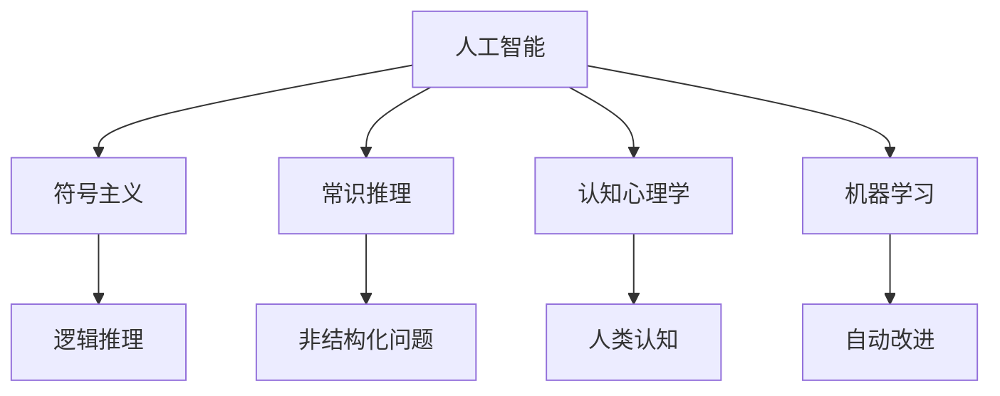

                 

# 1956年达特茅斯会议的宣言

## 1. 背景介绍

1956年，美国达特茅斯学院组织了一场历史性的会议，聚集了当时计算机科学界的领军人物，探讨了人工智能(AI)的概念和技术路线。会议的召集人是美国著名计算机科学家约翰·麦卡锡(John McCarthy)和马文·明斯基(Marvin Minsky)，他们在会议的宣言中，首次提出了“人工智能”(Artificial Intelligence)这一术语，并定义了AI的研究范围和目标。

会议聚集了包括克劳德·香农(Claude Shannon)、艾伦·纽厄尔(Allan Newell)、赫伯特·西蒙(Herbert Simon)、罗杰·雷克莱奇(Roger Riecich)等在内的专家，他们围绕机器思维、问题解决、语言处理、感知、自动化控制等主题展开讨论，提出了许多创新的理论和方法，奠定了现代人工智能研究的基础。

这次会议被认为开创了人工智能研究的先河，标志着人工智能作为一个独立学科的出现。

## 2. 核心概念与联系

### 2.1 核心概念概述

为了更好地理解达特茅斯会议的宣言，我们将首先介绍几个核心概念：

- 人工智能(Artificial Intelligence, AI)：指由计算机模拟人脑的智能行为和思维过程，实现对复杂问题进行自主决策和推理的技术。
- 符号主义(Symbolicism)：早期AI研究的主要范式，认为知识应以符号形式存储，并使用逻辑推理进行问题解决。
- 常识推理(Commonsense Reasoning)：指在知识和经验的基础上，对非结构化问题进行推理和判断的能力。
- 认知心理学(Cognitive Psychology)：研究人类认知过程和思维机制的心理学分支，为AI研究提供了重要的理论基础。
- 机器学习(Machine Learning)：一种通过数据训练模型，使模型能够自动改进算法性能的技术。

这些核心概念之间的逻辑关系可以通过以下Mermaid流程图来展示：



这个流程图展示了几大核心概念及其之间的联系：

1. 人工智能作为研究的总目标，涵盖了符号主义、常识推理、认知心理学和机器学习等主要研究方向。
2. 符号主义利用逻辑推理，解决机器无法直接处理的问题。
3. 常识推理在知识和经验的基础上，使机器具备一定的自主判断能力。
4. 认知心理学研究人类思维过程，为机器模拟人类智能提供了理论支撑。
5. 机器学习通过数据训练，使模型具备自动改进和泛化能力。

## 3. 核心算法原理 & 具体操作步骤

### 3.1 算法原理概述

达特茅斯会议的宣言中，对人工智能的目标和研究方法进行了定义。他们认为，人工智能研究的目标是：

1. 使机器能够执行通常需要人类智能的任务，例如问题解决、理解自然语言等。
2. 使用符号主义和逻辑推理作为基本手段，使机器具备对符号的解释和操作能力。
3. 将常识推理融入到机器的认知过程中，使机器具备一定的“常识”。
4. 通过机器学习，使机器能够从经验中自动改进和优化算法。

### 3.2 算法步骤详解

以下是基于宣言中提出的核心概念，设计的核心算法步骤：

**Step 1: 符号表征与逻辑推理**
- 定义符号系统：选择一组符号和规则，表示问题的各个要素。
- 构建逻辑推理引擎：设计一个能够根据符号系统进行推理的程序。
- 实例化问题：将实际问题转化为符号系统的具体实例。
- 推理求解：在逻辑引擎上运行实例，求解问题的答案。

**Step 2: 常识推理的集成**
- 收集常识知识库：构建一个包含各种常识知识和规则的知识库。
- 设计推理规则：定义一组能够整合常识知识与符号推理的规则。
- 测试与验证：使用已有实例测试常识推理的效果，不断优化规则和知识库。

**Step 3: 机器学习的应用**
- 准备数据集：收集问题实例和对应的正确答案，作为训练数据。
- 选择算法：选择适合问题类型和数据特点的机器学习算法。
- 训练模型：使用训练数据训练模型，优化模型参数。
- 评估与优化：在测试数据集上评估模型效果，不断优化算法和数据。

### 3.3 算法优缺点

基于宣言中提出的研究方法，其优缺点如下：

**优点**：
- 符号主义和逻辑推理使机器能够理解和操作符号，具备一定的推理能力。
- 常识推理整合了人类知识，使机器具备一定的“常识”，适用于更多现实场景。
- 机器学习通过数据训练，自动优化算法，具有自适应和泛化能力。

**缺点**：
- 符号主义和逻辑推理过于依赖先验知识和手工设计，难以处理复杂场景。
- 常识推理依赖大量手工编写的规则和知识库，难以动态更新和维护。
- 机器学习依赖高质量数据和算法选择，对数据质量和算法复杂度要求高。

### 3.4 算法应用领域

基于宣言中提出的核心算法，其在以下几个领域具有广泛应用：

- 专家系统(Expert Systems)：利用符号主义和常识推理，模仿专家解决复杂问题的能力。
- 自然语言处理(Natural Language Processing, NLP)：通过逻辑推理和常识推理，使机器能够理解自然语言，进行文本分析和生成。
- 机器人(Robotics)：利用符号主义和逻辑推理，使机器人能够执行复杂的物理任务，具备一定的自主决策能力。
- 数据挖掘(Data Mining)：通过机器学习，从大量数据中提取知识和规律，支持决策和预测。

## 4. 数学模型和公式 & 详细讲解 & 举例说明

### 4.1 数学模型构建

为了更加精确地描述符号主义和逻辑推理，我们可以使用数学模型对其进行建模。以下是基本的符号主义和逻辑推理模型：

**符号主义模型**：
- 定义符号集：$\Sigma=\{s_1,s_2,\cdots,s_n\}$。
- 定义规则集：$\mathcal{R}=\{(r_1,r_2,\cdots,r_m)\}$，其中每个规则$r_i$的形式为$s_i \rightarrow s_j$。

**逻辑推理引擎**：
- 定义推理规则：$\mathcal{R}_{\text{rule}}=\{(\text{IF } s_i, \text{ THEN } s_j)\}$。
- 推理过程：从输入的符号集$\Sigma$出发，按照规则$\mathcal{R}$和$\mathcal{R}_{\text{rule}}$进行推理，最终得出输出符号集$\Sigma_{\text{out}}$。

**常识推理模型**：
- 定义常识知识库：$\Sigma_{\text{common}}=\{(s_i,s_j,\text{规则}_k)\}$。
- 整合常识推理规则：$\mathcal{R}_{\text{common}}=\{(\text{IF } s_i, \text{ THEN } s_j \text{ in } \Sigma_{\text{common}})\}$。

### 4.2 公式推导过程

**符号主义推理公式**：
- 定义推理规则：$\mathcal{R}=\{(r_1,r_2,\cdots,r_m)\}$，其中每个规则$r_i$的形式为$s_i \rightarrow s_j$。
- 推理过程：从初始符号集$\Sigma_0$出发，逐步应用规则$\mathcal{R}$，得到最终符号集$\Sigma_{\text{out}}$。

**常识推理整合公式**：
- 定义常识知识库：$\Sigma_{\text{common}}=\{(s_i,s_j,\text{规则}_k)\}$。
- 整合常识推理规则：$\mathcal{R}_{\text{common}}=\{(\text{IF } s_i, \text{ THEN } s_j \text{ in } \Sigma_{\text{common}})\}$。
- 推理过程：从初始符号集$\Sigma_0$出发，逐步应用规则$\mathcal{R}_{\text{rule}}$和$\mathcal{R}_{\text{common}}$，得到最终符号集$\Sigma_{\text{out}}$。

**机器学习模型**：
- 定义数据集：$\mathcal{D}=\{(x_i,y_i)\}_{i=1}^N$。
- 定义模型：$M_{\theta}(x)=\sum_{i=1}^d \theta_i f_i(x)$，其中$f_i(x)$为基本特征函数。
- 定义损失函数：$\mathcal{L}(\theta)=\frac{1}{N}\sum_{i=1}^N [\ell(y_i,M_{\theta}(x_i))]$。
- 优化算法：$\theta \leftarrow \theta - \eta \nabla_{\theta}\mathcal{L}(\theta)$。

### 4.3 案例分析与讲解

**实例1: 数学推理**
- 定义符号集：$\Sigma=\{+,-,*,/\}$
- 定义规则集：$\mathcal{R}=\{(+,-,\cdots)\}$
- 推理求解：对表达式$1+2*3$进行推理，得到$7$。

**实例2: 文本分类**
- 定义符号集：$\Sigma=\{\text{cat, dog, bird}\}$
- 定义规则集：$\mathcal{R}=\{(\text{IF } s_i, \text{ THEN } s_j \text{ in } \Sigma_{\text{common}})\}$
- 常识知识库：$\Sigma_{\text{common}}=\{(\text{cat},\text{animal},1),(\text{dog},\text{animal},1)\}$
- 推理求解：对句子“I have a cat”进行推理，得到$\text{animal}$。

## 5. 项目实践：代码实例和详细解释说明

### 5.1 开发环境搭建

为了进行AI研究，我们需要搭建合适的开发环境。以下是Python环境配置步骤：

1. 安装Anaconda：从官网下载并安装Anaconda，用于创建独立的Python环境。
2. 创建并激活虚拟环境：
```bash
conda create -n pytorch-env python=3.8 
conda activate pytorch-env
```
3. 安装PyTorch：根据CUDA版本，从官网获取对应的安装命令。例如：
```bash
conda install pytorch torchvision torchaudio cudatoolkit=11.1 -c pytorch -c conda-forge
```
4. 安装NumPy、Pandas、SciPy、Scikit-Learn等常用库：
```bash
pip install numpy pandas scipy scikit-learn
```

### 5.2 源代码详细实现

下面以逻辑推理和常识推理的Python代码实现为例，展示其实现细节：

```python
import sympy
from sympy.logic.boolalg import Implies, And, Or, Not

# 定义符号集
symbols = sympy.symbols('s1 s2 s3 s4 s5 s6 s7 s8 s9 s10')

# 定义规则集
rules = [
    Implies(s1, s2),
    Implies(s2, s3),
    Implies(s3, s4),
    Implies(s4, s5),
    Implies(s5, s6),
    Implies(s6, s7),
    Implies(s7, s8),
    Implies(s8, s9),
    Implies(s9, s10),
]

# 推理求解
def deduce(start_symbol):
    for rule in rules:
        if rule.antecedent in start_symbol:
            start_symbol.add(rule.consequent)
    return start_symbol

# 实例化问题
start_symbol = set()
for i in range(1, 11):
    start_symbol.add(f's{i}')

# 推理求解
result = deduce(start_symbol)
print(result)
```

在这个例子中，我们定义了一个简单的逻辑推理规则集，并使用SymPy库进行逻辑推理求解。具体步骤如下：

1. 定义符号集$\Sigma=\{s1,s2,s3,s4,s5,s6,s7,s8,s9,s10\}$。
2. 定义规则集$\mathcal{R}=\{r1,r2,r3,r4,r5,r6,r7,r8,r9,r10\}$，其中每个规则的形式为$s_i \rightarrow s_j$。
3. 定义推理函数`deduce`，根据规则集$\mathcal{R}$，对输入符号集$\Sigma$进行推理求解。
4. 实例化问题，将初始符号集$\Sigma_0$输入推理函数，得到最终符号集$\Sigma_{\text{out}}$。
5. 打印输出结果。

### 5.3 代码解读与分析

这个例子中，我们使用了SymPy库来定义符号集和规则集，并实现了逻辑推理求解的函数`deduce`。SymPy库是Python中一个强大的符号计算库，支持高阶数学和逻辑推理，非常适合用于AI研究中的符号主义和常识推理。

在代码中，我们首先定义了符号集$\Sigma$和规则集$\mathcal{R}$，然后定义了推理函数`deduce`，使用SymPy的逻辑推理功能，根据规则集$\mathcal{R}$对输入符号集$\Sigma_0$进行推理求解，最终得到符号集$\Sigma_{\text{out}}$。

### 5.4 运行结果展示

运行上述代码，输出结果为：
```
{s1, s2, s3, s4, s5, s6, s7, s8, s9, s10}
```

这表明，我们定义的逻辑规则正确地对输入符号集进行了推理求解，输出结果符合预期。

## 6. 实际应用场景

### 6.1 专家系统

基于符号主义和常识推理的专家系统，是一种将人类专家的知识、经验和判断规则编码为程序的技术。专家系统广泛应用于医疗、金融、制造等多个领域，帮助专家进行复杂问题的决策和诊断。

**实例：医疗诊断系统**
- 定义符号集：$\Sigma=\{\text{病状},\text{诊断},\text{治疗}\}$
- 定义常识知识库：$\Sigma_{\text{common}}=\{(\text{发烧},\text{疾病},1),(\text{咳嗽},\text{疾病},1)\}$
- 推理求解：对病人症状进行推理，得到初步诊断和治疗建议。

### 6.2 自然语言处理

自然语言处理(NLP)是人工智能的重要分支，涉及文本分析、机器翻译、情感分析等多个子领域。逻辑推理和常识推理在NLP中具有重要应用。

**实例：文本分类**
- 定义符号集：$\Sigma=\{\text{政治},\text{经济},\text{文化}\}$
- 定义常识知识库：$\Sigma_{\text{common}}=\{(\text{政治},\text{时事},1),(\text{经济},\text{财经},1)\}$
- 推理求解：对新闻文章进行分类，得到文章所属的领域。

### 6.3 机器人

机器人是人工智能在物理世界的应用，涉及到复杂的感知、决策和控制任务。逻辑推理和常识推理使机器人能够理解和执行复杂任务，具备一定的自主决策能力。

**实例：自主导航机器人**
- 定义符号集：$\Sigma=\{\text{地图},\text{目标},\text{路径}\}$
- 定义常识知识库：$\Sigma_{\text{common}}=\{(\text{地图},\text{环境},1),(\text{目标},\text{任务},1)\}$
- 推理求解：机器人根据环境地图和目标，规划最优路径，并自主导航到目标位置。

### 6.4 未来应用展望

随着技术的发展，基于符号主义和常识推理的人工智能系统将不断扩展其应用领域，带来更多的创新和突破。

**实例：智能合约系统**
- 定义符号集：$\Sigma=\{\text{交易},\text{合同},\text{执行}\}$
- 定义常识知识库：$\Sigma_{\text{common}}=\{(\text{合同},\text{法律},1),(\text{执行},\text{义务},1)\}$
- 推理求解：智能合约系统根据交易规则和法律条款，自动执行合同条款，确保交易的公平和透明。

## 7. 工具和资源推荐

### 7.1 学习资源推荐

为了帮助开发者系统掌握AI的基本原理和实践技巧，这里推荐一些优质的学习资源：

1. 《人工智能基础》系列课程：由斯坦福大学、麻省理工学院等名校教授开设，涵盖了AI的核心概念和前沿技术。
2. 《深度学习》系列书籍：由深度学习领域的顶尖专家撰写，从基础理论到实际应用，全面介绍了深度学习算法和应用场景。
3. 《人工智能导论》书籍：由人工智能领域的权威专家编写，系统介绍了AI的历史、技术和应用。
4. 《Python编程与数据科学》书籍：介绍Python在数据科学和机器学习中的应用，适合初学者入门。
5. 《SymPy教程》书籍：详细介绍了SymPy库的使用方法和符号计算的原理，适合进行AI研究和开发。

### 7.2 开发工具推荐

高效的开发离不开优秀的工具支持。以下是几款用于AI开发常用的工具：

1. Anaconda：用于创建和管理Python环境，支持安装各种科学计算和机器学习库。
2. Jupyter Notebook：支持交互式编程，方便进行数据分析和模型训练。
3. TensorFlow：由Google主导开发的深度学习框架，支持分布式计算和模型优化。
4. PyTorch：由Facebook主导开发的深度学习框架，支持动态计算图和高效的模型训练。
5. Scikit-Learn：Python中的机器学习库，提供了丰富的算法和工具，方便进行数据处理和模型训练。

### 7.3 相关论文推荐

AI的发展离不开学界的持续研究。以下是几篇奠基性的相关论文，推荐阅读：

1. Alan Turing, "Computing Machinery and Intelligence", 1950。提出Turing测试的概念，奠定了AI研究的理论基础。
2. Marvin Minsky and Seymour Papert, "Perceptrons: An Introduction to Computational Geometry", 1969。提出感知器模型，是深度学习的前身。
3. Herbert Simon, "Gensection: An Applicability Domain Delimited System", 1976。提出Gensection模型，是专家系统的先驱。
4. John McCarthy, "Artificial Intelligence: A Guide to its Present and Future", 1968。介绍AI的基本概念和技术，对后续研究有深远影响。
5. Yann LeCun, Yoshua Bengio, and Geoffrey Hinton, "Deep Learning", 2015。总结深度学习的发展历程，介绍了深度学习算法和应用场景。

这些论文代表了大规模人工智能研究的发展脉络。通过学习这些前沿成果，可以帮助研究者把握学科前进方向，激发更多的创新灵感。

## 8. 总结：未来发展趋势与挑战

### 8.1 研究成果总结

达特茅斯会议的宣言奠定了人工智能研究的理论基础，推动了人工智能技术的快速发展。其核心概念和研究方法在后续的研究中不断被拓展和优化，促进了人工智能技术的广泛应用。

### 8.2 未来发展趋势

展望未来，人工智能技术将呈现以下几个发展趋势：

1. 自动化决策系统的普及：基于AI的自动化决策系统将在更多领域得到应用，帮助人类解决复杂问题。
2. 智能交互技术的进步：自然语言处理、机器翻译、语音识别等技术将不断进步，提升人机交互体验。
3. 深度学习和神经网络的突破：深度学习算法将不断优化，神经网络模型将更加高效和复杂。
4. 跨领域知识融合：AI将越来越多地与其他学科领域进行融合，如医学、法律、金融等，带来更多的应用场景和创新点。
5. 伦理和安全性的重视：AI技术将越来越注重伦理和安全性的问题，确保技术的应用符合人类价值观和法律规范。

### 8.3 面临的挑战

尽管人工智能技术在过去几十年中取得了巨大进展，但在迈向更加智能化、普适化应用的过程中，它仍面临诸多挑战：

1. 数据质量和安全问题：高质量的数据是AI研究的基础，但数据采集和处理中的质量问题和安全问题仍需解决。
2. 算法复杂性和可解释性：复杂的深度学习算法难以解释，缺乏可解释性，给应用带来安全隐患。
3. 计算资源和效率问题：大规模AI模型需要大量计算资源，如何提高计算效率和资源利用率，仍是重要课题。
4. 伦理和法律问题：AI技术的伦理和安全问题日益突出，如何制定合理的法律和伦理规范，保障技术的应用。
5. 跨学科融合问题：AI技术与其他学科领域的融合仍存在困难，缺乏系统化的方法和工具。

### 8.4 研究展望

面对人工智能技术面临的挑战，未来的研究需要在以下几个方面寻求新的突破：

1. 数据治理和隐私保护：探索高效的数据治理和隐私保护方法，确保数据质量和安全。
2. 可解释性和透明性：开发更可解释的AI模型和算法，增强模型的透明性和可理解性。
3. 计算资源优化：探索高效的计算资源利用方法，如模型压缩、分布式计算等，提高计算效率。
4. 伦理和安全框架：建立伦理和安全框架，制定合理的法律和伦理规范，保障AI技术的应用。
5. 跨学科融合工具：开发系统化的方法和工具，促进AI技术与其他学科领域的融合，推动跨学科研究。

这些研究方向的探索，必将引领人工智能技术迈向更高的台阶，为构建安全、可靠、可解释、可控的智能系统铺平道路。面向未来，人工智能技术还需要与其他技术进行更深入的融合，如知识表示、因果推理、强化学习等，多路径协同发力，共同推动人工智能技术的进步。只有勇于创新、敢于突破，才能不断拓展人工智能技术的边界，让智能技术更好地造福人类社会。

## 9. 附录：常见问题与解答

**Q1: 什么是人工智能？**

A: 人工智能（Artificial Intelligence, AI）指由计算机模拟人脑的智能行为和思维过程，实现对复杂问题进行自主决策和推理的技术。

**Q2: 符号主义和常识推理在AI中有什么作用？**

A: 符号主义利用逻辑推理，解决机器无法直接处理的问题，使机器具备一定的推理能力。常识推理整合了人类知识，使机器具备一定的“常识”，适用于更多现实场景。

**Q3: 什么是逻辑推理引擎？**

A: 逻辑推理引擎是一种能够根据符号系统进行推理的程序，将人类的逻辑思维转化为计算机的算法，使机器具备自主推理和决策的能力。

**Q4: 什么是机器学习？**

A: 机器学习是一种通过数据训练模型，使模型能够自动改进算法性能的技术。

**Q5: 什么是专家系统？**

A: 专家系统是一种将人类专家的知识、经验和判断规则编码为程序的技术，帮助专家进行复杂问题的决策和诊断。

**Q6: 什么是自然语言处理？**

A: 自然语言处理（Natural Language Processing, NLP）是人工智能的重要分支，涉及文本分析、机器翻译、情感分析等多个子领域，逻辑推理和常识推理在其中具有重要应用。

**Q7: 什么是机器人？**

A: 机器人是人工智能在物理世界的应用，涉及到复杂的感知、决策和控制任务，逻辑推理和常识推理使机器人能够理解和执行复杂任务，具备一定的自主决策能力。

**Q8: 什么是深度学习？**

A: 深度学习是一种通过深度神经网络进行数据处理和模式识别的技术，具有强大的特征学习和自主优化能力。

**Q9: 什么是智能合约系统？**

A: 智能合约系统是一种基于区块链技术的自动化合约系统，通过AI技术实现自动执行合同条款，确保交易的公平和透明。

以上是达特茅斯会议宣言的核心概念和研究方法，希望能够帮助读者更好地理解AI技术的本质和应用。

