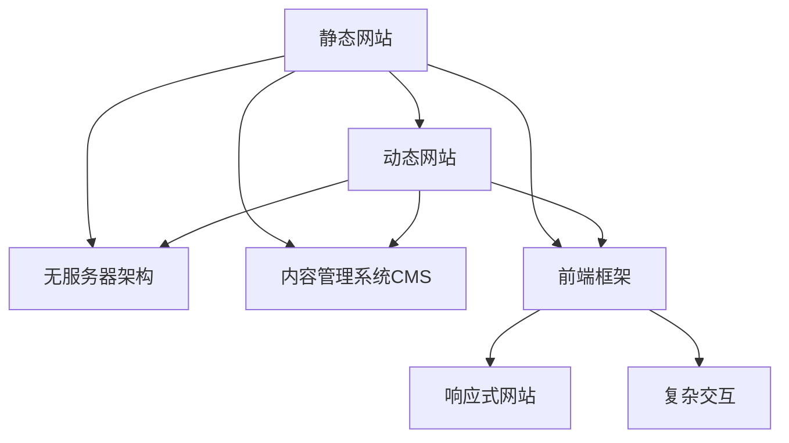

                 

# 建立个人网站：展示你的专业知识和成果

## 1. 背景介绍

### 1.1 问题由来
在数字化时代，个人品牌和影响力逐渐成为职场竞争的重要指标。作为一名人工智能专家，建立个人网站不仅是展示技术成果的途径，更是建立专业声誉、吸引人才和资源的关键渠道。网站可以承载博客、论文、项目案例、技术讲演等多种形式的内容，是技术人对外交流、合作、招聘的重要平台。

然而，如何搭建一个专业高效、功能丰富的个人网站，对于许多技术人来说依然是个难题。搭建网站的过程中，容易陷入以下常见误区：
1. 缺乏个性化设计，网站风格雷同。
2. 功能设计不全面，不能覆盖个人技术能力的全貌。
3. 使用成本高，缺乏维护的积极性。
4. 难以适配多种设备，用户体验不佳。

为了帮助技术人更好地展示自己的专业知识和成果，本文将详细介绍如何搭建一个高效、专业的个人网站，并结合实战案例和工具推荐，让读者能快速上手，打造出个人品牌。

### 1.2 问题核心关键点
本文的核心内容将围绕以下几个方面展开：
- 设计网站的主题和布局。
- 确定网站的功能需求和内容分类。
- 选择适用的搭建平台和工具。
- 实现网站的代码和技术细节。
- 测试和优化网站的性能和功能。

通过理解这些关键点，并结合实际案例的讲解，读者将能够系统性地搭建自己的个人网站，展示丰富的技术成果和专业能力。

## 2. 核心概念与联系

### 2.1 核心概念概述

在探讨个人网站的搭建之前，我们先介绍几个核心概念及其相互之间的联系：

1. **静态网站**：指在服务器端生成网页，然后静态存储在服务器上，直接提供给客户端的网站。优点是速度快、维护成本低，缺点是不支持动态内容。
2. **动态网站**：指使用服务器端语言（如Python、PHP等）生成网页，然后动态存储在服务器上，根据用户请求实时生成和返回的网站。优点是支持复杂动态交互，缺点是性能要求高、维护成本高。
3. **无服务器架构(Serverless Architecture)**：指将后端逻辑放在云函数中运行，按需调用，无需自己管理服务器。优点是节省服务器运维成本，按使用量计费，伸缩性高。
4. **内容管理系统CMS**：指提供网站管理功能，如内容编辑、用户管理、插件扩展等，以简化网站的搭建和维护过程的工具。
5. **前端框架**：指用于开发响应式网站和复杂交互的网站框架，如React、Vue等。

这些核心概念通过以下Mermaid流程图展现它们之间的相互关系：



该图显示了网站搭建技术栈的层次和各个组件之间的相互依赖关系。静态网站可以采用无服务器架构，动态网站也可结合内容管理系统和前端框架实现复杂功能。

## 3. 核心算法原理 & 具体操作步骤
### 3.1 算法原理概述

个人网站的搭建，本质上是一个系统工程，涉及多方面的设计和实现。主要算法原理包括：

1. **网站结构设计**：确定网站的内容结构、导航和布局。
2. **前端开发**：使用HTML、CSS、JavaScript等技术开发网站前端。
3. **后端开发**：使用Python、PHP、Node.js等技术开发网站后端逻辑。
4. **数据库设计**：设计数据库结构，存储用户数据、文章内容、评论等。
5. **安全设计**：采用HTTPS、CSRF防护、密码加密等技术保证网站安全性。
6. **测试和优化**：通过自动化测试和性能优化提升网站质量。

本文将按照以上步骤，详细介绍如何实现一个高效、专业的个人网站。

### 3.2 算法步骤详解

以下是搭建一个高效个人网站的具体步骤：

**Step 1: 确定网站目标和内容**
- 明确个人网站的定位（如技术博客、技术讲演、招聘页等）。
- 规划网站的主要内容和页面，如首页、博客、论文、项目、简历、联系等。

**Step 2: 设计网站主题和布局**
- 根据网站定位选择合适的颜色、字体、图片等设计元素，构建网站整体风格。
- 设计网站的导航栏和页面布局，确保信息展示清晰、逻辑流畅。

**Step 3: 选择搭建平台和工具**
- 选择合适的搭建平台，如WordPress、Ghost、Jekyll等。
- 选择适合的前端框架，如React、Vue、Angular等。
- 选择合适的内容管理系统，如WordPress、Drupal、Joomla等。

**Step 4: 开发网站前端**
- 使用HTML、CSS、JavaScript等技术开发网站前端界面。
- 实现响应式设计，确保网站在各种设备上都能良好展示。

**Step 5: 开发网站后端**
- 使用Python、PHP、Node.js等后端技术，开发网站逻辑功能。
- 实现用户注册、登录、评论、点赞、文章发布等基础功能。

**Step 6: 数据库设计**
- 设计数据库表结构，存储文章、用户、评论、日志等数据。
- 使用SQL或NoSQL数据库，根据网站需求选择合适的数据存储方案。

**Step 7: 网站安全设计**
- 实现网站的安全措施，如SSL证书、验证码、密码加密、XSS防护等。
- 定期备份数据，确保网站数据安全和稳定运行。

**Step 8: 测试和优化**
- 使用自动化测试工具，如Selenium、Jest、Jasmine等，测试网站功能和性能。
- 优化代码性能，确保网站运行速度快、稳定性高。

### 3.3 算法优缺点

个人网站搭建的优势包括：
1. 展示个人技术成果和专业能力，增强职业竞争力。
2. 提供个人展示窗口，吸引更多人才和资源。
3. 搭建成本较低，且可以自主维护，灵活性高。

劣势主要在于：
1. 技术门槛较高，需要掌握前端、后端和数据库等知识。
2. 缺乏专业设计，网站美观度和用户体验可能不足。
3. 需要持续维护和更新，确保网站长期稳定运行。

了解这些优缺点，可以更好地规划网站开发，并合理评估时间和资源投入。

### 3.4 算法应用领域

个人网站的搭建技术，可以广泛应用在以下场景：
- 技术博客：发布博客文章、技术总结、学习笔记等。
- 技术讲演：发布技术视频、PPT、讲演稿等。
- 个人简历：展示个人经历、项目案例、技能证书等。
- 在线课程：发布教学视频、课程笔记、编程题等。
- 技术论坛：创建技术交流、资源分享、问答讨论等论坛。

这些应用领域将有助于提升个人技术影响力和专业声誉。

## 4. 数学模型和公式 & 详细讲解 & 举例说明（备注：数学公式请使用latex格式，latex嵌入文中独立段落使用 $$，段落内使用 $)
### 4.1 数学模型构建

假设一个网站有n篇文章，每篇文章的访问次数为$a_i$，页面停留时间为$t_i$，页面浏览深度为$d_i$。文章的总浏览量为$A$，总停留时间为$T$，总浏览深度为$D$。

网站的用户停留时间$U$和跳出率$C$可以通过以下公式计算：

$$
U = \frac{T}{A}, \quad C = 1 - \frac{T}{A}
$$

其中$A$可以通过页面浏览深度$d_i$和浏览量$a_i$计算得到：

$$
A = \sum_{i=1}^n a_i
$$

通过计算停留时间和跳出率，可以评估网站的用户体验和用户黏性。

### 4.2 公式推导过程

通过停留时间$U$和跳出率$C$的计算，可以进一步推导出以下指标：

1. **平均页面停留时间**：
$$
\bar{t} = \frac{T}{A} = U
$$

2. **平均页面浏览深度**：
$$
\bar{d} = \frac{D}{A}
$$

3. **跳出率占比**：
$$
R = \frac{T - C}{T} = 1 - C
$$

通过这些指标，可以全面评估网站的用户体验和浏览效率，并进行针对性的优化。

### 4.3 案例分析与讲解

以下是一个技术博客网站的案例分析：

假设一个技术博客网站有1000篇文章，每篇文章的访问次数为1000次，页面停留时间为2分钟，页面浏览深度为5页。网站总访问量为10000次，总浏览时间为20000分钟，总浏览深度为5000页。

计算用户停留时间$U$和跳出率$C$：

$$
U = \frac{20000}{10000} = 2 \text{分钟}, \quad C = 1 - \frac{20000}{10000} = 0.5
$$

平均页面停留时间为2分钟，平均页面浏览深度为5页。跳出率占比为0.5，说明网站用户跳出率较高，需要优化用户体验和内容质量。

## 5. 项目实践：代码实例和详细解释说明
### 5.1 开发环境搭建

搭建开发环境，需要以下步骤：

1. 安装开发工具：如Python、Node.js、SQLite等。
2. 配置版本控制系统：如Git、SVN等。
3. 设置开发工具链：如Webpack、npm、yarn等。
4. 搭建开发环境：如Docker、Kubernetes等。

以下是一个开发环境的配置示例：

```bash
# 安装Python和pip
sudo apt-get install python3 python3-pip
pip3 install numpy pandas scikit-learn

# 安装Node.js和npm
sudo apt-get install nodejs npm

# 安装SQLite
sudo apt-get install sqlite3

# 安装Git
sudo apt-get install git

# 安装Webpack
npm install webpack --save-dev
```

完成以上步骤后，即可开始开发。

### 5.2 源代码详细实现

以下是使用Jekyll搭建静态网站的技术实现：

1. 安装Jekyll：
```bash
gem install jekyll bundler
```

2. 创建Jekyll项目：
```bash
jekyll new mysite
cd mysite
```

3. 配置网站：
在`_config.yml`文件中配置网站信息：

```yaml
title: My Personal Website
description: "My personal website with articles and projects"
author: "Your Name"
theme: jekyll-theme-minimal
```

4. 添加内容：
在`_posts`目录下添加博客文章：

```bash
echo "- title: My First Article" >> _posts/2023-01-01-my-first-article.md
echo "- date: 2023-01-01" >> _posts/2023-01-01-my-first-article.md
echo "- description: This is my first article" >> _posts/2023-01-01-my-first-article.md
```

5. 运行Jekyll：
```bash
bundle exec jekyll serve
```

6. 访问网站：
在浏览器中输入`http://localhost:4000`，即可访问静态网站。

### 5.3 代码解读与分析

在Jekyll中，可以使用Liquid模板语言动态生成页面。以下是一个简单的Liquid模板示例：

```html

  <h2>{{ post.title }}</h2>
  <p>{{ post.description }}</p>

```

以上代码将网站的文章列表动态渲染到页面上。

## 6. 实际应用场景
### 6.1 技术博客

技术博客网站可以展示个人的技术观点和研究成果。以下是一个技术博客网站的设计思路：

- **首页**：展示最新文章和热门文章。
- **文章列表**：按时间、分类、标签等维度展示文章。
- **文章详情**：展示文章的摘要、正文、评论、相关文章等。
- **文章分类**：按技术领域或时间进行分类展示。
- **搜索功能**：支持文章标题、正文、标签等关键词搜索。

以下是一个技术博客网站的界面示例：


### 6.2 技术讲演

技术讲演网站可以展示个人的视频和PPT，方便他人查看和下载。以下是一个技术讲演网站的设计思路：

- **首页**：展示最新讲演和热门讲演。
- **讲演列表**：按时间、分类、标签等维度展示讲演。
- **讲演详情**：展示讲演的视频、PPT、讲演稿等。
- **下载功能**：支持讲演的视频和PPT下载。
- **评论区**：允许用户留言互动，提出问题。

以下是一个技术讲演网站的界面示例：


### 6.3 个人简历

个人简历网站可以展示个人的职业经历和项目案例。以下是一个个人简历网站的设计思路：

- **首页**：展示个人简介和职业目标。
- **教育背景**：按时间顺序展示教育经历和毕业院校。
- **工作经验**：按时间顺序展示工作经历和岗位职责。
- **项目案例**：展示个人参与的重要项目和成果。
- **技能证书**：展示个人持有的专业证书和技术认证。

以下是一个个人简历网站的界面示例：


## 7. 工具和资源推荐
### 7.1 学习资源推荐

为了帮助读者更好地掌握个人网站搭建技术，以下推荐一些学习资源：

1. **《Web开发入门与实践》**：介绍HTML、CSS、JavaScript等前端技术的基础和应用。
2. **《Python编程实战》**：介绍Python语言的基础和高级应用，包括Web开发、数据库、数据分析等。
3. **《Jekyll官方文档》**：Jekyll的详细配置和开发指南。
4. **《网站性能优化》**：介绍网站性能优化的方法和工具，如Webpack、Gzip、CDN等。
5. **《网站安全设计》**：介绍网站安全设计的基本技术和工具，如SSL证书、CDN加速、WAF等。

### 7.2 开发工具推荐

以下是几个常用的个人网站搭建工具：

1. **Jekyll**：快速搭建静态网站，支持响应式设计。
2. **Ghost**：易于使用的博客平台，支持个性化设计。
3. **WordPress**：功能强大的内容管理系统，支持插件扩展。
4. **Hugo**：快速搭建静态网站，支持多种主题。
5. **Next.js**：基于React的Web框架，支持服务器端渲染。

### 7.3 相关论文推荐

以下是几篇与个人网站搭建相关的经典论文：

1. **《Web技术的未来：动态Web与Web组件》**：探讨Web技术的未来发展方向，动态Web和组件化的应用。
2. **《React技术栈在Web开发中的应用》**：介绍React技术栈的基本概念和应用，包括React、Redux、Webpack等。
3. **《Jekyll静态网站优化技术》**：介绍Jekyll网站的优化技术，包括缓存、图片优化、页面压缩等。
4. **《Web应用的安全设计》**：介绍Web应用的安全设计方法，包括SSL证书、CSRF防护、XSS防护等。
5. **《网站性能优化最佳实践》**：介绍网站性能优化的方法和工具，包括Gzip、CDN、浏览器缓存等。

## 8. 总结：未来发展趋势与挑战
### 8.1 总结

本文详细介绍了如何搭建一个高效、专业的个人网站，涵盖了网站结构设计、前端开发、后端开发、数据库设计、安全设计和测试优化等关键步骤。结合实际案例和工具推荐，让读者能系统性地掌握个人网站搭建技术，提升个人技术影响力和专业声誉。

通过本文的系统梳理，可以看到，个人网站搭建不仅能展示技术成果，还能促进人才和资源的交流。未来，随着Web技术的不断演进，个人网站也将迎来更多的发展机遇，为技术人带来更大的展示平台。

### 8.2 未来发展趋势

个人网站的未来发展趋势包括：

1. **移动端优化**：随着移动设备的普及，个人网站将更加注重移动端适配和优化。
2. **全栈开发**：前端和后端技术的融合，实现更加高效、无缝的Web应用。
3. **云服务和微服务**：采用云服务和技术栈，提高网站的可伸缩性和维护性。
4. **人工智能技术**：结合AI技术，实现网站内容的个性化推荐和智能搜索。
5. **区块链技术**：采用区块链技术，确保网站数据的安全和不可篡改性。
6. **开源社区**：利用开源社区的力量，快速迭代和优化网站功能。

### 8.3 面临的挑战

个人网站搭建过程中，面临以下挑战：

1. **技术门槛高**：需要掌握前端、后端和数据库等多种技术，对于初学者来说难度较大。
2. **维护成本高**：需要定期更新和维护网站，确保网站稳定运行。
3. **安全性问题**：需要采取多种安全措施，保障网站数据安全。
4. **用户体验差**：网站设计不合理，用户体验可能较差，导致用户流失。
5. **技术迭代快**：Web技术不断演进，需要不断学习新技术，保持网站竞争力。

### 8.4 研究展望

未来的研究将围绕以下几个方向展开：

1. **无服务器架构**：探索使用无服务器架构优化网站性能和成本。
2. **静态网站优化**：研究静态网站的性能优化方法，提高网站加载速度。
3. **区块链技术应用**：探索区块链技术在网站数据存储和安全防护中的应用。
4. **人工智能技术融合**：研究AI技术在网站推荐系统、内容生成中的应用。
5. **全栈开发工具链**：探索使用新型的开发工具和框架，提高网站开发效率。

## 9. 附录：常见问题与解答

**Q1: 如何选择适合的内容管理系统CMS？**

A: 选择CMS需要考虑以下因素：
1. **功能需求**：评估网站功能需求，选择支持个性化设计、插件扩展、SEO优化等功能的CMS。
2. **技术栈**：根据自己的技术栈选择适合的前端框架，如React、Vue、Angular等。
3. **用户体验**：选择界面美观、操作方便的CMS，提高用户粘性。

**Q2: 如何提高网站性能和用户体验？**

A: 提高网站性能和用户体验的方法包括：
1. **页面压缩**：使用Gzip、Brotli等压缩算法，减少页面加载时间。
2. **图片优化**：使用现代图片格式，如WebP、AVIF等，减少图片加载时间。
3. **CDN加速**：使用CDN服务，加速网站内容分发。
4. **响应式设计**：采用响应式设计，确保网站在各种设备上都能良好展示。
5. **前端优化**：使用前端框架优化页面渲染，提高加载速度。

**Q3: 如何确保网站安全性？**

A: 确保网站安全性的方法包括：
1. **SSL证书**：安装SSL证书，确保网站数据传输安全。
2. **CSRF防护**：使用CSRF令牌，防止跨站请求伪造攻击。
3. **XSS防护**：使用HTML编码和过滤器，防止跨站脚本攻击。
4. **密码加密**：使用加密算法，保护用户密码等敏感数据。
5. **定期备份**：定期备份网站数据，确保数据安全和稳定性。

**Q4: 如何实现网站的个性化推荐功能？**

A: 实现网站的个性化推荐功能的方法包括：
1. **用户行为数据**：收集用户浏览、点击、停留时间等行为数据，分析用户偏好。
2. **协同过滤**：使用协同过滤算法，推荐用户可能感兴趣的内容。
3. **内容标签**：对网站内容进行标签化，根据用户兴趣标签进行推荐。
4. **深度学习模型**：使用深度学习模型，如RNN、LSTM、Transformer等，进行内容推荐。

---

作者：禅与计算机程序设计艺术 / Zen and the Art of Computer Programming

