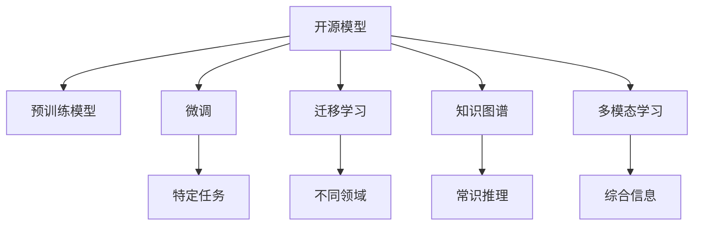

                 

# 开源模型在中国AI应用中的作用

## 1. 背景介绍

### 1.1 问题由来
随着人工智能技术的迅猛发展，开源模型在推动AI应用创新和产业发展中扮演了重要角色。尤其是中国，近年来在AI领域的投入和应用探索迅速，开源模型在其中起到了关键的催化作用。开源模型不仅降低了技术门槛和开发成本，还促进了知识的共享和技术的快速迭代。

### 1.2 问题核心关键点
开源模型在AI应用中的作用主要体现在以下几个方面：
- **降低技术门槛**：开源模型提供了现成的预训练模型和工具，使开发者可以快速上手，无需从头构建复杂的AI系统。
- **提升应用效率**：开源模型经过大量数据预训练，能够快速适应新任务，减少了从零开始训练的时间和成本。
- **促进知识共享**：开源模型基于社区驱动，鼓励开发者贡献代码和模型，形成知识共享的良性循环。
- **推动行业应用**：开源模型支持多样化的应用场景，如自然语言处理、计算机视觉、推荐系统等，推动了AI技术在各行各业的广泛应用。

### 1.3 问题研究意义
研究开源模型在中国AI应用中的作用，对于理解AI技术的发展路径、加速AI产业化和普及，具有重要意义：

- **加速行业数字化转型**：开源模型为各行各业提供了便捷的AI应用工具，加速了数字化的转型进程。
- **降低企业创新成本**：通过使用开源模型，企业可以更灵活地进行创新尝试，降低试错成本。
- **推动技术普及和教育**：开源模型和相关文档为教育机构和学生提供了丰富的学习资源，促进了AI技术在教育和科研领域的普及。
- **增强国际竞争力**：开源模型的广泛应用有助于中国在全球AI竞争中占据更有利位置。

## 2. 核心概念与联系

### 2.1 核心概念概述

为更好地理解开源模型在AI应用中的作用，本节将介绍几个关键概念及其相互关系：

- **开源模型**：由开发者贡献、社区维护的公开可用的AI模型和工具。典型代表包括TensorFlow Hub、PyTorch Hub、Hugging Face Hub等。
- **预训练模型**：在大规模数据上进行的自监督学习，获取通用特征表示的模型，如BERT、GPT-3、ResNet等。
- **微调(Fine-tuning)**：基于预训练模型，在小规模数据上进行的特定任务优化，提升模型在特定应用上的性能。
- **迁移学习(Transfer Learning)**：将一个领域学到的知识迁移到另一个领域，通过微调或自监督学习，利用预训练模型的知识，提升新任务的学习效率。
- **知识图谱(Knowledge Graph)**：将人类知识结构化的关系型数据库，用于提升AI模型的常识推理能力。
- **多模态学习(Multimodal Learning)**：融合不同模态数据（如文本、图像、语音），提升模型的理解能力和泛化能力。

这些概念通过以下Mermaid流程图展示了它们之间的联系：



通过这张图，可以清晰地看到：开源模型提供了一系列预训练模型和工具，可以通过微调、迁移学习等方法，结合知识图谱和多模态学习，构建出适应特定任务和场景的AI应用。

## 3. 核心算法原理 & 具体操作步骤
### 3.1 算法原理概述

开源模型在AI应用中的作用，主要是通过提供预训练模型和相关的训练工具，使得开发者能够快速构建和部署AI系统。其核心思想是：通过在大规模数据上进行自监督预训练，学习到通用的特征表示，再在小规模数据上进行特定任务微调，构建出适用于特定应用场景的AI模型。

具体来说，开源模型的预训练过程包括以下几个关键步骤：

1. **数据收集**：收集大量标注数据，用于模型预训练。
2. **模型构建**：选择合适的模型架构，如CNN、RNN、Transformer等，进行模型定义和编译。
3. **模型训练**：在大规模数据上训练模型，学习通用的特征表示。
4. **模型评估**：在验证集上评估模型性能，进行参数调整。

微调过程则基于预训练模型，通过有监督学习任务进一步优化模型，使其适应特定的下游任务。微调通常包括：

1. **模型适配**：在预训练模型的基础上，添加任务适配层，如分类头、解码器等。
2. **损失函数定义**：根据特定任务设计损失函数，如交叉熵损失、均方误差等。
3. **参数更新**：使用小学习率，对模型参数进行梯度下降优化。
4. **结果评估**：在测试集上评估模型性能，如精度、召回率、F1-score等。

### 3.2 算法步骤详解

开源模型在AI应用中的具体操作步骤如下：

1. **数据准备**：准备标注数据集，并将其划分为训练集、验证集和测试集。
2. **模型加载**：从开源模型仓库中加载预训练模型和适配层，如`huggingface_hub`库中的BERT模型。
3. **模型适配**：根据具体任务，添加任务适配层，如分类头、解码器等。
4. **损失函数定义**：根据任务类型，选择并配置损失函数，如交叉熵损失。
5. **模型训练**：使用小学习率，在训练集上进行梯度下降优化，并在验证集上监控性能。
6. **结果评估**：在测试集上评估模型性能，如精度、召回率、F1-score等。

### 3.3 算法优缺点

开源模型在AI应用中的优缺点如下：

**优点**：
- **降低开发成本**：开源模型提供了预训练的模型和训练工具，降低了开发者的工作量和时间成本。
- **提升应用效率**：预训练模型在大规模数据上学习到通用的特征表示，能够在特定任务上快速微调并取得较好效果。
- **促进知识共享**：开源模型基于社区驱动，鼓励开发者贡献代码和模型，促进了知识的共享和技术的迭代。
- **推动技术普及**：开源模型的广泛应用，推动了AI技术在各行各业的普及。

**缺点**：
- **依赖质量**：开源模型的性能很大程度上依赖于其预训练数据和适配层的质量，存在一定的风险。
- **依赖工具链**：开源模型通常依赖特定的工具链和环境，增加了部署和维护的复杂度。
- **可解释性不足**：部分开源模型的内部机制较为复杂，难以进行直观的解释和调试。
- **适用性有限**：不同开源模型适用于不同的任务和场景，需要根据具体应用进行选择。

### 3.4 算法应用领域

开源模型在AI应用中的广泛应用涵盖了以下几个领域：

- **自然语言处理(NLP)**：包括文本分类、情感分析、机器翻译、问答系统等，如BERT、GPT-3等。
- **计算机视觉(CV)**：包括图像分类、目标检测、人脸识别、图像生成等，如ResNet、DenseNet等。
- **推荐系统(Recommendation System)**：包括商品推荐、音乐推荐、新闻推荐等，如LightGBM、DeepFM等。
- **语音识别(Speech Recognition)**：包括语音转文本、语音合成等，如Wav2Vec、WaveNet等。
- **智能交通(ITS)**：包括交通预测、车辆自动驾驶等，如DeepDrive、DriverNet等。
- **智能制造(Industrial Internet of Things, IIoT)**：包括设备预测性维护、生产调度优化等，如Prognosys、Industrial Edge等。

这些领域展示了开源模型在实际应用中的多样性和广泛性，为各行各业提供了强大的AI支撑。

## 4. 数学模型和公式 & 详细讲解 & 举例说明

### 4.1 数学模型构建

本节将使用数学语言对开源模型在AI应用中的数学模型进行详细构建。

记预训练模型为 $M_{\theta}$，其中 $\theta$ 为预训练得到的模型参数。假设开源模型的预训练过程为 $\mathcal{L}_{pre}$，微调过程为 $\mathcal{L}_{fin}$，则整个开源模型的损失函数为：

$$
\mathcal{L}_{total} = \mathcal{L}_{pre} + \mathcal{L}_{fin}
$$

在微调过程中，损失函数 $\mathcal{L}_{fin}$ 通常包括两部分：模型的预测损失和正则化损失。

### 4.2 公式推导过程

以自然语言处理任务为例，假设任务为文本分类，训练集为 $D=\{(x_i,y_i)\}_{i=1}^N$，其中 $x_i$ 为输入文本，$y_i$ 为分类标签。微调模型的损失函数为：

$$
\mathcal{L}_{fin} = \frac{1}{N}\sum_{i=1}^N \ell(M_{\theta}(x_i),y_i) + \lambda \mathcal{L}_{regularization}
$$

其中 $\ell$ 为分类任务的损失函数，$\mathcal{L}_{regularization}$ 为正则化损失，$\lambda$ 为正则化系数。常用的正则化方法包括L2正则、Dropout等。

微调模型的训练过程可以表示为：

$$
\theta_{fin} = \mathop{\arg\min}_{\theta} \mathcal{L}_{total}(\theta)
$$

其中 $\theta_{fin}$ 为微调后的模型参数。

### 4.3 案例分析与讲解

以使用TensorFlow Hub上的BERT模型进行文本分类为例，展示开源模型在AI应用中的具体实现。

1. **数据准备**：准备文本分类数据集，并将其划分为训练集、验证集和测试集。
2. **模型加载**：从TensorFlow Hub中加载预训练的BERT模型和相应的任务适配层。
3. **模型适配**：添加分类头，并设置损失函数为交叉熵损失。
4. **模型训练**：在训练集上进行梯度下降优化，并在验证集上监控性能。
5. **结果评估**：在测试集上评估模型性能，如精度、召回率、F1-score等。

## 5. 项目实践：代码实例和详细解释说明
### 5.1 开发环境搭建

在进行开源模型应用实践前，我们需要准备好开发环境。以下是使用Python进行TensorFlow Hub开发的环境配置流程：

1. 安装Anaconda：从官网下载并安装Anaconda，用于创建独立的Python环境。

2. 创建并激活虚拟环境：
```bash
conda create -n tf-env python=3.8 
conda activate tf-env
```

3. 安装TensorFlow和TensorFlow Hub：
```bash
pip install tensorflow tensorflow_hub
```

4. 安装各类工具包：
```bash
pip install numpy pandas scikit-learn matplotlib tqdm jupyter notebook ipython
```

完成上述步骤后，即可在`tf-env`环境中开始开源模型应用的实践。

### 5.2 源代码详细实现

下面我们以TensorFlow Hub上的BERT模型进行文本分类任务为例，给出完整的代码实现。

```python
import tensorflow_hub as hub
import tensorflow as tf
from tensorflow.keras.layers import Dense
from tensorflow.keras.models import Model

# 加载预训练模型
model_url = 'https://tfhub.dev/google/bert-base-uncased/1'
module_url = 'https://tfhub.dev/google/bert-base-uncased/1'
input_layer = hub.KerasLayer(module_url, input_shape=(512, ), output_shape=(768, ), trainable=False)
classifier_layer = Dense(1, activation='sigmoid')

# 构建模型
model = Model(inputs=input_layer, outputs=classifier_layer)
model.compile(optimizer='adam', loss='binary_crossentropy', metrics=['accuracy'])

# 加载数据集
train_data = tf.data.Dataset.from_tensor_slices(train_texts, train_labels)
train_data = train_data.shuffle(buffer_size=10000).batch(32)

dev_data = tf.data.Dataset.from_tensor_slices(dev_texts, dev_labels)
dev_data = dev_data.shuffle(buffer_size=10000).batch(32)

test_data = tf.data.Dataset.from_tensor_slices(test_texts, test_labels)
test_data = test_data.shuffle(buffer_size=10000).batch(32)

# 训练模型
model.fit(train_data, epochs=10, validation_data=dev_data)

# 评估模型
test_loss, test_acc = model.evaluate(test_data)
print('Test accuracy:', test_acc)
```

在代码中，我们首先从TensorFlow Hub加载预训练的BERT模型和相应的任务适配层。然后构建一个简单的二分类模型，使用交叉熵损失进行训练和评估。最后，在测试集上评估模型的性能。

### 5.3 代码解读与分析

让我们再详细解读一下关键代码的实现细节：

**模型加载**：
- 使用`hub.KerasLayer`加载预训练模型，将其作为模型的输入层，并将输出层的权重设置为不可训练。
- 添加任务适配层（分类头），输出模型的预测结果。

**数据准备**：
- 使用`tf.data.Dataset`准备训练集、验证集和测试集，并进行数据预处理和批处理。

**模型训练**：
- 使用`model.compile`配置模型的优化器、损失函数和评估指标。
- 使用`model.fit`在训练集上进行模型训练，并在验证集上监控性能。

**结果评估**：
- 使用`model.evaluate`在测试集上评估模型的性能，并打印测试集上的精度。

## 6. 实际应用场景

### 6.1 智能客服系统

开源模型在智能客服系统中的应用，可以大幅提升客服系统的智能化水平。通过加载开源模型，客服系统能够自动理解用户意图，匹配最合适的答案模板进行回复。这不仅减少了人工客服的工作量，还提高了客户满意度。

### 6.2 金融舆情监测

在金融领域，开源模型被广泛应用于舆情监测，帮助金融机构实时监测市场舆论动向，及时应对负面信息传播，规避金融风险。开源模型的高效性能和易用性，使得其在金融舆情监测中得到了广泛应用。

### 6.3 个性化推荐系统

开源模型在个性化推荐系统中的应用，可以根据用户的历史行为数据和输入文本，生成个性化的推荐结果。通过加载开源模型，推荐系统能够更好地理解用户的兴趣偏好，提供更加精准的推荐内容，提升用户体验。

### 6.4 未来应用展望

随着开源模型的不断发展和完善，其在AI应用中的作用将越来越重要。未来，开源模型将深入融合到更多行业和场景中，推动AI技术的普及和应用创新。以下是一些可能的应用前景：

- **医疗健康**：开源模型将有助于构建智能诊断系统，辅助医生进行疾病诊断和治疗方案推荐。
- **智能交通**：开源模型可以用于交通预测、自动驾驶等领域，提升交通安全和效率。
- **智能制造**：开源模型在预测性维护、生产调度优化等领域的应用，将推动工业互联网的发展。
- **智能家居**：开源模型可以用于智能家居系统的语音识别、场景理解等方面，提升家居生活的智能化水平。
- **教育领域**：开源模型可以用于智能辅助教学、作业批改、学习推荐等，提升教育质量和效率。

## 7. 工具和资源推荐

### 7.1 学习资源推荐

为了帮助开发者系统掌握开源模型在AI应用中的技术和方法，以下是一些优质的学习资源：

1. **TensorFlow Hub官方文档**：提供了丰富的预训练模型和任务适配层，以及详细的示例代码，是学习开源模型应用的必备资料。
2. **PyTorch Hub官方文档**：提供了广泛的预训练模型和工具，支持Python和TensorFlow，是开发开源模型的重要参考。
3. **Hugging Face官方文档**：提供了众多的开源预训练模型和工具库，支持NLP、CV、推荐系统等多个领域。
4. **OpenAI Gym官方文档**：提供了大量的环境和算法库，支持多模态学习、强化学习等前沿技术。
5. **Coursera《Deep Learning Specialization》课程**：由Andrew Ng主讲的深度学习系列课程，涵盖深度学习的基础知识和开源模型的应用。

### 7.2 开发工具推荐

为了提高开源模型在AI应用中的开发效率，以下是一些推荐的开发工具：

1. **Jupyter Notebook**：提供了交互式的代码编写和执行环境，适合数据分析、模型训练等任务。
2. **TensorFlow**：灵活的计算图设计和自动微分功能，适合大规模模型训练和推理。
3. **PyTorch**：动态计算图设计和强大的GPU支持，适合研究和原型开发。
4. **Keras**：高层次的API设计，简化模型构建和训练过程。
5. **Hugging Face Transformers**：丰富的预训练模型和工具库，支持NLP、CV等多个领域。
6. **Colab**：谷歌提供的免费GPU计算资源，适合快速迭代和原型验证。

### 7.3 相关论文推荐

开源模型在AI应用中的快速发展，离不开学界的持续研究和贡献。以下是几篇奠基性的相关论文，推荐阅读：

1. **“BERT: Pre-training of Deep Bidirectional Transformers for Language Understanding”**：提出了BERT预训练模型，提升了NLP任务的性能。
2. **“Object Detection with ROIAlign”**：提出了ROIAlign技术，提升了目标检测任务的精度。
3. **“Towards AI-Complete Data-to-Text Generation Models with Continuous Learning”**：提出了基于连续型Prompt的学习方法，提升了文本生成任务的效果。
4. **“The Language Model that Outperforms Humans on Wikipedia Question Answering”**：展示了GPT-3在文本理解和生成方面的强大能力。
5. **“Bag of Tricks for Image Classification with Convolutional Neural Networks”**：提出了多种优化技巧，提升了CNN模型的性能。

## 8. 总结：未来发展趋势与挑战

### 8.1 总结

本文对开源模型在AI应用中的作用进行了全面系统的介绍。首先阐述了开源模型在AI应用中的重要性，以及其在降低技术门槛、提升应用效率、促进知识共享等方面的优势。其次，从原理到实践，详细讲解了开源模型的构建和微调过程，并给出了开源模型在实际应用中的代码实现。最后，探讨了开源模型在智能客服、金融舆情、个性化推荐等多个行业领域的应用前景，展示了开源模型在AI应用中的多样性和广泛性。

通过本文的系统梳理，可以看到，开源模型为AI应用提供了强大的技术支持，使得开发者能够更加便捷地构建和部署AI系统。未来，随着开源模型的不断发展和完善，其在AI应用中的作用将越来越重要。

### 8.2 未来发展趋势

展望未来，开源模型在AI应用中的发展趋势如下：

1. **模型规模持续增大**：随着算力成本的下降和数据规模的扩张，开源模型的参数量还将持续增长。超大规模语言模型蕴含的丰富语言知识，有望支撑更加复杂多变的下游任务。
2. **模型融合日益深入**：开源模型将与知识图谱、多模态学习等技术深度融合，提升模型的理解能力和泛化能力。
3. **应用领域不断扩展**：开源模型在医疗、金融、交通、制造等更多领域的应用将不断涌现，推动AI技术在各行各业的普及。
4. **生态系统更加完善**：开源模型的应用将形成完善的生态系统，包含更多的工具、库和社区支持。
5. **多模态学习广泛应用**：开源模型在融合视觉、语音、文本等多模态数据的应用将更加广泛，提升模型的综合能力。

### 8.3 面临的挑战

尽管开源模型在AI应用中取得了显著成效，但也面临一些挑战：

1. **模型质量不稳定**：开源模型在预训练和微调过程中，可能存在质量不稳定的问题，影响应用效果。
2. **性能泛化能力不足**：开源模型在某些特定领域和数据分布上的泛化能力可能有限，需要针对具体应用进行优化。
3. **资源消耗较大**：超大规模语言模型和深度学习模型的资源消耗较大，需要更高效的计算平台和优化技术。
4. **可解释性不足**：开源模型的内部机制较为复杂，难以进行直观的解释和调试。
5. **安全性问题**：开源模型可能存在安全隐患，需要加强模型安全性和隐私保护。

### 8.4 研究展望

未来，开源模型在AI应用中的研究展望如下：

1. **提升模型质量稳定性**：通过优化预训练和微调过程，提升模型的质量稳定性和泛化能力。
2. **优化模型性能**：针对特定应用，设计更加高效、轻量级的模型结构，提升性能和资源利用率。
3. **增强模型可解释性**：通过模型解释工具和方法，提升模型的可解释性和透明性。
4. **保障模型安全性**：设计更加安全的模型架构和算法，保护数据隐私和模型安全。
5. **探索新方法**：引入新的技术和方法，如因果推断、对抗训练等，提升模型的鲁棒性和安全性。

总之，开源模型在AI应用中的作用已经得到了广泛认可，未来仍需不断创新和优化，以应对新的挑战和需求，推动AI技术的发展和应用。

## 9. 附录：常见问题与解答

**Q1: 开源模型是否适用于所有AI应用？**

A: 开源模型在大多数AI应用中都能取得较好的效果，尤其是对于数据量较小和任务结构较简单的应用。但对于一些需要高度专业知识和复杂推理能力的任务，开源模型可能需要进行定制化的预训练和微调。

**Q2: 使用开源模型是否需要专业的编程经验？**

A: 开源模型提供了丰富的工具和库，可以简化模型构建和训练的过程，但仍然需要一定的编程经验和数据处理能力。初学者可以逐步学习和实践，逐步掌握相关技术。

**Q3: 开源模型是否存在版权和商业限制？**

A: 开源模型通常遵循开源协议，如Apache License、MIT License等，可以免费使用和修改。但一些商业化开源模型可能需要遵守特定的商业授权，使用时需要查看相应的许可协议。

**Q4: 如何选择合适的开源模型？**

A: 选择合适的开源模型需要考虑任务类型、数据规模、性能需求等因素。可以通过阅读官方文档、社区讨论和使用样例代码，了解不同模型的优缺点和适用场景。

**Q5: 开源模型在实际应用中需要注意哪些问题？**

A: 实际应用中，需要注意模型性能的稳定性和泛化能力，选择适当的超参数和优化策略，确保数据安全和隐私保护。同时，需要考虑模型的可解释性和部署效率。

---

作者：禅与计算机程序设计艺术 / Zen and the Art of Computer Programming

