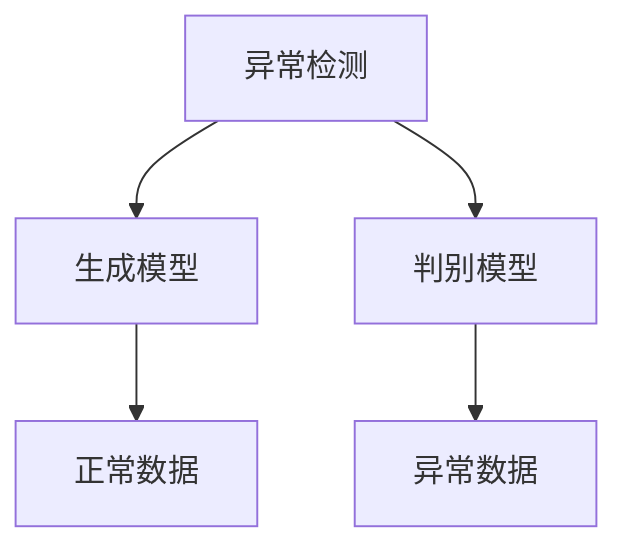

                 

## 1. 背景介绍

### 1.1 问题由来

在数据驱动的现代社会，如何从海量的数据中发现隐藏的模式和异常，是一个重要的研究问题。异常检测（Anomaly Detection），即通过分析数据中少数与大多数不同的部分，识别出不符合常规的异常行为，是数据挖掘和数据分析中的一个重要环节。异常检测在多个领域有广泛应用，如网络安全、金融欺诈、工业监控、医疗诊断、生物信息学等。其核心在于从正常数据中学习到一种表示正常行为的模型，并将新数据与该模型进行比较，从而判断是否存在异常。

### 1.2 问题核心关键点

异常检测的核心是构建一种能够区分正常与异常样本的模型。目前主流的方法包括统计方法、机器学习方法和深度学习方法。统计方法如基于均值和标准差的Z-Score方法、基于偏度和峰度的IQR方法等，适用于简单数据类型。机器学习方法如基于K近邻的KNN方法、基于决策树的IForest方法等，具有较强的泛化能力，但需要手动选择参数。深度学习方法如基于自编码器的AE方法、基于生成对抗网络的GAN方法等，能够自动学习到数据的复杂分布，但计算资源需求较大。

## 2. 核心概念与联系

### 2.1 核心概念概述

为了深入理解异常检测的原理，本节将介绍几个关键概念：

- **异常检测（Anomaly Detection）**：通过训练一个模型来识别和区分数据中的异常点，即与大多数数据不同的数据点。

- **正常数据（Normal Data）**：在异常检测中，通常指那些与异常数据相比，分布较广、数量较多的数据。

- **异常数据（Anomalous Data）**：与正常数据相比，分布较为集中、数量较少的数据，即为异常数据。

- **生成模型（Generative Models）**：通过学习数据的概率分布，生成模型的目标是最小化实际数据和生成数据之间的差异，从而识别出异常数据。

- **判别模型（Discriminative Models）**：直接学习异常和正常数据之间的边界，通过最大化分类器在正常和异常数据上的准确率，来识别异常数据。

这些核心概念之间的关系可以通过以下Mermaid流程图来展示：



这个流程图展示了异常检测的核心过程：通过构建生成模型和判别模型，来识别正常和异常数据，从而进行异常检测。

## 3. 核心算法原理 & 具体操作步骤
### 3.1 算法原理概述

异常检测的算法原理主要有两种：生成模型和判别模型。生成模型通过学习数据的概率分布，来判断数据是否异常。判别模型则直接学习异常和正常数据之间的边界，通过最大化分类器在正常和异常数据上的准确率，来识别异常数据。

生成模型主要包括自编码器（Autoencoder）和变分自编码器（Variational Autoencoder）等。自编码器通过将输入数据压缩到一个低维空间，然后再解码回到原始空间，学习到数据的分布。变分自编码器则是在自编码器的基础上，引入了变分推断，进一步提高了模型效果。

判别模型主要包括支持向量机（SVM）、线性判别分析（LDA）和神经网络等。支持向量机通过寻找最大化边界间隔的超平面，将正常和异常数据分开。线性判别分析则通过最大化类别间的可分性，实现异常检测。神经网络模型如神经网络自编码器（Neural Network Autoencoder）和深度置信网络（Deep Belief Network）等，可以通过多层非线性映射，学习到数据的复杂分布。

### 3.2 算法步骤详解

以基于生成模型的自编码器为例，其核心步骤如下：

**Step 1: 数据准备**
- 收集正常数据集 $D$，并将其划分为训练集和测试集。

**Step 2: 模型训练**
- 使用训练集 $D$ 对自编码器模型进行训练，最小化重构误差 $J$。

**Step 3: 异常检测**
- 使用测试集 $D'$ 对训练好的自编码器模型进行异常检测。
- 对于每个测试样本 $x_i$，计算其重构误差 $J'(x_i)$。
- 将重构误差 $J'(x_i)$ 与正常数据集 $D$ 的重构误差分布进行比较，识别出异常数据。

具体步骤如下：

1. **数据准备**：
   - 收集正常数据集 $D$，并将其划分为训练集和测试集。

2. **模型训练**：
   - 使用训练集 $D$ 对自编码器模型进行训练，最小化重构误差 $J$。
   - 自编码器的目标函数为 $J = \mathbb{E}_{x\sim D}[\|x - g(x)\|^2]$，其中 $g(x)$ 为编码器，$x$ 为输入，$g(x)$ 为解码器。
   - 优化器通常采用梯度下降算法，如Adam。

3. **异常检测**：
   - 使用测试集 $D'$ 对训练好的自编码器模型进行异常检测。
   - 对于每个测试样本 $x_i$，计算其重构误差 $J'(x_i)$。
   - 将重构误差 $J'(x_i)$ 与正常数据集 $D$ 的重构误差分布进行比较，识别出异常数据。

### 3.3 算法优缺点

生成模型的优点包括：
- 适用于复杂数据类型，能够学习到数据的复杂分布。
- 模型简单，易于实现和解释。

生成模型的缺点包括：
- 计算资源需求较大，训练时间长。
- 重构误差与数据分布有关，可能出现过拟合现象。

判别模型的优点包括：
- 对异常数据的识别效果较好。
- 模型计算效率高，训练时间短。

判别模型的缺点包括：
- 模型复杂，参数较多。
- 对异常数据分布变化敏感，可能出现性能下降。

### 3.4 算法应用领域

异常检测在多个领域有广泛应用，如网络安全、金融欺诈、工业监控、医疗诊断、生物信息学等。以下是几个具体应用场景：

- **网络安全**：通过监控网络流量，识别出异常数据包，防止DDoS攻击。
- **金融欺诈**：通过分析交易数据，识别出异常交易行为，防止金融欺诈。
- **工业监控**：通过监测设备数据，识别出异常设备运行状态，预防工业事故。
- **医疗诊断**：通过分析医疗影像，识别出异常影像特征，辅助疾病诊断。
- **生物信息学**：通过分析基因数据，识别出异常基因表达，辅助疾病研究。

## 4. 数学模型和公式 & 详细讲解
### 4.1 数学模型构建

基于生成模型的自编码器可以建模为如下过程：
- 输入数据 $x$ 经过编码器 $g(x)$ 压缩到低维空间，得到编码结果 $z$。
- 编码结果 $z$ 经过解码器 $f(z)$ 解码回到原始空间，得到重构结果 $\hat{x}$。
- 模型损失函数为重构误差 $J(x, \hat{x}) = \|x - \hat{x}\|^2$。

### 4.2 公式推导过程

以自编码器的重构误差最小化为例，推导其目标函数。

重构误差目标函数为：
$$
J = \mathbb{E}_{x\sim D}[\|x - g(f(z))\|^2]
$$

其中，$g(f(z))$ 为自编码器重构结果，$D$ 为正常数据集。

### 4.3 案例分析与讲解

假设有一个异常检测任务，需要对图像数据进行异常检测。通过自编码器训练模型后，可以得到重构误差分布。对于每个测试样本，计算其重构误差，并与正常数据集的重构误差分布进行比较，识别出异常样本。

具体步骤如下：

1. **数据准备**：
   - 收集图像数据集 $D$，并将其划分为训练集和测试集。

2. **模型训练**：
   - 使用训练集 $D$ 对自编码器模型进行训练，最小化重构误差 $J$。
   - 自编码器的目标函数为 $J = \mathbb{E}_{x\sim D}[\|x - g(f(z))\|^2]$，其中 $g(x)$ 为编码器，$x$ 为输入，$g(x)$ 为解码器。
   - 优化器通常采用梯度下降算法，如Adam。

3. **异常检测**：
   - 使用测试集 $D'$ 对训练好的自编码器模型进行异常检测。
   - 对于每个测试样本 $x_i$，计算其重构误差 $J'(x_i)$。
   - 将重构误差 $J'(x_i)$ 与正常数据集 $D$ 的重构误差分布进行比较，识别出异常数据。

## 5. 项目实践：代码实例和详细解释说明
### 5.1 开发环境搭建

在进行异常检测实践前，我们需要准备好开发环境。以下是使用Python进行Keras开发的环境配置流程：

1. 安装Anaconda：从官网下载并安装Anaconda，用于创建独立的Python环境。

2. 创建并激活虚拟环境：
```bash
conda create -n keras-env python=3.8 
conda activate keras-env
```

3. 安装Keras和相关工具包：
```bash
pip install keras tensorflow
```

4. 安装可视化工具：
```bash
pip install matplotlib seaborn
```

完成上述步骤后，即可在`keras-env`环境中开始异常检测实践。

### 5.2 源代码详细实现

以下是使用Keras实现基于自编码器的异常检测的示例代码：

```python
from keras.models import Model, Sequential
from keras.layers import Input, Dense, Dropout
from keras.optimizers import Adam
import numpy as np
from sklearn.datasets import make_blobs
from sklearn.model_selection import train_test_split

# 生成数据集
np.random.seed(0)
x, y = make_blobs(n_samples=1000, centers=2, random_state=0, cluster_std=0.5)
x_train, x_test = train_test_split(x, test_size=0.2)
y_train, y_test = train_test_split(y, test_size=0.2)

# 定义模型
def build_autoencoder(input_dim):
    input_layer = Input(shape=(input_dim,))
    encoded = Dense(2, activation='relu')(input_layer)
    decoded = Dense(input_dim, activation='sigmoid')(encoded)
    autoencoder = Model(input_layer, decoded)
    autoencoder.compile(optimizer=Adam(lr=0.001), loss='mse')
    return autoencoder

# 训练模型
input_dim = x_train.shape[1]
autoencoder = build_autoencoder(input_dim)
autoencoder.fit(x_train, x_train, epochs=100, batch_size=32, validation_data=(x_test, x_test))

# 异常检测
threshold = np.median(autoencoder.predict(x_test))
normal_indices = np.where(y_test == 0)[0]
anomalous_indices = np.where(y_test == 1)[0]
normal_errors = np.mean(autoencoder.predict(x_train[normal_indices]), axis=0)
anomalous_errors = np.mean(autoencoder.predict(x_train[anomalous_indices]), axis=0)

print("Normal Error: ", normal_errors)
print("Anomalous Error: ", anomalous_errors)
```

### 5.3 代码解读与分析

让我们再详细解读一下关键代码的实现细节：

**make_blobs函数**：
- 生成2个聚类的数据集，用于模拟正常数据和异常数据。

**build_autoencoder函数**：
- 定义自编码器模型，包括输入层、编码层和解码层。
- 编码层和解码层的激活函数分别为ReLU和Sigmoid。
- 使用Adam优化器，学习率为0.001。

**fit函数**：
- 使用训练集 $D$ 对自编码器模型进行训练，最小化重构误差 $J$。

**异常检测**：
- 使用测试集 $D'$ 对训练好的自编码器模型进行异常检测。
- 计算每个测试样本的重构误差，并与正常数据集的重构误差分布进行比较，识别出异常数据。

**threshold变量**：
- 使用正常数据集的重构误差分布的均值作为阈值，用于区分正常数据和异常数据。

**normal_indices和anomalous_indices变量**：
- 使用y_test判断数据是正常还是异常，分别记录正常和异常样本的索引。

**normal_errors和anomalous_errors变量**：
- 计算正常和异常样本的重构误差，用于异常检测。

可以看到，Keras库使得异常检测的代码实现变得简洁高效。开发者可以将更多精力放在数据处理、模型改进等高层逻辑上，而不必过多关注底层的实现细节。

## 6. 实际应用场景
### 6.1 网络安全

在网络安全领域，异常检测可以用于实时监控网络流量，识别出异常数据包，防止DDoS攻击。通过收集网络流量数据，使用自编码器模型训练得到正常数据的重构误差分布，对于每个数据包，计算其重构误差，并与正常数据的重构误差分布进行比较，识别出异常数据包。

### 6.2 金融欺诈

在金融领域，异常检测可以用于识别异常交易行为，防止金融欺诈。通过收集交易数据，使用自编码器模型训练得到正常交易数据的重构误差分布，对于每个交易行为，计算其重构误差，并与正常交易数据的重构误差分布进行比较，识别出异常交易行为。

### 6.3 工业监控

在工业监控领域，异常检测可以用于监测设备运行状态，预防工业事故。通过收集设备运行数据，使用自编码器模型训练得到正常设备运行数据的重构误差分布，对于每个设备运行数据，计算其重构误差，并与正常设备运行数据的重构误差分布进行比较，识别出异常设备运行状态。

## 7. 工具和资源推荐
### 7.1 学习资源推荐

为了帮助开发者系统掌握异常检测的理论基础和实践技巧，这里推荐一些优质的学习资源：

1. **Keras官方文档**：Keras的官方文档，提供了大量使用Keras实现异常检测的样例代码和详细解释。

2. **Deep Learning Specialization**：由Andrew Ng教授开设的深度学习课程，涵盖了异常检测的相关内容。

3. **Anomaly Detection and Novelty Detection: A Survey**：一篇系统介绍异常检测和新颖检测的综述论文，值得深入阅读。

4. **The Elements of Statistical Learning**：一本经典的统计学习教材，其中包含了异常检测的详细理论推导。

5. **Data Science from Scratch**：一本介绍数据科学和机器学习的入门书籍，其中包含异常检测的实际应用案例。

通过对这些资源的学习实践，相信你一定能够快速掌握异常检测的精髓，并用于解决实际的NLP问题。

### 7.2 开发工具推荐

高效的开发离不开优秀的工具支持。以下是几款用于异常检测开发的常用工具：

1. Keras：基于Python的深度学习框架，易于上手，适合快速迭代研究。

2. TensorFlow：由Google主导开发的深度学习框架，生产部署方便，适合大规模工程应用。

3. PyTorch：基于Python的深度学习框架，灵活动态，适合研究和原型开发。

4. Scikit-learn：基于Python的机器学习库，提供了多种常用的异常检测算法和工具。

5. Weights & Biases：模型训练的实验跟踪工具，可以记录和可视化模型训练过程中的各项指标，方便对比和调优。

6. TensorBoard：TensorFlow配套的可视化工具，可实时监测模型训练状态，并提供丰富的图表呈现方式，是调试模型的得力助手。

合理利用这些工具，可以显著提升异常检测任务的开发效率，加快创新迭代的步伐。

### 7.3 相关论文推荐

异常检测在多个领域有广泛应用，以下是几篇奠基性的相关论文，推荐阅读：

1. **One-Class Support Vector Machines**：由Schölkopf等提出的支持向量机算法，用于异常检测。

2. **Isolation Forest**：由Liu等提出的基于随机树的异常检测算法，具有高效性和准确性。

3. **Autoencoder for Anomaly Detection**：由Hinton等提出的自编码器算法，用于异常检测。

4. **Gaussian Mixture Models**：由Rasmussen等提出的高斯混合模型算法，用于异常检测。

5. **Anomaly Detection Using Deep Belief Networks**：由Bengio等提出的深度信念网络算法，用于异常检测。

这些论文代表异常检测领域的发展脉络，通过学习这些前沿成果，可以帮助研究者把握学科前进方向，激发更多的创新灵感。

## 8. 总结：未来发展趋势与挑战
### 8.1 总结

本文对基于生成模型的异常检测方法进行了全面系统的介绍。首先阐述了异常检测的研究背景和意义，明确了异常检测在多个领域的应用价值。其次，从原理到实践，详细讲解了异常检测的数学模型和关键步骤，给出了异常检测任务开发的完整代码实例。同时，本文还广泛探讨了异常检测方法在网络安全、金融欺诈、工业监控等多个领域的应用前景，展示了异常检测技术的广阔前景。最后，本文精选了异常检测技术的各类学习资源，力求为读者提供全方位的技术指引。

通过本文的系统梳理，可以看到，基于生成模型的异常检测方法正在成为异常检测领域的重要范式，极大地拓展了异常检测的应用边界，催生了更多的落地场景。未来，伴随异常检测方法的持续演进，相信异常检测技术还将不断推陈出新，为数据挖掘和数据分析领域带来新的突破。

### 8.2 未来发展趋势

展望未来，异常检测技术将呈现以下几个发展趋势：

1. **深度学习方法的普及**：随着深度学习技术的发展，基于神经网络的异常检测方法将逐渐取代传统统计方法，成为异常检测的主流技术。

2. **无监督学习方法的兴起**：无监督学习方法如自编码器、变分自编码器等，将在异常检测中发挥重要作用，减少对标注数据的需求。

3. **实时性要求的提高**：在实时性要求高的场景下，如网络安全、工业监控等，异常检测方法将不断优化，提高实时性。

4. **多模态数据的融合**：异常检测方法将不断扩展，融合视觉、声音、文本等多模态数据，提高异常检测的准确性和鲁棒性。

5. **可解释性需求的提升**：异常检测模型将更加注重可解释性，通过可视化工具和解释模型，提高异常检测的可解释性和可信度。

6. **跨领域应用的拓展**：异常检测方法将逐渐应用于更多领域，如医疗诊断、金融欺诈、交通监控等，带来新的应用场景。

以上趋势凸显了异常检测技术的广阔前景，这些方向的探索发展，必将进一步提升异常检测的性能和应用范围，为数据挖掘和数据分析领域带来新的突破。

### 8.3 面临的挑战

尽管异常检测技术已经取得了不小的成就，但在迈向更加智能化、普适化应用的过程中，它仍面临诸多挑战：

1. **标注数据瓶颈**：异常检测方法大多依赖标注数据，对于数据分布变化较大的场景，标注数据的获取和维护成本较高。

2. **算法复杂度**：深度学习算法往往需要较长的训练时间和较大的计算资源，难以在大规模数据集上应用。

3. **模型泛化能力**：异常检测模型的泛化能力有待提高，在实际应用中，模型往往对数据分布的变化较为敏感。

4. **异常数据分布变化**：异常数据的分布可能随时间、环境等条件发生变化，如何动态更新异常检测模型是一个重要问题。

5. **模型可解释性**：异常检测模型通常是"黑盒"系统，难以解释其内部工作机制和决策逻辑，特别是在高风险应用中，模型的可解释性和可审计性尤为重要。

6. **模型安全性**：异常检测模型可能被恶意利用，生成虚假异常报警，如何保证模型的安全性是一个重要问题。

这些挑战凸显了异常检测技术在实际应用中的复杂性和多样性，需要进一步的研究和改进。

### 8.4 研究展望

面对异常检测技术面临的种种挑战，未来的研究需要在以下几个方面寻求新的突破：

1. **无监督和半监督学习方法**：探索基于无监督和半监督学习的方法，减少对标注数据的需求，提高异常检测的鲁棒性和泛化能力。

2. **实时性和高效性优化**：优化异常检测方法的计算图，减少前向传播和反向传播的资源消耗，提高实时性。

3. **跨领域应用研究**：将异常检测方法应用于更多领域，如医疗诊断、金融欺诈、交通监控等，拓展其应用边界。

4. **多模态数据融合**：融合视觉、声音、文本等多模态数据，提高异常检测的准确性和鲁棒性。

5. **可解释性提升**：通过可视化工具和解释模型，提高异常检测的可解释性和可信度。

6. **安全性保障**：引入安全机制，防止异常检测模型被恶意利用，提高模型安全性。

这些研究方向和改进方向，将引领异常检测技术迈向更高的台阶，为数据挖掘和数据分析领域带来新的突破。只有勇于创新、敢于突破，才能不断拓展异常检测技术的边界，让数据挖掘和数据分析技术更好地服务于社会。

## 9. 附录：常见问题与解答

**Q1：什么是异常检测？**

A: 异常检测是通过训练一个模型来识别和区分数据中的异常点，即与大多数数据不同的数据点。

**Q2：异常检测和异常识别的区别是什么？**

A: 异常检测是在数据中寻找异常点，即与大多数数据不同的数据点。异常识别则是在数据中寻找特定的异常类别，并对其进行分类。

**Q3：异常检测有哪些常见方法？**

A: 异常检测的方法主要包括统计方法、机器学习方法和深度学习方法。统计方法如基于均值和标准差的Z-Score方法、基于偏度和峰度的IQR方法等。机器学习方法如基于K近邻的KNN方法、基于决策树的IForest方法等。深度学习方法如基于自编码器的AE方法、基于生成对抗网络的GAN方法等。

**Q4：异常检测的优缺点是什么？**

A: 异常检测的优点包括：
- 适用于复杂数据类型，能够学习到数据的复杂分布。
- 模型简单，易于实现和解释。

异常检测的缺点包括：
- 计算资源需求较大，训练时间长。
- 重构误差与数据分布有关，可能出现过拟合现象。

**Q5：如何评价异常检测模型的性能？**

A: 异常检测模型的性能评价主要通过以下几个指标：
- 精确率（Precision）：正确识别出的异常数据占所有识别出的异常数据的比例。
- 召回率（Recall）：正确识别出的异常数据占所有真实异常数据的比例。
- F1分数（F1 Score）：精确率和召回率的调和平均。
- ROC曲线和AUC值：用于评估异常检测模型在不同阈值下的性能表现。

通过本文的系统梳理，可以看到，基于生成模型的异常检测方法正在成为异常检测领域的重要范式，极大地拓展了异常检测的应用边界，催生了更多的落地场景。未来，伴随异常检测方法的持续演进，相信异常检测技术还将不断推陈出新，为数据挖掘和数据分析领域带来新的突破。

---

作者：禅与计算机程序设计艺术 / Zen and the Art of Computer Programming

