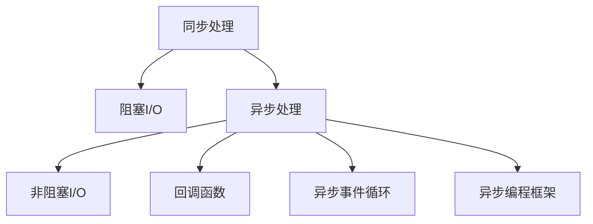

                 

## 1. 背景介绍

在当今互联网时代，系统的高性能和可靠性成为了业务竞争的核心指标。各种互联网应用，如电商交易系统、社交网络、在线视频服务等，为了满足亿级用户的同时在线，对其响应时间和吞吐量有着极高的要求。传统的同步处理方式无法满足这些需求，因此异步处理技术应运而生，成为了提升系统性能的重要手段。

异步处理通过非阻塞式的I/O操作，实现了高并发下的低延迟和高吞吐量。传统的同步处理，在执行一个I/O操作时，会阻塞当前线程，导致资源浪费和响应时间增加。而异步处理则可以在不阻塞线程的情况下，并行执行多个I/O操作，极大提高了系统的并发能力和响应速度。

## 2. 核心概念与联系

### 2.1 核心概念概述

为了更好地理解异步处理技术，本节将介绍几个密切相关的核心概念：

- **同步处理与异步处理**：同步处理指在一个请求执行过程中，请求必须等待I/O操作完成后才能返回结果，导致线程阻塞；异步处理则是指在I/O操作过程中不阻塞线程，而是在操作完成后再处理结果。

- **I/O模型**：I/O模型描述了操作系统进行I/O操作的方式。常见的I/O模型包括同步阻塞式、同步非阻塞式、异步阻塞式和异步非阻塞式。

- **异步事件循环**：异步事件循环是指在异步编程中，通过事件循环机制实现I/O操作的非阻塞式处理，多个I/O操作可以并行执行。

- **回调函数**：回调函数是指在异步I/O操作完成后，操作系统会调用预先注册的回调函数，将I/O结果返回给用户。

- **异步编程框架**：异步编程框架如Node.js、Python asyncio等，提供了高效的异步编程接口，使开发者能够更方便地编写异步处理代码。

这些核心概念之间的逻辑关系可以通过以下Mermaid流程图来展示：



这个流程图展示了几类I/O模型的逻辑关系：

1. 同步处理通过阻塞式I/O模型实现。
2. 异步处理通过非阻塞式I/O模型实现。
3. 异步处理过程中，操作系统调用预先注册的回调函数。
4. 异步事件循环机制负责调度异步I/O操作。
5. 异步编程框架提供了方便的异步编程接口。

## 3. 核心算法原理 & 具体操作步骤

### 3.1 算法原理概述

异步处理的核心原理是，通过非阻塞式的I/O操作，实现线程的并行处理，从而提高系统的并发能力和响应速度。其核心在于，异步处理通过事件驱动的方式来管理I/O操作，使得I/O操作和计算逻辑可以并行执行。

异步处理的典型实现方式是使用回调函数和异步事件循环。在异步I/O操作完成后，操作系统调用注册的回调函数，将I/O结果传递给用户。异步事件循环负责调度所有I/O操作和回调函数，以确保I/O操作和处理逻辑的协调执行。

### 3.2 算法步骤详解

异步处理的步骤如下：

1. 初始化异步编程框架，创建事件循环对象。
2. 注册I/O操作，并将回调函数注册到事件循环中。
3. 启动事件循环，异步I/O操作开始执行。
4. I/O操作完成后，操作系统调用注册回调函数，将I/O结果传递给用户。
5. 用户代码在回调函数中处理I/O结果，并进行后续逻辑处理。

### 3.3 算法优缺点

异步处理技术的优点包括：

- **高并发能力**：通过并行处理多个I/O操作，提高了系统的并发能力，可以处理大量并发请求。
- **低延迟**：非阻塞式的I/O操作减少了线程的阻塞等待时间，降低了响应时间。
- **高效利用资源**：异步处理减少了线程的空闲时间，提高了CPU和I/O设备的利用率。

异步处理技术的缺点包括：

- **编程复杂性高**：异步编程需要处理回调函数的执行顺序和错误处理，增加了编程复杂性。
- **调试难度大**：异步I/O操作和回调函数可能运行在不同的线程中，增加了调试难度。
- **内存占用高**：大量的回调函数和事件循环可能占用大量内存。

### 3.4 算法应用领域

异步处理技术广泛应用于各种高性能的分布式系统，包括Web服务器、消息队列、分布式数据库、流媒体处理、IoT应用等。

- **Web服务器**：如Nginx、Apache等，通过异步处理技术，可以高效地处理Web请求，提升Web服务器的性能和稳定性。
- **消息队列**：如RabbitMQ、Kafka等，通过异步处理技术，可以高效地处理消息生产和消费，提高系统的可靠性。
- **分布式数据库**：如Hadoop、Spark等，通过异步处理技术，可以高效地处理分布式计算任务，提升系统的扩展性和容错性。
- **流媒体处理**：如Hadoop Streaming、Spark Streaming等，通过异步处理技术，可以高效地处理海量数据流，提升系统的处理能力和实时性。
- **IoT应用**：如MQTT、AMQP等，通过异步处理技术，可以高效地处理大量的IoT设备通信，提升系统的稳定性和可扩展性。

## 4. 数学模型和公式 & 详细讲解

### 4.1 数学模型构建

异步处理的核心数学模型是事件驱动模型(Event-Driven Model)。在该模型中，系统通过事件流来驱动I/O操作的执行。每个I/O操作都是一个事件，当I/O操作完成后，操作系统会触发该事件，并调用注册在事件循环中的回调函数来处理I/O结果。

事件驱动模型的基本数学模型如下：

$$
\begin{align*}
I &= \{事件\} \\
O &= \{回调函数\} \\
C &= \{事件循环\} \\
T &= \{当前时间\}
\end{align*}
$$

其中，$I$表示所有事件的集合，$O$表示所有回调函数的集合，$C$表示事件循环对象，$T$表示当前时间。

事件驱动模型的运行过程如下：

1. 注册事件和回调函数到事件循环$C$中。
2. 启动事件循环$C$，开始处理事件。
3. 当事件$e \in I$发生时，操作系统调用$e$对应的回调函数$f \in O$，处理事件结果。
4. 事件循环$C$不断监测事件的发生，并调用相应的回调函数进行处理。

### 4.2 公式推导过程

事件驱动模型的核心公式如下：

$$
T_{下一个事件发生} = T_{当前时间} + T_{事件处理时间}
$$

其中，$T_{下一个事件发生}$表示下一个事件发生的时间，$T_{当前时间}$表示当前事件循环的时间，$T_{事件处理时间}$表示事件处理所需的时间。

### 4.3 案例分析与讲解

假设有一个Web服务器，需要处理大量的HTTP请求。使用同步处理方式，每个请求都会阻塞当前线程，导致系统无法处理其他请求。而使用异步处理方式，则可以在一个线程中处理多个HTTP请求，提高系统的并发能力。

具体实现步骤如下：

1. 创建一个事件循环对象$C$。
2. 注册HTTP请求事件到事件循环$C$中。
3. 启动事件循环$C$，开始处理HTTP请求。
4. 当一个HTTP请求事件发生时，操作系统调用注册的回调函数，处理HTTP请求。
5. 事件循环$C$不断监测HTTP请求事件的发生，并调用相应的回调函数进行处理。

通过异步处理技术，Web服务器可以高效地处理大量并发请求，提高系统的性能和稳定性。

## 5. 项目实践：代码实例和详细解释说明

### 5.1 开发环境搭建

在进行异步处理项目实践前，我们需要准备好开发环境。以下是使用Python进行异步编程的开发环境配置流程：

1. 安装Python：从官网下载并安装Python，确保安装版本大于等于3.6。
2. 安装Pip：从官网下载并安装Pip，作为Python的包管理工具。
3. 安装异步编程框架：如aiohttp、tornado、asyncio等，安装方法可以参考官方文档。

### 5.2 源代码详细实现

这里我们以aiohttp为例，给出使用Python进行异步编程的代码实现。

首先，定义一个异步HTTP请求函数：

```python
import aiohttp
import asyncio

async def fetch(session, url):
    async with session.get(url) as response:
        return await response.text()
```

然后，在主函数中启动事件循环，并调用异步请求函数：

```python
async def main():
    urls = ['http://httpbin.org/get', 'http://httpbin.org/post']
    async with aiohttp.ClientSession() as session:
        tasks = [fetch(session, url) for url in urls]
        responses = await asyncio.gather(*tasks, return_exceptions=True)
    for response in responses:
        print(response)
```

最后，启动事件循环并调用主函数：

```python
loop = asyncio.get_event_loop()
loop.run_until_complete(main())
```

以上就是使用aiohttp进行异步HTTP请求的完整代码实现。可以看到，通过异步编程框架aiohttp，我们能够轻松地进行异步请求处理。

### 5.3 代码解读与分析

让我们再详细解读一下关键代码的实现细节：

**fetch函数**：
- 定义了一个异步HTTP请求函数，使用aiohttp.ClientSession()创建一个HTTP客户端会话，并调用get方法发送HTTP请求。

**main函数**：
- 定义了一个异步主函数，使用aiohttp.ClientSession()创建HTTP客户端会话，并使用asyncio.gather并行执行多个异步HTTP请求。

**事件循环启动**：
- 使用asyncio.get_event_loop()获取事件循环对象，并调用run_until_complete方法运行异步主函数。

可以看到，异步编程框架aiohttp提供了方便的异步HTTP请求接口，使得异步编程变得简单易行。同时，通过asyncio库，我们能够轻松地实现并行处理多个异步任务，提升系统的性能和响应速度。

## 6. 实际应用场景

### 6.1 Web服务器

Web服务器是异步处理技术最重要的应用场景之一。现代Web服务器，如Nginx、Apache、Gunicorn等，都支持异步处理技术，可以高效地处理Web请求，提升系统的并发能力和响应速度。

异步处理技术使得Web服务器能够并行处理多个请求，减少了线程阻塞等待的时间，提高了系统的性能和稳定性。同时，异步处理技术还能够处理高并发下的长连接和WebSocket通信，满足现代Web应用的需求。

### 6.2 消息队列

消息队列是异步处理技术的另一个重要应用场景。消息队列系统，如RabbitMQ、Kafka、ActiveMQ等，通过异步处理技术，可以高效地处理消息生产和消费，提高系统的可靠性和可扩展性。

异步处理技术使得消息队列系统能够并行处理多个消息生产者和消费者，提升了系统的吞吐量和稳定性。同时，异步处理技术还能够处理高并发下的消息传递，满足现代分布式系统的需求。

### 6.3 分布式数据库

分布式数据库是异步处理技术的另一个重要应用场景。分布式数据库系统，如Hadoop、Spark、Cassandra等，通过异步处理技术，可以高效地处理分布式计算任务，提升系统的扩展性和容错性。

异步处理技术使得分布式数据库系统能够并行处理多个计算任务，提升了系统的处理能力和稳定性。同时，异步处理技术还能够处理高并发下的数据读写，满足现代大数据系统的需求。

### 6.4 流媒体处理

流媒体处理是异步处理技术的另一个重要应用场景。流媒体处理系统，如Hadoop Streaming、Spark Streaming、Kafka Streaming等，通过异步处理技术，可以高效地处理海量数据流，提升系统的处理能力和实时性。

异步处理技术使得流媒体处理系统能够并行处理多个数据流，提升了系统的处理能力和稳定性。同时，异步处理技术还能够处理高并发下的数据处理，满足现代大数据系统的需求。

### 6.5 IoT应用

IoT应用是异步处理技术的另一个重要应用场景。IoT应用系统，如MQTT、AMQP、CoAP等，通过异步处理技术，可以高效地处理大量的IoT设备通信，提升系统的稳定性和可扩展性。

异步处理技术使得IoT应用系统能够并行处理多个IoT设备通信，提升了系统的稳定性和可扩展性。同时，异步处理技术还能够处理高并发下的数据通信，满足现代IoT系统的需求。

## 7. 工具和资源推荐

### 7.1 学习资源推荐

为了帮助开发者系统掌握异步处理技术的理论基础和实践技巧，这里推荐一些优质的学习资源：

1. 《Asyncio官方文档》：由Python官方文档团队维护，提供了完整的异步编程接口和使用方法。
2. 《Python异步编程实战》：由异步编程专家撰写，详细讲解了异步编程的原理和实践技巧。
3. 《Node.js官方文档》：由Node.js官方团队维护，提供了完整的异步编程接口和使用方法。
4. 《Node.js异步编程实战》：由Node.js专家撰写，详细讲解了Node.js的异步编程接口和使用方法。
5. 《异步编程框架比较》：由异步编程专家撰写，比较了aiohttp、tornado、asyncio等异步编程框架的特点和适用场景。

通过对这些资源的学习实践，相信你一定能够快速掌握异步处理技术的精髓，并用于解决实际的系统问题。

### 7.2 开发工具推荐

高效的开发离不开优秀的工具支持。以下是几款用于异步处理开发的常用工具：

1. aiohttp：Python的异步HTTP客户端和服务器框架，提供高效的HTTP请求处理能力。
2. tornado：Python的异步Web框架，提供高效的并发处理能力。
3. asyncio：Python的标准异步编程库，提供异步编程的基础接口和工具。
4. uvloop：Python的异步I/O库，提供高效的异步I/O处理能力。
5. gevent：Python的异步网络库，提供高效的并发处理能力。

合理利用这些工具，可以显著提升异步处理任务的开发效率，加快创新迭代的步伐。

### 7.3 相关论文推荐

异步处理技术的发展源于学界的持续研究。以下是几篇奠基性的相关论文，推荐阅读：

1. "Asynchronous Programming in Python"（Python异步编程原理）：由Python官方团队撰写，详细讲解了Python的异步编程原理。
2. "Asynchronous Programming in JavaScript"（JavaScript异步编程原理）：由Node.js官方团队撰写，详细讲解了JavaScript的异步编程原理。
3. "Event-Driven Programming"（事件驱动编程）：由计算机科学专家撰写，详细讲解了事件驱动编程的基本原理和应用。
4. "Asynchronous I/O Programming"（异步I/O编程）：由操作系统专家撰写，详细讲解了异步I/O编程的基本原理和应用。
5. "A Survey of Asynchronous Programming"（异步编程综述）：由计算机科学专家撰写，详细回顾了异步编程的发展历程和最新进展。

这些论文代表了大异步处理技术的发展脉络。通过学习这些前沿成果，可以帮助研究者把握学科前进方向，激发更多的创新灵感。

## 8. 总结：未来发展趋势与挑战

### 8.1 总结

本文对异步处理技术进行了全面系统的介绍。首先阐述了异步处理技术的研究背景和意义，明确了异步处理在提升系统性能、处理高并发和高实时性任务中的重要作用。其次，从原理到实践，详细讲解了异步处理技术的数学模型和核心算法，给出了异步处理任务开发的完整代码实例。同时，本文还广泛探讨了异步处理技术在Web服务器、消息队列、分布式数据库、流媒体处理、IoT应用等多个领域的应用前景，展示了异步处理技术的广阔应用空间。此外，本文精选了异步处理技术的各类学习资源，力求为读者提供全方位的技术指引。

通过本文的系统梳理，可以看到，异步处理技术已经成为现代高性能系统的重要组成部分。无论是Web服务器、消息队列、分布式数据库，还是流媒体处理、IoT应用，异步处理技术都在发挥着不可替代的作用。异步处理技术的发展，推动了高性能计算和实时性任务的发展，为构建高效、可靠、稳定的分布式系统提供了重要保障。

### 8.2 未来发展趋势

展望未来，异步处理技术将呈现以下几个发展趋势：

1. **异步编程语言的普及**：越来越多的编程语言开始支持异步编程，如Java 9、Scala 3等。异步编程语言的普及将进一步提升异步处理技术的普及度和易用性。
2. **异步编程框架的演进**：现有的异步编程框架如aiohttp、tornado、asyncio等将不断演进，提升性能和可扩展性，支持更多的编程语言和异步编程模型。
3. **异步处理与并发编程的融合**：异步处理技术将与并发编程技术（如多线程、多进程）进行深度融合，提升系统的并发能力和性能。
4. **异步处理与区块链技术的结合**：异步处理技术将与区块链技术进行深度融合，提升区块链系统的处理能力和扩展性。
5. **异步处理与边缘计算的结合**：异步处理技术将与边缘计算技术进行深度融合，提升边缘计算系统的实时性和性能。
6. **异步处理与人工智能的结合**：异步处理技术将与人工智能技术进行深度融合，提升人工智能系统的处理能力和扩展性。

以上趋势凸显了异步处理技术的广泛应用前景和重要价值。这些方向的探索发展，必将进一步提升异步处理技术的性能和应用范围，为构建高效、可靠、稳定的分布式系统提供更强大的技术支持。

### 8.3 面临的挑战

尽管异步处理技术已经取得了瞩目成就，但在迈向更加智能化、普适化应用的过程中，它仍面临诸多挑战：

1. **编程复杂性高**：异步编程需要处理回调函数的执行顺序和错误处理，增加了编程复杂性。
2. **调试难度大**：异步I/O操作和回调函数可能运行在不同的线程中，增加了调试难度。
3. **内存占用高**：大量的回调函数和事件循环可能占用大量内存。
4. **系统稳定性差**：异步处理系统需要考虑数据一致性、消息队列等问题，系统稳定性较难保证。
5. **兼容性差**：异步处理技术与传统同步处理技术的兼容性较差，需要考虑不同技术栈之间的整合。
6. **性能瓶颈**：异步处理系统的性能瓶颈在于I/O操作和线程切换的开销，需要优化I/O操作和事件循环。

这些挑战需要研究者不断探索和解决，才能确保异步处理技术的稳定性和可靠性。

### 8.4 研究展望

面对异步处理技术面临的种种挑战，未来的研究需要在以下几个方面寻求新的突破：

1. **优化异步编程语言**：优化异步编程语言的语法和语义，提升编程的易用性和可维护性。
2. **优化异步编程框架**：优化异步编程框架的性能和可扩展性，支持更多的编程语言和异步编程模型。
3. **优化异步事件循环**：优化异步事件循环的性能和稳定性，提升I/O操作的处理能力和并发性。
4. **优化异步I/O操作**：优化异步I/O操作的性能和稳定性，减少I/O操作的开销。
5. **优化异步处理系统的稳定性**：优化异步处理系统的稳定性，确保数据一致性和消息队列的可靠传递。
6. **优化异步处理与传统技术的兼容性**：优化异步处理技术与传统同步技术的兼容性，提升不同技术栈之间的整合能力。

这些研究方向的探索，必将引领异步处理技术迈向更高的台阶，为构建高效、可靠、稳定的分布式系统提供更强大的技术支持。面向未来，异步处理技术还需要与其他人工智能技术进行更深入的融合，如异步处理与人工智能的结合、异步处理与区块链的结合等，多路径协同发力，共同推动异步处理技术的发展。

## 9. 附录：常见问题与解答

**Q1：异步处理和同步处理有什么区别？**

A: 异步处理和同步处理的主要区别在于I/O操作的执行方式。同步处理中，I/O操作会阻塞当前线程，等待I/O操作完成后再执行后续操作；而异步处理中，I/O操作不会阻塞当前线程，而是在I/O操作完成后，调用回调函数处理结果。异步处理可以提高系统的并发能力和响应速度，但编程复杂性较高。

**Q2：异步处理和并发处理有什么区别？**

A: 异步处理和并发处理的主要区别在于I/O操作和计算逻辑的执行方式。异步处理中，I/O操作是非阻塞式的，可以在不阻塞线程的情况下执行；而并发处理中，计算逻辑通常需要多线程或多进程来并行执行。异步处理和并发处理可以结合使用，提升系统的性能和稳定性。

**Q3：异步编程框架的性能瓶颈是什么？**

A: 异步编程框架的性能瓶颈在于I/O操作和线程切换的开销。I/O操作需要等待操作系统处理完成后才能返回结果，线程切换也需要消耗一定的时间。为了减少这些开销，异步编程框架通常使用事件循环机制，将I/O操作和回调函数调度到不同的线程或进程中，减少线程切换的频率。

**Q4：异步处理如何实现数据一致性？**

A: 异步处理系统通常采用消息队列来实现数据一致性。当一个异步任务完成时，将其结果发送到消息队列中，多个异步任务可以并行执行，并在消息队列中进行消息传递。消息队列可以保证消息的有序传递和数据一致性，提升异步系统的稳定性。

**Q5：异步处理如何实现高并发？**

A: 异步处理可以通过多线程或多进程来实现高并发。每个线程或进程可以独立处理I/O操作和计算逻辑，并行执行多个任务，提升系统的并发能力和响应速度。异步处理系统通常使用事件循环机制，将I/O操作和回调函数调度到不同的线程或进程中，减少线程切换的频率，提升系统的性能和稳定性。

总之，异步处理技术是现代高性能系统的重要组成部分，其核心原理是通过非阻塞式的I/O操作实现线程的并行处理，提升系统的并发能力和响应速度。异步处理技术在Web服务器、消息队列、分布式数据库、流媒体处理、IoT应用等多个领域得到了广泛应用，成为构建高性能系统的重要手段。未来，随着异步编程语言的普及、异步编程框架的演进、异步事件循环和I/O操作的优化，异步处理技术将进一步提升系统的性能和可靠性，为构建高效、可靠、稳定的分布式系统提供更强大的技术支持。

