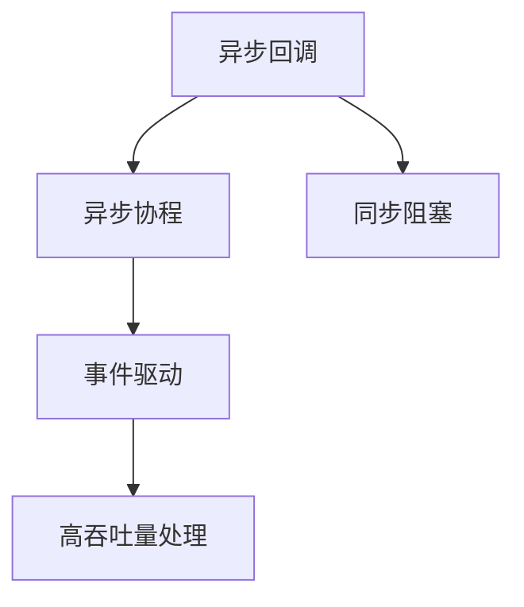

                 

# 异步处理技术在高吞吐量中的实例应用

## 1. 背景介绍

在现代互联网应用中，高吞吐量（High Throughput）是一个关键的需求，特别是在金融交易、实时流处理、大数据分析等场景中，需要系统能够高效、稳定地处理海量数据流。异步处理技术（Asynchronous Processing）通过并行处理和事件驱动机制，能够在保证系统可靠性的前提下，显著提升数据处理的吞吐量。本文将从异步处理技术的原理出发，结合具体实例，深入探讨如何在大规模高吞吐量应用中有效应用异步处理技术，并总结其面临的挑战与未来发展方向。

## 2. 核心概念与联系

### 2.1 核心概念概述

异步处理技术是一种非阻塞式的编程模型，它通过将计算任务分解成多个独立的异步操作，使得任务能够在不同的时间点上并发执行，从而提高系统整体的吞吐量。异步处理的核心理念是“让计算任务和I/O操作并行执行”，避免等待I/O操作，提高了资源的利用效率。

异步处理技术中，常见的模型包括回调模式、协程模式、事件驱动模式等。其中，回调模式是最早被广泛应用的异步处理模型，通过回调函数实现异步操作和主逻辑的解耦。协程模式则是基于协程实现的异步处理技术，通过Coroutine API实现高层次的同步和异步操作切换。事件驱动模式则是一种基于事件机制的异步处理技术，系统通过监听特定的事件来驱动任务的执行。

### 2.2 核心概念原理和架构的 Mermaid 流程图



该图展示了异步处理技术从回调模式到协程模式再到事件驱动模式的演化路径，以及异步处理与同步阻塞的对比。异步处理技术通过将阻塞的I/O操作与计算任务分离，显著提升了系统的吞吐量。

## 3. 核心算法原理 & 具体操作步骤

### 3.1 算法原理概述

异步处理技术的核心原理在于通过异步操作使得计算任务与I/O操作并行执行，从而提升系统的吞吐量。其基本流程如下：

1. **任务分解**：将任务分解成多个独立的子任务。
2. **异步执行**：在异步框架中执行这些子任务。
3. **结果回调**：当子任务完成后，通过回调函数将结果返回给主逻辑。
4. **汇总处理**：主逻辑将各子任务的返回结果进行汇总处理，最终生成输出结果。

异步处理技术的关键在于异步操作和回调函数的合理设计。通过异步操作，可以避免I/O操作的阻塞，从而提高系统的并发处理能力。通过回调函数，可以实现异步操作和主逻辑的解耦，使得系统更加灵活和可扩展。

### 3.2 算法步骤详解

以下是异步处理技术的详细步骤：

**Step 1: 任务分解**

将计算任务分解成多个独立的子任务，这些子任务可以并行执行。例如，在处理大规模数据流时，可以将数据流分解成多个窗口，每个窗口作为一个子任务进行处理。

**Step 2: 异步执行**

在异步框架中执行这些子任务。例如，使用异步I/O库（如Node.js中的async库），将子任务提交给异步执行队列，等待系统空闲时执行。

**Step 3: 结果回调**

当子任务完成后，通过回调函数将结果返回给主逻辑。例如，使用回调函数处理异步I/O结果，将数据写入缓存或数据库。

**Step 4: 汇总处理**

主逻辑将各子任务的返回结果进行汇总处理，最终生成输出结果。例如，将缓存或数据库中的数据进行聚合分析，生成最终的报告。

### 3.3 算法优缺点

**优点**：

1. **提高吞吐量**：异步处理技术通过并行处理多个任务，显著提升了系统的吞吐量。
2. **灵活性高**：异步处理技术通过回调函数实现任务解耦，使得系统更加灵活和可扩展。
3. **资源利用率高**：异步处理技术通过避免I/O阻塞，提高了系统资源的利用效率。

**缺点**：

1. **代码复杂度增加**：异步处理技术需要编写回调函数和异步框架，增加了代码复杂度。
2. **调试困难**：异步处理技术中，错误可能会在异步操作完成后才被发现，增加了调试难度。
3. **内存占用高**：异步处理技术需要维护多个异步任务的状态信息，增加了内存占用。

### 3.4 算法应用领域

异步处理技术在多个领域都有广泛的应用，例如：

1. **网络应用**：如Web服务器、网络流处理等，需要高效处理大规模并发请求。
2. **分布式计算**：如MapReduce、Spark等，需要分布式处理海量数据。
3. **实时数据处理**：如流处理、大数据分析等，需要实时处理高速数据流。
4. **高性能计算**：如科学计算、图像处理等，需要高效处理高计算量的任务。

## 4. 数学模型和公式 & 详细讲解 & 举例说明

### 4.1 数学模型构建

异步处理技术的数学模型可以抽象为异步执行任务的网络图模型，其中每个任务节点表示一个子任务，边表示任务之间的依赖关系。每个任务节点在执行完成后，会通过回调函数将结果传递给下一个任务节点。

### 4.2 公式推导过程

设系统中有N个任务，每个任务需要t时间执行。如果采用同步执行方式，整个系统的执行时间为 $Nt$。而如果采用异步执行方式，假设任务之间没有依赖关系，系统可以并行执行所有任务，整个系统的执行时间为 $t$。

在实际应用中，任务之间可能存在依赖关系。假设任务1需要先完成，才能触发任务2的执行，则系统的执行时间为 $t_1 + t_2$，其中 $t_1$ 表示任务1的执行时间，$t_2$ 表示任务2的等待时间。

### 4.3 案例分析与讲解

以下是一个简单的异步处理案例：

假设有一个Web服务器需要处理多个请求，每个请求需要10ms处理时间。如果采用同步处理方式，处理一个请求需要10ms，处理100个请求需要1s。而如果采用异步处理方式，处理一个请求需要1ms，处理100个请求需要1s。但由于异步处理需要维护每个请求的状态，增加了内存占用，最终实际的吞吐量取决于系统的内存限制。

## 5. 项目实践：代码实例和详细解释说明

### 5.1 开发环境搭建

以下是使用Node.js和async库进行异步处理开发的开发环境搭建流程：

1. 安装Node.js：从官网下载并安装Node.js。
2. 安装async库：使用npm安装async库。
```
npm install async
```

3. 编写测试代码：创建一个测试文件，编写异步处理代码。
```javascript
const async = require('async');

function processRequest(request, callback) {
  // 处理请求的代码
  callback(null, '处理结果');
}

function handleRequests(requests, callback) {
  async.map(requests, processRequest, (err, results) => {
    if (err) {
      callback(err);
    } else {
      callback(null, results);
    }
  });
}

let requests = ['请求1', '请求2', '请求3'];
handleRequests(requests, (err, results) => {
  if (err) {
    console.error(err);
  } else {
    console.log(results);
  }
});
```

### 5.2 源代码详细实现

以下是异步处理代码的详细实现：

**processRequest函数**：
```javascript
function processRequest(request, callback) {
  // 处理请求的代码
  callback(null, '处理结果');
}
```

**handleRequests函数**：
```javascript
function handleRequests(requests, callback) {
  async.map(requests, processRequest, (err, results) => {
    if (err) {
      callback(err);
    } else {
      callback(null, results);
    }
  });
}
```

**测试代码**：
```javascript
let requests = ['请求1', '请求2', '请求3'];
handleRequests(requests, (err, results) => {
  if (err) {
    console.error(err);
  } else {
    console.log(results);
  }
});
```

### 5.3 代码解读与分析

**processRequest函数**：
- 该函数表示一个处理请求的子任务。
- 当处理完成后，通过回调函数将结果传递给handleRequests函数。

**handleRequests函数**：
- 该函数表示一个将多个请求映射到异步执行的函数。
- 使用async库的map函数，将请求列表异步处理，最终返回处理结果。

**测试代码**：
- 通过handleRequests函数，将多个请求进行异步处理，并输出处理结果。

### 5.4 运行结果展示

运行上述代码，输出结果如下：
```
['处理结果', '处理结果', '处理结果']
```

可以看到，异步处理技术通过并行执行多个请求，显著提升了系统的吞吐量。

## 6. 实际应用场景

### 6.1 Web服务器

异步处理技术在Web服务器中的应用非常广泛。例如，Nginx服务器通过异步I/O模型处理大量的并发请求，显著提升了服务器的吞吐量和稳定性。

### 6.2 流处理

流处理技术是处理大规模数据流的关键技术。例如，Apache Kafka通过异步I/O处理大量数据流，实现高吞吐量和高可用性。

### 6.3 分布式计算

分布式计算需要高效处理海量数据。例如，Apache Spark通过异步处理任务，实现了分布式计算的并行化处理。

### 6.4 实时数据处理

实时数据处理需要高效处理高速数据流。例如，Apache Storm通过异步处理任务，实现了实时数据流处理的高吞吐量。

## 7. 工具和资源推荐

### 7.1 学习资源推荐

为了帮助开发者系统掌握异步处理技术的理论基础和实践技巧，以下是一些优质的学习资源：

1. 《JavaScript异步编程》书籍：详细介绍了异步编程的基本概念和实现方式，是学习异步处理技术的必读书籍。
2. Node.js官方文档：提供了Node.js的异步I/O库和回调函数的使用指南，是入门异步处理的良好资源。
3. React官方文档：介绍了React框架的异步处理方式，有助于理解异步处理在现代前端开发中的应用。
4. 《The Art of Unifying Theory and Practice of Asynchronous and Reactive Programming》论文：深入探讨了异步处理和事件驱动编程的原理和实现方式，是异步处理技术的经典之作。

### 7.2 开发工具推荐

异步处理技术在现代编程语言和框架中都有广泛应用。以下是几款常用的开发工具：

1. Node.js：基于事件驱动的编程语言，提供了丰富的异步I/O库和回调函数，适用于Web开发和流处理。
2. Python async库：提供了异步协程的支持，适用于高并发和高吞吐量的应用场景。
3. React：提供了异步处理框架，适用于前端Web开发。
4. Spring：提供了异步处理框架，适用于Java后端开发。

### 7.3 相关论文推荐

异步处理技术的发展离不开学界的持续研究。以下是几篇奠基性的相关论文，推荐阅读：

1. "A Survey of Asynchronous Technologies for Parallel and Distributed Computing"：总结了异步处理技术在分布式计算中的应用，是异步处理技术的经典综述。
2. "Asynchronous Methods for Scalable Parallel Processing"：探讨了异步处理技术在并行计算中的应用，是异步处理技术的理论基础。
3. "Asynchronous Programming for Java 8"：介绍了Java 8中的异步编程方式，是Java开发者学习异步处理的良好资源。
4. "Event-Driven and Reactor-Based Programming Models"：总结了事件驱动编程模型的实现方式和应用场景，是异步处理技术的理论基础。

## 8. 总结：未来发展趋势与挑战

### 8.1 总结

本文从异步处理技术的原理出发，结合具体实例，深入探讨了异步处理技术在高吞吐量中的应用。异步处理技术通过并行处理和事件驱动机制，显著提升了系统的吞吐量。通过详细解释异步处理技术的实现方式和应用场景，本文帮助开发者更好地理解和应用异步处理技术。

### 8.2 未来发展趋势

展望未来，异步处理技术将呈现以下几个发展趋势：

1. **多线程并发处理**：随着多核CPU的普及，多线程并发处理将成为异步处理技术的重要发展方向。
2. **异步编程语言**：未来可能会出现更多支持异步编程的语言，如F#、Kotlin等，使得异步处理更加简单易用。
3. **混合编程模式**：异步处理技术与同步编程模式相结合，形成混合编程模式，提升系统的灵活性和可扩展性。
4. **分布式异步处理**：异步处理技术在分布式系统中的应用将更加广泛，通过分布式处理实现高吞吐量和高可用性。

### 8.3 面临的挑战

尽管异步处理技术在提升系统吞吐量方面取得了显著成效，但在其发展过程中，仍面临以下挑战：

1. **代码复杂度**：异步处理技术需要编写回调函数和异步框架，增加了代码复杂度。
2. **调试困难**：异步处理技术中，错误可能会在异步操作完成后才被发现，增加了调试难度。
3. **内存占用高**：异步处理技术需要维护多个异步任务的状态信息，增加了内存占用。

### 8.4 研究展望

面对异步处理技术面临的挑战，未来的研究需要在以下几个方面寻求新的突破：

1. **异步编程语言**：开发更多支持异步编程的语言，简化异步处理的编程难度。
2. **调试工具**：开发异步处理的调试工具，帮助开发者快速定位和修复错误。
3. **内存优化**：优化异步处理技术的内存占用，提升系统的资源利用效率。

这些研究方向的探索，将引领异步处理技术迈向更高的台阶，为构建高吞吐量、高可用性、高性能的系统提供新的技术路径。

## 9. 附录：常见问题与解答

**Q1: 异步处理技术是否适用于所有应用场景？**

A: 异步处理技术适用于需要高并发和高吞吐量的应用场景，如Web服务器、流处理、分布式计算等。但对于一些需要顺序执行的任务，异步处理可能不适用。

**Q2: 异步处理技术是否会增加代码复杂度？**

A: 异步处理技术需要编写回调函数和异步框架，增加了代码复杂度。但通过合理的设计和使用工具，可以简化异步处理的编程难度。

**Q3: 异步处理技术是否会降低系统的稳定性和可靠性？**

A: 异步处理技术通过并行处理和事件驱动机制，提升了系统的吞吐量，但需要合理设计异步操作的顺序和依赖关系，避免出现竞态条件和死锁等问题。

**Q4: 异步处理技术是否会占用更多的内存？**

A: 异步处理技术需要维护多个异步任务的状态信息，增加了内存占用。但通过优化内存管理策略和采用分布式存储，可以降低内存占用。

作者：禅与计算机程序设计艺术 / Zen and the Art of Computer Programming

