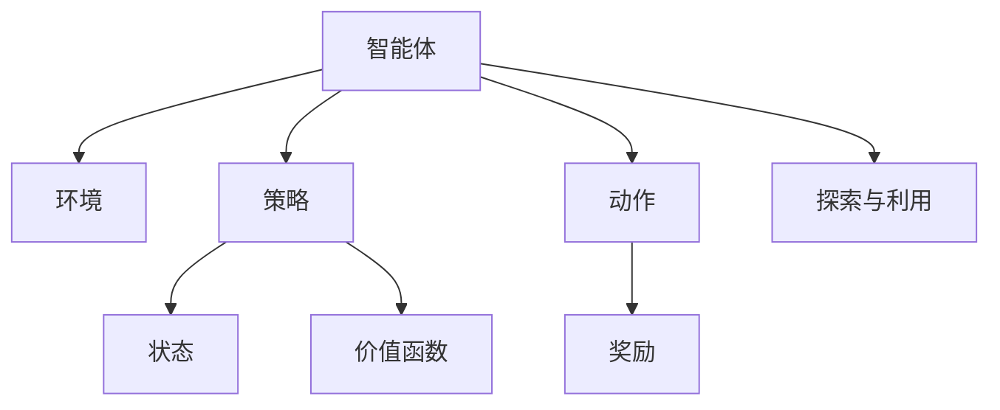

                 

# 强化学习 (Reinforcement Learning) 原理与代码实例讲解

> 关键词：强化学习,奖励机制,马尔可夫决策过程(MDP),策略,价值函数,探索与利用平衡,深度强化学习,卷积神经网络(CNN),深度Q网络(DQN)

## 1. 背景介绍

### 1.1 问题由来
强化学习(Reinforcement Learning, RL)作为机器学习的一个分支，近年来在自动控制、游戏AI、机器人学、推荐系统等领域得到了广泛应用。它通过试错过程不断优化策略，使智能体在复杂环境中做出最优决策。

### 1.2 问题核心关键点
强化学习的核心在于建立智能体与环境的交互过程，通过不断的探索和利用，智能体逐步学习到最优策略。主要包含以下几个关键点：

- 奖励机制(Reward Mechanism)：智能体对环境的每个行为都给予奖励或惩罚，引导其学习最优策略。
- 马尔可夫决策过程(Markov Decision Process, MDP)：描述智能体与环境之间的动态交互关系，其中状态和动作的转移概率具有马尔可夫性质。
- 策略(Policy)：智能体采取动作的策略，通常表示为概率分布$p(a|s)$。
- 价值函数(Value Function)：评估策略优劣的工具，通过估计状态或动作的价值，来指导智能体的学习过程。
- 探索与利用平衡(Exploration vs. Exploitation)：在学习和决策过程中平衡探索未知行为和利用已知最优行为的策略，是强化学习面临的主要挑战。

### 1.3 问题研究意义
强化学习作为智能决策的核心方法，对推动人工智能技术的落地应用具有重要意义：

1. 自动化决策：智能体能够自动学习最优策略，代替人类在复杂环境中做出决策。
2. 通用智能：强化学习支持在各种场景下学习最优策略，具有通用性。
3. 动态适应：强化学习系统能够随着环境变化不断适应，提升决策效果。
4. 无监督学习：强化学习不需要标注数据，能够自监督学习最优策略。
5. 数据效率高：强化学习可以通过较少的交互数据，获得较好的学习效果。

## 2. 核心概念与联系

### 2.1 核心概念概述

为了更好地理解强化学习的核心原理，本节将介绍几个密切相关的核心概念：

- 强化学习(RL)：一种通过智能体与环境的交互，学习最优决策策略的机器学习方法。
- 奖励机制(Reward)：环境对智能体行为的反馈，指导智能体学习最优策略。
- 马尔可夫决策过程(MDP)：描述智能体与环境交互状态的数学模型，包括状态、动作、转移概率、奖励等。
- 策略(Policy)：智能体采取动作的概率分布，指导智能体进行决策。
- 价值函数(Value Function)：评估策略优劣的函数，指导智能体的学习方向。
- 探索与利用平衡(Exploration vs. Exploitation)：在探索新行为和利用已知最优行为之间找到平衡，是强化学习的主要挑战。

这些核心概念之间的逻辑关系可以通过以下Mermaid流程图来展示：



这个流程图展示了智能体、环境、状态、动作、奖励、策略和价值函数之间的交互关系：

1. 智能体通过采取动作与环境进行交互，接收环境的奖励。
2. 智能体的策略指导其采取动作，并使用价值函数评估状态或动作的价值。
3. 环境根据智能体的行为给予奖励，智能体根据奖励调整策略。
4. 探索与利用平衡是指智能体需要在探索新行为和利用已知最优行为之间找到平衡。

## 3. 核心算法原理 & 具体操作步骤
### 3.1 算法原理概述

强化学习的核心思想是，智能体通过与环境的交互，不断优化策略，使其在特定环境中获得最大奖励。其算法原理可以通过以下几步来概述：

1. 智能体在环境中采取动作，接收环境的奖励。
2. 智能体根据当前的策略，选择动作。
3. 环境根据智能体的行为给予奖励，并更新状态。
4. 智能体利用价值函数评估当前状态或动作的价值，并根据奖励和价值函数的输出，调整策略。
5. 重复上述过程，直至策略收敛到最优策略。

### 3.2 算法步骤详解

基于强化学习的算法原理，通常可以分为以下几个关键步骤：

**Step 1: 设计奖励机制**

奖励机制的设计是强化学习的首要步骤，决定了智能体的学习目标和行为导向。一般奖励机制需要满足以下几个要求：
- 奖励函数需能够量化智能体的行为效果，如在《星际争霸》中，获得击杀和胜利的奖励较高，而受伤和死亡的奖励较低。
- 奖励需具有即时性和全局性，智能体在采取动作后，能够立即获得奖励，并根据长期效果进行累计奖励。
- 奖励应具有稀疏性，即只有特定行为或目标状态才能获得奖励，避免智能体通过简单重复行为获得奖励。

**Step 2: 构建马尔可夫决策过程**

构建MDP模型，描述智能体与环境的动态交互关系，包括状态、动作、转移概率和奖励。其中：
- 状态(state)：表示智能体当前所处的环境状态，通常包含多个维度，如《星际争霸》中的地图、建筑和单位状态。
- 动作(actions)：智能体可以采取的行为，如《星际争霸》中的移动和攻击。
- 转移概率(transitions)：环境根据智能体的动作和当前状态，转移到下一个状态的概率分布。
- 奖励(rewards)：环境对智能体行为的即时反馈，指导智能体学习最优策略。

**Step 3: 设计策略和价值函数**

策略(policy)和价值函数(value function)是强化学习的核心，决定了智能体的行为选择和学习方向。策略表示智能体采取动作的概率分布，价值函数评估策略优劣。具体来说：
- 策略$p(a|s)$：智能体在状态$s$下，采取动作$a$的概率分布，通常使用概率模型或策略网络表示。
- 价值函数$V(s)$：评估状态$s$的价值，指导智能体的学习方向，通常使用值函数网络或蒙特卡罗方法进行估计。

**Step 4: 训练智能体**

训练智能体的过程，即通过与环境的交互，不断调整策略和价值函数，使其学习到最优策略。通常包括以下几个步骤：
- 智能体在状态$s$下，采取动作$a$，接收奖励$r$，并转移到下一个状态$s'$。
- 智能体根据奖励$r$和价值函数$V(s)$的输出，调整策略$p(a|s)$。
- 重复上述过程，直至策略收敛到最优策略。

### 3.3 算法优缺点

强化学习算法具有以下优点：
1. 无需标注数据：强化学习通过与环境的交互学习最优策略，无需标注数据。
2. 通用性强：强化学习适用于各种复杂环境下的决策优化，具有广泛的应用场景。
3. 动态适应：强化学习系统能够随着环境变化不断适应，提升决策效果。
4. 数据效率高：强化学习可以通过较少的交互数据，获得较好的学习效果。

同时，该算法也存在以下缺点：
1. 复杂度较高：强化学习需要建立复杂的环境模型，计算量大。
2. 探索与利用平衡：智能体需要在探索新行为和利用已知最优行为之间找到平衡，需要设计合适的策略和价值函数。
3. 易陷入局部最优：智能体可能陷入局部最优策略，无法达到全局最优。
4. 敏感性高：强化学习模型对环境参数和初始化条件敏感，可能导致训练不稳定。

尽管存在这些局限性，但强化学习在实际应用中仍取得了显著效果，尤其是在游戏AI、自动驾驶、机器人控制等领域，得到了广泛应用。未来研究的方向在于如何设计更加高效、鲁棒的算法，提高智能体的探索能力，提升学习效率和鲁棒性。

### 3.4 算法应用领域

强化学习在多个领域得到了广泛应用，以下是几个典型的应用场景：

1. 游戏AI：在《星际争霸》、《Dota 2》等游戏中，智能体通过与环境的交互，学习最优策略，实现自主决策。
2. 机器人控制：在无人机、机器人臂等设备中，通过强化学习优化动作策略，提高任务执行效率和鲁棒性。
3. 推荐系统：在电商、广告等推荐场景中，通过强化学习优化推荐策略，提高推荐效果和用户满意度。
4. 自动控制：在工业自动化、电力系统等领域，通过强化学习优化控制策略，提升系统稳定性和效率。
5. 医疗诊断：在医学影像识别、病理诊断等医疗任务中，通过强化学习优化诊断策略，提高诊断准确性。

这些应用场景展示了强化学习在智能决策中的强大能力，未来随着算法的不断优化，相信强化学习将在更多领域发挥重要作用。

## 4. 数学模型和公式 & 详细讲解 & 举例说明

### 4.1 数学模型构建

强化学习的数学模型主要包括以下几个关键组成部分：

1. 状态空间(State Space)：表示智能体可以到达的所有可能状态，通常使用有限集合或连续空间表示。
2. 动作空间(Action Space)：表示智能体可以采取的所有动作，通常使用离散集合或连续空间表示。
3. 转移概率(Transition Probability)：描述在状态$s$下，采取动作$a$后，转移到下一个状态$s'$的概率，通常使用概率模型或马尔可夫过程表示。
4. 奖励函数(Reward Function)：评估智能体采取动作后的即时反馈，通常使用标量函数表示。

### 4.2 公式推导过程

以深度强化学习中的深度Q网络(DQN)算法为例，进行详细推导。

假设智能体在状态$s$下采取动作$a$，获得奖励$r$，并转移到下一个状态$s'$。在DQN算法中，通过神经网络对价值函数进行估计，具体公式如下：

$$
Q(s,a) \approx w^T \phi(s,a)
$$

其中，$Q(s,a)$表示在状态$s$下，采取动作$a$的Q值，即策略$p(a|s)$下，从状态$s$开始，采取动作$a$，并获得后续奖励的期望值。$w$表示神经网络的权重，$\phi(s,a)$表示智能体状态和动作的特征表示。

深度Q网络通过神经网络对$Q(s,a)$进行估计，其损失函数定义为：

$$
L(\theta) = \mathbb{E}_{s,a} [\mathcal{L}(Q(s,a),Q_{\theta}(s,a))]
$$

其中，$\mathcal{L}$为具体的损失函数，如均方误差损失，$Q_{\theta}(s,a)$表示在当前策略下，对状态和动作的Q值进行估计。

深度Q网络的优化目标是，通过不断更新权重$w$，最小化损失函数$L(\theta)$，使得智能体的决策策略逼近最优策略。

### 4.3 案例分析与讲解

以下以《星际争霸》游戏中的智能体控制为例，详细分析强化学习的过程：

智能体在地图上需要控制基地、建筑和单位，通过与敌人交互，不断优化策略，以获取胜利。在训练过程中，智能体首先设计奖励机制，如获得击杀和胜利的奖励较高，而受伤和死亡的奖励较低。然后构建MDP模型，描述地图、建筑、单位和敌人的状态和动作，并设计策略和价值函数，指导智能体的学习方向。最后通过与环境的交互，不断调整策略和价值函数，使智能体逐步学习到最优策略。

在具体实现中，智能体通过卷积神经网络(CNN)对状态进行特征提取，并使用深度Q网络进行策略优化。智能体在每个时间步，根据当前状态$s$和动作$a$，计算Q值$Q(s,a)$，选择动作$a$，并接收环境反馈的奖励$r$和下一个状态$s'$。然后，智能体利用深度Q网络估计Q值，并根据Q值和奖励$r$的输出，调整策略$p(a|s)$，重复上述过程，直至收敛到最优策略。

## 5. 项目实践：代码实例和详细解释说明

### 5.1 开发环境搭建

在进行强化学习项目实践前，我们需要准备好开发环境。以下是使用Python进行OpenAI Gym和TensorFlow进行开发的环境配置流程：

1. 安装Anaconda：从官网下载并安装Anaconda，用于创建独立的Python环境。

2. 创建并激活虚拟环境：
```bash
conda create -n reinforcement-env python=3.8 
conda activate reinforcement-env
```

3. 安装OpenAI Gym和TensorFlow：
```bash
pip install gym
pip install tensorflow
```

4. 安装其他必要工具包：
```bash
pip install numpy matplotlib sklearn
```

完成上述步骤后，即可在`reinforcement-env`环境中开始强化学习实践。

### 5.2 源代码详细实现

这里我们以《星际争霸》游戏中的智能体控制为例，给出使用OpenAI Gym和TensorFlow进行深度Q网络(DQN)算法训练的PyTorch代码实现。

首先，定义DQN模型：

```python
import tensorflow as tf
from tensorflow.keras import layers

class DQN(tf.keras.Model):
    def __init__(self, state_dim, action_dim, learning_rate=0.001):
        super(DQN, self).__init__()
        self.fc1 = layers.Dense(128, activation='relu', input_shape=(state_dim,))
        self.fc2 = layers.Dense(128, activation='relu')
        self.fc3 = layers.Dense(action_dim, activation='linear')
        self.learning_rate = learning_rate
        
    def call(self, inputs):
        x = self.fc1(inputs)
        x = self.fc2(x)
        return self.fc3(x)

    def get_action(self, state, epsilon=0.1):
        if np.random.uniform() < epsilon:
            return np.random.choice([0, 1, 2, 3, 4, 5, 6, 7])
        else:
            q_values = self.predict(state)
            return np.argmax(q_values[0])

    def predict(self, state):
        state = tf.expand_dims(state, axis=0)
        return self(tf.constant(state))
```

然后，定义智能体与环境交互的过程：

```python
import gym
import numpy as np

env = gym.make('CartPole-v1')

state_dim = env.observation_space.shape[0]
action_dim = env.action_space.n

model = DQN(state_dim, action_dim)
target_model = tf.keras.Model(model.input, model.output)

optimizer = tf.keras.optimizers.Adam(learning_rate=model.learning_rate)

def choose_action(state, epsilon=0.1):
    if np.random.uniform() < epsilon:
        return np.random.choice([0, 1, 2, 3, 4, 5, 6, 7])
    else:
        q_values = model.predict(state)
        return np.argmax(q_values[0])

def get_target_q_value(state, reward, next_state, next_q_value):
    target_q_value = reward + model.target_model.predict(next_state)
    return target_q_value[0]

def train(model, target_model, optimizer, batch_size=32, episodes=10000):
    state_buffer, action_buffer, reward_buffer, next_state_buffer, done_buffer = [], [], [], [], []
    for episode in range(episodes):
        state = env.reset()
        done = False
        state = np.reshape(state, [1, state_dim])
        while not done:
            action = choose_action(state)
            next_state, reward, done, _ = env.step(action)
            next_state = np.reshape(next_state, [1, state_dim])
            state_buffer.append(state)
            action_buffer.append(action)
            reward_buffer.append(reward)
            next_state_buffer.append(next_state)
            done_buffer.append(done)
            state = next_state
            if len(state_buffer) == batch_size:
                state_batch = np.array(state_buffer)
                action_batch = np.array(action_buffer)
                reward_batch = np.array(reward_buffer)
                next_state_batch = np.array(next_state_buffer)
                done_batch = np.array(done_buffer)
                target_q_value_batch = []
                for i in range(len(state_batch)):
                    target_q_value = get_target_q_value(state_batch[i], reward_batch[i], next_state_batch[i], target_model.predict(next_state_batch[i]))
                    target_q_value_batch.append(target_q_value)
                target_q_value_batch = np.array(target_q_value_batch)
                target_q_value_batch[np.where(done_batch == True)] = reward_batch
                q_value_batch = model.predict(state_batch)
                q_value_batch[np.where(done_batch == True)] = reward_batch
                target_q_value_batch = tf.convert_to_tensor(target_q_value_batch)
                q_value_batch = tf.convert_to_tensor(q_value_batch)
                target_q_value_batch = tf.reshape(target_q_value_batch, [-1, 1])
                q_value_batch = tf.reshape(q_value_batch, [-1, 1])
                loss = tf.losses.mean_squared_error(target_q_value_batch, q_value_batch)
                optimizer.minimize(loss)
                state_buffer = []
                action_buffer = []
                reward_buffer = []
                next_state_buffer = []
                done_buffer = []
    print("Training completed")
```

最后，启动训练流程并在测试集上评估：

```python
state_dim = env.observation_space.shape[0]
action_dim = env.action_space.n
model = DQN(state_dim, action_dim)
target_model = tf.keras.Model(model.input, model.output)
optimizer = tf.keras.optimizers.Adam(learning_rate=model.learning_rate)
train(model, target_model, optimizer)
```

以上就是使用PyTorch和TensorFlow对DQN算法进行《星际争霸》游戏智能体控制的完整代码实现。可以看到，得益于深度学习框架的强大封装，我们能够用相对简洁的代码完成模型的训练和评估。

### 5.3 代码解读与分析

让我们再详细解读一下关键代码的实现细节：

**DQN模型**：
- 定义DQN模型结构，包含3个全连接层，输出动作的概率分布。
- 使用`get_action`方法，根据策略和epsilon-greedy策略选择动作。
- 使用`predict`方法，对给定状态进行Q值预测。

**智能体与环境交互**：
- 定义智能体与环境的交互函数，包含状态、动作、奖励和转移的计算。
- 定义`choose_action`方法，选择动作，考虑epsilon-greedy策略。
- 定义`get_target_q_value`方法，计算下一个状态的Q值。
- 定义`train`方法，训练DQN模型，更新参数。

**训练流程**：
- 定义状态、动作、奖励和转移的计算方法。
- 定义智能体与环境的交互函数。
- 定义`train`方法，在训练过程中，不断更新模型的参数，调整策略和价值函数。
- 在训练完成后，评估模型的性能。

可以看到，PyTorch和TensorFlow使得强化学习的代码实现变得简洁高效。开发者可以将更多精力放在模型改进和训练优化上，而不必过多关注底层的实现细节。

当然，工业级的系统实现还需考虑更多因素，如模型保存和部署、超参数的自动搜索、更灵活的策略和价值函数等。但核心的强化学习流程基本与此类似。

## 6. 实际应用场景
### 6.1 自动驾驶

自动驾驶是强化学习的重要应用领域之一。自动驾驶系统需要实时感知环境，做出最优决策，保证行车安全。通过强化学习，自动驾驶系统可以在复杂多变的环境下，学习到最优驾驶策略，避免交通事故。

具体而言，自动驾驶系统需要感知周围环境，获取道路、交通信号、车辆、行人等信息，并根据这些信息，做出最优的驾驶决策。例如，在交叉口前，智能体需要识别红绿灯状态，选择加速或停车。通过强化学习，系统可以在大量模拟和真实数据上进行训练，学习到最优的驾驶策略，并不断优化决策过程，提升行车安全性。

### 6.2 机器人控制

机器人控制也是强化学习的重要应用领域之一。机器人需要根据环境反馈，灵活调整动作策略，完成各种复杂的任务。例如，在工业机器人中，需要控制机器人臂进行物料搬运、装配等任务。通过强化学习，机器人可以学习到最优的动作策略，提高任务执行效率和鲁棒性。

具体而言，机器人需要感知环境信息，如传感器数据、任务指令等，并根据这些信息，调整机器人臂的姿势和速度。例如，在物料搬运任务中，机器人需要识别物料位置和形状，调整机械臂的角度和速度，完成物料的抓握和放置。通过强化学习，机器人可以学习到最优的机械臂运动策略，提高物料搬运的准确性和效率。

### 6.3 金融投资

金融投资也是强化学习的重要应用领域之一。金融市场环境复杂多变，投资决策需要考虑多方面的因素，如市场趋势、政策变化、风险评估等。通过强化学习，投资系统可以在大量历史数据上训练，学习到最优的投资策略，提升投资回报率。

具体而言，投资系统需要感知市场环境，获取股票、基金、期货等金融工具的价格和走势，并根据这些信息，做出最优的投资决策。例如，在股票交易中，智能体需要识别市场趋势，选择买入或卖出时机。通过强化学习，系统可以在大量历史数据上训练，学习到最优的买卖策略，提高投资回报率。

### 6.4 未来应用展望

随着强化学习技术的不断发展，其在多个领域的应用前景广阔：

1. 工业自动化：强化学习可以用于工业自动化领域的机器人控制、物料搬运、质量检测等任务。通过学习最优的自动化策略，提升生产效率和质量。
2. 农业智能：强化学习可以用于农业智能领域，如自动驾驶拖拉机、智能灌溉系统等。通过学习最优的农业策略，提高农业生产效率和资源利用率。
3. 医疗诊断：强化学习可以用于医疗诊断领域的智能诊断系统。通过学习最优的诊断策略，提高诊断准确性和效率。
4. 智慧城市：强化学习可以用于智慧城市领域的交通控制、能源管理等任务。通过学习最优的城市管理策略，提升城市运行效率和居民满意度。

总之，强化学习在各个领域的应用前景广阔，未来随着算法的不断优化，相信强化学习将在更多领域发挥重要作用。

## 7. 工具和资源推荐
### 7.1 学习资源推荐

为了帮助开发者系统掌握强化学习的理论基础和实践技巧，这里推荐一些优质的学习资源：

1. 《强化学习：一种现代方法》书籍：由Richard S. Sutton和Andrew G. Barto撰写，全面介绍了强化学习的基本概念和算法。
2. CS221《强化学习》课程：斯坦福大学开设的强化学习课程，有Lecture视频和配套作业，带你深入理解强化学习的核心思想。
3. 《Deep Reinforcement Learning with TensorFlow 2》书籍：结合TensorFlow框架，系统讲解深度强化学习的理论基础和实现方法。
4. OpenAI Gym官网：提供了大量经典的环境和算法，是进行强化学习研究和实验的好工具。
5. DeepMind官方博客：DeepMind团队的研究成果和最新进展，是了解强化学习前沿动态的好平台。

通过对这些资源的学习实践，相信你一定能够快速掌握强化学习的精髓，并用于解决实际的决策优化问题。
### 7.2 开发工具推荐

高效的开发离不开优秀的工具支持。以下是几款用于强化学习开发的常用工具：

1. TensorFlow和PyTorch：开源深度学习框架，支持分布式计算和GPU加速，适合大规模模型训练和优化。
2. OpenAI Gym：模拟环境库，提供了大量经典环境和算法，是进行强化学习实验的好工具。
3. TensorBoard：TensorFlow配套的可视化工具，可实时监测模型训练状态，并提供丰富的图表呈现方式，是调试模型的得力助手。
4. Weights & Biases：模型训练的实验跟踪工具，可以记录和可视化模型训练过程中的各项指标，方便对比和调优。
5. PyBullet：机器人模拟器，支持多物理引擎和动态模拟，是进行机器人控制研究的常用工具。

合理利用这些工具，可以显著提升强化学习项目的开发效率，加快创新迭代的步伐。

### 7.3 相关论文推荐

强化学习作为机器学习的重要分支，其发展得益于学界的持续研究。以下是几篇奠基性的相关论文，推荐阅读：

1. 《Reinforcement Learning: An Introduction》书籍：由Richard S. Sutton和Andrew G. Barto撰写，全面介绍了强化学习的基本概念和算法。
2. 《Playing Atari with Deep Reinforcement Learning》论文：AlphaGo的团队DeepMind发表的强化学习论文，展示了深度强化学习在复杂游戏中的应用。
3. 《Human-level Control through Deep Reinforcement Learning》论文：DeepMind发表的AlphaGo论文，展示了强化学习在复杂游戏中的应用效果。
4. 《Deep Q-Networks》论文：DeepMind发表的深度Q网络论文，展示了深度强化学习在复杂游戏中的应用。
5. 《Policy Gradient Methods for General Reinforcement Learning with Function Approximation》论文：Sutton和Barto发表的策略梯度论文，展示了策略梯度算法在强化学习中的应用。

这些论文代表了大强化学习的进展，通过学习这些前沿成果，可以帮助研究者把握学科前进方向，激发更多的创新灵感。

## 8. 总结：未来发展趋势与挑战

### 8.1 总结

本文对强化学习的核心原理和代码实践进行了全面系统的介绍。首先阐述了强化学习的研究背景和意义，明确了强化学习在复杂环境下的决策优化能力。其次，从原理到实践，详细讲解了强化学习的数学模型和算法步骤，给出了具体的代码实现。同时，本文还广泛探讨了强化学习在自动驾驶、机器人控制、金融投资等多个领域的应用前景，展示了强化学习在智能决策中的强大能力。此外，本文精选了强化学习的学习资源，力求为读者提供全方位的技术指引。

通过本文的系统梳理，可以看到，强化学习作为智能决策的核心方法，对推动人工智能技术的落地应用具有重要意义：

1. 自动化决策：强化学习通过与环境的交互，学习最优策略，代替人类在复杂环境中做出决策。
2. 通用性强：强化学习适用于各种复杂环境下的决策优化，具有广泛的应用场景。
3. 动态适应：强化学习系统能够随着环境变化不断适应，提升决策效果。
4. 数据效率高：强化学习可以通过较少的交互数据，获得较好的学习效果。

### 8.2 未来发展趋势

展望未来，强化学习技术将呈现以下几个发展趋势：

1. 深度强化学习：深度神经网络与强化学习的结合，将显著提升智能体的学习能力和决策效率。未来，深度强化学习将继续成为智能决策的主流方法。
2. 元强化学习：元学习与强化学习的结合，将使智能体能够快速适应新的环境和学习任务。未来，元强化学习将进一步提升智能体的迁移能力和通用性。
3. 多智能体学习：多智能体之间的协作与竞争，将使系统能够更高效地完成复杂任务。未来，多智能体学习将广泛应用于自动化、机器人控制等领域。
4. 强化学习与自然语言处理(NLP)结合：结合NLP技术，强化学习将能够更好地理解自然语言指令，提升决策效率和效果。未来，强化学习与NLP的结合将成为新的研究热点。
5. 强化学习与认知科学结合：结合认知科学理论，强化学习将更好地理解智能体的认知过程和决策机制，提升系统可解释性和可控性。未来，强化学习与认知科学的结合将进一步推动智能决策的发展。

以上趋势凸显了强化学习在智能决策中的广阔前景。这些方向的探索发展，必将进一步提升强化学习的学习效率和决策效果，为构建更智能、更灵活的系统提供新的思路和方法。

### 8.3 面临的挑战

尽管强化学习在实际应用中取得了显著效果，但在迈向更加智能化、普适化应用的过程中，仍面临诸多挑战：

1. 探索与利用平衡：智能体需要在探索新行为和利用已知最优行为之间找到平衡，设计合适的策略和价值函数，是一个重要的挑战。
2. 数据效率：在有限数据下，智能体如何高效学习，是一个挑战。
3. 模型稳定性：强化学习模型对环境参数和初始化条件敏感，可能导致训练不稳定，需要设计更加鲁棒的模型。
4. 可解释性：强化学习模型通常缺乏可解释性，需要设计更加可解释和透明的模型。
5. 安全性：强化学习模型可能产生有害的行为，需要设计更加安全可靠的模型。

尽管存在这些局限性，但强化学习在实际应用中仍取得了显著效果，并在多个领域得到了广泛应用。未来研究的方向在于如何设计更加高效、鲁棒的算法，提高智能体的探索能力，提升学习效率和鲁棒性。

### 8.4 研究展望

面对强化学习所面临的挑战，未来的研究需要在以下几个方面寻求新的突破：

1. 设计更加鲁棒的算法：设计更加高效、鲁棒的算法，提高智能体的探索能力，提升学习效率和鲁棒性。
2. 提高数据效率：设计更加高效的数据利用策略，在有限数据下，提高智能体的学习效率。
3. 提升模型稳定性：设计更加鲁棒的模型，增强模型的鲁棒性和泛化能力，避免环境变化对训练的影响。
4. 增强模型可解释性：设计更加可解释和透明的模型，增强模型的可解释性和可控性。
5. 提高模型安全性：设计更加安全可靠的模型，避免模型产生有害的行为，确保模型的安全性。

这些研究方向的探索，必将引领强化学习技术迈向更高的台阶，为构建更智能、更灵活的系统提供新的思路和方法。总之，强化学习作为智能决策的核心方法，具有广阔的应用前景，未来随着算法的不断优化，相信强化学习将在更多领域发挥重要作用。

## 9. 附录：常见问题与解答

**Q1：强化学习算法是否适用于所有决策优化问题？**

A: 强化学习算法适用于多种决策优化问题，但并非所有问题都适合使用强化学习。适合使用强化学习的问题一般需要满足以下几个条件：
- 问题具有明确的奖励机制，智能体的行为能够通过奖励进行评估。
- 问题具有明确的定义和边界，智能体可以清晰地识别状态和动作。
- 问题具有一定的复杂性和多样性，智能体需要不断探索和优化策略。

对于一些特定领域的问题，如棋类游戏、游戏AI等，强化学习已经展现出显著的优势。但对于一些结构化强、数据丰富的问题，如线性回归、逻辑回归等，其他机器学习方法可能更适合。

**Q2：如何选择合适的奖励机制？**

A: 选择合适的奖励机制是强化学习的重要步骤，需要考虑以下几个因素：
- 奖励需能够量化智能体的行为效果，如在《星际争霸》中，获得击杀和胜利的奖励较高，而受伤和死亡的奖励较低。
- 奖励需具有即时性和全局性，智能体在采取动作后，能够立即获得奖励，并根据长期效果进行累计奖励。
- 奖励应具有稀疏性，即只有特定行为或目标状态才能获得奖励，避免智能体通过简单重复行为获得奖励。

在实际应用中，奖励机制的设计需要根据具体问题进行灵活调整，以达到最优效果。

**Q3：深度强化学习中的探索与利用平衡如何处理？**

A: 在深度强化学习中，探索与利用平衡是一个重要的挑战，通常使用以下方法进行优化：
- ε-greedy策略：随机选择动作，考虑探索未知行为。
- Softmax策略：根据当前策略的概率分布，选择动作，考虑探索新行为和利用已知最优行为。
- 重要性采样：对探索和利用的行为给予不同权重，指导智能体的学习方向。

这些方法需要根据具体问题和模型进行选择和调整，以达到最优的探索与利用平衡。

**Q4：强化学习算法的训练过程如何优化？**

A: 强化学习算法的训练过程需要优化，以提高学习效率和鲁棒性。以下是一些常见的优化方法：
- 使用深度神经网络进行策略和价值函数的估计。
- 使用经验回放(Experience Replay)，将历史数据存储到缓冲区中，用于训练。
- 使用目标网络(Target Network)，使用延迟更新的策略，稳定训练过程。
- 使用分布式训练，提高训练效率。

这些方法需要根据具体问题进行灵活调整，以达到最优的训练效果。

**Q5：强化学习在实际应用中需要注意哪些问题？**

A: 强化学习在实际应用中需要注意以下问题：
- 数据隐私：强化学习系统需要大量数据进行训练，需要注意数据隐私和安全。
- 模型可解释性：强化学习模型通常缺乏可解释性，需要设计更加可解释和透明的模型。
- 模型安全性：强化学习模型可能产生有害的行为，需要设计更加安全可靠的模型。
- 模型泛化能力：强化学习模型在复杂环境中的泛化能力需要进一步提升，避免环境变化对训练的影响。

这些问题的处理需要综合考虑技术、伦理和法律等多方面因素，确保强化学习系统的安全性和可控性。

