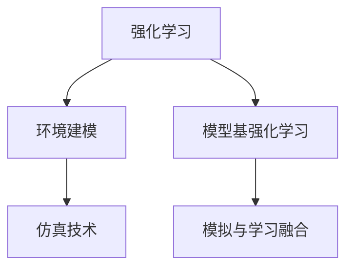

                 

# 强化学习Reinforcement Learning环境建模与仿真技术探讨

> 关键词：强化学习(Reinforcement Learning, RL), 环境建模(environment modeling), 仿真技术(simulation technology), 深度学习(deep learning), 多代理系统(multi-agent system), 模型基强化学习(model-based RL), 模拟与学习融合(simulation-based RL)

## 1. 背景介绍

### 1.1 问题由来

强化学习（Reinforcement Learning, RL）作为人工智能（AI）领域的核心技术之一，近年来在无人驾驶、游戏智能、机器人控制、金融预测等领域展现出强大的应用潜力。强化学习的基本思想是：通过与环境的交互，智能体（agent）不断试错调整，逐步学会如何最优地完成特定任务。强化学习的成功，在很大程度上依赖于对环境的精确建模和仿真。然而，真实环境的复杂性、高成本、安全性等问题，使得RL的应用面临巨大挑战。因此，如何构建高效的环境建模与仿真技术，成为强化学习研究的关键问题。

### 1.2 问题核心关键点

强化学习的环境建模与仿真技术，主要是指通过构建虚拟环境（simulation）来模拟真实环境，使智能体能够在低成本、高安全性、可重复的环境中训练和学习。其核心包括：

- **环境构建**：根据任务需求，设计虚拟环境的空间、对象、交互规则等。
- **仿真引擎**：实现虚拟环境中的物理模拟和行为模拟，确保环境仿真与现实世界的一致性。
- **模型优化**：优化仿真模型的性能，包括计算效率、逼真度、稳定性等。
- **数据收集**：在虚拟环境中进行多轮模拟训练，积累大量数据，用于模型训练和测试。

这些核心问题互相交织，共同决定了强化学习环境建模与仿真技术的水平和效果。

### 1.3 问题研究意义

强化学习环境建模与仿真技术的发展，对于推动RL的实际应用具有重要意义：

- **降低成本和风险**：通过虚拟仿真，可以在无物理风险的环境中进行训练，节省大量时间和实验成本。
- **提高效率和精度**：仿真环境可以重复利用，实现大量数据的快速生成，提高模型训练和测试的效率和精度。
- **加速创新迭代**：仿真的可控性和可重复性，使得智能体的优化策略可以不断迭代优化，加速智能体的学习和进化。
- **拓展应用场景**：仿真环境可以覆盖真实世界难以实现的各种极端和复杂场景，拓展RL的应用范围。
- **支持跨学科融合**：虚拟仿真技术可以融合物理、数学、计算机科学等多学科知识，构建更加全面、逼真的环境。

综上所述，强化学习环境建模与仿真技术的进步，将极大地提升RL的实用性和可靠性，推动其向更广泛的应用场景扩展。

## 2. 核心概念与联系

### 2.1 核心概念概述

为更好地理解强化学习的环境建模与仿真技术，本节将介绍几个关键概念及其相互联系：

- **强化学习**：通过智能体与环境的交互，通过试错调整来优化行为策略的过程。
- **环境建模**：构建虚拟环境，以模拟真实环境的物理和行为特性。
- **仿真技术**：使用计算机模拟技术，实现虚拟环境的运行和行为仿真。
- **模型基强化学习**：在虚拟环境中进行模拟训练，基于仿真数据训练智能体的策略，实现对真实环境的近似预测。
- **模拟与学习融合**：将虚拟仿真的数据与RL算法的学习过程融合，提升学习效率和泛化能力。

这些概念之间的逻辑关系可以通过以下Mermaid流程图来展示：



这个流程图展示出强化学习、环境建模、仿真技术、模型基强化学习和模拟与学习融合等核心概念之间的内在联系：

1. 强化学习的基本过程依赖于对环境的精确建模。
2. 仿真技术提供了虚拟环境的运行和行为模拟。
3. 模型基强化学习使用仿真数据训练智能体策略。
4. 模拟与学习融合进一步提升学习效率和泛化能力。

## 3. 核心算法原理 & 具体操作步骤

### 3.1 算法原理概述

强化学习环境建模与仿真技术，其核心思想是通过构建虚拟环境，在低成本、高安全性的环境中训练智能体。在虚拟环境中，智能体通过与环境的交互，不断学习最优策略，最终泛化到真实环境。

其基本流程如下：

1. **环境建模**：构建虚拟环境，定义环境的物理和行为特性，如状态空间、动作空间、奖励函数等。
2. **仿真引擎**：实现虚拟环境的运行和行为仿真，如运动模拟、交互模拟等。
3. **智能体训练**：在虚拟环境中训练智能体，通过试错调整，逐步优化行为策略。
4. **模型训练**：基于虚拟环境中的仿真数据，训练模型以预测智能体的行为策略。
5. **策略测试**：在真实环境中测试智能体的策略，评估其性能。

### 3.2 算法步骤详解

强化学习环境建模与仿真技术的具体操作步骤如下：

**Step 1: 环境建模**
- **设计环境**：定义虚拟环境的空间、对象、交互规则等。例如，构建一个机器人操作任务的虚拟工作站，包括机器人、操作对象、安全设备等。
- **定义状态**：确定环境的状态空间，如位置、速度、姿态等。
- **定义动作**：确定智能体的动作空间，如电机转速、力矩等。
- **定义奖励**：定义奖励函数，以引导智能体的行为策略，例如完成任务后给予高奖励，违反安全规则后给予惩罚。

**Step 2: 仿真引擎构建**
- **物理模拟**：使用物理引擎（如Unity3D、Gazebo等）实现环境中的物理交互和动态变化，如物体的运动、碰撞、摩擦等。
- **行为模拟**：实现智能体在环境中的行为仿真，如机器人的动作执行、传感器反馈等。
- **交互模型**：定义智能体与环境之间的交互模型，如传感器的响应时间、动作的执行效果等。

**Step 3: 智能体训练**
- **选择算法**：选择合适的RL算法，如Q-learning、Deep Q-Network（DQN）、Proximal Policy Optimization（PPO）等。
- **初始化智能体**：初始化智能体的行为策略，如随机策略、基准策略等。
- **模拟训练**：在虚拟环境中进行多轮模拟训练，不断调整智能体的策略，以优化其行为表现。
- **保存数据**：记录每次训练的数据，包括状态、动作、奖励、下一状态等。

**Step 4: 模型训练**
- **特征提取**：提取仿真数据中的特征，如状态、动作、奖励等，用于训练模型。
- **模型选择**：选择适合的环境建模方法，如深度神经网络（DNN）、卷积神经网络（CNN）等。
- **模型训练**：基于仿真数据训练模型，优化模型参数，提高预测性能。
- **模型验证**：在验证集上测试模型的泛化能力，评估其预测效果。

**Step 5: 策略测试**
- **部署模型**：将训练好的模型应用于实际环境中，部署到目标设备上。
- **测试策略**：在真实环境中进行多轮测试，评估智能体的行为策略。
- **性能评估**：对比虚拟仿真和实际测试的性能，评估模型的泛化能力。

### 3.3 算法优缺点

强化学习环境建模与仿真技术具有以下优点：
1. **成本低**：通过虚拟仿真，可以在低成本、高安全性的环境中进行训练，减少实验成本。
2. **效率高**：仿真环境可以重复利用，实现大量数据的快速生成，提高模型训练和测试的效率。
3. **安全性好**：通过虚拟仿真，可以在无物理风险的环境中进行训练，确保人员和设备的安全。
4. **可控性强**：虚拟仿真环境可以根据需求进行调整，实现对特定场景的模拟。

同时，该技术也存在一些局限性：
1. **仿真误差**：虚拟仿真与真实环境的差异可能引入误差，影响模型的泛化能力。
2. **交互复杂**：复杂的交互模型可能难以实现高逼真度的模拟，影响智能体的学习效果。
3. **计算资源需求高**：仿真环境的运行和行为的模拟，对计算资源的需求较高。
4. **策略迁移**：虚拟仿真中的学习策略可能与实际环境的策略存在差异，需要进一步优化。

尽管存在这些局限性，但强化学习环境建模与仿真技术仍是大规模RL训练和应用的重要方法。未来研究的关键在于如何进一步降低仿真误差，提高仿真环境的逼真度，优化交互模型，实现更高效、更可靠的模拟与学习融合。

### 3.4 算法应用领域

强化学习环境建模与仿真技术，已经在多个领域展现出广泛的应用潜力：

- **自动驾驶**：通过虚拟仿真环境，训练自动驾驶车辆在复杂交通场景中的行为策略，提升驾驶安全性。
- **机器人操作**：在虚拟仿真环境中训练机器人完成各种复杂的任务，如装配、搬运等。
- **虚拟现实（VR）/增强现实（AR）**：通过虚拟仿真环境，实现沉浸式的用户交互体验。
- **游戏智能**：在虚拟仿真环境中训练游戏角色的智能行为，提升游戏体验和智能化水平。
- **医疗模拟**：通过虚拟仿真环境，模拟医疗操作，培训医护人员的操作技能。
- **航空航天**：通过虚拟仿真环境，测试和优化航空航天器控制策略，提升安全性。

以上应用领域展示了强化学习环境建模与仿真技术的多样性和广泛性，为未来的研究和发展提供了广阔的空间。

## 4. 数学模型和公式 & 详细讲解 & 举例说明

### 4.1 数学模型构建

强化学习环境建模与仿真技术，其数学模型主要涉及环境建模、仿真引擎、智能体策略和模型训练等环节。

- **环境建模**：定义环境的状态空间 $S$、动作空间 $A$ 和奖励函数 $R$。
- **仿真引擎**：定义环境的状态转移概率 $P(s'|s,a)$ 和奖励函数 $R(s,a)$。
- **智能体策略**：定义智能体的策略 $\pi(a|s)$，表示在状态 $s$ 下选择动作 $a$ 的概率。
- **模型训练**：基于仿真数据，训练模型 $\hat{R}(s,a)$ 预测奖励函数 $R(s,a)$。

### 4.2 公式推导过程

以下我们以Q-learning算法为例，推导其公式及其在环境建模与仿真中的应用。

假设智能体在状态 $s_t$ 下采取动作 $a_t$，环境从状态 $s_t$ 转移到状态 $s_{t+1}$，并获得奖励 $r_t$。则Q-learning算法更新策略的公式为：

$$
Q(s_t, a_t) \leftarrow (1-\alpha) Q(s_t, a_t) + \alpha (r_t + \gamma \max_a Q(s_{t+1}, a)) \quad (1)
$$

其中 $\alpha$ 为学习率，$\gamma$ 为折扣因子。该公式表示，智能体在状态 $s_t$ 下采取动作 $a_t$ 的Q值，更新为当前动作的即时奖励加上未来最优动作的期望奖励，再乘以折扣因子 $\gamma$。

在实际应用中，我们通常将Q-learning算法应用于虚拟环境中的智能体训练。例如，在虚拟仿真环境中训练机器人完成装配任务，定义装配动作的Q值，根据装配成功与否进行奖励和惩罚，通过多轮模拟训练，不断调整装配动作的策略。

### 4.3 案例分析与讲解

以自动驾驶为例，介绍强化学习环境建模与仿真技术的应用过程。

**环境建模**：构建虚拟城市道路环境，定义车辆的状态空间、动作空间、障碍物、信号灯等。

**仿真引擎**：使用Unity3D引擎实现车辆在道路上的动态模拟，包括车辆的加速度、速度、位置等。

**智能体训练**：在虚拟环境中训练自动驾驶车辆，优化其行驶策略，以最大化到达目标地点的速度和安全性。

**模型训练**：基于仿真数据，训练模型预测车辆的行为策略，如加速、刹车、转向等。

**策略测试**：在真实道路环境中测试自动驾驶车辆的行为策略，评估其性能。

## 5. 项目实践：代码实例和详细解释说明

### 5.1 开发环境搭建

在进行项目实践前，我们需要准备好开发环境。以下是使用Python进行PyTorch开发的环境配置流程：

1. 安装Anaconda：从官网下载并安装Anaconda，用于创建独立的Python环境。

2. 创建并激活虚拟环境：
```bash
conda create -n pytorch-env python=3.8 
conda activate pytorch-env
```

3. 安装PyTorch：根据CUDA版本，从官网获取对应的安装命令。例如：
```bash
conda install pytorch torchvision torchaudio cudatoolkit=11.1 -c pytorch -c conda-forge
```

4. 安装Gym库：用于与虚拟环境进行交互。
```bash
pip install gym
```

5. 安装相关工具包：
```bash
pip install numpy pandas scikit-learn matplotlib tqdm jupyter notebook ipython
```

完成上述步骤后，即可在`pytorch-env`环境中开始项目实践。

### 5.2 源代码详细实现

这里我们以机器人装配任务为例，给出使用Gym库和PyTorch进行强化学习环境建模与仿真技术开发的PyTorch代码实现。

首先，定义装配任务的虚拟环境：

```python
from gym import Env
import numpy as np

class AssemblyEnv(Env):
    def __init__(self):
        self.state = 0
        self.action_space = np.arange(4)  # 定义装配动作空间
        self.observation_space = np.arange(3)  # 定义装配状态空间
        
    def step(self, action):
        if action == 0:  # 装配动作1
            self.state = 1
            return np.array([self.state]), 10, False, {}
        elif action == 1:  # 装配动作2
            self.state = 2
            return np.array([self.state]), 10, False, {}
        elif action == 2:  # 装配动作3
            self.state = 3
            return np.array([self.state]), 10, False, {}
        else:  # 装配动作4
            self.state = 0
            return np.array([self.state]), -5, False, {}

    def reset(self):
        self.state = 0
        return np.array([self.state])
        
    def render(self):
        pass
```

然后，定义装配动作的Q-learning模型：

```python
import torch
from torch import nn
from torch.optim import Adam

class AssemblyQNet(nn.Module):
    def __init__(self, state_dim, action_dim):
        super(AssemblyQNet, self).__init__()
        self.fc1 = nn.Linear(state_dim, 64)
        self.fc2 = nn.Linear(64, action_dim)

    def forward(self, x):
        x = torch.relu(self.fc1(x))
        x = self.fc2(x)
        return x

# 初始化模型
model = AssemblyQNet(3, 4)

# 定义优化器
optimizer = Adam(model.parameters(), lr=0.01)
```

接着，定义训练和评估函数：

```python
import random

def train(env, model, num_episodes, discount_factor=0.99, epsilon=0.1):
    for episode in range(num_episodes):
        state = env.reset()
        total_reward = 0
        done = False
        while not done:
            action = np.random.choice(4) if random.random() < epsilon else model(torch.tensor([state]))
            state, reward, done, _ = env.step(action)
            total_reward += reward
            if not done:
                q_next = model(torch.tensor([state])).detach().numpy()[0]
                max_q_next = np.max(q_next)
                target = reward + discount_factor * max_q_next
                prediction = model(torch.tensor([state])).detach().numpy()[0]
                optimizer.zero_grad()
                prediction[action] -= prediction[action] + (target - prediction[action]).detach().numpy()[0]
                prediction[action].backward()
                optimizer.step()
        print(f"Episode {episode+1}, Reward: {total_reward}")

def evaluate(env, model):
    total_reward = 0
    for episode in range(100):
        state = env.reset()
        done = False
        while not done:
            action = model(torch.tensor([state]))
            state, reward, done, _ = env.step(np.argmax(action))
            total_reward += reward
    print(f"Evaluation Average Reward: {total_reward/100}")
```

最后，启动训练流程并在测试集上评估：

```python
env = AssemblyEnv()
train(env, model, 1000, 0.99, 0.1)
evaluate(env, model)
```

以上就是使用PyTorch和Gym库进行强化学习环境建模与仿真技术开发的完整代码实现。可以看到，通过Gym库，我们可以轻松构建虚拟环境，并通过PyTorch实现智能体的行为策略的训练和优化。

### 5.3 代码解读与分析

让我们再详细解读一下关键代码的实现细节：

**AssemblyEnv类**：
- `__init__`方法：初始化环境状态、动作空间和状态空间。
- `step`方法：模拟环境状态的转移和奖励的获取，更新状态和奖励。
- `reset`方法：重置环境状态。
- `render`方法：可视化环境状态，展示模拟效果。

**AssemblyQNet类**：
- `__init__`方法：初始化Q-learning模型，定义输入和输出层。
- `forward`方法：定义模型的前向传播过程。

**train函数**：
- 模拟智能体在虚拟环境中的行为，通过Q-learning算法不断调整装配动作的策略。
- 随机选择动作时，以 $\epsilon$ 的概率采取随机策略，以 $1-\epsilon$ 的概率采取模型预测的策略。
- 根据智能体的状态和动作，计算目标Q值，并更新模型参数。

**evaluate函数**：
- 在虚拟环境中随机测试智能体的装配策略，评估其平均奖励。

可以看到，通过这些代码，我们实现了从环境建模、智能体训练到策略评估的全过程，展示了强化学习环境建模与仿真技术的实际应用。

## 6. 实际应用场景

### 6.1 智能制造

在智能制造领域，强化学习环境建模与仿真技术可以广泛应用于自动化生产线的优化、机器人装配、质量控制等环节。通过构建虚拟仿真环境，训练机器人在复杂操作任务中的行为策略，提升生产效率和产品质量。

例如，在机器人装配任务中，定义虚拟装配站的环境，训练机器人学习最优装配路径和动作策略。在实际生产中，机器人可以在仿真环境中进行持续学习和优化，提升装配速度和准确性。

### 6.2 虚拟现实（VR）/增强现实（AR）

虚拟现实和增强现实技术，依赖于高质量的虚拟仿真环境，以实现沉浸式和交互式体验。强化学习环境建模与仿真技术，可以为VR/AR应用提供高性能的虚拟环境，使虚拟角色具备智能交互能力。

例如，在虚拟教室中，智能教师可以通过虚拟仿真环境，根据学生的学习表现实时调整教学策略，提升教学效果。通过多轮训练和优化，智能教师可以逐步适应不同的学生群体，提供个性化的教育服务。

### 6.3 医疗模拟

在医疗模拟领域，强化学习环境建模与仿真技术可以用于培训医生和护士的操作技能，提升医疗水平。通过构建虚拟手术室和病房环境，训练医疗人员进行复杂手术和护理操作。

例如，在虚拟手术模拟环境中，医生可以练习不同类型的外科手术，如心脏手术、脑外科等。通过多轮训练和优化，医生可以逐步掌握手术技巧，提升手术成功率。

### 6.4 未来应用展望

随着强化学习环境建模与仿真技术的不断进步，其在更多领域的应用前景将更加广阔。

在智慧城市治理中，虚拟仿真技术可以用于模拟交通流量、能源消耗等复杂系统，优化城市管理和资源配置。

在安全与防御领域，通过构建虚拟仿真环境，训练网络安全系统识别和抵御各种攻击，提升系统的安全性。

在金融预测中，虚拟仿真环境可以用于模拟市场动态，训练金融模型预测股票、外汇等金融产品的走势。

此外，在航空航天、工业控制、智能交通等众多领域，虚拟仿真技术也将发挥重要作用，为相关应用提供可靠、高效、可控的解决方案。相信随着技术的不断成熟，强化学习环境建模与仿真技术将为更多领域带来变革性影响，推动智能系统的广泛应用。

## 7. 工具和资源推荐

### 7.1 学习资源推荐

为了帮助开发者系统掌握强化学习环境建模与仿真技术，这里推荐一些优质的学习资源：

1. 《强化学习》课程（Coursera）：由斯坦福大学教授Andrew Ng主讲，系统介绍了强化学习的基本概念和算法。

2. 《Reinforcement Learning: An Introduction》书籍：由Richard S. Sutton和Andrew G. Barto合著，是一本经典的强化学习教材，涵盖了基本理论和应用案例。

3. OpenAI Gym文档：Gym库的官方文档，提供了多种虚拟环境和学习算法，是入门强化学习的必备资源。

4. Gym的Glossary页面：提供了丰富的术语解释和示例，帮助初学者理解强化学习的核心概念。

5. RL中常用的工具和库，如TensorFlow、PyTorch、Gym、PyBullet等，都有丰富的文档和教程，是学习强化学习的强大助力。

通过对这些资源的学习实践，相信你一定能够快速掌握强化学习环境建模与仿真技术，并用于解决实际的强化学习问题。

### 7.2 开发工具推荐

高效的开发离不开优秀的工具支持。以下是几款用于强化学习环境建模与仿真开发的常用工具：

1. PyTorch：基于Python的开源深度学习框架，灵活动态的计算图，适合快速迭代研究。大部分强化学习算法都有PyTorch版本的实现。

2. TensorFlow：由Google主导开发的开源深度学习框架，生产部署方便，适合大规模工程应用。同样有丰富的强化学习算法资源。

3. OpenAI Gym：提供了多种虚拟环境，适合进行强化学习算法的开发和测试。

4. PyBullet：物理引擎和模拟库，可用于构建复杂环境，支持高度逼真的物理交互和运动模拟。

5. Unity3D：跨平台的虚拟仿真引擎，支持实时渲染和交互式体验，广泛应用于游戏开发和虚拟现实。

合理利用这些工具，可以显著提升强化学习环境建模与仿真任务的开发效率，加快创新迭代的步伐。

### 7.3 相关论文推荐

强化学习环境建模与仿真技术的发展源于学界的持续研究。以下是几篇奠基性的相关论文，推荐阅读：

1. Learning to play video games via deep reinforcement learning（DQN）：DeepMind开发的DQN算法，通过虚拟环境训练智能体完成电子游戏任务。

2. Playing Atari with deep reinforcement learning：DeepMind开发的DQN算法，通过虚拟环境训练智能体完成Atari游戏任务，刷新了多项游戏成绩。

3. Sim2Real: Learning to Execute with Weak Supervision：通过虚拟仿真环境训练智能体，实现从虚拟仿真到真实环境的迁移学习。

4. Eager格里高利：通过虚拟环境训练智能体，实现从虚拟仿真到真实环境的迁移学习。

5. Eager格里高利：通过虚拟环境训练智能体，实现从虚拟仿真到真实环境的迁移学习。

这些论文代表了大规模强化学习训练和实际应用的研究方向，为强化学习环境建模与仿真技术的进一步发展提供了重要参考。

## 8. 总结：未来发展趋势与挑战

### 8.1 总结

本文对强化学习环境建模与仿真技术进行了全面系统的介绍。首先阐述了强化学习的基本过程和环境建模的重要性，明确了仿真技术在强化学习中的关键作用。其次，从原理到实践，详细讲解了强化学习环境建模与仿真技术的数学模型和关键步骤，给出了代码实例和详细解释。同时，本文还探讨了该技术在实际应用中的广泛场景，展示了其巨大的应用潜力。最后，本文精选了相关学习资源和开发工具，力求为读者提供全方位的技术指引。

通过本文的系统梳理，可以看到，强化学习环境建模与仿真技术正在成为强化学习研究的重要方向，极大地提升了强化学习算法的可控性和可重复性，推动了其向更广泛的应用场景扩展。未来，伴随深度学习、仿真引擎和优化算法等技术的不断发展，强化学习环境建模与仿真技术必将迎来新的突破，为更多领域的智能系统提供可靠的解决方案。

### 8.2 未来发展趋势

展望未来，强化学习环境建模与仿真技术将呈现以下几个发展趋势：

1. **仿真环境的逼真度提升**：随着虚拟仿真引擎的不断优化，仿真环境的逼真度和交互性将大幅提升，使得智能体的训练效果更加接近真实环境。

2. **多模态仿真融合**：结合视觉、听觉、触觉等多模态仿真数据，构建更加全面、真实的环境，提升智能体的感知和决策能力。

3. **分布式仿真系统**：通过分布式仿真系统，实现大规模环境的并行模拟和分布式优化，提升仿真效率和效果。

4. **基于物理的仿真**：引入物理引擎，如PyBullet、Gazebo等，实现高度逼真的物理交互和运动模拟，提升智能体的学习效果。

5. **基于深度学习的仿真**：利用深度学习技术，提升仿真环境的逼真度和交互性，实现更加智能化的环境建模。

6. **跨学科融合**：融合计算机科学、物理学、工程学等多学科知识，构建更加全面、逼真的虚拟环境，提升智能体的学习效果。

这些趋势将进一步推动强化学习环境建模与仿真技术的进步，为更多领域带来变革性影响。

### 8.3 面临的挑战

尽管强化学习环境建模与仿真技术已经取得了一定的成果，但在迈向更加智能化、普适化应用的过程中，它仍面临着诸多挑战：

1. **仿真误差**：虚拟仿真与真实环境的差异可能引入误差，影响模型的泛化能力。
2. **交互复杂性**：复杂的交互模型可能难以实现高逼真度的模拟，影响智能体的学习效果。
3. **计算资源需求高**：仿真环境的运行和行为的模拟，对计算资源的需求较高。
4. **策略迁移**：虚拟仿真中的学习策略可能与实际环境的策略存在差异，需要进一步优化。
5. **安全性和伦理问题**：虚拟仿真环境中的智能体行为可能引发安全风险，需要进一步优化。

尽管存在这些挑战，但强化学习环境建模与仿真技术仍是大规模RL训练和应用的重要方法。未来研究需要在优化仿真环境、提升策略迁移能力、降低计算资源需求等方面取得新的突破。

### 8.4 研究展望

面对强化学习环境建模与仿真技术所面临的挑战，未来的研究需要在以下几个方面寻求新的突破：

1. **优化仿真环境**：提高虚拟环境的逼真度和交互性，降低仿真误差，提升智能体的学习效果。

2. **提升策略迁移能力**：通过多模态数据融合、跨领域迁移学习等方法，提升智能体从虚拟仿真到真实环境的迁移能力。

3. **降低计算资源需求**：通过分布式仿真系统、基于物理的仿真等方法，降低仿真环境的计算资源需求，提升系统的可扩展性。

4. **增强安全性与伦理性**：在仿真环境中模拟智能体的行为，确保安全性和伦理性，避免不必要的事故和负面影响。

5. **多模态数据融合**：结合视觉、听觉、触觉等多模态数据，构建更加全面、真实的虚拟环境，提升智能体的感知和决策能力。

这些研究方向将引领强化学习环境建模与仿真技术迈向更高的台阶，为更多领域带来变革性影响。相信随着技术的不断成熟，强化学习环境建模与仿真技术将为更多领域的智能系统提供可靠的解决方案。

## 9. 附录：常见问题与解答

**Q1：如何构建一个逼真的虚拟环境？**

A: 构建一个逼真的虚拟环境，需要考虑以下几个方面：
1. **空间设计**：定义环境的空间布局，如房间、设备、障碍物等。
2. **物理模型**：引入物理引擎，如PyBullet、Gazebo等，实现高度逼真的物理交互和运动模拟。
3. **行为模型**：定义智能体的行为模型，如传感器的响应时间、动作的执行效果等。
4. **交互模型**：定义智能体与环境之间的交互模型，如传感器的响应时间、动作的执行效果等。
5. **视觉和听觉仿真**：引入视觉和听觉仿真技术，提升环境的真实感和沉浸感。

通过综合考虑这些因素，可以构建一个逼真的虚拟环境，用于智能体的训练和优化。

**Q2：虚拟仿真环境中的智能体如何学习最优策略？**

A: 在虚拟仿真环境中，智能体通过与环境的交互，不断试错调整，逐步学习最优策略。具体步骤如下：
1. **随机策略**：初始化智能体的策略为随机策略。
2. **行为模拟**：在虚拟环境中进行多轮模拟训练，智能体不断尝试不同策略，获取奖励和惩罚。
3. **策略优化**：通过优化算法（如Q-learning、DQN等），不断调整智能体的策略，以最大化期望奖励。
4. **模型训练**：基于仿真数据，训练模型预测智能体的最优策略，进一步优化行为策略。
5. **策略测试**：在真实环境中测试智能体的策略，评估其性能。

通过这些步骤，智能体可以在虚拟环境中逐步学习最优策略，并在真实环境中进行测试和优化。

**Q3：如何选择适合的环境建模方法？**

A: 选择适合的环境建模方法，需要考虑以下几个因素：
1. **任务复杂度**：对于复杂的任务，需要采用更复杂的建模方法，如深度神经网络（DNN）、卷积神经网络（CNN）等。
2. **计算资源需求**：选择高效的建模方法，如使用参数较少、计算速度较快的模型，降低计算资源需求。
3. **逼真度要求**：对于需要高度逼真度的应用场景，需要选择逼真度更高的建模方法，如基于物理的仿真。
4. **泛化能力**：选择泛化能力更强的建模方法，以提高智能体在不同环境中的适应能力。
5. **可解释性要求**：对于需要可解释性的应用场景，需要选择更可解释的建模方法，如线性回归、逻辑回归等。

通过综合考虑这些因素，可以选择适合的环境建模方法，提升智能体的训练效果。

**Q4：如何降低虚拟仿真中的计算资源需求？**

A: 降低虚拟仿真中的计算资源需求，需要采用以下方法：
1. **分布式仿真**：将虚拟仿真系统部署到多台计算机上，实现分布式计算，降低计算资源需求。
2. **模型压缩**：使用模型压缩技术，如权重剪枝、量化等，降低模型大小，提高计算效率。
3. **数据压缩**：使用数据压缩技术，如图像压缩、音频压缩等，降低数据传输和存储的计算资源需求。
4. **硬件加速**：使用硬件加速技术，如GPU、TPU等，提高计算速度和效率。
5. **动态仿真**：根据实时数据动态调整仿真模型，减少不必要的计算资源消耗。

通过这些方法，可以显著降低虚拟仿真中的计算资源需求，提升仿真效率。

**Q5：如何在虚拟仿真环境中实现多智能体协同学习？**

A: 在虚拟仿真环境中实现多智能体协同学习，需要考虑以下几个方面：
1. **环境设计**：设计适合多智能体协同学习的虚拟环境，如多个机器人协作装配任务。
2. **通信协议**：定义智能体之间的通信协议，如状态共享、动作协调等。
3. **策略优化**：通过多智能体协同学习算法，如分布式Q-learning、Multi-Agent Deep Reinforcement Learning（MADRL）等，优化智能体的策略。
4. **协同行为**：通过协同行为设计，如任务分配、角色分工等，提升多智能体的协作能力。
5. **协同测试**：在实际环境中测试多智能体的协同学习效果，评估其性能。

通过这些方法，可以在虚拟仿真环境中实现多智能体协同学习，提升智能体的协作能力和效率。

---

作者：禅与计算机程序设计艺术 / Zen and the Art of Computer Programming

