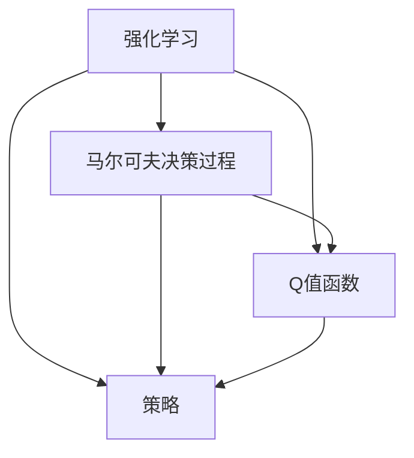
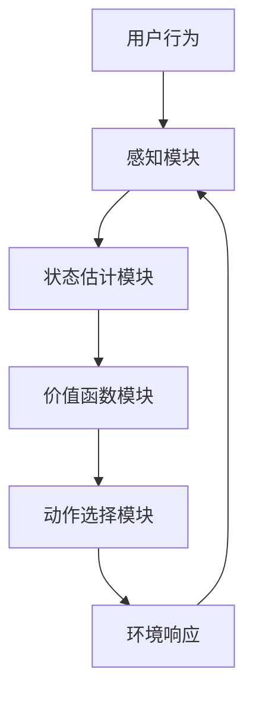

                 

## 1. 背景介绍

### 1.1 问题由来

近年来，随着人工智能技术的飞速发展，强化学习(Reinforcement Learning, RL)在各行业中的应用愈发广泛。其核心思想是通过与环境的互动，学习到最优的决策策略，实现智能决策和控制。在媒体行业，强化学习被应用于内容推荐、广告投放、流量优化等场景，极大地提高了运营效率和用户体验。

### 1.2 问题核心关键点

强化学习在媒体行业的应用主要涉及以下几个关键点：

1. **内容推荐**：利用强化学习算法，根据用户的历史行为和偏好，推荐个性化的内容，提升用户体验和点击率。
2. **广告投放**：优化广告投放策略，实现最大化收益或最小化成本。
3. **流量优化**：通过调整网站结构、布局和内容，最大化流量和用户留存率。
4. **用户行为分析**：挖掘用户行为规律，优化产品功能和运营策略。

### 1.3 问题研究意义

强化学习在媒体行业的应用，具有以下重要意义：

1. **提升用户体验**：通过个性化推荐，满足用户多样化需求，提高用户满意度和忠诚度。
2. **优化资源配置**：自动优化广告投放和流量配置，提高广告效率和网站运营收益。
3. **加速创新迭代**：快速迭代优化产品功能，应对市场变化，提升竞争力。
4. **数据驱动决策**：利用强化学习模型，进行数据驱动的决策，提升运营效率和决策精度。

## 2. 核心概念与联系

### 2.1 核心概念概述

强化学习在媒体行业的应用，涉及以下核心概念：

- **强化学习**：通过与环境的互动，学习到最优决策策略，以最大化奖励或最小化代价。
- **马尔可夫决策过程**(Markov Decision Process, MDP)：表示学习者的决策和环境状态交互的过程。
- **Q值函数**：预测在给定状态下采取某行动后，下一个状态及对应的回报值。
- **策略**：定义在状态空间上，选择动作的概率分布。
- **逆强化学习**(Inverse Reinforcement Learning, IRL)：通过观察专家行为，学习其决策背后的奖励函数。

这些概念之间通过如下Mermaid流程图展示联系：



### 2.2 核心概念原理和架构的 Mermaid 流程图



这个流程图展示了强化学习的基本架构：

1. **感知模块**：接收用户行为，将其转化为系统可处理的信号。
2. **状态估计模块**：将感知信号转化为系统状态。
3. **价值函数模块**：预测不同动作的预期回报，评估当前状态的优劣。
4. **动作选择模块**：根据当前状态和价值函数，选择最优动作。
5. **环境响应**：执行选择动作，观察环境变化，反馈给感知模块。

## 3. 核心算法原理 & 具体操作步骤

### 3.1 算法原理概述

强化学习在媒体行业的核心算法为Q值学习，即通过模型预测Q值函数，进而选择最优策略。具体而言，在媒体行业的各种应用场景中，可以定义一个奖励函数，用于量化决策的效果。然后，通过与环境的交互，不断更新Q值函数，学习到最优的策略。

### 3.2 算法步骤详解

1. **定义问题**：明确任务目标，如内容推荐、广告投放等。
2. **设计状态空间**：根据任务特点，设计状态空间的表示方式。
3. **设计动作空间**：根据任务需求，定义可行的动作集合。
4. **设计奖励函数**：定义决策效果的评价标准。
5. **初始化Q值函数**：随机初始化Q值函数，或使用经验性初始化。
6. **迭代更新Q值函数**：通过与环境的交互，逐步更新Q值函数。
7. **选择最优策略**：根据Q值函数，选择当前状态下的最优动作。
8. **评估和优化**：不断评估和优化策略，提高决策效果。

### 3.3 算法优缺点

强化学习的优点包括：

1. **适应性强**：能够处理非结构化数据，适用于媒体行业复杂多变的场景。
2. **实时性强**：决策可以实时进行，适用于流量优化、实时推荐等场景。
3. **自适应性**：能够动态调整策略，适应用户行为和环境变化。

缺点包括：

1. **状态空间复杂**：媒体行业的复杂性和多样性，导致状态空间巨大，难以完全探索。
2. **奖励函数设计困难**：奖励函数的设计需要专业知识，难以做到最优。
3. **探索与利用冲突**：需要平衡探索新策略和利用已有知识之间的冲突。
4. **计算开销大**：大规模模型的训练和推理计算开销较大，需要高性能计算资源。

### 3.4 算法应用领域

强化学习在媒体行业的应用领域包括：

1. **内容推荐系统**：通过个性化推荐，提升用户体验和点击率。
2. **广告投放系统**：优化广告投放策略，实现最大化收益或最小化成本。
3. **流量优化系统**：调整网站结构、布局和内容，最大化流量和用户留存率。
4. **用户行为分析系统**：挖掘用户行为规律，优化产品功能和运营策略。
5. **智能问答系统**：基于用户输入，动态生成最合适的回答。

## 4. 数学模型和公式 & 详细讲解 & 举例说明

### 4.1 数学模型构建

在强化学习中，可以使用Q值函数来预测在给定状态下采取某行动后，下一个状态及对应的回报值。Q值函数定义为：

$$ Q(s, a) = \mathbb{E}[R + \gamma V(s')] $$

其中，$s$ 表示当前状态，$a$ 表示采取的动作，$s'$ 表示下一个状态，$V(s')$ 表示下一个状态的价值函数，$\gamma$ 表示折扣因子。

### 4.2 公式推导过程

通过迭代更新Q值函数，可以使用动态规划的方法求解最优策略。具体的迭代公式为：

$$ Q_{t+1}(s_t, a_t) = Q_t(s_t, a_t) + \alpha [r + \gamma \max_{a'} Q_t(s_{t+1}, a')] $$

其中，$\alpha$ 表示学习率，$r$ 表示当前状态的即时奖励。

### 4.3 案例分析与讲解

以内容推荐系统为例，我们可以将其看作一个马尔可夫决策过程。用户的历史行为和偏好作为状态，推荐的内容作为动作。在每次推荐后，观察用户的点击行为，更新Q值函数，选择最合适的推荐内容。

## 5. 项目实践：代码实例和详细解释说明

### 5.1 开发环境搭建

在进行强化学习实践前，我们需要准备好开发环境。以下是使用Python进行TensorFlow开发的环境配置流程：

1. 安装Anaconda：从官网下载并安装Anaconda，用于创建独立的Python环境。

2. 创建并激活虚拟环境：
```bash
conda create -n tf-env python=3.8 
conda activate tf-env
```

3. 安装TensorFlow：根据CUDA版本，从官网获取对应的安装命令。例如：
```bash
conda install tensorflow -c conda-forge
```

4. 安装各类工具包：
```bash
pip install numpy pandas scikit-learn matplotlib tqdm jupyter notebook ipython
```

完成上述步骤后，即可在`tf-env`环境中开始强化学习实践。

### 5.2 源代码详细实现

这里我们以内容推荐系统为例，使用TensorFlow实现强化学习。

首先，定义状态空间和动作空间：

```python
import tensorflow as tf

# 定义状态空间
state_space = tf.keras.layers.Input(shape=(1,))
state_space = tf.keras.layers.Dense(128, activation='relu')(state_space)
state_space = tf.keras.layers.Dense(64, activation='relu')(state_space)

# 定义动作空间
action_space = tf.keras.layers.Input(shape=(1,))
action_space = tf.keras.layers.Dense(128, activation='relu')(action_space)
action_space = tf.keras.layers.Dense(64, activation='relu')(action_space)
```

然后，定义奖励函数和Q值函数：

```python
# 定义奖励函数
reward = tf.keras.layers.Dense(1, activation='sigmoid')(tf.keras.layers.concatenate([state_space, action_space]))

# 定义Q值函数
Q = tf.keras.layers.Dense(1, activation='sigmoid')(tf.keras.layers.concatenate([state_space, action_space]))
```

接着，定义强化学习算法：

```python
# 定义强化学习算法
def train_model(X_train, y_train, epochs):
    model = tf.keras.models.Model(inputs=[state_space, action_space], outputs=Q)
    model.compile(optimizer=tf.keras.optimizers.Adam(learning_rate=0.01), loss='mse')
    model.fit([X_train, y_train], y_train, epochs=epochs)
    return model
```

最后，启动训练流程：

```python
# 训练模型
epochs = 100
batch_size = 32

X_train = ...
y_train = ...

model = train_model(X_train, y_train, epochs)
```

以上就是使用TensorFlow实现内容推荐系统的完整代码实现。可以看到，TensorFlow提供了强大的计算图能力，使得强化学习模型的搭建和训练变得简洁高效。

### 5.3 代码解读与分析

让我们再详细解读一下关键代码的实现细节：

**状态空间和动作空间定义**：
- `state_space`：接收用户行为和偏好的状态表示。
- `action_space`：定义推荐内容的动作表示。

**奖励函数和Q值函数定义**：
- `reward`：定义奖励函数，用于量化推荐内容的点击效果。
- `Q`：定义Q值函数，预测在不同状态下采取某动作后的预期回报。

**训练模型**：
- `train_model`函数：定义强化学习算法的训练过程，使用Adam优化器，损失函数为均方误差。
- `X_train`和`y_train`：定义训练集的特征和标签。

**启动训练**：
- `epochs`：定义训练轮数。
- `batch_size`：定义每个批次的样本数量。

这些代码实现了基本的内容推荐系统的强化学习模型，通过训练不断优化Q值函数，学习到最优的内容推荐策略。

## 6. 实际应用场景

### 6.1 智能推荐系统

强化学习在智能推荐系统中的应用，具有以下优点：

1. **个性化推荐**：通过学习用户行为和偏好，提供个性化推荐内容。
2. **实时推荐**：能够实时响应用户行为，调整推荐策略。
3. **动态优化**：根据用户反馈和环境变化，动态调整推荐算法。

在实践中，可以收集用户的历史行为数据，定义奖励函数，训练强化学习模型，实时生成推荐内容。此外，还可以通过A/B测试等手段，评估推荐效果，不断迭代优化模型。

### 6.2 广告投放系统

强化学习在广告投放系统中的应用，主要涉及以下步骤：

1. **定义广告策略**：根据广告类型和目标用户，定义不同广告的投放策略。
2. **设计奖励函数**：量化广告投放的回报，如点击率、转化率等。
3. **训练投放策略**：通过强化学习算法，优化广告投放策略。
4. **实时调整**：根据投放效果，动态调整投放策略。

通过强化学习，可以自动化广告投放过程，优化广告效果，提高广告投放的ROI。

### 6.3 流量优化系统

流量优化系统的目标是通过调整网站结构、布局和内容，提升流量和用户留存率。强化学习在流量优化中的应用，主要涉及以下步骤：

1. **定义流量策略**：根据用户行为和访问路径，定义不同的流量策略。
2. **设计奖励函数**：量化流量效果，如点击率、跳出率等。
3. **训练流量策略**：通过强化学习算法，优化流量策略。
4. **实时调整**：根据流量数据，动态调整流量策略。

通过强化学习，可以实时优化网站流量，提升用户体验和转化率。

## 7. 工具和资源推荐

### 7.1 学习资源推荐

为了帮助开发者系统掌握强化学习在媒体行业的应用，这里推荐一些优质的学习资源：

1. 《强化学习》系列书籍：介绍强化学习的基本原理和应用场景，推荐阅读Sutton和Barto的《Reinforcement Learning: An Introduction》。
2. 《深度学习》系列课程：由吴恩达教授主讲的深度学习课程，介绍了深度学习的基本概念和应用。
3. 强化学习实战项目：如AlphaGo、OpenAI Gym等，通过实际项目深入理解强化学习的原理和应用。
4. 强化学习竞赛平台：如Kaggle、AI Challenger等，通过竞赛提升解决实际问题的能力。
5. 论文阅读：如DeepMind的AlphaGo论文、Google的DeepRL论文等，了解最新的强化学习研究进展。

通过对这些资源的学习实践，相信你一定能够快速掌握强化学习在媒体行业的应用，并用于解决实际的强化学习问题。

### 7.2 开发工具推荐

高效的开发离不开优秀的工具支持。以下是几款用于强化学习开发的常用工具：

1. TensorFlow：由Google主导开发的深度学习框架，支持分布式计算和GPU加速，适合大规模工程应用。
2. PyTorch：由Facebook开发的深度学习框架，灵活性高，适合研究和快速迭代。
3. OpenAI Gym：一个开源的环境库，用于测试和比较强化学习算法。
4. TensorBoard：TensorFlow配套的可视化工具，可实时监测模型训练状态，提供丰富的图表呈现方式。
5. Jupyter Notebook：一个交互式的开发环境，支持代码、数据和文档的集成，方便调试和协作。

合理利用这些工具，可以显著提升强化学习任务的开发效率，加快创新迭代的步伐。

### 7.3 相关论文推荐

强化学习在媒体行业的应用，需要大量的研究和实践。以下是几篇奠基性的相关论文，推荐阅读：

1. AlphaGo论文：介绍深度学习和强化学习在围棋中的应用，提出了Go的策略网络、价值网络和蒙特卡罗树搜索。
2. DeepRL论文：介绍深度强化学习在AI Challenger中的应用，提出了Adaptive DQN和Adaptive Action Distribution等方法。
3. DiscoRL论文：介绍深度强化学习在推荐系统中的应用，提出了DiscoRL框架，融合了深度学习和强化学习的优点。
4. SLUQ论文：介绍强化学习在广告投放中的应用，提出了SLUQ算法，实现广告投放的动态优化。
5. HedgeRL论文：介绍强化学习在智能问答中的应用，提出了HedgeRL模型，实现问答系统的优化。

这些论文代表了强化学习在媒体行业的研究进展，通过学习这些前沿成果，可以帮助研究者把握学科前进方向，激发更多的创新灵感。

## 8. 总结：未来发展趋势与挑战

### 8.1 总结

本文对强化学习在媒体行业的应用进行了全面系统的介绍。首先阐述了强化学习的基本原理和应用场景，明确了其在内容推荐、广告投放、流量优化等媒体任务中的重要价值。其次，从原理到实践，详细讲解了强化学习在媒体行业的核心算法和具体操作步骤，给出了强化学习任务开发的完整代码实例。同时，本文还广泛探讨了强化学习在智能推荐、广告投放、流量优化等多个媒体领域的应用前景，展示了强化学习的巨大潜力。此外，本文精选了强化学习的各类学习资源，力求为读者提供全方位的技术指引。

通过本文的系统梳理，可以看到，强化学习在媒体行业的应用正在成为新的趋势，极大地提升了运营效率和用户体验。随着强化学习算法的不断进步，未来必将在更多领域得到广泛应用，为媒体行业带来变革性影响。

### 8.2 未来发展趋势

展望未来，强化学习在媒体行业的应用将呈现以下几个发展趋势：

1. **实时化、动态化**：强化学习算法能够实时响应用户行为和环境变化，动态调整决策策略，提升用户体验和运营效率。
2. **多模态融合**：融合视觉、语音、文本等多模态数据，提升媒体内容的丰富性和多样性。
3. **跨领域应用**：强化学习算法能够应用于不同领域，如医疗、金融、教育等，为各行各业提供智能决策支持。
4. **自适应学习**：强化学习算法能够自适应学习和优化，应对市场变化和用户需求。
5. **边缘计算**：将强化学习算法部署到边缘设备，实现本地化决策，提高响应速度和资源利用率。

这些趋势表明，强化学习在媒体行业的应用前景广阔，未来必将在更多领域发挥更大的作用。

### 8.3 面临的挑战

尽管强化学习在媒体行业的应用已经取得显著成果，但仍面临诸多挑战：

1. **数据获取难度大**：媒体行业的数据往往包含隐私信息，获取和处理难度大。
2. **奖励函数设计复杂**：奖励函数的定义需要专业知识，难以做到最优。
3. **计算开销大**：大规模模型的训练和推理计算开销较大，需要高性能计算资源。
4. **鲁棒性不足**：强化学习模型容易受到环境变化和噪声干扰，鲁棒性有待提高。
5. **可解释性差**：强化学习模型往往黑盒化，难以解释其决策过程。

### 8.4 研究展望

面对强化学习在媒体行业的应用挑战，未来的研究需要在以下几个方面寻求新的突破：

1. **数据隐私保护**：开发隐私保护技术，保护用户隐私，同时利用数据提升模型效果。
2. **奖励函数优化**：改进奖励函数设计方法，提升模型的决策效果。
3. **计算资源优化**：优化模型结构，提高计算效率，实现更快速、更轻量的部署。
4. **鲁棒性提升**：增强模型对噪声和环境变化的鲁棒性，提高模型的稳定性和可靠性。
5. **可解释性增强**：开发可解释的强化学习模型，提高模型的透明度和可理解性。

这些研究方向的探索，必将引领强化学习在媒体行业的应用走向新的高度，为构建智能、高效、透明的媒体系统提供新的方法。面向未来，强化学习需要与其他人工智能技术进行更深入的融合，如知识表示、因果推理、强化学习等，多路径协同发力，共同推动媒体行业的智能化进程。只有勇于创新、敢于突破，才能不断拓展强化学习在媒体行业的边界，让智能技术更好地服务媒体行业。

## 9. 附录：常见问题与解答

**Q1：强化学习在媒体行业的应用是否适用于所有媒体任务？**

A: 强化学习在媒体行业的应用，主要适用于具有时间序列和状态转移特性的任务，如内容推荐、广告投放、流量优化等。对于一些非时序化的任务，如新闻编辑、文本生成等，可能不适用。

**Q2：如何设计合适的奖励函数？**

A: 设计合适的奖励函数是强化学习在媒体行业应用的关键。通常需要结合具体任务特点，定义能够反映任务目标的奖励函数。如对于内容推荐任务，可以定义点击率、转化率、停留时间等作为奖励。

**Q3：强化学习算法在媒体行业的应用面临哪些计算资源限制？**

A: 强化学习算法在媒体行业的应用，面临计算资源开销大的挑战。需要优化模型结构，使用高效的计算图，减少计算资源消耗。同时，可以考虑分布式计算、GPU加速等手段，提升计算效率。

**Q4：如何提高强化学习模型的鲁棒性？**

A: 提高强化学习模型的鲁棒性，可以从以下方面入手：
1. 数据增强：通过数据增强技术，丰富训练集多样性。
2. 正则化：使用L2正则、Dropout等正则化技术，防止过拟合。
3. 对抗训练：引入对抗样本，提高模型鲁棒性。
4. 模型集成：通过模型集成技术，增强模型的鲁棒性和稳定性。

**Q5：如何增强强化学习模型的可解释性？**

A: 增强强化学习模型的可解释性，可以从以下方面入手：
1. 可视化：通过可视化技术，展示模型的决策过程和特征重要性。
2. 规则提取：提取模型的决策规则，提供可解释的特征选择和动作选择机制。
3. 因果推理：引入因果推理方法，解释模型决策的因果关系。

这些研究方向的探索，将推动强化学习在媒体行业的应用走向更深入、更广泛的领域，为构建智能、高效、透明的媒体系统提供新的方法。

---

作者：禅与计算机程序设计艺术 / Zen and the Art of Computer Programming

