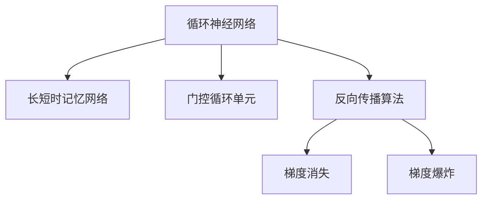

                 

## 1. 背景介绍

### 1.1 问题由来
循环神经网络（Recurrent Neural Networks, RNNs）是深度学习中一类重要的神经网络模型，主要用于处理序列数据，如时间序列数据、文本、音频等。RNNs通过引入循环结构，允许网络层间的信息传递和记忆，从而能够更好地处理具有时间依赖性的序列数据。

在实际应用中，RNNs被广泛应用于自然语言处理（NLP）、语音识别、视频分析、时间序列预测等多个领域。例如，在机器翻译中，RNNs可以逐词处理源语言句子，并逐步生成目标语言翻译；在文本生成中，RNNs可以通过循环结构逐步生成文本内容，如图生图、代码生成等。

### 1.2 问题核心关键点
RNNs的核心思想在于通过循环结构实现信息在时间维度上的传递和记忆，从而能够处理序列数据的动态变化。然而，传统的RNNs面临梯度消失和梯度爆炸的问题，限制了其在大规模数据上的应用。为了解决这些问题，提出了长短时记忆网络（LSTM）和门控循环单元（GRU）等改进的RNN架构。

RNNs的成功源于其在序列数据建模上的卓越表现，但同时，其模型复杂性、训练复杂度和实际应用中的性能瓶颈也引起了学界的广泛关注。如何提升RNNs的训练效率和应用效果，是当前研究的一个热点。

### 1.3 问题研究意义
RNNs及其改进架构在深度学习中占据重要地位，具有广泛的应用前景。研究RNNs的基本原理和实现方法，对深入理解深度学习模型、提升序列数据处理的性能，具有重要的理论和实际意义：

1. 理解RNNs的工作机制，掌握序列数据建模的方法，有助于设计更加高效、灵活的深度学习模型。
2. 探讨RNNs的优化策略和实现技巧，可以提升模型在实际应用中的训练效率和性能。
3. 分析RNNs在各领域的应用案例，可以为相关应用场景提供有价值的参考和借鉴。
4. 研究RNNs面临的挑战和未来趋势，有助于预见和应对深度学习领域的未来发展方向。

## 2. 核心概念与联系

### 2.1 核心概念概述

为更好地理解RNNs的原理和实现，本节将介绍几个密切相关的核心概念：

- **循环神经网络**：基于序列数据的神经网络模型，通过循环结构实现信息在时间维度上的传递和记忆，能够处理具有时间依赖性的序列数据。
- **长短时记忆网络(LSTM)**：一种改进的RNN架构，通过引入门控机制解决梯度消失问题，适用于处理长时间依赖的序列数据。
- **门控循环单元(GRU)**：另一种改进的RNN架构，具有LSTM的优点，但参数更少，计算更高效。
- **反向传播算法**：用于训练RNNs的优化算法，通过链式法则计算梯度，更新模型参数。
- **梯度消失和梯度爆炸**：RNNs在训练过程中面临的问题，表现为梯度信息的丢失或过度放大，导致模型训练困难。

这些核心概念之间的逻辑关系可以通过以下Mermaid流程图来展示：



这个流程图展示了一系列RNNs相关的核心概念及其之间的关系：

1. 循环神经网络是基础模型，长短时记忆网络和门控循环单元是改进架构。
2. 反向传播算法是训练过程中的核心优化算法。
3. 梯度消失和梯度爆炸是训练中常见的问题，LSTM和GRU通过门控机制进行优化。

## 3. 核心算法原理 & 具体操作步骤
### 3.1 算法原理概述

循环神经网络的原理基于序列数据的循环结构，使得网络能够接收一个序列的数据输入，并通过时间维度上的传递和记忆，对序列数据进行处理和预测。

RNNs的基本结构包括一个循环层，每一层包含若干个神经元，每个神经元接收前一时刻的输出作为输入，并输出当前时刻的预测结果。循环层中的信息可以通过时间维度上的循环传递，从而实现序列数据的动态处理。

### 3.2 算法步骤详解

#### 3.2.1 模型定义

在PyTorch中，可以使用`nn.RNN`模块定义一个基本的循环神经网络。下面以一个简单的文本分类任务为例，定义一个基于LSTM的RNN模型：

```python
import torch
import torch.nn as nn

class RNN(nn.Module):
    def __init__(self, input_size, hidden_size, output_size):
        super(RNN, self).__init__()
        self.hidden_size = hidden_size
        self.rnn = nn.LSTM(input_size, hidden_size, batch_first=True)
        self.fc = nn.Linear(hidden_size, output_size)
        
    def forward(self, input, hidden):
        output, hidden = self.rnn(input, hidden)
        output = self.fc(output[:, -1, :])
        return output, hidden
```

在上述代码中，`nn.LSTM`模块定义了一个LSTM层，接收输入`input`和隐藏状态`hidden`，并返回输出`output`和新的隐藏状态`hidden`。`nn.Linear`模块用于定义输出层，将LSTM层的输出映射到输出空间。

#### 3.2.2 数据准备

定义训练数据和标签，并进行数据预处理。以一个文本分类任务为例：

```python
import torch
from torchtext.datasets import AG_NEWS
from torchtext.data import Field, BucketIterator

train_data, test_data = AG_NEWS.splits(exts=('.txt'), fields=[Field(tokenize='spacy', lower=True, pad_first=True)])
train_iterator, test_iterator = BucketIterator.splits((train_data, test_data), batch_size=64, device=torch.device('cuda'))
```

在上述代码中，`AG_NEWS`是`torchtext`提供的分类数据集，包含四个类别的新闻文章。`Field`模块用于定义数据字段，`spacy`库用于分词，`BucketIterator`用于构建批处理器，将数据分批输入模型进行训练。

#### 3.2.3 模型训练

定义训练过程，包括模型初始化、数据迭代、损失函数和优化器设置等：

```python
import torch.optim as optim

model = RNN(input_size=300, hidden_size=128, output_size=4).to(device)
criterion = nn.CrossEntropyLoss()
optimizer = optim.Adam(model.parameters(), lr=0.001)

for epoch in range(10):
    model.train()
    total_loss = 0
    for batch in train_iterator:
        optimizer.zero_grad()
        hidden = model.init_hidden(batch.size(0))
        input, labels = batch
        output, hidden = model(input, hidden)
        loss = criterion(output, labels)
        total_loss += loss.item()
        loss.backward()
        optimizer.step()
    print(f'Epoch {epoch+1}, Loss: {total_loss/len(train_iterator)}')
```

在上述代码中，`model.init_hidden`用于初始化隐藏状态，`nn.CrossEntropyLoss`用于定义交叉熵损失函数，`optim.Adam`用于定义优化器。训练过程中，通过循环迭代数据，计算损失，反向传播更新模型参数。

#### 3.2.4 模型评估

定义模型评估过程，评估模型在测试集上的表现：

```python
model.eval()
total_correct = 0
total_num = 0
with torch.no_grad():
    for batch in test_iterator:
        input, labels = batch
        output, _ = model(input)
        _, predicted = torch.max(output, 1)
        total_correct += (predicted == labels).sum().item()
        total_num += labels.size(0)
print(f'Test Accuracy: {total_correct/total_num}')
```

在上述代码中，`model.eval`用于将模型设置为评估模式，`with torch.no_grad`用于关闭梯度计算，提高评估效率。通过循环迭代测试集，计算模型预测结果与真实标签的匹配度，得出准确率。

### 3.3 算法优缺点

循环神经网络及其改进架构在序列数据处理上表现出色，但也存在一些缺点：

1. **训练效率低**：RNNs的训练过程需要遍历整个序列，计算量大，训练时间长。
2. **参数量大**：由于循环结构的存在，RNNs需要存储大量的隐藏状态信息，导致参数量较大。
3. **梯度消失和梯度爆炸**：传统的RNNs在训练过程中容易遇到梯度消失或梯度爆炸的问题，导致模型训练困难。
4. **序列长度限制**：RNNs的循环结构导致序列长度受限，难以处理过长的序列数据。

尽管存在这些问题，RNNs及其改进架构在实际应用中仍表现出色，特别是对于时间序列数据的处理。未来的研究方向主要集中在如何提升RNNs的训练效率和性能，如引入更高效的优化算法、采用更小的循环结构等。

### 3.4 算法应用领域

循环神经网络及其改进架构在深度学习中有着广泛的应用，主要包括以下几个领域：

1. **自然语言处理(NLP)**：用于文本分类、情感分析、机器翻译、文本生成等任务。
2. **语音识别**：用于语音转换、语音合成、语音识别等任务。
3. **视频分析**：用于视频分类、动作识别、视频生成等任务。
4. **时间序列预测**：用于股票预测、气象预测、交通流量预测等任务。

此外，RNNs还被应用于多个交叉领域，如计算机视觉、生物信息学、金融分析等，推动了相关领域的技术进步。

## 4. 数学模型和公式 & 详细讲解  
### 4.1 数学模型构建

循环神经网络的数学模型可以表示为：

$$
\begin{aligned}
h_t &= f(W_xx_t + W_hh_{t-1} + b) \\
y_t &= g(h_t)
\end{aligned}
$$

其中，$h_t$ 为时刻 $t$ 的隐藏状态，$y_t$ 为时刻 $t$ 的输出，$f$ 和 $g$ 为非线性激活函数，$W_x$、$W_h$ 和 $b$ 为模型参数。

对于一个包含 $L$ 个时刻的序列数据 $x_t$，RNNs的输入输出关系可以表示为：

$$
\begin{aligned}
h_1 &= f(W_xx_1 + W_hh_0 + b) \\
h_t &= f(W_xx_t + W_hh_{t-1} + b), \quad t=2,\ldots,L \\
y_t &= g(h_t), \quad t=1,\ldots,L
\end{aligned}
$$

### 4.2 公式推导过程

以一个简单的LSTM模型为例，其输入输出关系可以表示为：

$$
\begin{aligned}
i_t &= \sigma(W_i[h_{t-1}, x_t] + b_i) \\
f_t &= \sigma(W_f[h_{t-1}, x_t] + b_f) \\
o_t &= \sigma(W_o[h_{t-1}, x_t] + b_o) \\
g_t &= \tanh(W_g[h_{t-1}, x_t] + b_g) \\
c_t &= f_t \odot c_{t-1} + i_t \odot g_t \\
h_t &= o_t \odot \tanh(c_t)
\end{aligned}
$$

其中，$\sigma$ 为sigmoid函数，$\tanh$ 为双曲正切函数，$\odot$ 为逐元素乘法。

对于给定的输入序列 $x_t$，LSTM模型的输出可以表示为：

$$
\begin{aligned}
i_t &= \sigma(W_i[h_{t-1}, x_t] + b_i) \\
f_t &= \sigma(W_f[h_{t-1}, x_t] + b_f) \\
o_t &= \sigma(W_o[h_{t-1}, x_t] + b_o) \\
g_t &= \tanh(W_g[h_{t-1}, x_t] + b_g) \\
c_t &= f_t \odot c_{t-1} + i_t \odot g_t \\
h_t &= o_t \odot \tanh(c_t)
\end{aligned}
$$

通过上述推导，可以清楚地看到LSTM模型中的门控机制，可以控制信息的流动，解决梯度消失问题，从而提升了RNNs的性能。

### 4.3 案例分析与讲解

以LSTM在机器翻译中的应用为例，LSTM可以逐词处理源语言句子，并逐步生成目标语言翻译。在训练过程中，LSTM模型接收源语言序列 $x_t$ 作为输入，并输出目标语言序列 $y_t$。

训练过程中，LSTM模型通过反向传播算法更新模型参数，最小化损失函数 $J$：

$$
J = \sum_{t=1}^{T} \left( y_t - \hat{y_t} \right)^2
$$

其中，$T$ 为序列长度，$\hat{y_t}$ 为模型预测的目标语言单词。

在评估过程中，LSTM模型接收源语言测试集 $x_t$ 作为输入，并输出目标语言序列 $y_t$。通过计算预测输出与真实标签之间的匹配度，得出评估指标，如BLEU（双语评价指标）等。

## 5. 项目实践：代码实例和详细解释说明
### 5.1 开发环境搭建

在进行RNNs项目实践前，我们需要准备好开发环境。以下是使用Python进行PyTorch开发的环境配置流程：

1. 安装Anaconda：从官网下载并安装Anaconda，用于创建独立的Python环境。

2. 创建并激活虚拟环境：
```bash
conda create -n pytorch-env python=3.8 
conda activate pytorch-env
```

3. 安装PyTorch：根据CUDA版本，从官网获取对应的安装命令。例如：
```bash
conda install pytorch torchvision torchaudio cudatoolkit=11.1 -c pytorch -c conda-forge
```

4. 安装相关库：
```bash
pip install numpy pandas scikit-learn torchtext
```

完成上述步骤后，即可在`pytorch-env`环境中开始RNNs项目实践。

### 5.2 源代码详细实现

下面我们以LSTM模型在文本分类任务中的应用为例，给出完整的代码实现。

```python
import torch
import torch.nn as nn
import torch.optim as optim
from torchtext.datasets import AG_NEWS
from torchtext.data import Field, BucketIterator

class LSTM(nn.Module):
    def __init__(self, input_size, hidden_size, output_size):
        super(LSTM, self).__init__()
        self.hidden_size = hidden_size
        self.lstm = nn.LSTM(input_size, hidden_size, batch_first=True)
        self.fc = nn.Linear(hidden_size, output_size)
        
    def forward(self, input, hidden):
        output, hidden = self.lstm(input, hidden)
        output = self.fc(output[:, -1, :])
        return output, hidden

def train(model, iterator, optimizer, criterion):
    model.train()
    total_loss = 0
    for batch in iterator:
        optimizer.zero_grad()
        hidden = model.init_hidden(batch.size(0))
        input, labels = batch
        output, hidden = model(input, hidden)
        loss = criterion(output, labels)
        total_loss += loss.item()
        loss.backward()
        optimizer.step()
    return total_loss / len(iterator)

def evaluate(model, iterator, criterion):
    model.eval()
    total_correct = 0
    total_num = 0
    with torch.no_grad():
        for batch in iterator:
            input, labels = batch
            output, _ = model(input)
            _, predicted = torch.max(output, 1)
            total_correct += (predicted == labels).sum().item()
            total_num += labels.size(0)
    return total_correct / total_num

train_data, test_data = AG_NEWS.splits(exts=('.txt'), fields=[Field(tokenize='spacy', lower=True, pad_first=True)])
train_iterator, test_iterator = BucketIterator.splits((train_data, test_data), batch_size=64, device=torch.device('cuda'))

input_size = 300
hidden_size = 128
output_size = 4
model = LSTM(input_size, hidden_size, output_size).to(device)
criterion = nn.CrossEntropyLoss()
optimizer = optim.Adam(model.parameters(), lr=0.001)

for epoch in range(10):
    train_loss = train(model, train_iterator, optimizer, criterion)
    test_acc = evaluate(model, test_iterator, criterion)
    print(f'Epoch {epoch+1}, Train Loss: {train_loss:.4f}, Test Acc: {test_acc:.4f}')
```

### 5.3 代码解读与分析

让我们再详细解读一下关键代码的实现细节：

**LSTM类**：
- `__init__`方法：初始化LSTM模型，定义输入、隐藏和输出层的维度。
- `forward`方法：定义前向传播过程，接收输入和隐藏状态，返回输出和新的隐藏状态。

**train函数**：
- 设置模型为训练模式，循环迭代训练集数据，计算损失函数，反向传播更新模型参数。
- 返回训练集上的平均损失。

**evaluate函数**：
- 设置模型为评估模式，循环迭代测试集数据，计算预测结果与真实标签的匹配度，返回测试集上的准确率。

**train过程中数据处理**：
- 使用`model.init_hidden`初始化隐藏状态，`nn.CrossEntropyLoss`定义交叉熵损失函数，`optim.Adam`定义优化器。
- 循环迭代训练集数据，计算损失，反向传播更新模型参数，并返回训练集上的平均损失。

**evaluate过程中数据处理**：
- 循环迭代测试集数据，计算预测结果与真实标签的匹配度，并返回测试集上的准确率。

**训练和评估流程**：
- 定义模型和损失函数，并设置优化器。
- 循环迭代训练集数据，计算损失，反向传播更新模型参数，并输出训练集上的平均损失和测试集上的准确率。

可以看到，PyTorch的高级API使得RNNs的实现变得简洁高效，开发者可以将更多精力放在模型设计和训练策略的优化上，而不必过多关注底层实现细节。

## 6. 实际应用场景

### 6.1 智能客服系统

基于LSTM的智能客服系统可以通过分析用户输入的对话内容，提供准确的解答。在实现过程中，LSTM模型接收用户输入作为输入序列，并逐步生成响应文本，并通过优化算法更新模型参数，提升模型的准确性和鲁棒性。

智能客服系统的应用场景包括在线客服、自助服务、语音客服等，能够显著提升客服效率和服务质量。LSTM模型在大规模文本数据上进行预训练，并在特定的客服语料上微调，能够处理不同类型的客户咨询，快速响应问题。

### 6.2 金融舆情监测

LSTM模型在金融舆情监测中的应用可以追溯到数据挖掘、情感分析等领域。通过分析社交媒体、新闻、评论等文本数据，LSTM模型可以实时监测金融市场的舆情变化，帮助金融机构及时发现和应对潜在的风险。

在实际应用中，LSTM模型接收金融领域相关的文本数据作为输入，通过优化算法更新模型参数，并输出金融舆情的情感倾向和主题。金融机构可以根据舆情监测结果，采取相应的风险控制措施，保障金融市场的稳定运行。

### 6.3 个性化推荐系统

LSTM模型在个性化推荐系统中的应用可以基于用户的历史行为数据进行推荐。通过分析用户的浏览、点击、购买等行为数据，LSTM模型可以逐步生成推荐列表，并通过优化算法更新模型参数，提升推荐的个性化和精准度。

在实际应用中，LSTM模型接收用户的历史行为数据作为输入，通过优化算法更新模型参数，并输出推荐列表。推荐系统可以根据LSTM模型的输出，进行多轮迭代，逐步提升推荐的个性化和精准度。

### 6.4 未来应用展望

随着深度学习技术的不断发展，LSTM模型及其改进架构在实际应用中表现出色，其应用前景也更加广阔。未来，LSTM模型有望在以下几个领域得到更广泛的应用：

1. **自然语言处理(NLP)**：用于文本分类、情感分析、机器翻译、文本生成等任务。
2. **语音识别**：用于语音转换、语音合成、语音识别等任务。
3. **视频分析**：用于视频分类、动作识别、视频生成等任务。
4. **时间序列预测**：用于股票预测、气象预测、交通流量预测等任务。

此外，LSTM模型还被应用于多个交叉领域，如计算机视觉、生物信息学、金融分析等，推动了相关领域的技术进步。

## 7. 工具和资源推荐
### 7.1 学习资源推荐

为了帮助开发者系统掌握LSTM模型的原理和实现方法，这里推荐一些优质的学习资源：

1. 《深度学习》书籍：Ian Goodfellow、Yoshua Bengio、Aaron Courville合著的经典教材，系统介绍了深度学习的理论基础和应用方法。
2. 《神经网络与深度学习》在线课程：由Michael Nielsen主讲，介绍了神经网络的基本原理和实现方法，适合初学者入门。
3. 《LSTM Networks for Natural Language Processing》论文：LSTM模型的奠基性论文，介绍了LSTM的基本原理和应用场景。
4. 《PyTorch官方文档》：PyTorch的官方文档，提供了详细的API介绍和实例代码，是学习PyTorch的好资源。
5. 《Python深度学习》书籍：François Chollet著的深度学习入门书籍，介绍了深度学习的基本概念和实现方法。

通过对这些资源的学习实践，相信你一定能够系统掌握LSTM模型的原理和实现方法，并用于解决实际的NLP问题。
###  7.2 开发工具推荐

高效的开发离不开优秀的工具支持。以下是几款用于LSTM模型开发的常用工具：

1. PyTorch：基于Python的开源深度学习框架，灵活动态的计算图，适合快速迭代研究。
2. TensorFlow：由Google主导开发的开源深度学习框架，生产部署方便，适合大规模工程应用。
3. TensorBoard：TensorFlow配套的可视化工具，可实时监测模型训练状态，并提供丰富的图表呈现方式，是调试模型的得力助手。
4. Weights & Biases：模型训练的实验跟踪工具，可以记录和可视化模型训练过程中的各项指标，方便对比和调优。
5. Keras：基于TensorFlow的高层API，提供了简洁的接口，适合快速原型开发。

合理利用这些工具，可以显著提升LSTM模型的开发效率，加快创新迭代的步伐。

### 7.3 相关论文推荐

LSTM模型的成功源于其在序列数据建模上的卓越表现，以下是几篇奠基性的相关论文，推荐阅读：

1. LSTM Networks for Natural Language Processing：LSTM模型的奠基性论文，介绍了LSTM的基本原理和应用场景。
2. Long Short-Term Memory（LSTM）：LSTM模型的发明者Hochreiter和Schmidhuber的文章，详细介绍了LSTM的结构和优化策略。
3. Applying Recurrent Neural Networks to Question Answering：在问答任务中应用LSTM的论文，展示了LSTM在问答系统中的应用。
4. Learning Phrase Representations using RNN Encoder Decoder for Statistical Machine Translation：LSTM在机器翻译任务中的应用，展示了LSTM在序列生成上的强大能力。
5. Building Sequence Models with Recurrent Neural Networks：Ian Goodfellow的入门教程，详细介绍了RNN和LSTM的基本原理和实现方法。

这些论文代表了大语言模型微调技术的发展脉络。通过学习这些前沿成果，可以帮助研究者把握学科前进方向，激发更多的创新灵感。

## 8. 总结：未来发展趋势与挑战

### 8.1 总结

本文对循环神经网络及其改进架构的基本原理和实现方法进行了全面系统的介绍。首先阐述了LSTM模型的背景和应用意义，明确了LSTM模型在序列数据处理中的重要作用。其次，从原理到实践，详细讲解了LSTM模型的数学模型、优化算法和代码实现，给出了LSTM模型在文本分类任务中的应用实例。同时，本文还广泛探讨了LSTM模型在多个领域的应用场景，展示了LSTM模型的广泛应用前景。

通过本文的系统梳理，可以看到，LSTM模型及其改进架构在深度学习中占据重要地位，具有广泛的应用前景。研究LSTM模型的基本原理和实现方法，对深入理解深度学习模型、提升序列数据处理的性能，具有重要的理论和实际意义。

### 8.2 未来发展趋势

展望未来，LSTM模型及其改进架构在深度学习中仍将占据重要地位，其应用前景也将更加广阔。未来LSTM模型的发展趋势主要体现在以下几个方面：

1. **更高效的优化算法**：随着深度学习模型的参数量不断增大，传统的优化算法如SGD、Adam等已难以满足需求，未来的研究将聚焦于更高效的优化算法，如AdamW、Adafactor等，以提升模型训练效率和性能。
2. **更小的循环结构**：由于循环结构带来的计算开销和模型复杂度，未来的研究将探索更小的循环结构，如GRU、GRU-LSTM等，以减少计算开销和模型参数量。
3. **多模态融合**：未来的LSTM模型将与视觉、语音等多模态数据结合，实现多模态信息融合，提升模型性能和应用范围。
4. **更广泛的应用场景**：LSTM模型在自然语言处理、语音识别、视频分析、时间序列预测等多个领域均有广泛应用，未来的研究将进一步拓展应用场景，推动相关领域的技术进步。

这些发展趋势凸显了LSTM模型的强大生命力和广阔前景，相信未来的LSTM模型将进一步提升序列数据处理的性能，推动相关领域的技术进步。

### 8.3 面临的挑战

尽管LSTM模型及其改进架构在深度学习中表现出色，但在实际应用中仍面临诸多挑战：

1. **计算资源消耗大**：LSTM模型的计算开销较大，特别是在大规模数据集上训练时，需要高性能计算设备支持。如何优化计算资源，提升模型训练效率，是未来研究的重要方向。
2. **模型参数量大**：LSTM模型的参数量较大，难以在资源有限的设备上实现。如何降低模型参数量，提高模型计算效率，是未来研究的重要课题。
3. **序列长度限制**：LSTM模型的循环结构限制了序列长度，难以处理过长的序列数据。如何提升模型的序列处理能力，是未来研究的重要方向。
4. **模型复杂度高**：LSTM模型的结构复杂，难以理解和调试。如何简化模型结构，提升模型的可解释性，是未来研究的重要方向。
5. **模型鲁棒性不足**：LSTM模型在面对噪声、干扰等复杂环境时，鲁棒性不足。如何提高模型的鲁棒性，增强模型的稳定性和可靠性，是未来研究的重要方向。

这些挑战限制了LSTM模型的实际应用范围，未来的研究需要针对这些问题进行深入探索，以进一步提升LSTM模型的性能和应用效果。

### 8.4 研究展望

面向未来，LSTM模型的研究需要针对其面临的挑战进行突破，同时推动更多前沿研究方向的发展：

1. **更高效的优化算法**：开发更高效的优化算法，提升模型训练效率和性能。
2. **更小的循环结构**：探索更小的循环结构，降低模型计算开销和参数量。
3. **多模态融合**：实现多模态信息融合，提升模型的应用范围和性能。
4. **模型压缩和量化**：通过模型压缩和量化，提升模型计算效率和资源利用率。
5. **可解释性增强**：提升模型的可解释性，增强模型的透明性和可理解性。
6. **鲁棒性提升**：提高模型的鲁棒性，增强模型的稳定性和可靠性。

这些研究方向将进一步推动LSTM模型的研究和应用，使LSTM模型在实际应用中发挥更大的作用，为深度学习技术的普及和应用贡献力量。总之，LSTM模型及其改进架构在深度学习中具有重要地位，未来的研究需要不断优化和突破，才能更好地适应实际应用需求。

## 9. 附录：常见问题与解答

**Q1：LSTM模型与其他RNN架构有何不同？**

A: LSTM模型与传统的RNN架构相比，引入了门控机制，可以更好地控制信息的流动，解决梯度消失问题。LSTM模型在每个时间步中，通过计算输入门$i$、遗忘门$f$和输出门$o$，决定当前时间步的输入和遗忘信息，从而实现对序列数据的动态处理。

**Q2：LSTM模型在训练过程中如何避免梯度消失问题？**

A: LSTM模型引入了门控机制，可以控制信息的流动，从而避免梯度消失问题。具体来说，通过输入门$i$、遗忘门$f$和输出门$o$，LSTM模型可以灵活控制信息的输入和遗忘，避免梯度消失现象的发生。此外，LSTM模型还可以使用梯度裁剪等技术，进一步提升模型的鲁棒性和训练效率。

**Q3：LSTM模型在实际应用中面临哪些挑战？**

A: LSTM模型在实际应用中面临以下挑战：
1. 计算资源消耗大：LSTM模型的计算开销较大，需要高性能计算设备支持。
2. 模型参数量大：LSTM模型的参数量较大，难以在资源有限的设备上实现。
3. 序列长度限制：LSTM模型的循环结构限制了序列长度，难以处理过长的序列数据。
4. 模型复杂度高：LSTM模型的结构复杂，难以理解和调试。
5. 模型鲁棒性不足：LSTM模型在面对噪声、干扰等复杂环境时，鲁棒性不足。

**Q4：LSTM模型在文本分类任务中的应用流程是什么？**

A: LSTM模型在文本分类任务中的应用流程主要包括以下几个步骤：
1. 数据预处理：将文本数据转换为模型可以接受的格式，如分词、向量化等。
2. 模型定义：定义LSTM模型，包括输入、隐藏和输出层的维度。
3. 训练过程：将预处理后的数据输入模型，通过前向传播计算损失函数，反向传播更新模型参数，重复迭代直至收敛。
4. 模型评估：将测试集数据输入模型，计算预测结果与真实标签的匹配度，评估模型性能。

**Q5：LSTM模型在实际应用中的优化策略有哪些？**

A: LSTM模型在实际应用中的优化策略主要包括以下几个方面：
1. 梯度裁剪：通过限制梯度的大小，避免梯度爆炸问题。
2. 参数共享：通过参数共享，减少模型参数量，提高计算效率。
3. 正则化：通过正则化技术，避免模型过拟合。
4. 数据增强：通过数据增强，提高模型泛化能力。
5. 批量归一化：通过批量归一化，提高模型训练稳定性和收敛速度。

这些优化策略可以提升LSTM模型的训练效率和性能，使LSTM模型在实际应用中表现更加出色。

---

作者：禅与计算机程序设计艺术 / Zen and the Art of Computer Programming

