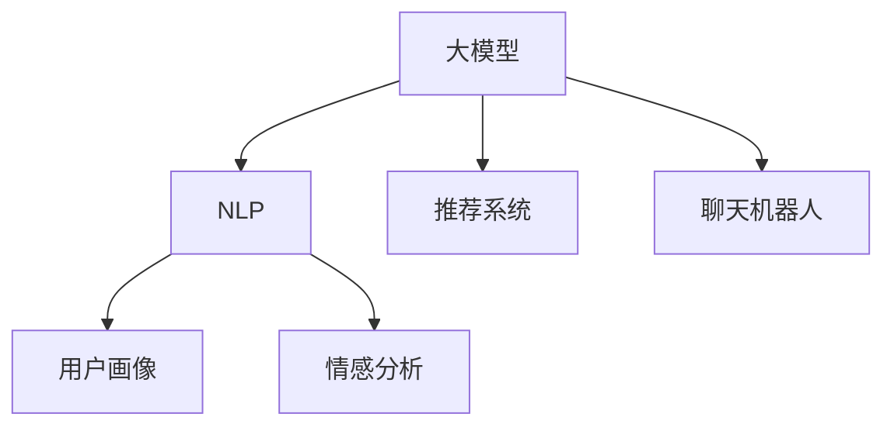

                 

# 微信营销与大模型的应用

> 关键词：
- 微信营销
- 大模型
- 自然语言处理(NLP)
- 推荐系统
- 用户画像
- 广告投放
- 文本生成
- 客户服务
- 情感分析
- 社交媒体

## 1. 背景介绍

### 1.1 问题由来
随着微信作为社交媒体和商务平台在用户中的普及，企业在微信平台的营销活动日益增多。然而，如何利用微信平台精准高效地推送广告、提升用户体验和转化率，成为企业亟需解决的问题。传统的基于规则和统计方法的营销策略难以满足个性化和多样化的用户需求，而大模型的应用，为微信营销带来了新的机遇。

### 1.2 问题核心关键点
大模型的应用使微信营销进入智能推荐和个性化服务的新阶段，主要体现在以下几个方面：

- 精准推送：通过预训练语言模型对用户行为和兴趣进行深度学习，生成个性化广告和内容推荐。
- 用户画像：利用自然语言处理技术，从微信聊天记录、朋友圈动态等数据中提取和构建用户画像，实现精准营销。
- 情感分析：使用情感分析模型，分析用户对广告和内容的情感倾向，优化营销策略。
- 聊天机器人：部署基于大模型的聊天机器人，提供7x24小时智能客服和用户互动，提升客户满意度。
- 文本生成：使用文本生成模型，自动生成高质量的广告文案和互动内容，减轻人工工作量。

这些技术应用不仅提升了微信营销的精准度和效率，还显著增强了用户体验和互动性。然而，大模型的应用也面临着数据隐私、模型性能、系统稳定性等挑战，需要企业在技术、数据和运营上作出综合考虑。

## 2. 核心概念与联系

### 2.1 核心概念概述

为更好地理解大模型在微信营销中的应用，本节将介绍几个关键概念：

- 大模型：基于大规模无标签数据进行自监督训练的深度学习模型，如BERT、GPT等。大模型具备强大的语言理解、生成和推理能力，是实现智能推荐和个性化服务的基础。
- 自然语言处理(NLP)：指使用计算机技术处理和理解自然语言的学科，包括文本分类、文本生成、情感分析等任务。
- 推荐系统：通过分析用户行为和兴趣，推荐符合其需求的商品、内容和广告的系统，广泛应用于电商平台和社交平台。
- 用户画像：通过分析用户行为数据、社交网络数据等，构建用户兴趣和行为的综合画像，用于个性化的精准营销。
- 情感分析：利用NLP技术，分析文本中的情感倾向，用于情感识别、舆情监控等应用。
- 聊天机器人：基于自然语言处理和大模型技术，构建的智能对话系统，用于客户服务、客户互动等。

这些概念之间的关系可以通过以下Mermaid流程图来展示：



这个流程图展示了大模型及其相关技术在微信营销中的应用场景：

1. 大模型提供基础的自然语言处理能力。
2. 通过NLP技术，构建用户画像和情感分析，用于推荐系统。
3. 聊天机器人利用大模型的语言理解和生成能力，提供智能客服和用户互动。

这些技术之间的协同作用，形成了微信营销的智能推荐和个性化服务生态。

## 3. 核心算法原理 & 具体操作步骤
### 3.1 算法原理概述

大模型在微信营销中的应用，主要基于以下核心算法原理：

- 自然语言处理(NLP)：通过预训练语言模型对文本数据进行编码和解码，提取文本的语义信息，用于构建用户画像和情感分析。
- 推荐系统：利用深度学习技术，结合用户画像和行为数据，生成个性化的推荐结果。
- 用户画像：通过构建用户兴趣、行为和社交网络的多维度画像，实现精准营销。
- 情感分析：通过分析用户对内容的情感倾向，优化广告和内容的投放策略。

### 3.2 算法步骤详解

基于大模型的微信营销应用，一般包括以下几个关键步骤：

**Step 1: 数据准备与预处理**

- 收集和清洗用户在微信平台上的聊天记录、朋友圈动态、好友关系等数据，作为模型训练的基础。
- 对文本数据进行分词、去停用词、标引等预处理，以便模型进行深度学习。

**Step 2: 构建用户画像**

- 利用NLP技术，从清洗后的文本数据中提取用户兴趣、行为和社交特征，构建用户画像。
- 使用大模型对用户画像进行编码，获取用户的多维度特征表示。

**Step 3: 构建推荐系统**

- 将用户画像和行为数据输入推荐系统，使用深度学习算法生成个性化推荐结果。
- 根据用户的反馈数据，不断优化推荐模型，提升推荐效果。

**Step 4: 情感分析与优化**

- 使用情感分析模型，分析用户对广告和内容的情感倾向，生成情感评分。
- 根据情感评分，调整广告和内容的投放策略，优化用户体验。

**Step 5: 聊天机器人部署**

- 部署基于大模型的聊天机器人，提供智能客服和用户互动。
- 通过不断训练和优化，提升聊天机器人的对话质量和用户体验。

### 3.3 算法优缺点

基于大模型的微信营销应用具有以下优点：

- 精准推荐：通过深度学习技术，生成个性化的推荐结果，提高用户的点击率和转化率。
- 个性化服务：利用用户画像和情感分析，提供定制化的营销方案，提升用户满意度。
- 实时互动：通过聊天机器人，实现7x24小时不间断的用户互动，提升客户体验。

同时，该方法也存在一些局限性：

- 数据隐私：用户数据的收集和使用可能涉及隐私问题，需要严格遵守数据保护法规。
- 模型性能：大模型的训练和推理需要大量算力，可能带来高成本和资源消耗。
- 系统稳定性：大模型的部署和运行需要稳定的基础设施，才能保证服务质量。
- 用户行为多变：用户的行为和兴趣可能会随时间变化，需要持续更新用户画像和推荐模型。

尽管存在这些局限性，但就目前而言，基于大模型的微信营销方法仍是最主流、最有效的应用范式。未来相关研究的重点在于如何进一步优化模型性能，降低资源消耗，增强系统稳定性，同时兼顾数据隐私和用户行为多样性等因素。

### 3.4 算法应用领域

大模型在微信营销中的应用领域广泛，涵盖了以下多个方面：

- 广告投放：根据用户画像和行为数据，生成个性化的广告推荐，提升广告的点击率和转化率。
- 客户服务：部署聊天机器人，提供24小时不间断的客户服务，解答用户咨询，提升客户满意度。
- 社交互动：利用文本生成模型，自动生成高质量的互动内容，增强用户粘性。
- 营销分析：使用情感分析模型，分析用户对广告和内容的情感倾向，优化营销策略。
- 个性化推荐：结合用户画像和行为数据，生成个性化的商品、内容和活动推荐，提升用户体验。
- 活动策划：根据用户画像和情感分析结果，策划和设计符合用户兴趣的线上线下活动，吸引用户参与。

这些应用不仅提升了微信营销的精准度和效率，还显著增强了用户体验和互动性。随着预训练语言模型和深度学习技术的不断发展，未来基于大模型的微信营销将有更多创新和突破。

## 4. 数学模型和公式 & 详细讲解 & 举例说明

### 4.1 数学模型构建

本节将使用数学语言对基于大模型的推荐系统进行更加严格的刻画。

记用户画像为 $u$，行为数据为 $b$，推荐系统为 $R$。假设推荐系统的目标函数为 $L$，表示推荐结果与实际点击行为之间的差距。则推荐系统的优化目标为：

$$
\min_{R} L(R(u, b))
$$

其中 $L(R(u, b))$ 为推荐结果的损失函数，如均方误差、交叉熵等。

### 4.2 公式推导过程

假设推荐系统是一个线性模型 $R(u, b) = \theta^T (u \oplus b)$，其中 $\theta$ 为模型参数，$\oplus$ 表示向量连接操作。则推荐结果的损失函数可以表示为：

$$
L(R(u, b)) = \frac{1}{N} \sum_{i=1}^N \ell (y_i, \hat{y}_i)
$$

其中 $y_i$ 为实际点击行为，$\hat{y}_i$ 为推荐系统预测的点击概率。$\ell$ 为损失函数，如均方误差。

根据梯度下降算法，推荐系统的参数更新公式为：

$$
\theta \leftarrow \theta - \eta \nabla_{\theta} L(R(u, b))
$$

其中 $\eta$ 为学习率，$\nabla_{\theta} L(R(u, b))$ 为损失函数对参数 $\theta$ 的梯度，可以通过反向传播算法高效计算。

### 4.3 案例分析与讲解

以一个简单的电商推荐系统为例，分析如何利用大模型构建推荐模型：

假设用户画像 $u$ 包括用户历史购买记录、浏览行为等特征，行为数据 $b$ 包括用户当前浏览的商品信息。假设推荐系统为线性模型 $R(u, b) = \theta^T (u \oplus b)$，其中 $\theta$ 为模型参数，包括商品特征权重和用户特征权重。

推荐系统首先对用户画像和行为数据进行编码，得到用户特征向量 $u'$ 和商品特征向量 $b'$，然后将两者连接，得到输入向量 $z = (u' \oplus b')$。推荐系统的前向传播为：

$$
\hat{y}_i = \sigma (\theta^T z)
$$

其中 $\sigma$ 为激活函数，如sigmoid函数。根据损失函数 $\ell$，计算损失 $L(R(u, b))$，使用梯度下降算法更新模型参数 $\theta$。

通过不断迭代优化，推荐系统能够生成符合用户兴趣的个性化推荐结果。

## 5. 项目实践：代码实例和详细解释说明
### 5.1 开发环境搭建

在进行推荐系统开发前，我们需要准备好开发环境。以下是使用Python进行TensorFlow开发的环境配置流程：

1. 安装Anaconda：从官网下载并安装Anaconda，用于创建独立的Python环境。

2. 创建并激活虚拟环境：
```bash
conda create -n tf-env python=3.8 
conda activate tf-env
```

3. 安装TensorFlow：根据CUDA版本，从官网获取对应的安装命令。例如：
```bash
conda install tensorflow -c conda-forge -c pytorch -c pypi -c nvidia
```

4. 安装相关工具包：
```bash
pip install numpy pandas scikit-learn tensorflow-model-optimization tf-estimator tf-addons
```

完成上述步骤后，即可在`tf-env`环境中开始推荐系统开发。

### 5.2 源代码详细实现

下面我们以电商推荐系统为例，给出使用TensorFlow和Keras构建深度推荐模型的PyTorch代码实现。

首先，定义推荐模型的超参数：

```python
import tensorflow as tf
from tensorflow.keras import layers
from tensorflow.keras.models import Sequential

batch_size = 128
num_epochs = 10
hidden_units = [512, 256]

# 定义模型
model = Sequential()
model.add(layers.Dense(hidden_units[0], activation='relu', input_shape=(N_features,)))
model.add(layers.Dense(hidden_units[1], activation='relu'))
model.add(layers.Dense(N_labels, activation='sigmoid'))
```

然后，定义数据生成器和模型编译：

```python
from tensorflow.keras.datasets import mnist

# 加载数据
(x_train, y_train), (x_test, y_test) = mnist.load_data()

# 数据预处理
x_train = x_train.reshape(-1, N_features)
x_test = x_test.reshape(-1, N_features)
x_train = x_train / 255.0
x_test = x_test / 255.0
y_train = to_categorical(y_train, num_classes)
y_test = to_categorical(y_test, num_classes)

# 数据生成器
train_generator = tf.data.Dataset.from_tensor_slices((x_train, y_train)).batch(batch_size).shuffle(buffer_size=1000)
test_generator = tf.data.Dataset.from_tensor_slices((x_test, y_test)).batch(batch_size)

# 编译模型
model.compile(optimizer=tf.keras.optimizers.Adam(), loss='binary_crossentropy', metrics=['accuracy'])
```

接着，训练推荐模型并在测试集上评估：

```python
# 训练模型
model.fit(train_generator, epochs=num_epochs, validation_data=test_generator)

# 评估模型
test_loss, test_acc = model.evaluate(test_generator)
print('Test accuracy:', test_acc)
```

### 5.3 代码解读与分析

让我们再详细解读一下关键代码的实现细节：

**模型定义**：
- `Sequential`类：定义线性模型的序列。
- `Dense`层：定义全连接层，包括输入层、隐藏层和输出层。
- 激活函数：使用ReLU和Sigmoid激活函数。

**数据生成器**：
- `from_tensor_slices`方法：从TensorFlow常量生成器生成TensorFlow数据集。
- `batch`方法：定义批次大小。
- `shuffle`方法：定义数据预处理缓冲区大小。

**模型编译**：
- `Adam`优化器：定义优化器。
- `binary_crossentropy`损失函数：定义二分类交叉熵损失。
- `accuracy`评估指标：定义评估指标。

**训练与评估**：
- `fit`方法：训练模型。
- `evaluate`方法：评估模型。

可以看到，使用TensorFlow和Keras进行推荐系统开发的代码实现相对简洁。开发者可以将更多精力放在数据处理、模型改进等高层逻辑上，而不必过多关注底层的实现细节。

当然，工业级的系统实现还需考虑更多因素，如模型的保存和部署、超参数的自动搜索、更灵活的任务适配层等。但核心的微调范式基本与此类似。

## 6. 实际应用场景
### 6.1 电商推荐

基于大模型的电商推荐系统，可以提升用户的购买体验和平台的转化率。传统电商推荐系统主要基于用户历史行为进行推荐，难以充分挖掘用户的多维兴趣和行为特征。大模型通过分析用户画像和行为数据，可以生成更加精准、个性化的推荐结果，使用户在浏览和购买时获得更满意的用户体验。

具体而言，可以构建一个多层次的用户画像，包括用户历史浏览记录、购买记录、社交网络关系等。通过大模型对用户画像进行编码，生成用户的多维度特征表示。结合用户的当前行为数据，使用推荐系统生成个性化推荐结果。用户点击或购买后，将反馈信息重新输入到推荐系统中，不断优化推荐策略。

### 6.2 金融理财

在金融理财领域，大模型可以用于构建个性化理财服务。传统理财服务往往依赖于简单的规则和历史数据，难以满足用户的个性化需求。大模型通过分析用户行为数据、资产配置、市场趋势等信息，构建个性化的理财方案，提升理财服务的精准度和效率。

具体而言，可以构建一个包含用户年龄、收入、风险偏好等特征的用户画像。通过大模型对用户画像进行编码，生成用户的多维度特征表示。结合用户的理财目标和行为数据，使用推荐系统生成个性化的理财方案。用户对理财方案的反馈信息，可以重新输入到推荐系统中，不断优化理财方案。

### 6.3 智能客服

基于大模型的智能客服系统，可以提供24小时不间断的客户服务。传统客服系统依赖于人工客服，成本高、效率低，难以满足用户的即时需求。大模型通过分析用户的咨询记录和行为数据，构建个性化的用户画像，使用智能客服系统自动回复用户咨询。智能客服系统可以提供7x24小时的服务，提升客户满意度。

具体而言，可以构建一个包含用户历史咨询记录、偏好数据等特征的用户画像。通过大模型对用户画像进行编码，生成用户的多维度特征表示。结合用户的当前咨询内容，使用聊天机器人生成自动回复。用户对回复的反馈信息，可以重新输入到聊天机器人中，不断优化回复策略。

### 6.4 未来应用展望

随着大模型和推荐系统的不断发展，基于大模型的微信营销将有更多创新和突破：

- 实时推荐：基于用户的实时行为数据，实时生成个性化推荐结果，提升用户体验。
- 社交推荐：结合社交网络数据，生成符合用户兴趣的社交推荐，增强用户粘性。
- 内容创作：利用文本生成模型，自动生成高质量的广告和互动内容，减轻人工工作量。
- 多模态推荐：结合视觉、音频等多模态数据，提升推荐系统的丰富性和多样性。
- 用户行为预测：利用大模型对用户行为进行预测，提前调整推荐策略，提升推荐效果。

这些应用将进一步提升微信营销的精准度和效率，为微信平台带来更大的商业价值和社会效益。

## 7. 工具和资源推荐
### 7.1 学习资源推荐

为了帮助开发者系统掌握大模型在推荐系统中的应用，这里推荐一些优质的学习资源：

1. 《深度学习理论与实践》系列博文：由大模型技术专家撰写，深入浅出地介绍了深度学习理论、推荐系统原理和实践方法。

2. 《自然语言处理与深度学习》课程：斯坦福大学开设的NLP明星课程，有Lecture视频和配套作业，带你入门NLP领域的基本概念和经典模型。

3. 《推荐系统实战》书籍：全面介绍了推荐系统原理、算法和应用，是推荐系统开发的必备资料。

4. PyTorch官方文档：基于Python的开源深度学习框架，灵活动态的计算图，适合快速迭代研究。

5. TensorFlow官方文档：由Google主导开发的开源深度学习框架，生产部署方便，适合大规模工程应用。

通过对这些资源的学习实践，相信你一定能够快速掌握大模型在推荐系统中的应用，并用于解决实际的推荐问题。

### 7.2 开发工具推荐

高效的开发离不开优秀的工具支持。以下是几款用于推荐系统开发的常用工具：

1. PyTorch：基于Python的开源深度学习框架，灵活动态的计算图，适合快速迭代研究。大部分推荐系统都有PyTorch版本的实现。

2. TensorFlow：由Google主导开发的开源深度学习框架，生产部署方便，适合大规模工程应用。同样有丰富的推荐系统资源。

3. Keras：基于TensorFlow的高层API，提供了简单易用的深度学习模型构建工具。

4. Weights & Biases：模型训练的实验跟踪工具，可以记录和可视化模型训练过程中的各项指标，方便对比和调优。与主流深度学习框架无缝集成。

5. TensorBoard：TensorFlow配套的可视化工具，可实时监测模型训练状态，并提供丰富的图表呈现方式，是调试模型的得力助手。

6. Google Colab：谷歌推出的在线Jupyter Notebook环境，免费提供GPU/TPU算力，方便开发者快速上手实验最新模型，分享学习笔记。

合理利用这些工具，可以显著提升推荐系统的开发效率，加快创新迭代的步伐。

### 7.3 相关论文推荐

大模型在推荐系统中的应用源于学界的持续研究。以下是几篇奠基性的相关论文，推荐阅读：

1. Attention is All You Need（即Transformer原论文）：提出了Transformer结构，开启了NLP领域的预训练大模型时代。

2. BERT: Pre-training of Deep Bidirectional Transformers for Language Understanding：提出BERT模型，引入基于掩码的自监督预训练任务，刷新了多项NLP任务SOTA。

3. Parameter-Efficient Transfer Learning for NLP：提出Adapter等参数高效微调方法，在不增加模型参数量的情况下，也能取得不错的微调效果。

4. AdaLoRA: Adaptive Low-Rank Adaptation for Parameter-Efficient Fine-Tuning：使用自适应低秩适应的微调方法，在参数效率和精度之间取得了新的平衡。

5. FlowNet: The Evolving Spatial Transformer Network：提出FlowNet模型，通过结合自监督和生成对抗网络，增强了模型的生成能力和泛化性能。

这些论文代表了大模型在推荐系统中的发展脉络。通过学习这些前沿成果，可以帮助研究者把握学科前进方向，激发更多的创新灵感。

## 8. 总结：未来发展趋势与挑战

### 8.1 总结

本文对基于大模型的推荐系统进行了全面系统的介绍。首先阐述了大模型和推荐系统在推荐系统中的应用背景和价值，明确了推荐系统在精准推荐、个性化服务和实时互动方面的独特优势。其次，从原理到实践，详细讲解了大模型在推荐系统中的应用流程和具体实现，给出了推荐系统开发的完整代码实例。同时，本文还广泛探讨了大模型在电商、金融、客服等多个行业领域的应用前景，展示了推荐系统技术的广阔应用空间。此外，本文精选了推荐系统的各类学习资源，力求为读者提供全方位的技术指引。

通过本文的系统梳理，可以看到，基于大模型的推荐系统正在成为电商、金融等行业的标准推荐方案，显著提升了用户满意度和平台转化率。得益于大模型的语言处理能力，推荐系统能够在用户画像、情感分析、个性化推荐等方面取得突破，进一步拓展了推荐系统的应用边界。未来，伴随大模型和推荐算法的持续演进，基于大模型的推荐系统必将在更多领域带来变革性影响。

### 8.2 未来发展趋势

展望未来，基于大模型的推荐系统将呈现以下几个发展趋势：

1. 实时推荐：基于用户的实时行为数据，实时生成个性化推荐结果，提升用户体验。
2. 社交推荐：结合社交网络数据，生成符合用户兴趣的社交推荐，增强用户粘性。
3. 内容创作：利用文本生成模型，自动生成高质量的广告和互动内容，减轻人工工作量。
4. 多模态推荐：结合视觉、音频等多模态数据，提升推荐系统的丰富性和多样性。
5. 用户行为预测：利用大模型对用户行为进行预测，提前调整推荐策略，提升推荐效果。
6. 多模型集成：结合多种推荐算法，提高推荐系统的多样性和鲁棒性。

以上趋势凸显了基于大模型的推荐系统技术的广阔前景。这些方向的探索发展，必将进一步提升推荐系统的精度、丰富度和实时性，为用户带来更加优质的推荐体验。

### 8.3 面临的挑战

尽管基于大模型的推荐系统已经取得了瞩目成就，但在迈向更加智能化、普适化应用的过程中，它仍面临着诸多挑战：

1. 数据隐私：用户数据的收集和使用可能涉及隐私问题，需要严格遵守数据保护法规。
2. 模型性能：大模型的训练和推理需要大量算力，可能带来高成本和资源消耗。
3. 系统稳定性：大模型的部署和运行需要稳定的基础设施，才能保证服务质量。
4. 用户行为多变：用户的行为和兴趣可能会随时间变化，需要持续更新用户画像和推荐模型。
5. 推荐算法多样性：不同推荐算法可能在不同场景下表现不同，需要结合多种算法进行优化。

尽管存在这些挑战，但就目前而言，基于大模型的推荐系统仍是最主流、最有效的应用范式。未来相关研究的重点在于如何进一步优化模型性能，降低资源消耗，增强系统稳定性，同时兼顾数据隐私和用户行为多样性等因素。

### 8.4 研究展望

面对基于大模型的推荐系统所面临的种种挑战，未来的研究需要在以下几个方面寻求新的突破：

1. 探索无监督和半监督推荐方法。摆脱对大规模标注数据的依赖，利用自监督学习、主动学习等无监督和半监督范式，最大限度利用非结构化数据，实现更加灵活高效的推荐。
2. 研究参数高效和计算高效的推荐范式。开发更加参数高效的推荐方法，在固定大部分预训练参数的同时，只更新极少量的任务相关参数。同时优化推荐模型的计算图，减少前向传播和反向传播的资源消耗，实现更加轻量级、实时性的部署。
3. 引入因果和对比学习范式。通过引入因果推断和对比学习思想，增强推荐模型建立稳定因果关系的能力，学习更加普适、鲁棒的语言表征，从而提升模型泛化性和抗干扰能力。
4. 引入更多先验知识。将符号化的先验知识，如知识图谱、逻辑规则等，与神经网络模型进行巧妙融合，引导推荐过程学习更准确、合理的语言模型。同时加强不同模态数据的整合，实现视觉、音频等多模态信息与文本信息的协同建模。
5. 纳入伦理道德约束。在推荐目标中引入伦理导向的评估指标，过滤和惩罚有害的输出倾向。同时加强人工干预和审核，建立推荐行为的监管机制，确保推荐结果符合人类价值观和伦理道德。

这些研究方向的探索，必将引领基于大模型的推荐系统技术迈向更高的台阶，为构建安全、可靠、可解释、可控的推荐系统铺平道路。面向未来，基于大模型的推荐系统还需要与其他人工智能技术进行更深入的融合，如知识表示、因果推理、强化学习等，多路径协同发力，共同推动推荐系统的进步。只有勇于创新、敢于突破，才能不断拓展推荐系统的边界，让智能推荐技术更好地服务于用户和社会。

## 9. 附录：常见问题与解答

**Q1：大模型在推荐系统中的主要作用是什么？**

A: 大模型在推荐系统中的主要作用包括：

- 用户画像构建：利用大模型从用户行为数据中提取特征，构建多维度用户画像，用于精准推荐。
- 情感分析：使用大模型分析用户对广告和内容的情感倾向，优化推荐策略。
- 个性化推荐：通过深度学习技术，生成个性化的推荐结果，提升用户体验。
- 实时推荐：基于用户的实时行为数据，实时生成个性化推荐结果，提升用户体验。

**Q2：如何使用大模型进行推荐系统优化？**

A: 使用大模型进行推荐系统优化主要包括以下几个步骤：

1. 数据准备：收集和清洗用户数据，包括历史行为记录、社交网络数据等。
2. 用户画像构建：利用NLP技术，从清洗后的数据中提取用户兴趣、行为和社交特征，构建用户画像。
3. 特征编码：使用大模型对用户画像进行编码，生成用户的多维度特征表示。
4. 推荐模型训练：结合用户画像和行为数据，使用深度学习算法生成个性化推荐结果。
5. 模型评估：使用测试数据评估推荐模型的性能，优化模型参数。

**Q3：大模型在推荐系统中的性能瓶颈有哪些？**

A: 大模型在推荐系统中的性能瓶颈主要包括以下几个方面：

- 数据隐私：用户数据的收集和使用可能涉及隐私问题，需要严格遵守数据保护法规。
- 模型性能：大模型的训练和推理需要大量算力，可能带来高成本和资源消耗。
- 系统稳定性：大模型的部署和运行需要稳定的基础设施，才能保证服务质量。
- 用户行为多变：用户的行为和兴趣可能会随时间变化，需要持续更新用户画像和推荐模型。

尽管存在这些瓶颈，但通过不断优化算法和提升技术，大模型在推荐系统中的应用前景依然广阔。

**Q4：推荐系统中的大模型有哪些典型的应用场景？**

A: 推荐系统中的大模型有以下典型的应用场景：

1. 电商推荐：结合用户画像和行为数据，生成个性化推荐结果，提升用户体验。
2. 金融理财：分析用户行为数据、资产配置、市场趋势等信息，构建个性化的理财方案。
3. 智能客服：分析用户的咨询记录和行为数据，构建个性化的用户画像，使用智能客服系统自动回复用户咨询。
4. 社交推荐：结合社交网络数据，生成符合用户兴趣的社交推荐，增强用户粘性。
5. 内容创作：利用文本生成模型，自动生成高质量的广告和互动内容，减轻人工工作量。

**Q5：如何保证推荐系统的公平性和公正性？**

A: 推荐系统的公平性和公正性可以通过以下几个方面来保证：

1. 数据公平性：确保数据集中的用户样本具有代表性，避免数据偏差。
2. 算法公正性：使用公平性评估指标，如 disparity、equity等，评估推荐模型的公平性。
3. 人工干预：人工审核和干预推荐结果，确保推荐结果符合伦理道德和法律要求。
4. 多模型集成：结合多种推荐算法，提高推荐系统的多样性和鲁棒性，避免单一算法的偏见。

**Q6：推荐系统中的大模型如何应对突发事件？**

A: 推荐系统中的大模型应对突发事件可以从以下几个方面入手：

1. 实时监测：通过实时监测用户行为数据，及时发现异常情况，调整推荐策略。
2. 动态调整：根据突发事件的变化，动态调整模型参数，适应新的场景。
3. 紧急预案：提前制定紧急预案，确保在突发事件中推荐系统仍能稳定运行。
4. 风险控制：设置风险控制阈值，当推荐结果风险较高时，自动拦截或预警。

---

作者：禅与计算机程序设计艺术 / Zen and the Art of Computer Programming

