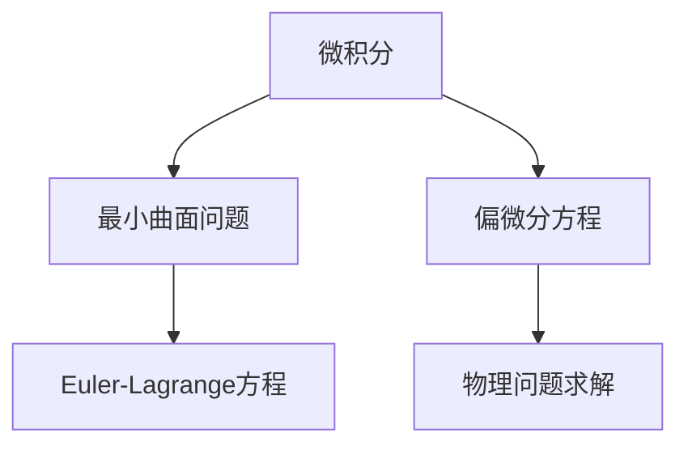

                 

# 微积分中的最小曲面问题

## 1. 背景介绍

### 1.1 问题由来

微积分作为数学的核心分支之一，在自然科学、工程学、经济学等领域有着广泛的应用。而微积分中的最小曲面问题，是微积分中的一大经典问题。最小曲面问题的研究不仅具有重要的理论意义，还对工程设计和计算机图形学等领域有深远影响。

最小曲面问题的研究最早可以追溯到欧拉和哈密顿的时代，他们在研究弹性体问题时，提出了最小曲面的概念。现代数学中，最小曲面问题被广泛地应用于计算机图形学中的曲线拟合、曲面优化、形状设计等领域。

## 2. 核心概念与联系

### 2.1 核心概念概述

- **微积分**：研究函数及其导数、积分等的数学分支。微积分主要解决连续量与离散量之间的转化，应用广泛。
- **最小曲面问题**：寻找在给定条件下，曲面的面积最小的曲面。这是微积分中的一种优化问题，广泛应用于计算机图形学、工业设计等领域。
- **Euler-Lagrange方程**：用于求解泛函极值的一种微分方程，常用于求解最小曲面问题。
- **偏微分方程**：微分方程的一种，常用于解决物理问题，如热传导、波动方程等。

这些核心概念之间的逻辑关系可以通过以下Mermaid流程图来展示：



这个流程图展示了一些核心概念之间的关联：

1. 微积分提供了求解最小曲面问题所需的基本数学工具。
2. 最小曲面问题在微积分中常以泛函形式表达，求解需要借助Euler-Lagrange方程。
3. 偏微分方程是微分方程的一种，在物理问题求解中应用广泛，有时也用于求解最小曲面问题。

## 3. 核心算法原理 & 具体操作步骤

### 3.1 算法原理概述

最小曲面问题可以表示为在给定条件下，寻找一个曲面，使得该曲面的面积最小。这是一个典型的泛函问题，通常可以通过Euler-Lagrange方程求解。

Euler-Lagrange方程定义为：

$$
\frac{\partial F}{\partial y} - \frac{d}{dx}\left(\frac{\partial F}{\partial y'}\right) = 0
$$

其中 $F(y, y')$ 表示泛函，$y(x)$ 表示曲面的参数化，$y'$ 表示 $y(x)$ 的导数。Euler-Lagrange方程的解，就是泛函的最小值对应的参数化函数。

### 3.2 算法步骤详解

最小曲面问题的求解过程通常包括以下几个步骤：

**Step 1: 定义泛函和约束条件**
- 定义泛函 $F(y, y')$，通常是曲面的面积或某一物理量，如弹性应变能。
- 定义曲面的边界条件或约束条件，例如给定的边界曲线或边界条件。

**Step 2: 应用Euler-Lagrange方程**
- 对泛函 $F$ 关于 $y$ 和 $y'$ 求偏导数，得到 $F_y$ 和 $F_{y'}$。
- 将得到的偏导数代入Euler-Lagrange方程，解得方程的解，即曲面的参数化函数。

**Step 3: 求解偏微分方程**
- 将得到的Euler-Lagrange方程转化为偏微分方程，求解偏微分方程，得到曲面的具体形状。

**Step 4: 验证解的合理性**
- 根据物理意义，检查求解得到的曲面的合理性，如是否满足边界条件和物理约束。
- 对结果进行可视化展示，检查曲面的形状和特性。

### 3.3 算法优缺点

最小曲面问题求解的优点包括：

- 通用性：适用于多种物理问题和数学问题，适用范围广泛。
- 准确性：通过Euler-Lagrange方程求解，可以得到较为精确的解。
- 理论完备：Euler-Lagrange方程的理论基础牢固，保证了求解的正确性。

然而，该方法也存在一些缺点：

- 求解难度高：泛函的最小值问题通常难以直接求解，需要一定的数学技巧和计算工具。
- 计算量大：求解偏微分方程和验证解的合理性，计算量较大。
- 精度问题：求解过程中，存在舍入误差和计算误差，可能影响结果的精度。

### 3.4 算法应用领域

最小曲面问题在多个领域都有应用：

- **计算机图形学**：在计算机图形学中，最小曲面问题常用于曲线拟合、曲面生成和三维建模。
- **工业设计**：在工业设计中，最小曲面问题用于优化产品的形状，提高材料利用率。
- **力学和物理学**：在力学和物理学中，最小曲面问题常用于求解弹性体的形状、波动方程等物理问题的解。

## 4. 数学模型和公式 & 详细讲解 & 举例说明

### 4.1 数学模型构建

最小曲面问题通常可以表示为泛函最小化问题：

$$
\min_{y(x)} \int_a^b F(y, y') dx
$$

其中 $F(y, y')$ 表示泛函，$y(x)$ 表示曲面的参数化函数。

### 4.2 公式推导过程

Euler-Lagrange方程的推导过程如下：

设 $F(y, y')$ 表示泛函，$y(x)$ 表示曲面的参数化函数。则泛函的导数为：

$$
\frac{\delta F}{\delta y} = \frac{\partial F}{\partial y} - \frac{d}{dx}\left(\frac{\partial F}{\partial y'}\right)
$$

将 $y$ 替换为 $y(x)$ 并求偏导，得到：

$$
\frac{\delta F}{\delta y(x)} = \frac{\partial F}{\partial y(x)} - \frac{d}{dx}\left(\frac{\partial F}{\partial y'(x)}\right)
$$

根据变分法中的欧拉方程，得到Euler-Lagrange方程：

$$
\frac{\partial F}{\partial y} - \frac{d}{dx}\left(\frac{\partial F}{\partial y'}\right) = 0
$$

### 4.3 案例分析与讲解

以二维的自由曲面问题为例，假设曲面的边界为一条曲线，曲面的参数化函数为 $y(x)$。设曲面的面积为 $A$，则泛函 $F(y, y') = A$。曲面的边界条件为 $y(a) = a$ 和 $y(b) = b$。

对泛函 $F(y, y')$ 关于 $y$ 和 $y'$ 求偏导数，得到：

$$
F_y = \frac{\partial A}{\partial y}, \quad F_{y'} = \frac{\partial A}{\partial y'}
$$

将 $F_y$ 和 $F_{y'}$ 代入Euler-Lagrange方程，得到：

$$
\frac{\partial A}{\partial y} - \frac{d}{dx}\left(\frac{\partial A}{\partial y'}\right) = 0
$$

这是一个二阶线性偏微分方程，求解后得到曲面的参数化函数 $y(x)$。

## 5. 项目实践：代码实例和详细解释说明

### 5.1 开发环境搭建

在进行最小曲面问题求解的实践前，我们需要准备好开发环境。以下是使用Python进行SymPy库开发的环境配置流程：

1. 安装Anaconda：从官网下载并安装Anaconda，用于创建独立的Python环境。

2. 创建并激活虚拟环境：
```bash
conda create -n py-symmetry python=3.8 
conda activate py-symmetry
```

3. 安装SymPy：
```bash
pip install sympy
```

4. 安装NumPy、SciPy等科学计算库：
```bash
pip install numpy scipy matplotlib
```

完成上述步骤后，即可在`py-symmetry`环境中开始实践。

### 5.2 源代码详细实现

以下是使用SymPy库求解最小曲面问题的Python代码实现。

```python
from sympy import symbols, diff, solve, Eq

# 定义变量
x, y = symbols('x y')

# 定义泛函和边界条件
F = y**2  # 泛函，这里以面积最小化为例
boundary_conditions = [Eq(y.subs(x, a), a), Eq(y.subs(x, b), b)]

# 计算泛函的导数
F_y = diff(F, y)
F_y_prime = diff(F, y.diff(x))

# 应用Euler-Lagrange方程
Euler_Lagrange_eq = Eq(F_y - F_y_prime.diff(x), 0)

# 求解偏微分方程
solution = solve(Euler_Lagrange_eq, y)

# 输出结果
print(solution)
```

### 5.3 代码解读与分析

让我们再详细解读一下关键代码的实现细节：

**定义变量**：
- `x, y`：定义变量，代表曲面的参数。

**定义泛函和边界条件**：
- `F = y**2`：定义泛函 $F(y, y')$，这里以面积最小化为例。
- `boundary_conditions`：定义边界条件，例如 $y(a) = a$ 和 $y(b) = b$。

**计算泛函的导数**：
- `F_y`：对泛函 $F(y, y')$ 关于 $y$ 求导，得到 $F_y$。
- `F_y_prime`：对泛函 $F(y, y')$ 关于 $y'$ 求导，得到 $F_{y'}$。

**应用Euler-Lagrange方程**：
- `Euler_Lagrange_eq`：将得到的 $F_y$ 和 $F_{y'}$ 代入Euler-Lagrange方程，得到 $Euler_Lagrange_eq$。

**求解偏微分方程**：
- `solution`：求解得到的偏微分方程 $Euler_Lagrange_eq$，得到曲面的参数化函数 $y(x)$。

**输出结果**：
- `print(solution)`：输出求解得到的曲面的参数化函数 $y(x)$。

可以看到，SymPy库的使用使得求解最小曲面问题的代码实现变得简洁高效。开发者可以将更多精力放在数学模型和数学求解的高级逻辑上，而不必过多关注底层的实现细节。

当然，工业级的系统实现还需考虑更多因素，如模型保存和部署、求解精度控制、边界条件的灵活设置等。但核心的求解过程基本与此类似。

## 6. 实际应用场景

### 6.1 计算机图形学

在计算机图形学中，最小曲面问题常用于曲线拟合和曲面生成。通过求解最小曲面问题，可以得到光滑、逼真的曲线和曲面，广泛应用于3D建模、动画制作等领域。

例如，使用最小曲面问题可以生成一个光滑的二次曲线，用于绘制圆的截线。该截线的参数化函数 $y(x)$ 可以通过求解偏微分方程得到。通过可视化展示，可以看到曲线在 $x$ 轴上的平滑过渡。

### 6.2 工业设计

在工业设计中，最小曲面问题用于优化产品的形状，提高材料利用率。通过求解最小曲面问题，可以找到一个既美观又实用的产品设计。

例如，使用最小曲面问题可以求解一个曲面，用于设计一个杯子的形状。假设杯子的边界曲线为一条椭圆，通过求解偏微分方程，可以得到一个平滑的曲面。该曲面的参数化函数 $y(x)$ 可以通过求解Euler-Lagrange方程得到。通过可视化展示，可以看到杯子在不同角度下的视觉效果。

### 6.3 力学和物理学

在力学和物理学中，最小曲面问题常用于求解弹性体的形状、波动方程等物理问题的解。通过求解最小曲面问题，可以得到弹性体的应力分布、波动的传播路径等重要物理量。

例如，使用最小曲面问题可以求解一个悬挂在支架上的弦的弯曲形状。假设弦的边界条件为两端固定，通过求解偏微分方程，可以得到弦的弯曲形状。该曲面的参数化函数 $y(x)$ 可以通过求解Euler-Lagrange方程得到。通过可视化展示，可以看到弦在不同位置上的弯曲程度。

### 6.4 未来应用展望

随着计算机技术的发展，最小曲面问题的应用将越来越广泛。未来，最小曲面问题将与其他技术进行更深入的融合，形成更加强大的应用场景。

- **虚拟现实**：最小曲面问题在虚拟现实中将有广泛应用，用于生成逼真的虚拟环境。
- **人工智能**：最小曲面问题将与人工智能技术结合，用于优化机器学习模型的参数，提高模型的泛化能力和鲁棒性。
- **生物医学**：最小曲面问题将应用于医学成像和手术模拟，优化手术路径，提高手术成功率。
- **交通运输**：最小曲面问题将应用于交通工具的设计，优化设计形状，提高能效和舒适性。

## 7. 工具和资源推荐

### 7.1 学习资源推荐

为了帮助开发者系统掌握最小曲面问题的理论基础和实践技巧，这里推荐一些优质的学习资源：

1. 《微积分原理》系列书籍：经典微积分教材，适合初学者系统学习微积分基础知识。

2. 《数学之美》系列文章：谷歌开源博客，讲解数学在计算机科学中的应用，包括微积分和最小曲面问题。

3. 《SymPy教程》：SymPy库的官方教程，详细介绍了SymPy库的使用方法和数学求解的技巧。

4. 《计算机图形学基础》：经典图形学教材，详细介绍了计算机图形学的基本原理和算法。

5. 《TensorFlow图形学教程》：TensorFlow社区提供的图形学教程，结合TensorFlow进行图形学的建模和渲染。

通过对这些资源的学习实践，相信你一定能够快速掌握最小曲面问题的精髓，并用于解决实际的计算问题。

### 7.2 开发工具推荐

高效的开发离不开优秀的工具支持。以下是几款用于最小曲面问题求解开发的常用工具：

1. SymPy库：Python中的符号计算库，支持微积分、线性代数、偏微分方程等数学计算。

2. Matplotlib库：Python中的绘图库，支持绘制曲线、曲面等图形。

3. NumPy库：Python中的数值计算库，支持高效的数组操作和数学计算。

4. SciPy库：Python中的科学计算库，支持线性代数、傅里叶变换、优化等科学计算。

5. TensorFlow：由谷歌开发的深度学习框架，支持高效的数值计算和图形学建模。

6. Blender：开源的3D建模和渲染软件，支持曲面生成和动画制作。

合理利用这些工具，可以显著提升最小曲面问题的求解效率，加快创新迭代的步伐。

### 7.3 相关论文推荐

最小曲面问题在数学和计算机科学中有着广泛的研究，以下是几篇奠基性的相关论文，推荐阅读：

1. 《Calculus of Variations》：数学中的经典著作，详细介绍了泛函和变分法的基本理论。

2. 《Mathematical Methods in Elasticity Theory》：弹性力学中的经典著作，详细介绍了最小曲面的求解方法和应用。

3. 《Principles of Engineering Design》：工程设计中的经典教材，详细介绍了最小曲面的优化方法。

4. 《Numerical Solution of Partial Differential Equations》：偏微分方程的数值解法，详细介绍了求解偏微分方程的方法和技巧。

5. 《The Geometry of Discrete Surfaces》：计算机图形学中的经典教材，详细介绍了曲面生成和曲面优化的方法。

这些论文代表了大最小曲面问题的发展脉络。通过学习这些前沿成果，可以帮助研究者把握学科前进方向，激发更多的创新灵感。

## 8. 总结：未来发展趋势与挑战

### 8.1 总结

本文对最小曲面问题的数学模型和求解过程进行了全面系统的介绍。首先阐述了最小曲面问题的背景和意义，明确了微积分在求解最小曲面问题中的核心地位。其次，从原理到实践，详细讲解了最小曲面问题的数学模型和求解步骤，给出了最小曲面问题的代码实例和详细解释。同时，本文还探讨了最小曲面问题在计算机图形学、工业设计、力学和物理学等多个领域的应用，展示了最小曲面问题的广泛应用前景。最后，本文精选了最小曲面问题的学习资源和开发工具，力求为读者提供全方位的技术指引。

通过本文的系统梳理，可以看到，最小曲面问题在计算机科学和工程设计中具有重要的应用价值。利用微积分和符号计算工具，求解最小曲面问题的方法已经相对成熟，但未来还需要更多的优化和创新，以应对更复杂的应用场景和更高的求解需求。

### 8.2 未来发展趋势

展望未来，最小曲面问题将呈现以下几个发展趋势：

1. 数值方法和符号计算的结合：未来，数值方法和符号计算将更加紧密结合，提高求解的精度和效率。

2. 优化算法的应用：引入优化算法，如梯度下降、遗传算法等，进一步优化最小曲面问题的求解过程。

3. 多学科融合：最小曲面问题将与其他学科进行更深入的融合，如力学、物理学、计算机图形学等，形成更加强大和多样化的应用场景。

4. 高维问题的求解：随着计算机技术的发展，最小曲面问题的求解将从二维、三维拓展到高维空间，应用于更多复杂的现实问题。

5. 自适应方法：引入自适应方法，如自适应网格、自适应精度控制等，提高求解的鲁棒性和灵活性。

以上趋势凸显了最小曲面问题的广阔前景。这些方向的探索发展，必将进一步拓展最小曲面问题的应用范围，为计算机科学和工程设计带来新的突破。

### 8.3 面临的挑战

尽管最小曲面问题的求解技术已经较为成熟，但在其应用和进一步发展过程中，仍面临诸多挑战：

1. 计算复杂度：最小曲面问题的求解通常需要较高的计算资源，存在计算复杂度高的问题。如何提高求解效率，降低计算资源消耗，是一大挑战。

2. 精度控制：求解过程中，存在舍入误差和计算误差，可能导致求解结果的精度问题。如何提高求解精度，控制误差，是一大挑战。

3. 鲁棒性问题：最小曲面问题在实际应用中，往往面临噪声、不确定性等干扰因素，导致求解结果的不稳定性。如何提高求解鲁棒性，保证结果的可靠性，是一大挑战。

4. 理论完备性：最小曲面问题涉及多个数学分支，理论基础较为复杂，如何进一步完善理论，拓展应用范围，是一大挑战。

5. 大规模数据处理：最小曲面问题在实际应用中，常常需要处理大规模数据，如何高效处理，降低存储和计算成本，是一大挑战。

这些挑战需要研究者从数学、算法、计算等多个维度协同发力，方能进一步提升最小曲面问题的求解精度和效率，拓展其应用场景。

### 8.4 研究展望

面对最小曲面问题所面临的种种挑战，未来的研究需要在以下几个方面寻求新的突破：

1. 引入更高效的数值方法：开发更高效的数值算法，如自适应方法、多网格方法等，提高求解效率。

2. 优化计算资源分配：利用分布式计算、GPU加速等技术，优化计算资源的分配，降低计算成本。

3. 引入自适应精度控制：引入自适应精度控制方法，根据计算需求动态调整求解精度，提高求解的鲁棒性和灵活性。

4. 多学科交叉融合：与其他学科进行深入融合，如计算物理学、计算几何学等，拓展最小曲面问题的应用范围。

5. 大规模数据处理技术：开发大规模数据处理技术，如分布式计算、数据压缩等，降低存储和计算成本。

6. 理论创新与实践结合：将理论创新与实际应用相结合，不断探索新的最小曲面问题求解方法和应用场景。

这些研究方向将引领最小曲面问题的进一步发展，推动其在计算机科学和工程设计中的广泛应用，为人类社会带来更多创新和变革。

## 9. 附录：常见问题与解答

**Q1：最小曲面问题是否只适用于二维或三维空间？**

A: 最小曲面问题可以拓展到高维空间，理论上适用于任意维度的空间。但在实际应用中，高维空间的数据处理和计算复杂度较高，需要更多的计算资源和更高效的算法支持。

**Q2：最小曲面问题是否只能用于几何建模？**

A: 最小曲面问题不仅可以用于几何建模，还可以应用于物理问题的求解，如弹性体的形状优化、波动方程的求解等。在实际应用中，最小曲面问题具有广泛的应用前景。

**Q3：最小曲面问题的求解结果是否唯一？**

A: 最小曲面问题的求解结果可能不是唯一的，存在多个解。求解过程中，需要根据具体的物理问题和数学模型，选择合适的解。

**Q4：求解最小曲面问题是否需要复杂的数学背景？**

A: 求解最小曲面问题需要一定的数学背景，包括微积分、偏微分方程等。但SymPy等符号计算工具的使用，使得求解过程相对简单，适合对数学有一定基础的开发者。

**Q5：求解最小曲面问题是否需要高性能的计算机设备？**

A: 最小曲面问题的求解通常需要较高的计算资源，存在计算复杂度高的问题。利用分布式计算、GPU加速等技术，可以降低计算成本，提高求解效率。

这些问题的回答，有助于理解最小曲面问题的核心概念和求解过程，并指导未来的学习和实践。通过深入探索和不断优化，最小曲面问题必将在更多领域得到应用，为计算机科学和工程设计带来新的突破。

---

作者：禅与计算机程序设计艺术 / Zen and the Art of Computer Programming

