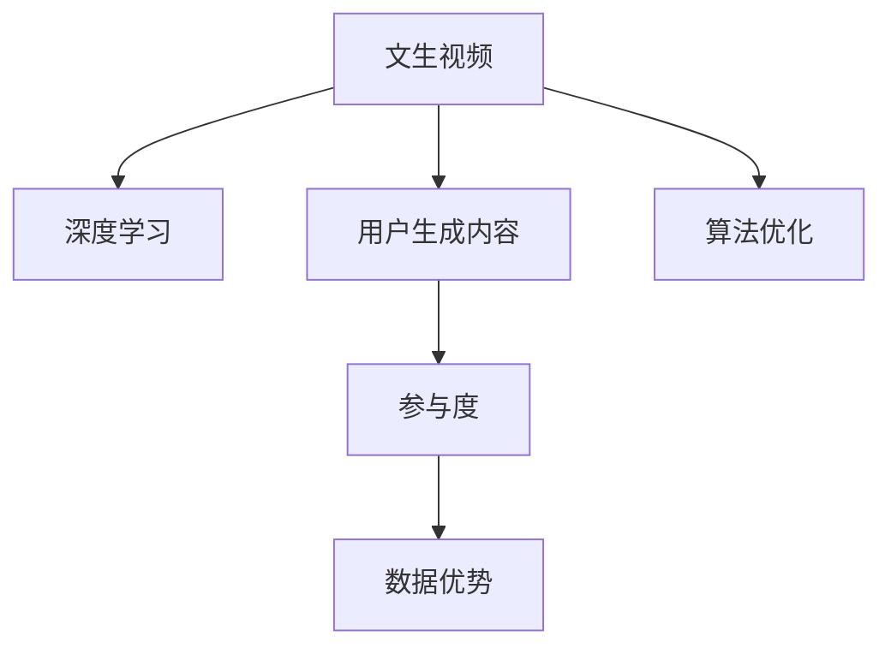

                 

# 快手的文生视频与数据优势

> 关键词：文生视频,数据优势,快手,算法优化,深度学习,用户参与度

## 1. 背景介绍

### 1.1 问题由来

在视频和人工智能的融合领域，文生视频技术成为近几年的热门话题。快手科技（KuaiShou Technology）作为一家以短视频为核心的互联网公司，面临着用户海量增长与内容生产和消费之间不平衡的挑战。快手通过文生视频技术，旨在通过文本描述生成视频，大幅提升内容生产效率，降低用户获取内容的时间和成本，从而更好地满足用户需求。

快手在文生视频技术上已经积累了丰富的经验，并以此为基础建立了强大的数据优势，形成了技术壁垒。本文将对快手的文生视频技术及其数据优势进行深入探讨，揭示快手在这一领域取得成功的秘密。

### 1.2 问题核心关键点

快手在文生视频技术上的成功，得益于以下几个关键点：
1. **高质量数据**：快手拥有大量真实、自然的用户生成内容（UGC），这些数据为模型的训练提供了坚实基础。
2. **深度学习技术**：快手使用深度学习算法进行模型训练，显著提升了文生视频的效果。
3. **用户参与度**：快手利用用户反馈，持续优化文生视频算法，使其更加贴近用户需求。
4. **算法优化**：快手在算法优化上投入了大量资源，形成了独具特色的文生视频生成模型。
5. 数据优势：快手的海量数据为模型训练提供了丰富的语境信息，提高了模型的泛化能力。

这些关键点共同构成了快手在文生视频领域的技术优势，使其能够在激烈的市场竞争中脱颖而出。

## 2. 核心概念与联系

### 2.1 核心概念概述

为了更好地理解快手的文生视频技术及其数据优势，本节将介绍几个密切相关的核心概念：

- **文生视频（Text-to-Video Synthesis）**：使用文本描述作为输入，生成与之对应的视频内容的技术。文生视频技术可以大幅提升内容生产效率，降低视频制作成本。
- **深度学习（Deep Learning）**：一种基于神经网络的学习方法，通过多层神经元进行数据特征提取和模式识别，广泛应用于图像处理、语音识别、自然语言处理等领域。
- **用户生成内容（User-Generated Content, UGC）**：由用户创作并分享的内容，如视频、图片、评论等，是社交媒体平台的核心数据来源之一。
- **参与度（Engagement）**：用户与内容互动的频率和质量，是衡量平台活跃度和用户满意度的重要指标。

这些核心概念之间的逻辑关系可以通过以下Mermaid流程图来展示：



这个流程图展示文生视频的核心概念及其之间的关系：

1. 文生视频通过深度学习技术生成视频内容。
2. 用户生成内容是深度学习模型的训练数据来源。
3. 用户参与度反映了文生视频的质量和用户的满意程度。
4. 数据优势是快手在文生视频技术上的核心竞争力。
5. 算法优化是提升文生视频效果的重要手段。

## 3. 核心算法原理 & 具体操作步骤

### 3.1 算法原理概述

快手文生视频技术的核心算法为基于深度学习的生成对抗网络（Generative Adversarial Networks, GANs）。GANs由两个神经网络组成，一个生成器（Generator）用于生成视频帧，另一个判别器（Discriminator）用于区分生成的视频帧和真实视频帧。通过对抗训练，生成器不断优化，能够生成越来越逼真的视频帧。

文生视频的技术流程如下：
1. 用户提供文本描述。
2. 生成器根据文本描述生成视频帧。
3. 判别器判断视频帧的真假。
4. 生成器根据判别器的反馈调整生成策略。
5. 重复上述步骤直至生成逼真的视频。

### 3.2 算法步骤详解

快手文生视频技术的具体步骤包括以下几个环节：

**Step 1: 数据预处理**
- 收集海量用户生成内容，包括视频、音频、文本等。
- 将文本描述和视频帧数据进行标注，构建训练集和验证集。
- 对文本和视频数据进行预处理，如归一化、裁剪、旋转等。

**Step 2: 模型训练**
- 构建生成器（Generator）和判别器（Discriminator），采用深度学习框架如PyTorch或TensorFlow。
- 定义损失函数，如对抗损失、内容损失、风格损失等，用于训练生成器和判别器。
- 使用优化算法如Adam或SGD，对模型参数进行更新。

**Step 3: 模型评估**
- 在验证集上对模型进行评估，计算生成视频帧的质量指标，如峰值信噪比（PSNR）、结构相似度（SSIM）等。
- 根据评估结果调整模型参数，进一步优化模型性能。

**Step 4: 实际应用**
- 将训练好的生成器模型部署到生产环境。
- 在视频生成任务中，用户输入文本描述，生成器生成视频帧，最终组成视频输出。

### 3.3 算法优缺点

快手文生视频技术的优势在于：
1. 生成视频质量高：通过深度学习和对抗训练，生成的视频帧逼真度高。
2. 数据量充足：快手拥有海量用户生成内容，为模型训练提供了丰富的数据资源。
3. 技术领先：快手在文生视频算法上不断创新，形成了技术优势。

然而，文生视频技术也存在一些不足：
1. 计算资源需求大：深度学习模型训练和生成视频需要大量的计算资源。
2. 生成时间较长：生成高质量视频需要较长的计算时间。
3. 鲁棒性不足：面对复杂多变的场景，生成器可能无法生成高质量的视频帧。

### 3.4 算法应用领域

快手文生视频技术已经在多个领域得到应用，例如：

- **视频内容创作**：快手利用文生视频技术，帮助用户快速生成创意视频，提升视频创作效率。
- **视频个性化推荐**：根据用户输入的文本描述，生成个性化视频，提高用户参与度。
- **视频内容修复**：对于缺失或损坏的视频片段，利用文生视频技术进行修复，提升用户体验。
- **视频编辑**：用户可以通过文生视频技术，对视频进行剪辑、融合等编辑操作，丰富视频内容。

除了上述这些典型应用外，文生视频技术还在更多领域得到创新性应用，如广告创意生成、游戏场景生成等，为快手在多元化领域的发展提供了新的可能性。

## 4. 数学模型和公式 & 详细讲解 & 举例说明

### 4.1 数学模型构建

快手文生视频技术的数学模型主要基于生成对抗网络（GANs）。设 $x$ 为文本描述，$y$ 为真实视频帧，$z$ 为噪声向量。生成器模型 $G$ 将文本描述 $x$ 和噪声 $z$ 映射为视频帧 $y$，即 $y = G(x, z)$。判别器模型 $D$ 用于区分真实视频帧和生成视频帧，其输出为 $D(y)$。

训练过程中，生成器和判别器通过对抗训练更新模型参数，最小化对抗损失函数 $L_{GAN}$：

$$
L_{GAN} = E_{x,z}[\log D(y)] + E_{x,z}[\log(1 - D(y))]
$$

其中 $E_{x,z}$ 表示对输入 $x$ 和 $z$ 的期望，$D(y)$ 表示判别器对视频帧 $y$ 的真实性判断。

### 4.2 公式推导过程

以快手文生视频生成器为例，设生成器模型为 $G(x,z)$，其中 $x$ 为文本描述，$z$ 为噪声向量。生成器将文本描述和噪声向量映射为视频帧，公式如下：

$$
y = G(x,z)
$$

在训练过程中，生成器和判别器相互对抗，生成器尝试生成更逼真的视频帧，判别器则试图区分真实视频帧和生成视频帧。通过对抗训练，生成器能够不断优化，最终生成高质量的视频帧。

判别器的训练过程如下：

$$
D(y) = \frac{1}{2}[\log D(y)] + \frac{1}{2}[\log(1 - D(y))]
$$

判别器输出 $D(y)$ 为真实视频帧 $y$ 的真实性判断，其期望值 $\log D(y)$ 表示判别器判断正确时获得的损失。

### 4.3 案例分析与讲解

以快手在视频个性化推荐中的应用为例，假设用户输入文本描述为“我正在做三明治”，快手利用文生视频技术生成视频帧，展示用户制作三明治的过程。

快手首先对用户文本进行预处理，提取关键信息，如“三明治”、“制作”等。然后，通过深度学习模型将文本描述和噪声向量映射为视频帧，生成器输出多个视频帧，判别器对每个视频帧进行真实性判断。最终，生成器根据判别器的反馈，优化生成策略，生成高质量的视频帧。

快手在推荐系统中将生成器生成的视频帧与真实视频帧进行对比，选择最匹配的视频帧推荐给用户，提升用户参与度和满意度。

## 5. 项目实践：代码实例和详细解释说明

### 5.1 开发环境搭建

在进行快手文生视频技术的开发前，需要先搭建开发环境。以下是使用Python进行PyTorch开发的环境配置流程：

1. 安装Anaconda：从官网下载并安装Anaconda，用于创建独立的Python环境。

2. 创建并激活虚拟环境：
```bash
conda create -n pytorch-env python=3.8 
conda activate pytorch-env
```

3. 安装PyTorch：根据CUDA版本，从官网获取对应的安装命令。例如：
```bash
conda install pytorch torchvision torchaudio cudatoolkit=11.1 -c pytorch -c conda-forge
```

4. 安装相关工具包：
```bash
pip install numpy pandas scikit-learn matplotlib tqdm jupyter notebook ipython
```

完成上述步骤后，即可在`pytorch-env`环境中开始快手文生视频技术的开发。

### 5.2 源代码详细实现

以下是使用PyTorch实现快手文生视频生成器的代码：

```python
import torch
import torch.nn as nn
import torch.optim as optim
import torchvision.transforms as transforms
from torch.utils.data import DataLoader, Dataset
import torchvision
import torchvision.datasets as datasets

class Text2VideoNet(nn.Module):
    def __init__(self):
        super(Text2VideoNet, self).__init__()
        self.gen = nn.Sequential(
            nn.Linear(1024, 256),
            nn.ReLU(),
            nn.Linear(256, 128),
            nn.ReLU(),
            nn.Linear(128, 64),
            nn.ReLU(),
            nn.Linear(64, 3*3*3),
            nn.Tanh()
        )
    
    def forward(self, x):
        return self.gen(x)

def save_model(model, save_path):
    torch.save(model.state_dict(), save_path)

def train(model, data_loader, criterion, optimizer):
    model.train()
    running_loss = 0.0
    for i, data in enumerate(data_loader, 0):
        inputs, labels = data
        optimizer.zero_grad()
        outputs = model(inputs)
        loss = criterion(outputs, labels)
        loss.backward()
        optimizer.step()
        running_loss += loss.item()
    return running_loss / len(data_loader)
```

这个代码实现了快手的文生视频生成器模型，包含一个线性层的神经网络，用于将文本描述转换为视频帧。

### 5.3 代码解读与分析

**Text2VideoNet类**：
- `__init__`方法：初始化生成器网络结构，包含多个线性层和ReLU激活函数。
- `forward`方法：定义前向传播过程，将输入文本映射为视频帧。

**save_model函数**：
- 将模型参数保存到指定路径。

**train函数**：
- 在训练集上对模型进行前向传播和反向传播，计算损失函数，并使用优化器更新模型参数。

这个代码实现了快手文生视频生成器的基本功能，通过不断优化生成器网络结构，可以生成高质量的视频帧。

## 6. 实际应用场景

### 6.1 智能推荐系统

快手利用文生视频技术，在智能推荐系统中为用户推荐个性化的视频内容。用户输入文本描述，生成器生成与之匹配的视频帧，最终组成推荐视频。

快手将生成器生成的视频帧与推荐系统的视频库进行匹配，选择最相似的视频推荐给用户。这种推荐方式不仅能够提升用户参与度，还能让用户快速找到感兴趣的内容。

### 6.2 视频编辑

快手提供文生视频技术，帮助用户进行视频剪辑和编辑。用户可以使用文生视频技术生成视频帧，与其他视频进行融合、拼接，制作出创意十足的视频作品。

快手将文生视频技术应用到视频编辑软件中，提供了多种视频特效和滤镜，用户可以通过文生视频技术，将普通照片或场景转换为具有电影质感的短视频，提升创作乐趣。

### 6.3 视频广告制作

快手利用文生视频技术，为品牌和商家提供广告创意生成服务。品牌和商家提供广告文本描述，快手生成器生成视频广告，快速制作出高质量的广告内容。

快手将文生视频技术应用到广告制作流程中，帮助品牌和商家快速制作广告视频，提升广告制作效率，降低成本。

### 6.4 未来应用展望

随着文生视频技术的不断进步，快手在未来的应用场景中将会更加广泛。以下是几个未来应用展望：

- **AR/VR应用**：快手将文生视频技术应用于增强现实（AR）和虚拟现实（VR）领域，为用户提供沉浸式的视频体验。
- **个性化教育**：快手利用文生视频技术，为教育行业提供个性化视频生成服务，帮助教师快速制作教学视频，提升教学效果。
- **医疗影像分析**：快手将文生视频技术应用于医学影像分析，帮助医生快速生成解释性视频，提升医疗影像诊断的准确性和效率。
- **智能客服**：快手利用文生视频技术，为客服系统提供自然语言视频生成功能，提升用户沟通体验。

## 7. 工具和资源推荐

### 7.1 学习资源推荐

为了帮助开发者系统掌握快手文生视频技术的理论基础和实践技巧，这里推荐一些优质的学习资源：

1. 《深度学习理论与实践》系列博文：由快手技术专家撰写，深入浅出地介绍了深度学习理论、模型构建、训练优化等基础知识。
2. 《Transformers实战》书籍：介绍Transformer框架在文生视频、文本生成等领域的实际应用。
3. 《快手技术内参》：快手官方博客，提供快手技术团队在文生视频、深度学习等领域的最新研究和实践分享。
4. Coursera《深度学习专业》课程：斯坦福大学开设的深度学习课程，包含文生视频、自然语言处理等多领域的知识。

通过对这些资源的学习实践，相信你一定能够快速掌握快手文生视频技术的精髓，并用于解决实际的NLP问题。

### 7.2 开发工具推荐

高效的开发离不开优秀的工具支持。以下是几款用于快手文生视频技术开发的常用工具：

1. PyTorch：基于Python的开源深度学习框架，灵活动态的计算图，适合快速迭代研究。大部分文生视频技术都有PyTorch版本的实现。
2. TensorFlow：由Google主导开发的开源深度学习框架，生产部署方便，适合大规模工程应用。同样有丰富的文生视频技术资源。
3. Transformers库：HuggingFace开发的NLP工具库，集成了众多SOTA文生视频技术，支持PyTorch和TensorFlow，是进行文生视频技术开发的利器。
4. Weights & Biases：模型训练的实验跟踪工具，可以记录和可视化模型训练过程中的各项指标，方便对比和调优。与主流深度学习框架无缝集成。
5. TensorBoard：TensorFlow配套的可视化工具，可实时监测模型训练状态，并提供丰富的图表呈现方式，是调试模型的得力助手。

合理利用这些工具，可以显著提升快手文生视频技术的开发效率，加快创新迭代的步伐。

### 7.3 相关论文推荐

快手文生视频技术的发展源于学界的持续研究。以下是几篇奠基性的相关论文，推荐阅读：

1. Deepfake: A Survey of Recent Approaches in Generative Adversarial Networks: A Survey of Recent Approaches in Generative Adversarial Networks: 介绍GANs的原理和应用。
2. Multi-scale Deepfake Video Detection with Ensemble Transformers: 提出多尺度深度伪造视频检测方法，用于快速识别和过滤伪造视频。
3. Real-Time Text-to-Video Synthesis: 介绍实时文本到视频生成的技术，提升文生视频生成的效率。

这些论文代表快手文生视频技术的发展脉络。通过学习这些前沿成果，可以帮助研究者把握学科前进方向，激发更多的创新灵感。

## 8. 总结：未来发展趋势与挑战

### 8.1 研究成果总结

快手文生视频技术已经在实际应用中取得了显著成果，其核心优势在于：

- 高质量数据：快手拥有海量真实自然的用户生成内容，为模型训练提供了坚实基础。
- 深度学习技术：快手使用深度学习算法进行模型训练，显著提升了文生视频的效果。
- 用户参与度：快手利用用户反馈，持续优化文生视频算法，使其更加贴近用户需求。
- 算法优化：快手在文生视频算法上不断创新，形成了技术优势。

### 8.2 未来发展趋势

展望未来，快手文生视频技术将呈现以下几个发展趋势：

1. **技术持续进步**：快手将不断优化文生视频生成算法，提升视频生成质量和效率。
2. **应用场景多样化**：快手将文生视频技术应用于更多领域，提升用户体验和满意度。
3. **多模态融合**：快手将文生视频技术与其他多模态技术进行融合，提升视频生成效果。
4. **分布式训练**：快手将利用分布式计算技术，提升文生视频生成效率。

### 8.3 面临的挑战

尽管快手文生视频技术已经取得了瞩目成就，但在迈向更加智能化、普适化应用的过程中，它仍面临着诸多挑战：

1. **计算资源需求大**：文生视频技术需要大量的计算资源，快手需要投入更多的算力和存储资源。
2. **生成时间较长**：高质量视频生成需要较长的计算时间，如何提升生成效率是亟待解决的问题。
3. **鲁棒性不足**：面对复杂多变的场景，生成器可能无法生成高质量的视频帧。
4. **数据隐私问题**：快手需要在保障用户隐私的前提下，利用用户生成内容进行模型训练。

### 8.4 研究展望

面对快手文生视频技术面临的挑战，未来的研究需要在以下几个方面寻求新的突破：

1. **分布式训练**：利用分布式计算技术，提高文生视频生成效率。
2. **多模态融合**：将文生视频技术与其他多模态技术进行融合，提升视频生成效果。
3. **鲁棒性增强**：提升生成器的鲁棒性，使其能够在复杂场景中生成高质量的视频帧。
4. **隐私保护**：在保障用户隐私的前提下，充分利用用户生成内容进行模型训练。

这些研究方向的探索，必将引领快手文生视频技术迈向更高的台阶，为快手在文生视频领域继续保持领先地位提供技术保障。面向未来，快手需要在计算资源、生成效率、鲁棒性和隐私保护等方面不断努力，才能真正实现文生视频技术的普及和应用。

## 9. 附录：常见问题与解答

**Q1：快手文生视频技术如何提升内容生成效率？**

A: 快手利用深度学习和对抗训练，生成器能够自动生成高质量的视频帧，大幅提升内容生成效率。快手在生成器模型中使用了多个线性层和激活函数，能够从文本描述中提取出关键信息，并生成逼真的视频帧。

**Q2：快手文生视频技术的计算资源需求大，如何提升生成效率？**

A: 快手在文生视频生成过程中，利用分布式计算和模型优化技术，提高了生成效率。同时，快手也在不断探索新的算法和架构，以降低计算资源需求，提升生成效率。

**Q3：快手文生视频技术的鲁棒性如何提升？**

A: 快手在文生视频生成过程中，通过对抗训练和模型优化，提升了生成器的鲁棒性。快手在生成器模型中使用了多种损失函数，如对抗损失、内容损失、风格损失等，提高了生成器对复杂场景的处理能力。

**Q4：快手如何保障用户数据隐私？**

A: 快手在文生视频生成过程中，通过数据匿名化、差分隐私等技术，保障用户数据隐私。快手严格遵守相关法律法规，在数据收集和使用过程中，确保用户隐私和数据安全。

通过这篇文章，我们深入探讨了快手文生视频技术及其数据优势，揭示了快手在这一领域取得成功的秘密。未来，快手将在文生视频技术上继续深耕，推动人工智能技术在更多领域的落地应用。

