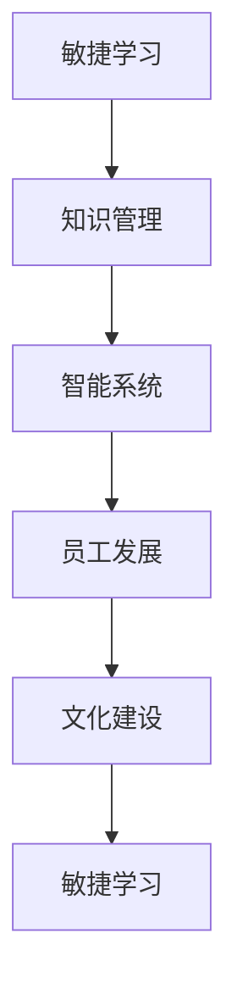

                 

## 1. 背景介绍

在快速变化的VUCA（volatile, uncertain, complex, ambiguous）时代，保持快速学习和适应环境的能力变得至关重要。数字化、自动化、人工智能（AI）等技术的飞速发展，不断重塑各行各业的商业模式、工作流程和组织结构，使企业在竞争中取胜更加依赖于敏捷的学习和创新的能力。

### 1.1 问题由来

近年来，随着全球科技的快速发展和信息技术的不断突破，企业面临的挑战和机遇都变得前所未有。传统的工作模式和思维范式已经不能适应快速变化的市场环境。如何在VUCA时代快速适应并抓住机遇，成为每一个企业都必须面对的问题。

企业需要快速学习新知识、新技术，并将其应用到实际业务中。然而，传统学习方式的局限性使得企业难以跟上时代的步伐。传统的学习模式，如定期培训、内部研讨会等，往往耗费大量时间和资源，且效果有限。因此，快速学习和适应变化的能力成为企业保持竞争力的关键。

### 1.2 问题核心关键点

快速学习，是指企业快速获取和应用新知识、新技术的过程。在VUCA时代，快速学习的关键在于：

- **敏捷响应**：企业必须能够快速响应市场变化，及时调整策略和行动。
- **知识创新**：企业需要持续创新，不断将新的知识和技能应用于产品和服务中。
- **组织弹性**：企业需要具备适应不同市场环境的弹性，能够在变化的环境中快速调整和优化。
- **文化适应**：企业需要营造一种开放、包容的文化，鼓励员工快速学习和适应。

### 1.3 问题研究意义

快速学习对于企业在VUCA时代的生存和发展具有重要意义：

- **提升竞争力**：快速学习使企业能够快速响应市场变化，提升市场竞争力。
- **降低风险**：通过持续学习和创新，企业能够降低因市场变化带来的风险。
- **驱动增长**：快速学习能够推动企业不断发现新机会，驱动业务增长。
- **培养人才**：快速学习能够培养员工的适应能力和创新精神，提升整体人才素质。

## 2. 核心概念与联系

### 2.1 核心概念概述

要深入理解快速学习，首先需要了解几个关键概念：

- **敏捷学习(Agile Learning)**：指在不断变化的环境中，快速获取、应用和创新知识的过程。
- **知识管理(Knowledge Management)**：通过有效的知识获取、整理、共享和使用，提升企业整体的创新能力和响应速度。
- **智能系统(Smart Systems)**：使用人工智能和大数据技术，实现知识的自动化获取和应用。
- **员工发展(Employee Development)**：通过持续培训和学习，提升员工的技能和知识水平。
- **文化建设(Cultural Development)**：营造一种鼓励创新、快速适应变化的企业文化。

这些概念之间相互关联，共同构成了快速学习的核心框架。

### 2.2 核心概念原理和架构的 Mermaid 流程图



这个流程图展示了敏捷学习与知识管理、智能系统、员工发展和文化建设之间的联系和反馈循环。

## 3. 核心算法原理 & 具体操作步骤

### 3.1 算法原理概述

快速学习的核心算法原理可以归纳为以下几点：

- **数据驱动**：通过数据分析和机器学习，快速获取和应用知识。
- **知识图谱**：构建企业内部和外部的知识图谱，方便知识的快速检索和应用。
- **学习路径规划**：通过算法推荐最合适的学习路径，提升学习效率。
- **迭代优化**：通过反馈机制，不断优化学习策略和内容。

### 3.2 算法步骤详解

以下是快速学习的详细操作步骤：

**Step 1: 数据收集与预处理**
- 收集内外部数据，包括市场数据、客户反馈、员工培训记录等。
- 对数据进行清洗、标注和预处理，确保数据的质量和可用性。

**Step 2: 数据建模与分析**
- 使用机器学习算法对数据进行建模，发现其中的规律和趋势。
- 通过数据可视化工具，将复杂的数据信息转化为易于理解的形式。

**Step 3: 知识图谱构建**
- 利用自然语言处理（NLP）技术，将数据转化为知识节点和关系。
- 构建企业内部的知识图谱，方便知识检索和应用。

**Step 4: 智能推荐系统设计**
- 设计智能推荐系统，根据员工的学习历史和偏好，推荐合适的学习内容。
- 使用协同过滤、基于内容的推荐算法等技术，提高推荐的准确性。

**Step 5: 学习路径规划**
- 根据学习需求和目标，规划最优的学习路径。
- 设计分阶段的学习计划，确保学习效果的最大化。

**Step 6: 学习效果评估**
- 通过学习效果评估，了解学习路径的有效性。
- 定期收集反馈，根据评估结果调整学习策略和内容。

### 3.3 算法优缺点

快速学习的优点包括：

- **高效性**：快速获取和应用知识，提升学习效率。
- **精准性**：通过数据分析和推荐算法，提高学习内容的精准度。
- **灵活性**：根据实时数据调整学习策略，适应市场变化。

缺点则包括：

- **成本高**：需要大量数据和算力支持，成本较高。
- **数据隐私**：数据收集和处理可能涉及隐私问题，需要严格管控。
- **算法复杂**：需要高水平的算法工程师和数据科学家支持。

### 3.4 算法应用领域

快速学习的应用领域非常广泛，包括但不限于：

- **产品创新**：快速获取市场和技术趋势，推动产品创新。
- **业务优化**：通过数据分析和反馈，优化业务流程和策略。
- **人才发展**：为员工提供个性化培训和发展路径，提升整体人才素质。
- **客户服务**：快速响应客户需求，提升客户满意度。
- **运营管理**：通过数据分析和优化，提升企业运营效率。

## 4. 数学模型和公式 & 详细讲解 & 举例说明

### 4.1 数学模型构建

快速学习的数学模型可以基于以下几个基本假设：

- **数据集**：记数据集为 $\mathcal{D}=\{(x_i,y_i)\}_{i=1}^N$，其中 $x_i$ 表示输入，$y_i$ 表示输出。
- **损失函数**：记损失函数为 $\mathcal{L}$，用于衡量模型预测与真实标签之间的差异。
- **优化算法**：记优化算法为 $\mathcal{A}$，用于更新模型参数以最小化损失函数。

### 4.2 公式推导过程

以回归任务为例，使用线性回归模型进行快速学习。模型预测值为 $\hat{y} = \theta^T x$，其中 $\theta$ 为模型参数，$x$ 为输入特征。假设损失函数为均方误差，即 $\mathcal{L}(\theta) = \frac{1}{N}\sum_{i=1}^N(y_i - \hat{y}_i)^2$。

使用梯度下降算法优化损失函数，得到：

$$
\theta \leftarrow \theta - \eta \nabla_{\theta}\mathcal{L}(\theta)
$$

其中 $\eta$ 为学习率。

### 4.3 案例分析与讲解

以客户满意度提升为例，使用快速学习技术进行分析。首先，收集客户反馈数据，对其进行预处理和标注。然后，构建客户满意度的数学模型，通过分析历史数据，发现影响客户满意度的关键因素。最后，使用推荐系统，根据客户历史行为和偏好，推荐相应的改进措施，提升客户满意度。

## 5. 项目实践：代码实例和详细解释说明

### 5.1 开发环境搭建

要实现快速学习，需要以下开发环境：

- **编程语言**：Python，支持NLP和机器学习库。
- **数据处理工具**：Pandas、NumPy，用于数据清洗和处理。
- **机器学习库**：Scikit-learn、TensorFlow、PyTorch，用于建模和训练。
- **自然语言处理库**：NLTK、SpaCy、Transformers，用于NLP任务处理。
- **数据可视化工具**：Matplotlib、Seaborn，用于数据可视化。

安装环境依赖后，即可开始快速学习项目。

### 5.2 源代码详细实现

以客户满意度提升为例，具体实现步骤如下：

```python
import pandas as pd
from sklearn.model_selection import train_test_split
from sklearn.linear_model import LinearRegression
from sklearn.metrics import mean_squared_error

# 数据预处理
data = pd.read_csv('customer_feedback.csv')
X = data[['feature1', 'feature2', 'feature3']]  # 特征
y = data['satisfaction']  # 满意度

# 数据分割
X_train, X_test, y_train, y_test = train_test_split(X, y, test_size=0.2, random_state=42)

# 模型训练
model = LinearRegression()
model.fit(X_train, y_train)

# 模型评估
y_pred = model.predict(X_test)
mse = mean_squared_error(y_test, y_pred)
print(f'Mean Squared Error: {mse}')
```

### 5.3 代码解读与分析

以上代码实现了基于线性回归的快速学习过程。首先，使用Pandas读取客户反馈数据，并进行特征提取。然后，使用Scikit-learn的train_test_split函数进行数据分割。接着，使用LinearRegression模型进行训练和评估，计算均方误差。最后，输出模型评估结果。

## 6. 实际应用场景

### 6.1 客户服务提升

客户服务是企业的重要组成部分，提升客户满意度是企业持续发展的关键。通过快速学习技术，企业可以实时分析客户反馈，快速响应客户需求，提升客户满意度。

**应用场景**：
- 实时监控客户反馈数据，分析客户满意度变化趋势。
- 根据分析结果，优化客户服务流程和策略。
- 使用推荐系统，推荐最合适的服务解决方案。

### 6.2 产品创新优化

产品创新是企业保持竞争力的重要手段。通过快速学习技术，企业可以快速获取市场和技术趋势，推动产品创新和优化。

**应用场景**：
- 分析市场数据和用户行为，发现产品改进的机会。
- 快速开发和测试新产品，提升产品竞争力。
- 使用A/B测试，评估新产品的效果，优化产品策略。

### 6.3 人才发展培训

人才是企业发展的核心竞争力。通过快速学习技术，企业可以提供个性化的培训和学习路径，提升员工的技能和知识水平。

**应用场景**：
- 分析员工绩效数据，识别技能和知识缺口。
- 设计个性化的培训方案，提升员工能力。
- 使用推荐系统，推荐最合适的学习资源。

### 6.4 未来应用展望

未来，快速学习技术将有以下发展趋势：

- **数据驱动**：基于大数据和机器学习，快速获取和应用知识。
- **智能推荐**：使用深度学习和自然语言处理技术，提升推荐的精准度。
- **多模态学习**：结合视觉、听觉等多模态数据，提升学习效果。
- **联邦学习**：在保证数据隐私的前提下，共享知识模型。
- **实时优化**：使用实时数据和反馈，不断优化学习策略。

## 7. 工具和资源推荐

### 7.1 学习资源推荐

以下是一些推荐的快速学习资源：

- **Coursera《数据科学和机器学习》课程**：涵盖了数据科学和机器学习的基础知识，适合快速学习技术入门。
- **Kaggle数据科学竞赛平台**：提供大量实际数据集和竞赛任务，通过实践提升技能。
- **Google AI的TensorFlow教程**：介绍了TensorFlow的使用方法和机器学习算法。
- **OpenAI的GPT-3文档**：了解最先进的自然语言处理技术和应用。
- **GitHub上的开源项目**：寻找和学习优秀的代码实现和算法模型。

### 7.2 开发工具推荐

以下是一些推荐的开发工具：

- **Jupyter Notebook**：交互式编程环境，支持代码编写、数据可视化。
- **PyTorch**：深度学习框架，支持动态图和GPU加速。
- **TensorFlow**：深度学习框架，支持静态图和分布式训练。
- **Scikit-learn**：机器学习库，提供丰富的算法和工具。
- **NLTK**：自然语言处理库，支持文本分析和处理。

### 7.3 相关论文推荐

以下是一些推荐的快速学习论文：

- **《快速学习：一种新的机器学习范式》**：提出快速学习的基本原理和算法。
- **《智能推荐系统》**：介绍推荐系统的基本概念和算法。
- **《深度学习》**：涵盖深度学习的基本知识和应用实例。
- **《知识图谱构建和应用》**：介绍知识图谱的基本概念和应用方法。

## 8. 总结：未来发展趋势与挑战

### 8.1 研究成果总结

快速学习技术在VUCA时代的企业中发挥了重要作用，提升了企业的学习效率和适应能力。通过数据驱动、智能推荐、知识图谱等技术，企业能够快速获取和应用新知识，推动业务创新和发展。

### 8.2 未来发展趋势

未来快速学习技术将呈现以下几个发展趋势：

- **数据量增大**：随着大数据技术的发展，企业能够获取更多高质量的数据，提升学习效果。
- **算法复杂化**：深度学习和自然语言处理技术的不断发展，将推动算法的复杂化和智能化。
- **多模态融合**：结合视觉、听觉等多模态数据，提升学习的全面性和精准度。
- **联邦学习**：在保证数据隐私的前提下，共享知识模型，提升学习效率。
- **实时优化**：使用实时数据和反馈，不断优化学习策略，适应快速变化的市场环境。

### 8.3 面临的挑战

快速学习技术在应用过程中也面临一些挑战：

- **数据隐私**：数据收集和处理可能涉及隐私问题，需要严格管控。
- **算法复杂**：需要高水平的算法工程师和数据科学家支持。
- **资源消耗**：大数据和深度学习模型需要大量的计算资源和时间。
- **模型可解释性**：复杂的深度学习模型往往缺乏可解释性，需要额外的解释工具。
- **模型鲁棒性**：模型对数据异常和噪声的鲁棒性需要进一步提升。

### 8.4 研究展望

未来快速学习技术需要在以下几个方面进行深入研究：

- **隐私保护**：开发隐私保护算法，确保数据安全和隐私保护。
- **模型解释性**：提升模型的可解释性，增强透明度和可理解性。
- **高效计算**：优化算法的计算效率，降低资源消耗。
- **多模态融合**：结合视觉、听觉等多模态数据，提升学习的全面性和精准度。
- **鲁棒性提升**：提高模型对数据异常和噪声的鲁棒性，增强模型的稳定性。

## 9. 附录：常见问题与解答

**Q1：快速学习如何提升企业竞争力？**

A: 快速学习通过数据分析和智能推荐，帮助企业快速获取和应用新知识，提升学习效率和创新能力。从而在快速变化的市场环境中保持竞争优势。

**Q2：快速学习面临哪些挑战？**

A: 快速学习面临数据隐私、算法复杂、资源消耗、模型可解释性和鲁棒性等方面的挑战。需要通过技术创新和算法优化来解决这些问题。

**Q3：如何快速学习新技能？**

A: 可以通过在线课程、实践项目、开源资源等方式快速学习新技能。使用智能推荐系统，根据个人兴趣和需求，推荐最合适的学习资源。

**Q4：如何构建企业内部的知识图谱？**

A: 使用自然语言处理技术，将企业内部的知识转化为知识图谱。通过构建知识节点和关系，方便知识的检索和应用。

**Q5：如何优化推荐系统的算法？**

A: 可以通过协同过滤、基于内容的推荐算法等技术，提高推荐的精准度。同时，结合实时数据和反馈，不断优化推荐策略。

通过深入理解快速学习的核心概念和算法原理，掌握其操作步骤，并结合实际应用场景，企业可以更好地应对VUCA时代的挑战，实现快速学习和创新发展。未来，随着技术的不断进步，快速学习将成为企业在快速变化的市场环境中保持竞争力的重要手段。

---

作者：禅与计算机程序设计艺术 / Zen and the Art of Computer Programming

