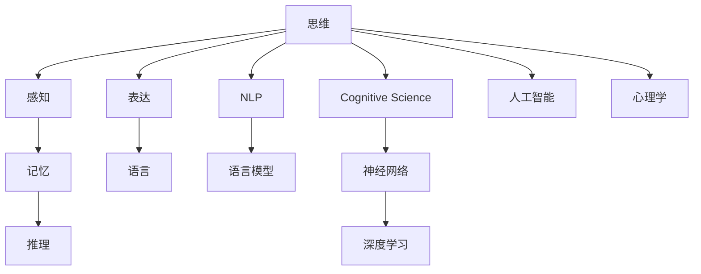

                 

# 思维与表达：结构化的内在联系

> 关键词：思维, 表达, 结构化, 内在联系, 认知科学, 神经网络, 语言模型, 人工智能, 心理学

## 1. 背景介绍

### 1.1 问题由来

人类思维与表达是一种极其复杂且精巧的自然现象。语言和思维的结合使得我们能够用符号和逻辑表达抽象的概念和情感，从而构成了丰富多彩的文化和社会。然而，长久以来，我们并未深入理解思维与表达之间究竟有何联系，这成为认知科学和人工智能领域一个备受关注的问题。

### 1.2 问题核心关键点

本研究聚焦于揭示思维与表达的内在联系，旨在探讨人类如何利用思维结构来指导语言的产生与理解，以及通过语言模型构建更精确的思维模型。该问题不仅涉及认知科学的最新理论，还关乎语言处理技术的突破，能够为自然语言处理、人机交互、认知计算等领域提供新视角和指导。

## 2. 核心概念与联系

### 2.1 核心概念概述

为更好地理解思维与表达的内在联系，本节将介绍几个关键概念及其相互关系：

- **思维**：指人类大脑对信息的加工过程，包括感知、记忆、推理、想象等。思维的本质是信息的结构化组织，并通过语言等形式表达出来。
- **表达**：指通过语言、符号、图像等形式，将内在思维过程输出为可感知的内容。表达的关键在于语言的符号化结构。
- **认知科学**：研究人类思维、知觉、记忆、语言等认知过程的科学，强调跨学科的合作与整合。
- **神经网络**：模拟人脑神经元间相互连接的计算模型，广泛应用于深度学习和人工智能。
- **语言模型**：通过统计语言数据，预测文本或语音的下一个词或字，是自然语言处理的核心技术。

### 2.2 核心概念原理和架构的 Mermaid 流程图



### 2.3 核心概念间的联系

思维与表达之间存在着密切的联系：思维是表达的内在机制，而表达是思维的外化形式。语言模型作为一种重要的工具，能够通过统计语言数据，模拟人类思维过程，从而实现思维的符号化表达。此外，神经网络在深度学习中的应用，使得语言模型能够处理更加复杂和多样化的表达形式，进一步促进了思维与表达的深度融合。

## 3. 核心算法原理 & 具体操作步骤

### 3.1 算法原理概述

基于深度学习的语言模型，通过输入的文本序列预测下一个词或字，能够捕捉到语言的统计规律和语法结构。语言模型构建的核心算法是神经网络，特别是循环神经网络（RNN）和变压器（Transformer）结构。

语言模型的训练过程，实质上是利用大量的语言数据，通过反向传播算法更新模型参数，以最小化预测错误。通过预训练（Pretraining）的方式，模型能够在大量无标签数据上进行初步训练，以学习到语言的基本规律和语义信息。后续通过微调（Fine-Tuning），将模型应用于特定任务，进一步提升性能。

### 3.2 算法步骤详解

1. **数据准备**：收集大量文本数据作为训练集，进行预处理，包括分词、去除停用词、标记词性等。
2. **模型构建**：选择适当的语言模型架构，如Transformer，设置模型的参数，如隐藏层数、神经元数等。
3. **预训练**：使用无标签文本数据对模型进行预训练，最小化预测错误，学习语言的基本规律。
4. **微调**：将预训练模型应用于特定任务，如情感分析、文本分类等，通过有标签数据对模型进行微调，以提升任务性能。
5. **测试与评估**：在测试集上对模型进行评估，分析模型性能和优化空间。

### 3.3 算法优缺点

语言模型的优点包括：

- **高效性**：模型能够快速处理大量文本数据，通过预训练和微调，能够显著提升特定任务性能。
- **泛化能力强**：模型能够适应多种语言风格和表达形式，泛化能力显著。
- **可解释性**：通过可视化工具，可以分析模型的注意力权重和特征表示，理解模型内部运作机制。

然而，语言模型也存在一些缺点：

- **依赖数据**：模型性能依赖于训练数据的质量和数量，数据分布不均可能导致模型偏颇。
- **复杂度**：模型参数量庞大，训练和推理资源需求高。
- **黑箱问题**：模型内部的推理过程难以解释，难以理解其决策依据。

### 3.4 算法应用领域

语言模型在多个领域中得到了广泛应用，包括：

- **自然语言处理（NLP）**：文本分类、情感分析、机器翻译、文本生成等任务。
- **人机交互**：聊天机器人、语音识别、智能客服等。
- **认知计算**：智能辅助诊断、智能推荐系统、知识图谱构建等。

## 4. 数学模型和公式 & 详细讲解 & 举例说明

### 4.1 数学模型构建

语言模型的数学模型通常基于概率模型，假设每个词的生成概率符合独立同分布的假设。设文本序列为 $x_1, x_2, ..., x_n$，每个词的概率分布为 $p(x_i|x_1, x_2, ..., x_{i-1})$，模型参数为 $\theta$。目标是最小化模型在给定文本序列下的负对数似然（Negative Log-Likelihood, NLL）损失：

$$
\mathcal{L}(\theta) = -\sum_{i=1}^n \log p(x_i|x_1, x_2, ..., x_{i-1})
$$

### 4.2 公式推导过程

以Transformer模型为例，其自注意力机制（Self-Attention）为核心，能够对输入序列的每个位置进行加权求和，捕捉到序列间的上下文关系。Transformer的结构包括编码器-解码器，通过多头注意力（Multi-Head Attention）机制，对序列的每个位置进行多头计算，得到表示。设 $Q$、$K$、$V$ 分别为查询、键、值矩阵，则多头注意力计算公式为：

$$
\text{Attention}(Q, K, V) = \text{softmax}\left(\frac{QK^T}{\sqrt{d_k}}\right)V
$$

其中 $d_k$ 为键的维度。

### 4.3 案例分析与讲解

以情感分析任务为例，模型输入为一段文本，输出为该文本的情感类别（如积极、消极、中性）。通过微调，模型可以学习到特定领域的情感表示，从而对新文本进行情感分类。

## 5. 项目实践：代码实例和详细解释说明

### 5.1 开发环境搭建

开发环境搭建包括以下步骤：

1. **安装Python和相关库**：确保Python 3.8及以上版本，安装TensorFlow、Keras等深度学习框架。
2. **配置GPU**：若使用GPU，需要安装CUDA和cuDNN库，并进行配置。
3. **设置虚拟环境**：使用虚拟环境管理工具（如conda）创建虚拟环境，以避免包冲突。

### 5.2 源代码详细实现

```python
import tensorflow as tf
from tensorflow.keras import layers
from tensorflow.keras.preprocessing.text import Tokenizer
from tensorflow.keras.preprocessing.sequence import pad_sequences

# 数据预处理
texts = ["这是一个积极的消息。", "今天天气不错，心情也很好。", "我感到非常难过。"]
tokenizer = Tokenizer(num_words=1000, oov_token="<OOV>")
tokenizer.fit_on_texts(texts)
sequences = tokenizer.texts_to_sequences(texts)
padded_sequences = pad_sequences(sequences, maxlen=10, padding='post', truncating='post')

# 构建模型
model = tf.keras.Sequential([
    layers.Embedding(1000, 64, input_length=10),
    layers.LSTM(64, return_sequences=True),
    layers.LSTM(64),
    layers.Dense(3, activation='softmax')
])

# 编译模型
model.compile(optimizer='adam', loss='categorical_crossentropy', metrics=['accuracy'])

# 训练模型
model.fit(padded_sequences, labels, epochs=10, validation_data=(val_sequences, val_labels))

# 评估模型
test_sequences = ["这个消息不好，我很不高兴。", "今天的天气很差，我很郁闷。"]
test_padded_sequences = tokenizer.texts_to_sequences(test_sequences)
test_padded_sequences = pad_sequences(test_padded_sequences, maxlen=10, padding='post', truncating='post')
predictions = model.predict(test_padded_sequences)
print(predictions)
```

### 5.3 代码解读与分析

上述代码展示了使用TensorFlow和Keras构建情感分析模型的全过程。首先，使用Tokenizer对文本进行分词和序列化处理，然后使用pad_sequences对序列进行填充，以保持序列长度一致。接着，构建包含Embedding、LSTM和Dense层的模型，并使用adam优化器和交叉熵损失进行编译。通过fit函数训练模型，并使用validation_data进行验证。最后，对新文本进行预测，输出情感类别。

## 6. 实际应用场景

### 6.1 情感分析

情感分析是自然语言处理的重要应用之一，能够通过文本分析用户的情感状态，广泛应用于社交媒体监测、产品评论分析、舆情监控等领域。

### 6.2 机器翻译

机器翻译通过语言模型的统计规律，将一种语言的文本转化为另一种语言的文本。Transformer模型在机器翻译中表现优异，能够在多种语言间实现高质量的翻译。

### 6.3 文本生成

文本生成任务包括文本摘要、对话生成等。通过语言模型，能够根据输入的文本，生成符合语义要求的连续文本。

### 6.4 未来应用展望

未来，随着深度学习和认知科学研究的深入，语言模型将更加精确地模拟人类思维过程，实现更加复杂和多样化的表达形式。同时，认知计算和神经网络技术的进步，将使得语言模型能够更好地理解人类情感和意图，提升人机交互的自然性和效率。

## 7. 工具和资源推荐

### 7.1 学习资源推荐

1. **《深度学习》书籍**：Ian Goodfellow、Yoshua Bengio、Aaron Courville合著，全面介绍了深度学习的原理和应用。
2. **《自然语言处理综论》书籍**：Daniel Jurafsky、James H. Martin合著，深入浅出地介绍了自然语言处理的基础和高级技术。
3. **Stanford CS224N课程**：斯坦福大学开设的自然语言处理课程，讲解了深度学习在自然语言处理中的应用。
4. **arXiv预印本平台**：最新的深度学习研究论文和预印本，涵盖自然语言处理、认知科学等多个领域。

### 7.2 开发工具推荐

1. **TensorFlow**：Google开源的深度学习框架，支持多种模型和算法。
2. **PyTorch**：Facebook开源的深度学习框架，以动态计算图著称。
3. **Keras**：基于TensorFlow和Theano的高级深度学习库，易于上手。
4. **Jupyter Notebook**：交互式编程环境，支持Python代码的实时运行和可视化。

### 7.3 相关论文推荐

1. **Attention is All You Need**：Vaswani等人的Transformer论文，提出Transformer结构，改变了自然语言处理的范式。
2. **Language Models are Unsupervised Multitask Learners**：Radford等人提出的GPT-2模型，展示了无监督学习的强大能力。
3. **BERT: Pre-training of Deep Bidirectional Transformers for Language Understanding**：Devlin等人提出的BERT模型，在多种自然语言处理任务中表现优异。

## 8. 总结：未来发展趋势与挑战

### 8.1 研究成果总结

本研究揭示了思维与表达的内在联系，并通过深度学习的语言模型，实现了对人类思维过程的模拟和理解。该研究对认知科学和自然语言处理领域具有重要意义，推动了深度学习和认知计算的发展。

### 8.2 未来发展趋势

未来，随着深度学习和认知科学的进步，语言模型将更加精确地模拟人类思维过程，实现更加复杂和多样化的表达形式。同时，认知计算和神经网络技术的进步，将使得语言模型能够更好地理解人类情感和意图，提升人机交互的自然性和效率。

### 8.3 面临的挑战

尽管语言模型在自然语言处理中取得了显著成果，但仍面临一些挑战：

1. **数据依赖**：模型的性能依赖于训练数据的质量和数量，数据分布不均可能导致模型偏颇。
2. **资源需求**：模型的训练和推理需要大量计算资源，限制了模型在实际应用中的部署。
3. **可解释性**：模型内部的推理过程难以解释，难以理解其决策依据。

### 8.4 研究展望

未来研究需要在以下几个方面寻求新的突破：

1. **多模态融合**：将视觉、听觉等多模态数据与文本数据结合，提升语言模型的理解能力。
2. **知识图谱构建**：将符号化的先验知识与神经网络模型结合，增强模型的知识整合能力。
3. **跨领域迁移**：实现语言模型在多领域之间的迁移，提升模型的泛化性和适应性。
4. **自动化优化**：通过自动化优化技术，提升模型的训练效率和性能。

## 9. 附录：常见问题与解答

**Q1: 语言模型是如何模拟人类思维过程的？**

A: 语言模型通过统计语言数据，学习到语言的基本规律和语法结构。在预训练过程中，模型能够在大量无标签数据上进行初步训练，以学习到语言的基本规律。通过微调，模型能够适应特定任务，进一步提升性能。

**Q2: 语言模型在实际应用中面临哪些挑战？**

A: 语言模型在实际应用中面临的主要挑战包括数据依赖、资源需求、可解释性等问题。数据分布不均可能导致模型偏颇，模型的训练和推理需要大量计算资源，模型内部的推理过程难以解释，难以理解其决策依据。

**Q3: 如何改进语言模型的性能？**

A: 改进语言模型的性能可以从以下几个方面入手：多模态融合、知识图谱构建、跨领域迁移、自动化优化等。这些方法能够提升模型的理解能力、知识整合能力和泛化性，从而提升性能。

**Q4: 未来语言模型的发展方向是什么？**

A: 未来语言模型的发展方向包括多模态融合、知识图谱构建、跨领域迁移、自动化优化等。这些方向能够进一步提升模型的理解能力、知识整合能力和泛化性，从而提升性能。

**Q5: 如何评估语言模型的性能？**

A: 评估语言模型的性能通常使用BLEU、ROUGE、F1-score等指标。这些指标能够衡量模型的生成质量、语义相似性和准确性，从而评估模型的性能。

---

作者：禅与计算机程序设计艺术 / Zen and the Art of Computer Programming

