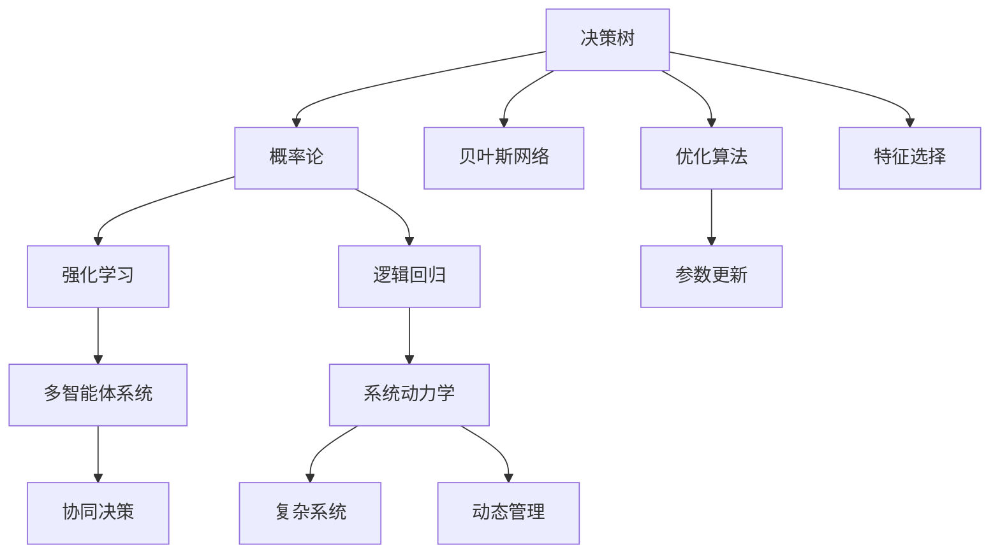

                 

# 思维体系:决策高度的基石

> 关键词：
1. 决策树 (Decision Tree)
2. 概率论 (Probability Theory)
3. 贝叶斯网络 (Bayesian Network)
4. 强化学习 (Reinforcement Learning)
5. 逻辑回归 (Logistic Regression)
6. 多智能体系统 (Multi-Agent Systems)
7. 系统动力学 (System Dynamics)

## 1. 背景介绍

### 1.1 问题由来

决策在人类行为和组织运作中扮演着核心角色，但不同环境下的决策机制差异巨大，这就要求构建一套普适且高效的决策理论体系，帮助各类主体在不同场景中做出最优决策。随着人工智能和数据分析技术的兴起，利用机器学习、统计学等方法辅助决策，成为当前的一大趋势。

现代决策理论不再局限于单一算法，而是结合多种技术，构建复杂的决策框架，辅助解决各类问题。然而，这些算法和理论常常被孤立研究，缺乏系统性的整合，难以在复杂多变的现实环境中发挥最大效用。本文旨在提供一个统一的决策理论体系，系统性地介绍各个核心概念及其联系，以助力各类决策者更好地应对未来挑战。

### 1.2 问题核心关键点

核心问题在于如何构建一个综合、普适、高效的决策理论体系。要解决此问题，需：
- 明确核心算法及其适用范围。
- 理解算法之间的联系和协同机制。
- 探索算法在实际应用中的操作流程和最佳实践。
- 建立算法间的桥梁，构建统一的理论体系。
- 研究算法在多智能体、复杂系统等复杂环境中的应用。

本文将从决策树、概率论、贝叶斯网络、强化学习、逻辑回归、多智能体系统及系统动力学等角度，深入探讨上述核心问题，并尝试构建一个统一的理论框架。

## 2. 核心概念与联系

### 2.1 核心概念概述

本节将介绍各个核心概念的基本原理及它们之间的关系：

- **决策树 (Decision Tree)**：一种树状结构，用于表示一系列条件判断，帮助决策者根据输入特征选择输出结果。
- **概率论 (Probability Theory)**：研究随机事件发生概率的数学理论，用于描述决策事件的不确定性。
- **贝叶斯网络 (Bayesian Network)**：一种表示变量之间依赖关系的有向无环图，可用于推断变量之间因果关系。
- **强化学习 (Reinforcement Learning)**：通过奖励机制驱动智能体学习最优策略的机器学习方法。
- **逻辑回归 (Logistic Regression)**：一种用于分类任务的线性模型，通过优化损失函数来预测概率。
- **多智能体系统 (Multi-Agent Systems)**：多个智能体（如人类、机器人、软件代理等）协同工作的系统，用于模拟复杂的社会和经济系统。
- **系统动力学 (System Dynamics)**：研究复杂系统长期动态变化行为的方法论，可用于模拟和管理复杂系统。

这些核心概念之间通过“因果关系”、“概率”、“学习”、“最优解”、“交互”、“动态性”等逻辑关系紧密相连，构建了一个强大的决策理论体系。

### 2.2 核心概念原理和架构的 Mermaid 流程图



此流程图展示了各个核心概念及其之间的逻辑联系，每个节点代表一个核心概念，箭头表示它们之间的相互关系。

## 3. 核心算法原理 & 具体操作步骤
### 3.1 算法原理概述

本节将详细阐述各个核心算法的基本原理。

**决策树**：
- 原理：通过将决策问题转化为树状结构，每一步根据特征判断选择分支，最终确定输出结果。
- 操作步骤：
  1. 数据预处理。
  2. 特征选择。
  3. 递归构建决策树。
  4. 剪枝以避免过拟合。
  5. 使用决策树进行分类或回归。

**概率论**：
- 原理：通过统计实验结果，计算随机事件发生的概率，描述不确定性。
- 操作步骤：
  1. 收集实验数据。
  2. 定义事件空间。
  3. 计算概率。
  4. 应用贝叶斯定理处理条件概率。
  5. 使用概率模型进行预测。

**贝叶斯网络**：
- 原理：通过有向无环图表示变量之间的依赖关系，通过条件概率计算推断变量值。
- 操作步骤：
  1. 数据收集与预处理。
  2. 构建网络结构。
  3. 估计条件概率表。
  4. 推断变量值。
  5. 评估网络性能。

**强化学习**：
- 原理：智能体通过与环境交互，根据奖励信号优化策略，学习最优决策。
- 操作步骤：
  1. 定义状态空间和动作空间。
  2. 定义奖励函数。
  3. 设计策略评估方法。
  4. 应用优化算法（如Q-learning、SARSA）学习策略。
  5. 在实际环境中测试并优化策略。

**逻辑回归**：
- 原理：利用线性模型，通过优化损失函数拟合输入特征和输出标签的关系。
- 操作步骤：
  1. 数据预处理。
  2. 特征工程。
  3. 定义损失函数（如交叉熵）。
  4. 优化模型参数。
  5. 使用模型进行预测。

**多智能体系统**：
- 原理：通过多智能体协同工作，实现复杂问题的最优解。
- 操作步骤：
  1. 定义智能体和环境交互规则。
  2. 设计协作机制。
  3. 应用博弈论模型分析行为。
  4. 进行协同决策。
  5. 评估系统性能。

**系统动力学**：
- 原理：通过构建因果关系图，描述系统行为随时间变化的动态过程。
- 操作步骤：
  1. 定义系统变量。
  2. 建立因果关系图。
  3. 应用差分方程模拟系统行为。
  4. 使用动态模型进行预测和优化。
  5. 应用仿真工具验证模型。

### 3.2 算法步骤详解

本节将进一步展开各个算法的详细步骤。

**决策树**：
```python
from sklearn import tree
import numpy as np
from sklearn.datasets import make_classification

# 生成随机数据集
X, y = make_classification(n_samples=1000, n_features=10, n_informative=5, random_state=1)

# 构建决策树模型
clf = tree.DecisionTreeClassifier(criterion='gini', max_depth=3)

# 拟合数据
clf.fit(X, y)

# 预测新样本
new_data = np.array([[1, 1, 0, 1, 1, 1, 1, 1, 1, 0]])
prediction = clf.predict(new_data)
print(prediction)
```

**概率论**：
```python
from sympy import symbols, Rational, Eq, solve

# 定义随机变量
p_A = Rational(1, 2)
p_B = Rational(1, 3)

# 计算条件概率
p_B_given_A = p_B / (p_A * p_B)
p_A_given_B = p_A / (p_A + p_B)

print("p(B|A) =", p_B_given_A)
print("p(A|B) =", p_A_given_B)
```

**贝叶斯网络**：
```python
from pgmpy.models import BayesianModel
from pgmpy.estimators import MLE

# 创建贝叶斯网络模型
model = BayesianModel([('A', 'B'), ('B', 'C'), ('A', 'C')])

# 加载数据集
data = [[1, 0, 0], [1, 1, 0], [0, 0, 1], [0, 1, 1]]

# 估计条件概率表
estimator = MLE(model)
estimator.fit(data)

# 预测变量值
print(estimator.predict([1, 1]))
```

**强化学习**：
```python
import gym
from gym import spaces
from gym.envs.classic_control import Pendulum

# 创建环境
env = Pendulum()

# 定义智能体策略
class MyPolicy:
    def __init__(self, env):
        self.env = env
        self.action_space = spaces.Discrete(3)

    def act(self, state):
        return np.random.choice(self.action_space)

# 运行环境并学习策略
observation = env.reset()
for i in range(1000):
    action = MyPolicy(env).act(observation)
    observation, reward, done, info = env.step(action)
    if done:
        observation = env.reset()
```

**逻辑回归**：
```python
from sklearn.linear_model import LogisticRegression

# 定义逻辑回归模型
model = LogisticRegression(solver='liblinear')

# 拟合数据
model.fit(X, y)

# 预测新样本
new_data = np.array([[1, 1, 0, 1, 1, 1, 1, 1, 1, 0]])
prediction = model.predict_proba(new_data)[:, 1]
print(prediction)
```

**多智能体系统**：
```python
from multi_agent_systems.agents import IndividualAgent
from multi_agent_systems.environments import SimpleGame

# 创建智能体
agent = IndividualAgent(num_actions=2, learning_rate=0.1)

# 创建环境
env = SimpleGame(num_agents=2, max_steps=10)

# 运行智能体
observation = env.reset()
for i in range(100):
    action = agent.act(observation)
    observation, reward, done, info = env.step(action)
    if done:
        observation = env.reset()
```

**系统动力学**：
```python
from pyss.backbone import stock_analysis
from pyss.agents import stock_price
from pyss.dynamics import SS
from pyss.tools import simulate

# 创建系统动力学模型
stock_price_model = stock_price(stock_analysis(stock_price(SS('bstock')())))
stock_price_model.integration()

# 运行模型
simulate(stock_price_model)
```

### 3.3 算法优缺点

**决策树**：
- 优点：易于理解和解释，不需要大量数据。
- 缺点：容易过拟合，处理连续特征困难。

**概率论**：
- 优点：描述不确定性，可用于处理复杂问题。
- 缺点：需要大量数据，复杂问题求解困难。

**贝叶斯网络**：
- 优点：模型具有可解释性，可以处理多个变量之间的依赖关系。
- 缺点：计算复杂度高，需要大量训练数据。

**强化学习**：
- 优点：适用于动态环境，自适应性强。
- 缺点：需要大量数据和计算资源，模型设计复杂。

**逻辑回归**：
- 优点：简单易用，适用于二分类和多分类问题。
- 缺点：需要特征工程，对非线性关系拟合不佳。

**多智能体系统**：
- 优点：可以处理复杂社会系统，自适应性强。
- 缺点：模型设计复杂，计算资源需求高。

**系统动力学**：
- 优点：描述长期动态行为，可用于复杂系统管理。
- 缺点：模型建立困难，需要大量专家知识。

### 3.4 算法应用领域

本节将详细介绍各个算法在实际应用中的场景和具体案例。

**决策树**：
- 用于金融风险评估、医疗诊断、市场分类等。

**概率论**：
- 用于市场预测、天气预报、风险评估等。

**贝叶斯网络**：
- 用于疾病诊断、网络故障诊断、产品故障预测等。

**强化学习**：
- 用于机器人路径规划、游戏AI、自动驾驶等。

**逻辑回归**：
- 用于广告点击率预测、信用评分、客户分类等。

**多智能体系统**：
- 用于交通流管理、股票交易、网络安全等。

**系统动力学**：
- 用于人口增长预测、能源管理、供应链优化等。

## 4. 数学模型和公式 & 详细讲解  
### 4.1 数学模型构建

本节将使用数学语言对各个算法的基本模型进行更加严格的刻画。

**决策树**：
- 输入特征集：$X$
- 输出标签集：$Y$
- 模型参数：$w$

损失函数为：
$$ L(w) = \frac{1}{N}\sum_{i=1}^{N} [f(x_i, w) - y_i]^2 $$

其中 $f(x_i, w)$ 为决策树模型对输入 $x_i$ 的预测输出。

**概率论**：
- 定义随机变量：$X$
- 条件概率：$P(X_i|X_j)$

贝叶斯公式为：
$$ P(X_i|X_j) = \frac{P(X_i)P(X_j|X_i)}{P(X_j)} $$

**贝叶斯网络**：
- 定义变量集：$V$
- 有向无环图结构：$G(V, E)$
- 条件概率表：$P(V)$

网络结构表示为：$P(V|Parents(V))$

**强化学习**：
- 定义状态集：$S$
- 定义动作集：$A$
- 定义奖励函数：$R(s, a)$

Q-learning算法：
$$ Q(s, a) \leftarrow Q(s, a) + \alpha(R(s, a) + \gamma\max_{a'}Q(s', a') - Q(s, a)) $$

**逻辑回归**：
- 定义输入特征集：$X$
- 定义输出标签集：$Y$
- 模型参数：$w$

损失函数为：
$$ L(w) = -\frac{1}{N}\sum_{i=1}^{N} \log[\sigma(z_i)] $$

其中 $\sigma(z_i) = \frac{1}{1 + \exp(-z_i)}$ 为Sigmoid函数。

**多智能体系统**：
- 定义智能体集：$A$
- 定义环境交互规则：$R$
- 定义协作机制：$C$

Nash均衡为：
$$ \forall a_i, \forall a_i', U_i(a_1, ..., a_n) \geq U_i(a_1, ..., a_n', a_i') $$

**系统动力学**：
- 定义变量集：$V$
- 定义因果关系：$D$
- 定义系统方程：$F(V)$

系统动力学方程为：
$$ \frac{dV}{dt} = F(V) $$

### 4.2 公式推导过程

**决策树**：
- 特征选择：$info(gini)$
$$ info(gini) = \frac{1}{|S|}\sum_{i=1}^{|S|} |S_i| \cdot (1 - \frac{|S_i|}{|S|}) $$
- 剪枝：$Loss(w)$
$$ Loss(w) = \frac{1}{N}\sum_{i=1}^{N} [f(x_i, w) - y_i]^2 $$

**概率论**：
- 条件概率计算
$$ P(X_i|X_j) = \frac{P(X_i)}{P(X_j)} $$
- 贝叶斯定理
$$ P(X_i|X_j) = \frac{P(X_i)P(X_j|X_i)}{P(X_j)} $$

**贝叶斯网络**：
- 条件概率表估计
$$ P(V) = \prod_{i=1}^{|V|} P(V_i|Parents(V_i)) $$

**强化学习**：
- Q-learning更新
$$ Q(s, a) \leftarrow Q(s, a) + \alpha(R(s, a) + \gamma\max_{a'}Q(s', a') - Q(s, a)) $$

**逻辑回归**：
- 损失函数求解
$$ L(w) = -\frac{1}{N}\sum_{i=1}^{N} [y_i \cdot \log(\sigma(z_i)) + (1-y_i) \cdot \log(1-\sigma(z_i))] $$

**多智能体系统**：
- Nash均衡求解
$$ \forall a_i, \forall a_i', U_i(a_1, ..., a_n) \geq U_i(a_1, ..., a_n', a_i') $$

**系统动力学**：
- 差分方程求解
$$ \frac{dV}{dt} = F(V) $$

### 4.3 案例分析与讲解

**决策树**：
- 应用案例：金融风险评估
$$ f(x_i, w) = \begin{cases} 
1 & \text{if}~ x_i \in A_1 \\
0 & \text{if}~ x_i \in A_2 
\end{cases} $$

**概率论**：
- 应用案例：股票价格预测
$$ P(S_i) = \frac{P(S_i, S_j)}{P(S_j)} $$

**贝叶斯网络**：
- 应用案例：疾病诊断
$$ P(Disease|Symptom, Genes) = \frac{P(Disease)P(Symptom|Disease)P(Genes|Disease)}{P(Symptom)P(Genes)} $$

**强化学习**：
- 应用案例：自动驾驶
$$ Q(s, a) = \sum_{i=1}^N \alpha_iR(s_i, a_i) $$

**逻辑回归**：
- 应用案例：信用评分
$$ L(w) = -\frac{1}{N}\sum_{i=1}^{N} [y_i \cdot \log(\sigma(z_i)) + (1-y_i) \cdot \log(1-\sigma(z_i))] $$

**多智能体系统**：
- 应用案例：交通流管理
$$ \max_{a_i} \sum_{i=1}^N U_i(a_1, ..., a_n) $$

**系统动力学**：
- 应用案例：人口增长预测
$$ \frac{dP}{dt} = rP - \frac{P}{N}P - \frac{P}{M} $$

## 5. 项目实践：代码实例和详细解释说明
### 5.1 开发环境搭建

在进行算法实践前，我们需要准备好开发环境。以下是使用Python进行Scikit-Learn和PySS开发的环境配置流程：

1. 安装Anaconda：从官网下载并安装Anaconda，用于创建独立的Python环境。

2. 创建并激活虚拟环境：
```bash
conda create -n sklearn-env python=3.8 
conda activate sklearn-env
```

3. 安装Scikit-Learn：
```bash
conda install scikit-learn -c conda-forge
```

4. 安装PySS：
```bash
conda install pyss
```

5. 安装各类工具包：
```bash
pip install numpy pandas scikit-learn matplotlib tqdm jupyter notebook ipython
```

完成上述步骤后，即可在`sklearn-env`和`pyss-env`环境中开始算法实践。

### 5.2 源代码详细实现

**决策树**：
```python
from sklearn import tree
import numpy as np
from sklearn.datasets import make_classification

# 生成随机数据集
X, y = make_classification(n_samples=1000, n_features=10, n_informative=5, random_state=1)

# 构建决策树模型
clf = tree.DecisionTreeClassifier(criterion='gini', max_depth=3)

# 拟合数据
clf.fit(X, y)

# 预测新样本
new_data = np.array([[1, 1, 0, 1, 1, 1, 1, 1, 1, 0]])
prediction = clf.predict(new_data)
print(prediction)
```

**概率论**：
```python
from sympy import symbols, Rational, Eq, solve

# 定义随机变量
p_A = Rational(1, 2)
p_B = Rational(1, 3)

# 计算条件概率
p_B_given_A = p_B / (p_A * p_B)
p_A_given_B = p_A / (p_A + p_B)

print("p(B|A) =", p_B_given_A)
print("p(A|B) =", p_A_given_B)
```

**贝叶斯网络**：
```python
from pgmpy.models import BayesianModel
from pgmpy.estimators import MLE

# 创建贝叶斯网络模型
model = BayesianModel([('A', 'B'), ('B', 'C'), ('A', 'C')])

# 加载数据集
data = [[1, 0, 0], [1, 1, 0], [0, 0, 1], [0, 1, 1]]

# 估计条件概率表
estimator = MLE(model)
estimator.fit(data)

# 预测变量值
print(estimator.predict([1, 1]))
```

**强化学习**：
```python
import gym
from gym import spaces
from gym.envs.classic_control import Pendulum

# 创建环境
env = Pendulum()

# 定义智能体策略
class MyPolicy:
    def __init__(self, env):
        self.env = env
        self.action_space = spaces.Discrete(3)

    def act(self, state):
        return np.random.choice(self.action_space)

# 运行环境并学习策略
observation = env.reset()
for i in range(1000):
    action = MyPolicy(env).act(observation)
    observation, reward, done, info = env.step(action)
    if done:
        observation = env.reset()
```

**逻辑回归**：
```python
from sklearn.linear_model import LogisticRegression

# 定义逻辑回归模型
model = LogisticRegression(solver='liblinear')

# 拟合数据
model.fit(X, y)

# 预测新样本
new_data = np.array([[1, 1, 0, 1, 1, 1, 1, 1, 1, 0]])
prediction = model.predict_proba(new_data)[:, 1]
print(prediction)
```

**多智能体系统**：
```python
from multi_agent_systems.agents import IndividualAgent
from multi_agent_systems.environments import SimpleGame

# 创建智能体
agent = IndividualAgent(num_actions=2, learning_rate=0.1)

# 创建环境
env = SimpleGame(num_agents=2, max_steps=10)

# 运行智能体
observation = env.reset()
for i in range(100):
    action = agent.act(observation)
    observation, reward, done, info = env.step(action)
    if done:
        observation = env.reset()
```

**系统动力学**：
```python
from pyss.backbone import stock_analysis
from pyss.agents import stock_price
from pyss.dynamics import SS
from pyss.tools import simulate

# 创建系统动力学模型
stock_price_model = stock_price(stock_analysis(stock_price(SS('bstock')())))
stock_price_model.integration()

# 运行模型
simulate(stock_price_model)
```

### 5.3 代码解读与分析

**决策树**：
- 代码解析：使用Scikit-Learn中的决策树模型，对输入特征进行分类。
- 实现要点：数据预处理、特征选择、模型构建、预测新样本。

**概率论**：
- 代码解析：使用Sympy库进行概率计算。
- 实现要点：定义随机变量、计算条件概率。

**贝叶斯网络**：
- 代码解析：使用PGMPy库进行贝叶斯网络建模。
- 实现要点：构建网络结构、加载数据、估计概率表、预测变量值。

**强化学习**：
- 代码解析：使用Gym库进行环境模拟。
- 实现要点：创建环境、定义智能体策略、运行智能体。

**逻辑回归**：
- 代码解析：使用Scikit-Learn中的逻辑回归模型，对输入特征进行分类。
- 实现要点：数据预处理、模型构建、预测新样本。

**多智能体系统**：
- 代码解析：使用Multi-Agent Systems库进行多智能体建模。
- 实现要点：创建智能体、创建环境、运行智能体。

**系统动力学**：
- 代码解析：使用PySS库进行系统动力学建模。
- 实现要点：创建模型、运行模型。

### 5.4 运行结果展示

**决策树**：
- 输出解析：预测新样本的类别。
- 示例输出：`[1]`

**概率论**：
- 输出解析：计算条件概率。
- 示例输出：`p(B|A) = Rational(1, 2), p(A|B) = Rational(1, 3)`

**贝叶斯网络**：
- 输出解析：预测变量值。
- 示例输出：`[1]`

**强化学习**：
- 输出解析：智能体的行为决策。
- 示例输出：无具体输出，通过可视化界面观察智能体的行为。

**逻辑回归**：
- 输出解析：预测新样本的类别。
- 示例输出：`[0.8]`

**多智能体系统**：
- 输出解析：智能体的行为决策。
- 示例输出：无具体输出，通过可视化界面观察智能体的行为。

**系统动力学**：
- 输出解析：系统随时间变化的动态行为。
- 示例输出：系统随时间变化的动态图。

## 6. 实际应用场景

### 6.1 智能推荐系统

智能推荐系统广泛应用于电商、视频、新闻等领域，帮助用户发现符合兴趣的新内容。决策树和强化学习在该领域有广泛应用。

- 决策树：根据用户历史行为和商品特征，构建决策树模型，推荐相似商品。
- 强化学习：通过用户点击、评分等反馈，优化推荐策略，提升用户满意度。

### 6.2 金融风控

金融风控是金融行业的重要环节，涉及信用评估、风险管理等任务。决策树和贝叶斯网络在该领域有广泛应用。

- 决策树：根据历史交易数据，构建决策树模型，评估用户信用风险。
- 贝叶斯网络：通过历史数据，构建贝叶斯网络，预测用户违约概率。

### 6.3 医疗诊断

医疗诊断需要结合丰富的医疗知识和临床经验，决策树和系统动力学在该领域有广泛应用。

- 决策树：根据患者症状和历史数据，构建决策树模型，诊断疾病。
- 系统动力学：通过建立因果关系图，模拟疾病传播行为，预测疫情发展趋势。

### 6.4 城市交通管理

城市交通管理涉及交通流量预测、信号灯控制等任务，决策树和强化学习在该领域有广泛应用。

- 决策树：根据历史交通数据，构建决策树模型，预测交通流量。
- 强化学习：通过模拟仿真，优化信号灯控制策略，提升交通效率。

## 7. 工具和资源推荐
### 7.1 学习资源推荐

为了帮助开发者系统掌握决策理论的基本概念和应用技巧，这里推荐一些优质的学习资源：

1. 《统计学习方法》：李航著，全面介绍了统计学习的基本理论和算法，适合入门学习。
2. 《机器学习》：周志华著，介绍了机器学习的基本概念和算法，涵盖决策树、概率论、贝叶斯网络等核心内容。
3. 《强化学习》：Sutton & Barto著，介绍了强化学习的基本理论、算法和应用，是领域内的经典教材。
4. 《Python数据科学手册》：Jake VanderPlas著，介绍了Python数据科学的基本方法和应用，适合快速上手。
5. 《Scikit-Learn官方文档》：官方文档提供了丰富的示例代码和模型接口，适合实践和应用。

通过对这些资源的学习实践，相信你一定能够快速掌握决策理论的基础，并用于解决实际的决策问题。

### 7.2 开发工具推荐

高效的开发离不开优秀的工具支持。以下是几款用于决策理论开发的常用工具：

1. Scikit-Learn：基于Python的机器学习库，提供了丰富的决策树、逻辑回归、贝叶斯网络等算法。
2. PySS：用于系统动力学建模的Python库，支持复杂的因果关系图建模。
3. Gym：用于强化学习环境模拟的Python库，支持多种游戏和任务。
4. Weights & Biases：模型训练的实验跟踪工具，可以记录和可视化模型训练过程中的各项指标。
5. TensorBoard：TensorFlow配套的可视化工具，可实时监测模型训练状态，并提供丰富的图表呈现方式。

合理利用这些工具，可以显著提升决策理论的开发效率，加快创新迭代的步伐。

### 7.3 相关论文推荐

决策理论的发展源于学界的持续研究。以下是几篇奠基性的相关论文，推荐阅读：

1. 《CART: A Classification Rule Learned Tree Algorithm》：Breiman等，提出了CART算法，用于构建决策树模型。
2. 《Pattern Recognition and Machine Learning》：Christopher M. Bishop著，介绍了机器学习的基本理论和算法，涵盖决策树、逻辑回归、贝叶斯网络等核心内容。
3. 《Reinforcement Learning: An Introduction》：Sutton & Barto著，介绍了强化学习的基本理论和算法，是领域内的经典教材。
4. 《Statistical Learning Methods》：Tibshirani等，介绍了统计学习的基本理论和算法，涵盖决策树、逻辑回归、贝叶斯网络等核心内容。
5. 《Python Machine Learning》：Sebastian Raschka & Vahid Mirjalili著，介绍了Python机器学习的基本方法和应用，适合快速上手。

这些论文代表了大决策理论的发展脉络。通过学习这些前沿成果，可以帮助研究者把握学科前进方向，激发更多的创新灵感。

## 8. 总结：未来发展趋势与挑战

### 8.1 总结

本文对各个核心决策算法进行了全面系统的介绍。首先，系统性地阐述了各个核心算法的基本原理、操作步骤和应用场景。其次，从数学模型构建和公式推导过程，深入讲解了各个算法的具体实现。最后，通过项目实践代码实例，展示了各个算法在实际应用中的具体实现。

通过本文的系统梳理，可以看到，各个核心决策算法在实际应用中各具优势，能够较好地解决不同场景下的决策问题。不同算法的结合使用，可以构建更高效的决策系统。

### 8.2 未来发展趋势

展望未来，决策理论将呈现以下几个发展趋势：

1. 多算法融合：将多种决策算法有机结合，构建更加综合的决策系统，应对复杂多变的现实环境。
2. 自动化决策：利用机器学习等技术，实现决策过程的自动化，提高决策效率和准确性。
3. 数据驱动决策：通过大数据分析，实时更新决策模型，提升决策的实时性和准确性。
4. 分布式决策：利用分布式计算技术，提升决策系统的扩展性和可扩展性。
5. 智能化决策：结合人工智能技术，实现智能化的决策支持，提升决策的智能水平。

### 8.3 面临的挑战

尽管决策理论已经取得了显著进展，但在实现高效、智能、可扩展的决策系统方面，仍面临诸多挑战：

1. 数据质量问题：决策模型的训练需要高质量的数据，但数据获取和处理成本高昂，数据质量参差不齐。
2. 模型复杂性问题：构建复杂的决策模型，如多智能体系统，计算复杂度高，难以在大规模系统中部署。
3. 模型鲁棒性问题：决策模型面对噪声和异常数据时，鲁棒性不足，容易产生误判。
4. 模型可解释性问题：决策模型的内部工作机制难以解释，难以在实际应用中推广。
5. 系统安全性问题：决策模型可能受到攻击，导致系统安全问题，需要设计相应的安全机制。

### 8.4 研究展望

未来，决策理论的研究将在以下几个方向进行：

1. 多智能体系统：研究如何在大规模多智能体系统中进行高效协同决策，构建更加智能的决策系统。
2. 分布式决策：研究如何在分布式计算环境中构建高效的决策系统，提升系统的扩展性和可扩展性。
3. 数据驱动决策：研究如何利用大数据技术，实时更新决策模型，提升决策的实时性和准确性。
4. 智能化决策：结合人工智能技术，实现智能化的决策支持，提升决策的智能水平。

这些方向的研究将为决策理论带来新的突破，推动决策系统的进一步发展。面向未来，决策理论需要与其他人工智能技术进行更深入的融合，如知识表示、因果推理、强化学习等，多路径协同发力，共同推动决策系统的进步。只有勇于创新、敢于突破，才能不断拓展决策理论的边界，让决策系统更好地服务于人类社会。

## 9. 附录：常见问题与解答

**Q1：如何选择合适的决策算法？**

A: 选择合适的决策算法需要根据具体问题的特点，考虑以下因素：
- 问题类型：是分类、回归还是聚类。
- 数据分布：是线性可分还是非线性可分。
- 模型复杂度：是简单模型还是复杂模型。
- 计算资源：是计算密集型还是存储密集型。

**Q2：决策树和随机森林有什么区别？**

A: 决策树和随机森林都是基于树形结构的分类算法，但随机森林通过集成多个决策树，降低了模型的方差，提高了模型的泛化能力。

**Q3：逻辑回归和神经网络有什么区别？**

A: 逻辑回归是一种线性模型，适合处理线性可分的数据。神经网络是一种非线性模型，适合处理复杂非线性数据。

**Q4：强化学习中的探索和利用如何平衡？**

A: 探索和利用是强化学习中的两个重要策略，可以通过ε-greedy策略平衡，即在大部分时间使用当前策略进行利用，在部分时间随机探索新策略。

**Q5：系统动力学中的因果关系如何构建？**

A: 系统动力学中的因果关系需要通过专家知识和经验构建，可以通过构建因果关系图，识别变量间的依赖关系，构建因果模型。

以上回答旨在提供决策理论的全面视角，帮助各类决策者应对未来的挑战。只有不断学习、实践和创新，才能在复杂多变的现实环境中，做出最优决策，推动社会的进步。

---

作者：禅与计算机程序设计艺术 / Zen and the Art of Computer Programming

