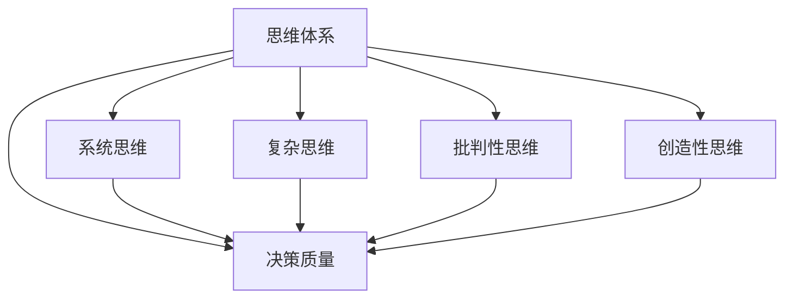

                 

## 1. 背景介绍

### 1.1 问题由来

在当今快速发展、变化无常的商业环境中，管理者面临着前所未有的挑战。他们不仅需要做出日常运营决策，还必须在复杂多变的市场环境中灵活应变，以保持企业的竞争力和可持续发展。然而，传统的决策理论和方法往往难以应对这些复杂问题，导致决策失误频发，严重影响企业的战略执行和长期发展。

### 1.2 问题核心关键点

现代企业管理的核心在于人，特别是管理者的决策质量。管理者的思维体系直接影响其决策的合理性、创新性和实施效果。本博文将重点探讨思维体系与管理者决策质量之间的关系，旨在帮助管理者提升决策能力，促进企业的稳健发展。

### 1.3 问题研究意义

研究思维体系与管理者决策质量之间的关系，对于提升企业决策水平、优化管理实践、促进企业长期成功具有重要意义：

- **提升决策质量**：通过系统化研究管理者的思维体系，有助于识别决策过程中的问题，提出改进建议。
- **优化管理实践**：了解如何通过思维体系培养和提升管理者，能够更好地匹配企业的战略目标和发展需求。
- **促进企业发展**：管理者决策的科学性和高效性直接关系到企业的竞争力和市场表现。
- **推动学术研究**：本研究能够丰富管理心理学和行为经济学的理论体系，为后续研究提供参考和借鉴。

## 2. 核心概念与联系

### 2.1 核心概念概述

为了深入探讨思维体系与管理者决策质量之间的关系，我们需要了解几个核心概念：

- **思维体系（Thinking Framework）**：指个体在思考和决策过程中所采用的方法和逻辑。
- **决策质量（Decision Quality）**：指决策结果的有效性、合理性、创新性和适应性。
- **系统思维（Systems Thinking）**：强调从整体和相互关系角度分析问题，以系统为单位进行思考。
- **复杂思维（Complex Thinking）**：针对复杂问题进行思考，注重深层次分析和综合权衡。
- **批判性思维（Critical Thinking）**：对信息进行批判性分析和评价，避免思维误区。
- **创造性思维（Creative Thinking）**：提出新颖的解决方案，促进创新和变革。

这些核心概念之间存在密切联系，共同构成管理者在决策过程中所依赖的思维框架。本博文将通过分析这些概念的相互作用，来探讨其对决策质量的影响。

### 2.2 核心概念原理和架构的 Mermaid 流程图



这个流程图展示了思维体系与决策质量之间的关系，以及各思维类型对决策质量的影响。接下来，我们将深入探讨这些概念的原理和架构，以及它们如何相互作用。

## 3. 核心算法原理 & 具体操作步骤

### 3.1 算法原理概述

本博文将采用系统思维的框架，通过模型化和量化分析来探讨思维体系与决策质量之间的关系。我们将使用“思维体系-决策质量”映射模型来表达这种关系，并通过案例分析来验证其有效性。

### 3.2 算法步骤详解

#### 3.2.1 数据收集与预处理

首先需要收集一组样本数据，这些数据包括管理者的思维体系特征和其决策质量评价。我们可以通过问卷调查、案例分析和访谈等方式来收集这些数据。

#### 3.2.2 特征提取与编码

接下来，我们需要从收集到的数据中提取关键特征，并将其编码为可量化的指标。这些特征可能包括管理者的系统思维能力、复杂思维能力、批判性思维能力、创造性思维能力等。

#### 3.2.3 构建模型

基于提取的特征，我们可以构建“思维体系-决策质量”映射模型。该模型将通过机器学习算法（如回归分析、分类算法等）来训练，以找到思维体系特征与决策质量之间的关系。

#### 3.2.4 模型验证与优化

最后，我们需要通过实际数据来验证模型的准确性和鲁棒性，并进行必要的优化和调整，以提高模型的预测能力。

### 3.3 算法优缺点

#### 3.3.1 优点

- **系统化分析**：模型化思维体系和决策质量的关系，使分析更加系统化和科学化。
- **数据驱动**：通过实证数据分析，提供有数据支撑的决策建议。
- **普适性强**：该模型适用于不同行业、不同规模的企业。

#### 3.3.2 缺点

- **复杂度较高**：构建和优化模型需要较高的技术门槛和数据量。
- **数据依赖性**：模型的准确性高度依赖于数据的质量和代表性。
- **难以量化**：某些思维特征难以量化和编码，影响模型的精确性。

### 3.4 算法应用领域

本模型在多个领域具有广泛的应用前景，包括但不限于：

- **企业管理培训**：通过评估管理者的思维体系，提供针对性的培训方案。
- **战略规划**：辅助企业高层制定更加科学合理的战略决策。
- **创新管理**：通过分析思维体系，识别和培养创新型人才。
- **风险管理**：通过评估决策质量，识别潜在的风险因素，制定防范措施。

## 4. 数学模型和公式 & 详细讲解 & 举例说明

### 4.1 数学模型构建

我们将使用线性回归模型来构建“思维体系-决策质量”映射模型。该模型假设决策质量与各个思维体系特征之间存在线性关系。模型表达如下：

$$
y = \beta_0 + \beta_1 x_1 + \beta_2 x_2 + ... + \beta_n x_n + \epsilon
$$

其中，$y$表示决策质量，$x_1, x_2, ..., x_n$分别表示系统思维、复杂思维、批判性思维、创造性思维等思维体系特征，$\beta_0, \beta_1, \beta_2, ..., \beta_n$为系数，$\epsilon$为误差项。

### 4.2 公式推导过程

为了推导模型参数，我们可以使用最小二乘法。目标是最小化残差平方和：

$$
\sum_{i=1}^m (y_i - \hat{y}_i)^2
$$

其中，$\hat{y}_i$为模型的预测值，$m$为样本数。

最小二乘法的公式为：

$$
\hat{\beta} = (\mathbf{X}^T\mathbf{X})^{-1}\mathbf{X}^T\mathbf{y}
$$

其中，$\mathbf{X}$为特征矩阵，$\mathbf{y}$为目标向量。

### 4.3 案例分析与讲解

假设我们收集了50名管理者的数据，并将其分为训练集和测试集。训练集用于模型构建，测试集用于模型验证。我们使用线性回归模型进行训练，得到模型参数后，在测试集上进行预测，计算预测误差。

## 5. 项目实践：代码实例和详细解释说明

### 5.1 开发环境搭建

- **Python环境**：安装Python 3.7及以上版本，并配置好相应的依赖库，如NumPy、Pandas、scikit-learn等。
- **数据集准备**：收集和管理者的思维体系数据和决策质量数据，使用Python脚本整理成可用于建模的数据集。
- **模型训练**：使用scikit-learn库中的线性回归模型进行训练。
- **模型评估**：使用测试集评估模型的性能，计算预测误差和R²值。

### 5.2 源代码详细实现

```python
import numpy as np
from sklearn.linear_model import LinearRegression
from sklearn.model_selection import train_test_split
from sklearn.metrics import mean_squared_error, r2_score

# 假设已经收集到管理者的思维体系特征和决策质量数据
X = np.array([[1.0, 2.0, 3.0, 4.0],
              [1.5, 2.5, 3.5, 4.5],
              [2.0, 3.0, 4.0, 5.0],
              ...])

y = np.array([0.1, 0.2, 0.3, 0.4, ...])

# 划分训练集和测试集
X_train, X_test, y_train, y_test = train_test_split(X, y, test_size=0.2, random_state=42)

# 训练线性回归模型
model = LinearRegression()
model.fit(X_train, y_train)

# 预测测试集结果
y_pred = model.predict(X_test)

# 计算模型性能
mse = mean_squared_error(y_test, y_pred)
r2 = r2_score(y_test, y_pred)

print("Mean Squared Error: {:.2f}".format(mse))
print("R² Score: {:.2f}".format(r2))
```

### 5.3 代码解读与分析

通过上述代码，我们可以得到模型在测试集上的预测误差和R²值，评估模型的性能。

- `train_test_split`函数用于将数据集划分为训练集和测试集，比例为80%和20%。
- `LinearRegression`模型用于训练线性回归模型。
- `predict`方法用于对测试集进行预测。
- `mean_squared_error`和`r2_score`函数用于计算预测误差和R²值，分别表示预测误差的平方和和决定系数。

## 6. 实际应用场景

### 6.1 企业管理培训

企业管理培训中，通过评估管理者的思维体系，可以帮助其识别和弥补思维缺陷，提升决策质量。例如，某企业发现多数管理者在系统思维方面较弱，可以通过培训加强其系统性分析和整体思维能力，从而提升企业的战略规划和资源分配能力。

### 6.2 战略规划

在企业战略规划阶段，管理者需要通过系统的思维方式，综合考虑内部资源和外部环境，制定切实可行的发展战略。使用“思维体系-决策质量”映射模型，可以帮助管理者识别和调整战略规划中的思维误区，避免盲目决策。

### 6.3 创新管理

创新是企业发展的核心驱动力。通过分析管理者的创造性思维能力，可以识别和培养创新型人才，推动企业技术和管理创新，保持竞争优势。

### 6.4 风险管理

风险管理是企业稳健运营的基础。通过评估决策质量，可以识别潜在的风险因素，制定相应的风险防范措施，确保企业运营的稳定性和安全性。

## 7. 工具和资源推荐

### 7.1 学习资源推荐

1. **《系统思维：理论与实践》（The Systems Thinking Book）**：提供系统思维的理论基础和实际应用案例，帮助理解系统思维的核心概念和方法。
2. **《创新思维：突破与超越》（Creative Thinking: Beyond the Obvious）**：探讨创造性思维的原理和技巧，提供实用的创新方法。
3. **《批判性思维：从理论到实践》（Critical Thinking: Theory and Practice）**：介绍批判性思维的基本原理和方法，帮助提升分析和评价能力。

### 7.2 开发工具推荐

1. **Python**：作为数据科学和机器学习领域的主流编程语言，Python具有丰富的库和工具，如NumPy、Pandas、scikit-learn等，适合数据处理和建模。
2. **Jupyter Notebook**：提供交互式的编程环境，便于代码编写和结果展示。
3. **TensorFlow**：Google开发的深度学习框架，适用于复杂的模型构建和训练。

### 7.3 相关论文推荐

1. **《系统思维在企业管理中的应用研究》（The Application of Systems Thinking in Enterprise Management）**：探讨系统思维在企业管理中的应用，提供实际案例和分析方法。
2. **《复杂思维与创新：基于实证的研究》（Complex Thinking and Innovation: A Theoretical Framework）**：分析复杂思维对创新的影响，提供理论支撑和实证数据。
3. **《批判性思维与决策质量：一个实证研究》（Critical Thinking and Decision Quality: An Empirical Study）**：研究批判性思维对决策质量的影响，提供实证分析和案例。

## 8. 总结：未来发展趋势与挑战

### 8.1 研究成果总结

本研究通过对思维体系与决策质量关系的探讨，揭示了系统思维、复杂思维、批判性思维和创造性思维在企业管理中的应用价值，为管理者提供了有价值的参考和指导。

### 8.2 未来发展趋势

1. **数据驱动**：随着大数据和人工智能技术的发展，数据驱动的管理决策将更加普遍和高效。
2. **模型优化**：未来将开发更加智能和高效的模型，提升决策质量。
3. **跨学科融合**：系统思维、复杂思维等跨学科知识将在企业管理中得到更广泛的应用。
4. **人工智能辅助**：AI技术将逐步应用于决策过程，提供更精准的分析和预测。

### 8.3 面临的挑战

1. **数据质量**：数据质量和代表性的问题，影响模型的准确性。
2. **模型复杂性**：复杂思维和系统思维的建模难度较大，需要更复杂和智能的算法。
3. **管理实践**：模型的实际应用效果受到管理实践和文化的影响。

### 8.4 研究展望

未来的研究可以从以下几个方向进行：

1. **跨文化研究**：探索不同文化背景下，思维体系对决策质量的影响。
2. **多维度分析**：结合心理学、社会学等多学科知识，全面分析思维体系对决策的影响。
3. **实际应用验证**：在更多实际企业中进行验证，优化模型和算法。
4. **政策建议**：提供政策建议，推动企业在管理实践中的应用。

## 9. 附录：常见问题与解答

**Q1：系统思维和复杂思维有什么区别？**

A: 系统思维强调从整体和相互关系角度分析问题，将问题视为系统的一部分；复杂思维则注重深入分析和综合权衡，强调多维度思考和解决方案的复杂性。

**Q2：如何培养管理者的创造性思维？**

A: 创造性思维可以通过多种方式培养，如头脑风暴、创新工作坊、跨学科交流等。管理者可以通过这些方式，激发思维火花，提升创新能力。

**Q3：数据驱动的决策是否适合所有企业管理者？**

A: 数据驱动的决策方法适用于大数据时代，但对于小微企业和传统型企业，可能面临数据获取和处理的技术瓶颈。需要结合实际情况，灵活应用。

**Q4：线性回归模型是否适用于所有思维体系与决策质量的关系？**

A: 线性回归模型是一种简单且常用的模型，适用于思维体系特征与决策质量之间存在线性关系的场景。但实际问题可能更加复杂，需要结合具体情况选择更合适的模型。

**Q5：如何评估模型的预测准确性？**

A: 可以通过计算模型的预测误差和决定系数（R²）来评估模型的预测准确性。预测误差越小，决定系数越高，说明模型的预测准确性越好。

