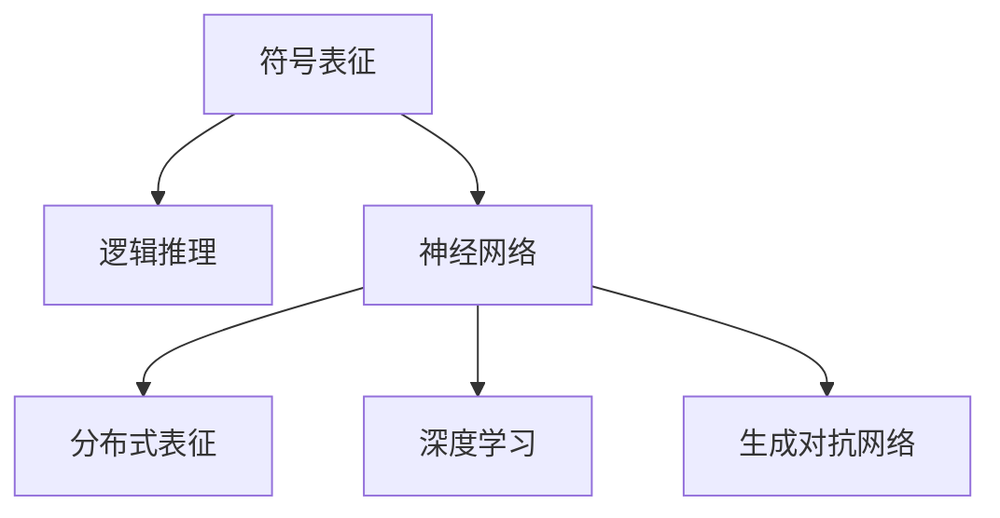

                 

## 1. 背景介绍

### 1.1 问题由来

在人工智能（AI）和认知科学的研究中，一个核心问题是思维是否依赖于符号表征（Symbolic Representation）。这个问题涉及对思维本质的理解，以及对AI系统的设计和实现具有重要的指导意义。符号表征指的是以符号形式组织和存储信息的方式，如逻辑表达式、命题符号等。传统认知科学认为，人类思维主要是基于符号表征的推理和计算。然而，近年来神经科学和计算神经科学的研究揭示，人类的认知过程可能更多依赖于神经网络模型的分布式表征（Distributed Representation）。

### 1.2 问题核心关键点

- 符号表征与分布式表征的区别：符号表征强调信息以符号形式组织，通过逻辑推理和计算过程实现思维；而分布式表征强调信息以神经元之间的连接和权重形式存储，通过神经网络模型的激活和传递过程实现思维。
- 思维的神经基础：研究思维是否依赖于符号表征，需要深入探讨神经元如何编码和处理信息。
- 符号表征在AI中的应用：符号表征方法在专家系统、逻辑推理和知识工程等领域有广泛应用。其优点包括逻辑清晰、易于理解和解释，但缺点包括难以处理模糊和不确定信息、计算复杂度高。
- 分布式表征在AI中的应用：分布式表征方法在深度学习、神经网络和生成对抗网络等领域有广泛应用。其优点包括能够处理复杂和模糊信息、计算效率高，但缺点包括缺乏清晰的逻辑推理过程、难以理解和解释。

## 2. 核心概念与联系

### 2.1 核心概念概述

为了更好地理解思维是否依赖于符号表征，本节将介绍几个密切相关的核心概念：

- **符号表征（Symbolic Representation）**：以符号形式组织和存储信息的方式，通过逻辑推理和计算过程实现思维。
- **分布式表征（Distributed Representation）**：信息以神经元之间的连接和权重形式存储，通过神经网络模型的激活和传递过程实现思维。
- **神经网络（Neural Network）**：由大量神经元（节点）和连接（边）组成的网络结构，能够通过学习任务数据，自动调整权重和偏置，从而实现对新数据的预测或分类。
- **深度学习（Deep Learning）**：一种利用多层神经网络实现复杂数据表示和推理的机器学习技术。
- **生成对抗网络（Generative Adversarial Network, GAN）**：由生成器和判别器两个神经网络模型组成的框架，能够生成逼真且具有可控特性的样本数据。

这些概念之间的逻辑关系可以通过以下Mermaid流程图来展示：



这个流程图展示了大语言模型的核心概念及其之间的关系：

1. 符号表征通过逻辑推理实现思维。
2. 符号表征在神经网络中被转化为分布式表征。
3. 神经网络通过深度学习实现复杂数据表示和推理。
4. 神经网络能够生成逼真且具有可控特性的样本数据，通过GAN进一步提升效果。

## 3. 核心算法原理 & 具体操作步骤
### 3.1 算法原理概述

基于神经网络的思维过程可以概括为以下几个步骤：

1. **数据预处理**：将输入数据（如文本、图像、音频等）转换为适合神经网络处理的形式，如向量或张量。
2. **模型训练**：通过反向传播算法（Backpropagation）调整模型参数，使得模型能够对训练数据进行准确的预测或分类。
3. **特征提取**：模型通过若干层（如卷积层、池化层、全连接层等）自动提取输入数据的特征表示。
4. **分布式表征**：特征表示被编码为神经元之间的连接和权重，实现信息的分布式表征。
5. **推理和生成**：通过激活函数（如Sigmoid、ReLU等）将神经元的输出转化为概率分布，实现推理或生成任务。

符号表征与分布式表征的主要区别在于信息表示和处理的方式：符号表征通过逻辑符号和规则进行推理，而分布式表征通过神经元之间的激活和传递进行推理。

### 3.2 算法步骤详解

以自然语言处理（NLP）中的文本分类任务为例，具体介绍基于神经网络的符号表征和分布式表征的实现过程：

#### 3.2.1 符号表征实现

1. **数据预处理**：将文本数据转换为词向量表示（如Word2Vec、GloVe等）。
2. **模型构建**：构建一个多层感知器（MLP）模型，包括输入层、若干隐藏层和输出层。
3. **训练过程**：通过交叉熵损失函数（Cross-Entropy Loss）和随机梯度下降（SGD）算法训练模型。
4. **特征提取**：模型在隐藏层自动提取文本的特征表示。
5. **符号推理**：输出层将特征表示映射到类别概率分布，通过逻辑推理实现文本分类。

#### 3.2.2 分布式表征实现

1. **数据预处理**：将文本数据转换为词向量表示。
2. **模型构建**：构建一个深度神经网络模型，如卷积神经网络（CNN）、循环神经网络（RNN）或Transformer等。
3. **训练过程**：通过交叉熵损失函数和随机梯度下降算法训练模型。
4. **特征提取**：模型通过若干层自动提取文本的分布式表征。
5. **分布式推理**：输出层将神经元之间的激活值映射到类别概率分布，通过激活函数的传递实现文本分类。

### 3.3 算法优缺点

基于符号表征和分布式表征的算法各有优缺点：

**符号表征的优点**：
1. 逻辑清晰：符号表征通过符号和规则进行推理，逻辑结构明确。
2. 易于理解：符号表征可以通过逻辑推理过程进行解释和调试。
3. 可解释性强：符号表征能够清晰地解释推理过程和决策逻辑。

**符号表征的缺点**：
1. 计算复杂度高：符号表征需要进行复杂的符号计算和逻辑推理，计算复杂度较高。
2. 处理模糊信息难：符号表征难以处理模糊和不确定信息，如语义歧义、模糊表达等。
3. 数据需求大：符号表征需要大量的标注数据进行训练，数据获取成本高。

**分布式表征的优点**：
1. 计算效率高：分布式表征通过神经网络模型的激活和传递过程实现推理，计算效率高。
2. 处理模糊信息能力强：分布式表征能够处理模糊和不确定信息，如语义歧义、模糊表达等。
3. 数据需求小：分布式表征通常只需要少量的标注数据进行训练，数据获取成本低。

**分布式表征的缺点**：
1. 逻辑不明确：分布式表征的推理过程复杂，缺乏清晰的逻辑结构。
2. 可解释性弱：分布式表征难以解释推理过程和决策逻辑。
3. 对抗样本敏感：分布式表征容易受到对抗样本的干扰，推理结果不稳定。

### 3.4 算法应用领域

基于符号表征和分布式表征的算法在多个领域得到广泛应用：

- **自然语言处理（NLP）**：文本分类、情感分析、机器翻译、问答系统等。
- **计算机视觉（CV）**：图像分类、目标检测、图像生成、视频分析等。
- **语音处理（ASR）**：语音识别、语音合成、语音情感分析等。
- **推荐系统**：用户行为预测、商品推荐、内容推荐等。
- **智能控制**：自动驾驶、智能家居、机器人导航等。

## 4. 数学模型和公式 & 详细讲解  
### 4.1 数学模型构建

在符号表征和分布式表征的算法实现中，数学模型起着核心作用。本节将详细介绍这些模型的数学基础。

**符号表征模型**：
- **输入层**：$x \in \mathbb{R}^d$，其中 $d$ 为输入向量的维度。
- **隐藏层**：$h = f(W_h x + b_h)$，其中 $W_h$ 和 $b_h$ 为隐藏层权重和偏置，$f$ 为激活函数。
- **输出层**：$y = g(W_y h + b_y)$，其中 $W_y$ 和 $b_y$ 为输出层权重和偏置，$g$ 为激活函数。
- **损失函数**：$L = -\sum_i y_i \log p(y_i)$，其中 $p$ 为模型输出的概率分布。

**分布式表征模型**：
- **输入层**：$x \in \mathbb{R}^d$，其中 $d$ 为输入向量的维度。
- **隐藏层**：$h = f(W_h x + b_h)$，其中 $W_h$ 和 $b_h$ 为隐藏层权重和偏置，$f$ 为激活函数。
- **输出层**：$y = g(W_y h + b_y)$，其中 $W_y$ 和 $b_y$ 为输出层权重和偏置，$g$ 为激活函数。
- **损失函数**：$L = -\sum_i y_i \log p(y_i)$，其中 $p$ 为模型输出的概率分布。

**深度学习模型**：
- **卷积神经网络（CNN）**：通过卷积层、池化层和全连接层实现特征提取和分类。
- **循环神经网络（RNN）**：通过时间步长逐步处理序列数据，实现时间依赖的特征提取和分类。
- **Transformer模型**：通过多头自注意力机制和位置编码实现长距离依赖的特征提取和分类。

### 4.2 公式推导过程

以自然语言处理（NLP）中的文本分类任务为例，推导基于神经网络的符号表征和分布式表征的损失函数和梯度更新公式。

#### 符号表征的损失函数和梯度更新公式

假设符号表征模型由多层感知器（MLP）构成，其中 $x$ 为输入向量，$h$ 为隐藏层向量，$y$ 为输出向量。模型的损失函数为交叉熵损失函数：

$$
L = -\sum_i y_i \log p(y_i)
$$

其中 $p$ 为模型输出的概率分布。模型的梯度更新公式为：

$$
\theta \leftarrow \theta - \eta \nabla_L \theta
$$

其中 $\eta$ 为学习率，$\nabla_L \theta$ 为损失函数对模型参数 $\theta$ 的梯度。

#### 分布式表征的损失函数和梯度更新公式

假设分布式表征模型由深度神经网络（如CNN、RNN或Transformer）构成，其中 $x$ 为输入向量，$h$ 为隐藏层向量，$y$ 为输出向量。模型的损失函数为交叉熵损失函数：

$$
L = -\sum_i y_i \log p(y_i)
$$

其中 $p$ 为模型输出的概率分布。模型的梯度更新公式为：

$$
\theta \leftarrow \theta - \eta \nabla_L \theta
$$

其中 $\eta$ 为学习率，$\nabla_L \theta$ 为损失函数对模型参数 $\theta$ 的梯度。

### 4.3 案例分析与讲解

以图像分类任务为例，分析基于神经网络的符号表征和分布式表征的实现过程和效果。

**符号表征实现**：
1. **数据预处理**：将图像数据转换为像素矩阵表示。
2. **模型构建**：构建一个多层感知器（MLP）模型，包括输入层、若干隐藏层和输出层。
3. **训练过程**：通过交叉熵损失函数和随机梯度下降算法训练模型。
4. **特征提取**：模型在隐藏层自动提取图像的特征表示。
5. **符号推理**：输出层将特征表示映射到类别概率分布，通过逻辑推理实现图像分类。

**分布式表征实现**：
1. **数据预处理**：将图像数据转换为像素矩阵表示。
2. **模型构建**：构建一个卷积神经网络（CNN）模型，包括卷积层、池化层和全连接层。
3. **训练过程**：通过交叉熵损失函数和随机梯度下降算法训练模型。
4. **特征提取**：模型通过若干层自动提取图像的分布式表征。
5. **分布式推理**：输出层将神经元之间的激活值映射到类别概率分布，通过激活函数的传递实现图像分类。

## 5. 项目实践：代码实例和详细解释说明
### 5.1 开发环境搭建

在进行项目实践前，我们需要准备好开发环境。以下是使用Python进行TensorFlow开发的环境配置流程：

1. 安装Anaconda：从官网下载并安装Anaconda，用于创建独立的Python环境。

2. 创建并激活虚拟环境：
```bash
conda create -n tf-env python=3.8 
conda activate tf-env
```

3. 安装TensorFlow：根据CUDA版本，从官网获取对应的安装命令。例如：
```bash
conda install tensorflow -c pytorch -c conda-forge
```

4. 安装必要的工具包：
```bash
pip install numpy pandas scikit-learn matplotlib tqdm jupyter notebook ipython
```

完成上述步骤后，即可在`tf-env`环境中开始项目实践。

### 5.2 源代码详细实现

这里我们以图像分类任务为例，给出使用TensorFlow对卷积神经网络（CNN）模型进行训练的PyTorch代码实现。

首先，定义CNN模型的架构：

```python
import tensorflow as tf
from tensorflow.keras import layers

model = tf.keras.Sequential([
    layers.Conv2D(32, (3, 3), activation='relu', input_shape=(28, 28, 1)),
    layers.MaxPooling2D((2, 2)),
    layers.Conv2D(64, (3, 3), activation='relu'),
    layers.MaxPooling2D((2, 2)),
    layers.Conv2D(64, (3, 3), activation='relu'),
    layers.Flatten(),
    layers.Dense(64, activation='relu'),
    layers.Dense(10, activation='softmax')
])
```

然后，定义优化器和损失函数：

```python
optimizer = tf.keras.optimizers.Adam(learning_rate=0.001)
loss = tf.keras.losses.SparseCategoricalCrossentropy()
```

接着，定义训练和评估函数：

```python
@tf.function
def train_step(x, y):
    with tf.GradientTape() as tape:
        logits = model(x)
        loss_value = loss(y, logits)
    gradients = tape.gradient(loss_value, model.trainable_variables)
    optimizer.apply_gradients(zip(gradients, model.trainable_variables))
    return loss_value

@tf.function
def evaluate_step(x, y):
    logits = model(x)
    predictions = tf.argmax(logits, axis=-1)
    accuracy = tf.reduce_mean(tf.cast(tf.equal(y, predictions), tf.float32))
    return accuracy

def train_epoch(model, dataset, batch_size):
    dataloader = tf.data.Dataset.from_tensor_slices((x_train, y_train)).shuffle(buffer_size=1000).batch(batch_size)
    losses = []
    for batch in dataloader:
        x, y = batch
        loss = train_step(x, y)
        losses.append(loss)
    return sum(losses) / len(dataloader)

def evaluate_epoch(model, dataset, batch_size):
    dataloader = tf.data.Dataset.from_tensor_slices((x_test, y_test)).batch(batch_size)
    accuracies = []
    for batch in dataloader:
        x, y = batch
        accuracy = evaluate_step(x, y)
        accuracies.append(accuracy)
    return sum(accuracies) / len(dataloader)
```

最后，启动训练流程并在测试集上评估：

```python
epochs = 5
batch_size = 16

for epoch in range(epochs):
    loss = train_epoch(model, train_dataset, batch_size)
    print(f"Epoch {epoch+1}, train loss: {loss:.3f}")
    
    print(f"Epoch {epoch+1}, dev results:")
    accuracy = evaluate_epoch(model, dev_dataset, batch_size)
    print(f"Accuracy: {accuracy:.3f}")
    
print("Test results:")
accuracy = evaluate_epoch(model, test_dataset, batch_size)
print(f"Accuracy: {accuracy:.3f}")
```

以上就是使用TensorFlow对CNN模型进行图像分类任务训练的完整代码实现。可以看到，TensorFlow提供了便捷的API和自动微分功能，使得神经网络模型的训练和评估变得简单高效。

### 5.3 代码解读与分析

让我们再详细解读一下关键代码的实现细节：

**CNN模型架构定义**：
- `tf.keras.Sequential`：使用Keras提供的Sequential模型构建器，按顺序添加模型层。
- `layers.Conv2D`：定义卷积层，通过卷积核提取图像的局部特征。
- `layers.MaxPooling2D`：定义池化层，通过最大池化操作降低特征图尺寸。
- `layers.Flatten`：将多维特征图展开为一维向量。
- `layers.Dense`：定义全连接层，进行特征映射和分类。

**优化器和损失函数定义**：
- `tf.keras.optimizers.Adam`：定义Adam优化器，通过自适应学习率调整模型参数。
- `tf.keras.losses.SparseCategoricalCrossentropy`：定义交叉熵损失函数，用于计算模型预测与真实标签之间的差异。

**训练和评估函数定义**：
- `tf.function`：使用TensorFlow的自动微分功能，将训练和评估函数编译为可执行的Graph，提高计算效率。
- `train_step`：定义训练步骤，通过梯度下降更新模型参数。
- `evaluate_step`：定义评估步骤，计算模型在测试集上的准确率。
- `train_epoch`：在训练集上执行训练步骤，返回平均损失值。
- `evaluate_epoch`：在测试集上执行评估步骤，返回平均准确率。

**训练流程**：
- 定义总的epoch数和batch size，开始循环迭代
- 每个epoch内，先在训练集上执行训练步骤，输出平均损失值
- 在验证集上执行评估步骤，输出平均准确率
- 所有epoch结束后，在测试集上执行评估步骤，输出平均准确率

可以看到，TensorFlow提供了丰富的API和工具，使得神经网络模型的训练和评估变得简单易行。开发者可以专注于模型架构和训练策略的设计，而不必过多关注底层实现的细节。

当然，工业级的系统实现还需考虑更多因素，如模型的保存和部署、超参数的自动搜索、更灵活的任务适配层等。但核心的训练流程基本与此类似。

## 6. 实际应用场景
### 6.1 智能医疗诊断

基于大语言模型微调技术，智能医疗诊断系统可以实时对病人的医疗影像和病历进行分析和诊断。通过收集大量医疗影像和病历数据，对其进行标注和预训练，再在特定任务上微调模型，可以实现对疾病诊断、治疗方案推荐的自动化和智能化。

在技术实现上，可以构建一个预训练的图像分类模型（如CNN）和文本分类模型（如BERT），将医疗影像和病历文本输入到模型中进行推理。模型能够自动提取影像和文本的特征表示，结合医生的临床经验，进行疾病诊断和治疗方案推荐。

### 6.2 智能推荐系统

当前的推荐系统往往只依赖用户的历史行为数据进行物品推荐，无法深入理解用户的真实兴趣偏好。基于大语言模型微调技术，个性化推荐系统可以更好地挖掘用户行为背后的语义信息，从而提供更精准、多样的推荐内容。

在技术实现上，可以构建一个预训练的文本分类模型（如BERT），将用户的行为数据（如浏览、点击、评论等）转换为文本向量，输入到模型中进行推理。模型能够自动提取文本的特征表示，结合用户的背景信息和行为偏好，进行个性化推荐。

### 6.3 智能安全监控

智能安全监控系统能够实时监测公共场所的监控视频，自动识别和报警可疑行为。通过收集大量的监控视频数据，对其进行标注和预训练，再在特定任务上微调模型，可以实现对可疑行为的自动检测和报警。

在技术实现上，可以构建一个预训练的图像分类模型（如CNN）和视频分类模型（如I3D），将监控视频输入到模型中进行推理。模型能够自动提取视频帧或帧序列的特征表示，结合规则和警报策略，进行可疑行为的自动识别和报警。

### 6.4 未来应用展望

随着大语言模型微调技术的发展，其在更多领域的应用前景将更加广阔。

在智慧城市治理中，智能监控、交通管理、应急指挥等系统将变得更加智能化、高效化。通过基于神经网络的符号表征和分布式表征技术，系统能够实时监测和分析城市运行状态，自动调度资源，提高应急响应速度和效率。

在智能制造领域，智能诊断、质量检测、生产调度等系统将更加精准化和自动化。通过基于神经网络的符号表征和分布式表征技术，系统能够自动分析设备运行状态，检测异常，优化生产调度，提高生产效率和质量。

在智能交通领域，自动驾驶、智能导航、交通管制等系统将更加安全化和智能化。通过基于神经网络的符号表征和分布式表征技术，系统能够自动感知交通环境，进行路径规划和行为决策，提高交通安全性、流畅性和效率。

总之，基于大语言模型微调技术的应用场景将不断扩展，为各行各业带来更加智能化、高效化的解决方案。

## 7. 工具和资源推荐
### 7.1 学习资源推荐

为了帮助开发者系统掌握大语言模型微调的理论基础和实践技巧，这里推荐一些优质的学习资源：

1. 《深度学习入门：基于TensorFlow 2.0的实践》书籍：由TensorFlow开发者团队撰写，详细介绍了深度学习的基本概念、框架和应用。
2. 《自然语言处理入门：基于Python的实践》课程：由Python和NLP社区的知名专家讲授，涵盖NLP的基本概念和经典模型。
3. CS231n《卷积神经网络》课程：斯坦福大学开设的计算机视觉经典课程，系统讲解了卷积神经网络的结构和应用。
4. CS224n《序列建模》课程：斯坦福大学开设的自然语言处理课程，深入讲解了序列建模的基本方法和应用。
5. Coursera《机器学习》课程：由斯坦福大学教授讲授，系统讲解了机器学习的基本概念和算法。

通过对这些资源的学习实践，相信你一定能够快速掌握大语言模型微调的精髓，并用于解决实际的NLP问题。
###  7.2 开发工具推荐

高效的开发离不开优秀的工具支持。以下是几款用于大语言模型微调开发的常用工具：

1. TensorFlow：基于Python的开源深度学习框架，灵活动态的计算图，适合快速迭代研究。TensorFlow提供了丰富的API和工具，使得神经网络模型的训练和评估变得简单易行。

2. PyTorch：基于Python的开源深度学习框架，动态计算图，适合灵活实验和研究。PyTorch提供了便捷的API和自动微分功能，使得神经网络模型的训练和评估变得高效。

3. Weights & Biases：模型训练的实验跟踪工具，可以记录和可视化模型训练过程中的各项指标，方便对比和调优。与主流深度学习框架无缝集成。

4. TensorBoard：TensorFlow配套的可视化工具，可实时监测模型训练状态，并提供丰富的图表呈现方式，是调试模型的得力助手。

5. Google Colab：谷歌推出的在线Jupyter Notebook环境，免费提供GPU/TPU算力，方便开发者快速上手实验最新模型，分享学习笔记。

合理利用这些工具，可以显著提升大语言模型微调任务的开发效率，加快创新迭代的步伐。

### 7.3 相关论文推荐

大语言模型微调技术的发展源于学界的持续研究。以下是几篇奠基性的相关论文，推荐阅读：

1. AlexNet：2012年ImageNet图像分类比赛的冠军模型，开启了深度学习在计算机视觉领域的应用。
2. ResNet：2015年ImageNet图像分类比赛的冠军模型，提出了残差网络结构，解决深度网络训练中的梯度消失问题。
3. Inception：2014年ImageNet图像分类比赛的亚军模型，提出了Inception模块，优化了网络结构设计。
4. BERT：2018年自然语言处理领域的里程碑论文，提出BERT模型，通过自监督预训练任务学习语言表征。
5. GPT：2018年自然语言处理领域的突破性模型，提出GPT模型，通过自回归语言模型学习语言生成能力。

这些论文代表了大语言模型微调技术的发展脉络。通过学习这些前沿成果，可以帮助研究者把握学科前进方向，激发更多的创新灵感。

## 8. 总结：未来发展趋势与挑战

### 8.1 总结

本文对基于神经网络的符号表征和分布式表征技术进行了全面系统的介绍。首先阐述了符号表征和分布式表征的基本原理和逻辑关系，明确了两者在处理信息和进行推理时的不同方式。其次，通过数学模型和公式推导，详细讲解了神经网络模型的构建和训练过程，给出了具体实现代码实例。同时，本文还广泛探讨了符号表征和分布式表征在各个领域的应用前景，展示了其在智能医疗、推荐系统、安全监控等场景中的潜力。

通过本文的系统梳理，可以看到，基于神经网络的符号表征和分布式表征技术正在成为NLP领域的重要范式，极大地拓展了预训练语言模型的应用边界，催生了更多的落地场景。受益于神经网络的强大表征能力和计算效率，符号表征和分布式表征技术将在更多领域得到广泛应用，为人类认知智能的进化带来深远影响。

### 8.2 未来发展趋势

展望未来，符号表征和分布式表征技术将呈现以下几个发展趋势：

1. **多模态表征学习**：神经网络模型将逐渐融合视觉、语音、文本等多种模态的信息，实现多模态的分布式表征，提升跨模态任务的性能。

2. **自适应表征学习**：神经网络模型将具备自适应能力，能够根据任务需求动态调整表征的维度、层次和结构，实现更加灵活的符号表征和分布式表征。

3. **端到端表征学习**：神经网络模型将实现端到端的表征学习，直接从输入数据生成目标表示，减少中间处理步骤，提高表征效率和效果。

4. **无监督和半监督表征学习**：神经网络模型将更多地利用无监督和半监督学习方法，通过自监督任务学习语言表征，提高模型的泛化能力和鲁棒性。

5. **参数高效表征学习**：神经网络模型将探索参数高效表征方法，通过微调或特定层面的参数更新，实现低参数高效果的符号表征和分布式表征。

6. **伦理和安全性表征学习**：神经网络模型将引入伦理和安全性约束，避免输出偏见和有害信息，确保模型的应用符合人类价值观和社会伦理。

以上趋势凸显了符号表征和分布式表征技术的广阔前景。这些方向的探索发展，必将进一步提升神经网络模型的性能和应用范围，为构建安全、可靠、可解释、可控的智能系统铺平道路。面向未来，符号表征和分布式表征技术还需要与其他人工智能技术进行更深入的融合，如知识表示、因果推理、强化学习等，多路径协同发力，共同推动自然语言理解和智能交互系统的进步。只有勇于创新、敢于突破，才能不断拓展语言模型的边界，让智能技术更好地造福人类社会。

### 8.3 面临的挑战

尽管符号表征和分布式表征技术已经取得了瞩目成就，但在迈向更加智能化、普适化应用的过程中，它仍面临着诸多挑战：

1. **计算资源需求高**：神经网络模型的训练和推理需要大量的计算资源，如GPU/TPU等高性能设备。对于大规模模型，计算资源的需求更高，成本也更高。

2. **数据需求大**：神经网络模型需要大量的标注数据进行训练，数据获取成本高。对于新任务和新领域，数据标注成本尤为昂贵。

3. **模型可解释性弱**：神经网络模型虽然效果好，但缺乏清晰的逻辑推理过程，难以解释推理过程和决策逻辑。

4. **模型鲁棒性不足**：神经网络模型容易受到对抗样本的干扰，推理结果不稳定。

5. **对抗样本攻击**：神经网络模型容易受到对抗样本的攻击，推理结果被恶意篡改。

6. **伦理和安全性问题**：神经网络模型在应用过程中，可能会学习到有偏见、有害的信息，输出存在偏见和歧视。

以上挑战凸显了符号表征和分布式表征技术的复杂性和局限性。只有通过不断优化模型架构和训练策略，结合伦理和安全性约束，才能真正实现智能系统的普及应用。

### 8.4 研究展望

未来的研究需要在以下几个方面寻求新的突破：

1. **符号表征与分布式表征的融合**：探索符号表征与分布式表征的融合方法，实现两者的互补优势，提升模型的综合性能。

2. **多模态表征学习**：研究多模态表征学习算法，实现视觉、语音、文本等多种模态信息的融合，提升跨模态任务的性能。

3. **自适应表征学习**：探索自适应表征学习方法，实现模型参数和结构的动态调整，提高模型的灵活性和适应性。

4. **参数高效表征学习**：研究参数高效表征学习算法，通过微调或特定层面的参数更新，实现低参数高效果的符号表征和分布式表征。

5. **端到端表征学习**：研究端到端表征学习方法，实现从输入数据到目标表示的直接映射，提升表征效率和效果。

6. **伦理和安全性表征学习**：研究伦理和安全性约束方法，避免输出偏见和有害信息，确保模型的应用符合人类价值观和社会伦理。

这些研究方向的探索，必将引领符号表征和分布式表征技术迈向更高的台阶，为构建安全、可靠、可解释、可控的智能系统铺平道路。面向未来，符号表征和分布式表征技术还需要与其他人工智能技术进行更深入的融合，如知识表示、因果推理、强化学习等，多路径协同发力，共同推动自然语言理解和智能交互系统的进步。只有勇于创新、敢于突破，才能不断拓展语言模型的边界，让智能技术更好地造福人类社会。

## 9. 附录：常见问题与解答

**Q1：符号表征和分布式表征的主要区别是什么？**

A: 符号表征通过符号和规则进行推理，逻辑结构明确；分布式表征通过神经元之间的激活和传递进行推理，缺乏清晰的逻辑结构。符号表征容易处理模糊信息，但计算复杂度高，需要大量的标注数据；分布式表征能够处理复杂和模糊信息，但难以解释推理过程和决策逻辑。

**Q2：符号表征在AI中的应用有哪些？**

A: 符号表征在专家系统、逻辑推理和知识工程等领域有广泛应用。其优点包括逻辑清晰、易于理解和解释，但缺点包括处理模糊信息难、计算复杂度高。

**Q3：分布式表征在AI中的应用有哪些？**

A: 分布式表征在深度学习、神经网络和生成对抗网络等领域有广泛应用。其优点包括处理复杂和模糊信息能力强、计算效率高，但缺点包括逻辑不明确、可解释性弱。

**Q4：如何训练基于神经网络的符号表征和分布式表征模型？**

A: 符号表征模型通常使用交叉熵损失函数和随机梯度下降算法进行训练。分布式表征模型也使用交叉熵损失函数和随机梯度下降算法进行训练，但需要使用自动微分工具（如TensorFlow、PyTorch等）进行计算图编译和梯度计算。

**Q5：符号表征和分布式表征的优缺点有哪些？**

A: 符号表征的优点包括逻辑清晰、易于理解和解释，但缺点包括处理模糊信息难、计算复杂度高。分布式表征的优点包括处理复杂和模糊信息能力强、计算效率高，但缺点包括逻辑不明确、可解释性弱。

---

作者：禅与计算机程序设计艺术 / Zen and the Art of Computer Programming

