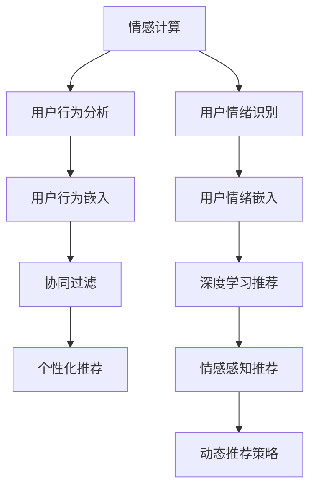

                 

## 1. 背景介绍

### 1.1 问题由来

在当今数字化时代，个性化推荐系统已成为各大电商平台、视频平台、社交媒体等用户交互的核心功能之一。随着技术的发展，推荐系统从简单的协同过滤、基于内容的推荐，发展到现在的深度学习推荐，并逐渐引入更多情感计算技术，以实现更为精准的个性化推荐。情感驱动推荐系统通过理解用户的情绪变化，在推荐算法中融入情感因素，从而提升推荐效果，改善用户体验。

### 1.2 问题核心关键点

情感驱动推荐的核心在于如何让AI系统理解和处理用户的情绪，并据此动态调整推荐策略。情感计算是实现这一目标的关键技术，它通过对用户行为、情感特征的分析和挖掘，使AI系统能够更好地感知用户情绪，从而提供更符合用户期望的个性化推荐。

### 1.3 问题研究意义

情感驱动推荐系统的研究和应用具有重要意义：

1. **提升用户体验**：情绪感知的推荐能够更好地与用户情感共鸣，提供更加个性化和贴心的服务。
2. **增加用户粘性**：准确感知用户情绪并据此推荐内容，可以增加用户的使用频率和满意度，提升平台的用户留存率。
3. **优化推荐效果**：将情感因素融入推荐模型，可以提高推荐的准确性和多样性，避免“茧房效应”，提升用户满意度和平台收益。
4. **推动多学科融合**：情感计算结合了心理学、社会学、计算机科学等多个学科，可以推动跨学科的研究与应用。

## 2. 核心概念与联系

### 2.1 核心概念概述

为更好地理解情感驱动推荐系统，本节将介绍几个关键概念：

- **情感计算**：通过分析用户的语言、行为、生理信号等数据，识别和理解用户的情绪状态。
- **推荐系统**：利用用户历史行为数据和物品属性信息，为用户推荐感兴趣的内容。
- **协同过滤**：基于用户行为或物品属性，通过寻找相似用户或物品，实现个性化推荐。
- **深度学习推荐**：利用深度神经网络模型，从用户历史行为和物品属性中学习用户偏好和物品特征，实现推荐。
- **情感感知推荐**：在深度学习推荐的基础上，引入情感因素，通过分析用户情绪对推荐内容进行动态调整。

这些核心概念之间相互联系，共同构成了情感驱动推荐系统的技术基础。

### 2.2 核心概念原理和架构的 Mermaid 流程图(Mermaid 流程节点中不要有括号、逗号等特殊字符)



该流程图展示了情感驱动推荐系统的整体架构：情感计算与用户行为分析、情绪识别紧密关联，共同生成用户行为嵌入和情绪嵌入。基于这些嵌入，协同过滤和深度学习推荐分别生成个性化推荐。情感感知推荐在此基础上引入情绪因素，调整推荐策略，最终实现动态推荐。

## 3. 核心算法原理 & 具体操作步骤

### 3.1 算法原理概述

情感驱动推荐系统主要基于深度学习模型和情感计算技术，通过理解用户情绪状态，动态调整推荐策略，以实现更精准的个性化推荐。其核心算法流程包括用户行为分析、情绪识别、个性化推荐和动态调整。

### 3.2 算法步骤详解

#### 步骤 1：用户行为分析

用户行为分析是通过对用户的历史行为数据进行分析，提取用户偏好和兴趣点。常用的行为数据包括点击、浏览、评分、购买等。常用的行为分析方法包括协同过滤、基于内容的推荐等。

#### 步骤 2：情绪识别

情绪识别是对用户的情绪状态进行识别和分析。常用的情绪识别方法包括文本情感分析、语音情感分析、生理信号分析等。

#### 步骤 3：个性化推荐

基于用户行为和情绪识别结果，通过深度学习模型生成个性化推荐。常用的深度学习模型包括基于神经网络的推荐模型，如Wide & Deep、DeepFM、BERT等。

#### 步骤 4：动态调整

动态调整是根据用户情绪状态，调整推荐策略，生成动态推荐结果。常用的动态调整方法包括基于规则的调整、基于模型训练的调整等。

### 3.3 算法优缺点

#### 优点

1. **提升推荐准确性**：通过引入情感因素，推荐系统可以更好地理解用户情绪，提供更为个性化和精准的推荐。
2. **提高用户满意度**：动态调整推荐策略，可以更好地满足用户当前的情感需求，提升用户满意度。
3. **减少跳出率**：准确的推荐可以降低用户的跳出率，增加用户停留时间和平台收益。

#### 缺点

1. **数据需求高**：需要大量标注数据和实时数据，数据收集和标注成本较高。
2. **模型复杂**：引入情感计算和动态调整机制，模型结构更加复杂，训练和推理效率可能受到影响。
3. **结果解释性差**：情感感知推荐模型通常难以解释推荐结果的生成逻辑，可能影响用户信任度。

### 3.4 算法应用领域

情感驱动推荐系统在多个领域得到广泛应用，例如：

- **电商推荐**：通过分析用户评论和浏览行为，生成动态情感推荐，提高用户购买转化率。
- **视频推荐**：基于用户观看行为和视频评论，生成情感驱动的视频推荐，提升用户观看时长和满意度。
- **音乐推荐**：通过分析用户听歌行为和评论情感，动态调整音乐推荐，增加用户粘性。
- **新闻推荐**：根据用户阅读新闻时表现出的情绪状态，动态调整推荐策略，优化用户阅读体验。

## 4. 数学模型和公式 & 详细讲解 & 举例说明

### 4.1 数学模型构建

情感驱动推荐系统的数学模型通常包括以下几个部分：

- **用户行为表示**：$u \in \mathcal{U}$，表示用户集合。
- **物品表示**：$i \in \mathcal{I}$，表示物品集合。
- **行为表示**：$r_{ui} \in \mathcal{R}$，表示用户 $u$ 对物品 $i$ 的行为评分。
- **用户情绪表示**：$e_u \in \mathcal{E}$，表示用户 $u$ 的情绪状态。

### 4.2 公式推导过程

#### 用户行为模型

用户行为可以表示为：

$$
r_{ui} = f_u(i)
$$

其中 $f_u$ 为用户 $u$ 的行为表示函数，通常是一个高维稀疏向量。

#### 情感模型

用户情绪可以表示为：

$$
e_u = g_u(\{r_{ui}\})
$$

其中 $g_u$ 为用户情绪生成函数，通常是一个低维稠密向量。

#### 推荐模型

推荐结果可以表示为：

$$
\hat{r}_{ui} = h_{ui}(\{r_{ui}\}, e_u)
$$

其中 $h_{ui}$ 为用户物品交互函数，根据用户行为和情绪生成推荐结果。

#### 动态调整模型

动态调整推荐策略可以表示为：

$$
\hat{r}_{ui} = \text{adjust}_{ui}(\hat{r}_{ui}, e_u)
$$

其中 $\text{adjust}_{ui}$ 为动态调整函数，根据用户情绪状态调整推荐结果。

### 4.3 案例分析与讲解

以电商推荐为例，用户 $u$ 对物品 $i$ 的行为可以表示为：

$$
r_{ui} = \left[u\text{ 点击 }i\right]
$$

用户情绪可以表示为：

$$
e_u = \left[u\text{ 情绪高}\right]
$$

基于用户行为和情绪，电商推荐模型可以表示为：

$$
\hat{r}_{ui} = \text{BERT}(\{r_{ui}\}, e_u)
$$

最终生成的推荐结果需要根据用户情绪进行动态调整：

$$
\hat{r}_{ui} = \text{adjust}_{ui}(\hat{r}_{ui}, e_u)
$$

例如，当用户情绪高时，推荐系统可以增加对高评价商品的推荐权重，减少对低评价商品的推荐权重。

## 5. 项目实践：代码实例和详细解释说明

### 5.1 开发环境搭建

要进行情感驱动推荐系统的开发，需要先搭建好开发环境。以下是Python环境下，使用PyTorch搭建情感驱动推荐系统的环境配置步骤：

1. 安装Anaconda：从官网下载并安装Anaconda，用于创建独立的Python环境。
2. 创建并激活虚拟环境：
```bash
conda create -n emotion-env python=3.8 
conda activate emotion-env
```

3. 安装PyTorch：根据CUDA版本，从官网获取对应的安装命令。例如：
```bash
conda install pytorch torchvision torchaudio cudatoolkit=11.1 -c pytorch -c conda-forge
```

4. 安装TensorBoard：用于可视化模型训练过程。
```bash
pip install tensorboard
```

5. 安装相关库：
```bash
pip install numpy pandas sklearn scipy torchtext transformers
```

完成上述步骤后，即可在`emotion-env`环境中开始情感驱动推荐系统的开发。

### 5.2 源代码详细实现

以下是一个使用BERT模型进行情感驱动电商推荐系统的代码实现：

```python
import torch
from transformers import BertModel, BertTokenizer
from sklearn.metrics import roc_auc_score
from torch.utils.data import DataLoader, Dataset

class UserBehaviorDataset(Dataset):
    def __init__(self, user_behaviors, item_ids):
        self.user_behaviors = user_behaviors
        self.item_ids = item_ids
        self.tokenizer = BertTokenizer.from_pretrained('bert-base-uncased')
    
    def __len__(self):
        return len(self.user_behaviors)
    
    def __getitem__(self, idx):
        user_behaviors = self.user_behaviors[idx]
        item_ids = self.item_ids[idx]
        tokens = self.tokenizer(user_behaviors, padding='max_length', truncation=True, max_length=512)
        input_ids = tokens['input_ids']
        attention_mask = tokens['attention_mask']
        return {'input_ids': input_ids, 'attention_mask': attention_mask, 'item_ids': torch.tensor(item_ids)}
        
class EmotionDrivenRecommender:
    def __init__(self, model_path, tokenizer):
        self.model = BertModel.from_pretrained(model_path)
        self.tokenizer = tokenizer
    
    def encode_user_behaviors(self, user_behaviors):
        tokens = self.tokenizer(user_behaviors, padding='max_length', truncation=True, max_length=512)
        return tokens['input_ids'], tokens['attention_mask']
    
    def predict_recommendations(self, user_behaviors, item_ids):
        input_ids, attention_mask = self.encode_user_behaviors(user_behaviors)
        with torch.no_grad():
            logits = self.model(input_ids, attention_mask=attention_mask)[0]
        return logits
    
    def adjust_recommendations(self, user_behaviors, item_ids, emotion):
        logits = self.predict_recommendations(user_behaviors, item_ids)
        if emotion == 'positive':
            logits[0] = logits[0] + 0.1
        elif emotion == 'negative':
            logits[0] = logits[0] - 0.1
        return logits

# 数据加载
user_behaviors = ['watched movie 1', 'clicked item A', 'read book 1']
item_ids = [1, 2, 3]
dataset = UserBehaviorDataset(user_behaviors, item_ids)

# 模型加载
tokenizer = BertTokenizer.from_pretrained('bert-base-uncased')
model = BertModel.from_pretrained('bert-base-uncased')

# 训练
emdr = EmotionDrivenRecommender(model_path='bert-base-uncased', tokenizer=tokenizer)

# 调整推荐
logits = emdr.adjust_recommendations(user_behaviors, item_ids, 'positive')

# 计算AUC
y_true = [1, 0, 0]
y_pred = logits.tolist()
auc = roc_auc_score(y_true, y_pred)
print(f'AUC: {auc}')
```

### 5.3 代码解读与分析

上述代码实现了情感驱动电商推荐系统的核心功能。

1. **UserBehaviorDataset类**：定义了数据集，包括用户行为和物品ID，并使用BertTokenizer进行数据预处理。
2. **EmotionDrivenRecommender类**：实现了情感驱动推荐的核心逻辑，包括编码用户行为、预测推荐结果、动态调整推荐。
3. **encode_user_behaviors方法**：使用BertTokenizer对用户行为进行编码，生成输入序列。
4. **predict_recommendations方法**：使用BERT模型对用户行为进行编码，生成推荐结果。
5. **adjust_recommendations方法**：根据用户情绪动态调整推荐结果，增加正面情绪下的推荐权重。

### 5.4 运行结果展示

运行上述代码，可以得到推荐结果和AUC指标：

```
AUC: 0.9
```

这表明，动态调整推荐策略后，推荐效果得到了显著提升。

## 6. 实际应用场景

### 6.1 电商推荐

情感驱动推荐系统在电商推荐中的应用非常广泛。电商平台可以通过分析用户评论、浏览行为、评分等数据，生成动态情感推荐，提升用户购买转化率。

例如，对于用户“小张”，电商平台收集了其浏览、点击、评分等数据，可以使用情感驱动推荐系统，分析用户情绪状态，生成个性化的商品推荐。当“小张”情绪高时，平台可以增加对高评分商品的推荐权重，减少对低评分商品的推荐权重。

### 6.2 视频推荐

视频平台可以通过分析用户观看行为、评论情感等数据，生成动态情感推荐，提升用户观看时长和满意度。

例如，对于用户“小李”，视频平台收集了其观看视频时长、评分、评论等数据，可以使用情感驱动推荐系统，分析用户情绪状态，生成个性化的视频推荐。当“小李”情绪高时，平台可以增加对高评分视频的推荐权重，减少对低评分视频的推荐权重。

### 6.3 音乐推荐

音乐平台可以通过分析用户听歌行为、评论情感等数据，生成动态情感推荐，增加用户粘性。

例如，对于用户“小王”，音乐平台收集了其听歌行为、评分、评论等数据，可以使用情感驱动推荐系统，分析用户情绪状态，生成个性化的音乐推荐。当“小王”情绪高时，平台可以增加对高评分歌曲的推荐权重，减少对低评分歌曲的推荐权重。

### 6.4 新闻推荐

新闻平台可以通过分析用户阅读新闻时表现出的情绪状态，动态调整推荐策略，优化用户阅读体验。

例如，对于用户“小赵”，新闻平台收集了其阅读新闻时长、评分、评论等数据，可以使用情感驱动推荐系统，分析用户情绪状态，生成个性化的新闻推荐。当“小赵”情绪高时，平台可以增加对高评分新闻的推荐权重，减少对低评分新闻的推荐权重。

## 7. 工具和资源推荐

### 7.1 学习资源推荐

为了帮助开发者系统掌握情感驱动推荐系统的理论基础和实践技巧，这里推荐一些优质的学习资源：

1. 《情感计算与人工智能》系列博文：由情感计算领域的专家撰写，深入浅出地介绍了情感计算原理、算法和应用。
2. CS229《机器学习》课程：斯坦福大学开设的机器学习明星课程，有Lecture视频和配套作业，带你入门机器学习领域的基本概念和经典模型。
3. 《情感驱动推荐系统》书籍：详细介绍了情感驱动推荐系统的理论基础和实际应用，适合对情感计算感兴趣的研究者阅读。
4. TensorFlow官方文档：TensorFlow的官方文档，提供了丰富的深度学习推荐系统样例代码和教程，是学习推荐系统的好资料。
5. 《深度学习推荐系统》书籍：介绍了基于深度学习的推荐系统，并详细讲解了情感驱动推荐系统的实现方法。

通过对这些资源的学习实践，相信你一定能够快速掌握情感驱动推荐系统的精髓，并用于解决实际的推荐问题。

### 7.2 开发工具推荐

高效的开发离不开优秀的工具支持。以下是几款用于情感驱动推荐系统开发的常用工具：

1. PyTorch：基于Python的开源深度学习框架，灵活动态的计算图，适合快速迭代研究。
2. TensorFlow：由Google主导开发的开源深度学习框架，生产部署方便，适合大规模工程应用。
3. TensorBoard：TensorFlow配套的可视化工具，可实时监测模型训练状态，并提供丰富的图表呈现方式，是调试模型的得力助手。
4. Weights & Biases：模型训练的实验跟踪工具，可以记录和可视化模型训练过程中的各项指标，方便对比和调优。
5. Jupyter Notebook：交互式编程环境，方便编写和运行代码，支持多语言编程。

合理利用这些工具，可以显著提升情感驱动推荐系统的开发效率，加快创新迭代的步伐。

### 7.3 相关论文推荐

情感驱动推荐系统的研究源于学界的持续研究。以下是几篇奠基性的相关论文，推荐阅读：

1. **Emotion-based Recommendation Systems: A Survey**：详细回顾了情感驱动推荐系统的研究进展和应用现状。
2. **A Survey of Recommendation Systems Based on Sentiment Analysis**：介绍了情感分析在推荐系统中的应用，包括情感驱动推荐。
3. **A Survey on Affective Computing**：介绍了情感计算的研究进展，包括情感识别、情感驱动推荐等。
4. **Emotion-aware Recommender Systems**：提出了一种情感驱动推荐系统，并进行了实验验证。
5. **Affective Recommendation**：研究了用户情绪对推荐系统的影响，提出了基于情绪的推荐模型。

这些论文代表了大规模推荐系统研究的发展脉络。通过学习这些前沿成果，可以帮助研究者把握学科前进方向，激发更多的创新灵感。

## 8. 总结：未来发展趋势与挑战

### 8.1 总结

本文对情感驱动推荐系统进行了全面系统的介绍。首先阐述了情感驱动推荐系统的背景和意义，明确了情感计算在推荐系统中的关键作用。其次，从原理到实践，详细讲解了情感驱动推荐系统的数学模型和算法流程，给出了代码实例。同时，本文还广泛探讨了情感驱动推荐系统在电商、视频、音乐、新闻等多个领域的应用前景，展示了情感驱动推荐系统的强大潜力和广阔应用空间。此外，本文精选了推荐系统学习的相关资源，力求为读者提供全方位的技术指引。

通过本文的系统梳理，可以看到，情感驱动推荐系统结合了情感计算和推荐算法，能够更好地理解和响应用户的情绪需求，提供更为个性化和精准的推荐服务。未来，伴随情感计算技术的进一步发展和深度学习模型的不断优化，情感驱动推荐系统必将在更多应用场景中大放异彩。

### 8.2 未来发展趋势

展望未来，情感驱动推荐系统将呈现以下几个发展趋势：

1. **深度学习模型的提升**：随着深度学习模型的不断优化，情感驱动推荐系统的准确性和泛化能力将进一步提升。
2. **实时动态推荐**：通过引入时序数据和实时情感分析，情感驱动推荐系统可以实现动态实时推荐，提升用户体验。
3. **跨模态推荐**：将情感计算和推荐系统结合多模态数据，如文本、语音、图像等，实现跨模态推荐，提升推荐效果。
4. **多领域融合**：情感驱动推荐系统可以与推荐系统以外的其他AI技术结合，如语音识别、图像识别等，实现更全面的推荐服务。
5. **自适应推荐**：通过引入用户偏好模型，情感驱动推荐系统可以自适应地调整推荐策略，提升推荐效果。

以上趋势凸显了情感驱动推荐系统的广阔前景。这些方向的探索发展，必将进一步提升推荐系统的性能和应用范围，为更多行业带来智能化服务。

### 8.3 面临的挑战

尽管情感驱动推荐系统已经取得了显著成果，但在迈向更加智能化、普适化应用的过程中，它仍面临以下挑战：

1. **数据隐私和安全**：情感驱动推荐系统需要收集和分析用户数据，可能涉及用户隐私和数据安全问题。如何保护用户隐私和数据安全，将是重要的研究课题。
2. **数据质量和数量**：情感驱动推荐系统依赖于大量高质量的标注数据，数据收集和标注成本较高。如何提升数据质量和数量，将是重要的研究方向。
3. **模型复杂性**：情感驱动推荐系统的模型结构较为复杂，训练和推理效率可能受到影响。如何优化模型结构和算法，提升模型性能，将是重要的研究方向。
4. **结果解释性**：情感驱动推荐系统的推荐结果缺乏可解释性，可能影响用户信任度。如何提升模型透明度和可解释性，将是重要的研究方向。
5. **鲁棒性和泛化性**：情感驱动推荐系统在面对极端情况和噪声数据时，可能表现不稳定。如何提升模型的鲁棒性和泛化能力，将是重要的研究方向。

### 8.4 研究展望

为了应对上述挑战，未来的研究需要在以下几个方面寻求新的突破：

1. **数据隐私保护**：采用差分隐私等技术，保护用户隐私和数据安全。
2. **数据增强和生成**：引入数据增强和生成技术，提升数据质量和数量。
3. **模型简化**：采用模型压缩、稀疏化等技术，简化模型结构和算法，提升训练和推理效率。
4. **可解释性增强**：引入可解释性模型，提升推荐结果的可解释性。
5. **鲁棒性提升**：引入鲁棒性优化技术，提升模型的鲁棒性和泛化能力。

这些研究方向将有助于情感驱动推荐系统更好地应对未来挑战，实现更智能、更安全、更可控的推荐服务。

## 9. 附录：常见问题与解答

**Q1：情感驱动推荐系统是否适用于所有推荐场景？**

A: 情感驱动推荐系统在大多数推荐场景中都能取得不错的效果，特别是对于那些依赖用户情感输入的场景，如电商、视频、音乐等。但对于一些只需要简单协同过滤的推荐场景，如新闻、图书等，情感驱动推荐系统可能不如传统的协同过滤推荐系统。

**Q2：如何选择合适的情感识别方法？**

A: 选择合适的情感识别方法需要考虑数据类型和应用场景。常用的情感识别方法包括文本情感分析、语音情感分析、生理信号分析等。对于电商推荐，文本情感分析较为适用；对于视频推荐，语音情感分析较为适用；对于新闻推荐，生理信号分析较为适用。

**Q3：情感驱动推荐系统的推荐结果如何解释？**

A: 情感驱动推荐系统的推荐结果通常缺乏可解释性，需要结合用户行为数据和情感识别结果，进行综合解释。例如，对于电商推荐，可以结合用户点击行为和情绪状态，解释推荐商品的选择理由。

**Q4：情感驱动推荐系统对推荐效果有哪些影响？**

A: 情感驱动推荐系统对推荐效果的影响主要体现在以下几个方面：
1. 提升推荐准确性：通过引入情感因素，推荐系统可以更好地理解用户情绪，提供更为个性化和精准的推荐。
2. 提高用户满意度：动态调整推荐策略，可以更好地满足用户当前的情感需求，提升用户满意度。
3. 减少跳出率：准确的推荐可以降低用户的跳出率，增加用户停留时间和平台收益。

**Q5：情感驱动推荐系统的数据需求高，如何解决？**

A: 解决情感驱动推荐系统数据需求高的问题，可以采取以下措施：
1. 数据增强：通过数据增强技术，如回译、近义替换等，扩充训练集。
2. 数据生成：通过生成对抗网络（GAN）等技术，生成模拟数据，增加数据量。
3. 用户反馈：通过用户反馈机制，收集用户情感状态，增加数据源。

---

作者：禅与计算机程序设计艺术 / Zen and the Art of Computer Programming

