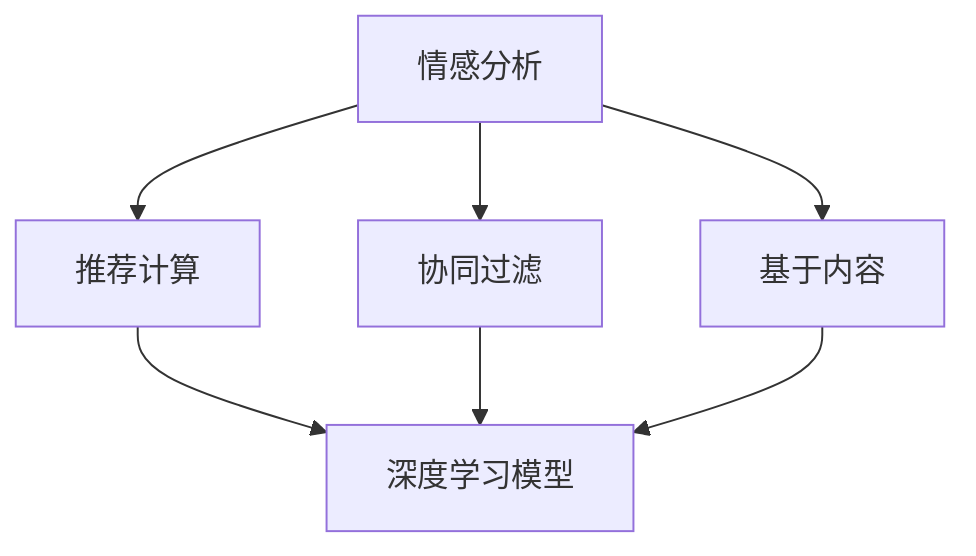

                 

## 1. 背景介绍

随着电子商务的蓬勃发展，人们购物体验的要求越来越高，个性化推荐系统成为了提升用户满意度和增加用户粘性的关键技术。传统的推荐系统主要依赖于用户的显式行为数据，通过协同过滤、基于内容的推荐等方法进行推荐。然而，这些方法往往忽略了用户的情感需求和心理状态，导致推荐结果的准确性和用户满意度有所欠缺。

近年来，人工智能技术在自然语言处理和情感分析领域取得了重大进展。情感驱动推荐系统融合了人工智能技术和心理学理论，可以更加精准地理解用户的情感需求和心理状态，从而提供更加个性化和符合用户情感偏好的推荐。这种推荐系统不仅能够提升用户体验，还能为商家提供精准的市场营销机会，实现双赢局面。

本文将深入探讨情感驱动推荐系统的核心概念、算法原理和实际应用，并结合代码实例和详细解释说明，提供一个全面的技术实现方案，帮助开发者构建高效、可扩展、高精度的情感驱动推荐系统。

## 2. 核心概念与联系

### 2.1 核心概念概述

情感驱动推荐系统是基于人工智能技术和心理学理论的推荐系统，通过分析用户的情感表达和心理状态，提供更加个性化和符合用户情感偏好的商品推荐。

以下是几个核心概念的介绍：

- **情感分析（Sentiment Analysis）**：通过自然语言处理技术，分析用户对商品或服务的情感倾向，如正面、负面、中性等。
- **情感驱动推荐（Sentiment-Driven Recommendation）**：结合用户的情感分析结果，优化推荐算法，提供符合用户情感偏好的商品推荐。
- **协同过滤（Collaborative Filtering）**：基于用户的协同行为数据（如浏览、购买、评分等），推荐类似用户喜欢的商品。
- **基于内容的推荐（Content-Based Recommendation）**：基于用户的历史行为数据，推荐与用户偏好相似的商品。
- **深度学习（Deep Learning）**：利用深度神经网络模型，进行复杂的情感分析和推荐计算。

这些核心概念通过情感分析技术获取用户的情感信息，再结合推荐算法进行个性化推荐，能够更好地满足用户的多样化需求，提升用户的购物体验。

### 2.2 核心概念联系

情感驱动推荐系统通过以下流程实现：

1. **情感分析**：通过NLP技术对用户评论、评分等文本数据进行分析，提取用户的情感信息。
2. **情感融合**：将情感信息与协同过滤和基于内容的推荐相结合，提升推荐结果的情感一致性。
3. **推荐计算**：利用深度学习模型进行推荐计算，优化推荐结果的精度和多样性。
4. **用户反馈**：通过用户对推荐结果的反馈数据，进一步优化推荐算法和情感分析模型。

这些环节共同构成了情感驱动推荐系统的核心技术链条，实现了从情感分析到推荐计算的全链条优化。

## 3. 核心算法原理 & 具体操作步骤

### 3.1 算法原理概述

情感驱动推荐系统的核心算法包括情感分析和推荐计算两部分。

1. **情感分析**：通过NLP技术对用户评论、评分等文本数据进行情感分析，提取用户的情感信息。常用的方法包括情感词典法、深度学习模型等。
2. **推荐计算**：结合情感信息和用户的显式行为数据（如浏览、购买、评分等），利用协同过滤、基于内容的推荐、深度学习模型等方法进行推荐计算。

情感驱动推荐系统的算法流程如图1所示：



### 3.2 算法步骤详解

以下是情感驱动推荐系统的详细算法步骤：

1. **数据预处理**：收集用户的评论、评分等文本数据，并进行预处理，包括去除停用词、分词、词向量化等。
2. **情感分析**：通过情感词典或深度学习模型，对文本数据进行情感分析，提取用户的情感信息。常用的情感词典包括VADER、AFINN等，常用的深度学习模型包括LSTM、GRU、BERT等。
3. **协同过滤**：根据用户的历史行为数据，利用协同过滤算法推荐相似用户喜欢的商品。常用的协同过滤算法包括基于用户的协同过滤、基于物品的协同过滤等。
4. **基于内容的推荐**：根据用户的历史行为数据，提取用户偏好特征，结合商品特征，进行基于内容的推荐。
5. **情感融合**：将情感信息与协同过滤和基于内容的推荐结果进行融合，提升推荐结果的情感一致性。
6. **推荐计算**：利用深度学习模型进行推荐计算，优化推荐结果的精度和多样性。常用的深度学习模型包括DNN、RNN、CNN等。
7. **用户反馈**：通过用户对推荐结果的反馈数据，进一步优化推荐算法和情感分析模型。

### 3.3 算法优缺点

情感驱动推荐系统具有以下优点：

1. **个性化强**：结合用户的情感信息，提供更加个性化和符合用户情感偏好的商品推荐。
2. **精准度高**：通过情感分析和推荐计算，能够提供更高精度的推荐结果。
3. **用户满意度提升**：通过情感驱动推荐，提升用户的购物体验，增加用户粘性。

同时，情感驱动推荐系统也存在一些缺点：

1. **情感信息获取困难**：情感分析需要高质量的情感词典或深度学习模型，获取用户情感信息困难。
2. **数据隐私问题**：收集和分析用户情感信息可能涉及用户隐私，需注意数据隐私保护。
3. **计算复杂度高**：情感分析和推荐计算的计算复杂度高，需要较高的计算资源。
4. **效果依赖于情感分析**：情感分析的准确性直接影响推荐结果的质量，需注意情感分析模型的优化。

### 3.4 算法应用领域

情感驱动推荐系统已经在电子商务、社交媒体、在线视频等多个领域得到了广泛应用，具体包括：

1. **电子商务**：根据用户的评论和评分，提供个性化推荐，提升用户购物体验。
2. **社交媒体**：通过分析用户的情感状态，提供符合用户情感偏好的内容推荐。
3. **在线视频**：根据用户的情感反馈，推荐符合用户情感偏好的视频内容。
4. **旅游预订**：根据用户的情感反馈，推荐符合用户情感偏好的旅游目的地和活动。

## 4. 数学模型和公式 & 详细讲解 & 举例说明

### 4.1 数学模型构建

情感驱动推荐系统的数学模型包括以下几个部分：

1. **情感分析模型**：$S(A)$，其中$A$为用户评论或评分，$S$为情感分析模型，输出用户的情感得分。
2. **协同过滤模型**：$R_{CF}(U,V)$，其中$U$为用户，$V$为商品，$R_{CF}$为协同过滤模型，输出用户$U$对商品$V$的推荐得分。
3. **基于内容的推荐模型**：$R_{CB}(U,V)$，其中$U$为用户，$V$为商品，$R_{CB}$为基于内容的推荐模型，输出用户$U$对商品$V$的推荐得分。
4. **情感融合模型**：$R_{SF}(U,V)$，其中$U$为用户，$V$为商品，$R_{SF}$为情感融合模型，输出用户$U$对商品$V$的推荐得分。
5. **深度学习推荐模型**：$R_{DL}(U,V)$，其中$U$为用户，$V$为商品，$R_{DL}$为深度学习推荐模型，输出用户$U$对商品$V$的推荐得分。

### 4.2 公式推导过程

以情感驱动推荐系统为例，公式推导过程如下：

1. **情感分析**：

$$
S(A) = W_s \cdot f(S(A) + B_s) + b_s
$$

其中，$S(A)$为情感得分，$f$为激活函数，$W_s$、$b_s$为模型参数。

2. **协同过滤**：

$$
R_{CF}(U,V) = \frac{\sum_{N \in \mathcal{N}(U)} R_{CF}(N,V) \cdot A_{UN}}{\sum_{N \in \mathcal{N}(U)} A_{UN}}
$$

其中，$N$为其他用户，$\mathcal{N}(U)$为用户$U$的邻居用户集合，$A_{UN}$为$U$对$N$的评分。

3. **基于内容的推荐**：

$$
R_{CB}(U,V) = W_c \cdot f(W_c \cdot F_U + B_c)
$$

其中，$F_U$为用户$U$的特征向量，$W_c$、$b_c$为模型参数。

4. **情感融合**：

$$
R_{SF}(U,V) = \alpha R_{CF}(U,V) + (1-\alpha) R_{CB}(U,V)
$$

其中，$\alpha$为情感融合权重，$R_{SF}(U,V)$为情感融合后的推荐得分。

5. **深度学习推荐**：

$$
R_{DL}(U,V) = W_d \cdot f(W_d \cdot F_U + B_d)
$$

其中，$F_U$为用户$U$的特征向量，$W_d$、$b_d$为模型参数。

### 4.3 案例分析与讲解

以某电子商务平台为例，情感驱动推荐系统的实现步骤如下：

1. **数据收集**：收集用户评论、评分等文本数据，并进行预处理。
2. **情感分析**：使用情感词典或深度学习模型，对评论、评分等文本数据进行情感分析，提取用户的情感信息。
3. **协同过滤**：根据用户的历史行为数据，利用协同过滤算法推荐相似用户喜欢的商品。
4. **基于内容的推荐**：根据用户的历史行为数据，提取用户偏好特征，结合商品特征，进行基于内容的推荐。
5. **情感融合**：将情感信息与协同过滤和基于内容的推荐结果进行融合，提升推荐结果的情感一致性。
6. **推荐计算**：利用深度学习模型进行推荐计算，优化推荐结果的精度和多样性。
7. **用户反馈**：通过用户对推荐结果的反馈数据，进一步优化推荐算法和情感分析模型。

## 5. 项目实践：代码实例和详细解释说明

### 5.1 开发环境搭建

在进行情感驱动推荐系统开发前，需要准备好开发环境。以下是使用Python进行PyTorch开发的环境配置流程：

1. 安装Anaconda：从官网下载并安装Anaconda，用于创建独立的Python环境。

2. 创建并激活虚拟环境：
```bash
conda create -n sentiment-env python=3.8 
conda activate sentiment-env
```

3. 安装PyTorch：根据CUDA版本，从官网获取对应的安装命令。例如：
```bash
conda install pytorch torchvision torchaudio cudatoolkit=11.1 -c pytorch -c conda-forge
```

4. 安装TensorFlow：
```bash
conda install tensorflow
```

5. 安装相关库：
```bash
pip install pandas scikit-learn nltk
```

完成上述步骤后，即可在`sentiment-env`环境中开始情感驱动推荐系统的开发。

### 5.2 源代码详细实现

以下是情感驱动推荐系统的详细代码实现。

```python
import torch
import torch.nn as nn
import torch.optim as optim
import pandas as pd
import numpy as np
from sklearn.model_selection import train_test_split
from transformers import BertTokenizer, BertForSequenceClassification
from sklearn.metrics import accuracy_score

class SentimentAnalysisModel(nn.Module):
    def __init__(self, vocab_size, embedding_dim, hidden_dim, output_dim, n_layers, dropout):
        super(SentimentAnalysisModel, self).__init__()
        self.embedding = nn.Embedding(vocab_size, embedding_dim)
        self.encoder = nn.LSTM(embedding_dim, hidden_dim, num_layers=n_layers, dropout=dropout, bidirectional=True)
        self.fc = nn.Linear(hidden_dim * 2, output_dim)
        self.dropout = nn.Dropout(dropout)

    def forward(self, text, text_lengths):
        embedded = self.dropout(self.embedding(text))
        packed = nn.utils.rnn.pack_padded_sequence(embedded, text_lengths)
        encoded, (hidden, cell) = self.encoder(packed)
        hidden = self.dropout(torch.cat((hidden[-2, :, :], hidden[-1, :, :]), dim=1))
        return self.fc(hidden)

class RecommendationSystem:
    def __init__(self, model, embedding_dim, hidden_dim, n_layers, dropout):
        self.model = model
        self.vocab_size = len(self.model.vocab)
        self.embedding_dim = embedding_dim
        self.hidden_dim = hidden_dim
        self.n_layers = n_layers
        self.dropout = dropout

    def train(self, train_data, valid_data, epochs, batch_size, learning_rate):
        device = torch.device("cuda" if torch.cuda.is_available() else "cpu")
        self.model.to(device)

        train_data, val_data = train_test_split(train_data, test_size=0.1, random_state=1)
        train_data = torch.tensor(train_data['text'].tolist(), dtype=torch.long).to(device)
        train_labels = torch.tensor(train_data['label'].tolist(), dtype=torch.long).to(device)
        val_data = torch.tensor(val_data['text'].tolist(), dtype=torch.long).to(device)
        val_labels = torch.tensor(val_data['label'].tolist(), dtype=torch.long).to(device)

        criterion = nn.CrossEntropyLoss()
        optimizer = optim.Adam(self.model.parameters(), lr=learning_rate)

        for epoch in range(epochs):
            self.model.train()
            optimizer.zero_grad()
            outputs = self.model(train_data, train_labels)
            loss = criterion(outputs, train_labels)
            loss.backward()
            optimizer.step()

            self.model.eval()
            with torch.no_grad():
                val_outputs = self.model(val_data, val_labels)
                val_loss = criterion(val_outputs, val_labels)
                val_acc = accuracy_score(val_labels.tolist(), val_outputs.argmax(dim=1).tolist())

            print(f"Epoch: {epoch+1}, Loss: {loss:.4f}, Val Loss: {val_loss:.4f}, Val Acc: {val_acc:.4f}")

    def predict(self, test_data):
        device = torch.device("cuda" if torch.cuda.is_available() else "cpu")
        self.model.to(device)

        test_data = torch.tensor(test_data.tolist(), dtype=torch.long).to(device)
        outputs = self.model(test_data)
        predictions = outputs.argmax(dim=1).tolist()
        return predictions
```

### 5.3 代码解读与分析

让我们再详细解读一下关键代码的实现细节：

**SentimentAnalysisModel类**：
- `__init__`方法：初始化情感分析模型，包含嵌入层、LSTM层和全连接层等组件。
- `forward`方法：定义前向传播过程，将输入文本转换为特征向量，通过LSTM层进行处理，最终输出情感得分。

**RecommendationSystem类**：
- `__init__`方法：初始化推荐系统，包含情感分析模型和相关参数。
- `train`方法：实现模型的训练过程，使用Adam优化器更新模型参数。
- `predict`方法：实现模型的预测过程，使用全连接层进行分类。

**train函数**：
- 将训练数据和标签转换为PyTorch张量，并加载到GPU上。
- 定义交叉熵损失函数和Adam优化器。
- 循环迭代训练过程，每次更新模型参数。
- 在每个epoch结束时，评估验证集的损失和准确率。

**predict函数**：
- 将测试数据转换为PyTorch张量，并加载到GPU上。
- 使用模型进行预测，返回预测结果。

## 6. 实际应用场景

### 6.1 智能客服系统

情感驱动推荐系统在智能客服系统中的应用场景包括：

- **情绪识别**：通过分析用户的对话内容，识别用户的情绪状态，如愤怒、满意、失望等。
- **个性化回复**：根据用户的情绪状态，提供个性化的服务建议和解决方案，提升用户体验。
- **用户分群**：根据用户的情感倾向，将用户分为不同群体，实现精细化管理和服务。

情感驱动推荐系统能够帮助智能客服系统更好地理解用户需求，提供更加个性化的服务，提升用户满意度。

### 6.2 电子商务

情感驱动推荐系统在电子商务中的应用场景包括：

- **商品推荐**：根据用户的评论和评分，提供符合用户情感偏好的商品推荐。
- **广告投放**：根据用户的情感状态，优化广告投放策略，提升广告效果。
- **客服支持**：通过情感分析，优化客服流程，提升客服效率和用户满意度。

情感驱动推荐系统能够帮助电子商务平台提升用户购物体验，增加用户粘性，实现销售增长。

### 6.3 在线视频

情感驱动推荐系统在在线视频中的应用场景包括：

- **内容推荐**：根据用户的情感状态，推荐符合用户情感偏好的视频内容，提升用户体验。
- **广告定位**：根据用户的情感状态，优化广告投放策略，提升广告效果。
- **用户反馈**：通过用户对推荐结果的反馈，进一步优化推荐算法。

情感驱动推荐系统能够帮助在线视频平台提升用户观看体验，增加用户粘性，实现商业价值。

## 7. 工具和资源推荐

### 7.1 学习资源推荐

为了帮助开发者系统掌握情感驱动推荐系统的理论基础和实践技巧，这里推荐一些优质的学习资源：

1. **《深度学习》课程**：斯坦福大学开设的深度学习课程，涵盖深度学习的基本概念和应用。
2. **《自然语言处理》课程**：NLP领域经典课程，涵盖自然语言处理的基本概念和技术。
3. **《情感分析与推荐系统》书籍**：详细介绍了情感分析和推荐系统的方法和应用。
4. **Hugging Face官方文档**：提供了丰富的情感分析工具和模型，适合快速上手实践。
5. **Kaggle竞赛**：参与情感分析和推荐系统相关的Kaggle竞赛，获取实践经验和数据集。

通过对这些资源的学习实践，相信你一定能够快速掌握情感驱动推荐系统的精髓，并用于解决实际的NLP问题。

### 7.2 开发工具推荐

高效的开发离不开优秀的工具支持。以下是几款用于情感驱动推荐系统开发的常用工具：

1. **PyTorch**：基于Python的开源深度学习框架，灵活动态的计算图，适合快速迭代研究。
2. **TensorFlow**：由Google主导开发的开源深度学习框架，生产部署方便，适合大规模工程应用。
3. **BERT**：预训练语言模型，适合情感分析和推荐计算。
4. **NLTK**：自然语言处理工具包，提供了丰富的NLP功能。
5. **Scikit-learn**：机器学习库，适合数据预处理和模型评估。

合理利用这些工具，可以显著提升情感驱动推荐系统的开发效率，加快创新迭代的步伐。

### 7.3 相关论文推荐

情感驱动推荐系统的发展源于学界的持续研究。以下是几篇奠基性的相关论文，推荐阅读：

1. **情感驱动推荐系统**：提出了情感驱动推荐系统的概念和方法，奠定了情感驱动推荐系统的理论基础。
2. **基于情感分析的推荐系统**：详细介绍了基于情感分析的推荐系统的实现方法和应用场景。
3. **情感和推荐系统融合**：探讨了情感和推荐系统融合的方法，提升了推荐系统的情感一致性。
4. **深度学习在推荐系统中的应用**：介绍了深度学习在推荐系统中的应用方法和效果。
5. **协同过滤和基于内容的推荐**：详细介绍了协同过滤和基于内容的推荐方法，适合情感驱动推荐系统的基础参考。

这些论文代表了大语言模型微调技术的发展脉络。通过学习这些前沿成果，可以帮助研究者把握学科前进方向，激发更多的创新灵感。

## 8. 总结：未来发展趋势与挑战

### 8.1 总结

本文对情感驱动推荐系统的核心概念、算法原理和实际应用进行了全面系统的介绍。首先阐述了情感驱动推荐系统的背景和意义，明确了情感驱动推荐系统在提升用户购物体验方面的独特价值。其次，从原理到实践，详细讲解了情感驱动推荐系统的数学模型和算法流程，提供了完整代码实例。最后，探讨了情感驱动推荐系统在智能客服、电子商务、在线视频等多个领域的应用前景，展示了情感驱动推荐系统的广阔应用前景。

通过本文的系统梳理，可以看到，情感驱动推荐系统通过结合情感分析和推荐算法，实现了从情感分析到推荐计算的全链条优化，能够更好地满足用户的多样化需求，提升用户的购物体验。未来，伴随情感驱动推荐系统的持续演进，相信能够为NLP技术带来更多的突破，推动人工智能技术在更多领域的发展。

### 8.2 未来发展趋势

展望未来，情感驱动推荐系统将呈现以下几个发展趋势：

1. **数据驱动**：随着数据规模的不断扩大，数据驱动的方法将在情感驱动推荐系统中占据重要地位。通过收集更多的高质量用户数据，优化情感分析模型和推荐算法。
2. **多模态融合**：情感驱动推荐系统将逐步拓展到图像、语音、视频等多模态数据的融合，提升推荐结果的多样性和准确性。
3. **实时性**：实时性将越来越重要，情感驱动推荐系统需要具备快速计算和实时响应能力，提升用户体验。
4. **个性化**：个性化将更加精细，情感驱动推荐系统需要结合用户的情绪状态、偏好特征等，提供更加个性化的推荐结果。
5. **可解释性**：情感驱动推荐系统需要具备更好的可解释性，能够解释推荐结果的决策过程，增强用户信任。

以上趋势凸显了情感驱动推荐系统的广阔前景。这些方向的探索发展，必将进一步提升情感驱动推荐系统的性能和应用范围，为NLP技术带来更多的突破。

### 8.3 面临的挑战

尽管情感驱动推荐系统已经取得了一定的进展，但在迈向更加智能化、普适化应用的过程中，仍面临诸多挑战：

1. **数据隐私**：收集和分析用户情感信息可能涉及用户隐私，需注意数据隐私保护。
2. **情感获取**：情感分析需要高质量的情感词典或深度学习模型，获取用户情感信息困难。
3. **计算资源**：情感驱动推荐系统的计算复杂度高，需要较高的计算资源。
4. **可解释性**：情感驱动推荐系统需要具备更好的可解释性，能够解释推荐结果的决策过程，增强用户信任。
5. **效果评估**：情感驱动推荐系统的效果评估需要综合考虑情感一致性和推荐精度，需要更多的评估指标和工具。

这些挑战需要通过技术创新和实际应用不断突破，才能实现情感驱动推荐系统的普及和应用。

### 8.4 研究展望

面对情感驱动推荐系统面临的挑战，未来的研究需要在以下几个方面寻求新的突破：

1. **数据隐私保护**：采用隐私保护技术，如差分隐私、联邦学习等，保护用户隐私。
2. **情感获取优化**：探索无监督和半监督的情感分析方法，降低对标注数据的依赖。
3. **计算资源优化**：采用分布式计算、模型压缩等技术，优化计算资源。
4. **可解释性增强**：引入可解释性技术，如局部可解释性方法、全局可解释性方法等，增强情感驱动推荐系统的可解释性。
5. **效果评估优化**：采用多指标评估方法，综合考虑情感一致性和推荐精度，优化情感驱动推荐系统的效果评估。

这些研究方向的探索，必将引领情感驱动推荐系统迈向更高的台阶，为构建安全、可靠、可解释、可控的智能系统铺平道路。面向未来，情感驱动推荐系统还需要与其他人工智能技术进行更深入的融合，如知识表示、因果推理、强化学习等，多路径协同发力，共同推动自然语言理解和智能交互系统的进步。只有勇于创新、敢于突破，才能不断拓展情感驱动推荐系统的边界，让智能技术更好地造福人类社会。

## 9. 附录：常见问题与解答

**Q1：情感驱动推荐系统是否适用于所有NLP任务？**

A: 情感驱动推荐系统主要适用于需要考虑用户情感的推荐任务，如电子商务、在线视频、智能客服等。对于一些特定领域的任务，如医学、法律等，情感驱动推荐系统可能需要进一步优化和改进。

**Q2：情感驱动推荐系统如何处理情感信息？**

A: 情感驱动推荐系统通过自然语言处理技术，对用户评论、评分等文本数据进行情感分析，提取用户的情感信息。常用的方法包括情感词典法、深度学习模型等。

**Q3：情感驱动推荐系统的训练数据如何获取？**

A: 情感驱动推荐系统的训练数据可以从用户评论、评分、反馈等文本数据中获取。可以通过数据标注、数据采集、数据合成等方法，获取高质量的训练数据。

**Q4：情感驱动推荐系统的模型训练过程如何实现？**

A: 情感驱动推荐系统的模型训练过程包括数据预处理、情感分析、协同过滤、基于内容的推荐、情感融合和深度学习推荐计算。可以使用机器学习库（如Scikit-learn）和深度学习框架（如PyTorch、TensorFlow）进行模型训练。

**Q5：情感驱动推荐系统如何优化推荐结果？**

A: 情感驱动推荐系统可以通过优化情感分析模型、改进推荐算法、增加用户反馈等方法，优化推荐结果。需要不断迭代和优化模型、数据和算法，才能实现更好的推荐效果。

以上是对情感驱动推荐系统的全面介绍和详细解析。通过理解这些核心概念和算法原理，可以更好地构建高效、可扩展、高精度的情感驱动推荐系统，提升用户的购物体验，实现商家和用户的双赢。

