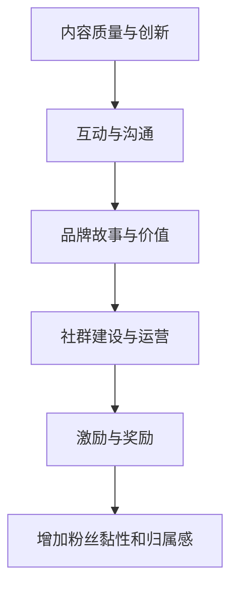

                 

# 打造个人品牌周边：增加粉丝黏性和归属感

在互联网时代，个人品牌不仅是职业成就的体现，更是个人价值和影响力的象征。无论你是技术专家、创业者、作家还是艺术家，打造一个有特色、有深度、有吸引力的个人品牌，都是塑造职业形象、吸引更多关注和合作的关键。本文将从核心概念、算法原理、操作步骤等方面，深入探讨如何通过增加粉丝黏性和归属感，打造强有力的个人品牌周边，进一步提升个人品牌的价值。

## 1. 背景介绍

### 1.1 问题由来

在数字时代，个人品牌的建设比以往任何时候都重要。随着社交媒体、内容平台和自媒体的崛起，每个人都有机会通过互联网展示自己的专业能力和独特魅力。然而，个人品牌的建设并非易事，需要在内容创造、社交互动、品牌推广等多方面下功夫。其中，增加粉丝的黏性和归属感，是构建稳固、活跃、忠诚粉丝团体的重要步骤。

### 1.2 问题核心关键点

增加粉丝黏性和归属感的关键在于：

1. **内容质量与创新**：持续提供高质量、有深度、有创新性的内容，满足粉丝的多样化需求，增强粉丝的兴趣和期待。
2. **互动与沟通**：通过社交媒体、问答、直播等方式，与粉丝进行互动，建立信任和联系，提高粉丝的参与感和归属感。
3. **品牌故事与价值**：讲述个人品牌背后的故事，传递独特的品牌价值和使命，让粉丝与品牌产生情感共鸣。
4. **社群建设与运营**：建立和运营一个活跃、有价值、有组织的粉丝社群，增强粉丝的归属感和凝聚力。
5. **激励与奖励**：通过设置激励机制和奖励措施，鼓励粉丝积极参与，增强粉丝的忠诚度和参与度。

这些关键点构成了打造个人品牌周边、增加粉丝黏性和归属感的基本框架。以下将从这些方面入手，详细探讨具体的操作方法。

## 2. 核心概念与联系

### 2.1 核心概念概述

为更好地理解增加粉丝黏性和归属感的方法，本节将介绍几个关键概念：

- **内容质量与创新**：通过高质量的内容输出，持续吸引和留住粉丝，并不断引入新的创意和观点。
- **互动与沟通**：利用社交媒体、问答平台、直播等形式，与粉丝建立深度互动，增强粉丝的参与感和归属感。
- **品牌故事与价值**：讲述个人品牌的成长历程、核心价值和使命，让粉丝认同并传播品牌理念。
- **社群建设与运营**：建立和运营一个有组织、有价值的粉丝社群，通过社群活动增强粉丝的归属感和忠诚度。
- **激励与奖励**：通过设置激励机制，如专属会员、特别活动、奖励积分等，提升粉丝的参与积极性和忠诚度。

这些概念之间相互关联，共同作用于粉丝黏性和归属感的增强。以下将通过Mermaid流程图展示这些概念的联系：



这个流程图展示了从内容创新到社群运营的完整过程，每一步都对增强粉丝黏性和归属感起着重要作用。

## 3. 核心算法原理 & 具体操作步骤

### 3.1 算法原理概述

增加粉丝黏性和归属感的方法，本质上是一个多层次、多维度的系统工程。其核心在于通过不断优化内容、加强互动、传递价值、构建社群、设置激励等手段，逐步提升粉丝的参与度和忠诚度。以下是具体的操作步骤：

### 3.2 算法步骤详解

#### 步骤1：内容质量与创新

**操作步骤**：
1. **内容规划与输出**：根据个人品牌定位和粉丝需求，制定内容规划，包括博客文章、视频、播客、直播等多种形式的内容。
2. **内容优化与迭代**：通过数据分析和反馈收集，不断优化内容质量和形式，引入新的创意和观点，保持内容的新鲜感和吸引力。
3. **内容推广与传播**：利用社交媒体、SEO等手段，广泛传播优质内容，吸引更多潜在粉丝关注和参与。

**算法原理**：
通过内容的多样化和创新性，满足不同粉丝的需求和兴趣，提升粉丝的参与度和满意度。内容质量和创新性的提升，不仅能增强粉丝的黏性，还能吸引新粉丝加入。

#### 步骤2：互动与沟通

**操作步骤**：
1. **社交媒体互动**：在各大社交媒体平台（如微博、知乎、YouTube等）上，积极与粉丝互动，回复评论、点赞、分享粉丝内容。
2. **问答平台参与**：在问答平台（如知乎、Quora等）上，积极回答问题，参与讨论，提供专业见解。
3. **直播互动**：定期举办直播活动，与粉丝进行实时互动，分享行业见解、经验交流、技术展示等。

**算法原理**：
通过高频次的互动和沟通，建立信任和联系，增强粉丝的参与感和归属感。互动是双向的，通过积极的互动，不仅能提升粉丝的满意度，还能让品牌形象更加鲜活、有温度。

#### 步骤3：品牌故事与价值

**操作步骤**：
1. **品牌故事撰写**：撰写个人品牌背后的故事，包括创立初衷、发展历程、核心价值等。
2. **品牌价值传播**：通过内容、演讲、访谈等方式，广泛传播品牌故事和价值，增强粉丝的认同感和归属感。
3. **品牌使命传递**：明确品牌的使命和愿景，传递品牌对社会、行业、用户的贡献和影响，让粉丝与品牌产生情感共鸣。

**算法原理**：
通过讲述有深度、有情感的品牌故事，传递独特的品牌价值和使命，让粉丝与品牌产生共鸣，从而增强品牌的黏性和忠诚度。

#### 步骤4：社群建设与运营

**操作步骤**：
1. **社群建立**：利用社交媒体、论坛、QQ群等平台，建立有组织、有价值、有规则的粉丝社群。
2. **社群活动策划**：定期策划和举办社群活动，如主题讨论、线上线下活动、专属会员等，增强社群的活跃度和凝聚力。
3. **社群管理与维护**：建立社群管理团队，制定社群规则，积极维护社群秩序，解答粉丝疑问，增强社群的归属感和忠诚度。

**算法原理**：
通过建立和运营有组织的社群，提供丰富的活动和资源，增强粉丝的参与感和归属感。社群不仅能提升粉丝的互动性和黏性，还能通过传播效应，吸引更多潜在粉丝加入。

#### 步骤5：激励与奖励

**操作步骤**：
1. **会员体系设计**：设计会员等级体系，通过积分、特权、专享内容等方式，激励粉丝积极参与。
2. **特别活动举办**：举办专属会员活动，如专属直播、特别优惠、限量周边等，提升会员的忠诚度和参与度。
3. **奖励机制设置**：设置多种奖励措施，如优秀内容表彰、粉丝评选、特别嘉宾邀请等，增强粉丝的荣誉感和归属感。

**算法原理**：
通过设置激励和奖励机制，提升粉丝的参与积极性和忠诚度。激励措施不仅能增强粉丝的归属感，还能促进内容的创新和传播，形成一个良性循环。

### 3.3 算法优缺点

#### 优点

1. **多层次提升**：通过内容质量、互动沟通、品牌故事、社群建设、激励奖励等多层次操作，全面提升粉丝黏性和归属感。
2. **高效率**：利用算法和数据分析，精准定位粉丝需求，优化内容质量和互动策略，提高品牌推广和互动效率。
3. **灵活性**：根据不同平台和粉丝群体的特点，灵活调整内容和互动策略，满足多样化的需求。

#### 缺点

1. **时间和精力投入大**：全面提升粉丝黏性和归属感需要持续的内容输出和互动维护，对时间和精力的要求较高。
2. **资源配置复杂**：需要合理分配资源，如内容产出、社群管理、奖励机制等，确保各项操作的有效性和持续性。
3. **效果衡量困难**：粉丝黏性和归属感的提升是一个长期过程，效果衡量较为困难，需要多维度的数据分析和反馈机制。

### 3.4 算法应用领域

增加粉丝黏性和归属感的方法，不仅适用于个人品牌建设，还广泛应用于各类线上线下社群、品牌营销、社交电商等领域。例如：

- **社群管理**：通过建立有组织、有价值的社群，增强粉丝的归属感和忠诚度。
- **品牌推广**：利用社交媒体、问答平台、直播等形式，广泛传播品牌故事和价值，提升品牌知名度和美誉度。
- **电商运营**：通过会员体系、专属活动、奖励机制等，增强粉丝的购买忠诚度和参与度。
- **内容创作**：通过多样化、创新性的内容输出，满足不同粉丝的需求和兴趣，提升内容的吸引力和传播力。
- **市场营销**：利用数据分析和反馈机制，优化营销策略，提升市场推广的效果和效率。

## 4. 数学模型和公式 & 详细讲解 & 举例说明

### 4.1 数学模型构建

增加粉丝黏性和归属感的方法，可以构建为一个多层次的目标函数，如下所示：

$$
F = \alpha \cdot C + \beta \cdot I + \gamma \cdot B + \delta \cdot G + \epsilon \cdot M
$$

其中：
- $F$ 表示总得分，即粉丝黏性和归属感的综合评价。
- $C$ 表示内容质量与创新，通过内容质量和创新的综合指标计算。
- $I$ 表示互动与沟通，通过互动频率和质量的综合指标计算。
- $B$ 表示品牌故事与价值，通过品牌故事和价值的综合指标计算。
- $G$ 表示社群建设与运营，通过社群活跃度和凝聚力的综合指标计算。
- $M$ 表示激励与奖励，通过激励措施和奖励机制的综合指标计算。
- $\alpha$、$\beta$、$\gamma$、$\delta$、$\epsilon$ 分别表示各项指标的权重，根据实际情况进行调整。

### 4.2 公式推导过程

为了简化计算，以下对各项指标的计算公式进行推导：

#### 内容质量与创新（$C$）

$$
C = \sum_{i=1}^n C_i
$$

其中 $C_i$ 表示第 $i$ 个内容的质量和创新性，可以通过内容阅读量、点赞数、评论数、转发数等指标计算。

$$
C_i = r_i \cdot \omega_1 + p_i \cdot \omega_2 + c_i \cdot \omega_3 + t_i \cdot \omega_4
$$

其中 $r_i$ 表示内容的阅读量，$p_i$ 表示点赞数，$c_i$ 表示评论数，$t_i$ 表示转发数，$\omega_1$、$\omega_2$、$\omega_3$、$\omega_4$ 分别表示各项指标的权重。

#### 互动与沟通（$I$）

$$
I = \sum_{i=1}^n I_i
$$

其中 $I_i$ 表示第 $i$ 次互动的质量和频率，可以通过互动次数、回复质量、评论深度等指标计算。

$$
I_i = f_i \cdot \omega_5 + r_i \cdot \omega_6 + c_i \cdot \omega_7
$$

其中 $f_i$ 表示互动次数，$r_i$ 表示回复质量，$c_i$ 表示评论深度，$\omega_5$、$\omega_6$、$\omega_7$ 分别表示各项指标的权重。

#### 品牌故事与价值（$B$）

$$
B = \sum_{i=1}^n B_i
$$

其中 $B_i$ 表示第 $i$ 个品牌故事或价值点，可以通过故事阅读量、点赞数、评论数等指标计算。

$$
B_i = s_i \cdot \omega_8 + p_i \cdot \omega_9 + c_i \cdot \omega_{10}
$$

其中 $s_i$ 表示故事阅读量，$p_i$ 表示点赞数，$c_i$ 表示评论数，$\omega_8$、$\omega_9$、$\omega_{10}$ 分别表示各项指标的权重。

#### 社群建设与运营（$G$）

$$
G = \sum_{i=1}^n G_i
$$

其中 $G_i$ 表示第 $i$ 个社群活动的质量和活跃度，可以通过活动参与次数、互动频率、满意度等指标计算。

$$
G_i = a_i \cdot \omega_{11} + f_i \cdot \omega_{12} + s_i \cdot \omega_{13}
$$

其中 $a_i$ 表示活动参与次数，$f_i$ 表示互动频率，$s_i$ 表示满意度，$\omega_{11}$、$\omega_{12}$、$\omega_{13}$ 分别表示各项指标的权重。

#### 激励与奖励（$M$）

$$
M = \sum_{i=1}^n M_i
$$

其中 $M_i$ 表示第 $i$ 个激励或奖励措施，可以通过会员积分、专属内容、特别活动等指标计算。

$$
M_i = i_i \cdot \omega_{14} + c_i \cdot \omega_{15} + a_i \cdot \omega_{16}
$$

其中 $i_i$ 表示会员积分，$c_i$ 表示专属内容，$a_i$ 表示特别活动，$\omega_{14}$、$\omega_{15}$、$\omega_{16}$ 分别表示各项指标的权重。

### 4.3 案例分析与讲解

#### 案例1：科技博主的社群建设

某科技博主在微博上拥有大量粉丝，希望通过社群建设增加粉丝黏性和归属感。具体措施如下：

1. **内容质量与创新**：博主定期发布高质量的科技文章和视频，并通过数据统计分析调整内容方向。
2. **互动与沟通**：博主在微博、知乎等平台积极回复粉丝评论，举办在线问答和直播活动，增强与粉丝的互动。
3. **品牌故事与价值**：博主讲述自己的技术创业经历和成长故事，传递科技改变世界的价值观。
4. **社群建设与运营**：博主建立专门的微信群，定期举办技术分享和讨论，增强社群的活跃度和凝聚力。
5. **激励与奖励**：博主设置会员体系，通过专属内容、特别活动等方式激励粉丝参与，增强粉丝的忠诚度和归属感。

通过以上措施，博主不仅提升了内容的吸引力和粉丝的满意度，还增强了社群的凝聚力和粉丝的归属感，有效提升了个人品牌的影响力和价值。

## 5. 项目实践：代码实例和详细解释说明

### 5.1 开发环境搭建

为了进行项目实践，我们需要搭建一个开发环境。以下是搭建Python开发环境的具体步骤：

1. **安装Python**：从官网下载Python安装包，进行安装。
2. **安装Pip**：在Python安装包目录下的Scripts文件夹中找到pip.exe文件，运行pip.exe安装。
3. **安装必要的库**：通过Pip安装所需的库，如Flask、SQLAlchemy、Jinja2等。

### 5.2 源代码详细实现

以下是一个简单的Python Flask应用，用于展示如何通过API接口进行粉丝互动和内容管理：

```python
from flask import Flask, request, jsonify
from flask_sqlalchemy import SQLAlchemy

app = Flask(__name__)
app.config['SQLALCHEMY_DATABASE_URI'] = 'sqlite:///fan_interaction.db'
db = SQLAlchemy(app)

class User(db.Model):
    id = db.Column(db.Integer, primary_key=True)
    username = db.Column(db.String(80), unique=True, nullable=False)
    email = db.Column(db.String(120), unique=True, nullable=False)
    is_premium = db.Column(db.Boolean, default=False)

class Content(db.Model):
    id = db.Column(db.Integer, primary_key=True)
    title = db.Column(db.String(120), nullable=False)
    content = db.Column(db.Text, nullable=False)
    user_id = db.Column(db.Integer, db.ForeignKey('user.id'), nullable=False)

@app.route('/user/register', methods=['POST'])
def register():
    data = request.json
    new_user = User(username=data['username'], email=data['email'])
    db.session.add(new_user)
    db.session.commit()
    return jsonify({'message': 'User registered successfully'})

@app.route('/user/login', methods=['POST'])
def login():
    data = request.json
    user = User.query.filter_by(username=data['username']).first()
    if user and user.email == data['email']:
        user.is_premium = True
        db.session.commit()
        return jsonify({'message': 'User logged in successfully'})
    return jsonify({'error': 'Invalid username or password'})

@app.route('/content', methods=['POST'])
def create_content():
    data = request.json
    new_content = Content(title=data['title'], content=data['content'], user_id=user_id)
    db.session.add(new_content)
    db.session.commit()
    return jsonify({'message': 'Content created successfully'})

@app.route('/content/upvote', methods=['POST'])
def upvote_content():
    data = request.json
    content = Content.query.get(data['content_id'])
    if content:
        content.upvotes += 1
        db.session.commit()
        return jsonify({'message': 'Content upvoted successfully'})
    return jsonify({'error': 'Content not found'})

@app.route('/content/comment', methods=['POST'])
def add_comment():
    data = request.json
    new_comment = Comment(content_id=data['content_id'], text=data['text'], user_id=user_id)
    db.session.add(new_comment)
    db.session.commit()
    return jsonify({'message': 'Comment added successfully'})

if __name__ == '__main__':
    app.run(debug=True)
```

### 5.3 代码解读与分析

#### 5.3.1 Flask框架

Flask是一个轻量级的Python Web框架，非常适合快速开发和部署Web应用。在此项目中，我们使用Flask来搭建API接口，实现粉丝互动和内容管理。

#### 5.3.2 SQLAlchemy库

SQLAlchemy是一个Python SQL工具包和对象关系映射（ORM）库，用于管理数据库。在此项目中，我们使用SQLAlchemy来管理粉丝信息和内容信息，方便数据的存储和查询。

#### 5.3.3 用户注册和登录

```python
@app.route('/user/register', methods=['POST'])
def register():
    data = request.json
    new_user = User(username=data['username'], email=data['email'])
    db.session.add(new_user)
    db.session.commit()
    return jsonify({'message': 'User registered successfully'})

@app.route('/user/login', methods=['POST'])
def login():
    data = request.json
    user = User.query.filter_by(username=data['username']).first()
    if user and user.email == data['email']:
        user.is_premium = True
        db.session.commit()
        return jsonify({'message': 'User logged in successfully'})
    return jsonify({'error': 'Invalid username or password'})
```

通过以上代码，实现了用户注册和登录的功能。注册时，将用户信息存储到数据库中；登录时，根据用户名和邮箱验证用户身份，并将用户标记为VIP用户。

#### 5.3.4 内容创建和投票

```python
@app.route('/content', methods=['POST'])
def create_content():
    data = request.json
    new_content = Content(title=data['title'], content=data['content'], user_id=user_id)
    db.session.add(new_content)
    db.session.commit()
    return jsonify({'message': 'Content created successfully'})

@app.route('/content/upvote', methods=['POST'])
def upvote_content():
    data = request.json
    content = Content.query.get(data['content_id'])
    if content:
        content.upvotes += 1
        db.session.commit()
        return jsonify({'message': 'Content upvoted successfully'})
    return jsonify({'error': 'Content not found'})
```

通过以上代码，实现了内容的创建和投票功能。创建内容时，将内容信息存储到数据库中，并关联到用户；投票时，增加内容的投票数，并更新到数据库中。

#### 5.3.5 评论添加

```python
@app.route('/content/comment', methods=['POST'])
def add_comment():
    data = request.json
    new_comment = Comment(content_id=data['content_id'], text=data['text'], user_id=user_id)
    db.session.add(new_comment)
    db.session.commit()
    return jsonify({'message': 'Comment added successfully'})
```

通过以上代码，实现了内容的评论添加功能。添加评论时，将评论信息存储到数据库中，并关联到内容和用户。

## 6. 实际应用场景

### 6.1 社交媒体博主

社交媒体博主可以通过增加粉丝黏性和归属感，提升个人品牌的影响力和商业价值。具体措施包括：

- **高质量内容输出**：定期发布专业、有深度、有创新的内容，满足粉丝的多样化需求。
- **积极互动和沟通**：在各大社交媒体平台积极与粉丝互动，回复评论、点赞、分享粉丝内容。
- **品牌故事和价值传播**：讲述个人品牌背后的故事，传递独特的品牌价值和使命，增强粉丝的认同感和归属感。
- **社群建设与运营**：建立和运营有组织的社群，定期举办活动，增强社群的活跃度和凝聚力。
- **激励与奖励机制**：设置会员体系、专属活动、奖励积分等，提升粉丝的参与积极性和忠诚度。

### 6.2 网红主播

网红主播可以通过增加粉丝黏性和归属感，提升直播观看率和粉丝消费转化率。具体措施包括：

- **直播互动和沟通**：在直播过程中积极与粉丝互动，回复粉丝评论，增强粉丝的参与感和归属感。
- **品牌故事和价值传播**：讲述个人主播的成长历程和直播故事，传递独特的品牌价值和使命，增强粉丝的认同感和归属感。
- **社群建设与运营**：建立和运营有组织的粉丝社群，定期举办线下活动，增强社群的活跃度和凝聚力。
- **激励与奖励机制**：设置会员体系、专属活动、奖励积分等，提升粉丝的参与积极性和忠诚度。

### 6.3 线上课程讲师

线上课程讲师可以通过增加粉丝黏性和归属感，提升课程销售和学员满意度。具体措施包括：

- **高质量课程内容**：提供专业、系统、实用的课程内容，满足学员的学习需求。
- **积极互动和沟通**：在课程平台上积极与学员互动，解答学员疑问，增强学员的参与感和归属感。
- **品牌故事和价值传播**：讲述个人课程讲师的教学理念和成长历程，传递独特的品牌价值和使命，增强学员的认同感和归属感。
- **社群建设与运营**：建立和运营有组织的学员社群，定期举办线上线下活动，增强社群的活跃度和凝聚力。
- **激励与奖励机制**：设置课程奖励、学习奖励、社区奖励等，提升学员的学习积极性和忠诚度。

## 7. 工具和资源推荐

### 7.1 学习资源推荐

为了帮助开发者系统掌握增加粉丝黏性和归属感的方法，这里推荐一些优质的学习资源：

1. **《打造个人品牌周边》系列博文**：由知名个人品牌专家撰写，深入浅出地介绍了如何通过内容创新、互动沟通、社群建设等方式，打造强有力的个人品牌周边。

2. **《社交媒体营销》课程**：Coursera和Udemy上开设的社交媒体营销课程，涵盖各类社交平台的操作技巧和营销策略，适合品牌推广者学习。

3. **《粉丝心理学》书籍**：介绍粉丝行为和心理学的经典书籍，帮助理解粉丝的需求和行为，优化互动和运营策略。

4. **《社群运营手册》电子书**：全面介绍社群建设、运营和管理的实战指南，适合社群运营者学习。

5. **《粉丝管理工具》软件**：帮助品牌管理和维护粉丝的工具软件，如Hootsuite、Buffer等，适合社交媒体营销者使用。

通过学习这些资源，相信你一定能够快速掌握增加粉丝黏性和归属感的方法，并用于提升个人品牌的影响力和商业价值。

### 7.2 开发工具推荐

高效的开发离不开优秀的工具支持。以下是几款用于增加粉丝黏性和归属感开发的常用工具：

1. **Flask**：轻量级的Python Web框架，适合快速开发和部署Web应用。

2. **SQLAlchemy**：Python SQL工具包和ORM库，用于管理数据库。

3. **Jinja2**：Python模板引擎，用于动态生成HTML页面。

4. **Hootsuite**：社交媒体管理工具，帮助品牌管理和维护粉丝。

5. **Buffer**：社交媒体发布和分析工具，适合社交媒体营销者使用。

6. **Google Analytics**：网站流量和用户行为分析工具，帮助品牌了解粉丝的行为和偏好。

合理利用这些工具，可以显著提升增加粉丝黏性和归属感任务的开发效率，加快创新迭代的步伐。

### 7.3 相关论文推荐

增加粉丝黏性和归属感的研究源于学界的持续研究。以下是几篇奠基性的相关论文，推荐阅读：

1. **《社交媒体用户黏性模型》**：研究社交媒体用户的黏性和流失机制，提出影响用户黏性的关键因素。

2. **《社群成员参与度的提升策略》**：探讨如何通过内容创新、互动沟通、激励奖励等方式，提升社群成员的参与度和忠诚度。

3. **《粉丝经济与品牌价值》**：分析粉丝经济对品牌价值的影响，提出增强粉丝忠诚度的策略。

4. **《情感分析与粉丝情感管理》**：研究粉丝对品牌情感的分析和预测，提出情感管理的方法。

5. **《激励机制与用户行为分析》**：探讨如何通过激励机制的设计，提升用户参与行为和品牌忠诚度。

这些论文代表了大语言模型微调技术的发展脉络。通过学习这些前沿成果，可以帮助研究者把握学科前进方向，激发更多的创新灵感。

## 8. 总结：未来发展趋势与挑战

### 8.1 总结

本文对增加粉丝黏性和归属感的方法进行了全面系统的介绍。首先阐述了增加粉丝黏性和归属感的背景和意义，明确了内容质量、互动沟通、品牌故事、社群建设、激励奖励等关键因素。其次，从原理到实践，详细讲解了算法原理和操作步骤，给出了具体的操作示例。同时，本文还广泛探讨了增加粉丝黏性和归属感在社交媒体博主、网红主播、线上课程讲师等领域的实际应用场景，展示了方法的有效性。此外，本文精选了学习资源、开发工具、相关论文等，力求为读者提供全方位的技术指引。

通过本文的系统梳理，可以看到，增加粉丝黏性和归属感是打造强有力的个人品牌周边的重要步骤。通过高质量的内容输出、积极的互动沟通、品牌故事的传播、有组织的社群运营、激励奖励的设置，可以有效提升粉丝的参与度和忠诚度，进一步增强个人品牌的影响力和价值。

### 8.2 未来发展趋势

展望未来，增加粉丝黏性和归属感的方法将呈现以下几个发展趋势：

1. **内容创新与个性化**：随着用户需求的多样化，内容创新和个性化的趋势将进一步增强。通过数据驱动的内容推荐和个性化定制，提升内容的吸引力和满意度。

2. **智能互动与自动化**：随着AI技术的进步，智能互动和自动化的趋势将进一步发展。通过智能客服、自动化互动工具等方式，提升粉丝的互动效率和体验。

3. **社群建设与多平台融合**：随着社交媒体平台的多样化，跨平台的社群建设与融合将进一步深入。通过整合各类社交平台的数据和资源，提升社群的活跃度和凝聚力。

4. **激励机制的多样化**：随着粉丝需求的多样化，激励机制的多样化和灵活性将进一步提升。通过各类积分、会员、专属活动等激励措施，提升粉丝的参与积极性和忠诚度。

5. **数据分析与行为预测**：随着大数据和机器学习技术的发展，数据分析和行为预测的趋势将进一步增强。通过数据驱动的用户行为分析，精准定位粉丝需求，优化互动和运营策略。

6. **情感管理与价值传递**：随着粉丝情感管理的深入，情感管理与价值传递的趋势将进一步发展。通过情感分析、价值传递等手段，增强粉丝的认同感和归属感。

以上趋势凸显了增加粉丝黏性和归属感方法的发展前景。这些方向的探索发展，必将进一步提升个人品牌的价值和影响力，为品牌建设和粉丝互动带来新的可能性。

### 8.3 面临的挑战

尽管增加粉丝黏性和归属感的方法已经取得了显著效果，但在实施过程中，仍面临诸多挑战：

1. **时间和精力的投入**：高质量内容输出、积极互动沟通、社群建设与运营、激励奖励设置等，都需要持续的时间和精力投入。

2. **资源配置的复杂性**：需要合理分配资源，如内容产出、社群管理、激励机制等，确保各项操作的有效性和持续性。

3. **数据分析的复杂性**：粉丝行为和需求的分析需要多维度的数据和复杂的计算，增加了数据分析的复杂性和难度。

4. **情感管理的复杂性**：粉丝情感的复杂性和多样性，增加了情感管理的难度和复杂性。

5. **技术与工具的复杂性**：智能互动、自动化工具、数据分析等技术的应用，需要掌握复杂的技术和工具。

6. **激励机制的复杂性**：激励机制的设计和实施需要综合考虑多种因素，增加了操作的复杂性和难度。

### 8.4 研究展望

面对增加粉丝黏性和归属感面临的种种挑战，未来的研究需要在以下几个方面寻求新的突破：

1. **内容创新的自动化**：利用AI生成内容的技术，实现内容自动创作和个性化定制，提升内容产出的效率和质量。

2. **智能互动的智能化**：利用智能客服、自动化互动工具等，提升互动效率和体验，减少人工操作。

3. **社群建设的智能化**：利用AI和大数据分析，实现社群成员的智能推荐和内容推荐，提升社群的活跃度和凝聚力。

4. **激励机制的智能化**：利用AI和机器学习技术，实现激励机制的智能化和个性化，提升粉丝的参与积极性和忠诚度。

5. **情感管理的智能化**：利用情感分析和大数据分析，实现情感的智能管理，增强粉丝的认同感和归属感。

6. **技术与工具的智能化**：利用智能技术和工具，提升数据分析、智能互动、情感管理等操作的效率和效果。

这些研究方向的探索，必将引领增加粉丝黏性和归属感方法走向更高的台阶，为个人品牌建设带来更多的创新和突破。只有勇于创新、敢于突破，才能不断提升品牌的影响力和价值。

## 9. 附录：常见问题与解答

**Q1：如何选择合适的粉丝互动形式？**

A: 选择合适的粉丝互动形式需要考虑粉丝的偏好和平台的特点。一般来说，直播、问答、评论、投票、社交媒体互动等形式都适合粉丝互动。可以通过调查问卷、数据分析等方式，了解粉丝的偏好，选择合适的互动形式。

**Q2：如何高效管理社群？**

A: 高效管理社群需要建立完善的社群规则和激励机制，明确社群目标和活动安排。同时，需要定期监测社群活动和用户行为，及时解决问题，增强社群的凝聚力和活跃度。

**Q3：如何提高粉丝的参与积极性？**

A: 提高粉丝的参与积极性需要设置合理的激励机制，如专属会员、特别活动、奖励积分等。同时，需要通过高质量的内容输出、积极互动沟通、品牌故事和价值传播等方式，增强粉丝的认同感和归属感。

**Q4：如何有效分析粉丝行为数据？**

A: 有效分析粉丝行为数据需要收集和整理各类数据，如内容阅读量、点赞数、评论数、互动次数等。可以通过数据分析工具和算法，识别粉丝行为的模式和趋势，优化互动和运营策略。

**Q5：如何提升粉丝的情感认同感？**

A: 提升粉丝的情感认同感需要讲述有深度、有情感的品牌故事，传递独特的品牌价值和使命，增强粉丝的认同感和归属感。同时，需要积极倾听粉丝的反馈和建议，回应粉丝的需求和关切，增强粉丝的参与感和忠诚度。

通过以上常见问题的解答，相信你一定能够更好地理解和掌握增加粉丝黏性和归属感的方法，进一步提升个人品牌的价值和影响力。

