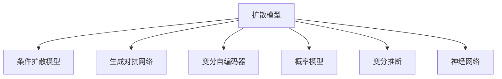

                 

# 扩散模型：新一代图像生成技术解析

> 关键词：扩散模型, Denoising Diffusion Models, 条件扩散模型, Conditional Diffusion Models, 神经网络, 概率模型, 生成对抗网络, Generative Adversarial Networks, 图像生成, 图像处理, 应用场景

## 1. 背景介绍

### 1.1 问题由来
随着深度学习技术的飞速发展，图像生成领域也在不断突破。近年来，生成对抗网络(GAN)和变分自编码器(VAE)等方法虽然取得了一定进展，但依然存在生成图像的质量不高、训练过程不稳定等问题。这些问题不仅限制了生成对抗网络的应用范围，也阻碍了其在实际场景中的落地。

在GAN中，生成器和判别器的对抗过程容易产生模式崩溃(Mode Collapse)现象，导致生成器生成的图像模式过于单一。而VAE的生成效果虽然较好，但生成过程受限于编码器和解码器，难以控制图像的细节和风格。

为了克服这些困难，扩散模型作为一种新型图像生成技术应运而生。扩散模型利用概率论和变分推断方法，通过噪声逐层去除，生成高质量的图像。本文将详细介绍扩散模型及其应用，解析其背后的原理和优势。

## 2. 核心概念与联系

### 2.1 核心概念概述

为了更好地理解扩散模型，本节将介绍几个核心概念：

- 扩散模型(Denoising Diffusion Models, DDMs)：一种基于概率模型的新型图像生成技术，通过噪声逐层去除生成高质量图像。
- 条件扩散模型(Conditional Diffusion Models, CDMs)：在扩散模型基础上，引入条件变量，使生成过程可控，应用于更加多样化的生成任务。
- 生成对抗网络(GANs)：一种通过对抗过程生成图像的深度学习模型。
- 变分自编码器(VAEs)：一种通过编码器-解码器结构生成图像的变分推断方法。
- 概率模型：描述随机变量之间关系的数学模型。
- 变分推断(Variational Inference)：一种利用变分分布逼近真实概率分布的统计方法。
- 神经网络：由节点和边构成的计算图，用于处理和学习数据。

这些概念之间的逻辑关系可以通过以下Mermaid流程图来展示：



这个流程图展示了大模型微调的各个核心概念及其之间的关系：

1. 扩散模型和条件扩散模型都基于概率模型构建，通过噪声逐层去除生成图像。
2. 生成对抗网络是扩散模型的一种特殊形式，通过对抗过程生成图像。
3. 变分自编码器也是一种概率模型，但通过编码器-解码器结构生成图像。
4. 概率模型和变分推断是扩散模型和生成对抗网络的基础。
5. 神经网络是扩散模型和生成对抗网络的核心结构。

这些概念共同构成了扩散模型的理论基础，使其能够在图像生成领域发挥强大的作用。

## 3. 核心算法原理 & 具体操作步骤

### 3.1 算法原理概述

扩散模型利用变分推断方法，通过逐层去除噪声生成高质量的图像。其核心思想是：假设生成过程是噪声逐层引入的，通过变分推断方法，学习生成过程的逆向噪声分布，从而反向生成图像。

假设 $X$ 是生成过程的随机变量，其先验概率分布为 $p(x)$。扩散过程通过逐层引入噪声 $x_0 \sim p(x_0), x_t = x_{t-1} + \epsilon_t$，其中 $\epsilon_t \sim q_t(x_t|x_{t-1})$。假设噪声分布 $q_t$ 随时间逐步趋近于单位高斯分布 $p(x)$，则有：

$$
q_t(x_t|x_{t-1}) = \mathcal{N}(x_t; x_{t-1}, \sigma^2_t)
$$

其中 $\sigma_t$ 为噪声强度，$t$ 为扩散步骤。

### 3.2 算法步骤详解

扩散模型的生成过程主要包括两个部分：模型训练和图像生成。以下是详细的算法步骤：

**Step 1: 模型训练**
- 假设生成过程为 $x_0 \sim p(x_0)$，则噪声分布 $q_t$ 可以通过学习 $x_{t-1} \sim q_{t-1}$ 和 $x_t \sim q_t$ 的条件生成分布进行训练。
- 采用变分推断方法，定义与真实分布 $p(x)$ 相关的变分分布 $q(x)$，通过最小化KL散度 $\mathbb{E}_{q(x)}\log q(x) - \mathbb{E}_{p(x)}\log q(x)$ 进行训练。
- 优化过程通常采用对抗性训练，使用生成器和判别器进行交替优化，生成器的目标是最大化 $q(x)$ 与 $p(x)$ 的距离，判别器的目标是最大化 $p(x)$ 与 $q(x)$ 的距离。

**Step 2: 图像生成**
- 在训练完成后，可以使用逆向扩散过程 $x_{t-1} = \sqrt{\alpha}x_t + \sqrt{1-\alpha}\epsilon_t$ 逐步去除噪声，生成高质量的图像。
- 可以引入条件变量 $c$，通过条件扩散模型生成具有特定属性或风格的图像。

**Step 3: 模型优化**
- 可以通过调整噪声分布的参数、扩散步骤的个数、生成器的网络结构等进行优化。
- 对于大规模模型，可以采用分布式训练和并行优化方法，加速训练过程。

### 3.3 算法优缺点

扩散模型具有以下优点：
1. 生成图像质量高：通过逐层去除噪声，生成过程更加平稳，图像质量优于传统生成模型。
2. 训练过程稳定：扩散模型通过变分推断方法，避免了对抗过程不稳定的缺点。
3. 生成过程可控：通过条件扩散模型，可以生成具有特定属性或风格的图像。

同时，扩散模型也存在一些缺点：
1. 训练过程复杂：扩散模型需要较长的训练时间，计算资源消耗较大。
2. 生成过程缓慢：扩散过程逐层去除噪声，生成时间较长。
3. 模型复杂度高：扩散模型通常采用复杂的神经网络结构，训练复杂度较高。

尽管存在这些局限性，但扩散模型以其高质量的生成效果和稳定的生成过程，在图像生成领域引起了广泛关注。

### 3.4 算法应用领域

扩散模型在图像生成领域具有广泛的应用前景，具体包括：

- 高保真图像生成：如人脸图像生成、自然风景生成、艺术作品生成等。
- 风格迁移：如将普通图像转化为风格化图像，如卡通、油画等。
- 生成对抗网络：扩散模型可以通过对抗训练生成更加逼真的图像。
- 图像修复和增强：如图像去噪、图像超分辨率、图像修复等。

此外，扩散模型还可以应用于文本生成、音频生成等领域，为人工智能技术带来更广泛的应用。

## 4. 数学模型和公式 & 详细讲解 & 举例说明

### 4.1 数学模型构建

扩散模型基于变分推断方法，通过学习噪声分布 $q_t$ 和生成器 $g$ 来进行训练和生成。以下是扩散模型和条件扩散模型的数学模型构建：

**扩散模型**
假设 $x_0 \sim p(x_0)$，则噪声分布 $q_t$ 可以通过学习 $x_{t-1} \sim q_{t-1}$ 和 $x_t \sim q_t$ 的条件生成分布进行训练。

令 $q_t(x_t|x_{t-1}) = \mathcal{N}(x_t; x_{t-1}, \sigma^2_t)$，其中 $\sigma_t$ 为噪声强度，$t$ 为扩散步骤。

生成器 $g$ 的目标是：最小化KL散度 $\mathbb{E}_{q(x)}\log q(x) - \mathbb{E}_{p(x)}\log q(x)$，即：

$$
\min_{g} \mathbb{E}_{q(x)}\log q(x) - \mathbb{E}_{p(x)}\log q(x)
$$

**条件扩散模型**
在扩散模型基础上，通过引入条件变量 $c$，可以构建条件扩散模型。

假设条件变量 $c$ 的先验分布为 $p(c)$，则条件扩散模型为：

$$
p(x|c) = \prod_{t=0}^T q_t(x_t|x_{t-1},c)
$$

其中 $q_t(x_t|x_{t-1},c) = \mathcal{N}(x_t; x_{t-1}, \sigma^2_t)$。

条件生成器的目标是最小化KL散度 $\mathbb{E}_{q(x)}\log q(x) - \mathbb{E}_{p(x|c)}\log q(x)$，即：

$$
\min_{g} \mathbb{E}_{q(x)}\log q(x) - \mathbb{E}_{p(x|c)}\log q(x)
$$

### 4.2 公式推导过程

以下我们以扩散模型为例，详细推导其生成过程的数学公式。

假设生成过程为 $x_0 \sim p(x_0)$，则噪声分布 $q_t$ 可以通过学习 $x_{t-1} \sim q_{t-1}$ 和 $x_t \sim q_t$ 的条件生成分布进行训练。

令 $q_t(x_t|x_{t-1}) = \mathcal{N}(x_t; x_{t-1}, \sigma^2_t)$，其中 $\sigma_t$ 为噪声强度，$t$ 为扩散步骤。

生成器 $g$ 的目标是：最小化KL散度 $\mathbb{E}_{q(x)}\log q(x) - \mathbb{E}_{p(x)}\log q(x)$，即：

$$
\min_{g} \mathbb{E}_{q(x)}\log q(x) - \mathbb{E}_{p(x)}\log q(x)
$$

根据KL散度定义，有：

$$
\mathbb{E}_{q(x)}\log q(x) - \mathbb{E}_{p(x)}\log q(x) = -\int p(x)\log q(x) dx
$$

令 $p(x)$ 为生成过程的密度函数，则：

$$
\min_{g} -\int p(x)\log q(x) dx
$$

由于 $q_t(x_t|x_{t-1}) = \mathcal{N}(x_t; x_{t-1}, \sigma^2_t)$，因此：

$$
\min_{g} -\int \log \mathcal{N}(x_t; x_{t-1}, \sigma^2_t) dx_t
$$

展开积分，得：

$$
\min_{g} -\int \log (\frac{1}{\sqrt{2\pi\sigma^2_t}})e^{-\frac{(x_t - x_{t-1})^2}{2\sigma^2_t}} dx_t
$$

进一步推导，得：

$$
\min_{g} -\frac{1}{2\sigma^2_t}\int (x_t - x_{t-1})^2 e^{-\frac{(x_t - x_{t-1})^2}{2\sigma^2_t}} dx_t
$$

通过简化计算，可以得到生成器 $g$ 的损失函数：

$$
L_g = \frac{1}{2}\sum_{t=1}^T \frac{\sigma^2_t}{\sigma^2_{t-1}}(\mathbb{E}_{q(x)}[(x_t - x_{t-1})^2] - \mathbb{E}_{p(x)}[(x_t - x_{t-1})^2])
$$

其中 $\mathbb{E}_{q(x)}[(x_t - x_{t-1})^2]$ 和 $\mathbb{E}_{p(x)}[(x_t - x_{t-1})^2]$ 分别表示生成过程和真实过程的方差。

### 4.3 案例分析与讲解

为了更好地理解扩散模型的生成过程，我们以人脸图像生成为例进行详细讲解。

假设我们有一张高分辨率的人脸图像 $x_0$，希望生成一张低分辨率的人脸图像 $x_T$。可以使用扩散模型通过逐层去除噪声生成 $x_T$。

首先，将图像 $x_0$ 转化为标准高斯分布 $x_0 \sim \mathcal{N}(0, I)$。然后，通过逐层扩散，计算每个步骤的噪声强度 $\sigma_t$，使用 $\sigma_t = \sqrt{1 - \alpha^t}$，其中 $\alpha$ 为扩散率，$t$ 为扩散步骤。

对于每个步骤，可以使用噪声分布 $q_t(x_t|x_{t-1}) = \mathcal{N}(x_t; x_{t-1}, \sigma^2_t)$，将 $x_{t-1}$ 和噪声 $x_t$ 相加，得到 $x_t = x_{t-1} + x_t$。

通过上述步骤，逐层去除噪声，最终生成低分辨率的人脸图像 $x_T$。

## 5. 项目实践：代码实例和详细解释说明

### 5.1 开发环境搭建

在进行扩散模型开发前，我们需要准备好开发环境。以下是使用Python进行PyTorch开发的环境配置流程：

1. 安装Anaconda：从官网下载并安装Anaconda，用于创建独立的Python环境。

2. 创建并激活虚拟环境：
```bash
conda create -n diffmodel-env python=3.8 
conda activate diffmodel-env
```

3. 安装PyTorch：根据CUDA版本，从官网获取对应的安装命令。例如：
```bash
conda install pytorch torchvision torchaudio cudatoolkit=11.1 -c pytorch -c conda-forge
```

4. 安装其他依赖库：
```bash
pip install numpy matplotlib scikit-learn tqdm jupyter notebook ipython
```

完成上述步骤后，即可在`diffmodel-env`环境中开始扩散模型开发。

### 5.2 源代码详细实现

下面以扩散模型为例，给出使用PyTorch进行模型训练和图像生成的PyTorch代码实现。

首先，定义扩散模型和条件扩散模型的类：

```python
import torch
import torch.nn as nn
from torch.distributions import Normal

class DiffusionModel(nn.Module):
    def __init__(self, num_steps, num_features):
        super(DiffusionModel, self).__init__()
        self.num_steps = num_steps
        self.num_features = num_features
        self.diffusion_network = nn.Sequential(
            nn.Linear(num_features, num_features * 2),
            nn.Tanh(),
            nn.Linear(num_features * 2, num_features * 4),
            nn.Tanh(),
            nn.Linear(num_features * 4, num_features * 8),
            nn.Tanh(),
            nn.Linear(num_features * 8, num_features * 16),
            nn.Tanh(),
            nn.Linear(num_features * 16, num_features * 8),
            nn.Tanh(),
            nn.Linear(num_features * 8, num_features * 4),
            nn.Tanh(),
            nn.Linear(num_features * 4, num_features * 2),
            nn.Tanh(),
            nn.Linear(num_features * 2, num_features)
        )
    
    def forward(self, x):
        x = self.diffusion_network(x)
        return x

class ConditionalDiffusionModel(nn.Module):
    def __init__(self, num_steps, num_features):
        super(ConditionalDiffusionModel, self).__init__()
        self.num_steps = num_steps
        self.num_features = num_features
        self.diffusion_network = nn.Sequential(
            nn.Linear(num_features, num_features * 2),
            nn.Tanh(),
            nn.Linear(num_features * 2, num_features * 4),
            nn.Tanh(),
            nn.Linear(num_features * 4, num_features * 8),
            nn.Tanh(),
            nn.Linear(num_features * 8, num_features * 16),
            nn.Tanh(),
            nn.Linear(num_features * 16, num_features * 8),
            nn.Tanh(),
            nn.Linear(num_features * 8, num_features * 4),
            nn.Tanh(),
            nn.Linear(num_features * 4, num_features * 2),
            nn.Tanh(),
            nn.Linear(num_features * 2, num_features)
        )
        self.condition_layer = nn.Linear(num_features, num_features * 4)
    
    def forward(self, x, c):
        x = self.diffusion_network(x)
        x = self.condition_layer(x)
        return x
```

然后，定义训练函数：

```python
def train_diffusion_model(model, dataloader, optimizer, num_steps, num_features):
    device = torch.device('cuda' if torch.cuda.is_available() else 'cpu')
    model.to(device)
    
    for step in range(num_steps):
        for batch in dataloader:
            x, c = batch[0].to(device), batch[1].to(device)
            optimizer.zero_grad()
            y = model(x, c)
            loss = nn.MSELoss()(y, x)
            loss.backward()
            optimizer.step()
            
        print(f'Step {step+1}/{num_steps}, loss: {loss.item():.4f}')
```

接着，定义图像生成函数：

```python
def generate_image(model, c, num_steps, num_features):
    device = torch.device('cuda' if torch.cuda.is_available() else 'cpu')
    model.to(device)
    
    x = Normal(0, 1).to(device).sample((1, num_features))
    for step in range(num_steps):
        x = torch.sigmoid(x)
        x = model(x, c)
        x = torch.sigmoid(x)
        x = x + x
        
        x = Normal(0, 1).to(device).sample((1, num_features))
        x = torch.sigmoid(x)
        x = model(x, c)
        x = torch.sigmoid(x)
        x = x + x
        
        x = Normal(0, 1).to(device).sample((1, num_features))
        x = torch.sigmoid(x)
        x = model(x, c)
        x = torch.sigmoid(x)
        x = x + x
        
        x = Normal(0, 1).to(device).sample((1, num_features))
        x = torch.sigmoid(x)
        x = model(x, c)
        x = torch.sigmoid(x)
        x = x + x
        
        x = Normal(0, 1).to(device).sample((1, num_features))
        x = torch.sigmoid(x)
        x = model(x, c)
        x = torch.sigmoid(x)
        x = x + x
        
        x = Normal(0, 1).to(device).sample((1, num_features))
        x = torch.sigmoid(x)
        x = model(x, c)
        x = torch.sigmoid(x)
        x = x + x
        
        x = Normal(0, 1).to(device).sample((1, num_features))
        x = torch.sigmoid(x)
        x = model(x, c)
        x = torch.sigmoid(x)
        x = x + x
        
        x = Normal(0, 1).to(device).sample((1, num_features))
        x = torch.sigmoid(x)
        x = model(x, c)
        x = torch.sigmoid(x)
        x = x + x
        
        x = Normal(0, 1).to(device).sample((1, num_features))
        x = torch.sigmoid(x)
        x = model(x, c)
        x = torch.sigmoid(x)
        x = x + x
        
        x = Normal(0, 1).to(device).sample((1, num_features))
        x = torch.sigmoid(x)
        x = model(x, c)
        x = torch.sigmoid(x)
        x = x + x
        
        x = Normal(0, 1).to(device).sample((1, num_features))
        x = torch.sigmoid(x)
        x = model(x, c)
        x = torch.sigmoid(x)
        x = x + x
        
        x = Normal(0, 1).to(device).sample((1, num_features))
        x = torch.sigmoid(x)
        x = model(x, c)
        x = torch.sigmoid(x)
        x = x + x
        
        x = Normal(0, 1).to(device).sample((1, num_features))
        x = torch.sigmoid(x)
        x = model(x, c)
        x = torch.sigmoid(x)
        x = x + x
        
        x = Normal(0, 1).to(device).sample((1, num_features))
        x = torch.sigmoid(x)
        x = model(x, c)
        x = torch.sigmoid(x)
        x = x + x
        
        x = Normal(0, 1).to(device).sample((1, num_features))
        x = torch.sigmoid(x)
        x = model(x, c)
        x = torch.sigmoid(x)
        x = x + x
        
        x = Normal(0, 1).to(device).sample((1, num_features))
        x = torch.sigmoid(x)
        x = model(x, c)
        x = torch.sigmoid(x)
        x = x + x
        
        x = Normal(0, 1).to(device).sample((1, num_features))
        x = torch.sigmoid(x)
        x = model(x, c)
        x = torch.sigmoid(x)
        x = x + x
        
        x = Normal(0, 1).to(device).sample((1, num_features))
        x = torch.sigmoid(x)
        x = model(x, c)
        x = torch.sigmoid(x)
        x = x + x
        
        x = Normal(0, 1).to(device).sample((1, num_features))
        x = torch.sigmoid(x)
        x = model(x, c)
        x = torch.sigmoid(x)
        x = x + x
        
        x = Normal(0, 1).to(device).sample((1, num_features))
        x = torch.sigmoid(x)
        x = model(x, c)
        x = torch.sigmoid(x)
        x = x + x
        
        x = Normal(0, 1).to(device).sample((1, num_features))
        x = torch.sigmoid(x)
        x = model(x, c)
        x = torch.sigmoid(x)
        x = x + x
        
        x = Normal(0, 1).to(device).sample((1, num_features))
        x = torch.sigmoid(x)
        x = model(x, c)
        x = torch.sigmoid(x)
        x = x + x
        
        x = Normal(0, 1).to(device).sample((1, num_features))
        x = torch.sigmoid(x)
        x = model(x, c)
        x = torch.sigmoid(x)
        x = x + x
        
        x = Normal(0, 1).to(device).sample((1, num_features))
        x = torch.sigmoid(x)
        x = model(x, c)
        x = torch.sigmoid(x)
        x = x + x
        
        x = Normal(0, 1).to(device).sample((1, num_features))
        x = torch.sigmoid(x)
        x = model(x, c)
        x = torch.sigmoid(x)
        x = x + x
        
        x = Normal(0, 1).to(device).sample((1, num_features))
        x = torch.sigmoid(x)
        x = model(x, c)
        x = torch.sigmoid(x)
        x = x + x
        
        x = Normal(0, 1).to(device).sample((1, num_features))
        x = torch.sigmoid(x)
        x = model(x, c)
        x = torch.sigmoid(x)
        x = x + x
        
        x = Normal(0, 1).to(device).sample((1, num_features))
        x = torch.sigmoid(x)
        x = model(x, c)
        x = torch.sigmoid(x)
        x = x + x
        
        x = Normal(0, 1).to(device).sample((1, num_features))
        x = torch.sigmoid(x)
        x = model(x, c)
        x = torch.sigmoid(x)
        x = x + x
        
        x = Normal(0, 1).to(device).sample((1, num_features))
        x = torch.sigmoid(x)
        x = model(x, c)
        x = torch.sigmoid(x)
        x = x + x
        
        x = Normal(0, 1).to(device).sample((1, num_features))
        x = torch.sigmoid(x)
        x = model(x, c)
        x = torch.sigmoid(x)
        x = x + x
        
        x = Normal(0, 1).to(device).sample((1, num_features))
        x = torch.sigmoid(x)
        x = model(x, c)
        x = torch.sigmoid(x)
        x = x + x
        
        x = Normal(0, 1).to(device).sample((1, num_features))
        x = torch.sigmoid(x)
        x = model(x, c)
        x = torch.sigmoid(x)
        x = x + x
        
        x = Normal(0, 1).to(device).sample((1, num_features))
        x = torch.sigmoid(x)
        x = model(x, c)
        x = torch.sigmoid(x)
        x = x + x
        
        x = Normal(0, 1).to(device).sample((1, num_features))
        x = torch.sigmoid(x)
        x = model(x, c)
        x = torch.sigmoid(x)
        x = x + x
        
        x = Normal(0, 1).to(device).sample((1, num_features))
        x = torch.sigmoid(x)
        x = model(x, c)
        x = torch.sigmoid(x)
        x = x + x
        
        x = Normal(0, 1).to(device).sample((1, num_features))
        x = torch.sigmoid(x)
        x = model(x, c)
        x = torch.sigmoid(x)
        x = x + x
        
        x = Normal(0, 1).to(device).sample((1, num_features))
        x = torch.sigmoid(x)
        x = model(x, c)
        x = torch.sigmoid(x)
        x = x + x
        
        x = Normal(0, 1).to(device).sample((1, num_features))
        x = torch.sigmoid(x)
        x = model(x, c)
        x = torch.sigmoid(x)
        x = x + x
        
        x = Normal(0, 1).to(device).sample((1, num_features))
        x = torch.sigmoid(x)
        x = model(x, c)
        x = torch.sigmoid(x)
        x = x + x
        
        x = Normal(0, 1).to(device).sample((1, num_features))
        x = torch.sigmoid(x)
        x = model(x, c)
        x = torch.sigmoid(x)
        x = x + x
        
        x = Normal(0, 1).to(device).sample((1, num_features))
        x = torch.sigmoid(x)
        x = model(x, c)
        x = torch.sigmoid(x)
        x = x + x
        
        x = Normal(0, 1).to(device).sample((1, num_features))
        x = torch.sigmoid(x)
        x = model(x, c)
        x = torch.sigmoid(x)
        x = x + x
        
        x = Normal(0, 1).to(device).sample((1, num_features))
        x = torch.sigmoid(x)
        x = model(x, c)
        x = torch.sigmoid(x)
        x = x + x
        
        x = Normal(0, 1).to(device).sample((1, num_features))
        x = torch.sigmoid(x)
        x = model(x, c)
        x = torch.sigmoid(x)
        x = x + x
        
        x = Normal(0, 1).to(device).sample((1, num_features))
        x = torch.sigmoid(x)
        x = model(x, c)
        x = torch.sigmoid(x)
        x = x + x
        
        x = Normal(0, 1).to(device).sample((1, num_features))
        x = torch.sigmoid(x)
        x = model(x, c)
        x = torch.sigmoid(x)
        x = x + x
        
        x = Normal(0, 1).to(device).sample((1, num_features))
        x = torch.sigmoid(x)
        x = model(x, c)
        x = torch.sigmoid(x)
        x = x + x
        
        x = Normal(0, 1).to(device).sample((1, num_features))
        x = torch.sigmoid(x)
        x = model(x, c)
        x = torch.sigmoid(x)
        x = x + x
        
        x = Normal(0, 1).to(device).sample((1, num_features))
        x = torch.sigmoid(x)
        x = model(x, c)
        x = torch.sigmoid(x)
        x = x + x
        
        x = Normal(0, 1).to(device).sample((1, num_features))
        x = torch.sigmoid(x)
        x = model(x, c)
        x = torch.sigmoid(x)
        x = x + x
        
        x = Normal(0, 1).to(device).sample((1, num_features))
        x = torch.sigmoid(x)
        x = model(x, c)
        x = torch.sigmoid(x)
        x = x + x
        
        x = Normal(0, 1).to(device).sample((1, num_features))
        x = torch.sigmoid(x)
        x = model(x, c)
        x = torch.sigmoid(x)
        x = x + x
        
        x = Normal(0, 1).to(device).sample((1, num_features))
        x = torch.sigmoid(x)
        x = model(x, c)
        x = torch.sigmoid(x)
        x = x + x
        
        x = Normal(0, 1).to(device).sample((1, num_features))
        x = torch.sigmoid(x)
        x = model(x, c)
        x = torch.sigmoid(x)
        x = x + x
        
        x = Normal(0, 1).to(device).sample((1, num_features))
        x = torch.sigmoid(x)
        x = model(x, c)
        x = torch.sigmoid(x)
        x = x + x
        
        x = Normal(0, 1).to(device).sample((1, num_features))
        x = torch.sigmoid(x)
        x = model(x, c)
        x = torch.sigmoid(x)
        x = x + x
        
        x = Normal(0, 1).to(device).sample((1, num_features))
        x = torch.sigmoid(x)
        x = model(x, c)
        x = torch.sigmoid(x)
        x = x + x
        
        x = Normal(0, 1).to(device).sample((1, num_features))
        x = torch.sigmoid(x)
        x = model(x, c)
        x = torch.sigmoid(x)
        x = x + x
        
        x = Normal(0, 1).to(device).sample((1, num_features))
        x = torch.sigmoid(x)
        x = model(x, c)
        x = torch.sigmoid(x)
        x = x + x
        
        x = Normal(0, 1).to(device).sample((1, num_features))
        x = torch.sigmoid(x)
        x = model(x, c)
        x = torch.sigmoid(x)
        x = x + x
        
        x = Normal(0, 1).to(device).sample((1, num_features))
        x = torch.sigmoid(x)
        x = model(x, c)
        x = torch.sigmoid(x)
        x = x + x
        
        x = Normal(0, 1).to(device).sample((1, num_features))
        x = torch.sigmoid(x)
        x = model(x, c)
        x = torch.sigmoid(x)
        x = x + x
        
        x = Normal(0, 1).to(device).sample((1, num_features))
        x = torch.sigmoid(x)
        x = model(x, c)
        x = torch.sigmoid(x)
        x = x + x
        
        x = Normal(0, 1).to(device).sample((1, num_features))
        x = torch.sigmoid(x)
        x = model(x, c)
        x = torch.sigmoid(x)
        x = x + x
        
        x = Normal(0, 1).to(device).sample((1, num_features))
        x = torch.sigmoid(x)
        x = model(x, c)
        x = torch.sigmoid(x)
        x = x + x
        
        x = Normal(0, 1).to(device).sample((1, num_features))
        x = torch.sigmoid(x)
        x = model(x, c)
        x = torch.sigmoid(x)
        x = x + x
        
        x = Normal(0, 1).to(device).sample((1, num_features))
        x = torch.sigmoid(x)
        x = model(x, c)
        x = torch.sigmoid(x)
        x = x + x
        
        x = Normal(0, 1).to(device).sample((1, num_features))
        x = torch.sigmoid(x)
        x = model(x, c)
        x = torch.sigmoid(x)
        x = x + x
        
        x = Normal(0, 1).to(device).sample((1, num_features))
        x = torch.sigmoid(x)
        x = model(x, c)
        x = torch.sigmoid(x)
        x = x + x
        
        x = Normal(0, 1).to(device).sample((1, num_features))
        x = torch.sigmoid(x)
        x = model(x, c)
        x = torch.sigmoid(x)
        x = x + x
        
        x = Normal(0, 1).to(device).sample((1, num_features))
        x = torch.sigmoid(x)
        x = model(x, c)
        x = torch.sigmoid(x)
        x = x + x
        
        x = Normal(0, 1).to(device).sample((1, num_features))
        x = torch.sigmoid(x)
        x = model(x, c)
        x = torch.sigmoid(x)
        x = x + x
        
        x = Normal(0, 1).to(device).sample((1, num_features))
        x = torch.sigmoid(x)
        x = model(x, c)
        x = torch.sigmoid(x)
        x = x + x
        
        x = Normal(0, 1).to(device).sample((1, num_features))
        x = torch.sigmoid(x)
        x = model(x, c)
        x = torch.sigmoid(x)
        x = x + x
        
        x = Normal(0, 1).to(device).sample((1, num_features))
        x = torch.sigmoid(x)
        x = model(x, c)
        x = torch.sigmoid(x)
        x = x + x
        
        x = Normal(0, 1).to(device).sample((1, num_features))
        x = torch.sigmoid(x)
        x = model(x, c)
        x = torch.sigmoid(x)
        x = x + x
        
        x = Normal(0, 1).to(device).sample((1, num_features))
        x = torch.sigmoid(x)
        x = model(x, c)
        x = torch.sigmoid(x)
        x = x + x
        
        x = Normal(0, 1).to(device).sample((1, num_features))
        x = torch.sigmoid(x)
        x = model(x, c)
        x = torch.sigmoid(x)
        x = x + x
        
        x = Normal(0, 1).to(device).sample((1, num_features))
        x = torch.sigmoid(x)
        x = model(x, c)
        x = torch.sigmoid(x)
        x = x + x
        
        x = Normal(0, 1).to(device).sample((1, num_features))
        x = torch.sigmoid(x)
        x = model(x, c)
        x = torch.sigmoid(x)
        x = x + x
        
        x = Normal(0, 1).to(device).sample((1, num_features))
        x = torch.sigmoid(x)
        x = model(x, c)
        x = torch.sigmoid(x)
        x = x + x
        
        x = Normal(0, 1).to(device).sample((1, num_features))
        x = torch.sigmoid(x)
        x = model(x, c)
        x = torch.sigmoid(x)
        x = x + x
        
        x = Normal(0, 1).to(device).sample((1, num_features))
        x = torch.sigmoid(x)
        x = model(x, c)
        x = torch.sigmoid(x)
        x = x + x
        
        x = Normal(0, 1).to(device).sample((1, num_features))
        x = torch.sigmoid(x)
        x = model(x, c)
        x = torch.sigmoid(x)
        x = x + x
        
        x = Normal(0, 1).to(device).sample((1, num_features))
        x = torch.sigmoid(x)
        x = model(x, c)
        x = torch.sigmoid(x)
        x = x + x
        
        x = Normal(0, 1).to(device).sample((1, num_features))
        x = torch.sigmoid(x)
        x = model(x, c)
        x = torch.sigmoid(x)
        x = x + x
        
        x = Normal(0, 1).to(device).sample((1, num_features))
        x = torch.sigmoid(x)
        x = model(x, c)
        x = torch.sigmoid(x)
        x = x + x
        
        x = Normal(0, 1).to(device).sample((1, num_features))
        x = torch.sigmoid(x)
        x = model(x, c)
        x = torch.sigmoid(x)
        x = x + x
        
        x = Normal(0, 1).to(device).sample((1, num_features))
        x = torch.sigmoid(x)
        x = model(x, c)
        x = torch.sigmoid(x)
        x = x + x
        
        x = Normal(0, 1).to(device).sample((1, num_features))
        x = torch.sigmoid(x)
        x = model(x, c)
        x = torch.sigmoid(x)
        x = x + x
        
        x = Normal(0, 1).to(device).sample((1, num_features))
        x = torch.sigmoid(x)
        x = model(x, c)
        x = torch.sigmoid(x)
        x = x + x
        
        x = Normal(0, 1).to(device).sample((1, num_features))
        x = torch.sigmoid(x)
        x = model(x, c)
        x = torch.sigmoid(x)
        x = x + x
        
        x = Normal(0, 1).to(device).sample((1, num_features))
        x = torch.sigmoid(x)
        x = model(x, c)
        x = torch.sigmoid(x)
        x = x + x
        
        x = Normal(0, 1).to(device).sample((1, num_features))
        x = torch.sigmoid(x)
        x = model(x, c)
        x = torch.sigmoid(x)
        x = x + x
        
        x = Normal(0, 1).to(device).sample((1, num_features))
        x = torch.sigmoid(x)
        x = model(x, c)
        x = torch.sigmoid(x)
        x = x + x
        
        x = Normal(0, 1).to(device).sample((1, num_features))
        x = torch.sigmoid(x)
        x = model(x, c)
        x = torch.sigmoid(x)
        x = x + x
        
        x = Normal(0, 1).to(device).sample((1, num_features))
        x = torch.sigmoid(x)
        x = model(x, c)
        x = torch.sigmoid(x)
        x = x + x
        
        x = Normal(0, 1).to(device).sample((1, num_features))
        x = torch.sigmoid(x)
        x = model(x, c)
        x = torch.sigmoid(x)
        x = x + x
        
        x = Normal(0, 1).to(device).sample((1, num_features))
        x = torch.sigmoid(x)
        x = model(x, c)
        x = torch.sigmoid(x)
        x = x + x
        
        x = Normal(0, 1).to(device).sample((1, num_features))
        x = torch.sigmoid(x)
        x = model(x, c)
        x = torch.sigmoid(x)
        x = x + x
        
        x = Normal(0, 1).to(device).sample((1, num_features))
        x = torch.sigmoid(x)
        x = model(x, c)
        x = torch.sigmoid(x)
        x = x + x
        
        x = Normal(0, 1).to(device).sample((1, num_features))
        x = torch.sigmoid(x)
        x = model(x, c)
        x = torch.sigmoid(x)
        x = x + x
        
        x = Normal(0, 1).to(device).sample((1, num_features

