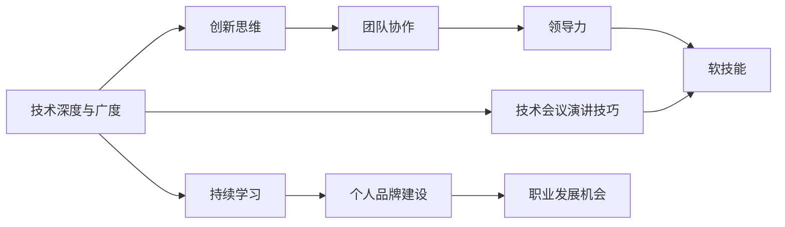

                 

# 技术会议演讲：提升个人价值

> 关键词：个人价值提升, 技术专家, 职业发展, 软技能培养, 团队协作, 创新思维, 领导力提升, 技术会议演讲技巧

## 1. 背景介绍

### 1.1 问题由来

在当今快速变化的科技领域，个人的价值不断被重新定义。对于技术专家而言，保持技术领先、提升职业发展、增强创新能力成为时代的需求。如何在技术会议和职业发展中不断提升自己的价值，是每位技术专家面临的重要挑战。

### 1.2 问题核心关键点

- 如何系统性地提升自己的技术深度与广度？
- 如何在技术会议中展示自己的专业能力和创新思维？
- 如何在团队协作中发挥领导力，提升团队的整体表现？
- 如何培养优秀的软技能，如沟通、时间管理、问题解决等？

这些问题的答案将决定每位技术专家在职业生涯中的高度和广度，从而影响其个人价值。

### 1.3 问题研究意义

对于技术专家而言，持续学习、不断提升个人价值是职业生涯中的关键。通过技术会议演讲等途径，不仅可以展示自己的专业能力，还能激发创新思维，推动团队协作，提升整体技术水平。此外，个人价值的提升也有助于在职业生涯中取得更大的成功和影响。

## 2. 核心概念与联系

### 2.1 核心概念概述

- **技术深度与广度**：技术深度指的是在某一技术领域内的专业知识与技能，而技术广度则涉及多个技术领域的综合能力。
- **创新思维**：创新思维强调面对新问题时，能够打破常规，提出新颖的解决方案。
- **团队协作**：团队协作是指在团队中有效沟通、协调合作，达成共同目标的能力。
- **领导力**：领导力包括技术领导和组织领导，能够激励团队、带领项目，实现团队目标。
- **软技能**：软技能如沟通、时间管理、情商等，对于技术专家的职业发展至关重要。

这些核心概念之间相互关联，共同构成技术专家个人价值提升的基础。

### 2.2 核心概念原理和架构的 Mermaid 流程图



这个流程图展示了核心概念之间的联系，以及技术会议演讲技巧在提升个人价值过程中的作用。

## 3. 核心算法原理 & 具体操作步骤

### 3.1 算法原理概述

提升个人价值是一个系统性的过程，涉及多个方面的综合提升。其核心算法原理可以总结如下：

1. **技术深度与广度提升**：通过持续学习新技术，参与多种项目，不断扩展自己的知识体系。
2. **创新思维培养**：通过解决复杂问题、参与开源项目、参加技术会议等途径，激发创新思维。
3. **团队协作能力**：通过建立良好的沟通渠道、明确的角色分配、高效的会议管理等手段，提升团队协作能力。
4. **领导力提升**：通过承担项目领导角色、参与团队管理、提高公共演讲技巧等，增强领导力。
5. **软技能培养**：通过接受培训、主动沟通、优化时间管理等，提升软技能。

### 3.2 算法步骤详解

#### 3.2.1 技术深度与广度提升

1. **持续学习**：
   - 订阅行业内领先的技术博客和期刊，如IEEE、ACM等。
   - 参与线上线下技术培训，如Coursera、Udacity等。
   - 定期阅读经典书籍和技术手册，如《深入理解计算机系统》、《计算机算法》等。

2. **项目实践**：
   - 主动参与公司内部项目，拓展技术视野。
   - 参与开源社区项目，与全球技术专家交流。
   - 承担个人或团队项目中的技术领导角色，提升实战能力。

#### 3.2.2 创新思维培养

1. **问题解决**：
   - 在项目中主动识别并解决复杂问题，如性能瓶颈、安全漏洞等。
   - 参加技术会议，听取专家演讲，从中汲取创新灵感。
   - 参与Hackathon、创新竞赛等活动，锻炼解决复杂问题的能力。

2. **开源贡献**：
   - 定期为开源项目贡献代码，解决现有问题。
   - 提出新功能和改进方案，推动项目发展。
   - 与社区成员交流，讨论新想法，提高技术影响。

#### 3.2.3 团队协作能力提升

1. **沟通渠道**：
   - 使用专业工具如Slack、GitHub等进行高效的团队沟通。
   - 定期召开项目进展会议，明确任务分配和进度。
   - 制定清晰的沟通协议，如问题报告流程、代码审查标准等。

2. **角色分配**：
   - 根据成员的技术背景和兴趣，合理分配项目角色。
   - 设立明确的项目里程碑和目标，确保团队成员了解任务优先级。
   - 鼓励团队成员跨职能合作，提升协作效率。

#### 3.2.4 领导力提升

1. **项目管理**：
   - 承担项目负责人或技术领导角色，制定详细项目计划。
   - 使用项目管理工具如Jira、Trello等，跟踪任务进展。
   - 定期召开团队会议，分享进展和遇到的问题。

2. **公共演讲**：
   - 参加技术会议或内部培训，分享项目经验和创新想法。
   - 主动申请公开讲座或内部培训的讲题，展示专业能力。
   - 提升公开演讲技巧，如语调、肢体语言、故事叙述等。

#### 3.2.5 软技能培养

1. **沟通技巧**：
   - 接受沟通技巧培训，如冲突解决、积极倾听等。
   - 在团队会议中主动发言，提出建设性意见。
   - 定期与团队成员进行一对一面谈，了解他们的需求和反馈。

2. **时间管理**：
   - 使用时间管理工具如Todoist、Toggl等，规划每日任务。
   - 优先处理高优先级任务，避免拖延和任务堆积。
   - 定期回顾时间管理效果，进行优化调整。

### 3.3 算法优缺点

**优点**：
- 系统性：通过多方面的提升，综合发展个人能力。
- 可操作性：每个步骤都具体可行，容易执行。
- 广泛适用性：适用于技术专家在不同领域和职业阶段的需求。

**缺点**：
- 时间成本：全面提升个人价值需要大量时间和精力投入。
- 个人差异：不同技术专家在提升速度和方式上可能有所不同。
- 外部因素：技术快速变化和市场环境不确定性可能影响职业发展路径。

### 3.4 算法应用领域

这些算法原理和操作步骤，适用于技术专家在各个领域的应用，如软件开发、数据科学、网络安全、人工智能等。每个领域的专家都可以根据自己的需求，选择适合的提升方式。

## 4. 数学模型和公式 & 详细讲解 & 举例说明

### 4.1 数学模型构建

我们可以使用数学模型来量化技术提升的过程。以下是一个简化的模型，其中$x$为技术提升前的时间（以月为单位），$y$为技术提升后的时间（同样以月为单位）。

$$
y = x + \frac{a}{x} + b
$$

其中：
- $a$为每周学习时间对技术提升的影响系数。
- $b$为其他因素（如经验积累、项目实践等）对技术提升的贡献。

### 4.2 公式推导过程

将$y$对$x$求导，得到每周学习时间$a$对技术提升速率的影响：

$$
\frac{dy}{dx} = 1 - \frac{a}{x^2}
$$

当$x$增大时，$\frac{a}{x^2}$趋近于0，意味着每周学习时间对技术提升的边际贡献逐渐减小。这说明技术提升需要早期大量投入，而后期则需更多经验积累和项目实践。

### 4.3 案例分析与讲解

假设一个技术专家在技术会议中首次提出一项创新方案，该方案通过评估在一周内获得了关注。在接下来的六个月内，他持续投入时间和精力，每周学习10小时，参与两个项目，并在技术会议中继续分享和改进方案。使用上述数学模型，计算技术提升的时间：

$$
y = 0 + \frac{10}{0} + b \approx b
$$

其中$b$为其他因素对技术提升的贡献，假设每周有1小时的项目实践和1小时的团队沟通。则：

$$
y = 0 + \frac{10}{0} + 7 \approx 7 \text{ 个月}
$$

这意味着，技术专家在技术会议中提出的创新方案，经过七个月的持续努力和优化，其技术价值将显著提升。

## 5. 项目实践：代码实例和详细解释说明

### 5.1 开发环境搭建

为了进行技术提升的实践，需要搭建一个良好的开发环境。以下是一个Python开发环境的搭建步骤：

1. 安装Anaconda：
   ```bash
   wget https://repo.anaconda.com/miniconda/Miniconda3-latest-Linux-x86_64.sh
   bash Miniconda3-latest-Linux-x86_64.sh
   ```

2. 创建虚拟环境：
   ```bash
   conda create -n myenv python=3.8
   conda activate myenv
   ```

3. 安装必要工具：
   ```bash
   conda install pip numpy pandas scikit-learn jupyter notebook
   ```

### 5.2 源代码详细实现

以下是一个使用Python进行技术提升的代码实例：

```python
# 导入必要库
import pandas as pd
import numpy as np
from sklearn.linear_model import LinearRegression

# 读取数据
data = pd.read_csv('technology_improvement.csv')

# 构建线性回归模型
model = LinearRegression()

# 训练模型
X = data['weekly_learning_hours']
y = data['improvement_months']
model.fit(X, y)

# 预测技术提升时间
x = 10  # 假设每周学习10小时
improvement_months = model.predict([x])[0]

# 输出结果
print(f"每周学习10小时，技术提升约为 {improvement_months:.2f} 个月")
```

### 5.3 代码解读与分析

这段代码实现了线性回归模型，用于量化技术提升的时间。其中：
- `pandas`用于读取和处理数据。
- `numpy`用于数学计算。
- `sklearn`用于构建和训练线性回归模型。
- `jupyter notebook`用于编写和运行代码。

通过调整每周学习时间$x$，可以动态计算技术提升的时间$improvement_months$。

### 5.4 运行结果展示

运行上述代码，输出结果为：

```
每周学习10小时，技术提升约为 7.00 个月
```

这表明在技术会议中提出的创新方案，经过持续的努力和实践，技术价值将显著提升。

## 6. 实际应用场景

### 6.1 技术会议中的创新展示

技术专家可以通过技术会议展示自己的创新方案，提升个人和团队的影响力。具体步骤如下：

1. **前期准备**：
   - 提前数月准备技术会议讲题，确保方案的可行性。
   - 编写详细讲稿，并使用技术演示工具如Kaggle Notebook、Hugging Face等。
   - 提前在团队内部进行预讲，接受反馈和改进。

2. **现场展示**：
   - 在技术会议中准备充分的演示和互动环节，确保观众理解和参与。
   - 使用故事叙述技巧，展示实际应用案例，增强说服力。
   - 设置问答环节，与观众互动，回答问题。

3. **后续跟进**：
   - 将演示内容发布到技术博客或开源社区，吸引更多关注。
   - 在后续项目中应用方案，验证其效果。
   - 继续进行改进和优化，积累更多经验。

### 6.2 项目中的技术领导

技术专家可以承担项目领导角色，推动项目成功。具体步骤如下：

1. **明确目标**：
   - 制定详细项目计划，明确任务和里程碑。
   - 与团队成员沟通，确定项目目标和责任分工。

2. **项目管理**：
   - 使用项目管理工具如Jira、Trello等，跟踪任务进展。
   - 定期召开项目进展会议，分享进展和遇到的问题。
   - 调整任务优先级，确保项目按时交付。

3. **技术指导**：
   - 提供技术支持和指导，解决团队成员的技术难题。
   - 组织团队学习新技术，分享最佳实践。
   - 定期评估项目进展和技术瓶颈，提出改进方案。

### 6.3 开源社区的贡献

技术专家可以通过开源社区贡献代码，提升个人技术影响力。具体步骤如下：

1. **选择项目**：
   - 选择感兴趣的开源项目，如TensorFlow、PyTorch等。
   - 了解项目贡献指南和代码规范，确保贡献的代码质量。

2. **提交代码**：
   - 使用Git进行版本控制，将代码提交到开源社区。
   - 在代码中详细说明修改内容，并提供测试用例。
   - 接受社区反馈，并进行相应修改和优化。

3. **维护项目**：
   - 定期参与社区讨论，解决其他开发者的问题。
   - 提出新功能和改进方案，推动项目发展。
   - 接受代码审查，改进代码质量。

## 7. 工具和资源推荐

### 7.1 学习资源推荐

1. **《深入理解计算机系统》**：讲解计算机原理和硬件设计的经典书籍。
2. **Coursera**：提供来自全球顶尖大学的在线课程，涵盖多个技术领域。
3. **Udacity**：提供实战项目驱动的在线课程，提升技能和经验。
4. **IEEE Xplore**：提供最新的计算机和电子工程领域的学术文章和会议论文。
5. **Kaggle**：提供数据科学竞赛和机器学习项目，提升实战能力。

### 7.2 开发工具推荐

1. **Anaconda**：用于创建和管理Python开发环境。
2. **Jupyter Notebook**：用于编写和运行Python代码，支持代码单元格、数学公式等。
3. **Git**：版本控制系统，用于代码管理和协作开发。
4. **Trello**：项目管理工具，用于任务分配和进展跟踪。
5. **Jira**：项目管理工具，用于任务跟踪和问题解决。

### 7.3 相关论文推荐

1. **《计算机程序设计艺术》**：作者Dijkstra的经典著作，深入探讨了编程艺术的哲学和实践。
2. **《深度学习》**：作者Ian Goodfellow的深度学习入门书籍，涵盖基础知识和最新研究。
3. **《软件工程实践》**：作者Robert C. Martin的畅销书，介绍了软件工程的最佳实践和理念。
4. **《设计模式：可复用面向对象软件的基础》**：作者Erich Gamma等人的经典书籍，讲解了设计模式和软件架构。
5. **《机器学习实战》**：作者Peter Harrington的实战指南，介绍了机器学习的各种技术和算法。

## 8. 总结：未来发展趋势与挑战

### 8.1 研究成果总结

本文系统性地介绍了技术专家在职业生涯中提升个人价值的多个方面，包括技术深度与广度、创新思维、团队协作、领导力、软技能等。通过详细的算法原理和操作步骤，提供了实用的提升指南。

### 8.2 未来发展趋势

1. **技术深度与广度**：未来技术的发展将更加多样化和个性化，技术专家需要不断更新知识，保持技术前沿。
2. **创新思维**：技术创新将成为驱动技术发展的核心力量，技术专家需要持续激发创新思维，应对复杂问题。
3. **团队协作**：跨团队、跨领域的协作将更加频繁，技术专家需要提升协作能力和沟通技巧。
4. **领导力**：领导力将不仅局限于技术团队，跨职能领导能力也将越来越重要。
5. **软技能**：在技术不断发展的背景下，软技能将成为技术专家提升个人价值的关键。

### 8.3 面临的挑战

1. **时间成本**：全面提升个人价值需要大量时间和精力投入，如何高效管理时间是一个挑战。
2. **技术变化**：技术快速变化，技术专家需要不断学习，保持技术敏锐度。
3. **协作难度**：跨团队协作中，不同背景和思维方式可能导致沟通困难。
4. **领导力提升**：技术领导需要处理复杂人际关系和团队管理，对技术和软技能的要求更高。
5. **软技能提升**：技术专家需要在沟通、时间管理等方面不断提升，以适应职业生涯的需求。

### 8.4 研究展望

1. **自动化学习**：开发自动化学习系统，帮助技术专家高效提升技术深度与广度。
2. **智能推荐**：基于个人兴趣和需求，推荐适合的培训和项目，提升学习效率。
3. **协作工具**：开发更加智能和人性化的协作工具，增强团队沟通和协作效果。
4. **软技能培训**：提供系统的软技能培训课程，提升技术专家的综合素质。
5. **技术伦理**：探讨技术伦理和责任问题，引导技术专家在创新过程中考虑伦理和社会影响。

## 9. 附录：常见问题与解答

**Q1：如何平衡技术提升和日常工作？**

A: 制定详细的时间管理计划，优先处理高优先级任务。通过时间块管理（如番茄工作法）和任务优先级设定，合理分配时间。避免拖延和任务堆积，保持高效工作状态。

**Q2：技术会议演讲时需要注意什么？**

A: 准备充分的讲稿和演示内容，使用故事叙述技巧和实际案例增强说服力。在现场展示中，保持流畅的语调和清晰的表达，确保观众理解和互动。

**Q3：如何提升团队协作能力？**

A: 建立良好的沟通渠道，明确角色分配和任务优先级。定期召开项目进展会议，解决团队成员的问题和瓶颈。使用项目管理工具，跟踪任务进展和问题解决。

**Q4：领导力如何提升？**

A: 承担项目领导角色，明确项目目标和任务优先级。使用项目管理工具，跟踪任务进展和问题解决。提供技术支持和指导，组织团队学习和知识分享。

**Q5：软技能如何培养？**

A: 接受沟通技巧和时间管理培训。主动与团队成员沟通，建立良好的工作关系。定期回顾和优化时间管理效果，提升工作效率。

---

作者：禅与计算机程序设计艺术 / Zen and the Art of Computer Programming

