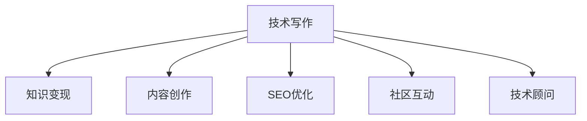

                 

# 技术写作：程序员的知识变现之路

> 关键词：技术写作, 知识变现, 程序员, 软件开发, 项目管理, 软技能, 技术交流, 内容创作, 开源项目, 技术博客, 专家影响力

## 1. 背景介绍

### 1.1 问题由来
在信息爆炸的互联网时代，技术知识快速迭代更新。掌握前沿技术的同时，如何将这些知识有效地传播出去，赋能更多开发者，成为了每个技术人的重要课题。技术写作，正是程序员实现知识变现、提升影响力的重要手段之一。

本文聚焦于程序员如何通过技术写作进行知识变现，主要围绕以下几个方面进行探讨：
1. **技术写作的多种形式**：如博客文章、技术文档、开源项目文档、技术演讲等。
2. **知识变现的方式**：如企业内部培训、在线教育、技术咨询、技术顾问等。
3. **技术写作的影响力**：如建立个人品牌、增加网络曝光度、提升行业影响力等。
4. **技术写作的技巧**：如内容创作、SEO优化、社区互动等。

### 1.2 问题核心关键点
技术写作不仅仅是写代码的延伸，更是一种系统的知识输出和传播过程。它涵盖了从内容创作到发布互动的各个环节，需要综合运用多种技能和工具。通过技术写作，程序员可以将个人的技术积累转化为商业价值，提升自身在行业内的知名度和影响力。

## 2. 核心概念与联系

### 2.1 核心概念概述

为更好地理解技术写作及其对程序员知识变现的影响，本节将介绍几个关键概念：

- **技术写作**：程序员通过撰写技术文章、博客、文档、演讲稿等形式，将自身的技术知识和经验分享出去，供他人学习和参考。
- **知识变现**：将技术知识和经验通过技术写作转化为商业价值，如企业内部培训、在线教育、技术咨询等。
- **内容创作**：技术写作的核心，包括选题策划、内容撰写、编辑校对等环节。
- **SEO优化**：通过搜索引擎优化技巧，提高技术文章在搜索引擎中的排名，增加曝光度。
- **社区互动**：通过技术博客、社交媒体等平台，与同行和读者进行互动，建立技术社区和网络影响力。
- **技术顾问**：利用自己在某一技术领域的深度积累，提供专业咨询和建议，帮助企业解决技术问题。

这些概念之间的逻辑关系可以通过以下Mermaid流程图来展示：



这个流程图展示了这个系统工作的核心逻辑：

1. 技术写作产生内容，内容创作是核心。
2. 通过SEO优化，内容能够被更多人发现。
3. 社区互动增加了内容的曝光度和讨论度。
4. 知识变现最终实现内容商业化，技术顾问提供深度咨询。

## 3. 核心算法原理 & 具体操作步骤
### 3.1 算法原理概述

技术写作的算法原理主要体现在内容创作和知识变现两个阶段。具体来说：

- **内容创作**：通过选择合适的选题、撰写高质量的内容、进行有效的SEO优化，吸引和留住读者。
- **知识变现**：将创作出的内容通过多种渠道进行传播和展示，如企业内部培训、在线教育平台、技术博客、技术演讲等，实现知识变现。

### 3.2 算法步骤详解

**步骤一：选题与策划**
- **确定目标受众**：了解读者的需求和兴趣，选择合适的技术话题。
- **搜集资料**：通过阅读最新研究论文、书籍、技术博客等，获取第一手资料。
- **设计大纲**：将复杂的技术话题拆分为若干子话题，列出详细的大纲。

**步骤二：内容撰写与优化**
- **撰写文章**：根据大纲进行内容创作，注重逻辑清晰、结构严谨、语言精炼。
- **SEO优化**：进行关键词选择、标题设计、元标签设置等SEO工作，提高文章在搜索引擎中的排名。
- **视觉设计**：使用图表、代码片段、图片等元素，增强文章的可读性和吸引力。

**步骤三：发布与互动**
- **选择发布平台**：选择合适的技术博客、社区论坛、社交媒体等发布渠道。
- **发布与推广**：发布文章，并通过社交媒体、邮件列表等渠道进行推广。
- **互动与反馈**：与读者进行互动，收集反馈，不断改进内容。

**步骤四：知识变现**
- **企业内部培训**：将文章整理成培训材料，提供给企业内部的技术团队进行学习。
- **在线教育**：通过视频课程、在线讲座等形式，将文章内容进行更深层次的讲解和扩展。
- **技术咨询**：利用文章中提出的技术和解决方案，为客户提供技术咨询和顾问服务。

### 3.3 算法优缺点

技术写作具有以下优点：
1. **高效传播知识**：技术写作可以覆盖大量的读者，帮助他们解决实际问题。
2. **提升影响力**：通过技术写作，可以在行业内建立起个人品牌和影响力，成为技术领域的意见领袖。
3. **多样化变现**：技术写作可以通过多种渠道实现知识变现，如培训、咨询、课程等。

同时，技术写作也存在一定的局限性：
1. **创作压力大**：高质量的内容创作需要大量的时间和精力投入，对创作者的产出效率和质量要求较高。
2. **市场竞争激烈**：技术领域竞争激烈，要脱颖而出需要持续创新和输出高质量内容。
3. **内容更新快**：技术领域变化迅速，内容需要及时更新，以保持其时效性和相关性。

尽管如此，技术写作仍然是程序员知识变现的重要手段，尤其是在互联网时代，技术写作使得知识的传播和分享更加便捷和高效。

### 3.4 算法应用领域

技术写作在多个领域都有广泛的应用：

- **软件开发**：通过技术博客和开源项目文档，分享软件开发经验、工具和最佳实践。
- **项目管理**：撰写项目管理和团队协作的指南和案例，提升团队效率和项目成功率。
- **软技能提升**：通过文章和演讲分享软技能，如时间管理、团队沟通、问题解决等。
- **技术交流**：通过技术会议和技术论坛发表文章，与同行进行交流和探讨。
- **开源项目**：通过项目文档和代码注释，帮助其他开发者理解和贡献代码，共同推进项目发展。

这些应用场景展示了技术写作的多样性和重要性，程序员通过技术写作可以覆盖更广泛的技术群体，实现知识的深度交流和传播。

## 4. 数学模型和公式 & 详细讲解 & 举例说明

### 4.1 数学模型构建

在本节中，我们将通过数学语言对技术写作的过程进行更加严谨的描述。

假设我们要创作一篇关于“软件测试最佳实践”的文章。我们将使用以下数学模型来描述这一过程：

- 选题：$T = \{t_1, t_2, \cdots, t_n\}$
- 内容创作：$C = \{c_1, c_2, \cdots, c_m\}$
- 发布平台：$P = \{p_1, p_2, \cdots, p_k\}$
- 读者互动：$I = \{i_1, i_2, \cdots, i_l\}$

其中，$T$表示可能的选题，$C$表示文章的内容，$P$表示文章发布的平台，$I$表示读者的互动。

### 4.2 公式推导过程

为了衡量一篇技术文章的综合效果，我们可以定义一个综合评分函数$f(T, C, P, I)$，表示文章的综合得分。这个综合得分可以由以下几个因素构成：

- 选题相关性：$S(T) = \sum_{t \in T} r_t \times f_t$
- 内容质量：$Q(C) = \sum_{c \in C} q_c \times g_c$
- 发布平台曝光度：$E(P) = \sum_{p \in P} e_p \times m_p$
- 读者互动度：$D(I) = \sum_{i \in I} d_i \times n_i$

其中，$r_t$、$q_c$、$e_p$、$d_i$分别表示选题、内容、平台和互动的权重，$f_t$、$g_c$、$m_p$、$n_i$分别表示选题、内容、平台和互动的具体评分。

### 4.3 案例分析与讲解

以“软件测试最佳实践”这篇文章为例，我们可以进一步分析上述模型：

- 选题相关性：我们选择了与软件测试密切相关的主题，如自动化测试、测试用例设计、持续集成等，这些选题对读者具有较高的吸引力。
- 内容质量：文章详细介绍了自动化测试的工具、方法和案例，同时通过代码片段和图表增加了可读性和实用性。
- 发布平台曝光度：选择了多个技术博客和论坛进行发布，提高了文章的可见度和曝光度。
- 读者互动度：通过社交媒体、评论互动、邮件列表等方式，积极与读者进行互动，收集反馈，不断改进文章内容。

## 5. 项目实践：代码实例和详细解释说明
### 5.1 开发环境搭建

在进行技术写作实践前，我们需要准备好开发环境。以下是使用Python进行博客文章的开发环境配置流程：

1. 安装Anaconda：从官网下载并安装Anaconda，用于创建独立的Python环境。

2. 创建并激活虚拟环境：
```bash
conda create -n blog-env python=3.8 
conda activate blog-env
```

3. 安装必要的开发工具：
```bash
pip install Flask jinja2 markdown 
```

4. 初始化Flask博客：
```bash
python -m flask -t blog
```

5. 创建静态文件：
```bash
mkdir static
```

6. 配置Flask：
```bash
nano blog/config.py
```

配置Flask应用的URL、数据库、模板路径等信息。

完成上述步骤后，即可在`blog-env`环境中开始技术写作实践。

### 5.2 源代码详细实现

下面是使用Flask框架进行技术写作的完整代码实现，以创建一个简单的技术博客为例。

```python
from flask import Flask, render_template, request
from flask_sqlalchemy import SQLAlchemy

app = Flask(__name__)
app.config['SQLALCHEMY_DATABASE_URI'] = 'sqlite:///blog.db'
db = SQLAlchemy(app)

class BlogPost(db.Model):
    id = db.Column(db.Integer, primary_key=True)
    title = db.Column(db.String(128), unique=True)
    content = db.Column(db.Text)
    created_at = db.Column(db.DateTime, default=datetime.utcnow)

@app.route('/')
def index():
    posts = BlogPost.query.all()
    return render_template('index.html', posts=posts)

@app.route('/add', methods=['GET', 'POST'])
def add():
    if request.method == 'POST':
        title = request.form['title']
        content = request.form['content']
        post = BlogPost(title=title, content=content)
        db.session.add(post)
        db.session.commit()
        return redirect('/')
    return render_template('add.html')

@app.route('/<id>')
def post(id):
    post = BlogPost.query.get_or_404(id)
    return render_template('post.html', post=post)
```

以上代码实现了基本的博客功能，包括文章列表、文章添加和文章详情展示。在实际应用中，可以进一步扩展功能，如评论、分类、标签等。

### 5.3 代码解读与分析

让我们再详细解读一下关键代码的实现细节：

**Flask框架**：
- `Flask`：轻量级的Python Web框架，支持快速开发Web应用。
- `SQLAlchemy`：Python SQL工具包，用于数据库操作。

**数据库配置**：
- 通过配置`SQLALCHEMY_DATABASE_URI`，指定数据库连接地址。
- 创建`BlogPost`模型，包含文章标题、内容、创建时间等属性。

**路由设置**：
- `@app.route('/')`：设置根路由，返回文章列表页面。
- `@app.route('/add')`：设置添加文章路由，接收表单提交，并保存到数据库。
- `@app.route('/<id>')`：设置文章详情路由，根据ID获取并展示文章内容。

**模板渲染**：
- 使用`render_template`函数，根据路由名和数据，渲染对应的HTML模板。
- 模板可以通过`jinja2`扩展，实现动态数据的插入和展示。

**表单处理**：
- 使用`request.form`获取表单提交的数据，插入到数据库中。
- 在添加路由中，通过`post = BlogPost(title=title, content=content)`创建新的文章实例，并保存到数据库。

### 5.4 运行结果展示

运行上述代码后，可以在浏览器中访问`http://localhost:5000`，看到以下页面：


## 6. 实际应用场景
### 6.1 企业内部培训

技术写作在企业内部培训中具有重要价值。通过撰写培训文档、技术博客、内部讲座等形式，可以系统性地传播公司的技术知识和经验，提升团队的整体技术水平。

**具体实现**：
- 搜集公司内部的技术资料、项目案例和最佳实践。
- 选择相关技术人员进行内容创作，撰写培训手册、技术博客等。
- 在企业内网、内部培训系统上进行发布和推广，定期更新内容。
- 与内部团队进行互动，收集反馈，不断改进内容。

**效果**：
- 提升团队的技术水平和协作效率。
- 建立企业内部的技术知识库，形成传承和积累。

### 6.2 在线教育

技术写作还可以通过在线教育平台，将技术知识和经验传播给更广泛的受众。通过视频课程、在线讲座、技术文章等形式，实现知识变现。

**具体实现**：
- 选择具有丰富经验的技术人员进行内容创作，撰写技术文章、录制视频课程等。
- 在Coursera、Udemy、网易云课堂等在线教育平台进行发布和推广。
- 利用平台的广告和推荐机制，提高课程的曝光度和点击率。
- 与学员进行互动，收集反馈，不断改进课程内容。

**效果**：
- 增加在线教育的受众范围，提升技术知识的影响力。
- 通过知识变现，获得经济回报，实现知识的商业价值。

### 6.3 技术演讲

技术演讲是技术写作的重要形式之一。通过在技术会议、技术论坛上进行演讲，可以直接与同行进行交流，展示自己的技术成果和经验。

**具体实现**：
- 选择具有技术优势的演讲主题，进行内容创作和准备。
- 在技术会议、技术论坛等平台进行演讲。
- 通过社交媒体、博客等渠道进行传播和互动。
- 收集反馈，不断改进演讲内容和形式。

**效果**：
- 提升个人在技术领域的影响力和知名度。
- 通过演讲互动，获得同行的认可和尊重。

### 6.4 未来应用展望

随着技术写作的不断发展，技术写作的应用场景将更加丰富和多样化。未来的技术写作将更加注重知识的深度和广度，通过多种渠道实现知识变现和传播。

**应用场景**：
- **开源社区**：通过撰写开源项目的文档和代码注释，帮助其他开发者理解和使用项目。
- **技术博客**：通过撰写技术博客，分享技术见解和经验，提升个人品牌影响力。
- **技术咨询**：利用技术写作建立的技术社区，提供专业咨询和解决方案，帮助企业解决技术问题。
- **在线社区**：通过技术论坛、技术博客等平台，与同行进行互动，建立技术社区。

## 7. 工具和资源推荐
### 7.1 学习资源推荐

为了帮助程序员系统掌握技术写作的理论基础和实践技巧，这里推荐一些优质的学习资源：

1. **《技术写作的艺术》**：详细介绍技术写作的各个环节，如选题、内容创作、SEO优化等。
2. **Coursera《技术写作与编辑》课程**：提供系统性的技术写作培训，涵盖多个方面，如博客写作、论文撰写等。
3. **Medium上的技术博客**：展示大量的技术写作样本，提供灵感和借鉴。
4. **GitHub上的技术写作指南**：提供详细的开源项目文档编写指南。
5. **博客园等技术社区**：提供丰富的技术写作资源和社区互动平台。

通过对这些资源的学习实践，相信你一定能够快速掌握技术写作的精髓，并用于解决实际的开发和技术问题。

### 7.2 开发工具推荐

高效的开发离不开优秀的工具支持。以下是几款用于技术写作开发的常用工具：

1. **Markdown编辑器**：如Typora、Atom等，支持丰富的格式和Markdown语法，适合快速创作和编辑技术文章。
2. **版本控制系统**：如Git，方便管理代码和文档的版本，支持多人协作和代码审计。
3. **代码高亮器**：如Prism.js，支持多种编程语言的代码高亮，增强文章的可读性。
4. **静态网站生成器**：如Jekyll、Hexo等，支持将Markdown文件自动生成静态网站，方便发布和分享。
5. **博客平台**：如WordPress、Typecho等，提供完整的博客发布和管理功能，支持SEO优化和社交媒体互动。

合理利用这些工具，可以显著提升技术写作的效率和质量，加快知识传播和变现的步伐。

### 7.3 相关论文推荐

技术写作的发展源于学界的持续研究。以下是几篇奠基性的相关论文，推荐阅读：

1. **《软件文档和设计过程的整合》**：探讨了技术写作与软件设计的关系，强调了文档在软件工程中的重要性。
2. **《技术博客的内容与社区交互分析》**：分析了技术博客的内容特征和社区互动模式，提供了优化内容创作的建议。
3. **《开源项目的文档编写实践》**：介绍了开源项目文档编写的最佳实践，提供了详细的文档编写指南。
4. **《技术写作的SEO优化策略》**：探讨了技术文章SEO优化的策略和技巧，提供了提高搜索引擎排名的建议。
5. **《技术写作的社区互动模型》**：建立了技术写作社区互动的模型，分析了社区互动对文章效果的影响。

这些论文代表了大语言模型微调技术的发展脉络。通过学习这些前沿成果，可以帮助研究者把握学科前进方向，激发更多的创新灵感。

## 8. 总结：未来发展趋势与挑战
### 8.1 总结

本文对技术写作及其对程序员知识变现的影响进行了全面系统的介绍。首先阐述了技术写作在知识传播和变现中的重要作用，明确了技术写作在技术人职业发展中的重要地位。其次，从原理到实践，详细讲解了技术写作的数学模型和操作步骤，给出了技术写作任务开发的完整代码实例。同时，本文还探讨了技术写作在多个行业领域的应用前景，展示了技术写作的多样性和重要性。此外，本文精选了技术写作的学习资源，力求为读者提供全方位的技术指引。

通过本文的系统梳理，可以看到，技术写作不仅仅是代码的延伸，更是一种系统的知识输出和传播过程。通过技术写作，程序员可以将个人的技术积累转化为商业价值，提升自身在行业内的知名度和影响力。未来，随着技术写作的不断发展，其应用场景将更加丰富和多样化，成为程序员知识变现的重要手段。

### 8.2 未来发展趋势

展望未来，技术写作将呈现以下几个发展趋势：

1. **内容多样化**：技术写作将覆盖更多领域和场景，如区块链、人工智能、大数据等新兴技术。
2. **形式多样化**：除了文章、博客、视频等传统形式，还将出现更多新颖形式，如播客、Vlog等。
3. **社区互动频繁**：技术写作将更加注重社区互动，通过社交媒体、技术论坛等平台，与同行进行深度交流和互动。
4. **知识变现多样化**：技术写作将通过更多渠道实现知识变现，如在线教育、技术咨询、技术顾问等。
5. **SEO优化精细化**：通过更精细化的SEO策略，提高技术文章的曝光度和影响力。

这些趋势展示了技术写作未来的广阔前景，将为程序员提供更多的知识变现和职业发展的机会。

### 8.3 面临的挑战

尽管技术写作具有显著的优势，但在实际操作中仍面临诸多挑战：

1. **时间精力投入**：高质量的技术写作需要大量的时间和精力投入，对创作者的产出效率和质量要求较高。
2. **市场需求变化**：技术领域的快速变化要求技术写作需要持续更新和迭代，以保持内容的时效性和相关性。
3. **平台竞争激烈**：技术写作的平台竞争日益激烈，如何突出自身特色，吸引和留住读者，是一大难题。
4. **社区互动难度**：建立技术社区和进行有效互动需要持续的努力和维护，如何提升互动质量和频率，是技术写作的重要挑战。
5. **商业化难度**：将技术写作转化为商业价值，需要考虑多种渠道和策略，如何在商业化过程中保持内容质量和品牌形象，是一大挑战。

尽管存在这些挑战，技术写作仍然是程序员知识变现的重要手段，特别是在互联网时代，技术写作使得知识的传播和分享更加便捷和高效。

### 8.4 研究展望

面对技术写作面临的挑战，未来的研究需要在以下几个方面寻求新的突破：

1. **内容创作工具**：开发更多高效、便捷的技术写作工具，帮助创作者快速生成高质量的内容。
2. **SEO优化算法**：研究更加智能、高效的SEO优化算法，提高技术文章的曝光度和影响力。
3. **社区互动模型**：建立更加有效的技术社区互动模型，提升社区互动的质量和频率。
4. **知识变现策略**：探索更多的知识变现渠道和策略，实现技术写作的商业化和多样化。
5. **自动化内容创作**：研究自动化内容创作技术，通过AI辅助创作，提高内容创作效率和质量。

这些研究方向的探索，必将引领技术写作技术迈向更高的台阶，为程序员提供更多的知识变现和职业发展的机会。面向未来，技术写作需要与其他人工智能技术进行更深入的融合，如自然语言处理、知识图谱等，共同推动自然语言理解和智能交互系统的进步。只有勇于创新、敢于突破，才能不断拓展技术写作的边界，让智能技术更好地造福人类社会。

## 9. 附录：常见问题与解答
----------------------------------------------------------------

**Q1：如何选择合适的技术话题？**

A: 选择技术话题时，需要考虑多个因素，如读者的需求、市场的热度、自身的技术优势等。可以通过以下几个步骤进行筛选：
1. **读者调研**：通过社交媒体、技术论坛等渠道，了解读者的需求和兴趣。
2. **市场分析**：分析技术领域的热门话题和趋势，选择具有潜力的方向。
3. **自身优势**：选择自己擅长和感兴趣的技术领域，提升创作效率和质量。

**Q2：如何提高技术文章的曝光度？**

A: 提高技术文章的曝光度，主要通过SEO优化和社区互动来实现。具体方法包括：
1. **关键词优化**：选择与文章内容相关的关键词，并进行优化，提高搜索引擎的排名。
2. **标题优化**：设计吸引人的标题，增加点击率。
3. **内容质量**：提供高质量、实用性强的内容，吸引读者阅读和分享。
4. **社区互动**：在技术博客、社交媒体等平台进行互动，增加曝光度和点击率。

**Q3：技术写作对程序员职业发展有哪些好处？**

A: 技术写作对程序员职业发展具有多方面的好处：
1. **提升技术水平**：通过技术写作，可以系统性地整理和巩固自己的技术知识。
2. **建立个人品牌**：通过技术写作，可以在技术领域建立个人品牌，提升知名度和影响力。
3. **知识变现**：通过技术写作，可以实现知识变现，增加经济收入。
4. **扩大技术影响力**：通过技术写作，可以覆盖更广泛的读者群体，提升技术影响力。
5. **促进技术交流**：通过技术写作，可以与其他技术人进行深度交流和互动，共同推动技术进步。

**Q4：技术写作是否需要付费？**

A: 技术写作的付费形式多种多样，主要包括：
1. **企业内部培训**：企业内部培训通常需要付费，以获取有价值的知识。
2. **在线教育**：在线教育平台提供的技术文章和课程需要付费购买。
3. **技术顾问**：提供技术咨询和技术支持，通常需要收取费用。
4. **技术博客**：通过博客广告、赞助等方式进行变现，获得经济回报。

**Q5：如何应对技术写作的时间精力投入？**

A: 应对技术写作的时间精力投入，需要以下几个策略：
1. **时间管理**：合理规划时间，提高效率，平衡技术写作和其他工作。
2. **团队协作**：组建技术写作团队，分工合作，提高创作效率。
3. **自动化工具**：使用自动化工具，如代码高亮、格式化等，减少手动工作量。
4. **知识积累**：通过日积月累的知识积累，提升创作速度和质量。

---

作者：禅与计算机程序设计艺术 / Zen and the Art of Computer Programming

