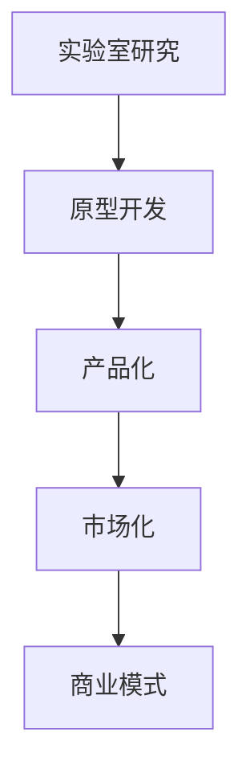

                 

# 技术创新：从实验室研究到商业化落地全过程

## 1. 背景介绍

### 1.1 问题由来
在科技迅速发展的今天，技术创新已成为推动社会进步和产业升级的重要引擎。然而，技术从实验室研究到商业化落地，不仅需要理论的突破，更涉及产品化、市场化、商业模式构建等多方面的挑战。本文将系统梳理从技术研究到商业化落地的全过程，希望为行业内的研究人员和从业者提供有价值的指导。

## 2. 核心概念与联系

### 2.1 核心概念概述

为更好地理解技术创新从实验室研究到商业化落地的全过程，本节将介绍几个关键概念及其内在联系：

- **实验室研究(Laboratory Research)**：在学术界或研究机构进行的理论和技术研究，通常以论文、专利等形式呈现。
- **原型开发(Prototype Development)**：在理论研究的基础上，将技术转化为可运行的原型，验证其可行性和实用性。
- **产品化(Productization)**：将原型技术进一步优化和完善，开发出具有商业价值的产品，解决特定问题或满足市场需求。
- **市场化(Market Penetration)**：产品通过营销和推广，进入市场并获取用户反馈，实现商业化运作。
- **商业模式(Revenue Model)**：产品实现商业化后，通过选择合适的商业模式，如订阅制、广告收入、授权费等，实现盈利。

这些核心概念之间的逻辑关系可以通过以下Mermaid流程图来展示：



这个流程图展示了技术从研究到落地的主要环节：从实验室研究，到原型开发，再到产品化、市场化，最终形成商业模式，实现商业价值的循环。

## 3. 核心算法原理 & 具体操作步骤

### 3.1 算法原理概述

技术创新的核心在于算法和模型的创新，从而解决特定问题或提升用户体验。在实验室研究阶段，研究人员通过算法原理的研究，提出新的理论和技术方法。这些理论方法经过验证后，进入原型开发阶段。

以自然语言处理(NLP)为例，研究人员可能发现某种基于深度学习的新算法，可以显著提高文本分类、情感分析等任务的精度。这一算法需要在实验室内进行深入的原理研究，并在实验中验证其有效性。一旦原理被验证，算法即可转化为产品化的原型。

### 3.2 算法步骤详解

技术创新从实验室研究到商业化落地，主要包括以下几个关键步骤：

**Step 1: 实验室研究**
- **问题定义**：明确研究目标，提出需要解决的具体问题。
- **算法设计**：基于问题定义，设计新的算法或改进现有算法。
- **理论验证**：通过实验验证算法的效果和原理。
- **成果发布**：将研究成果以论文、专利等形式发表，共享给学术界和业界。

**Step 2: 原型开发**
- **实现细节**：根据实验室研究中的算法，实现具体的技术方案。
- **初步测试**：在小规模数据集上进行测试，验证算法的可行性。
- **功能扩展**：根据测试反馈，对算法进行迭代优化。

**Step 3: 产品化**
- **用户需求分析**：调研目标用户需求，确定产品功能和特性。
- **界面设计**：设计产品界面，提高用户体验。
- **性能优化**：针对大规模数据集和实际应用场景，优化算法性能。
- **部署部署**：将产品部署到服务器，准备上线。

**Step 4: 市场化**
- **营销推广**：通过线上线下渠道，宣传产品的优势和特色。
- **用户反馈**：收集用户反馈，识别产品的问题和改进点。
- **版本迭代**：根据用户反馈，持续优化产品功能，提升用户体验。

**Step 5: 商业模式**
- **选择模式**：根据产品特性和市场需求，选择合适的商业模式，如SaaS、PaaS、CaaS等。
- **业务运营**：建立产品销售、客户服务、技术支持等业务运营体系。
- **盈利模式**：通过订阅费、广告收入、数据增值服务等，实现商业化盈利。

通过以上步骤，技术从实验室研究到商业化落地，形成了一个闭环。每个环节都需要紧密衔接，确保技术的持续改进和商业价值的最大化。

### 3.3 算法优缺点

技术创新的过程中，实验室研究和原型开发阶段需要高质量的算法设计，而产品化、市场化和商业模式阶段则需要良好的用户体验和商业模式构建。两者在时间、成本、资源等方面存在差异，各有优缺点：

- **实验室研究的优点**：理论基础扎实，可以解决更加复杂和根本的问题；
- **实验室研究的缺点**：时间较长，成本较高，对实际应用场景的适应性需进一步验证。

- **原型开发的优点**：可以快速验证算法效果，适应实际应用场景；
- **原型开发的缺点**：功能可能不够完善，用户体验有待提升。

- **产品化的优点**：面向实际用户，可以进一步优化产品功能；
- **产品化的缺点**：需要投入大量资源进行优化，开发成本较高。

- **市场化的优点**：可以迅速收集用户反馈，调整产品策略；
- **市场化的缺点**：需要面临市场竞争，推广难度较大。

- **商业模式的优点**：实现盈利，形成良性循环；
- **商业模式的缺点**：需要谨慎选择，避免陷入竞争激烈的领域。

## 4. 数学模型和公式 & 详细讲解 & 举例说明

### 4.1 数学模型构建

技术创新涉及的算法和模型，通常需要数学模型来描述其原理和计算过程。以下以深度学习模型为例，介绍数学模型的构建。

假设我们开发了一种新的神经网络模型，用于图像分类任务。其输入为图像特征向量 $x$，输出为分类概率分布 $y$。模型的计算过程可以表示为：

$$
y = f(x; \theta)
$$

其中 $f$ 为模型函数，$\theta$ 为模型参数。

### 4.2 公式推导过程

为了训练该模型，我们需要构建损失函数，如交叉熵损失函数：

$$
L(y, \hat{y}) = -\frac{1}{N} \sum_{i=1}^N \sum_{j=1}^K y_{ij} \log \hat{y}_{ij}
$$

其中 $N$ 为样本数，$K$ 为类别数，$y_{ij}$ 为第 $i$ 个样本属于第 $j$ 类别的真实概率，$\hat{y}_{ij}$ 为模型预测的第 $i$ 个样本属于第 $j$ 类别的概率。

利用梯度下降算法，模型的优化目标为：

$$
\theta^* = \mathop{\arg\min}_{\theta} L(y, \hat{y})
$$

梯度下降算法的更新公式为：

$$
\theta \leftarrow \theta - \alpha \nabla_{\theta} L(y, \hat{y})
$$

其中 $\alpha$ 为学习率，$\nabla_{\theta} L(y, \hat{y})$ 为损失函数对参数 $\theta$ 的梯度。

### 4.3 案例分析与讲解

以图像分类为例，我们将收集一批图像数据，使用深度学习模型进行训练和测试。首先，通过卷积神经网络提取图像特征，利用softmax函数计算分类概率，再构建交叉熵损失函数。接着，使用梯度下降算法对模型进行优化，直到损失函数最小化。最终，在测试集上进行评估，得到模型的分类精度。

## 5. 项目实践：代码实例和详细解释说明

### 5.1 开发环境搭建

在进行技术创新和产品开发前，需要搭建好开发环境。以下是使用Python进行深度学习开发的常见环境配置：

1. 安装Anaconda：从官网下载并安装Anaconda，用于创建独立的Python环境。
2. 创建并激活虚拟环境：
```bash
conda create -n pytorch-env python=3.8 
conda activate pytorch-env
```
3. 安装PyTorch：根据CUDA版本，从官网获取对应的安装命令。例如：
```bash
conda install pytorch torchvision torchaudio cudatoolkit=11.1 -c pytorch -c conda-forge
```
4. 安装TensorFlow：
```bash
conda install tensorflow
```
5. 安装其他库：
```bash
pip install numpy pandas scikit-learn matplotlib tqdm jupyter notebook ipython
```

完成上述步骤后，即可在`pytorch-env`环境中进行深度学习开发。

### 5.2 源代码详细实现

以下是使用TensorFlow开发图像分类模型的完整代码实现：

```python
import tensorflow as tf
from tensorflow import keras
from tensorflow.keras import layers

# 加载数据集
(x_train, y_train), (x_test, y_test) = keras.datasets.mnist.load_data()

# 数据预处理
x_train = x_train.reshape(x_train.shape[0], 28, 28, 1).astype('float32') / 255.0
x_test = x_test.reshape(x_test.shape[0], 28, 28, 1).astype('float32') / 255.0

# 定义模型
model = keras.Sequential([
    layers.Conv2D(32, kernel_size=(3, 3), activation='relu', input_shape=(28, 28, 1)),
    layers.MaxPooling2D(pool_size=(2, 2)),
    layers.Flatten(),
    layers.Dense(128, activation='relu'),
    layers.Dense(10, activation='softmax')
])

# 编译模型
model.compile(optimizer='adam',
              loss='sparse_categorical_crossentropy',
              metrics=['accuracy'])

# 训练模型
model.fit(x_train, y_train, epochs=5, batch_size=32, validation_data=(x_test, y_test))

# 评估模型
model.evaluate(x_test, y_test)
```

在上述代码中，我们使用了TensorFlow构建了一个简单的卷积神经网络，用于MNIST手写数字识别任务。具体步骤如下：

- 加载MNIST数据集，并进行数据预处理。
- 定义模型结构，包含卷积层、池化层、全连接层等。
- 编译模型，选择Adam优化器，使用交叉熵损失函数，评估指标为准确率。
- 训练模型，并使用测试集评估模型性能。

### 5.3 代码解读与分析

在代码中，我们首先使用`keras.datasets`模块加载MNIST数据集，并对数据进行预处理。接着，定义了一个包含卷积层、池化层、全连接层的模型结构。在编译模型时，选择了Adam优化器和交叉熵损失函数，并指定了评估指标。最后，使用`fit`方法训练模型，并使用`evaluate`方法评估模型性能。

## 6. 实际应用场景

### 6.1 智能客服系统

技术创新的应用场景之一是智能客服系统。通过深度学习和自然语言处理技术，可以构建智能客服机器人，实现7x24小时不间断服务。系统能够自动理解用户意图，匹配最合适的答案模板进行回复。

### 6.2 金融舆情监测

技术创新的另一应用场景是金融舆情监测。金融机构需要实时监测市场舆论动向，以规避金融风险。通过深度学习模型和自然语言处理技术，可以构建舆情监测系统，自动检测和分析金融领域的情感和主题信息。

### 6.3 个性化推荐系统

技术创新在推荐系统中的应用场景是个性化推荐。通过深度学习和数据分析技术，可以构建个性化推荐系统，根据用户的历史行为和偏好，推荐最适合的产品或内容。

### 6.4 未来应用展望

随着技术创新的不断深入，未来的应用场景将更加广泛和多样化。例如：

- **医疗健康**：利用深度学习模型和医疗数据，构建智能医疗系统，提供个性化的健康管理和服务。
- **教育培训**：通过深度学习和数据分析技术，构建智能教育平台，提供个性化的学习资源和课程。
- **智能家居**：利用深度学习模型和传感器数据，构建智能家居系统，提供个性化的家居服务和体验。

## 7. 工具和资源推荐

### 7.1 学习资源推荐

为了帮助研究人员和从业者掌握技术创新全过程，以下是推荐的几个学习资源：

1. Coursera《深度学习专项课程》：由深度学习领域的专家开设，系统讲解深度学习理论和实践。
2. Udacity《人工智能工程师纳米学位》：涵盖深度学习、自然语言处理、计算机视觉等多个领域，实战项目丰富。
3. Kaggle：数据科学竞赛平台，提供大量数据集和模型，适合实践和竞赛。
4. GitHub：代码托管平台，提供丰富的开源项目和代码库，适合学习和参考。

### 7.2 开发工具推荐

高效的技术开发离不开优秀的工具支持。以下是推荐的几个开发工具：

1. Jupyter Notebook：Python代码编辑器，支持多平台，适合学习和实验。
2. Visual Studio Code：通用IDE，支持多种语言和工具集成，适合编程和开发。
3. Git：版本控制系统，支持协作开发和代码管理，适合团队开发。
4. Docker：容器化技术，支持跨平台部署，适合环境复现和部署。

### 7.3 相关论文推荐

技术创新的成功离不开论文和研究的支持。以下是几篇奠基性的相关论文，推荐阅读：

1. ImageNet Classification with Deep Convolutional Neural Networks：提出深度卷积神经网络，推动计算机视觉领域的发展。
2. Attention is All You Need：提出Transformer结构，开创了NLP领域预训练大模型时代。
3. Deep Learning for Natural Language Processing：总结深度学习在NLP领域的成功应用。
4. Generative Adversarial Networks：提出生成对抗网络，推动生成模型和图像生成技术的发展。

## 8. 总结：未来发展趋势与挑战

### 8.1 研究成果总结

技术创新从实验室研究到商业化落地，涉及多个环节和领域，每个环节都需要精心设计和持续优化。通过系统梳理全过程，可以更好地理解技术创新的本质和挑战，从而在实践中不断提升技术水平和创新能力。

### 8.2 未来发展趋势

未来，技术创新将继续在多个领域取得突破，呈现以下趋势：

1. **跨学科融合**：技术创新将更加注重跨学科融合，如计算机科学、数学、工程学、生物医学等领域的交叉应用。
2. **智能化和自动化**：技术创新将更加注重智能化和自动化，利用深度学习和大数据技术，解决复杂问题，提升效率和精度。
3. **用户体验优化**：技术创新将更加注重用户体验，通过设计思维和用户研究，提升产品的易用性和满意度。
4. **可持续发展**：技术创新将更加注重可持续发展，通过绿色技术和能源优化，实现环境的和谐共生。
5. **伦理和安全**：技术创新将更加注重伦理和安全，通过隐私保护、数据安全等措施，保障技术应用的安全和合法性。

### 8.3 面临的挑战

尽管技术创新前景广阔，但在实践中仍面临诸多挑战：

1. **资源瓶颈**：技术创新的每个环节都需要投入大量资源，包括资金、人力、设备等。如何高效利用资源，是挑战之一。
2. **市场竞争**：技术创新的竞争激烈，如何在众多竞争者中脱颖而出，是挑战之二。
3. **数据隐私**：技术创新过程中需要处理大量敏感数据，如何保护用户隐私，是挑战之三。
4. **技术壁垒**：技术创新的难度较大，如何打破技术壁垒，是挑战之四。
5. **伦理问题**：技术创新的应用可能带来伦理问题，如何平衡技术和伦理，是挑战之五。

### 8.4 研究展望

未来的技术创新需要在以下方面进一步深入研究：

1. **多模态融合**：将文本、图像、语音等多种模态的数据进行融合，提升综合分析和决策能力。
2. **知识图谱**：构建大规模的知识图谱，与深度学习模型进行融合，提升知识的表示和推理能力。
3. **计算图优化**：优化深度学习模型的计算图，减少计算资源消耗，提升推理效率。
4. **神经网络压缩**：通过剪枝、量化等技术，减少深度学习模型的参数量，提升计算效率。
5. **联邦学习**：通过分布式学习和联邦学习，保护用户数据隐私，同时提升模型的泛化能力。

## 9. 附录：常见问题与解答

**Q1：技术创新从实验室研究到商业化落地需要多长时间？**

A: 技术创新从实验室研究到商业化落地的时间周期取决于多个因素，包括技术难度、市场应用需求、开发资源等。一般而言，可能需要数月到数年的时间。

**Q2：如何评估技术创新的效果？**

A: 技术创新的效果评估通常通过以下几个方面进行：

1. **技术指标**：如精度、召回率、F1值等，评估模型或算法的性能。
2. **用户体验**：通过用户反馈和满意度调查，评估产品的用户体验。
3. **市场反馈**：通过市场销售和用户增长，评估产品的市场表现。
4. **成本效益**：通过成本和收益对比，评估技术的商业价值。

**Q3：技术创新过程中如何平衡成本和收益？**

A: 技术创新的成本和收益需要综合考虑，制定合理的预算和预期。以下是一些平衡方法：

1. **资源优化**：通过合理分配资源，提高技术创新的效率和效果。
2. **市场策略**：通过市场定位和销售策略，降低成本，提高收益。
3. **合作伙伴**：通过与合作伙伴合作，共享资源和风险。
4. **持续改进**：通过持续改进技术，提高技术成熟度和应用价值。

**Q4：技术创新过程中如何规避伦理问题？**

A: 技术创新过程中需要高度重视伦理问题，以下是一些规避方法：

1. **伦理审查**：在技术创新过程中进行伦理审查，确保技术应用的合法性。
2. **隐私保护**：通过数据加密、匿名化等技术，保护用户隐私。
3. **透明公开**：保持技术的透明和公开，接受社会监督和反馈。
4. **法律法规**：遵守相关法律法规，确保技术应用的合规性。

**Q5：如何构建可持续发展的技术创新体系？**

A: 构建可持续发展的技术创新体系需要考虑多个方面：

1. **环境友好**：通过绿色技术和能源优化，减少技术创新的环境影响。
2. **资源高效**：通过资源优化和循环利用，提高资源利用效率。
3. **社会责任**：通过社会责任和公益活动，提升技术创新的社会价值。
4. **持续改进**：通过持续改进技术，提升技术创新的可持续性。

---

作者：禅与计算机程序设计艺术 / Zen and the Art of Computer Programming

