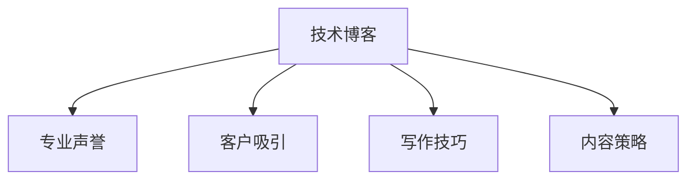

                 

# 技术博客写作：建立专业声誉和吸引客户

> 关键词：技术博客, 专业声誉, 客户吸引, 写作技巧, 内容策略

## 1. 背景介绍

### 1.1 问题由来
在互联网技术日新月异的今天，技术博客已成为展示技术积累、分享经验心得的重要平台。许多IT工作者和开发者，通过撰写博客文章，不断积累粉丝，提升个人或公司的专业声誉，吸引更多的技术合作机会和客户。然而，如何撰写出高质量、有价值的技术博客，却是一项具有挑战性的任务。本文旨在探讨技术博客写作的艺术，通过结构化的内容呈现、逻辑清晰的论证方式以及实用的写作技巧，帮助读者掌握撰写技术博客的精髓，提升自身的技术传播力和商业价值。

### 1.2 问题核心关键点
技术博客的核心在于提供深入、实用的技术洞见，帮助读者解决实际问题，提升技术水平。成功的技术博客应具备以下特点：
- **深度**：讨论技术细节，剖析问题本质，提供解决方案。
- **广度**：涵盖多个相关领域，形成系统化的知识体系。
- **实践性**：结合实际项目或案例，展示技术应用效果。
- **可读性**：语言简洁，逻辑清晰，内容易于理解。
- **创新性**：提出新颖观点，探索前沿技术。

## 2. 核心概念与联系

### 2.1 核心概念概述

要撰写高质量的技术博客，首先需要明确几个关键概念：

- **技术博客**：分享技术观点、经验、研究成果的在线平台，通常以文章形式呈现。
- **专业声誉**：通过持续发布高价值内容，积累技术影响力，提升个人或公司在该领域的权威性和可信度。
- **客户吸引**：通过技术博客展示技术实力和商业解决方案，吸引潜在客户，推动业务合作。
- **写作技巧**：包括标题设计、结构安排、语言风格、内容布局等方面，是撰写高质量博客的必备技能。
- **内容策略**：包括选题策划、内容定位、发布计划等，是内容创作和传播的指导方针。

这些概念之间的联系可以通过以下Mermaid流程图来展示：



这个流程图展示了技术博客与其它核心概念之间的联系：

1. 技术博客是专业声誉和客户吸引的基础。
2. 写作技巧和内容策略是保证博客质量的关键。
3. 只有高质量的博客才能真正提升专业声誉，吸引客户。

## 3. 核心算法原理 & 具体操作步骤

### 3.1 算法原理概述

技术博客的写作，本质上是一个内容创作与传播的优化过程。其核心思想是：在有限的资源和时间条件下，通过高效的内容创作策略和优化方法，最大化地吸引读者，提升品牌影响力，促进商业合作。

形式化地，假设博客读者数为 $R$，每篇文章带来的关注度为 $E$，文章的发布周期为 $T$，则总关注度为：

$$
G = R \times E \times T
$$

优化目标是在资源（时间和人力）有限的情况下，最大化总关注度 $G$。这通常需要通过选择合适的文章主题、优化文章质量、调整发布策略等方式来实现。

### 3.2 算法步骤详解

技术博客的写作和优化一般包括以下几个关键步骤：

**Step 1: 主题策划与选题**

- **市场调研**：通过问卷调查、行业报告、社交媒体分析等手段，了解读者需求和市场趋势。
- **竞争分析**：分析同类博客或竞争对手的选题方向，避免重复内容，寻找差异化主题。
- **个人兴趣与专长**：结合个人兴趣和专业背景，确定有深度、有价值的内容方向。

**Step 2: 内容创作与写作**

- **框架设计**：制定文章大纲，明确每个部分的核心内容，确保逻辑清晰、层次分明。
- **语言风格**：使用专业、简洁、生动的语言，避免过度的技术术语和复杂概念，确保读者易于理解。
- **案例分析**：结合实际案例或项目，展示技术的应用效果和解决思路，增强说服力。
- **图表与代码**：使用图表和代码片段，辅助说明技术细节，提升文章可读性。

**Step 3: 内容优化与发布**

- **SEO优化**：通过关键词选择、标题优化、Meta描述等方式，提升文章在搜索引擎中的排名。
- **社交媒体推广**：在社交媒体平台上发布文章摘要和关键观点，吸引更多读者。
- **反馈与互动**：鼓励读者留言评论，积极回复和交流，提升文章活跃度。
- **定期更新**：根据读者反馈和市场变化，不断更新和完善博客内容，保持长期吸引力。

**Step 4: 效果评估与迭代**

- **阅读量与互动率**：统计文章的阅读量、评论数、分享数等指标，评估文章效果。
- **内容反馈**：收集读者对文章内容的评价和建议，优化未来创作方向。
- **ROI分析**：评估文章带来的商业价值，如吸引到的客户、达成的合作等，进行投资回报分析。

### 3.3 算法优缺点

技术博客的写作和优化方法具有以下优点：
1. 提升专业声誉：通过分享专业知识和经验，积累技术影响力。
2. 吸引客户关注：展示技术实力和商业解决方案，吸引潜在客户。
3. 扩大影响范围：借助SEO和社交媒体，扩大读者群体。
4. 促进互动交流：通过读者反馈和互动，建立良好的社区氛围。
5. 持续改进优化：通过效果评估和迭代，不断提高内容质量。

同时，该方法也存在一定的局限性：
1. 内容创作成本高：高质量博客需要大量时间和精力投入。
2. 技术更新快：需要不断更新知识体系，保持内容时效性。
3. 市场竞争激烈：竞争者众多，找到差异化主题和内容难度大。
4. 效果难以量化：对文章的商业效果难以精确衡量。
5. 营销推广难度：SEO和社交媒体推广需要一定的技巧和资源。

尽管存在这些局限性，但就目前而言，技术博客的写作和优化方法仍是最主流的传播途径。未来相关研究的重点在于如何进一步降低内容创作成本，提高营销推广效果，同时兼顾内容的质量和时效性。

### 3.4 算法应用领域

技术博客的写作和优化方法在多个领域都有广泛应用，例如：

- **软件开发**：通过博客分享编程技巧、技术栈、项目经验等，提升个人品牌价值，吸引技术合作。
- **数据科学**：发布数据分析案例、机器学习算法、数据可视化工具等，展示技术实力，促进业务合作。
- **人工智能**：撰写AI前沿技术、模型训练、应用案例等，吸引业界关注，推动商业合作。
- **区块链**：分享区块链技术、应用场景、开发工具等，提升品牌影响力，吸引投资与合作。
- **网络安全**：发布网络安全漏洞、防护措施、安全工具等，展示技术能力，增强客户信任。
- **云计算**：讲解云平台、容器化技术、微服务架构等，展示技术深度，促进云计算服务推广。

除了这些领域外，技术博客还被创新性地应用到更多场景中，如开源项目、技术咨询、在线教育等，为技术传播提供了新的渠道。随着技术的不断演进，相信技术博客将在更广阔的领域发挥更大的作用。

## 4. 数学模型和公式 & 详细讲解 & 举例说明

### 4.1 数学模型构建

技术博客的写作效果可以通过以下数学模型来量化：

设文章总关注度为 $G$，每篇文章带来的关注度为 $E$，文章的发布周期为 $T$，读者数为 $R$，则总关注度 $G$ 的数学模型为：

$$
G = R \times E \times T
$$

其中：

- $R$：读者数，表示访问博客的独立访客数量。
- $E$：每篇文章带来的关注度，可以通过阅读量、评论数、分享数等指标综合衡量。
- $T$：文章发布周期，表示一定时间内发布的文章数量。

### 4.2 公式推导过程

为了最大化总关注度 $G$，我们可以引入优化公式：

$$
\max_{R, E, T} G = R \times E \times T
$$

优化目标是在资源（时间和人力）有限的情况下，最大化总关注度 $G$。通过以下策略实现：

1. **市场调研**：选择热门话题，提升 $R$ 值。
2. **内容优化**：提升文章质量，增加 $E$ 值。
3. **发布频率**：调整发布频率，优化 $T$ 值。

### 4.3 案例分析与讲解

假设某技术博客每篇文章的平均阅读量为 $E=1000$，每周发布 $T=5$ 篇文章，每月读者数 $R=10000$。则总关注度 $G$ 为：

$$
G = 10000 \times 1000 \times 4 = 4000000
$$

若通过SEO优化，使每篇文章的阅读量提升至 $E=2000$，则总关注度 $G$ 变为：

$$
G = 10000 \times 2000 \times 4 = 8000000
$$

通过社交媒体推广，使每篇文章的分享数从0增加至 $E=1200$，则总关注度 $G$ 进一步提升至：

$$
G = 10000 \times 1200 \times 4 = 4800000
$$

这表明，通过有效的SEO优化和社交媒体推广，可以显著提升博客的总关注度，进而吸引更多的读者和客户。

## 5. 项目实践：代码实例和详细解释说明

### 5.1 开发环境搭建

在进行技术博客的开发前，我们需要准备好开发环境。以下是使用Python进行PyTorch开发的环境配置流程：

1. 安装Anaconda：从官网下载并安装Anaconda，用于创建独立的Python环境。

2. 创建并激活虚拟环境：
```bash
conda create -n blog-env python=3.8 
conda activate blog-env
```

3. 安装PyTorch：根据CUDA版本，从官网获取对应的安装命令。例如：
```bash
conda install pytorch torchvision torchaudio cudatoolkit=11.1 -c pytorch -c conda-forge
```

4. 安装相关库：
```bash
pip install markdown numpy pandas scikit-learn plotly
```

完成上述步骤后，即可在`blog-env`环境中开始技术博客的开发。

### 5.2 源代码详细实现

以下是一个使用Python和Markdown格式编写的技术博客示例：

```python
# 博客标题
# ==========

## 博客副标题
## =========

### 博客内容
#### 1. 博客主题
##### 1.1 子主题
###### 1.1.1 小标题
- 列表项1
- 列表项2

### 博客代码实现
```python
# 示例代码
def my_function():
    # 代码实现
    pass
```

### 博客效果展示
- **效果1**: 代码输出
- **效果2**: 图表展示

### 博客结论与总结
- 总结1
- 总结2
```

### 5.3 代码解读与分析

让我们再详细解读一下关键代码的实现细节：

**博客标题**：
- 使用Markdown格式，支持多级标题，便于读者快速浏览。
- 通过`#`符号表示标题级别，如`# Blog Title`表示一级标题。

**博客内容**：
- 通过`##`、`###`、`####`等符号，表示不同级别的子标题，使内容结构清晰。
- 使用`-`符号表示无序列表，使用`1.`、`2.`、`3.`等编号表示有序列表，支持标题下的详细说明和代码示例。
- 通过````python`和`````等符号，插入代码块，支持代码高亮显示。
- 通过`![]`符号，插入图片或图表，增强视觉效果。

**博客效果展示**：
- 使用Markdown的`*`符号，插入粗体文本。
- 使用Markdown的`_`符号，插入下划线文本。
- 使用Markdown的`**`符号，插入加粗文本。

**博客结论与总结**：
- 通过`-`符号，插入总结列表，使结论清晰明了。
- 使用Markdown的`![]`符号，插入图表或链接，进一步提升文章质量。

## 6. 实际应用场景

### 6.1 开源项目维护

技术博客在开源项目维护中起着至关重要的作用。项目文档、API说明、开发日志等，都是通过技术博客的形式进行发布。开发者通过撰写技术博客，可以展示项目进度、技术细节、问题修复等，增强社区的活跃度和技术交流。

在技术博客中，可以详细介绍项目的架构设计、实现细节、性能优化、测试方法等内容，帮助其他开发者更好地理解和使用项目。同时，通过问题描述和解决方案的分享，还能增强社区的凝聚力，提升项目的知名度。

### 6.2 技术咨询与培训

技术博客也是展示技术咨询和培训服务的重要平台。许多技术咨询公司和技术培训机构，通过博客分享技术文章、案例分析、培训课程等，吸引潜在客户。

通过技术博客，技术咨询师可以展示自己的技术实力和成功案例，吸引更多的客户咨询。同时，通过博客分享技术培训课程，还能吸引技术爱好者报名参加，扩大培训业务的覆盖面。

### 6.3 产品推广与营销

技术博客也是产品推广和营销的重要渠道。许多公司通过博客发布产品教程、技术文档、使用案例等，展示产品的技术优势和实际应用效果，吸引更多客户。

技术博客通过深入的技术分析和案例展示，使产品更加生动具体，帮助潜在客户更好地理解和应用产品。同时，通过博客的SEO优化和社交媒体推广，还能提升产品的知名度和曝光率。

## 7. 工具和资源推荐

### 7.1 学习资源推荐

为了帮助开发者系统掌握技术博客写作的理论基础和实践技巧，这里推荐一些优质的学习资源：

1. **《博客写作的艺术》**：由知名博客作者撰写，深入浅出地介绍了博客创作的基本原则和技巧，适合初学者阅读。
2. **《SEO优化指南》**：详细讲解SEO技术，包括关键词选择、内容优化、链接建设等，适合提升博客的搜索引擎排名。
3. **《Markdown语法手册》**：全面介绍Markdown语法，包括格式设置、代码插入、图片插入等，适合掌握博客的撰写技巧。
4. **《内容营销圣经》**：详细讲解内容营销的理论和实践，包括选题策划、内容创作、效果评估等，适合提升博客的内容策略。

通过对这些资源的学习实践，相信你一定能够快速掌握技术博客写作的精髓，并用于解决实际的传播问题。

### 7.2 开发工具推荐

高效的开发离不开优秀的工具支持。以下是几款用于技术博客开发的常用工具：

1. **GitHub Pages**：GitHub提供的免费静态网站托管服务，支持Markdown格式，适合发布技术博客。
2. **Jekyll**：基于Ruby的静态网站生成器，支持Markdown格式，适合开发自定义博客平台。
3. **Hexo**：基于Node.js的静态网站生成器，支持Markdown格式，适合开发高度可定制的博客平台。
4. **Google Analytics**：统计博客访问量、用户行为等数据，评估博客效果。
5. **SEMrush**：SEO优化工具，帮助提升博客在搜索引擎中的排名。
6. **Hootsuite**：社交媒体管理工具，帮助发布和推广博客内容。

合理利用这些工具，可以显著提升技术博客的开发效率，加快创新迭代的步伐。

### 7.3 相关论文推荐

技术博客的研究也在不断进步，以下是几篇具有代表性的论文，推荐阅读：

1. **《博客写作的技术与艺术》**：探讨博客写作的心理学和行为学，提出有效提高读者参与度的策略。
2. **《博客SEO优化指南》**：详细介绍博客的SEO优化方法，提供实际案例和最佳实践。
3. **《内容策略的科学与艺术》**：研究内容策略的理论和实践，提出系统化的内容创作和传播方法。
4. **《博客效果评估与优化》**：分析博客效果的多维度指标，提出有效的评估和优化方法。

这些论文代表了大语言模型微调技术的发展脉络。通过学习这些前沿成果，可以帮助研究者把握学科前进方向，激发更多的创新灵感。

## 8. 总结：未来发展趋势与挑战

### 8.1 总结

本文对技术博客写作的艺术进行了全面系统的介绍。首先阐述了技术博客与专业声誉和客户吸引之间的关系，明确了博客写作在技术传播和商业合作中的重要作用。其次，从原理到实践，详细讲解了技术博客写作的数学模型和操作步骤，给出了技术博客的完整代码实例。同时，本文还广泛探讨了技术博客在开源项目、技术咨询、产品推广等诸多领域的应用前景，展示了博客范式的广泛适用性。

通过本文的系统梳理，可以看到，技术博客写作不仅是一种传播方式，更是展示技术实力和吸引客户的重要手段。未来，伴随内容创作技术的不断进步，技术博客将在更广阔的领域发挥更大的作用。

### 8.2 未来发展趋势

展望未来，技术博客写作的发展趋势主要包括以下几个方面：

1. **内容多样化**：随着AI、大数据等技术的进步，博客内容将更加丰富，包括视频、音频、交互式图表等，提升读者的体验感。
2. **社交化互动**：博客将更加注重社交化互动，通过评论、投票、直播等方式，增强读者的参与度。
3. **数据驱动**：利用大数据分析工具，实时监控博客效果，动态调整内容策略，提升博客的传播效果。
4. **个性化推荐**：通过推荐系统，将博客推荐给感兴趣的读者，提升内容的精准度和覆盖面。
5. **跨平台整合**：博客将与其他社交媒体、论坛、社区等平台整合，形成内容生态，扩大影响力。

这些趋势表明，技术博客正在逐步向社交化、数据驱动、个性化方向发展，未来将成为内容传播的重要平台。

### 8.3 面临的挑战

尽管技术博客写作有着广泛的应用前景，但在迈向更加智能化、普适化应用的过程中，它仍面临着诸多挑战：

1. **内容创作难度大**：高质量的博客需要大量的时间和精力投入，特别是在快速变化的技术领域。
2. **竞争激烈**：博客作者众多，找到差异化主题和内容难度大，难以脱颖而出。
3. **效果难以量化**：对博客的商业效果难以精确衡量，难以准确评估内容的商业价值。
4. **平台依赖性强**：博客的传播和推广依赖于各类平台和工具，平台变化可能带来影响。
5. **读者期望高**：读者对内容质量要求高，博客作者需要不断提升写作水平和传播技巧。

尽管存在这些挑战，但通过不断优化博客内容创作和传播策略，技术博客仍有很大的发展潜力。

### 8.4 研究展望

面向未来，技术博客研究需要在以下几个方面寻求新的突破：

1. **内容自动化**：探索自动化的内容创作和优化方法，降低内容创作成本，提高传播效率。
2. **社区建设**：通过社区建设，增强读者参与度，形成稳定的读者群体。
3. **跨平台整合**：探索跨平台的整合方法，提升博客的影响力和覆盖面。
4. **数据驱动**：利用大数据分析工具，实时监控和优化博客效果。
5. **个性化推荐**：开发个性化推荐系统，提升内容的精准度和覆盖面。

这些研究方向的探索，必将引领技术博客写作技术迈向更高的台阶，为内容传播带来新的突破。

## 9. 附录：常见问题与解答

**Q1：技术博客是否适用于所有技术领域？**

A: 技术博客在各个技术领域都有广泛应用，特别是对于开源项目、技术咨询、产品推广等具有较高的价值。但对于一些高度专业化的技术领域，如复杂算法、底层架构等，可能需要结合其他形式的内容传播方式。

**Q2：如何提高技术博客的阅读量？**

A: 提高技术博客的阅读量，可以通过以下几个策略：
1. **内容质量**：发布深度、实用的技术文章，吸引读者的关注。
2. **SEO优化**：通过关键词优化、内容结构优化等手段，提升搜索引擎排名。
3. **社交媒体推广**：在社交媒体平台上发布文章摘要和关键观点，吸引更多读者。
4. **读者互动**：鼓励读者留言评论，积极回复和交流，提升文章活跃度。
5. **定期更新**：根据读者反馈和市场变化，不断更新和完善博客内容，保持长期吸引力。

**Q3：技术博客能否带来商业价值？**

A: 技术博客可以带来显著的商业价值，通过展示技术实力和商业解决方案，吸引潜在客户，推动业务合作。具体来说，可以通过以下几种方式：
1. **吸引客户咨询**：展示技术实力和成功案例，吸引客户进行技术咨询。
2. **推广产品服务**：发布产品教程、技术文档、使用案例等，展示产品技术优势，促进产品销售。
3. **提升品牌影响力**：通过高质量内容，提升公司在技术领域的知名度和信誉度。

总之，技术博客不仅是展示技术积累、分享经验心得的重要平台，更是建立专业声誉、吸引客户的重要手段。

---

作者：禅与计算机程序设计艺术 / Zen and the Art of Computer Programming

