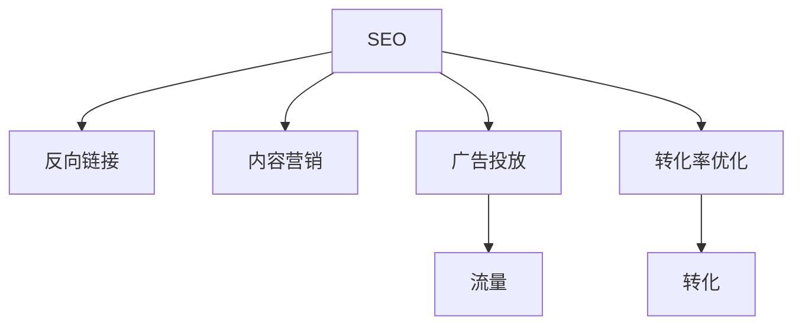

                 

# 技术博客：SEO优化与流量变现

> 关键词：搜索引擎优化(SEO), 流量变现, 搜索引擎排名, 关键词策略, 反向链接, 内容营销, 广告投放, 转化率优化

## 1. 背景介绍

### 1.1 问题由来

在互联网日益普及的今天，无论是电子商务网站、新闻媒体、教育平台，还是博客和论坛，如何吸引更多用户访问、提高网站流量，一直是网站运营者关注的焦点。互联网企业面临着巨大的竞争压力，如何在茫茫互联网海洋中吸引用户眼球，成为每一个互联网从业者都需要深思的问题。

搜索引擎优化（SEO），是互联网企业提升流量、提高用户转化率的重要手段。通过搜索引擎优化，可以在用户搜索相关内容时，提升网站在搜索引擎中的排名，吸引更多的访问流量。流量变现，则是通过各种手段将这些流量转化为实际的经济价值。

### 1.2 问题核心关键点

基于搜索引擎优化和流量变现的目标，本文将围绕以下几个核心关键点展开：

- **关键词策略**：如何选择关键词，并利用这些关键词提升网站在搜索引擎中的排名。
- **反向链接建设**：如何通过获取反向链接（即其他网站指向自己网站的链接），提升网站权威性和排名。
- **内容营销**：如何通过优质内容，吸引用户点击，并促使他们完成转化。
- **广告投放**：如何通过线上广告投放，精准定位目标用户，提升流量和转化率。
- **转化率优化**：如何通过优化网站结构和内容布局，提高用户转化率，实现流量变现。

## 2. 核心概念与联系

### 2.1 核心概念概述

为更好地理解SEO优化与流量变现的原理和操作步骤，本节将介绍几个密切相关的核心概念：

- **搜索引擎优化(SEO)**：指通过优化网站结构和内容，提升在搜索引擎中的排名，吸引更多访问流量。
- **反向链接（Backlink）**：指其他网站指向自己网站的链接，被认为是衡量网站权威性和排名的重要指标。
- **内容营销（Content Marketing）**：指通过创造和分发有价值的内容，吸引和留住目标客户，进而推动客户转化。
- **广告投放（Advertising）**：指通过在线广告平台投放广告，精准定位目标用户，提升网站流量和转化。
- **转化率优化（Conversion Rate Optimization, CRO）**：指通过优化网站设计和内容布局，提高用户转化率，实现流量变现。

这些核心概念之间的逻辑关系可以通过以下Mermaid流程图来展示：



这个流程图展示的核心概念及其之间的关系：

1. 搜索引擎优化(A)通过提升网站在搜索引擎中的排名，吸引更多访问流量。
2. 反向链接(B)和内容营销(C)是SEO的核心手段，通过优化网页内容、提升网站权威性，吸引更多反向链接，从而提升排名。
3. 广告投放(D)是快速获取流量的重要手段，通过精准投放，吸引更多目标用户访问。
4. 转化率优化(F)通过优化网站设计和内容布局，提高用户转化率，实现流量变现。
5. 最终，通过转化率优化，将流量转化为实际的经济价值(G)。

这些概念共同构成了SEO优化与流量变现的整体框架，使网站能够在各种场景下吸引和留住目标用户，实现流量变现。

## 3. 核心算法原理 & 具体操作步骤

### 3.1 算法原理概述

SEO优化与流量变现的核心在于通过优化网站结构和内容，提升网站在搜索引擎中的排名，吸引更多访问流量，并最终实现流量变现。这一过程可以分为以下几个关键步骤：

1. **关键词策略制定**：选择合适的关键词，并优化网站内容，使其包含这些关键词。
2. **反向链接建设**：通过获取高质量反向链接，提升网站权威性和排名。
3. **内容营销**：创建高质量、有价值的内容，吸引并留住目标用户。
4. **广告投放**：通过在线广告平台投放广告，精准定位目标用户，提升网站流量。
5. **转化率优化**：通过优化网站设计和内容布局，提高用户转化率，实现流量变现。

### 3.2 算法步骤详解

#### 3.2.1 关键词策略制定

**Step 1: 关键词研究与分析**
- 使用关键词工具（如Google Keyword Planner、Ahrefs、SEMrush等）进行关键词研究，找出与业务相关的长尾关键词。
- 分析这些关键词的搜索量和竞争程度，选择既有较高搜索量又有较低竞争度的关键词。
- 将选定的关键词整理成关键词列表，作为优化网站内容和结构的依据。

**Step 2: 关键词优化**
- 在网站的主页、标题、描述、H1标签等位置嵌入关键词，确保关键词自然且不堆积。
- 优化网站的结构，确保关键词能够自然地出现在所有页面，而不仅仅是首页。
- 创建相关的高质量内容，如博客文章、产品描述等，使关键词自然地融入其中。

#### 3.2.2 反向链接建设

**Step 1: 建立高质量内容**
- 创建高质量、有价值的内容，如深度文章、研究报告、视频等，吸引其他网站链接。
- 确保内容独一无二，避免抄袭，提升内容的质量和权威性。

**Step 2: 获取反向链接**
- 在社交媒体、行业论坛、博客等平台发布内容，吸引其他网站链接。
- 联系行业内知名的网站，邀请他们链接自己的内容。
- 通过媒体关系管理，获得行业媒体的曝光和链接。

#### 3.2.3 内容营销

**Step 1: 内容创作**
- 创建有价值的内容，如教程、案例研究、指南、视频等，满足目标用户的需求。
- 确保内容质量高、信息量大，具有实用性和可操作性。

**Step 2: 内容分发**
- 在网站、社交媒体、行业论坛、电子邮件等渠道发布内容。
- 利用SEO优化工具，确保内容在搜索引擎中排名靠前。

#### 3.2.4 广告投放

**Step 1: 选择广告平台**
- 根据目标受众和预算，选择合适的广告平台，如Google Ads、Facebook Ads、YouTube Ads等。

**Step 2: 设置广告参数**
- 设置广告投放的时间、地点、受众等参数，确保广告精准投放。
- 创建有吸引力的广告文案和图像，吸引目标用户点击。

**Step 3: 监测和优化**
- 实时监测广告效果，如点击率、转化率等关键指标。
- 根据数据反馈，优化广告内容和投放策略。

#### 3.2.5 转化率优化

**Step 1: 用户体验优化**
- 优化网站加载速度、页面布局、导航结构，确保用户能够快速找到所需信息。
- 确保网站移动端和桌面端体验一致，提高用户满意度。

**Step 2: 表单优化**
- 简化表单填写流程，确保用户填写信息时轻松便捷。
- 增加表单验证和提示，避免用户误填或漏填信息。

**Step 3: 调用行动优化**
- 增加调用行动按钮，如购买按钮、注册按钮等，引导用户完成转化。
- 优化按钮设计，确保用户容易找到并点击。

### 3.3 算法优缺点

**优点**：

- **提升流量和转化**：通过优化网站结构和内容，提升在搜索引擎中的排名，吸引更多访问流量。
- **降低成本**：相比于线下广告，搜索引擎优化和内容营销成本较低。
- **长期效果**：通过优质内容和反向链接，提升网站权威性和排名，具有长期效果。

**缺点**：

- **效果不稳定**：搜索引擎算法不断变化，SEO优化效果可能不稳定。
- **竞争激烈**：随着越来越多网站注重SEO，关键词竞争越来越激烈。
- **需要持续投入**：SEO和内容营销需要持续投入时间和资源，才能维持效果。

### 3.4 算法应用领域

SEO优化与流量变现的方法广泛应用于各种类型的网站和应用中，如：

- **电子商务网站**：提升产品页面在搜索引擎中的排名，吸引更多用户访问和购买。
- **新闻媒体**：通过内容营销和反向链接建设，提升网站流量和用户参与度。
- **博客和论坛**：通过高质量内容吸引用户点击和留存，并实现流量变现。
- **教育平台**：通过优化内容布局和用户体验，提升用户转化率。

SEO优化与流量变现已经成为各类网站和应用的重要运营手段，帮助它们在竞争激烈的市场中脱颖而出。

## 4. 数学模型和公式 & 详细讲解 & 举例说明

### 4.1 数学模型构建

在SEO优化中，核心目标是提升网站在搜索引擎中的排名。假设网站总页面数为 $N$，搜索引擎排名为 $R_i$，其中 $i$ 表示页面编号。通过优化，设优化后的排名为 $R_i^{\prime}$。

优化目标可以表示为：

$$
\min_{\theta} \sum_{i=1}^{N} (R_i - R_i^{\prime})^2
$$

其中，$\theta$ 表示优化过程中的各种参数，如关键词密度、页面质量等。

### 4.2 公式推导过程

**Step 1: 关键词优化**
- 设关键词 $k$ 的搜索量为 $S_k$，优化后的关键词密度为 $d_k^{\prime}$。
- 关键词优化目标为：

$$
\min_{d_k^{\prime}} \sum_{k} (d_k^{\prime} - d_k)^2
$$

其中，$d_k$ 表示原始关键词密度。

**Step 2: 反向链接建设**
- 设反向链接 $l$ 的质量为 $Q_l$，优化后的反向链接数量为 $L_l^{\prime}$。
- 反向链接建设目标为：

$$
\min_{L_l^{\prime}} \sum_{l} (L_l^{\prime} - L_l)^2
$$

其中，$L_l$ 表示原始反向链接数量。

**Step 3: 内容营销**
- 设内容 $c$ 的吸引力为 $A_c$，优化后的内容数量为 $C_c^{\prime}$。
- 内容营销目标为：

$$
\min_{C_c^{\prime}} \sum_{c} (C_c^{\prime} - C_c)^2
$$

其中，$C_c$ 表示原始内容数量。

**Step 4: 广告投放**
- 设广告 $a$ 的点击率为 $C_a$，优化后的广告数量为 $A_a^{\prime}$。
- 广告投放目标为：

$$
\min_{A_a^{\prime}} \sum_{a} (A_a^{\prime} - A_a)^2
$$

其中，$A_a$ 表示原始广告数量。

**Step 5: 转化率优化**
- 设用户转化率为 $C_r$，优化后的转化率为目标转化率 $C_r^{\prime}$。
- 转化率优化目标为：

$$
\min_{C_r^{\prime}} (C_r^{\prime} - C_r)^2
$$

其中，$C_r$ 表示原始转化率。

### 4.3 案例分析与讲解

**案例1: 电子商务网站的SEO优化**

某电子商务网站主要销售电子产品，如手机、电脑、家电等。通过关键词研究，发现“手机”、“电脑”、“家电”等关键词具有较高的搜索量和较低的竞争程度。网站将“手机”、“电脑”、“家电”关键词嵌入产品描述、标题、H1标签等位置，并创建了多篇深度产品评测文章，吸引了大量反向链接。

同时，通过Google Ads投放广告，精准定位目标受众，提升网站流量。在转化率优化方面，网站简化了购买流程，增加了购买提示，提高了用户转化率。通过SEO优化，网站在搜索引擎中的排名大幅提升，吸引了更多访问流量，实现了流量变现。

## 5. 项目实践：代码实例和详细解释说明

### 5.1 开发环境搭建

在进行SEO优化和流量变现的实践前，需要准备好开发环境。以下是使用Python进行SEO优化的环境配置流程：

1. 安装Python：从官网下载并安装Python，确保安装版本为3.6及以上。
2. 安装必要的Python库：
   - `requests`：用于获取网页内容。
   - `beautifulsoup4`：用于解析HTML内容。
   - `pandas`：用于数据处理。
   - `scikit-learn`：用于特征工程。
   - `numpy`：用于数值计算。
   - `tqdm`：用于进度条显示。

使用以下命令安装：

```bash
pip install requests beautifulsoup4 pandas scikit-learn numpy tqdm
```

### 5.2 源代码详细实现

下面以一个简单的SEO优化项目为例，展示如何使用Python实现关键词优化和反向链接建设。

**关键词优化**

```python
from requests import get
from bs4 import BeautifulSoup
import pandas as pd

# 获取网页内容
def get_html(url):
    response = get(url)
    return response.text

# 解析HTML标签，提取关键词
def extract_keywords(html, keyword_list):
    soup = BeautifulSoup(html, 'html.parser')
    keywords = []
    for tag in soup.find_all('a'):
        for href in tag.get('href', []):
            if any(keyword in href for keyword in keyword_list):
                keywords.append(href)
    return keywords

# 关键词优化
def keyword_optimization(url, keyword_list):
    html = get_html(url)
    keywords = extract_keywords(html, keyword_list)
    keywords_df = pd.DataFrame(keywords, columns=['Keyword'])
    return keywords_df
```

**反向链接建设**

```python
from requests import get
from bs4 import BeautifulSoup
import pandas as pd

# 获取网页内容
def get_html(url):
    response = get(url)
    return response.text

# 解析HTML标签，提取反向链接
def extract_backlinks(html):
    soup = BeautifulSoup(html, 'html.parser')
    backlinks = []
    for link in soup.find_all('a'):
        if link.get('href'):
            backlinks.append(link.get('href'))
    return backlinks

# 反向链接建设
def backlink_building(url):
    html = get_html(url)
    backlinks = extract_backlinks(html)
    backlinks_df = pd.DataFrame(backlinks, columns=['Backlink'])
    return backlinks_df
```

### 5.3 代码解读与分析

**关键词优化**

- `get_html`函数用于获取指定URL的网页内容。
- `extract_keywords`函数使用BeautifulSoup解析HTML标签，提取包含关键词的URL。
- `keyword_optimization`函数将提取的关键词保存为DataFrame，供后续分析和优化。

**反向链接建设**

- `extract_backlinks`函数解析HTML标签，提取反向链接。
- `backlink_building`函数将提取的反向链接保存为DataFrame，供后续分析和优化。

### 5.4 运行结果展示

通过上述代码，可以获取指定URL的关键词和反向链接，并保存为DataFrame格式，供后续分析和优化。以下是一个简单的运行示例：

```python
url = 'https://example.com'
keyword_list = ['手机', '电脑', '家电']
keywords_df = keyword_optimization(url, keyword_list)
backlinks_df = backlink_building(url)
print(keywords_df)
print(backlinks_df)
```

## 6. 实际应用场景

### 6.1 智能客服系统

智能客服系统通过SEO优化和流量变现，可以提升服务质量和用户满意度。通过SEO优化，智能客服系统可以吸引更多用户访问，提高用户咨询量。同时，通过流量变现，系统可以持续改进，更好地服务于用户。

在实际应用中，可以通过SEO优化提升智能客服系统的品牌曝光度和用户访问量，并通过广告投放和内容营销吸引更多目标用户。同时，通过转化率优化，系统可以提升用户转化率，实现流量变现。

### 6.2 金融服务平台

金融服务平台通过SEO优化和流量变现，可以提升品牌影响力和用户信任度。通过SEO优化，平台可以吸引更多用户访问，提高用户咨询量和产品购买量。同时，通过流量变现，平台可以持续改进，更好地服务于用户。

在实际应用中，可以通过SEO优化提升金融服务平台的品牌曝光度和用户访问量，并通过广告投放和内容营销吸引更多目标用户。同时，通过转化率优化，平台可以提升用户转化率，实现流量变现。

### 6.3 教育平台

教育平台通过SEO优化和流量变现，可以提升品牌影响力和用户满意度。通过SEO优化，平台可以吸引更多用户访问，提高用户课程注册量和课程购买量。同时，通过流量变现，平台可以持续改进，更好地服务于用户。

在实际应用中，可以通过SEO优化提升教育平台的品牌曝光度和用户访问量，并通过广告投放和内容营销吸引更多目标用户。同时，通过转化率优化，平台可以提升用户转化率，实现流量变现。

### 6.4 未来应用展望

随着SEO优化和流量变现技术的不断发展，其在各类网站和应用中的应用前景广阔。未来，随着大数据和人工智能技术的不断进步，SEO优化和流量变现将变得更加智能化、精准化，能够更好地满足用户需求，实现流量变现。

未来，SEO优化和流量变现技术将更加注重用户体验，通过优化网站结构和内容布局，提升用户体验，提高用户转化率。同时，通过智能推荐系统和个性化广告投放，实现精准定位，提升流量和转化率。

## 7. 工具和资源推荐

### 7.1 学习资源推荐

为了帮助开发者系统掌握SEO优化和流量变现的理论基础和实践技巧，这里推荐一些优质的学习资源：

1. **Google Search Console**：谷歌提供的搜索引擎优化工具，提供详细的流量数据和优化建议。
2. **SEMrush**：领先的SEO和数字营销工具，提供关键词研究、竞争对手分析、反向链接建设等功能。
3. **Ahrefs**：SEO工具，提供关键词研究、反向链接分析、内容营销等功能。
4. **HubSpot Academy**：提供SEO、内容营销、电子邮件营销等课程，帮助开发者系统掌握SEO和流量变现技术。
5. **Google Digital Garage**：谷歌提供的免费在线课程，涵盖SEO、数字营销、内容营销等主题。

通过对这些资源的学习实践，相信你一定能够快速掌握SEO优化和流量变现的精髓，并用于解决实际的NLP问题。

### 7.2 开发工具推荐

高效的开发离不开优秀的工具支持。以下是几款用于SEO优化和流量变现开发的常用工具：

1. **Google Analytics**：谷歌提供的网站分析工具，提供详细的流量数据和用户行为分析。
2. **SEMrush**：领先的SEO和数字营销工具，提供关键词研究、竞争对手分析、反向链接建设等功能。
3. **Ahrefs**：SEO工具，提供关键词研究、反向链接分析、内容营销等功能。
4. **AdWords Editor**：谷歌提供的广告管理工具，帮助用户高效管理和优化线上广告。
5. **Crazy Egg**：用户行为分析工具，帮助开发者优化网站设计和用户转化率。

合理利用这些工具，可以显著提升SEO优化和流量变现任务的开发效率，加快创新迭代的步伐。

### 7.3 相关论文推荐

SEO优化和流量变现技术的发展源于学界的持续研究。以下是几篇奠基性的相关论文，推荐阅读：

1. **SEO Keyword Optimization: A Survey**：提供SEO关键词优化的详细指南和最新技术。
2. **Backlink Analysis for SEO**：介绍反向链接建设的方法和策略，提升网站权威性和排名。
3. **Content Marketing Strategies**：提供内容营销的详细指南和最佳实践，帮助用户提升网站流量和用户参与度。
4. **Advertising in the Digital Age**：探讨线上广告投放的最佳实践，提升广告效果和转化率。
5. **Conversion Rate Optimization Techniques**：介绍转化率优化的详细方法和策略，提升用户转化率。

这些论文代表了大语言模型微调技术的发展脉络。通过学习这些前沿成果，可以帮助研究者把握学科前进方向，激发更多的创新灵感。

## 8. 总结：未来发展趋势与挑战

### 8.1 总结

本文对SEO优化与流量变现的方法进行了全面系统的介绍。首先阐述了SEO优化和流量变现的研究背景和意义，明确了优化和变现的具体步骤和关键指标。其次，从原理到实践，详细讲解了SEO优化和流量变现的数学原理和操作步骤，给出了具体的代码实例。同时，本文还广泛探讨了SEO优化和流量变现在各类应用场景中的应用前景，展示了其广阔的发展空间。此外，本文精选了SEO优化和流量变现技术的各类学习资源，力求为读者提供全方位的技术指引。

通过本文的系统梳理，可以看到，SEO优化和流量变现已经成为互联网企业提升流量和用户转化率的重要手段。流量变现不仅能带来直接的经济效益，还能通过反馈优化网站体验，提升用户满意度。未来，伴随搜索引擎算法的不断优化和用户需求的不断变化，SEO优化和流量变现技术将不断演进，进一步提升用户体验和网站表现。

### 8.2 未来发展趋势

展望未来，SEO优化和流量变现技术将呈现以下几个发展趋势：

1. **智能化和自动化**：随着大数据和人工智能技术的不断进步，SEO优化和流量变现将变得更加智能化和自动化。自动化工具能够自动分析网站数据，提出优化建议，提升效率和效果。
2. **多渠道融合**：SEO优化和流量变现将更加注重多渠道融合，结合线上线下营销手段，提升品牌影响力和用户信任度。
3. **个性化推荐**：通过智能推荐系统和个性化广告投放，实现精准定位，提升流量和转化率。
4. **用户体验优化**：优化网站设计和内容布局，提升用户体验，提高用户转化率。
5. **数据驱动决策**：通过数据驱动的决策方法，优化SEO和流量变现策略，提升效果和ROI。

这些趋势凸显了SEO优化和流量变现技术的广阔前景。这些方向的探索发展，必将进一步提升用户体验和网站表现，实现流量变现。

### 8.3 面临的挑战

尽管SEO优化和流量变现技术已经取得了显著成果，但在迈向更加智能化、普适化应用的过程中，它仍面临着诸多挑战：

1. **算法复杂性**：SEO优化和流量变现涉及多维度和复杂的数据分析，需要综合考虑关键词、反向链接、用户行为等多个因素，算法复杂性较高。
2. **数据隐私和安全**：SEO优化和流量变现需要大量的用户数据，如何在保障数据隐私和安全的同时，实现数据驱动的优化，是一大挑战。
3. **技术门槛高**：SEO优化和流量变现需要掌握多种技术和工具，如SEO分析工具、广告投放平台等，技术门槛较高。
4. **市场竞争激烈**：随着越来越多的企业注重SEO和流量变现，市场竞争日益激烈，如何在竞争中脱颖而出，是一大难题。
5. **用户需求多变**：用户需求和搜索习惯不断变化，SEO和流量变现策略需要不断调整和优化，以适应市场变化。

正视SEO优化和流量变现面临的这些挑战，积极应对并寻求突破，将是SEO优化和流量变现技术走向成熟的必由之路。相信随着学界和产业界的共同努力，这些挑战终将一一被克服，SEO优化和流量变现必将在构建人机协同的智能时代中扮演越来越重要的角色。

### 8.4 研究展望

面向未来，SEO优化和流量变现技术需要在以下几个方面寻求新的突破：

1. **数据驱动决策**：结合大数据和人工智能技术，提升SEO和流量变现策略的科学性和可解释性，实现数据驱动的决策。
2. **多模态数据融合**：结合图像、视频、音频等多模态数据，提升SEO和流量变现的效果和用户体验。
3. **跨平台优化**：结合移动端和桌面端优化，提升用户体验和转化率。
4. **个性化推荐**：通过智能推荐系统，实现精准定位，提升流量和转化率。
5. **智能广告投放**：通过智能算法，实现精准广告投放，提升广告效果和转化率。

这些研究方向的探索，必将引领SEO优化和流量变现技术迈向更高的台阶，为互联网企业带来新的发展机遇。

## 9. 附录：常见问题与解答

**Q1: 如何选择合适的关键词？**

A: 选择关键词时，需要考虑以下几个因素：
1. 搜索量：选择搜索量大的关键词，吸引更多用户访问。
2. 竞争程度：选择竞争度较低的关键词，提升关键词排名。
3. 相关性：选择与业务高度相关的关键词，提升用户转化率。

**Q2: 如何获取高质量反向链接？**

A: 获取高质量反向链接，可以通过以下方法：
1. 创建高质量内容，吸引其他网站链接。
2. 联系行业内知名的网站，邀请他们链接自己的内容。
3. 利用社交媒体和博客平台，发布优质内容，吸引反向链接。

**Q3: 如何提高网站转化率？**

A: 提高网站转化率，可以通过以下方法：
1. 优化网站设计，确保用户界面简洁明了。
2. 简化购买流程，减少用户填写信息的步骤。
3. 增加调用行动按钮，如购买按钮、注册按钮等，引导用户完成转化。

**Q4: 如何优化广告投放策略？**

A: 优化广告投放策略，可以通过以下方法：
1. 精准定位目标受众，提升广告点击率。
2. 使用A/B测试，优化广告文案和图像。
3. 实时监测广告效果，调整投放策略。

**Q5: 如何处理SEO优化中的数据隐私和安全问题？**

A: 处理SEO优化中的数据隐私和安全问题，可以通过以下方法：
1. 匿名化处理用户数据，保护用户隐私。
2. 使用安全加密技术，保障数据传输安全。
3. 定期审计和更新安全策略，防范潜在风险。

通过这些问题的回答，希望能够帮助你更好地理解SEO优化和流量变现技术的核心原理和操作步骤，为实际应用提供指导和参考。

---

作者：禅与计算机程序设计艺术 / Zen and the Art of Computer Programming

