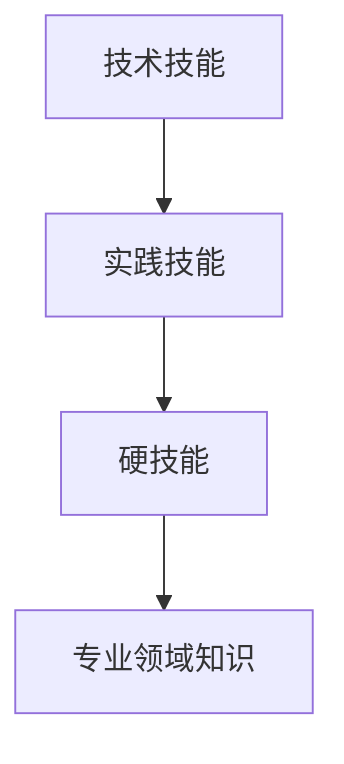

                 

# 技术技能：圆满完成工作需要的实践技能，即“硬技能”，深度的专业领域知识仍然是你的看家本领

> 关键词：技术技能, 实践技能, 硬技能, 专业领域知识, 职业发展, 技术栈, 实战能力

## 1. 背景介绍

### 1.1 问题由来
在当今数字化时代，技术技能已经成为各行各业人才的核心竞争力。对于从事软件开发、数据分析、人工智能等领域的工程师而言，掌握扎实的技术技能不仅是进入行业的基础，更是持续职业发展的关键。然而，技术技能的掌握并非一蹴而就，它需要系统的学习、大量的实践和不断的更新。

### 1.2 问题核心关键点
技术技能的核心关键点在于其对实践能力的要求。技术技能不仅包括理论知识的积累，更在于将理论知识应用于实际问题的解决。它要求工程师具备解决复杂问题、优化系统性能、提升代码质量等实际工作的能力。此外，技术技能还需要不断更新，以适应技术和市场的快速变化。

### 1.3 问题研究意义
研究技术技能的提升方法，对于工程师的成长和行业的发展具有重要意义：

1. **提升个人能力**：通过掌握和提升技术技能，工程师可以更好地解决实际问题，提高工作效率，增强职业竞争力。
2. **推动行业进步**：技术技能是技术创新的基石，掌握先进的技术技能可以推动整个行业的发展，提升产品和服务质量。
3. **促进知识传播**：分享和传播技术技能可以帮助更多人学习新技术，加速技术的普及和应用。

## 2. 核心概念与联系

### 2.1 核心概念概述

为了更好地理解技术技能的核心概念和应用，本节将介绍几个密切相关的核心概念：

- **技术技能**：指工程师在软件开发、数据分析、人工智能等领域所具备的专业知识和实操能力，包括编程语言、框架、算法、工具等。
- **实践技能**：指将理论知识应用于实际问题解决的能力，包括问题分析、需求理解、代码编写、系统优化等。
- **硬技能**：指可以直接应用于具体技术工作的专业知识和技能，与软技能（如沟通、协作等）相对。
- **专业领域知识**：指某一特定技术领域内的理论知识和技术细节，如数据结构与算法、机器学习、云计算等。

这些概念之间的逻辑关系可以通过以下Mermaid流程图来展示：



这个流程图展示出技术技能、实践技能、硬技能和专业领域知识之间的关联：

1. 技术技能是基础，包括专业知识和技术工具。
2. 实践技能是将理论知识应用于实际问题的能力，是技术技能的直接应用。
3. 硬技能是实践技能的一部分，是具体技术工作的直接执行能力。
4. 专业领域知识是技术技能的核心，是实践技能和硬技能的基础。

## 3. 核心算法原理 & 具体操作步骤
### 3.1 算法原理概述

技术技能的学习和提升，本质上是通过系统的学习和实践，不断更新和完善自己的知识体系和技能水平。这一过程可以概括为以下几个步骤：

1. **理论学习**：通过阅读书籍、观看视频、参加培训等方式，系统地学习相关领域的理论知识。
2. **实践操作**：通过编写代码、解决问题、调试系统等方式，将理论知识应用于实际问题。
3. **持续更新**：通过参与项目、阅读最新文献、参加技术交流等方式，不断更新和完善自己的技术栈。

### 3.2 算法步骤详解

基于上述步骤，技术技能的学习和提升可以分为以下几个关键阶段：

#### 3.2.1 理论学习阶段

- **选择学习资源**：根据目标领域，选择合适的书籍、课程、视频等学习资源。
- **制定学习计划**：根据时间、能力和兴趣，制定合理的学习计划，逐步深入学习。
- **掌握基础知识**：从基础概念、语法、原理等入手，建立扎实的理论基础。

#### 3.2.2 实践操作阶段

- **动手编写代码**：选择或创建实际项目，编写代码实现功能。
- **解决问题**：遇到问题时，通过阅读文档、搜索资料、调试程序等方式，逐步解决。
- **优化系统性能**：通过代码优化、算法改进、系统调优等方式，提升系统性能和效率。

#### 3.2.3 持续更新阶段

- **参与项目实践**：加入实际项目，参与团队协作，积累实战经验。
- **阅读最新文献**：关注技术社区、学术会议等，了解最新的技术进展。
- **参加技术交流**：参加技术分享会、技术博客、开源社区等，分享经验，学习他人的成功经验。

### 3.3 算法优缺点

技术技能的学习和提升方法具有以下优点：

- **系统性**：通过系统的理论学习和实践操作，可以建立全面的知识体系。
- **实用性**：所学技能可以直接应用于实际问题，提升工作效率。
- **自我驱动**：自主学习和实践的过程，可以激发个人的主动性和创造力。

同时，这些方法也存在一些局限性：

- **时间成本高**：系统学习需要大量的时间和精力投入，可能影响其他工作。
- **挑战大**：学习过程中会遇到各种问题，需要持续付出努力。
- **变化快**：技术领域更新迅速，需要不断学习新知识。

尽管如此，系统学习和实践操作仍然是提升技术技能的最有效方法，也是行业内广泛采用的实践路径。

### 3.4 算法应用领域

技术技能的学习和提升方法在各个技术领域都有广泛应用，以下是几个典型应用场景：

- **软件开发**：通过学习编程语言、框架、算法等，掌握软件开发的技能，实现各类应用。
- **数据分析**：通过学习数据处理、机器学习、统计分析等技能，进行数据挖掘和业务分析。
- **人工智能**：通过学习深度学习、计算机视觉、自然语言处理等技能，开发智能系统。
- **系统优化**：通过学习系统架构、网络协议、性能优化等技能，提升系统性能和稳定性。
- **项目管理**：通过学习项目管理、团队协作、沟通技巧等技能，有效管理项目进度和团队合作。

这些应用场景展示了技术技能在不同领域的重要性和广泛性，也反映了技术技能学习的重要性和必要性。

## 4. 数学模型和公式 & 详细讲解 & 举例说明

### 4.1 数学模型构建

技术技能的学习和提升，往往涉及多种数学模型和公式。以下以软件开发为例，构建一个简单的数学模型：

假设有一个简单的程序，需要计算两个数的和。我们可以用以下的数学模型来描述这一过程：

$$
S(x,y) = x + y
$$

其中，$x$ 和 $y$ 是输入的两个数字，$S$ 是程序计算的结果。

### 4.2 公式推导过程

根据上述模型，我们可以推导出计算过程：

$$
S(x,y) = x + y
$$

将 $x$ 和 $y$ 代入程序中，计算得到结果。这一过程展示了将数学模型应用于实际编程的简单示例。

### 4.3 案例分析与讲解

假设我们要编写一个计算平均值的程序，可以使用以下数学模型：

$$
M(x_1, x_2, ..., x_n) = \frac{x_1 + x_2 + ... + x_n}{n}
$$

其中，$x_1, x_2, ..., x_n$ 是输入的 $n$ 个数字，$M$ 是程序计算的结果。

通过这一模型，我们可以编写一个计算平均值的函数，实现对输入数字的平均值计算。这一案例展示了数学模型在编程中的应用，也展示了技术技能的学习和应用过程。

## 5. 项目实践：代码实例和详细解释说明

### 5.1 开发环境搭建

在进行技术技能的学习和提升时，开发环境的选择和搭建非常重要。以下是使用Python进行软件开发的环境配置流程：

1. **安装Python**：从官网下载并安装Python，选择合适的版本。
2. **安装IDE**：选择Visual Studio Code、PyCharm、Jupyter Notebook等IDE工具，配置开发环境。
3. **安装开发库**：安装常用的Python开发库，如numpy、pandas、scikit-learn等。
4. **配置版本控制**：使用Git等版本控制工具，管理代码版本和协作开发。

完成上述步骤后，即可在开发环境中进行软件开发。

### 5.2 源代码详细实现

以下是一个计算平均值的Python代码实现：

```python
def average(numbers):
    total = sum(numbers)
    count = len(numbers)
    return total / count
```

在这个代码中，我们定义了一个函数 `average`，接收一个数字列表 `numbers` 作为输入，计算并返回平均值。

### 5.3 代码解读与分析

我们可以对上述代码进行详细解读和分析：

- **函数定义**：使用 `def` 关键字定义函数 `average`，接收一个数字列表 `numbers` 作为输入。
- **计算总和**：使用 `sum` 函数计算输入数字的总和。
- **计算平均值**：将总和除以数字个数，得到平均值。
- **返回结果**：使用 `return` 关键字返回计算结果。

### 5.4 运行结果展示

我们可以通过以下代码测试函数的运行结果：

```python
numbers = [1, 2, 3, 4, 5]
result = average(numbers)
print(result)
```

运行结果为 `3.0`，即输入数字的平均值。

## 6. 实际应用场景

### 6.1 智能推荐系统

技术技能在智能推荐系统中的应用，可以通过数据分析和机器学习算法实现。通过学习推荐系统的设计和实现，工程师可以掌握如何利用用户行为数据，为用户推荐个性化内容。

### 6.2 自动化测试

自动化测试是软件开发中的重要环节，通过学习自动化测试框架和技术，工程师可以编写测试用例，自动化测试软件的各个功能，提高测试效率和准确性。

### 6.3 数据分析

数据分析是技术技能的重要应用领域之一，通过学习数据处理、机器学习、统计分析等技能，工程师可以分析和挖掘数据中的有价值信息，为业务决策提供支持。

### 6.4 未来应用展望

随着技术领域的不断发展和创新，技术技能的应用前景将更加广阔。未来的技术技能将更加注重跨领域的融合和应用，如人工智能与大数据、云计算与物联网等。此外，技术技能还将更加注重软技能的提升，如团队协作、项目管理等。

## 7. 工具和资源推荐

### 7.1 学习资源推荐

为了帮助工程师系统掌握技术技能，以下是几个优质的学习资源：

- **Coursera**：提供来自全球顶尖大学的在线课程，涵盖计算机科学、数据科学、人工智能等多个领域。
- **LeetCode**：提供编程算法题库，通过解决实际问题，提升编程能力和解决问题的能力。
- **GitHub**：全球最大的开源社区，提供丰富的项目代码和技术文档，学习和分享最新技术。
- **Stack Overflow**：技术问答社区，提供丰富的技术讨论和解决方案，解决技术难题。

### 7.2 开发工具推荐

高效的工具是技术技能学习的重要保障。以下是几个常用的开发工具：

- **Visual Studio Code**：轻量级的IDE工具，支持多种编程语言和扩展。
- **PyCharm**：Python开发 IDE，提供代码编写、调试、测试等功能。
- **Git**：版本控制工具，支持多人协作开发。
- **Jupyter Notebook**：交互式编程环境，支持数据处理、科学计算、数据分析等。

### 7.3 相关论文推荐

技术技能的提升离不开前沿技术的支持和指导。以下是几篇重要的相关论文：

- **《The Elements of Computing Systems》**：清华大学出版社，讲述计算机原理和算法，是计算机科学入门的经典教材。
- **《Deep Learning》**：Ian Goodfellow等著，全面介绍深度学习理论和应用，是人工智能领域的经典著作。
- **《Clean Code》**：Robert C. Martin著，讲述编程规范和设计原则，提升代码质量和可维护性。
- **《Design Patterns》**：Erich Gamma等著，介绍设计模式，提升软件设计和架构能力。

## 8. 总结：未来发展趋势与挑战

### 8.1 总结

本文对技术技能的学习和提升方法进行了全面系统的介绍。首先阐述了技术技能在职业发展中的重要性，明确了学习理论知识和实操技能的重要性。其次，从原理到实践，详细讲解了技术技能的学习和提升过程，给出了具体的代码实现和案例分析。同时，本文还广泛探讨了技术技能在各个技术领域的应用前景，展示了技术技能学习的重要性和必要性。

通过本文的系统梳理，可以看到，技术技能的学习和提升方法不仅适用于软件开发领域，更适用于数据科学、人工智能等多个技术领域。掌握扎实的技术技能，将帮助工程师在职业发展中更加游刃有余，不断提升自己的职业竞争力。

### 8.2 未来发展趋势

展望未来，技术技能的发展将呈现以下几个趋势：

1. **跨领域融合**：技术技能将更加注重跨领域的融合，如人工智能与大数据、云计算与物联网等。
2. **软技能提升**：技术技能的发展将更加注重软技能的提升，如团队协作、项目管理等。
3. **持续学习**：技术领域发展迅速，持续学习和更新将是技术技能提升的关键。
4. **自动化和智能化**：自动化和智能化技术将进一步提升技术技能的应用效率和质量。
5. **伦理和安全**：技术技能的提升将更加注重伦理和安全问题，如数据隐私、算法偏见等。

这些趋势展示了技术技能的发展方向，也反映了技术技能学习的重要性和必要性。

### 8.3 面临的挑战

尽管技术技能的学习和提升方法在各行各业中得到了广泛应用，但在实际应用中也面临诸多挑战：

1. **时间成本高**：系统学习需要大量的时间和精力投入，可能影响其他工作。
2. **挑战大**：学习过程中会遇到各种问题，需要持续付出努力。
3. **变化快**：技术领域更新迅速，需要不断学习新知识。
4. **软技能不足**：技术技能的学习往往注重技术细节，而忽视软技能培养。
5. **数据隐私问题**：在处理数据时，需要关注数据隐私和安全问题。

尽管如此，技术技能的学习和提升仍然是提升职业竞争力和行业发展的重要手段。通过不断学习新技术、提升软技能、关注数据隐私等问题，工程师将更好地适应技术领域的快速变化和需求。

### 8.4 研究展望

未来，技术技能的研究将在以下几个方面进行探索：

1. **教育与培训**：通过教育与培训，提升工程师的技术技能和软技能。
2. **开源与社区**：推动开源社区的发展，分享和传播技术技能。
3. **前沿研究**：研究前沿技术和算法，推动技术领域的发展。
4. **跨领域应用**：探索技术技能在跨领域的应用，推动技术创新的融合。
5. **伦理与安全**：研究技术技能的伦理和安全问题，提升技术应用的社会责任。

这些研究方向将为技术技能的提升和应用提供新的思路和方法，推动技术技能在各个技术领域的发展。

## 9. 附录：常见问题与解答

**Q1：技术技能是否需要系统的学习和实践？**

A: 是的，技术技能的学习和提升需要系统的理论学习和实践操作。只有通过系统学习，才能建立扎实的理论基础和全面的知识体系。同时，通过实践操作，将理论知识应用于实际问题，可以更好地理解知识的内涵和应用场景。

**Q2：如何高效提升技术技能？**

A: 高效提升技术技能的方法包括：
1. **制定学习计划**：根据时间、能力和兴趣，制定合理的学习计划，逐步深入学习。
2. **动手编写代码**：选择或创建实际项目，编写代码实现功能。
3. **参与项目实践**：加入实际项目，参与团队协作，积累实战经验。
4. **阅读最新文献**：关注技术社区、学术会议等，了解最新的技术进展。
5. **参加技术交流**：参加技术分享会、技术博客、开源社区等，分享经验，学习他人的成功经验。

**Q3：学习技术技能是否需要不断更新？**

A: 是的，技术领域发展迅速，不断更新和完善技术栈是提升技术技能的关键。学习新技术、掌握新工具、关注新趋势，可以帮助工程师保持技术领先，适应行业变化。

**Q4：技术技能是否需要跨领域融合？**

A: 是的，技术技能的提升需要跨领域的融合。不同领域的技术技能可以相互借鉴，实现更全面的技能提升。例如，将人工智能与大数据、云计算与物联网等技术结合，可以提升技术技能的应用范围和深度。

**Q5：技术技能的学习和提升是否需要关注伦理和安全问题？**

A: 是的，技术技能的学习和提升需要关注伦理和安全问题。在处理数据时，需要关注数据隐私、算法偏见等问题，确保技术应用的合规性和安全性。

---

作者：禅与计算机程序设计艺术 / Zen and the Art of Computer Programming

